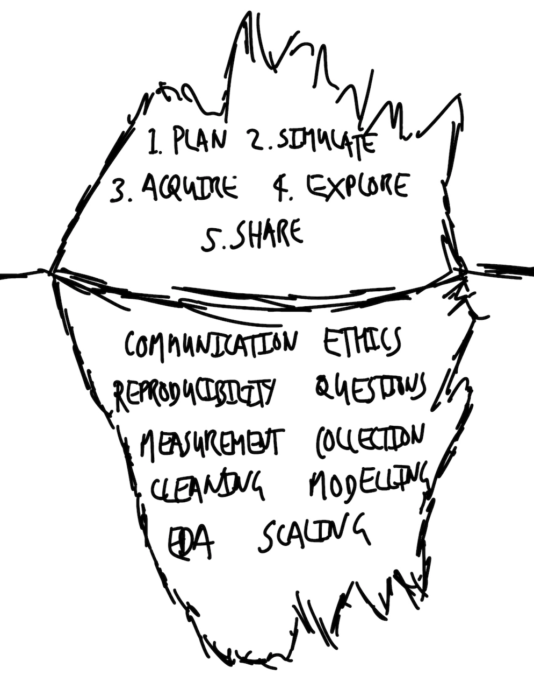

# 데이터로 이야기하기 {#sec-introduction}

::: {.callout-note}
채프먼 앤 홀/CRC(Chapman and Hall/CRC)에서 2023년 7월에 이 책을 출간했습니다. [여기](https://www.routledge.com/Telling-Stories-with-Data-With-Applications-in-R/Alexander/p/book/9781032134772)에서 도서를 구매하실 수 있습니다. 본 온라인 버전에는 인쇄본 출간 이후의 일부 업데이트 사항이 반영되어 있습니다.
:::

**권장 학습 자료**

- *데이터로 바꿀 수 없는 것들을 세기(Counting what doesn't count)* 읽기, [@keyes2019]
  - 이 기사는 세상을 데이터로 변환하는 과정의 어려움을 다룹니다.
- *주방 카운터 천문대(Kitchen Counter Observatory)* 읽기, [@kieranskitchen]
  - 데이터가 무엇을 숨기고 무엇을 드러내는지에 대한 논의입니다.
- *6분 완성 데이터 과학 윤리(Data Science Ethics in 6 Minutes)* 시청, [@register2020]
  - 윤리와 데이터 과학을 건설적으로 통합하는 방법을 소개하는 영상입니다.
- *코드란 무엇인가?(What is Code?)* 읽기, [@nottomford]
  - 코드의 역할에 대해 개괄적으로 설명하며, 처음 세 섹션에 집중해서 읽어보시기 바랍니다.

## 이야기하기(Storytelling)에 대하여

부모가 아이에게 가장 먼저 해주는 일 중 하나는 정기적으로 이야기를 읽어주는 것입니다. 이는 수천 년 동안 이어져 온 인류의 전통입니다. 신화, 우화, 동화는 우리 주변 어디에나 존재하며, 단순히 재미를 넘어 우리가 세상을 배우는 데 도움을 줍니다. 에릭 칼(Eric Carle)의 *배고픈 애벌레*가 데이터를 다루는 현대 사회와는 거리가 멀어 보일 수 있지만, 그 본질에는 유사점이 있습니다. 둘 다 '이야기를 전달함'으로써 '지식을 전수'하는 것을 목표로 하기 때문입니다.

데이터를 다룰 때 우리는 설득력 있는 이야기를 들려주려 노력합니다. 그 이야기는 선거 결과 예측처럼 흥미진진할 수도 있고, 인터넷 광고 클릭률을 높이는 것처럼 평범할 수도 있으며, 질병의 원인을 규명하는 것처럼 엄중하거나 농구 경기 결과를 맞히는 것처럼 즐거울 수도 있습니다. 어떤 경우든 핵심 요소는 동일합니다. 20세기 초 영국의 소설가 E. M. 포스터(E. M. Forster)는 소설의 공통 측면을 이야기, 인물, 줄거리, 환상, 예언, 패턴, 리듬으로 묘사했습니다 [@forster]. 이와 마찬가지로, 분야를 막론하고 데이터를 통해 이야기를 전달할 때 우리가 공통으로 주목해야 할 질문들이 있습니다.

1. 이 데이터셋은 무엇인가? 누가, 왜 이 데이터를 생성했는가?
2. 이 데이터셋을 뒷받침하는 기반 프로세스는 무엇인가? 그 프로세스를 고려할 때, 데이터셋에서 빠진 것이나 제대로 측정되지 않은 것은 무엇인가? 만약 다른 데이터셋을 생성했다면 현재 가진 데이터와 얼마나 달랐을까?
3. 데이터셋은 무엇을 말하고 있는가? 그리고 어떻게 하면 데이터가 스스로 말하게 할 수 있을까? 또 무엇을 더 말할 수 있을까? 다양한 가능성 사이에서 우리는 어떻게 의사결정을 내리는가?
4. 우리는 이 데이터셋을 통해 타인에게 무엇을 보여주고 싶어 하며, 어떻게 그들을 설득할 수 있는가? 설득을 위해 어느 정도의 노력을 기울여야 하는가?
5. 이 데이터셋과 관련된 프로세스 및 결과로 인해 누가 영향을 받는가? 그들은 데이터셋에 충분히 반영되었는가? 또한 분석 과정에 참여했는가?

과거에는 데이터를 사용하여 이야기를 전달하는 작업의 특정 단계들이 상대적으로 수월했습니다. 예를 들어, 농학, 의학, 물리학, 화학 분야에서는 실험 설계(Experimental design)에 대한 길고 확고한 전통이 있습니다. '학생의 t-분포(Student's t-distribution)'는 1900년대 초 기네스(Guinness) 양조장에서 일하던 화학자 윌리엄 실리 고셋(William Sealy Gosset)에 의해 정립되었습니다 [@boland1984biographical]. 그에게 맥주 샘플을 무작위로 추출하고 한 번에 한 가지 변인만 바꾸는 실험은 비교적 단순한 작업이었을 것입니다.

우리가 오늘날 사용하는 통계학 방법론의 많은 기본 원칙이 바로 이러한 정교한 통제 환경에서 발전했습니다. 당시에는 대조군을 설정하고 무작위 배정을 수행하는 것이 가능했으며, 윤리적 문제도 비교적 적었습니다. 그렇게 얻은 데이터로 전달되는 이야기는 매우 강력한 설득력을 가졌습니다.

하지만 오늘날 통계 방법론이 적용되는 복잡한 환경을 고려할 때, 실험 환경의 단순함이 그대로 적용되는 경우는 거의 없습니다. 물론 현대의 분석가들에게는 고도로 발달한 통계 기법, 방대한 데이터셋에 대한 접근성, R과 Python 같은 강력한 오픈 소스 언어라는 이점이 있습니다. 하지만 전통적인 방식의 엄격한 실험을 수행하기 어려워졌다는 사실은, 우리가 설득력 있는 이야기를 전달하기 위해 데이터의 또 다른 측면들에 더 깊이 의존해야 함을 의미합니다.

## 워크플로우(Workflow)의 구성 요소

데이터로 이야기를 전달하는 과정에는 다섯 가지 핵심 워크플로우 구성 요소가 있습니다.

1. **계획(Plan)**: 최종 목적지를 스케치합니다.
2. **시뮬레이션(Simulate)**: 시뮬레이션된 데이터를 통해 가능성을 타진합니다.
3. **획득(Acquire)**: 실제 데이터를 확보하고 준비합니다.
4. **탐색(Explore)**: 실제 데이터를 조사하고 이해합니다.
5. **공유(Share)**: 수행한 작업과 발견한 통찰을 세상과 나눕니다.

우리는 가장 먼저 **최종 목적지를 계획하고 스케치**하는 것부터 시작합니다. 이는 우리가 어디로 가고자 하는지 신중하게 고민하게 만들기 때문입니다. 이 과정은 우리가 처한 상황을 깊이 있게 통찰하도록 강요하며, 분석의 초점을 잃지 않고 효율적으로 유지되도록 돕고, 업무 범위가 감당할 수 없이 넓어지는 '스코프 크립(Scope creep)'을 방지합니다. 루이스 캐럴(Lewis Carroll)의 *이상한 나라의 앨리스*에서 앨리스는 체셔 고양이에게 어디로 가야 할지 묻습니다. 고양이가 앨리스에게 어디로 가고 싶은지 되묻자, 앨리스는 어디든 상관없다고 답합니다. 그러자 고양이는 "충분히 오래 걷기만 하면" 어디에든 도착할 테니 방향은 중요하지 않다고 말합니다. 하지만 우리의 문제는 목적 없이 오랫동안 방황할 시간이 없다는 것입니다. 분석 과정에서 최종 목적지가 바뀔 수는 있지만, 그것은 반드시 의도적이고 합리적인 결정이어야 합니다. 그리고 이는 초기 목표가 설정되어 있을 때만 가능합니다. 이 단계에 너무 많은 시간을 쏟을 필요는 없습니다. 대개 종이와 펜으로 10분 정도만 투자해도 충분한 가치를 얻을 수 있습니다.

다음 단계는 **데이터를 시뮬레이션**하는 것입니다. 이 과정은 우리를 구체적인 세부 사항으로 이끕니다. 데이터셋의 구조(Class)와 예상되는 값의 분포에 집중하게 함으로써 이후 데이터 정리 및 준비 작업을 훨씬 수월하게 만들어줍니다. 예를 들어, 연령대가 정치적 성향에 미치는 영향에 관심이 있다면, 연령 변수가 '18-29', '30-44', '45-59', '60+'라는 네 가지 값을 가진 범주형 데이터(Factor)일 것이라고 예상할 수 있습니다. 시뮬레이션 프로세스는 실제 데이터가 갖추어야 할 명확한 기준을 제시합니다. 이러한 기준을 바탕으로 데이터 정리 작업을 안내할 '테스트'를 정의할 수 있습니다. 예를 들어, 실제 데이터에서 이 네 가지 범주에 해당하지 않는 연령값이 발견된다면 이를 걸러낼 수 있습니다. 이러한 테스트를 통과하면 연령 변수가 우리가 의도한 대로 구성되었다고 확신할 수 있습니다.

데이터 시뮬레이션은 통계 모델링 단계에서도 매우 중요합니다. 모델링의 핵심은 "이 모델이 데이터의 실체를 제대로 반영하고 있는가?"를 확인하는 것입니다. 실제 데이터를 곧바로 모델에 넣으면 모델 자체에 결함이 있는지 판단하기가 매우 어렵습니다. 하지만 우리가 직접 시뮬레이션한 데이터는 그 생성 원리를 100% 알고 있습니다. 여기에 모델을 적용했을 때 우리가 입력한 특성들이 정확히 결과로 도출된다면, 해당 모델이 올바르게 설계되었음을 확신할 수 있고 비로소 실제 데이터로 넘어갈 수 있습니다.

시뮬레이션은 비용이 거의 들지 않습니다. 현대의 컴퓨팅 자원과 프로그래밍 언어를 활용하면 사실상 무료이며, 속도 또한 매우 빠릅니다\index{simulation}. 이는 분석가에게 연구 상황에 대한 "친밀한 감각"을 부여합니다 [@hamming1996, p. 239]. 우선 핵심 요소만 포함된 단순한 시뮬레이션으로 시작하여 모델을 작동시킨 후, 점차 복잡성을 더해가는 방식을 권장합니다.

관심 있는 **데이터를 획득하고 준비**하는 과정은 흔히 간과되곤 하지만, 실제로는 데이터 과학 워크플로우에서 가장 중요한 단계 중 하나입니다. 이 단계는 매우 까다로우며 수많은 결정 사항을 포함하고 있습니다. 최근에는 이 과정 자체가 연구의 대상이 되기도 하며, 데이터 획득 및 준비 과정에서 내린 결정들이 최종 통계 분석 결과에 상당한 영향을 미칠 수 있다는 사실이 입증되고 있습니다 [@huntington2021influence; @AhadyDolatsara2021; @Gould2023].

이 단계에서는 흔히 막막함이나 두려움을 느끼기도 합니다. 우리가 마주하는 데이터는 때로 너무 적어서 어떻게 분석을 시작해야 할지 고민스럽게 만들거나, 반대로 너무 방대해서 어디서부터 손을 대야 할지 엄두가 나지 않게 만들기도 합니다.

> 어쩌면 우리 삶의 모든 용(dragon)은, 우리가 단 한 번만이라도 아름다움과 용기를 보여주기를 기다리고 있는 공주일지도 모릅니다. 어쩌면 우리를 공포에 떨게 하는 모든 것은, 그 깊은 본질에서 우리의 사랑을 갈구하는 무력한 존재일지도 모릅니다.
>
> @rilke

이 단계에서 숙련도를 쌓게 되면 이후의 과정들이 원활하게 풀리기 시작합니다. 설득력 있는 이야기를 만드는 데 필요한 핵심 데이터는 바로 그 혼돈 속에 숨어 있습니다. 우리는 마치 조각가처럼, 불필요한 데이터를 거듭 걷어내고 우리가 필요로 하는 형상으로 데이터를 다듬어 나가야 합니다.

데이터셋을 확보한 후에는 변수들 간의 관계를 **탐색하고 이해**하는 과정이 필요합니다. 보통 기술 통계(Descriptive statistics)로 시작하여 점차 통계 모델링으로 나아갑니다. 하지만 통계 모델을 통해 데이터의 함의를 파악하는 작업 역시 편향에서 자유로울 수 없으며, 그것이 곧 절대적인 "진술"인 것도 아닙니다. 모델은 결국 분석가가 지시한 대로만 작동할 뿐이기 때문입니다\index{model!role}. 데이터를 통해 이야기를 전달할 때 통계 모델은 도표나 그래프와 마찬가지로 데이터를 탐색하기 위한 하나의 도구이자 접근 방식일 뿐입니다. 모델이 결정적인 정답을 내놓지는 않지만, 우리가 데이터를 특정 관점에서 더 명확하게 이해할 수 있도록 돕는 역할을 합니다.

이 워크플로우를 따라가다 보면, 최종 모델은 데이터 자체의 특성뿐만 아니라 우리가 데이터를 획득하고 정리하는 초기 단계에서 내린 수많은 결정의 산물임을 알게 될 것입니다. 노련한 분석가는 자신이 만든 통계 모델이 수면 위에 드러난 빙산의 일각에 불과하다는 점을 잘 알고 있습니다. 그 모델은 보이지 않는 수면 아래에 존재하는 방대한 데이터와 그에 대한 고민 덕분에 지탱되고 있는 것입니다. 전체 데이터 과학 워크플로우의 전문가는 모델링 결과가 '누구의 데이터가 중요한가?', '데이터를 어떻게 측정하고 기록할 것인가?'라는 선택, 그리고 데이터가 분석 도구에 입력되기 훨씬 전에 세상을 반영하고 있던 다양한 맥락들에 의해 결정된다는 사실을 명확히 인지합니다\index{data science!workflow}.

마지막으로, 우리가 수행한 작업과 그 결과물을 가능한 한 높은 충실도로 **공유**해야 합니다. 자신만 알고 있는 지식은 진정한 가치를 발휘하기 어렵습니다. 여기에는 '과거의 나'만 알고 현재의 나는 잊어버린 지식도 포함됩니다. 우리가 내린 결정과 그 이유, 발견한 사실들, 그리고 우리 접근 방식이 가진 한계를 명확하게 전달해야 합니다. 우리는 진실을 밝히려는 노력을 기울이고 있으므로, 처음에는 모든 과정을 상세히 기록해야 합니다. 이 서면 기록은 나중에 발표나 시각화 등 다양한 소통 방식으로 확장될 수 있습니다. 워크플로우의 매 순간마다 수많은 선택이 개입되므로, 통계 모델링은 물론 도표를 만드는 사소한 과정까지도 투명하게 공개해야 합니다. 이러한 투명성이 뒷받침되지 않는 데이터 기반의 이야기는 신뢰를 얻기 어렵습니다.

우리가 살아가는 세상은 모든 것이 합리적이고 현명하게 평가되는 완벽한 능력주의 사회가 아닙니다. 대신 우리는 경험에 기반한 지름길이나 편법, 휴리스틱(Heuristics)을 사용하곤 합니다. 따라서 아무리 뛰어난 분석이라도 불친절하고 모호하게 전달된다면 그 가치를 인정받기 어렵습니다. 의사소통에는 최소한의 형식이 존재하지만, 그 수준을 높이는 데는 한계가 없습니다. 잘 설계된 워크플로우가 정점에 도달하면, 의도적인 무심함 혹은 우아함을 뜻하는 '스프레차투라(Sprezzatura)'의 경지에 이를 수도 있습니다. 이러한 숙달은 수년간의 노력을 통해 비로소 얻어지는 결과물입니다.

## 데이터로 이야기하기

데이터를 기반으로 한 설득력 있는 이야기는 대략 10~20페이지 분량으로 전달될 때 가장 효과적입니다. 그보다 짧으면 세부 사항이 부족할 가능성이 높고, 훨씬 더 길어지면 독자의 집중력을 잃기 쉽습니다. 대개 간결하게 다듬거나 여러 개의 개별적인 이야기로 분리하는 것이 좋습니다.

전통적인 실험을 수행할 수 없는 상황에서도 충분히 설득력 있는 이야기를 만들 수 있습니다. 이러한 접근 방식은 무조건 "빅 데이터(Big Data)"에만 의존하는 것이 아니라 (빅 데이터가 모든 문제의 해결책은 아닙니다 [@meng2018statistical; @Bradley2021]), 가용한 데이터를 최대한 효율적으로 활용하는 데 중점을 둡니다. 철저한 연구와 학습, 이론과 응용의 조화, 그리고 실전 기술과 정교한 워크플로우가 결합될 때 비로소 가치 있는 지식이 창출됩니다.

데이터 기반의 훌륭한 이야기는 학제 간 융합적인 성격을 띱니다. 통계학\index{statistics}, 소프트웨어 공학\index{software engineering}, 경제학\index{economics}, 그리고 공학\index{engineering} 등 다양한 분야의 기술을 적재적소에 혼합해야 합니다. 이러한 역량을 기르는 가장 좋은 방법은 실제 데이터를 사용하여 다음과 같은 연구 프로젝트를 직접 수행해 보는 것입니다.

- 연구 질문 개발
- 관련 데이터셋 획득 및 정리
- 질문에 답하기 위한 데이터 탐색
- 의미 있는 방식으로 소통 및 전달

데이터로 설득력 있는 이야기를 전달하는 핵심 요소는 다음과 같습니다.

1. 커뮤니케이션 (Communication)
2. 재현성 (Reproducibility)
3. 윤리 (Ethics)
4. 질문 (Questions)
5. 측정 (Measurement)
6. 데이터 수집 (Data collection)
7. 데이터 정리 (Data cleaning)
8. 탐색적 데이터 분석 (Exploratory Data Analysis, EDA)
9. 모델링 (Modeling)
10. 스케일링 (Scaling)

이러한 요소들은 '올바른 연구 수행(윤리, 질문)', '신뢰할 수 있는 답변 도출(측정, 수집, 정리, EDA, 모델링)', '설득력 있는 설명 생성(커뮤니케이션, 재현성, 스케일링)'이라는 범주로 묶일 수 있습니다. 이 요소들은 견고한 워크플로우를 지탱하는 기반이 됩니다(@fig-iceberg).

{#fig-iceberg width=70% fig-align="center"}

익혀야 할 내용이 많지만, 그중에서도 **커뮤니케이션**이 가장 중요합니다. 단순한 분석이라도 명확하게 전달하는 것이, 아무도 신뢰하거나 이해할 수 없는 복잡한 분석보다 훨씬 가치 있습니다. 의사소통이 불분명하다는 것은 때로 연구자 본인조차 자신이 무엇을 하고 있는지 완벽히 이해하지 못하고 있음을 반영하기도 합니다. 따라서 분석 수위는 데이터셋과 도구, 본인의 기술 수준에 맞춰야 하며, 명확성과 정교함 사이에서 선택해야 한다면 언제나 명확성을 우선해야 합니다.

명확한 커뮤니케이션이란 도표, 그래프, 모델의 도움을 받아 평이한 언어로 독자의 눈높이에 맞춰 서술하는 것을 말합니다. 무엇을 왜 했는지, 그리고 무엇을 발견했는지 명확히 설명해야 합니다. 최소한의 기준은 '다른 사람이 내가 한 과정을 그대로 따라 했을 때 동일한 발견을 할 수 있는가'입니다. 데이터에 깊이 몰입하다 보면 처음 데이터를 접했을 때의 낯선 느낌을 잊기 쉽지만, 대부분의 청중은 바로 그 지점에서 시작한다는 사실을 기억해야 합니다.

**재현성**은 지식이 지속적인 가치를 갖기 위해 필수적입니다. 이는 데이터 획득부터 최종 결과 도출까지 모든 과정이 독립적으로 재실행될 수 있어야 함을 뜻합니다. 이상적인 형태는 누구나 코드와 데이터, 환경 설정을 확보하여 모든 과정을 직접 검증할 수 있는 '엔드투엔드(End-to-end) 재현성'입니다 [@heil2021reproducibility]. 코드는 투명하게 공개되어야 하며, 데이터 역시 개인정보 보호 등 특별한 사유가 없는 한 공유되는 것이 원칙입니다.

데이터셋은 사람과 관련된 경우가 많으므로 **윤리**에 대한 적극적인 고려가 필요합니다. 누가 데이터에 포함되고 누가 누락되었는지, 그리고 그 이유는 무엇인지 끊임없이 질문해야 합니다\index{ethics!missing data}\index{data!ethics of missing data}. 연구 결과가 과거의 편향을 고착화하지는 않는지, 환경과 불평등 문제에 부정적인 영향을 미치지는 않는지 비판적으로 검토해야 할 책임이 우리에게 있습니다.

윤리란 단순히 법을 지키는 것을 넘어 데이터셋의 전체 맥락을 고려하는 것을 의미합니다 [@datafeminism2020]. 법을 해석할 때 문구 그대로를 따르는 '텍스트 중심주의'가 있는 반면, 법의 취지와 사회적 맥락을 고려하는 '목적 중심 접근'이 있습니다. 데이터 과학의 윤리적 접근 방식은 후자에 가깝습니다. 즉, 우리 세상을 형성하는 사회적, 문화적, 역사적, 정치적 역학 관계가 데이터에 어떻게 투영되어 있는지 고민해야 합니다 [@crawford]\index{data science!ethics}.

호기심은 데이터셋과 그 생성 과정을 깊이 있게 탐색하게 만드는 내적 동기입니다. **질문**은 또 다른 질문을 낳으며, 데이터셋을 이해하는 과정이 반복됨에 따라 질문은 계속해서 정교해지고 발전합니다. 흔히 교과서에서 다루는 가설 검정의 포퍼주의적(Popperian) 접근법과는 달리, 실제 연구에서의 질문은 지속적이고 진화하는 탐색 과정을 통해 형성됩니다 [@franklin2005exploratory]. 처음부터 좋은 질문을 던지는 것은 쉽지 않습니다. 특히 추상적인 연구 질문을 실제로 측정 가능한 변수들로 구체화(Operationalize)하는 작업은 매우 어렵습니다. 관심 있는 분야를 먼저 선택하고, 광범위한 아이디어를 스케치한 뒤 이를 구체적인 질문으로 좁혀나가는 연습이 필요합니다. 서로 다른 두 영역의 아이디어를 결합하는 것도 좋은 방법입니다.

실제 데이터의 복잡함과 불확실성에 익숙해지면, 데이터가 업데이트될 때마다 새로운 질문을 던질 수 있는 능력이 생깁니다. 데이터셋을 세밀하게 관찰하다 보면 예상치 못한 데이터의 쏠림(Grouping)이나 이상값 등을 발견하게 되는데, 이를 해당 분야의 전문가와 협력하여 풀어나가는 과정은 큰 가치가 있습니다. 다양한 영역의 지식을 결합해 일종의 '하이브리드' 전문가가 되는 것이 중요하며, 처음에는 다소 엉뚱해 보이는 질문이라도 기꺼이 던질 수 있는 용기가 필요합니다.

**측정**과 **데이터 수집**은 우리 세상을 어떻게 데이터라는 숫자로 치환할 것인가를 결정하는 핵심 단계입니다. 이 과정은 매우 어렵습니다\index{measurement}\index{data!collection}. 우리 세상은 너무나 입체적이고 역동적이어서, 이를 일관되게 측정하고 수집 가능한 데이터로 축소하는 데는 한계가 있기 때문입니다. 예를 들어 '사람의 키'를 측정한다고 가정해 봅시다. 신발을 벗어야 한다는 점에는 모두가 동의하겠지만, 사람의 키는 하루 중에도 시시각각 변합니다. 또한 줄자로 잴 때와 레이저 측정기를 사용할 때의 결과값은 서로 다를 것입니다. 시간의 흐름이나 사람 간의 차이를 정확히 비교하려면 매번 같은 시간, 같은 도구로 측정해야 하지만 현실적으로 이는 불가능에 가깝습니다. 더욱이 이를 데이터베이스에 어떻게 표현할 것인가라는 기술적 문제까지 더해지면 상황은 더 복잡해집니다 [@kentheight].

우리가 다루는 대부분의 질문은 키 측정보다 훨씬 복잡한 데이터를 수반합니다. 누군가의 '슬픔'이나 '고통'을 어떻게 숫자로 측정할 수 있을까요? 무엇을 어떻게 측정할지는 누가 결정합니까? 세상을 단 몇 개의 값으로 축소하고 이를 비교할 수 있다고 믿는 데는 일정한 오만함이 따릅니다. 그럼에도 불구하고 우리는 분석을 위해 그렇게 해야만 합니다. 결국 이 무자비한 축소 과정을 합리적으로 수행하려면, 우리가 측정하고 수집하는 대상에 대한 깊은 이해와 존중이 선행되어야 합니다. 무엇이 핵심 본질이며, 무엇을 덜어내도 좋은가에 대한 치열한 고민이 필요합니다.

20세기 스페인의 거장 파블로 피카소(Pablo Picasso)는 단 한 개의 선으로 동물의 윤곽을 표현한 연작을 남겼습니다(@fig-lumpthedog). 극도로 단순화된 그림임에도 불구하고 우리는 그것이 고양이가 아닌 개라는 것을 단번에 알아챌 수 있습니다. 하지만 이 그림만으로 그 개가 아픈지 건강한지 판단할 수 있을까요? 아마 불가능할 것입니다. 우리가 알고자 하는 목적에 따라 세상의 어떤 측면을 측정하고 수집할지, 그리고 무엇을 무시할지는 전적으로 분석의 맥락에 달려 있습니다.

{#fig-lumpthedog width=70% fig-align="center"}

**데이터 정리 및 준비**는 데이터 과학의 절반 이상을 차지한다고 해도 과언이 아닙니다\index{data!cleaning}. 가용한 원시 데이터를 분석 가능한 데이터셋으로 정제하는 과정에는 수많은 주관적 판단이 개입됩니다. 따라서 이 단계는 모델링 못지않게 많은 정성과 에너지를 쏟아야 하는 중요한 과정입니다.

@kennedy2020using의 연구에서 다룬 성별 데이터 수집 사례를 생각해 봅시다. 설문에서 '남성', '여성', '답변 거부', '기타(자유 기재)'라는 네 가지 옵션을 제공했다고 가정합니다\index{gender!surveys}. 데이터를 열어보니 대부분은 남성과 여성이지만, '답변 거부'를 한 응답자들도 있습니다. 이들을 데이터셋에서 삭제한다면 그들의 존재를 분석 과정에서 지워버리는 셈이 됩니다. 반대로 삭제하지 않는다면 분석 모델은 훨씬 복잡해질 것입니다. '기타' 항목의 자유 기재 방식도 마찬가지입니다. 응답자 한 명 한 명의 고유한 경험을 존중할지, 아니면 분석의 효율성을 위해 특정 범주로 병합할지 결정해야 합니다.

데이터 정리에 정답은 없습니다. 모든 선택은 연구의 목적과 맥락에 따라 달라집니다. 중요한 것은 분석 과정에서 내린 모든 결정의 근거를 기록하여, 다른 사람들이 우리의 선택 과정을 이해할 수 있도록 투명하게 공개하는 것입니다. 데이터는 결코 스스로 말하지 않습니다. 데이터는 이를 가공하고 준비한 '복화술사(분석가)'의 입을 통해서만 말을 할 뿐입니다.

데이터셋의 전반적인 특징과 패턴을 파악하는 과정을 **탐색적 데이터 분석(Exploratory Data Analysis, EDA)**이라고 합니다\index{exploratory data analysis}. 이는 정해진 결말이 없는 개방형 과정입니다. 본격적인 모델링에 앞서 데이터의 실제 모습을 집요하게 파헤쳐야 합니다. EDA는 요약 통계량 산출, 그래프 및 도표 시각화, 그리고 때로는 예비 모델링을 포함하는 반복적인 탐색 과정입니다. 이 과정은 기술적인 숙련도뿐만 아니라 데이터에 대한 통찰력을 요구합니다.

EDA와 공식 모델링의 경계를 명확히 나누기는 어렵습니다. 분석가의 믿음과 데이터에 대한 이해가 서로 상호작용하며 발전해 나가기 때문입니다 [@Hullman2021Designing]. 하지만 그 중심에는 항상 데이터가 있어야 하며, 분석가는 데이터 속에 완전히 매몰되어야 합니다 [@Cook2021Foundation]. EDA 과정이 최종 보고서에 구체적으로 담기지는 않더라도, 우리가 들려주는 이야기의 뼈대를 형성하는 결정적인 역할을 합니다. 따라서 EDA 과정에서 수행한 모든 단계를 꼼꼼히 기록하고 공유하는 것이 바람직합니다.

**통계 모델링**은 오랜 세월에 걸쳐 구축된 견고한 학문적 토대 위에 서 있습니다\index{model!building}. 통계학의 지식은 수백 년간 인류가 쌓아 올린 결과물입니다\index{statistics}. 통계학은 단순히 메마른 정리나 증명의 나열이 아니라, 세상을 이해하는 하나의 언어입니다. 통계학은 마치 "외국어나 대수학처럼 언제 어디서든 유용하게 쓰일 수 있는 도구"입니다 [@bowley, p. 4]. 통계 모델은 맹목적으로 따라야 할 레시피가 아니라, 복잡한 데이터 속에서 세상을 이해하는 법을 배우는 과정입니다 [@islr]. 우리는 모델링을 통해 가시적인 데이터 너머에 존재하는 데이터 생성 프로세스(Data generation process)를 추론합니다. 더 학술적으로 말하자면, 통계적 추론이란 "데이터를 통해 그 데이터를 생성한 확률 분포를 찾아가는 과정"입니다 [@wasserman p. 87].

통계적 유의성(Statistical significance)이 곧 과학적 유의성을 보장하지는 않는다는 점을 명심해야 합니다. 기계적인 합불 판정 테스트에 의존하는 시대는 지나가고 있습니다. 통계 모델링은 일종의 '반향 위치 측정(Echolocation)'과 같습니다. 우리는 모델을 향해 질문을 던지고, 돌아오는 메아리를 통해 세상의 형체를 짐작해 볼 뿐입니다. 그 모델이 세상 그 자체는 아니며, 단지 하나의 표현일 뿐임을 늘 자각해야 합니다.

R이나 Python 같은 프로그래밍 언어의 강력함은 작업을 **확장(Scaling)**할 수 있게 해 준다는 점에 있습니다\index{R}\index{Python}. 10개의 데이터를 분석하는 코드는 거의 그대로 100만 개의 데이터에도 적용될 수 있습니다. 이를 통해 우리의 가설이 얼마나 광범위하게 적용되는지 빠르게 검증할 수 있습니다. 또한 분석 결과물을 수많은 사람이 동시에 소비할 수 있게 만들거나, API를 통해 시스템과 시스템이 정보를 주고받게 하며 초당 수천 번의 연산을 수행할 수도 있습니다.

## 우리 세상은 어떻게 데이터가 되는가?

> 에딩턴(Eddington)의 유명한 일화가 있습니다. 어떤 사람들이 그물로 바다에서 물고기를 잡았습니다. 잡힌 물고기들의 크기를 조사한 후, 그들은 바다에 사는 모든 물고기는 최소 몸길이 이상이라고 결론을 내렸습니다! 하지만 그 결론은 바다의 실제 모습이 아니라 그들이 사용한 '그물'이라는 도구 때문에 발생한 착시였습니다.
>
> @hamming1996 [p. 177]

거칠게 말하면, 우리는 일종의 시간 낭비를 하고 있는지도 모릅니다. 우리에게는 이미 세상을 완벽하게 묘사하는 모델이 존재하기 때문입니다. 그것은 바로 '세상 그 자체'입니다! 하지만 세상은 너무나 복잡합니다. 모든 현상에 영향을 미치는 수많은 요인을 우리가 완벽히 통제하고 이해할 수 있다면, 동전 던지기나 주사위 굴리기 같은 무작위 과정도 매번 완벽하게 예측할 수 있을 것입니다. 하지만 인간에게는 그런 능력이 없습니다. 대신 우리는 현실을 우리가 측정 가능하고 다룰 수 있는 수준으로 단순화하며, 이를 바로 '데이터'라고 정의합니다. 즉, 데이터란 지저분하고 복잡한 세상의 본질을 파생시켜 단순화한 결과물입니다.

"측정 가능한 수준" 역시 고정된 것이 아니라 다양한 관점의 근사치를 의미합니다. 따라서 데이터셋은 항상 누군가의 '선택'이 만들어낸 결과입니다\index{data!as the result of choices}. 우리는 우리가 가진 데이터가 현재 해결하려는 과제에 얼마나 적합한지 끊임없이 검증해야 합니다. 통계 모델을 통해 데이터를 깊이 있게 고민하고 탐색하는 과정은 결국 우리 세상을 더 잘 이해하려는 노력의 일환입니다.

전통적인 통계학은 주로 우리가 확보한 데이터를 어떻게 철저히 분석할 것인가에 집중해 왔습니다\index{statistics}. 이는 초기 통계학이 농업이나 천문학, 물리 과학 등 비인적 데이터를 주로 다루었기 때문입니다. 하지만 데이터 과학이 부상하고 인간이 생성한 복잡한 데이터셋을 다루게 되면서, 이제 우리는 데이터셋에 담긴 정보뿐만 아니라 **'데이터셋에 없는 것'**에도 주목해야 합니다\index{data science!ethics}. 우리 데이터셋에서 체계적으로 배제된 사람은 누구입니까? 데이터가 추상화와 단순화의 과정이라면, 언제 그 단순화가 합리적이고 언제 부당한 폭력이 되는지 명확히 구분해야 합니다.

현실이 데이터가 되는 과정은 필연적으로 '측정'을 수반합니다\index{measurement}. 역설적이게도 직접 측정을 수행하고 데이터의 세부 사항에 깊이 몰입해 본 사람일수록, 그렇지 않은 사람보다 데이터에 대한 믿음이 낮은 경우가 많습니다\index{data!trust}. 거리 측정, 경계 획정, 인구 산출 같은 겉보기에 명확해 보이는 작업조차도 실제로는 엄청나게 어렵기 때문입니다. 세상을 데이터로 보려는 시도는 수많은 주관적 결정을 동반하며 오류의 가능성을 내포하고 있습니다. 우리는 무엇을, 어떤 정밀도로, 누가 측정할지를 매 순간 결정해야 합니다.

:::{.callout-note}

## 데이터에 대한 데이터가 정말 정확할까요?

겉보기에는 명확해 보이는 정의가 실제로는 얼마나 모호해질 수 있는지 보여주는 대표적인 사례가 '임산부 사망률'입니다. 이는 임신 중이거나 출산 또는 낙태 직후, 임신과 직접적으로 관련된 원인으로 사망한 여성의 수를 의미합니다 [@matmortality]\index{maternal mortality}. 이 비극적인 사건들을 데이터로 기록하는 것은 매우 고통스러운 일이지만, 미래의 희생을 막기 위해 반드시 필요한 과정입니다. 일부 국가에는 모든 출생과 사망을 정확히 기록하는 민사 등록 및 생체 통계(CRVS) 시스템이 잘 구축되어 있습니다\index{civil registration and vital statistics}. 하지만 전 세계적으로 여전히 많은 죽음이 제대로 기록되지 않고 있습니다. 설령 기록되더라도 의료 인력이나 장비가 부족한 환경에서는 정확한 사망 원인을 규명하기가 매우 어렵습니다. 특히 산모 사망은 여러 복합적인 요인이 얽혀 있어 판정이 더 까다롭습니다. 어떤 국가의 사망 등록 양식에는 산모 사망 여부를 체크하는 별도의 항목이 있지만 [@dattanimatmortality], 미국\index{United States}과 같은 선진국조차 이를 전국적으로 표준화하여 도입한 것은 비교적 최근인 2003년의 일입니다 [@macdorman2018failure]. 이는 우리가 믿고 있는 데이터 이면에 보이지 않는 누락과 왜곡이 존재할 수 있음을 시사합니다.

:::

우리는 다양한 도구(Instrumentation)\index{instrumentation}를 사용하여 세상을 데이터로 변환합니다. 천문학\index{astronomy}에서 망원경과 위성의 발달이 우주에 대한 인류의 시야를 넓혀준 것처럼, 우리 일상을 데이터로 바꾸는 새로운 도구들 역시 매일같이 쏟아져 나오고 있습니다. 과거에는 10년에 한 번 하는 인구 조사가 데이터 수합의 전부였다면, 이제는 초 단위로 쌓이는 결제 내역과 인터넷상의 수많은 상호작용이 데이터가 되고 있습니다. 이러한 기술의 발달은 과거에는 상상할 수 없었던 새로운 이야기들을 가능하게 합니다.

우리가 사는 세상은 불완전하게 데이터화됩니다\index{data!imperfection}. 그럼에도 불구하고 데이터를 통해 세상을 배우고자 한다면, 우리는 데이터가 가진 태생적 불완전성과 그로 인한 한계를 정직하게 마주하고 이해해야 합니다.

## 데이터 과학이란 무엇이며, 어떻게 활용해야 하는가?

데이터 과학에 대한 만장일치의 정의는 아직 존재하지 않습니다\index{data science!definition}. @r4ds는 데이터 과학을 "원시 데이터를 이해, 통찰력, 지식으로 바꾸는 과정"이라고 설명합니다. @leekandpeng은 "데이터로 답할 수 있는 정량적 질문을 수립하고, 데이터를 수집·정제·분석하여 그 결과를 청중에게 전달하는 전 과정"이라고 정의합니다. @moderndatascience는 이를 "데이터에서 의미 있는 정보를 추출하는 과학"으로, @timbersandfriends는 "재현 가능하고 감사 가능한 과정을 통해 통찰을 창출하는 작업"으로 보고 있습니다. 과거의 통계학자 @foster는 이미 우리가 현재 데이터 과학이라 부르는 것의 정수를 꿰뚫고 있었습니다. 그는 "(통계학은) 방대한 데이터를 처리·분석하는 수학적 방법과 컴퓨팅 기술을 결합함으로써, 각 부분의 합보다 훨씬 더 위대한 가치를 창출하는 활동"이라고 말했습니다.

@craiu2019hiring는 데이터 과학의 정의에 대한 불확실성에 얽매일 필요가 없다고 말합니다. "무엇이 시인이나 과학자를 정의하는지 완벽하게 설명하기 힘든 것과 마찬가지"라는 것입니다. 그는 데이터 과학자를 "데이터 기반의 연구 과제를 가지고 있으며, 통계적 원칙을 준수하고, 효율적인 컴퓨팅 기술을 활용하는 사람"이라고 폭넓게 규정합니다.

학문적 정의도 중요하지만, 우리는 조금 더 직관적이고 쉬운 정의를 가져볼 필요가 있습니다. 확률론이 비공식적으로 "나열된 것들을 세는 법" [@citemcelreath, p. 10]이라고 불리는 것처럼, 데이터 과학은 비공식적으로 다음과 같이 정의될 수 있습니다. **"인간이 무언가를 측정하고(특히 다른 인간과 관련된 것들), 정교한 분석 기법을 사용하여 이를 설명하거나 미래를 예측하는 활동"**\index{data science!definition}. 이 책의 마지막 장(@sec-concluding-remarks)에서 우리는 이 정의를 다시 한번 심도 있게 다룰 것입니다.

이 정의의 핵심 특징은 데이터를 결코 '주인 없는 땅(Terra nullius)'으로 취급하지 않는다는 점입니다. 전통적인 통계학자 중 일부는 데이터를 불가사의한 과정의 결과물로 보기도 하지만, 데이터 과학은 데이터가 결코 저절로 나타나는 것이 아님을 명확히 합니다.

데이터는 인간의 의지에 의해 생성되고, 수집되며, 정제됩니다. 그리고 그 과정에서 분석가가 내린 모든 결정은 결과에 치명적인 영향을 미칩니다. 모든 데이터셋은 그 자체로 고유한(Sui generis) 특성을 갖습니다. 따라서 하나의 데이터셋을 완벽히 이해했다고 해서 그것이 모든 데이터에 대한 통달을 의미하지는 않습니다.

많은 이들이 데이터 과학에서 '과학'의 정교함에 매료되지만, 정작 중요한 것은 '데이터' 그 자체입니다\index{data science!importance of data}. 지저분한 데이터를 수집하고 준비하는 지루한 과정이야말로 데이터 과학자의 근무 시간 대부분을 차지하며, 분석가로서 가장 깊은 관심을 기울여야 할 영역입니다.

마이클 조던(Michael Jordan) 박사는 산전 검사 데이터를 기반으로 자신의 태아가 다운 증후군을 앓을 확률을 통보받았던 경험을 공유했습니다 [@Jordan2019Artificial]. 당시 병원에서 제시한 확률 값은 10년 전 영국의 통계 데이터를 기반으로 한 것이었습니다. 문제는 그 10년 사이 영상 기술이 비약적으로 발전했다는 점이었습니다. 정밀한 최신 영상 데이터가 들어왔음에도 불구하고, 분석 모델은 10년 전의 저해상도 데이터를 기준으로 설계되어 있었기 때문에 (잘못된) 양성 판정 확률이 비정상적으로 높아졌던 것입니다. 기술보다 중요한 것은 모델에 입력되는 데이터의 시의성과 정확성이었습니다.

:::{.callout-note}

## 거인의 어깨 위에 서서

마이클 조던(Michael Jordan) 박사\index{Jordan, Michael}는 캘리포니아 대학교 버클리(UC Berkeley)의 저명한 교수입니다. 1985년 샌디에이고 대학교에서 인지과학 박사 학위를 받은 후 MIT를 거쳐 현재 버클리에서 통계적 머신러닝 분야의 세계적 권위자로 활약하고 있습니다. 그가 집필한 대표적인 논문 중 하나인 @Blei2003latent는 방대한 텍스트 데이터에서 주제를 추출하는 '토픽 모델링(Topic modeling)'의 기초를 닦았으며, 우리는 이 내용을 @sec-text-as-data 에서 자세히 다룰 것입니다\index{text!topic models}

:::

데이터 과학의 진정한 난제는 정교한 알고리즘이 아니라 데이터 그 자체에 있습니다. 예를 들어 컴퓨터 과학 분야에서 널리 쓰이는 유명한 텍스트 데이터셋조차, 다시 조사해 보니 전체 데이터의 약 30%가 부적절하게 중복되어 있었다는 사실이 밝혀지기도 했습니다 [@bandy2021addressing]. 이러한 데이터의 결함을 잡아내는 것은 알고리즘이 아니라 데이터에 대한 깊은 애정과 학제 간 협력입니다. 데이터 과학의 힘은 서로 다른 배경과 전문성을 가진 사람들이 오직 '데이터에 대한 학습'이라는 공통의 목표를 위해 모일 때 극대화됩니다. 이는 우리가 자신의 전공 분야가 아니더라도 타인의 전문성을 존중하고 협력해야 함을 의미합니다. 데이터 과학은 다양성을 양분 삼아 성장합니다\index{data science!diversity}.

우리가 마주하는 세상은 혼란스럽고, 데이터 역시 그 혼란을 그대로 품고 있습니다. 데이터로 성공적인 이야기를 들려주기 위해서는 이 과정이 결코 쉽지 않으며, 수많은 시행착오가 뒤따를 것임을 인정해야 합니다. 영국의 수학자 한나 프라이(Hannah Fry)는 단 하나의 코드를 수정하기 위해 6개월을 보낸 적이 있다고 술회합니다 [@hannahfryft]. 여러분도 이러한 끈기와 회복력을 길러야 합니다. 확실한 정답이 없는 확률의 세계에서 우리는 끊임없이 최선의 지점을 찾아내고 절충안을 만들어내야 합니다. 완벽한 분석이란 존재하지 않지만, 더 나은 분석을 향한 길은 언제나 열려 있습니다.

결국 우리 모두는 데이터를 도구 삼아 이야기를 들려주는 스토리텔러들입니다. 그리고 우리가 들려주는 이 이야기는 오늘날 세상을 움직이는 가장 강력한 힘이 되어가고 있습니다.

## 연습 문제

### 퀴즈 {.unnumbered}

1. 여러분의 언어로 '데이터 과학'이 무엇인지 정의해 보세요.
2.  @register2020에 따르면, 데이터와 관련된 결정은 (하나를 선택하세요):
    a. 실제 사람들에게 영향을 미칩니다.
    b. 아무에게도 영향을 미치지 않습니다.
    c. 훈련 세트(Training set)에 포함된 사람들에게만 영향을 미칩니다.
    d. 테스트 세트(Test set)에 포함된 사람들에게만 영향을 미칩니다.
3.  @keyes2019가 생각하는 데이터 과학이란 무엇입니까? (하나를 선택하세요):
    a. 과학적 방법, 프로세스, 알고리즘 및 시스템을 사용하여 구조화·비구조화 데이터에서 지식과 통찰을 추출하는 학제 간 분야.
    b. 의사 결정을 위한 대량 데이터의 정량적 분석.
    c. 인간성을 '셀 수 있는 것'으로 치환하여 비인간적으로 축소하는 행위.
4.  @keyes2019에 따르면, 표준화된 범주(Category)를 요구하는 데이터 시스템이 초래하는 한 가지 결과는 무엇입니까? (하나를 선택하세요):
    a. 사용자 경험의 저하.
    b. 보안 조치의 약화.
    c. 기술 혁신의 가속화.
    d. 개인의 고유한 정체성과 경험의 말소.
5.  @kieranskitchen에 기술된, 데이터를 다루는 작업에 대한 일반적인 비판은 무엇입니까? (하나를 선택하세요):
    a. 시간이 너무 많이 걸리고 비효율적이다.
    b. 숫자 뒤에 숨겨진 인간 삶의 실제 모습과 우리를 멀어지게 만든다.
    c. 분석을 위해 고가의 소프트웨어와 장기간의 교육이 필요하다.
6.  @kieranskitchen에 따르면, 위 비판에 대한 한 가지 답변은 무엇입니까? (하나를 선택하세요):
    a. 데이터를 다루는 과정은 우리를 '정의와 의미'에 대한 질문에 직면하게 한다.
    b. 데이터 분석은 아예 수행되어서는 안 된다.
    c. 데이터는 오직 자동화된 프로세스에 의해서만 분석되어야 한다.
    d. 질적 연구 접근 방식이 지배적인 방법론이 되어야 한다.
7.  @keyes2019와 @kieranskitchen의 관점을 어떻게 조화시킬 수 있을까요?
8.  윤리가 데이터 과학의 핵심 구성 요소인 이유는 무엇입니까? (하나를 선택하세요):
    a. 데이터 과학은 항상 민감한 개인 정보를 포함하기 때문.
    b. 윤리적 고려를 하면 분석 과정이 더 쉬워지기 때문.
    c. 데이터셋은 대부분 사람과 관련되어 있으며, 반드시 맥락을 고려해야 하기 때문.
    d. 법적 규제가 모든 데이터 분석에 윤리 위원회의 승인을 요구하기 때문.
9.  본문의 @crawford에 따르면, 우리 세상과 데이터를 형성하는 힘은 무엇입니까? (해당하는 것을 모두 선택하세요):
    a. 정치적 힘.
    b. 물리적 힘.
    c. 역사적 힘.
    d. 문화적 힘.
    e. 사회적 힘.
10. @nottomford에 따르면, '컴파일러(Compiler)'란 무엇입니까? (하나를 선택하세요):
    a. 사용자가 입력한 기호들을 컴퓨터가 이해할 수 있는 하위 수준 명령으로 변환하는 소프트웨어.
    b. 키보드를 통해 입력되거나 복사·붙여넣기 된 일련의 기호 파일.
    c. 시각적 인터페이스를 제공하는 도구.
    d. 펀치 카드에 구멍을 뚫어 메모리를 업데이트하는 물리적 장치.
11. 성별 설문 결과가 '남성: 879', '여성: 912', '논바이너리: 10', '답변 거부: 3', '기타: 1'로 나왔습니다. '답변 거부' 데이터를 처리하는 가장 적절한 방법은 무엇입니까? (하나를 선택하세요):
    a. 무조건 삭제한다.
    b. 분석의 목적과 상황에 따라 결정한다.
    c. 항상 그대로 포함한다.
    d. '기타' 항목과 병합한다.
12. 인종이나 성별을 예측 변수로 포함했을 때 모델의 성능이 향상되는 상황입니다. 여러분이라면 이 변수들을 분석에 포함할지 여부를 어떻게 결정하시겠습니까? (자신의 생각 서술)
13. 데이터 과학에서 '재현성(Reproducibility)'이 의미하는 바는 무엇입니까? (하나를 선택하세요):
    a. 서로 다른 데이터셋에서도 유사한 결과를 얻을 수 있는 능력.
    b. 분석의 전 과정을 타인이 독립적으로 재실행하여 검증할 수 있도록 보장하는 것.
    c. 동료 검토(Peer review) 저널에 결과를 발표하는 것.
    d. 데이터 보호를 위해 독점 소프트웨어(Proprietary software)를 사용하는 것.
14. 측정(Measurement)과 관련된 주요 과제는 무엇입니까? (하나를 선택하세요):
    a. 측정은 대개 단순하며 특별한 주의가 필요하지 않다.
    b. 무엇을 어떻게 측정할지 결정하는 과정은 복잡하며 맥락 의존적이다.
    c. 데이터 수집 과정은 항상 객관적이며 편향이 없다.
    d. 측정 결과는 언제 어디서나 정확하고 일관적이다.
15. 조각가 비유에서 '조각'이라는 행위는 데이터 워크플로우에서 무엇을 의미합니까? (하나를 선택하세요):
    a. 데이터에 어울리는 복잡한 모델을 만드는 것.
    b. 가공되지 않은 원시 데이터를 확보하는 것.
    c. 유의미한 데이터셋을 드러내기 위해 원시 데이터를 정제하고 다듬는 것.
    d. 분석 결과를 예쁘게 시각화하는 것.
16. 탐색적 데이터 분석(EDA)이 왜 '개방형 과정'이라고 불립니까? (하나를 선택하세요):
    a. 따라야 할 고정된 체크리스트가 있기 때문.
    b. 데이터의 숨겨진 패턴을 이해하기 위해 끊임없는 반복과 탐색이 필요하기 때문.
    c. 가설을 구조적인 방식으로 테스트하는 작업이기 때문.
    d. 모든 과정을 자동화할 수 있기 때문.
17. 통계 모델을 사용할 때 왜 항상 신중함이 필요합니까? (하나를 선택하세요):
    a. 모델은 항상 절대적인 정답만을 제공하기 때문.
    b. 모델은 데이터 획득 단계에서 내린 분석가의 주관적 선택을 투영하기 때문.
    c. 모델이 대부분의 청중에게 너무 어려워 오해를 살 수 있기 때문.
    d. 시각화가 잘 되어 있다면 모델은 불필요하기 때문.
18. '키 측정' 사례를 통해 얻을 수 있는 교훈은 무엇입니까? (하나를 선택하세요):
    a. 키는 변동성이 거의 없는 단순한 측정 지표다.
    b. 좋은 도구만 있다면 모든 측정은 완벽하게 이루어진다.
    c. 아주 단순해 보이는 측정조차도 데이터 품질에 영향을 주는 복잡성을 내포한다.
    d. 키는 데이터 분석에서 별로 쓸모없는 변수다.
19. 데이터셋에서 '누락된 사람'을 고려하지 않았을 때의 위험성은 무엇입니까? (하나를 선택하세요):
    a. 분석 결과에 별다른 영향을 주지 않는다.
    b. 데이터 양이 줄어들어 오히려 분석이 수월해진다.
    c. 전체 맥락을 왜곡하거나 편향된 결론에 이를 수 있다.
20. 통계 모델링의 궁극적인 존재 목적은 무엇입니까? (하나를 선택하세요):
    a. 데이터를 탐색하고 세상을 이해하도록 돕는 도구.
    b. 분석가의 초기 가설이 맞았음을 입증하는 수단.
    c. 탐색적 데이터 분석을 대체하는 효율적인 방법.
21. "데이터는 지저분하고 복잡한 세상의 단순화이다"라는 문구의 의미는 무엇입니까? (하나를 선택하세요):
    a. 데이터는 현실의 모든 면을 완벽하게 포착한다.
    b. 데이터는 분석을 가능하게 하기 위해 현실을 요약하지만, 그 과정에서 일부 세부 정보는 유실된다.
    c. 데이터는 현실을 반영하지 못하므로 항상 부정확하고 무용하다.

### 수업 활동 {.unnumbered}

- 수업 중에 찍은 사진을 함께 보며, 그 사진이 포착한 세 가지 측면과 포착하지 못한(사진 뒤에 숨겨진) 세 가지 측면을 찾아보세요. 이 활동이 데이터 과학의 어떤 지점과 연결되는지 토론해 봅시다.
- 각 그룹에 서로 다른 측정 도구(줄자, 자, 저울, 마커 등)를 나누어 줍니다. 각 도구를 사용해 '자신의 머리카락 길이'를 측정하고 그 결과를 스프레드시트에 기록하세요. 만약 누군가 이 숫자로만 가득한 스프레드시트만 본다면, 우리 머리카락에 대해 무엇을 알 수 있고 무엇을 알 수 없을까요? 이 경험을 더 넓은 데이터 과학의 개념과 연결해 보세요.

### 과제 {.unnumbered}

본 과제의 목적은 아주 단순해 보이는 대상조차 측정하는 것이 얼마나 어려운지 체감하고, 이를 통해 복잡한 사회 현상을 측정할 때 발생할 수 있는 문제들을 깊이 이해하는 것입니다.

무, 겨자, 루꼴라 등 성장이 빠른 식물의 씨앗을 준비하세요. 씨앗을 심고, 사용한 흙의 양과 물의 양을 매일 측정하여 기록하세요. 식물이 자라나는 과정을 가능한 한 상세하게 수치화하여 기록하고, 측정 과정에서 느낀 어려움이나 고민을 일기 형식으로 남겨 보세요. 씨앗이 싹을 틔우고 자라나면서 여러분의 '측정 방식'이 어떻게 변해야 하는지도 관찰해 보시기 바랍니다.
