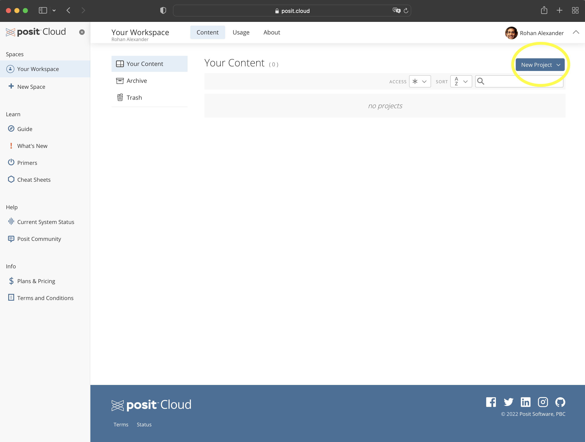
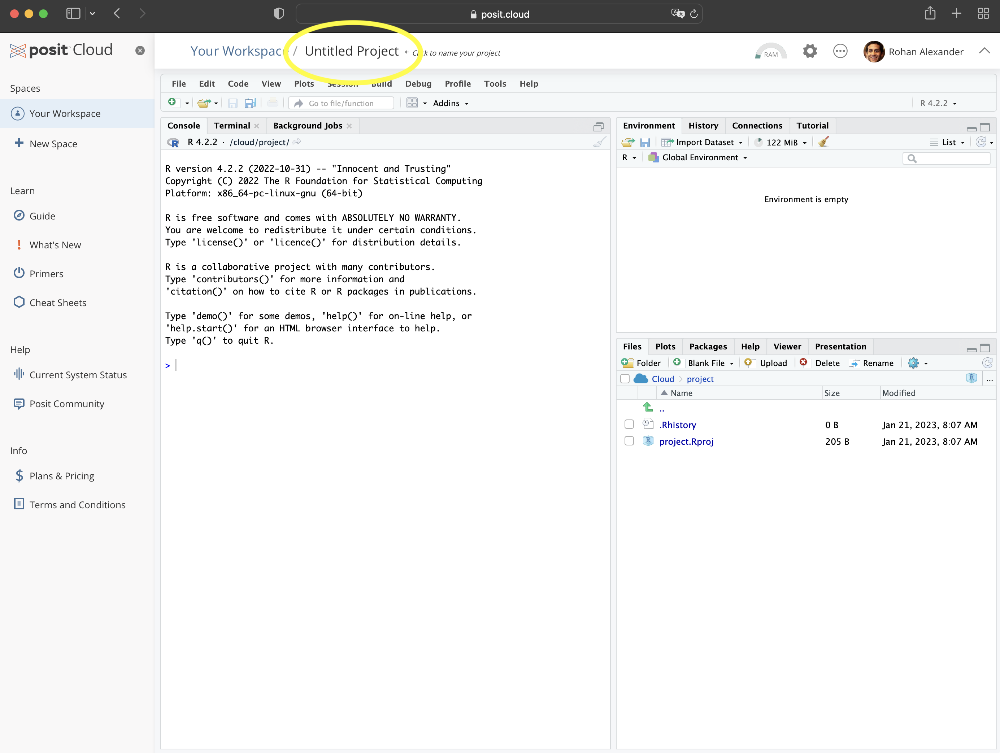
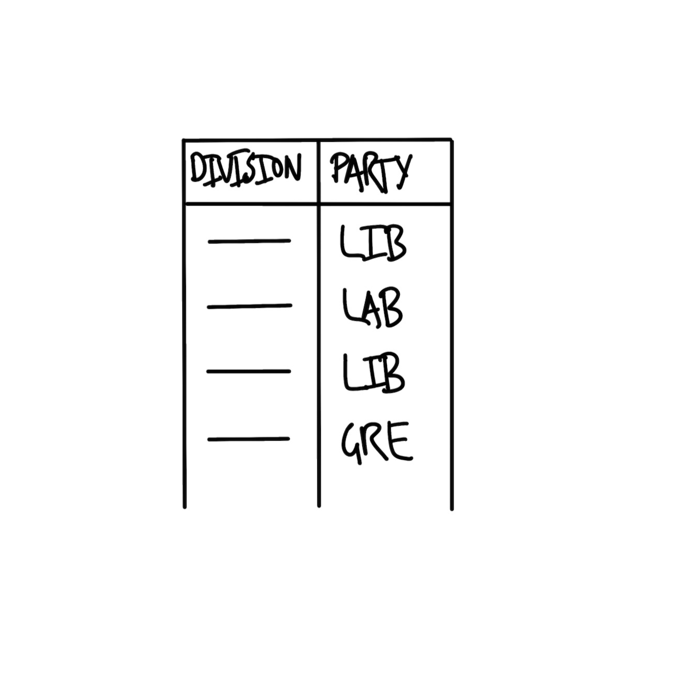
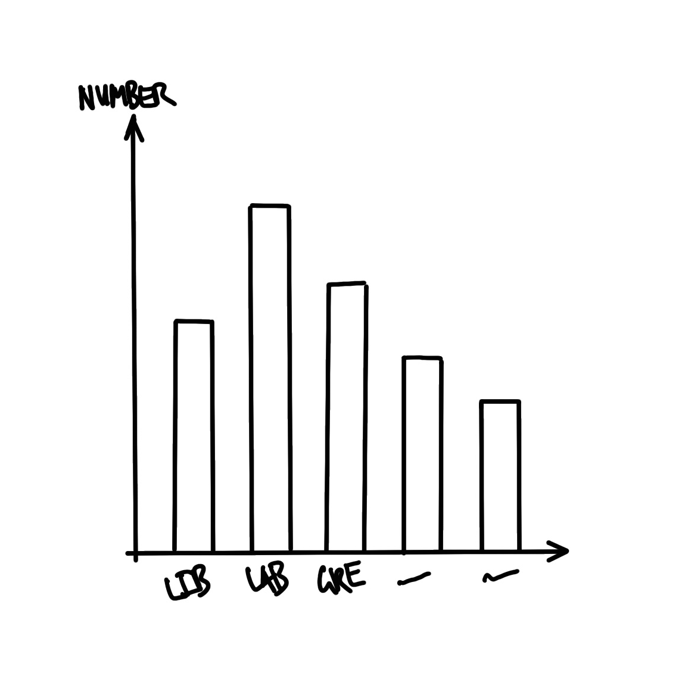
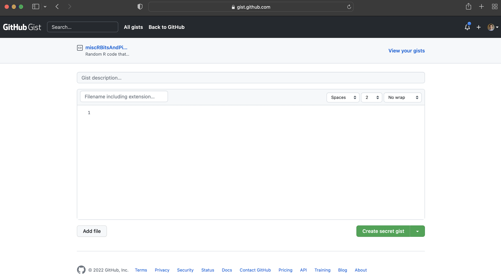
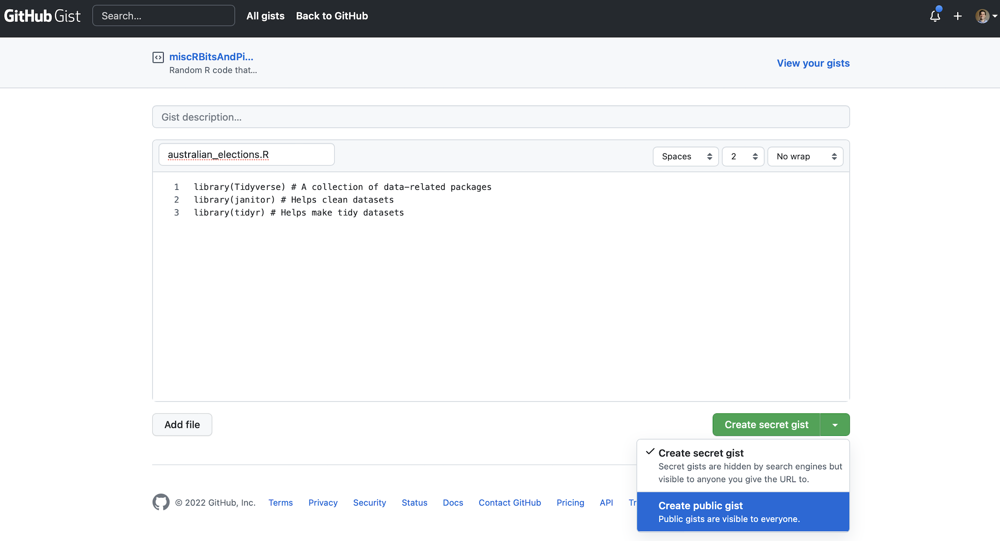
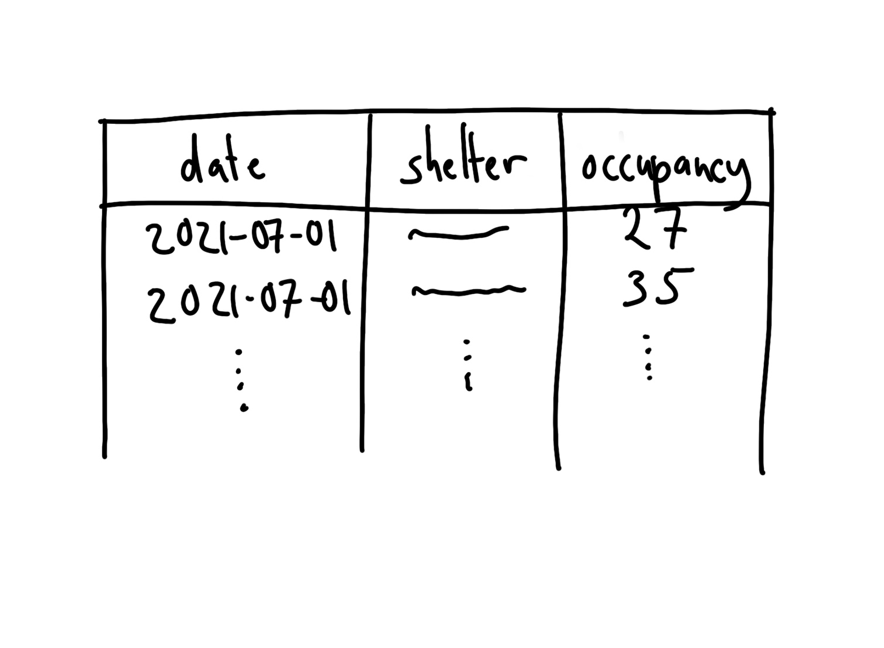
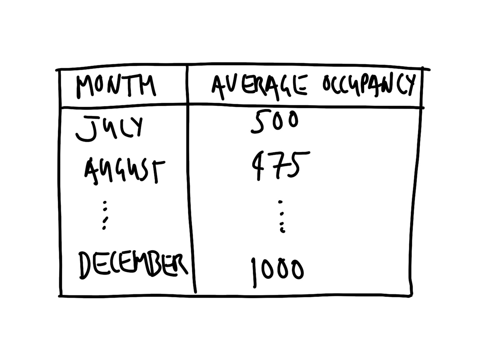
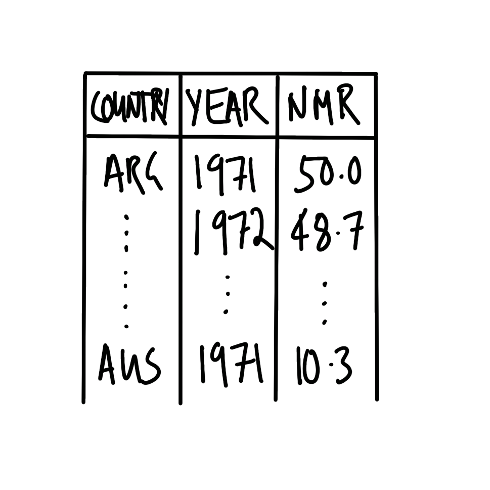
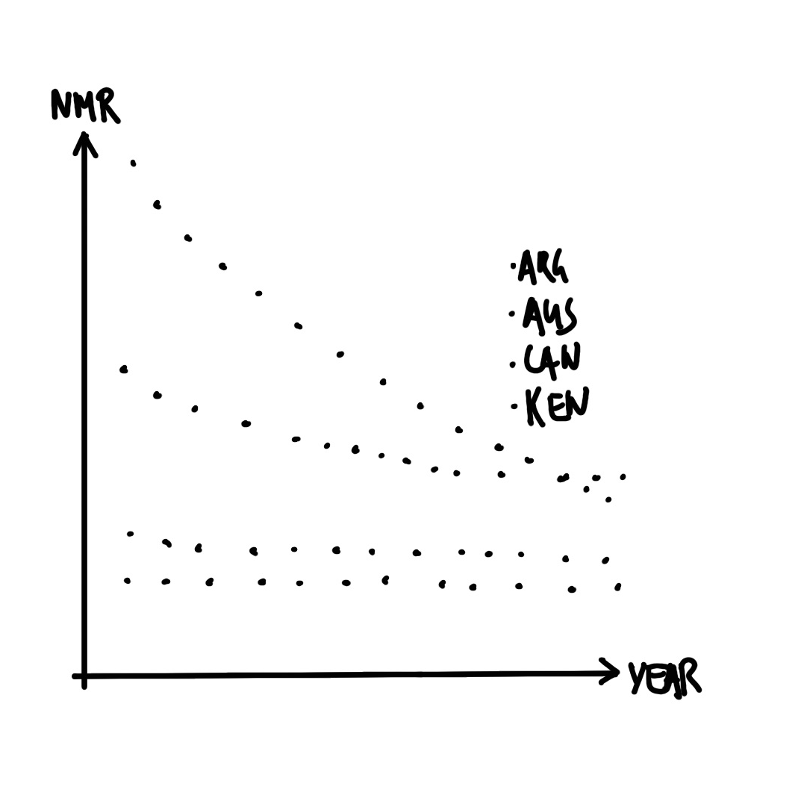

# 소방 호스로 물 마시기 {#sec-fire-hose}

::: {.callout-note}
채프먼 앤 홀/CRC(Chapman and Hall/CRC)에서 2023년 7월에 이 책을 출간했습니다. [여기](https://www.routledge.com/Telling-Stories-with-Data-With-Applications-in-R/Alexander/p/book/9781032134772)에서 구매하실 수 있습니다. 이 온라인 버전은 인쇄본 출간 이후의 일부 업데이트 내용이 반영되어 있습니다.
:::

**선행 조건**

- *탁월함의 평범함: 올림픽 수영 선수들에 대한 사회학적 보고서* 읽기, [@chambliss1989mundanity]
  - 이 논문은 탁월함이라는 것이 특별한 재능이나 타고난 선물이 아니라, 구체적인 기술과 훈련, 그리고 태도의 축적에서 비롯됨을 보여줍니다.
- *원자 습관으로서의 데이터 과학* 읽기, [@citeBarrett]
  - 이 블로그 포스트는 작고 꾸준한 행동을 통해 데이터 과학을 학습하는 방법을 설명합니다.
- *AI 편향이 발생하는 실제 과정과 이를 고치기 어려운 이유* 읽기, [@hao2019]
  - 분석 모델이 어떻게 기존의 편향을 고착화할 수 있는지 사례를 통해 강조한 기사입니다.

**핵심 개념 및 기술**

- **R**은 데이터를 활용해 흥미로운 이야기를 들려줄 수 있는 강력한 통계 프로그래밍 언어입니다. 다른 모든 언어와 마찬가지로, 기초를 다지고 숙달하기까지는 어느 정도 시간이 필요합니다.
- 프로젝트를 진행할 때는 **계획(Plan), 시뮬레이션(Simulate), 획득(Acquire), 탐색(Explore), 공유(Share)**로 이어지는 워크플로우를 따릅니다.
- R을 배우는 가장 좋은 방법은 작은 프로젝트부터 직접 시작해 보는 것입니다. 목표를 달성하는 데 필요한 과정을 아주 세밀한 단계로 나누고, 다른 사람의 코드를 참고하며 한 걸음씩 나아가세요. 하나의 프로젝트를 완수했다면 다음 프로젝트로 넘어갑니다. 프로젝트가 거듭될수록 여러분의 실력은 눈에 띄게 성장할 것입니다.

소프트웨어 및 패키지

- 기본 R [@citeR]
- 핵심 `tidyverse` [@tidyverse]
  - `dplyr` [@citedplyr]
  - `ggplot2` [@citeggplot]
  - `tidyr` [@citetidyr]
  - `stringr` [@citestringr]
  - `readr` [@citereadr]
- `janitor` [@janitor]
- `lubridate` [@GrolemundWickham2011]
- `opendatatoronto` [@citeSharla]
- `tinytable` [@tinytable]

```{r}
#| message: false
#| warning: false

library(janitor)
library(lubridate)
#library(opendatatoronto)
library(tidyverse)
library(tinytable)

```

## 안녕하세요, 세상! (Hello, World!)

무언가를 시작하는 가장 좋은 방법은 일단 해보는 것입니다. 이 장에서는 이 책이 권장하는 데이터 과학 워크플로우의 전체 과정을 처음부터 끝까지 실습해 볼 것입니다\index{workflow}. 워크플로우는 다음과 같이 진행됩니다.

$$
\mbox{계획(Plan)} \rightarrow \mbox{시뮬레이션(Simulate)} \rightarrow \mbox{획득(Acquire)} \rightarrow \mbox{탐색(Explore)} \rightarrow \mbox{공유(Share)}
$$

R이나 통계학에 익숙하지 않다면 코드와 개념이 다소 생소할 수 있습니다. 하지만 너무 걱정하지 마세요. 실습을 반복하다 보면 곧 익숙해질 것입니다.

데이터로 이야기를 들려주는 법을 배우는 유일한 방법은 직접 이야기를 시작해 보는 것입니다. 즉, 아래 예제들을 여러분의 컴퓨터(또는 실습 환경)에서 직접 실행해 보라는 뜻입니다. 직접 스케치를 그려보고, 모든 코드를 직접 타이핑해 보세요(아직 로컬 환경에 R을 설치하지 않았다면 [Posit Cloud](https://posit.cloud)를 추천합니다). 처음에는 모든 것이 어렵고 막막하게 느껴질 수 있지만, 그것은 지극히 정상적인 과정입니다.

> 새로운 도구를 배울 때마다 한동안은 형편없을 것입니다... 하지만 좋은 소식은 그것이 당연하다는 점입니다. 모든 사람이 겪는 일이며, 단지 일시적인 단계일 뿐입니다.
>
> 해들리 위컴(Hadley Wickham), @citeBarrett 재인용.

이 장의 가이드를 차근차근 따라오세요. 데이터를 사용해 결과물을 만들어낼 때 느끼는 즐거움이 학습의 어려움을 이겨내고 꾸준히 나아갈 수 있는 원동력이 되기를 바랍니다.

워크플로우의 첫 단계는 **계획**입니다. 분석을 진행하며 목표가 수정될 수도 있지만, 우선 최종 목적지를 설정하는 것이 중요합니다. 그다음은 **시뮬레이션**입니다. 시뮬레이션은 계획의 세부 사항들을 구체화하도록 도와줍니다. **획득** 단계는 단순히 데이터셋을 다운로드하는 것처럼 쉬울 때도 있지만, 직접 설문조사를 수행하는 경우처럼 워크플로우의 핵심 작업이 되기도 합니다. 이후 다양한 정량적 방법론을 동원해 데이터를 **탐색**하며 깊이 있게 이해하고, 마지막으로 청중의 요구사항을 반영해 여러분의 통찰을 **공유**합니다.

실습을 시작하기 위해 [Posit Cloud](https://posit.cloud)\index{Posit Cloud}에 가입해 주세요. 무료 계정으로도 실습하기에 충분합니다. 환경 설정의 번거로움을 피하기 위해 처음에는 로컬 설치 대신 Posit Cloud를 사용하겠습니다. 로그인 후의 모습은 @fig-02-rstudio_cloud-1 과 유사할 것입니다.

:::{#fig-openrstudio layout-ncol="2" layout-valign="bottom"}

{#fig-02-rstudio_cloud-1}

{#fig-02-rstudio_cloud-2}

Posit Cloud 및 새 프로젝트 시작하기

:::

Posit Cloud에 로그인하면 "Your workspace"가 나타납니다. 여기서 "New Project" $\rightarrow$ "New RStudio Project"를 클릭하여 새 프로젝트를 시작하세요(@fig-02-rstudio_cloud-2). 프로젝트 상단의 "Untitled Project"를 클릭하여 원하는 프로젝트 이름을 지정할 수 있습니다.

이제 세 가지 구체적인 사례를 살펴보겠습니다. **호주 연방 선거**, **토론토 쉼터 사용량**, 그리고 **신생아 사망률**입니다. 뒤로 갈수록 조금씩 더 복잡해지겠지만, 모든 사례는 데이터로 이야기를 전달한다는 동일한 목표를 가지고 있습니다. 여기서는 많은 도구와 개념을 간략하게 설명하고 넘어가지만, 책의 후반부에서 훨씬 더 자세히 다루게 될 것입니다.

## 사례 1: 호주 연방 선거

호주\index{Australia}는 하원(House of Representatives) 151석을 기반으로 정부가 구성되는 의회 민주주의 국가입니다\index{elections!Australia 2022 Federal Election}. 주요 정당으로는 자유당(Liberal)과 노동당(Labor)이 있으며, 소수 정당인 국민당(National)과 녹색당(Greens), 그리고 소규모 정당 및 무소속 의원들이 활동하고 있습니다. 이번 예제에서는 2022년 호주 연방 선거에서 각 정당이 획득한 의석수를 시각화해 보겠습니다\index{elections}.

### 계획 (Plan)

이 사례에서는 두 가지를 계획해야 합니다. 첫째는 필요한 데이터셋의 구조이고, 둘째는 최종 결과가 될 그래프의 형태입니다.

데이터셋에는 각 선거구(Division 또는 Electorate)의 이름과 해당 구역에서 당선된 의원의 소속 정당 정보가 포함되어야 합니다. 우리가 목표로 하는 데이터셋의 대략적인 모습은 @fig-australiaexample-data 와 같습니다.

:::{#fig-australiaexample layout-ncol="2" layout-valign="bottom"}

{#fig-australiaexample-data width="45%"}

{#fig-australiaexample-graph width="45%"}

호주 선거 분석을 위한 데이터셋 및 그래프 기획 스케치

:::

또한 분석 결과를 어떻게 보여줄지도 미리 생각해야 합니다. 각 정당이 확보한 의석수를 한눈에 비교할 수 있는 막대그래프를 목표로 삼겠습니다(@fig-australiaexample-graph).

### 시뮬레이션 (Simulate)

기획한 스케치를 구체화하기 위해 가상의 데이터를 시뮬레이션해 보겠습니다.

우선 Posit Cloud\index{Posit Cloud}에서 새로운 Quarto\index{Quarto} 문서를 생성하세요. **File $\rightarrow$ New File $\rightarrow$ Quarto Document...**를 차례로 클릭합니다. 제목은 "2022년 호주 선거 결과 탐색"으로 정하고 저자명을 입력합니다. "Use visual markdown editor" 옵션은 체크를 해제한 뒤 **Create** 단추를 누릅니다(@fig-quarto-australian-elections-clcik).

이제 스케치에 구체성을 부여하기 위해 일부 데이터를 시뮬레이션합니다.

알림창을 통해 "rmarkdown 패키지 설치"를 요청받을 수도 있습니다(@fig-quarto-australian-elections-wtfquarto). 그런 경우 **Install**을 눌러 설치를 진행하세요. 이 예제의 모든 과정은 하나의 Quarto 문서에서 진행할 것입니다. 문서를 "australian_elections.qmd"라는 이름으로 저장하세요 (**File $\rightarrow$ Save As...**).

기본적으로 생성된 예시 내용을 모두 지우고, 문서 상단의 메타데이터(YAML) 영역 바로 아래에 새로운 R 코드 청크(R code chunk)를 삽입합니다 (**Code $\rightarrow$ Insert Chunk**). 그리고 문서의 개요를 설명하는 **머리말(Preamble)** 주석을 다음과 같이 작성합니다.

-   문서의 목적
-   작성자 및 연락처
-   작성일 또는 최종 수정일
-   필요한 선행 조건

```{r}
#| eval: false
#| echo: true

#### 머리말 ####
# 목적: 2022년 호주 연방 선거 데이터를 불러오고, 
# 각 정당별 획득 의석수를 시각화합니다.
# 작성자: Rohan Alexander
# 이메일: rohan.alexander@utoronto.ca
# 작성일: 2023년 1월 1일
# 선행 조건: 호주 선거 데이터의 출처를 알고 있어야 합니다.

```

R에서 `#`으로 시작하는 문장은 **주석(Comment)**입니다. 컴퓨터는 이 부분을 코드로 실행하지 않으므로, 사람이 읽기 위한 메모를 남길 때 사용합니다. 머리말의 모든 줄은 `#`으로 시작해야 합니다. 작업을 더 명확히 구분하기 위해 `####` 같은 기호를 사용해도 좋습니다(@fig-quarto-australian-elections-3).

다음은 분석을 위한 **작업 환경 설정** 단계입니다. 필요한 패키지를 설치\index{packages!install}하고 불러오는 과정입니다. 패키지 설치는 컴퓨터에 한 번만 하면 되지만, 불러오는 작업은 R 세션을 시작할 때마다 매번 수행해야 합니다. 여기서는 `tidyverse`와 `janitor` 패키지를 사용하겠습니다.

::: {.callout-note}
## 거인의 어깨 위에 서서

해들리 위컴(Hadley Wickham)\index{Wickham, Hadley}은 데이터 과학 도구 제작사 Posit(구 RStudio)의 수석 과학자입니다. 2008년 아이오와 주립 대학교에서 통계학 박사 학위를 취득한 후 라이스 대학교 조교수를 거쳐 2013년 RStudio에 합류했습니다. 그는 전 세계 데이터 과학자들이 널리 사용하는 `tidyverse` 패키지 생태계를 구축했으며, *R for Data Science* [@r4ds]와 *Advanced R* [@advancedr]를 포함한 수많은 책을 집필했습니다. 2019년에는 통계학계의 노벨상이라 불리는 COPSS 회장상\index{COPSS Presidents' Award}을 수상했습니다.
:::

패키지 설치 코드는 다음과 같습니다\index{packages!install}. 코드 청크 오른쪽에 있는 작은 녹색 화살표를 클릭하여 실행하세요(@fig-quarto-australian-elections-4).

```{r}
#| eval: false
#| echo: true

#### 작업 환경 설정 ####
install.packages("tidyverse")
install.packages("janitor")

```

패키지 설치가 완료되었다면 이제 패키지를 불러올 차례입니다. 앞서 말했듯이 설치는 한 번만 하면 되므로, 설치 코드는 주석 처리하거나 삭제하여 매번 실행되지 않도록 하는 것이 좋습니다. 설치 과정에서 콘솔에 출력된 복잡한 메시지들도 지울 수 있습니다(@fig-quarto-australian-elections-5).

```{r}
#| echo: true
#| eval: true
#| warning: false
#| message: false

#### 작업 환경 설정 ####
# install.packages("tidyverse")
# install.packages("janitor")

library(tidyverse)
library(janitor)

```

상단의 **Render** 버튼을 클릭하면 전체 문서를 완성할 수 있습니다(@fig-quarto-australian-elections-6). 렌더링 과정에서 추가 패키지 설치를 묻는 창이 뜨면 승인해 주세요. 과정이 끝나면 깔끔한 형식의 HTML 문서가 생성됩니다\index{Quarto!render HTML}.

R의 패키지들은 각 함수에 대한 상세한 도움말 파일을 포함하고 있습니다. 궁금한 함수나 패키지 이름 앞에 물음표(`?`)를 붙여 콘솔에 입력하면 도움말을 확인할 수 있습니다. 예: `?tidyverse`

이제 데이터를 **시뮬레이션**해 보겠습니다\index{simulation}. '선거구(Division)'와 '정당(Party)'이라는 두 개의 열(Column)을 가진 데이터셋을 만들 것입니다. 'Division'에는 1부터 151까지의 번호를 부여하고, 'Party'에는 자유당(Liberal), 노동당(Labor), 국민당(National), 녹색당(Green), 기타(Other) 중 하나를 무작위로 할당합니다.

```{r}
#| echo: true
#| eval: true
#| warning: false
#| message: false

#### 데이터 시뮬레이션 ####
set.seed(853) # 무작위 결과를 고정하기 위한 시드 설정

simulated_data <-
  tibble(
    # 1부터 151까지의 번호를 선거구 이름 대신 사용
    "Division" = 1:151,
    # 151개 선거구에 대해 5개 정당 중 하나를 무작위로 선택 (중복 허용)
    "Party" = sample(
      x = c("Liberal", "Labor", "National", "Green", "Other"),
      size = 151,
      replace = TRUE
    )
  )

simulated_data

```

학습 도중 코드가 실행되지 않아 **도움을 요청**해야 할 때가 있을 것입니다\index{help!asking for}. 이때 코드의 일부만 스크린샷을 찍어 보내는 것은 피해야 합니다. 답변자가 오류의 원인을 파악하기 위해 전체 맥락을 알아야 하기 때문입니다. 가장 좋은 방법은 상대방이 자신의 컴퓨터에서 바로 실행해 볼 수 있도록 전체 코드를 공유하는 것입니다.

가장 널리 쓰이는 방법은 [GitHub](https://github.com)의 **Gist** 서비스를 이용하는 것입니다. 아직 계정이 없다면 GitHub에 가입하세요(@fig-githubone). 사용자 이름은 여러분의 전문적인 이력을 나타낼 수 있도록 실제 이름과 관련되거나 정중한 것으로 정하는 것이 좋습니다. 로그인 후 오른쪽 상단의 `+` 버튼을 눌러 **New Gist**를 선택합니다(@fig-githubgistone).

:::{#fig-githubgist layout-ncol="2" layout-nrow="2" layout-valign="bottom"}

{#fig-githubone}

{#fig-githubgistone}

{#fig-githubgisttwo}

도움을 요청할 때 코드를 공유하기 위한 Gist 활용법

:::

Gist 본문에 오류가 발생하는 부분을 포함한 전체 코드를 복사해 넣으세요. 파일 이름은 `australian_elections.R`처럼 의미가 명확하고 확장자(`.R`)가 포함되어야 합니다. @fig-githubgisttwo 에서는 패키지 이름의 대소문자가 잘못 입력되어 오류가 발생한 상황을 보여줍니다(`library(tidyverse)`가 맞지만 `library(Tidyverse)`로 입력됨).

**Create public gist**를 클릭해 생성된 URL을 도움을 줄 사람에게 공유하세요. 어떤 결과가 나오기를 기대했는지, 현재 어떤 문제가 있는지 상세히 설명한다면 훨씬 빠르고 정확한 도움을 받을 수 있습니다.

### 획득 (Acquire)

이제 실제 데이터를 확보할 차례입니다. 우리는 호주 연방 선거를 관리하는 독립 기관인 호주 선거 관리 위원회(AEC)\index{Australia!Australian Electoral Commission}의 공개 데이터를 사용하겠습니다. `tidyverse` 패키지의 일부인 `readr` 라이브러리의 `read_csv()` 함수를 사용하면 웹사이트의 데이터를 직접 읽어올 수 있습니다. 결과값은 할당 연산자(`<-`)를 통해 `raw_elections_data`라는 이름의 객체에 저장합니다.

:::{.content-visible when-format="pdf"}

```{r}
#| eval: false
#| echo: true

#### 데이터 읽기 ####
raw_elections_data <-
  read_csv(
    file =
      paste0("https://results.aec.gov.au/27966/website/Downloads/",
             "HouseMembersElectedDownload-27966.csv"),
    show_col_types = FALSE,
    skip = 1 # 첫 번째 줄(설명문)은 건너뜁니다.
  )

# 만약의 상황을 대비하여 원본 데이터를 로컬에 저장해 둡니다.
write_csv(
  x = raw_elections_data,
  file = "australian_voting.csv"
)

```
:::

:::{.content-visible unless-format="pdf"}

```{r}
#| eval: false
#| echo: true

#### 데이터 읽기 ####
raw_elections_data <-
  read_csv(
    file =
      "https://results.aec.gov.au/27966/website/Downloads/HouseMembersElectedDownload-27966.csv",
    show_col_types = FALSE,
    skip = 1
  )

# 원본 데이터를 파일로 저장합니다. 나중에 웹사이트 접속이 불가능하거나 
# 파일 위치가 바뀌었을 때 유용하게 사용할 수 있습니다.
write_csv(
  x = raw_elections_data,
  file = "australian_voting.csv"
)

```
:::

```{r}
#| eval: false
#| echo: false

# 내부

raw_elections_data <-
  read_csv(
    file =
      "https://results.aec.gov.au/27966/website/Downloads/HouseMembersElectedDownload-27966.csv",
    show_col_types = FALSE,
    skip = 1
  )

write_csv(
  x = raw_elections_data,
  file = here::here("inputs/data/australian_voting.csv")
)

```

```{r}
#| eval: true
#| echo: false
#| warning: false

raw_elections_data <-
  read_csv(
    here::here("inputs/data/australian_voting.csv"),
    show_col_types = FALSE
  )

```

데이터셋을 빠르게 훑어보려면 `head()`나 `tail()` 함수를 사용하세요. `head()`는 상위 6개 행을, `tail()`은 하위 6개 행을 보여줍니다.

```{r}

head(raw_elections_data)
tail(raw_elections_data)

```

실제 데이터를 분석에 활용하려면 기획했던 구조(@fig-australiaexample-data)에 맞게 **데이터 정리(Data cleaning)** 과정을 거쳐야 합니다. 기획 단계의 스케치에서 조금 벗어날 수도 있지만, 모든 과정은 논리적이고 의도적이어야 합니다. 우선 저장해 둔 CSV 파일을 불러온 뒤, `janitor` 패키지의 `clean_names()` 함수를 사용해 복잡한 변수(열) 이름들을 다루기 쉬운 형식으로 변환합니다.

```{r}
#| echo: true
#| eval: false

#### 기본 정리 ####
raw_elections_data <-
  read_csv(
    file = "australian_voting.csv",
    show_col_types = FALSE
  )

```

```{r}
#| echo: true
#| eval: true

# 열 이름을 소문자와 언더바(_) 형식으로 통일합니다.
cleaned_elections_data <-
  clean_names(raw_elections_data)

# 변화된 열 이름을 확인합니다.
head(cleaned_elections_data)

```

참고로 RStudio\index{R!RStudio}의 **자동 완성** 기능을 활용하면 변수 이름을 훨씬 빨리 입력할 수 있습니다. 이름의 일부분만 입력한 뒤 `Tab` 키를 누르면 됩니다.

원본 데이터셋에는 우리가 필요로 하는 것보다 훨씬 많은 변수가 포함되어 있습니다. 여기서는 `division_nm`(선거구 명칭)과 `party_nm`(정당 명칭)만 남기겠습니다. `dplyr` 패키지의 `select()` 함수를 사용하고, **파이프 연산자(`|>`)**\index{pipe operator}를 활용해 여러 단계를 연결합니다. 파이프 연산자는 앞 단계의 출력값을 다음 단계의 인수로 전달해 주는 역할을 합니다.

```{r}
#| echo: true
#| eval: true

cleaned_elections_data <-
  cleaned_elections_data |>
  select(
    division_nm,
    party_nm
  )

head(cleaned_elections_data)

```

여전히 변수 이름이 약어로 되어 있어 좀 더 명확하게 바꿔보겠습니다. `names()`로 열 이름을 확인하고, `dplyr`의 `rename()`으로 이름을 변경합니다.

```{r}

cleaned_elections_data <-
  cleaned_elections_data |>
  rename(
    division = division_nm,
    elected_party = party_nm
  )

head(cleaned_elections_data)

```

이제 `unique()` 함수를 사용하여 'elected_party' 열에 어떤 정당들이 있는지 확인해 봅시다.

```{r}

cleaned_elections_data$elected_party |>
  unique()

```

확인 결과, 우리가 시뮬레이션에서 설정했던 것보다 정당명이 훨씬 복잡합니다. `dplyr`의 `case_match()` 함수를 사용해 정당 이름을 단순하게 그룹화하겠습니다.

```{r}

cleaned_elections_data <-
  cleaned_elections_data |>
  mutate(
    elected_party =
      case_match(
        elected_party,
        "Australian Labor Party" ~ "Labor",
        "Liberal National Party of Queensland" ~ "Liberal",
        "Liberal" ~ "Liberal",
        "The Nationals" ~ "Nationals",
        "The Greens" ~ "Greens",
        "Independent" ~ "Other",
        "Katter's Australian Party (KAP)" ~ "Other",
        "Centre Alliance" ~ "Other"
      )
  )

head(cleaned_elections_data)

```

이제 데이터셋이 기획했던 구조(@fig-australiaexample-data)와 거의 일치하게 되었습니다. 모든 선거구별로 당선된 의원의 정당 정보가 깔끔하게 정리되었습니다. 이 정리된 데이터를 별도의 파일로 저장하여 다음 단계에서 바로 사용할 수 있도록 하겠습니다. 원본 데이터는 만약을 위해 그대로 두고, 새로운 파일 이름을 지정하세요.

```{r}
#| echo: true
#| eval: false

write_csv(
  x = cleaned_elections_data,
  file = "cleaned_elections_data.csv"
)

```

```{r}
#| echo: false
#| eval: true

write_csv(
  cleaned_elections_data,
  here::here("outputs/data/cleaned_elections_data.csv")
)

```

### 탐색 (Explore)

이제 정리된 데이터를 바탕으로 본격적인 **탐색**을 시작해 보겠습니다. 데이터를 이해하는 가장 효과적인 방법 중 하나는 시각화입니다. 기획 단계에서 그렸던 스케치(@fig-australiaexample-graph)를 실제 그래프로 구현해 보겠습니다.

우선 앞서 저장했던 정리된 데이터셋을 불러옵니다.

```{r}
#| echo: true
#| eval: false

#### 데이터 탐색 ####
cleaned_elections_data <-
  read_csv(
    file = "cleaned_elections_data.csv",
    show_col_types = FALSE
  )

```

`dplyr`의 `count()` 함수를 사용하면 각 정당이 총 몇 개의 의석을 확보했는지 빠르게 집계할 수 있습니다.

```{r}
#| echo: true
#| eval: true
#| warning: false

cleaned_elections_data |>
  count(elected_party)

```

이제 시각화 도구인 `ggplot2`를 사용해 그래프를 그리겠습니다. `ggplot2`는 레이어를 하나씩 쌓아 올리는 방식으로 작동하며, 각 레이어는 더하기 연산자(`+`)로 연결합니다. 막대그래프를 그리기 위해 `geom_bar()` 함수를 사용하겠습니다(@fig-canadanice-1).

```{r}
#| echo: true
#| eval: true
#| warning: false
#| label: fig-canadanice
#| fig-cap: "2022년 호주 연방 선거 정당별 의석수 현황"
#| fig-subcap: ["기본 옵션 그래프", "테마 및 레이블 개선 그래프"]
#| layout-ncol: 2

cleaned_elections_data |>
  ggplot(aes(x = elected_party)) + # aes는 '시각적 매핑(Aesthetics)'을 설정합니다.
  geom_bar()

cleaned_elections_data |>
  ggplot(aes(x = elected_party)) +
  geom_bar() +
  theme_minimal() + # 불필요한 요소를 제거한 깔끔한 테마 적용
  labs(x = "정당", y = "의석수") # 축 이름 및 레이블 한글화
```

@fig-canadanice-1 은 우리가 처음에 목표로 했던 그래프의 모습을 잘 보여줍니다. 여기서 테마를 조정하고 축 레이블을 한글로 바꾸면 훨씬 전문적인 느낌의 그래프를 완성할 수 있습니다(@fig-canadanice-2).

### 공유 (Share)

데이터 수집부터 정리, 시각화까지 모든 과정을 마쳤습니다. 이제 분석 결과를 바탕으로 통찰을 담은 글을 작성하여 워크플로우를 마무리합니다. 데이터 과학자의 역할은 단순히 숫자를 뽑아내는 것이 아니라, 그 숫자가 의미하는 **이야기**를 청중에게 전달하는 데 있습니다.

> 호주는 하원 151석을 기반으로 정부가 구성되는 의회 민주주의 국가입니다. 주요 정당인 노동당과 자유당 외에도 국민당, 녹색당 등 다양한 소수 정당이 경쟁합니다. 2022년 5월 21일에 치러진 연방 선거에는 약 1,500만 명의 유권자가 참여했습니다. 본 분석의 목적은 이번 선거의 정당별 의석 분포를 확인하는 것입니다.
>
> 우리는 호주 선거 관리 위원회(AEC) 웹사이트에서 공식 데이터를 확보했습니다. 통계 언어 R [@citeR]과 `tidyverse` [@tidyverse], `janitor` [@janitor] 패키지를 활용해 데이터를 분석 가능한 형태로 가공한 뒤 시각화 작업을 진행했습니다(@fig-canadanice).
>
> 분석 결과, 노동당이 77석을 차지하며 승리했으며 자유당이 48석으로 그 뒤를 이었습니다. 소수 정당 중에서는 국민당이 10석, 녹색당이 4석을 기록했습니다. 또한 무소속 및 기타 소규모 정당 후보들이 총 10석을 확보하며 존재감을 드러냈습니다.
>
> 거대 양당에 집중된 의석 분포는 호주 유권자들의 안정적인 선호도를 반영하는 동시에, 주요 정당이 누리는 네트워크와 자금력의 우위를 보여줍니다. 향후 연구에서는 이러한 분포가 나타나는 심층적인 원인을 탐구해 볼 가치가 있습니다. 다만, 호주 사회의 일부 계층이 제도적 한계로 인해 투표권 행사에서 소외되거나 투표에 어려움을 겪을 수 있다는 점은 데이터 해석 시 반드시 유의해야 할 지점입니다.

위 요약문은 짧은 단락들로 구성되었지만, 필요에 따라 이를 상세한 보고서로 확장할 수 있습니다. 첫 단락은 배경, 두 번째는 데이터와 방법론, 세 번째는 핵심 결과, 그리고 마지막 네 번째 단락은 결과의 함의와 한계를 논의(Discussion)하는 구조입니다. 특히 마지막 단계는 분석 결과에 숨어 있을지 모르는 편향이나 윤리적 쟁점을 다루기에 적합한 공간입니다 [@hao2019].

## 사례 2: 토론토의 노숙인 현황

캐나다의 대도시 토론토\index{Canada!Toronto unhoused population}에는 많은 노숙인(Unhoused population)이 거주하고 있습니다 [@torontohomeless]. 특히 토론토의 혹독한 겨울 날씨를 고려할 때, 노숙인 쉼터(Shelter)에 충분한 공간을 확보하는 것은 생존과 직결된 매우 중요한 문제입니다. 이 예제에서는 2021년 토론토 쉼터 이용 데이터를 활용해 월별 평균 이용 현황을 비교하는 표를 만들어 보겠습니다. 우리의 가설은 12월과 같은 추운 달의 쉼터 이용률이 7월과 같은 따뜻한 달보다 높을 것이라는 점입니다.

### 계획 (Plan)

분석에 필요한 데이터셋에는 날짜, 쉼터 명칭, 그리고 해당 날짜의 점유 침대 수(Occupied beds) 정보가 포함되어야 합니다. 데이터셋의 대략적인 구조는 @fig-torontohomeless-data 와 같습니다. 우리는 이 데이터를 가공하여 매월 하루 평균 몇 개의 침대가 사용되었는지를 보여주는 표(@fig-torontohomeless-table)를 만드는 것을 목표로 합니다.

:::{#fig-torontohomeless layout-ncol="2"}

{#fig-torontohomeless-data width="50%"}

{#fig-torontohomeless-table width="50%"}

토론토 노숙인 쉼터 이용 현황 분석을 위한 데이터셋 및 표 기획 스케치

:::

### 시뮬레이션 (Simulate)

실제 데이터를 다루기 전에, 우리가 생각하는 구조와 유사한 가상의 데이터를 시뮬레이션해 보겠습니다\index{simulation}. 시뮬레이션 과정은 데이터가 생성되는 방식(Data generation process)에 대해 깊이 고민할 기회를 제공하며, 이후 실제 분석을 수행할 때 훌륭한 길잡이 역할을 합니다. 시뮬레이션 없이 바로 분석에 뛰어드는 것은 목표 지점 없이 화살을 쏘는 것과 같습니다. 무언가를 하고는 있지만, 그것이 옳은 방향인지는 알 수 없기 때문입니다.

Posit Cloud\index{Posit Cloud}에서 새로운 Quarto 문서를 만들고 저장한 뒤, 머리말 주석을 작성하세요. 그다음 분석에 필요한 패키지들을 준비합니다. 앞서 사용했던 `tidyverse`와 `janitor`에 더해, 날짜 데이터를 다루기 위한 `lubridate`, 토론토 시의 오픈 데이터를 가져오기 위한 `opendatatoronto`, 그리고 깔끔한 표를 만들기 위한 `knitr` 패키지가 추가로 필요합니다.

```r
#### 머리말 ####
# 목적: 2021년 토론토 노숙인 쉼터 이용 데이터를 확보하고 월별 요약표를 생성합니다.
# 작성자: Rohan Alexander
# 이메일: rohan.alexander@utoronto.ca
# 작성일: 2022년 7월 1일
# 선행 조건: -

#### 작업 환경 설정 ####
# 설치가 필요한 경우 아래 주석을 해제하고 실행하세요.
# install.packages("opendatatoronto")
# install.packages("knitr")

library(knitr)
library(janitor)
library(lubridate)
library(opendatatoronto)
library(tidyverse)
```

```{r}
#| echo: false
#| eval: true
#| warning: false
#| message: false

library(knitr)
library(janitor)
library(lubridate)
library(opendatatoronto)
library(tidyverse)

```

패키지는 다른 사용자들이 미리 작성해 둔 유용한 코드의 집합체입니다. 이 책에서는 `tidyverse`와 같이 데이터 분석에 필수적인 패키지들을 반복해서 사용하게 됩니다. 다시 한번 강조하지만, 패키지 설치는 한 번만 하면 되며, 사용할 때마다 `library()` 함수로 불러와야 합니다.

:::{.callout-note}

## 거인의 어깨 위에 서서

로버트 젠틀맨(Robert Gentleman)\index{Gentleman, Robert} 박사는 R 언어의 공동 창시자 중 한 명입니다. 1988년 워싱턴 대학교에서 통계학 박사 학위를 취득한 후 뉴질랜드 오클랜드 대학교에서 근무했습니다. 이후 유전자 분석 기업인 23andMe 등을 거쳐 현재는 하버드 의과대학 계산 생의학 센터의 전무이사로 재직 중입니다.

:::

:::{.callout-note}

## 거인의 어깨 위에 서서

로스 이아카(Ross Ihaka)\index{Ihaka, Ross} 박사는 R 언어의 또 다른 공동 창시자입니다. 1985년 캘리포니아 대학교 버클리\index{Berkeley}에서 통계학 박사 학위를 취득했습니다. 그는 마오리족 영적 존재의 이름을 딴 "Ruaumoko"라는 제목의 흥미로운 논문을 쓰기도 했습니다. 이후 오클랜드 대학교에서 교수직을 수행하며 통계학 발전에 기여해 왔으며, 2008년에는 뉴질랜드 왕립 학회로부터 피커링 메달을 수상했습니다.

:::

전 세계의 수많은 개발자와 통계학자들이 자신의 시간을 기부해 R과 패키지들을 만들어낸 만큼, 분석 결과물에 이들을 적절히 인용하는 것이 매우 중요합니다. `citation()` 함수를 사용하면 인용 정보를 쉽게 확인할 수 있습니다\index{citation!R}. 인수를 넣지 않으면 R 언어 자체의 인용 정보를 보여주고, 패키지 이름을 넣으면 해당 패키지의 인용 정보를 알려줍니다\index{packages!cite}\index{citation!R packages}.

```r
citation() # R 언어 인용 정보 확인
citation("ggplot2") # 특정 패키지(예: ggplot2) 인용 정보 확인
```

다시 시뮬레이션으로 돌아와서, 우리는 '날짜(Date)', '쉼터 명칭(Shelter)', '점유 침대 수(Occupancy)'라는 세 가지 변수가 필요합니다\index{simulation}. 이번에는 `set.seed()` 함수를 사용해 무작위 숫자를 고정하는 단계를 추가하겠습니다\index{random seed}. 시드는 어떤 정수든 상관없지만, 똑같은 시드 번호(여기서는 853)를 사용하면 나중에 누구든 동일한 가상의 데이터를 만들어낼 수 있습니다. 또한 `rep()` 함수를 사용하여 특정 값을 필요한 횟수만큼 반복해 보겠습니다.

```{r}
#| echo: true
#| eval: true
#| warning: false
#| message: false

#### 데이터 시뮬레이션 ####
set.seed(853)

simulated_occupancy_data <-
  tibble(
    # 2021년 365일 날짜를 3번 반복 생성 (쉼터가 3곳이라고 가정)
    date = rep(x = as.Date("2021-01-01") + c(0:364), times = 3),
    # 3개 쉼터의 이름을 각각 365번씩 반복 할당
    shelter = c(
      rep(x = "Shelter 1", times = 365),
      rep(x = "Shelter 2", times = 365),
      rep(x = "Shelter 3", times = 365)
    ),
    # 각 날짜별 점유 침대 수를 포아송 분포로부터 추출하여 할당
    number_occupied =
      rpois(
        n = 365 * 3,
        lambda = 30 # 평균 30개의 침대가 사용된다고 가정
      )
  )

head(simulated_occupancy_data)

```

위 코드에서는 2021년의 모든 날짜 리스트를 만든 뒤, 세 곳의 쉼터가 있다고 가정해 이를 반복했습니다. 점유 침대 수의 경우, 평균값이 30인 **포아송 분포(Poisson distribution)**\index{distribution!Poisson}로부터 무작위로 추출했습니다. 포아송 분포는 사건의 발생 횟수를 모델링할 때 주로 사용되는 확률 분포로, 자세한 내용은 @sec-its-just-a-generalized-linear-model 에서 다시 논의하겠습니다.

### 획득 (Acquire)

토론토 시에서 운영하는 오픈 데이터 포털(Open Data Toronto)에서 제공하는 쉼터 이용 데이터를 활용하겠습니다. 이 데이터는 매일 새벽 4시를 기준으로 각 쉼터의 점유 침대 수를 기록한 것입니다. `opendatatoronto` 패키지를 사용해 데이터를 불러오고, 분석을 위해 로컬 파일로 저장하겠습니다.

:::{.content-visible when-format="pdf"}

```{r}
#| eval: false
#| echo: true

#### 데이터 획득 ####
toronto_shelters <-
  # 각 데이터셋은 Open Data Toronto 페이지의 '개발자용' 탭에서 확인할 수 있는 고유 ID를 가집니다.
  # https://open.toronto.ca/dataset/daily-shelter-overnight-service-occupancy-capacity/
  list_package_resources("21c83b32-d5a8-4106-a54f-010dbe49f6f2") |>
  # 그중 2021년도 일일 이용 데이터셋을 필터링합니다.
  filter(name ==
    "daily-shelter-overnight-service-occupancy-capacity-2021.csv") |>
  # 해당 리소스를 불러옵니다.
  get_resource()

write_csv(
  x = toronto_shelters,
  file = "toronto_shelters.csv"
)

head(toronto_shelters)

```
:::

:::{.content-visible unless-format="pdf"}

```{r}
#| eval: false
#| echo: true

#### 데이터 획득 ####
toronto_shelters <-
  list_package_resources("21c83b32-d5a8-4106-a54f-010dbe49f6f2") |>
  filter(name ==
    "daily-shelter-overnight-service-occupancy-capacity-2021.csv") |>
  get_resource()

write_csv(
  x = toronto_shelters,
  file = "toronto_shelters.csv"
)

head(toronto_shelters)

```
:::

```{r}
#| eval: false
#| echo: false
#| warning: false

write_csv(
  x = toronto_shelters,
  file = here::here("inputs/data/toronto_shelters.csv")
)

```

```{r}
#| eval: true
#| echo: false
#| warning: false

toronto_shelters <-
  read_csv(
    here::here("inputs/data/toronto_shelters.csv"),
    show_col_types = FALSE
  )

```

:::{.content-visible unless-format="pdf"}

```{r}
#| eval: true
#| echo: true
#| warning: false

head(toronto_shelters)

```
:::

확보한 데이터를 분석하기 좋게 가공합니다(@fig-torontohomeless-data). `clean_names()`로 열 이름을 정리하고, `lubridate`의 `ymd()` 함수로 날짜 형식을 변환한 뒤 필요한 열만 선택합니다.

```{r}
#| eval: true
#| echo: true
#| warning: false

toronto_shelters_clean <-
  clean_names(toronto_shelters) |>
  mutate(occupancy_date = ymd(occupancy_date)) |>
  select(occupancy_date, occupied_beds)

head(toronto_shelters_clean)

```

가공된 데이터를 미래의 분석을 위해 파일로 저장해 둡니다.

```{r}
#| eval: false
#| echo: true

write_csv(
  x = toronto_shelters_clean,
  file = "toronto_shelters_clean.csv"
)
```

```{r}
#| eval: true
#| echo: false
#| warning: false

write_csv(
  x = toronto_shelters_clean,
  file = here::here("outputs/data/cleaned_toronto_shelters.csv")
)

```

### 탐색

먼저, 방금 만든 데이터셋을 로드합니다.

```{r}
#| echo: false
#| eval: true

toronto_shelters_clean <-
  read_csv(
    "outputs/data/cleaned_toronto_shelters.csv",
    show_col_types = FALSE
  )

```

```{r}
#| echo: true
#| eval: false

#### 탐색 ####
toronto_shelters_clean <-
  read_csv(
    "cleaned_toronto_shelters.csv",
    show_col_types = FALSE
  )

```

### 탐색 (Explore)

가공된 데이터에는 쉼터별 일일 기록이 담겨 있습니다. 우리의 목표인 월별 평균 이용 현황을 파악하기 위해 `lubridate` 패키지의 `month()` 함수를 사용해 '월' 정보를 추출하겠습니다. `label = TRUE` 옵션을 주어 숫자가 아닌 월 이름이 표시되도록 하고, `tidyr` 패키지의 `drop_na()`로 결측치(데이터가 없는 행)를 제거합니다. 결측치를 처리하는 것은 분석 결과에 큰 영향을 미치는 중요한 결정이며, 자세한 내용은 @sec-farm-data 와 @sec-exploratory-data-analysis 에서 다루겠습니다. 마지막으로 `dplyr`의 `summarise()` 함수로 월별 평균치를 집계하고 `tinytable`의 `tt()` 함수로 깔끔한 표(@tbl-homelessoccupancyd)를 만듭니다.

```{r}
#| label: tbl-homelessoccupancyd
#| tbl-cap: "2021년 토론토 노숙인 쉼터 월별 이용 현황"
#| eval: false
toronto_shelters_clean |>
  mutate(occupancy_month = month(
    occupancy_date,
    label = TRUE,
    abbr = FALSE
  )) |>
  arrange(month(occupancy_date)) |>
  drop_na(occupied_beds) |>
  summarise(number_occupied = mean(occupied_beds),
            .by = occupancy_month) |>
  tt()

```

결과가 나쁘지 않지만, 몇 가지 설정을 추가해 표의 가독성을 높일 수 있습니다(@tbl-homelessoccupancy). 열 이름을 이해하기 쉽게 바꾸고, 소수점 자릿수를 조정하며, 숫자를 우측 정렬하겠습니다.

```{r}
#| label: tbl-homelessoccupancy
#| tbl-cap: "2021년 토론토 노숙인 쉼터 월별 이용 현황 (개선)"
#| eval: false
toronto_shelters_clean |>
  mutate(occupancy_month = month(
    occupancy_date,
    label = TRUE,
    abbr = FALSE
  )) |>
  arrange(month(occupancy_date)) |>
  drop_na(occupied_beds) |>
  summarise(number_occupied = mean(occupied_beds),
            .by = occupancy_month) |>
  tt(
    digits = 1 # 소수점 첫째 자리까지 표시
  ) |>
  style_tt(j = 2, align = "r") |> # 두 번째 열을 우측 정렬
  setNames(c("월", "일평균 점유 침대 수"))

```

### 공유 (Share)

분석을 통해 발견한 사실을 글로 정리하여 정보를 공유합니다. 

> 토론토는 대규모 노숙인 인구가 거주하는 도시이며, 특히 추운 겨울철에는 쉼터의 안정적인 공간 확보가 필수적입니다. 본 분석의 목적은 계절 변화에 따른 노숙인 쉼터의 이용률 변화를 파악하는 것입니다.
>
> 우리는 토론토 시의 오픈 데이터를 활용했습니다. 이 데이터는 매일 새벽 4시 기준의 침대 점유 수를 기록하고 있습니다. 분석을 위해 통계 언어 R [@citeR]과 `tidyverse` [@Wickham2017], `janitor` [@janitor], `opendatatoronto` [@citeSharla], `lubridate` [@GrolemundWickham2011], `knitr` [@citeknitr] 등 다양한 도구를 사용해 월별 일평균 점유 수를 계산했습니다(@tbl-homelessoccupancy).
>
> 분석 결과, 2021년 12월의 일평균 점유 침대 수는 약 34개로, 7월의 30개에 비해 높게 나타났습니다(@tbl-homelessoccupancy). 전반적으로 7월부터 12월까지 평균 이용 수가 꾸준히 증가하는 경향을 확인할 수 있었습니다.
>
> 다만, 이 결과는 쉼터 단위의 데이터를 기반으로 하므로 특정 지역이나 규모가 큰 쉼터의 변화에 의해 전체 수치가 왜곡될 가능성이 있습니다. 또한 점유 침대 수뿐만 아니라, 계절별로 공급되는 전체 침대 수 대비 점유율(Occupancy rate)을 함께 고려한다면 더욱 입체적인 분석이 가능할 것입니다.

이 요약문은 분석의 배경부터 데이터 방법론, 결과, 그리고 한계점 논의까지 데이터 과학의 핵심 워크플로우를 충실히 따르고 있습니다. 분석 과정에서 발생할 수 있는 데이터의 한계나 편향을 언급하는 것은 정직하고 신뢰할 수 있는 분석가가 되기 위한 중요한 단계입니다 [@hao2019].

## 사례 3: 신생아 사망률 (Neonatal Mortality Rate)

**신생아 사망률(Neonatal Mortality Rate, NMR)**\index{neonatal mortality}은 출생 후 4주(28일) 이내에 발생하는 영유아 사망 비율을 의미하며, 보통 출생아 1,000명당 사망자 수로 표시합니다 [@unigme]. 유엔의 지속 가능한 개발 목표(SDG) 중 세 번째 목표는 2030년까지 전 세계 모든 국가의 NMR을 12명 이하로 줄이는 것을 지향합니다. 이 예제에서는 지난 50년 동안 아르헨티나\index{Argentina!neonatal mortality}, 호주\index{Australia!neonatal mortality}, 캐나다\index{Canada!neonatal mortality}, 케냐\index{Kenya!neonatal mortality}의 NMR 추정치가 어떻게 변화했는지 시각화해 보겠습니다.

### 계획 (Plan)

이번 분석을 위해 필요한 데이터셋은 국가명, 연도, 그리고 해당 국가 및 연도의 NMR 추정치를 포함해야 합니다. 대략적인 데이터 구조와 최종 그래프의 스케치는 @fig-nmrexample 와 같습니다.

:::{#fig-nmrexample layout-ncol="2"}

{#fig-nmrexample-data}

{#fig-nmrexample-graph}

신생아 사망률(NMR) 데이터 및 시각화 기획 스케치

:::

최종 그래프의 x축은 연도, y축은 NMR 추정치로 설정하고, 4개 국가를 서로 다른 색상의 선이나 점으로 표시하여 한눈에 비교할 수 있도록 계획하겠습니다(@fig-nmrexample-graph).

### 시뮬레이션 (Simulate)

기획한 대로 국가, 연도, NMR이라는 세 개의 열을 가진 가상의 데이터를 시뮬레이션해 보겠습니다\index{simulation}.

우선 새로운 Quarto 문서를 생성하고 머리말을 작성한 뒤, 필요한 패키지(`tidyverse`, `janitor`, `lubridate`)를 불러오세요.

```{r}
#| eval: false
#| echo: true

#### 머리말 ####
# 목적: 4개 국가의 지난 50년간 신생아 사망률 데이터를 확보하고 시각화합니다.
# 작성자: Rohan Alexander
# 이메일: rohan.alexander@utoronto.ca
# 작성일: 2022년 7월 1일
# 선행 조건: -

#### 작업 환경 설정 ####
library(janitor)
library(lubridate)
library(tidyverse)

```

코드 패키지들은 제작자가 기능을 개선하거나 버그를 수정함에 따라 수시로 업데이트됩니다. `packageVersion()` 함수를 사용하면 현재 설치된 패키지의 버전을 확인할 수 있습니다. 예를 들어, 저는 현재 `tidyverse` 2.0.0 버전과 `janitor` 2.2.0 버전을 사용하고 있습니다.

```{r}
packageVersion("tidyverse")
packageVersion("janitor")
```

패키지를 최신 버전으로 업데이트하려면 `update.packages()` 함수를 사용하면 됩니다\index{packages!update}. `tidyverse` 생태계의 패키지만 업데이트하고 싶다면 `tidyverse_update()`를 사용할 수도 있습니다. 매일 실행할 필요는 없지만, 가끔은 도구가 최신 상태인지 확인하는 것이 좋습니다. 다만, 패키지가 대대적으로 업데이트되면서 예전에 짰던 코드가 작동하지 않을 수도 있다는 점은 유의하세요. 입문 단계에서는 큰 문제가 되지 않으며, 나중에 @sec-reproducible-workflows 에서 특정 버전을 고정해서 사용하는 방법을 배우게 될 것입니다.

이제 시뮬레이션 코드를 작성해 봅시다. `rep()` 함수를 사용해 국가 이름을 각각 50번씩 반복하고, 연도 또한 50년 치를 생성합니다. NMR 값은 `runif()` 함수를 사용해 0에서 100 사이의 숫자를 무작위로 추출하여 할당하겠습니다(균등 분포 활용)\index{distribution!uniform}.

```{r}
#| echo: true
#| eval: true
#| warning: false
#| message: false

#### 데이터 시뮬레이션 ####
set.seed(853)

simulated_nmr_data <-
  tibble(
    country =
      c(rep("Argentina", 50), rep("Australia", 50),
        rep("Canada", 50), rep("Kenya", 50)),
    year =
      rep(c(1971:2020), 4),
    nmr =
      runif(n = 200, min = 0, max = 100)
  )

head(simulated_nmr_data)

```

위 코드는 잘 작동하지만, 한 가지 아쉬운 점이 있습니다. 만약 분석 대상 기간을 50년에서 60년으로 늘리고 싶다면 코드 곳곳에 있는 숫자 '50'을 일일이 찾아 바꿔야 한다는 점입니다. 이는 번거로울 뿐만 아니라 실수하기 딱 좋은 방식입니다. 더 나은 방법은 '기간'을 의미하는 **변수**를 선언해서 사용하는 것입니다.

```{r}
#| echo: true
#| eval: true
#| warning: false
#| message: false

#### 데이터 시뮬레이션 (개선) ####
set.seed(853)

number_of_years <- 50 # 분석 기간을 변수로 설정

simulated_nmr_data <-
  tibble(
    country =
      c(rep("Argentina", number_of_years), rep("Australia", number_of_years),
        rep("Canada", number_of_years), rep("Kenya", number_of_years)),
    year =
      rep(c(1:number_of_years + 1970), 4),
    nmr =
      runif(n = number_of_years * 4, min = 0, max = 100)
  )

head(simulated_nmr_data)

```

이제 기간을 바꾸고 싶다면 `number_of_years` 변수의 값 하나만 수정하면 됩니다. 코드가 훨씬 유연하고 깔끔해졌습니다.

시뮬레이션 데이터는 우리가 직접 코드를 짰기 때문에 그 구조를 온전히 신뢰할 수 있습니다. 하지만 외부에서 가져온 실제 데이터는 어떤 문제가 있을지 알 수 없습니다. 따라서 분석에 앞서 데이터가 우리가 생각하는 상식적인 범위 안에 있는지 확인하는 **검증 테스트(Validation testing)**가 반드시 필요합니다\index{testing}. 예를 들어 NMR 데이터라면 다음과 같은 조건을 만족해야 합니다.

1.  국가(country) 열에 우리가 설정한 4개 국가의 이름이 정확히 들어 있는가?
2.  누락된 국가 없이 4개국 모두 포함되어 있는가?
3.  연도(year) 열이 1971년부터 2020년 사이의 정수인가?
4.  사망률(nmr) 값이 0에서 1,000 사이의 숫자인가?

이러한 조건들을 바탕으로 간단한 테스트 코드를 작성할 수 있습니다.

```{r}
#| echo: true
#| eval: false

# 국가 이름 확인
simulated_nmr_data$country |> unique() == c("Argentina", "Australia", "Canada", "Kenya")

# 국가 개수 확인
simulated_nmr_data$country |> unique() |> length() == 4

# 연도 범위 확인
simulated_nmr_data$year |> min() == 1971
simulated_nmr_data$year |> max() == 2020

# NMR 값 범위 및 자료형 확인
simulated_nmr_data$nmr |> min() >= 0
simulated_nmr_data$nmr |> max() <= 1000
simulated_nmr_data$nmr |> class() == "numeric"
```

시뮬레이션 데이터가 이 테스트들을 모두 통과했다면 이제 안심하고 분석을 진행할 수 있습니다. 더 중요한 것은, 동일한 테스트 코드를 **실제 데이터셋**에도 적용해 볼 수 있다는 점입니다. 이를 통해 데이터를 신뢰할 수 있는 구체적인 근거를 마련하고, 이를 다른 연구자들과 공유할 수 있게 됩니다.

### 획득 (Acquire)

**유엔 영유아 사망률 추정 기관 간 그룹(UN IGME)**\index{UN Inter-agency Group for Child Mortality Estimation}은 전 세계 신생아 사망률 추정치를 공개하고 있습니다. 해당 데이터를 다운로드하여 분석에 활용해 보겠습니다.

```{r}
#| eval: false
#| echo: true
#| warning: false

#### 데이터 획득 ####
raw_igme_data <-
  read_csv(
    file =
      "https://childmortality.org/wp-content/uploads/2021/09/UNIGME-2021.csv",
    show_col_types = FALSE
  )

# 원본 데이터를 로컬에 저장합니다.
write_csv(x = raw_igme_data, file = "igme.csv")

```

```{r}
#| eval: false
#| echo: false
#| warning: false

# 내부

raw_igme_data <-
  read_csv(
    file =
      "https://childmortality.org/wp-content/uploads/2021/09/UNIGME-2021.csv",
    show_col_types = FALSE
  )

arrow::write_parquet(
  x = raw_igme_data,
  sink = "inputs/data/igme.parquet"
)

```

```{r}
#| eval: true
#| echo: false
#| warning: false

raw_igme_data =
  arrow::read_parquet(
    file = "inputs/data/igme.parquet"
)

```

충실한 분석을 위해서는 데이터와 함께 제공되는 설명 자료인 **코드북(Codebook)**\index{data!codebook}을 꼼꼼히 읽어보는 것이 좋습니다. 이 데이터셋의 코드북은 [여기](https://childmortality.org/wp-content/uploads/2021/03/CME-Info_codebook_for_downloads.xlsx)에서 내려받을 수 있습니다. 이제 `head()`, `tail()`, `names()` 함수를 사용해 데이터의 전반적인 구조를 파악해 봅시다.

```{r}
names(raw_igme_data)
```

우리의 기획에 맞춰 데이터를 필터링하겠습니다. 성별은 'Total'(전체), 시리즈 명칭은 'UN IGME estimate'(UN IGME 추정치), 지리적 영역은 앞서 정한 4개 국가, 지표는 'Neonatal mortality rate'(신생아 사망률)인 행만 골라냅니다. 그 후 분석에 필요한 세 개의 열(`geographic_area`, `time_period`, `obs_value`)만 선택합니다.

```{r}
#| echo: true
#| eval: true

cleaned_igme_data <-
  clean_names(raw_igme_data) |>
  filter(
    sex == "Total",
    series_name == "UN IGME estimate",
    geographic_area %in% c("Argentina", "Australia", "Canada", "Kenya"),
    indicator == "Neonatal mortality rate"
    ) |>
  select(geographic_area, time_period, obs_value)

head(cleaned_igme_data)
```

마지막으로 두 가지 세부 수정을 진행합니다. 'time_period' 열이 문자열로 되어 있는데 이를 연도(정수) 형식으로 변환하고, 'obs_value' 열의 이름을 분석 목적에 맞게 'nmr'로 바꿔주겠습니다.

```{r}
cleaned_igme_data <-
  cleaned_igme_data |>
  mutate(
    # 연도 뒤의 월 정보("-06") 등을 제거합니다.
    time_period = str_remove(time_period, "-06"),
    time_period = as.integer(time_period)
  ) |>
  filter(time_period >= 1971) |> # 1971년 이후 데이터만 선별
  rename(nmr = obs_value, year = time_period, country = geographic_area)

head(cleaned_igme_data)
```

이제 시뮬레이션 단계에서 작성했던 테스트 코드를 실제 데이터에 적용해 봅시다. 만약 하나라도 `FALSE`가 나온다면 원점에서부터 원인을 파악해야 합니다.

```{r}
cleaned_igme_data$country |> unique() == c("Argentina", "Australia", "Canada", "Kenya")
cleaned_igme_data$country |> unique() |> length() == 4
cleaned_igme_data$year |> min() == 1971
cleaned_igme_data$year |> max() == 2020
cleaned_igme_data$nmr |> min() >= 0
cleaned_igme_data$nmr |> max() <= 1000
cleaned_igme_data$nmr |> class() == "numeric"
```

모든 테스트를 무사히 통과했습니다! 가공된 데이터를 저장하여 시각화 단계로 넘어갑시다.

```{r}
#| eval: false
#| echo: true

write_csv(x = cleaned_igme_data, file = "cleaned_igme_data.csv")
```

```{r}
#| eval: true
#| echo: false
#| warning: false

write_csv(
  x = cleaned_igme_data,
  file = here::here("outputs/data/cleaned_igme_data.csv")
)

```

### 탐색 (Explore)

가공된 데이터를 바탕으로 각 국가의 신생아 사망률이 시간에 따라 어떻게 변했는지 그래프를 그려봅시다(@fig-nmrgraph).

```{r}
#| label: fig-nmrgraph
#| echo: true
#| eval: true
#| warning: false
#| fig-cap: "아르헨티나, 호주, 캐나다, 케냐의 신생아 사망률 추이 (1971-2020)"

cleaned_igme_data |>
  ggplot(aes(x = year, y = nmr, color = country)) +
  geom_point() +
  theme_minimal() +
  labs(x = "연도", y = "신생아 사망률 (NMR)", color = "국가") +
  scale_color_brewer(palette = "Set1") + # 시각적 구분이 쉬운 색상 팔레트 적용
  theme(legend.position = "bottom")

```

### 공유 (Share)

데이터 수집부터 검증, 시각화까지 모든 과정을 마쳤습니다. 이제 이 숫자들이 우리에게 어떤 이야기를 해주는지 정리해 보겠습니다.

> **신생아 사망률(NMR)**은 출생 후 첫 한 달 이내에 사망하는 영유아의 비율을 출생아 1,000명당 숫자로 나타낸 지표입니다. 본 분석에서는 지난 50년 동안 아르헨티나, 호주, 캐나다, 케냐 4개국의 NMR 추정치가 어떻게 변화했는지 살펴보았습니다.
>
> 분석을 위해 유엔 영유아 사망률 추정 기관 간 그룹(UN IGME)의 공식 데이터를 활용했습니다. 통계 언어 R [@citeR]을 사용하여 데이터를 가공하고 검증한 뒤, 연도별 변화 추이를 시각화했습니다(@fig-nmrgraph).
>
> 분석 결과, 4개국 모두 지난 50년간 신생아 사망률이 눈에 띄게 감소했음을 확인할 수 있었습니다. 특히 1970년대에 이미 낮은 수준을 기록했던 호주와 캐나다는 이후에도 꾸준히 안정세를 유지했습니다. 반면, 과거 높은 수치를 보였던 아르헨티나와 케냐는 2020년까지 NMR이 극적으로 감소하며 영유아 보건 수준이 크게 개선되었음을 보여주었습니다.
>
> 이러한 결과는 전 세계적인 보건 의료 환경의 발전을 시사합니다. 다만, NMR 추정치는 이를 뒷받침하는 통계 모델과 기초 데이터의 품질에 의존합니다. 흔히 **'데이터의 이중 부담(Double burden of data)'**\index{data!double burden}이라 불리는 현상처럼, 보건 결과가 좋지 않은 국가일수록 오히려 이를 정확히 파악할 수 있는 고품질 데이터가 부족한 경우가 많습니다. 본 분석의 결론 역시 우리가 독립적으로 검증하지 않은 외부 모델과 데이터에 기반하고 있다는 점을 명심해야 합니다.

이 장에서 꽤 많은 내용을 다루었습니다. 모든 내용을 한 번에 이해하지 못했더라도 괜찮습니다. 가장 좋은 학습법은 세 가지 사례 연구를 다시 한번 직접 따라 해 보는 것입니다. 코드를 복사해서 붙여넣기보다는 하나씩 타이핑하며 오류를 마주해 보고, 각 단계의 의미를 여러분만의 주석으로 남겨보세요.

지금 당장 모든 코드를 완벽히 이해할 필요는 없습니다. 다른 장들을 먼저 읽고 난 뒤에 이 장으로 돌아오면 더 명확하게 이해될 수도 있습니다. 우리는 단 몇 시간의 실습만으로 데이터를 활용해 세상을 이해하는 첫걸음을 뗐습니다. 이러한 기술이 발전할수록, 우리는 자신의 작업이 세상에 미치는 영향에 대해 더 깊이 고민해야 합니다.

> "우리는 우리가 하는 일의 사회적 영향에 대해 고민할 필요가 없다. 그런 복잡한 일은 다른 전문가들이 대신해 줄 것이기 때문이다."라는 주장은 매우 위험하고 무책임한 생각입니다. 저는 제가 하는 연구가 세상에 어떤 식으로 활용되는지 확인한 후 컴퓨터 비전(CV) 연구를 그만두었습니다. 저는 그 일을 사랑했지만, 군사적 활용과 프라이버시 침해 문제를 더 이상 외면할 수 없었습니다. 만약 우리가 사회적 영향력을 진지하게 고려한다면, 현재의 얼굴 인식 관련 연구 중 상당수는 세상에 나오지 말아야 할지도 모릅니다. 얻는 이득보다 피해가 훨씬 크기 때문입니다. 사실 저도 대학원 시절 대부분을 과학은 비정치적이며 연구는 그 주제가 무엇이든 객관적이고 도덕적으로 선하다는 신화 속에 살았습니다.
>
> 조 레드먼(Joe Redmon), 2020년 2월 20일

"데이터 과학"이라는 용어는 학계와 산업계에서 널리 쓰이지만, 앞서 보았듯이 한마디로 정의하기는 매우 어렵습니다. 데이터 과학에 대한 의도적으로 도발적인 정의 중 하나는 "인간성을 측정 가능한 숫자로 비인간적으로 축소하는 것"입니다 [@keyes2019]. 논란의 여지가 있는 정의지만, 이는 지난 10년 동안 데이터 과학에 대한 수요가 왜 폭발적으로 증가했는지를 잘 보여줍니다. 즉, 개인과 그들의 행동이 분석의 중심이 되었기 때문입니다. 수많은 분석 기술이 수십 년 전부터 존재해 왔지만, 지금 이 기법들이 각광받는 이유는 바로 이 '인간 중심적' 접근 방식 때문입니다.

불행히도 분석의 초점이 '개인'에게 맞춰져 있음에도 불구하고, 프라이버시, 동의(consent), 그리고 더 폭넓은 윤리적 쟁점들은 여전히 뒷전으로 밀려나 있는 듯합니다. AI나 머신러닝이 사회를 혁신할 것이라고 주장하면서도, 정작 그 혁신을 받아들이기 전에 반드시 고민해야 할 본질적인 문제들을 단순히 '나중에 챙겨도 될 부수적인 것' 정도로 취급하는 경향이 있습니다.

사실 이러한 문제들은 대다수 과학 분야에서 이미 겪어온 것입니다. 유전공학 분야에서는 CRISPR 기술과 유전자 편집을 둘러싼 치열한 윤리적 논쟁이 있었습니다 [@brokowski2019crispr; @marchese2022]. 과거에는 나치 독일의 로켓 기술자인 베르너 폰 브라운을 미국이 영입해 활용하는 것에 대한 도덕적 논의가 있었고 [@neufeld2002wernher; @wilford1977], 의학계는 아주 오래전부터 엄격한 직업 윤리 강령을 지켜왔습니다 [@american1848code]. 데이터 과학이 다른 분야의 역사적 경험에서 배우지 못한다면, 인류 역사에 오점으로 남은 '터스키기 시필리스 실험(Tuskegee syphilis study)'과 같은 비극적인 실수를 반복하게 될지도 모릅니다.

그나마 다행인 점은, 최근 일부 데이터 과학자들을 중심으로 실무 윤리에 대한 관심이 높아지고 있다는 것입니다. 예를 들어, 인공지능 분야의 권위 있는 학술 대회인 NeurIPS는 2020년부터 투고되는 모든 논문에 연구의 윤리적 측면과 사회적 영향에 대한 기술을 의무화했습니다.

> "저자는 연구의 잠재적인 사회적 영향(긍정적 영향과 부정적 영향 모두 포함)과 윤리적 측면을 객관적으로 서술해야 한다."
>
> - NeurIPS 2020 논문 모집 요강 중

데이터 과학에서 윤리적 고려와 사회적 영향을 고민하는 목적은 단순히 무엇을 '하라'거나 '하지 말라'고 규정하려는 것이 아닙니다. 그보다는 분석 과정에서 반드시 짚고 넘어가야 할 핵심적인 질문들을 스스로 던질 기회를 제공하는 데 있습니다. 데이터 과학의 응용 분야가 워낙 다양하고 학문의 역사가 짧다 보니, 이러한 고민이 의도적으로 배제되거나 가볍게 여겨지는 경우가 많습니다. 하지만 이제 막 뿌리를 내린 데이터 과학도 과학, 의학, 공학, 회계학처럼 자신의 작업에 대해 더 깊은 자각(Self-awareness)을 가져야 할 때입니다(@fig-personalprobability).

).](figures/probability.png){#fig-personalprobability width=90 fig-align="center"}

## 연습 문제

### 퀴즈 {.unnumbered}

1. 데이터 과학이란 무엇인지 본인의 언어로 정의해 보세요.
2. @register2020 에 따르면, 데이터와 관련된 결정은 누구에게 영향을 미칩니까?
    a. 실제 사람들 (Real people)
    b. 아무에게도 영향을 미치지 않음
    c. 학습 데이터셋(Training set)에 포함된 사람들
    d. 테스트 데이터셋(Test set)에 포함된 사람들
3. @keyes2019 는 데이터 과학을 어떻게 정의했나요?
    a. 과학적 방법, 프로세스, 알고리즘 및 시스템을 사용하여 다양한 정형/비정형 데이터에서 지식과 통찰을 추출하는 학제 간 분야
    b. 의사 결정을 위한 대량의 데이터에 대한 정량적 분석
    c. 인간성을 측정 가능한 숫자로 비인간적으로 축소하는 것
4. @keyes2019 에 따르면, 모든 데이터를 표준화된 범주로 분류하려는 시스템의 결과는 무엇입니까?
    a. 사용자 경험의 향상
    b. 보안 조치의 강화
    c. 기술 혁신의 촉진
    d. 개인의 정체성과 고유한 경험의 말소
5. @kieranskitchen 에 따르면, 데이터를 다루는 행위에 대한 일반적인 비판은 무엇입니까?
    a. 너무 많은 시간과 비용이 소요되어 비효율적이다.
    b. 숫자 뒤에 숨겨진 인간 삶의 실제 현실과 거리를 두게 만든다.
    c. 분석을 위해 고가의 소프트웨어와 숙련된 훈련이 필요하다.
6. @kieranskitchen 은 위 비판(5번 질문)에 대해 어떤 답변을 내놓았나요?
    a. 데이터를 다루는 것은 우리를 본질적인 사회적 '의미'에 대한 질문과 마주하게 한다.
    b. 데이터 분석은 아예 수행되어서는 안 된다.
    c. 데이터는 오직 자동화된 프로세스에 의해서만 분석되어야 한다.
    d. 질적 접근 방식이 항상 데이터 분석보다 우선되어야 한다.
7. @keyes2019 와 @kieranskitchen 의 상반된 시각을 어떻게 조화시킬 수 있을까요?
8. 윤리가 데이터 과학의 핵심 요소인 이유는 무엇입니까?
    a. 데이터 과학은 항상 민감한 개인 정보를 포함하기 때문이다.
    b. 윤리적 고려가 분석 과정을 더 수월하게 만들어주기 때문이다.
    c. 데이터셋은 결국 인간의 삶과 연결되어 있으며, 그 맥락을 고려해야 하기 때문이다.
    d. 모든 데이터 분석에는 법적으로 윤리 위원회의 승인이 필요하기 때문이다.
9. 이 장에서 언급된 @crawford 에 따르면, 우리 세상과 데이터를 형성하는 힘은 무엇입니까? (해당되는 것을 모두 고르세요)
    a. 정치적 힘
    b. 물리적 힘
    c. 역사적 힘
    d. 문화적 힘
    e. 사회적 힘
10. @nottomford 에 따르면, 컴파일러(Compiler)란 무엇입니까?
    a. 인간이 작성한 코드를 컴퓨터가 이해할 수 있는 하위 수준의 명령어로 변환해 주는 소프트웨어
    b. 키보드로 입력하거나 복사해서 만든 일종의 텍스트 파일
    c. 부가 기능이 있는 시계와 같은 장치
    d. 펀치 카드에 구멍을 뚫고 이를 읽어 메모리를 업데이트하는 하드웨어
11. 성별 설문 결과가 다음과 같을 때 "응답 거부: 3명" 데이터를 처리하는 가장 적절한 방법은 무엇입니까? ("남성: 879", "여성: 912", "논바이너리: 10", "응답 거부: 3", "기타: 1")
    a. 데이터에서 삭제한다.
    b. 분석의 목적과 맥락에 따라 다르다.
    c. 남성이나 여성 중 더 많은 매칭 그룹에 포함한다.
    d. "기타" 카테고리로 통합한다.
12. 인종이나 성별을 변수로 포함했을 때 모델의 성능이 더 좋아지는 직무를 맡고 있다고 가정해 봅시다. 이러한 민감한 변수를 분석에 포함할지 결정할 때 어떤 요소들을 고려해야 할까요?
13. 데이터 과학에서 재현성(Reproducibility)이란 무엇을 의미합니까?
    a. 다른 데이터셋을 사용해도 항상 비슷한 결과가 나오는 것
    b. 분석의 모든 과정을 다른 사람이 독립적으로 다시 수행하여 동일한 결과가 나옴을 보장하는 것
    c. 분석 결과를 권위 있는 학술지에 게재하는 것
    d. 데이터를 안전하게 보호하기 위해 전용 소프트웨어를 사용하는 것
14. '측정(Measurement)'과 관련된 도전 과제는 무엇입니까?
    a. 대개 매우 단순하며 특별한 주의를 기울일 필요가 없다.
    b. 무엇을 어떻게 측정할지 결정하는 과정은 복잡하며 맥락에 따라 달라진다.
    c. 데이터 수집은 본질적으로 객관적이며 편향이 없다.
    d. 측정값은 항상 정확하며 시간이 지나도 변하지 않는다.
15. 조각가 비유에서 '조각하는 행위'는 데이터 워크플로우의 어떤 단계를 상징합니까?
    a. 복잡한 통계 모델을 만드는 단계
    b. 원시 데이터를 획득하는 단계
    c. 원하는 결과를 얻기 위해 데이터를 정제하고 가공하는 단계
    d. 최종 분석 결과를 시각화하는 단계
16. 탐색적 데이터 분석(EDA)이 개방적인 과정인 이유는 무엇입니까?
    a. 정해진 공식만 따르면 되기 때문이다.
    b. 데이터의 숨겨진 패턴과 형태를 이해하기 위해 지속적인 반복 작업이 필요하기 때문이다.
    c. 가설을 검증하는 구조화된 절차이기 때문이다.
    d. 인공지능에 의해 완벽히 자동화될 수 있기 때문이다.
17. 통계 모델을 사용할 때 왜 신중해야 합니까?
    a. 항상 100% 확실한 정답만을 제공하기 때문이다.
    b. 분석 초기 단계에서 내린 주관적인 결정들이 모델에 반영될 수 있기 때문이다.
    c. 대부분의 사람에게 설명하기 너무 어렵기 때문이다.
    d. 데이터 시각화가 잘 되어 있다면 모델은 딱히 필요 없기 때문이다.
18. 키(Height) 측정의 예시에서 얻을 수 있는 교훈은 무엇입니까?
    a. 키는 변동성이 거의 없는 매우 단순한 측정치이다.
    b. 올바른 도구만 있다면 모든 측정은 완벽하게 정확하다.
    c. 아주 단순해 보이는 측정조차 데이터 품질을 결정짓는 복잡한 변수들을 포함한다.
    d. 키는 데이터 분석에서 큰 의미가 없는 변수이다.
19. 데이터셋에서 누락된 사람들을 고려하지 않을 때 발생할 수 있는 위험은 무엇입니까?
    a. 전체 결론에 큰 영향을 미치지 않는다.
    b. 데이터 양이 줄어들어 오히려 분석이 더 명확해진다.
    c. 현실의 맥락을 왜곡하거나 편향된 결론을 내릴 수 있다.
20. 통계 모델링의 본질적인 목적은 무엇입니까?
    a. 데이터를 더 깊이 이해하고 탐색하도록 돕는 도구
    b. 가설이 무조건 맞음을 증명하는 수단
    c. 탐색적 데이터 분석(EDA) 과정을 대체하는 것
21. "우리 데이터는 지저분하고 복잡한 세상의 단순화이다"라는 말의 의미는 무엇입니까?
    a. 데이터는 현실의 모든 측면을 완벽하고 조밀하게 포착한다.
    b. 데이터는 분석을 위해 현실을 추상화하고 단순화한 것이며, 모든 세부 사항을 다 담을 수는 없다.
    c. 데이터는 본질적으로 부정확하므로 믿을 수 없다.

### 실습 활동 {.unnumbered}

- **[사진 속의 데이터]** 교수님이나 강사님은 강의실 풍경 사진을 찍어 화면에 띄워 주세요. 학생들은 각자 소그룹을 만들어 사진이 보여주는 세 가지 측면과, 사진에 담기지 않았지만 실제로는 존재하는 세 가지 측면을 찾아보세요. 이 활동이 '데이터 과학'의 데이터 수집과 어떤 연관이 있는지 토론해 봅시다.
- **[머리카락 길이 측정]** 교수님은 각 그룹에 줄자, 종이, 자, 마커, 저울 등 서로 다른 도구를 나누어 주세요. 학생들은 나누어 받은 도구를 이용해 다음 질문에 답해 봅니다: "여러분의 머리카락 길이는 얼마입니까?". 측정한 숫자를 공유 스프레드시트에 기록하세요. 만약 누군가가 오직 이 스프레드시트의 숫자만 본다면, 우리 반 학생들의 머리카락 길이에 대해 무엇을 이해하고 무엇을 오해할 수 있을까요? 이 경험을 데이터 과학의 '측정' 문제와 연결해 논의해 봅시다.

### 개별 과제 {.unnumbered}

이 과제의 목적은 아주 단순해 보이는 현상조차 '측정'하기가 얼마나 복잡하고 어려운지를 직접 체험해 보는 것입니다. 이를 통해 더 복잡한 사회 문제를 데이터로 다룰 때 어떤 점을 주의해야 할지 깨닫게 될 것입니다.

무, 루꼴라, 겨자잎 등 빠르게 자라는 식물의 씨앗을 준비하세요. 씨앗을 심고 다음의 항목들을 꾸준히 측정하고 기록해 보세요.
- 사용한 흙의 양 (부피 혹은 무게)
- 매일 준 물의 양
- 싹이 트고 자라는 과정의 물리적 변화
- **기타**: 여러분이 측정할 수 있다고 생각하는 모든 것

측정 과정에서 느낀 어려움이나 모호했던 점들을 일기 형식으로 함께 기록하세요. 싹이 트면 어떻게 자라는지도 여러분만의 방식으로 측정해 보세요.

---

**[프로그래밍 실습: 2021년 캐나다 총선 데이터 분석]**

1. **계획 (Plan)**:
   * 데이터셋 구조: 각 행은 선거구(Electoral district) 명칭과 당선된 후보의 정당 정보를 포함해야 합니다.
   * 시각화: 각 정당이 총 몇 개의 선거구에서 승리했는지 보여주는 막대 그래프를 기획합니다.

2. **시뮬레이션 (Simulate)**:
   * Quarto 문서를 생성합니다.
   * 필요한 패키지(`tidyverse`, `janitor`)를 불러옵니다.
   * `sample()` 함수를 사용하여 338개 선거구의 결과를 무작위로 생성(복원 추출 방식)해 봅니다.

3. **획득 (Acquire)**:
   * 캐나다 선거관리위원회 사이트에서 [2021년 총선 결과 CSV 파일](https://www.elections.ca/res/rep/off/ovr2021app/53/data_donnees/table_tableau11.csv)을 다운로드합니다.
   * `clean_names()`를 실행하고 선거구 이름("electoral_district_name...")과 당선 후보("elected_candidate...") 열을 선택한 뒤 이름을 단순하게 바꿉니다.
   * `tidyr`의 `separate()` 함수를 사용하여 당선된 후보 열에서 정당 정보만 분리해 냅니다. (아래 도움말 코드 참고)
   * 정당 이름을 분석에 용이하게 영어로 재코딩합니다.

   ```r
   # 도움말 코드 사례
   cleaned_elections_data <-
     cleaned_elections_data |>
     separate(
       col = elected_candidate,
       into = c("candidate_name", "party"),
       sep = "/" # 이름과 정당이 /로 구분되어 있다고 가정
     ) |>
     select(-candidate_name) # 정당 정보만 남김
   ```

4. **탐색 (Explore)**:
   * 2021년 캐나다 연방 선거에서 각 정당별 당선 의석수를 보여주는 깔끔한 그래프를 만듭니다.

5. **공유 (Share)**:
   * 여러분이 진행한 분석 과정과 핵심 결과를 2~3개 단락으로 요약하여 제출하세요.
