# 재현 가능한 워크플로우 {#sec-reproducible-workflows}

::: {.callout-note}
채프먼 앤 홀/CRC(Chapman and Hall/CRC)에서 2023년 7월에 이 책을 출간했습니다. [여기](https://www.routledge.com/Telling-Stories-with-Data-With-Applications-in-R/Alexander/p/book/9781032134772)에서 구매하실 수 있습니다. 이 온라인 버전은 인쇄본 출간 이후의 일부 업데이트 내용이 반영되어 있습니다.
:::

**선행 조건**

- *여기서 일어난 일은 바람이 바뀌었다는 것입니다*(원제: *What has happened down here is the winds have changed*) 읽기, [@Gelman2016]
  - 복제 위기(replication crisis)와 이에 대응하여 사회 과학이 어떻게 변화했는지 개요를 제공하는 블로그 포스트입니다.
- *과학적 컴퓨팅의 '충분히 좋은' 관행*(원제: *Good enough practices in scientific computing*) 읽기, [@wilsongoodenough]
  - 데이터 과학을 수행할 때 컴퓨터 활용 측면에서 쉽고 명확하게 적용할 수 있는 권장 사항을 담은 논문입니다.
- *미래의 자신과의 관계를 개선하는 방법*(원제: *How to improve your relationship with your future self*) 읽기, [@bowers2016improve]
  - 분석 단계에서 데이터 과학을 효율적으로 수행하기 위한 실천적인 지침을 제공하는 논문입니다.
- *코드 공유의 장벽 극복하기*(원제: *Overcoming barriers to sharing code*) 시청, [@monicatalks]
  - 코드 공유에 익숙해지는 과정에 대한 개인적인 성찰을 담은 영상입니다.
- *제발... 재현 가능한 예제(reprex)를 만들어주세요*(원제: *Make a reprex... Please*) 시청, [@sharlatalks]
  - 도움을 요청할 때 재현 가능한 예제를 만드는 것이 왜 중요한지 상세히 설명하는 영상입니다.
- *tidyverse 스타일 가이드*(원제: *The tidyverse style guide*) 읽기, [@tidyversestyleguide]
  - R 코딩 시 권장되는 모범 사례를 문서화한 웹사이트입니다.
- *코드의 냄새와 느낌*(원제: *Code smells and feels*) 시청, [@codesmells]
  - 코딩할 때 피해야 할 나쁜 습관들을 자세히 설명하는 영상입니다.

**주요 개념 및 기술**

- 재현성(Reproducibility)은 대개 타인의 요구에 의해 시작되곤 하며, 처음에는 번거롭고 성가시게 느껴질 수 있습니다. 하지만 짧은 휴식 후 프로젝트를 다시 들여다봐야 할 때가 되면 생각이 바뀝니다. 그 시점에서 재현성은 데이터 과학의 필수 요구 사항이자, 우리 자신의 성장을 돕는 가장 확실한 길임을 깨닫게 됩니다.
- 재현성은 데이터, 코드, 그리고 환경의 공유를 의미합니다. 이는 Quarto, R 프로젝트, Git 및 GitHub를 사용하여 구현할 수 있습니다. Quarto는 텍스트와 코드를 통합하여 문서를 구축하고, R 프로젝트는 개인의 컴퓨터 환경에 의존하지 않는 독립적인 파일 구조를 가능하게 합니다. Git과 GitHub는 코드와 데이터를 더 쉽고 체계적으로 공유하도록 돕습니다.
- 이는 완벽한 워크플로우를 보장하는 것은 아니지만, 충분히 가치 있는 '현실적인(Good enough)' 수준의 이점을 제공합니다. 다양한 도구를 통해 작업의 여러 측면을 개선할 수 있지만, 특히 코드 구조를 체계화하고 적절한 주석을 다는 것만으로도 큰 효과를 볼 수 있습니다.
- 분석 과정에서 오류는 필연적이며, 디버깅은 연습을 통해 향상되는 기술입니다. 타인의 도움을 받기 위해서라도, 다른 사람이 즉시 실행해 볼 수 있는 '재현 가능한 예제(reprex)'를 만드는 역량을 갖추는 것이 핵심입니다.

**소프트웨어 및 패키지**

- Base R [@citeR]
- `AER` [@citeaer]
- `future` [@future]
- `gitcreds` [@gitcreds]
- `lintr` [@lintr]
- `renv` [@renv]
- `reprex` [@reprex]
- `styler` [@styler]
- `tidyverse` [@tidyverse]
- `tinytable` [@tinytable]
- `tinytex` [@tinytex]
- `usethis` [@usethis]

```

#| message: false
#| warning: false

library(AER)
library(future)
library(gitcreds)
library(lintr)
library(renv)
library(reprex)
library(styler)
library(tidyverse)
library(tinytable)
library(tinytex)
library(usethis)

```

## 서론

> 기계 학습에 대해 명심해야 할 가장 중요한 점은 성능이 한 데이터 세트의 샘플로 평가되지만, 모델은 반드시 동일한 특성을 따르지 않을 수 있는 샘플에서 사용된다는 것입니다. 따라서 "90% 정확도로 평가된 모델을 사용할 것인가, 아니면 80% 정확도로 평가된 인간을 사용할 것인가"라는 질문에 대한 답은 데이터가 평가 프로세스에 따라 일반적인지 여부에 달려 있습니다. 인간은 적응력이 있지만, 모델은 그렇지 않습니다. 상당한 불확실성이 있다면 인간을 선택하십시오. 그들은 (엄청난 양의 데이터로 훈련된 모델에 비해) 패턴 인식 능력이 떨어질 수 있지만, 그들은 자신이 하는 일을 이해하고, 그것에 대해 추론할 수 있으며, 새로운 것에 직면했을 때 즉흥적으로 대처할 수 있습니다.
>
> 프랑수아 숄레, 2020년 2월 20일.

과학이 지식을 체계적으로 구축하고 조직하는 활동이라면, 데이터 과학은 그 초점을 '데이터'에 맞춘 활동입니다. 이는 지식을 구축하고, 조직하며, 공유하는 과정이 매우 중요하다는 것을 의미합니다. 나만이 이해할 수 있는 방식으로 지식을 한 번 기록하고 마는 것은 과학의 기준을 충족하지 못합니다. 따라서 우리에게는 재현 가능한 데이터 과학 워크플로우가 필요합니다.

@Alexander2019 는 **재현 가능한 연구(Reproducible research)**\index{재현성}를 "사용된 모든 자료가 주어졌을 때 정확히 동일하게 다시 수행할 수 있는 연구"로 정의합니다. 이는 코드, 데이터, 환경을 투명하게 제공하는 것이 왜 중요한지를 잘 보여줍니다. 최소한의 기대치는 타인이 분석가와 독립적으로 코드, 데이터, 환경을 활용하여 그림과 표를 포함한 모든 결과를 그대로 얻을 수 있어야 한다는 점입니다. 아이러니하게도 학문 분야마다 재현성에 대한 정의가 조금씩 다릅니다. @barba2018terminologies 는 여러 분야를 조사하여 다음과 같은 정의가 지배적으로 사용되고 있음을 확인했습니다.

- **재현 가능한 연구(Reproducible research)**: "저자가 분석을 재실행하고 결과를 재현하기 위해 필요한 모든 데이터와 컴퓨터 코드를 제공하는 경우"입니다.
- **복제(Replication)**: "새로운 데이터를 수집하고 (때로는 다른 방법을 사용하여) 독립적인 분석을 수행함으로써 기존 연구와 동일한 과학적 발견에 도달하는 것"입니다.

이 책에서는 @nationalacademies [p. 46]의 정의를 따릅니다. "재현성은 동일한 입력 데이터, 계산 단계, 방법, 코드, 그리고 분석 환경을 사용하여 일관된 결과를 얻는 것입니다."\index{재현성!정의} 명칭이 무엇이든, @Gelman2016 은 사회 과학 분야에서 재현성 부족이 얼마나 심각한 문제인지 지적합니다. 재현할 수 없는 작업은 인류의 지식 축적에 기여할 수 없습니다. 이는 자원 낭비일 뿐만 아니라 잠재적으로 비윤리적인 행위가 될 수도 있습니다. @Gelman2016 이후 많은 노력이 이어졌고 상황이 다소 개선되었으나, 여전히 갈 길은 멉니다. 이러한 문제는 생명 과학 [@heil2021reproducibility], 암 연구 [@Begley2012; @Mullard2021], 컴퓨터 과학 [@pineau2021improving] 등 거의 모든 과학 분야에서 공통적으로 나타나고 있습니다.\index{컴퓨터 과학}

@Gelman2016 언급하는 몇 가지 예시는 전체적인 관점에서 그리 중요하지 않습니다. 그러나 동시에 우리는 큰 영향을 미치는 분야에서 유사한 접근 방식이 사용되는 것을 보았고 계속해서 보고 있습니다. 예를 들어, 많은 정부는 일부 주장이 신뢰성이 부족하다는 증거가 있음에도 불구하고 공공 정책을 구현하는 "넛지" 부서를 만들었습니다 [@sunstein2017economics; @nonudge; @gelmannudge].\index{공공 정책} 정부는 점점 더 공개하지 않는 알고리즘을 사용하고 있습니다 [@chouldechova18a]. 그리고 @herndon2014does 는 2007-2008년 금융 위기 이후 긴축 정책을 정당화하기 위해 정부가 사용한 경제학 연구가 재현 불가능하다는 것을 문서화합니다.\index{경제학}

최소한, 그리고 몇 가지 예외를 제외하고, 우리는 코드, 데이터 세트 및 환경을 공개해야 합니다.\index{재현성!최소} 이것들이 없으면, 어떤 발견이 무엇을 의미하는지 알기 어렵습니다 [@miyakawa2020no]. 더 평범하게는, 실수나 부주의하게 간과된 측면이 있는지 알 수 없습니다 [@merali2010computational; @hillelwayne; @natefixesmistake]. 점점 더 @buckheit1995wavelab 따라, 우리는 논문을 광고로 간주하고, 관련 코드, 데이터 및 환경을 실제 작업으로 간주합니다. Apple의 공동 창립자인 스티브 잡스\index{Apple}는 자신의 기술에 가장 능숙한 사람들이 아무도 보지 못할 작업의 측면까지도 공개적인 측면만큼 잘 마무리되고 고품질임을 보장하는 방법에 대해 이야기했습니다 [@stevejobs]. 데이터 과학에서도 마찬가지입니다. 고품질 작업의 특징 중 하나는 README와 코드 주석이 관련 논문의 초록만큼이나 잘 다듬어져 있다는 것입니다.

워크플로우\index{워크플로우}\index{윤리!문화 및 사회적 맥락}는 문화적, 사회적 맥락 내에 존재하며, 이는 재현성 필요성에 대한 추가적인 윤리적 이유를 부과합니다. 예를 들어, @wang2018deep 은 게이 남성과 이성애자 남성의 얼굴을 구별하기 위해 신경망을 훈련합니다. (@murphy2017 논문, 관련 문제 및 저자의 의견에 대한 요약을 제공합니다.) 이를 위해 @wang2018deep [p. 248]은 "성인, 백인, 완전히 보이는, 사용자 프로필에 보고된 성별과 일치하는" 사람들의 사진 데이터 세트가 필요했습니다. 그들은 Amazon Mechanical Turk\index{Amazon!Mechanical Turk}를 사용하여 이를 확인했습니다. Amazon Mechanical Turk는 작업자에게 특정 작업을 완료하기 위해 소액을 지불하는 온라인 플랫폼입니다. 이 작업에 대한 Mechanical Turk 작업자에게 제공된 지침은 백인 어머니와 흑인 아버지를 둔 제44대 미국 대통령 버락 오바마를 "흑인"으로 분류해야 하며, 라틴계는 인종이 아니라 민족이라는 것을 명시합니다 [@Mattson2017].\index{편향!인종} 분류 작업은 객관적으로 보일 수 있지만, 아마도 무심코 특정 계층과 배경을 가진 미국인의 견해를 반영합니다.

이것은 @wang2018deep 워크플로우의 한 부분에 대한 특정 우려 사항일 뿐입니다. @Gelman_2018 을 포함한 다른 사람들도 더 광범위한 우려를 제기합니다. 주요 문제는 통계 모델이 훈련된 데이터에 특화되어 있다는 것입니다.\index{데이터!윤리} 그리고 @wang2018deep  모델에서 발생할 수 있는 문제를 식별할 수 있는 유일한 이유는 그들이 사용한 특정 데이터 세트를 공개하지 않았음에도 불구하고 그들의 절차에 대해 공개적이었기 때문입니다. 우리의 작업이 신뢰성을 가지려면 다른 사람들도 재현할 수 있어야 합니다.

재현성을 높이기 위해 실천할 수 있는 단계들은 다음과 같습니다.

1. **전체 워크플로우를 문서화합니다.** 여기에는 다음과 같은 질문에 대한 답이 포함될 수 있습니다.
    - 가공되지 않은 원본 데이터는 어떻게 얻었으며, 타인이 지속적으로 접근할 수 있는가?
    - 원본 데이터를 분석용 데이터로 변환하기 위해 어떤 구체적인 단계를 거쳤으며, 이를 어떻게 공유할 수 있는가?
    - 어떤 분석을 수행했으며, 이를 얼마나 명확하게 공개할 수 있는가?
    - 최종 논문이나 보고서가 어떤 과정을 거쳐 작성되었으며, 타인이 그 과정을 얼마나 따라갈 수 있는가?
2. **처음부터 완벽한 재현성을 추구하기보다는, 프로젝트를 거듭하며 점진적으로 개선해 나갑니다.** 예를 들어, 아래의 목표들은 뒤로 갈수록 달성하기 어렵습니다. 첫 번째 단계를 할 수 있다면 충분하며, 마지막 단계까지 해내지 못한다고 해서 시작을 주저할 필요는 없습니다.
    - 전체 워크플로우를 나 스스로 다시 실행할 수 있는가?
    - 다른 사람이 전체 워크플로우를 다시 실행할 수 있는가?
    - '미래의 나'가 전체 워크플로우를 다시 실행할 수 있는가?
    - '미래의 다른 사람'이 전체 워크플로우를 다시 실행할 수 있는가?
3. **최종 논문이나 보고서에 데이터셋과 접근 방식의 한계를 구체적으로 논의하는 섹션을 포함합니다.**

이 책에서 우리가 옹호하는 워크플로우\index{워크플로우}는 다음과 같습니다.

$$\mbox{계획}\rightarrow\mbox{시뮬레이션}\rightarrow\mbox{획득}\rightarrow\mbox{탐색}\rightarrow\mbox{공유}$$

그러나 "엄청나게 많이 생각하고, 주로 읽고 쓰고, 때로는 코딩한다"고도 생각할 수 있습니다.

이 워크플로우의 재현성을 향상시킬 수 있는 다양한 도구가 있습니다. 여기에는 Quarto, R 프로젝트, Git 및 GitHub가 포함됩니다.

## Quarto

### 시작하기

Quarto\index{Quarto}는 코드와 자연어를 하나로 묶는 '문학적 프로그래밍(Literate programming)' 방식을 사용합니다 [@Knuth1984]. R 코드 청크를 포함할 수 있도록 설계된 마크다운의 확장판, R Markdown의 후속작이기도 합니다. Quarto는 마이크로소프트 워드(Microsoft Word) 같은 '보이는 대로 출력되는(WYSIWYG)' 방식이 아니라, HTML이나 LaTeX처럼 마크업 언어를 기반으로 작동합니다. 따라서 문서의 모든 측면을 일관되게 유지할 수 있습니다. 예를 들어 모든 최상위 제목에 동일한 스타일이 자동으로 적용됩니다. 사용자는 마크업을 통해 특정 요소가 어떻게 보여야 하는지 지정하며, 문서를 '렌더링'한 뒤에 최종 결과물을 확인할 수 있습니다. 마크업이 생소한 사용자를 위해 시각 편집기(Visual Editor) 기능도 제공합니다.

:::{.content-visible when-format="pdf"}

앞으로는 Quarto를 사용하는 것이 바람직하지만, 기존에 R Markdown\index{R!R Markdown}용으로 작성된 자료가 매우 많습니다. 이 점을 고려해 [온라인 부록 "R Markdown"](https://tellingstorieswithdata.com/22-rmarkdown.html)에서 대응하는 R Markdown 내용을 제공합니다.

:::

:::{.content-visible unless-format="pdf"}

앞으로는 Quarto를 사용하는 것이 바람직하지만, 기존에 R Markdown\index{R!R Markdown}용으로 작성된 자료가 매우 많습니다. 이 점을 고려해 [온라인 부록 -@sec-rmarkdown]에서 대응하는 R Markdown 내용을 제공합니다.

:::

::: {.callout-note}

## 거인의 어깨 위에 서서

페르난도 페레스(Fernando Pérez)\index{페레스, 페르난도}는 캘리포니아 대학교 버클리\index{버클리}의 통계학 부교수이자 로렌스 버클리 국립 연구소의 데이터 과학 및 기술 부서 연구원입니다. 그는 콜로라도 대학교 볼더에서 입자 물리학 박사 학위를 받았습니다. 박사 과정 중 파이썬(Python)을 대화형으로 사용할 수 있게 해주는 IPython을 개발했는데, 이는 현재 데이터 과학의 표준 도구인 프로젝트 주피터(Project Jupyter)의 기반이 되었습니다. 또한 R Markdown과 현재의 Quarto 같은 노트북 기반 접근 방식에 깊은 영감을 주기도 했습니다. @somers2018obsolete 는 오픈 소스 노트북 방식이 어떻게 선순환 구조를 만들어 과학적 컴퓨팅을 비약적으로 발전시켰는지 설명합니다. @romersays 는 주피터와 같은 오픈 소스 접근 방식이 과학적 합의와 발전을 어떻게 뒷받침하는지 다룹니다. 페레스는 2017년 그 공로를 인정받아 ACM(Association for Computing Machinery) 소프트웨어 시스템 상을 수상했습니다.

:::

문학적 프로그래밍의 장점 중 하나는 코드가 실행되면서 문서의 일부를 구성하는 "라이브" 문서를 얻을 수 있다는 점입니다. 또한 동일한 코드를 HTML, PDF 등 다양한 형식으로 컴파일할 수 있다는 것도 Quarto의 큰 장점입니다. 제목, 저자, 날짜 등을 포함하는 기본적인 옵션도 제공합니다. 다만 코드를 직접 실행해야 하므로 문서 컴파일에 다소 시간이 걸릴 수 있다는 점은 단점입니다.

Quarto는 [여기](https://quarto.org/docs/get-started/)에서 다운로드할 수 있습니다. (Posit Cloud를 사용 중이라면 이미 설치되어 있으니 이 단계는 건너되어도 됩니다.) 설치 후 RStudio 내에서 "파일" $\rightarrow$ "새 파일" $\rightarrow$ "Quarto 문서$\dots$"를 선택해 새 문서를 만들 수 있습니다.

새 Quarto 문서를 열고 "소스(Source)" 보기를 선택하면 세 개의 대시 사이에 포함된 기본 [상단 설정(YAML)](#Top matter), 몇 가지 마크다운 [필수 명령](#essential commands), 그리고 [R 청크(R chunks)](#R chunks)가 포함된 예제를 볼 수 있습니다. 각 부분에 대해서는 다음 섹션에서 자세히 설명합니다.

### 상단 설정 (YAML)

상단 설정은 제목, 저자, 날짜 등을 정의하는 부분으로, Quarto 문서 맨 위 세 개의 대시 사이에 위치합니다. 예를 들어 아래 설정은 제목과 저자, 그리고 렌더링할 때마다 자동으로 업데이트되는 날짜를 지정합니다.

```

---
title: "내 문서"
author: "로한 알렉산더"
date: format(Sys.time(), "%d %B %Y")
format: html
---

```

초록은 논문의 짧은 요약이며, 이 역시 상단 설정에 추가할 수 있습니다.

```

---
title: "내 문서"
author: "로한 알렉산더"
date: format(Sys.time(), "%d %B %Y")
abstract: "이것은 내 초록입니다."
format: html
---

```

Quarto는 기본적으로 HTML 문서를 생성하지만, 출력 형식을 바꿔 PDF를 만들 수도 있습니다. PDF 생성에는 백그라운드에서 LaTeX가 사용되며 관련 패키지 설치가 필요합니다. 이를 위해 `tinytex`를 설치합니다. 백그라운드에서만 실행되므로 별도로 로드할 필요는 없습니다.

```

---
title: "내 문서"
author: "로한 알렉산더"
date: format(Sys.time(), "%d %B %Y")
abstract: "이것은 내 초록입니다."
format: pdf
---

```

### 참조

상단 설정에 BibTeX\index{BibTeX} 파일을 지정하고 텍스트 안에서 호출하는 방식으로 참조를 포함할 수 있습니다.

```

---
title: "내 문서"
author: "로한 알렉산더"
date: format(Sys.time(), "%d %B %Y")
format: pdf
abstract: "이것은 내 초록입니다."
bibliography: bibliography.bib
---

```

"bibliography.bib"라는 별도의 파일을 만들어 Quarto 파일과 같은 폴더에 저장해야 합니다.\index{인용!BibTeX} BibTeX 파일에는 참조할 항목에 대한 정보가 들어갑니다. 예를 들어 R에 대한 인용 정보는 `citation()` 명령어로 얻을 수 있으며, 이를 "bibliography.bib" 파일에 추가하면 됩니다.\index{인용!R} 특정 패키지에 대한 인용 정보는 패키지 이름을 넣어 찾을 수 있습니다. 예를 들어 `citation("tidyverse")`의 결과물을 ".bib" 파일에 추가합니다.\index{인용!R 패키지} 책이나 논문에 대한 인용 정보를 얻을 때는 [Google Scholar](https://scholar.google.com)나 [doi2bib](https://www.doi2bib.org)을 활용하면 편리합니다.\index{인용!Google Scholar}\index{인용!doi2bib}

텍스트에서 해당 항목을 참조할 때 사용할 고유 키(unique key)를 만들어야 합니다.\index{인용!고유 키} 키 이름은 무엇이든 상관없지만, "citeR"처럼 의미 있는 이름을 정하면 기억하기 쉽습니다.

```

@Manual{citeR,
    title = {R: 통계 컴퓨팅을 위한 언어 및 환경},
    author = {{R Core Team}},
    organization = {R Foundation for Statistical Computing},
    address = {오스트리아 빈},
    year = {2021},
    url = {https://www.R-project.org/},
  }
@book{tellingstories,
    title = {데이터로 이야기하기},
    author = {로한 알렉산더},
    year = {2023},
    publisher = {채프먼 앤 홀/CRC},
    url = {https://tellingstorieswithdata.com}
  }

```

Quarto 문서에서 R을 인용할 때\index{인용} `@citeR`이라고 쓰면 연도에만 괄호가 붙어 `@citeR`처럼 표시되고, `[@citeR]`이라고 쓰면 전체에 괄호가 붙어 `[@citeR]`처럼 표시됩니다.

논문 끝의 참조 목록\index{인용}은 BibTeX 파일을 호출하고 본문에 인용구를 포함하면 자동으로 생성됩니다. Quarto 문서 끝에 "# 참조"라는 제목을 달아두면 실제 인용 정보가 그 아래에 표시됩니다. Quarto 파일이 렌더링될 때 본문의 인용구를 확인하고, BibTeX 파일에서 필요한 상세 정보를 가져와 참조 목록을 작성한 뒤 문서 끝에 추가하는 방식입니다.

BibTeX\index{BibTeX!대문자}는 항목의 대문자 표기를 자동으로 조정하려고 합니다. 이 기능이 유용할 때도 있지만, 특정 대문자 표기를 그대로 유지해야 할 때도 있습니다. 대문자 표기를 강제하려면 항목을 이중 중괄호로 감싸면 됩니다. 예를 들어 위 예시에서 `{{R Core Team}}`은 적어준 대로 출력되지만, `{Telling Stories with Data}`는 BibTeX 설정에 따라 달라질 수 있습니다. 대문자 표기가 중요한 R 패키지 이름이나 기관명을 저자로 표기할 때 이중 중괄호를 사용하는 것이 중요합니다. 예를 들어 `usethis` 패키지를 인용할 때는 `title = {{usethis: Automate Package and Project Setup}},`으로 적어야지, `title = {usethis: Automate Package and Project Setup},`으로 적으면 안 됩니다. 마찬가지로 토론토 시(City of Toronto)에서 제공한 데이터를 인용할 때도 `author = {{City of Toronto}},`라고 적어야 합니다. 만약 중괄호를 하나만 쓰면 참조 목록에 "Toronto, City of"라고 잘못 표기되지만, 이중 중괄호를 쓰면 "City of Toronto"라고 올바르게 표기됩니다.

### 필수 명령

Quarto\index{Quarto}는 기본 구문으로 마크다운(Markdown) 변형을 사용합니다. 필수 마크다운 명령에는 강조, 헤더, 목록, 링크, 이미지 등이 있습니다. RStudio의 "도움말" $\rightarrow$ "Markdown 빠른 참조(Markdown Quick Reference)"에서도 관련 내용을 확인할 수 있습니다. 시각 편집기를 쓸지 소스 편집기를 쓸지는 선택 사항이지만, 시각 편집기를 항상 사용할 수 있는 것은 아니므로(예: GitHub에서 문서를 바로 확인할 때) 기본적인 마크다운 문법은 익혀두는 것이 좋습니다. 경험이 쌓이면 Sublime Text나 VS Code 같은 외부 텍스트 편집기나 통합 개발 환경을 활용하는 것도 좋은 방법입니다.

- 강조: ```*기울임꼴*```, ```**굵게**```
- 헤더 (각 헤더 앞뒤로 빈 줄이 있어야 합니다):

```

         # 1단계 헤더

         ## 2단계 헤더

         ### 3단계 헤더

```

- 하위 목록이 있는 글머리 기호 목록:

```

    * 항목 1
    * 항목 2
        + 항목 2a
        + 항목 2b

```

- 하위 목록이 있는 번호 매기기 목록:

```

    1. 항목 1
    2. 항목 2
    3. 항목 3
        + 항목 3a
        + 항목 3b

```

- URL 추가: ```[이 책](https://www.tellingstorieswithdata.com)```은 [이 책](https://www.tellingstorieswithdata.com)으로 표시됩니다.
- 단락 구분: 빈 줄을 하나 두어 구분합니다.

```

첫 번째 아이디어에 대한 단락입니다. 다음 단락과 적절한 간격을 둡니다.

두 번째 아이디어에 대한 단락입니다. 이전 단락과 다시 간격을 둡니다.

```

내용을 추가한 뒤 실제 문서가 어떻게 나오는지 확인하려면 "렌더링(Render)" 버튼을 클릭하면 됩니다.

### R 청크

Quarto 문서 안의 코드 청크에는 R을 비롯한 여러 프로그래밍 언어 코드를 포함할 수 있습니다. 문서를 렌더링하면 코드가 실행되어 그 결과가 문서에 포함됩니다.

R 청크\index{Quarto!R}를 만들려면 세 개의 백틱으로 시작하고 중괄호 안에 R 청크임을 명시합니다. 이 청크 안의 내용은 모두 R 코드로 간주되어 실행됩니다. 여기서는 `AER` 패키지의 데이터를 사용해 보겠습니다. `AER` 패키지는 *Applied Econometrics with R* 책의 예제 데이터를 제공합니다. `tidyverse`를 로드하고 `AER`을 설치 및 로드한 뒤, 설문 응답자가 지난 2주 동안 의사를 방문한 횟수를 그래프로 그려보겠습니다.

```

#| message: false
#| warning: false

library(AER)
library(tidyverse)

data("DoctorVisits", package = "AER")

DoctorVisits |>
  ggplot(aes(x = illness)) +
  geom_histogram(stat = "count")

```

위 코드의 출력 결과는 [@fig-doctervisits]와 같습니다.

```

#| label: fig-doctervisits
#| echo: false
#| eval: true
#| warning: false
#| message: false
#| fig-cap: "1977-1978년 호주 건강 설문조사 결과에 기반한 지난 2주간의 질병 횟수"

data("DoctorVisits", package = "AER")

DoctorVisits |>
  ggplot(aes(x = illness)) +
  geom_histogram(stat = "count")

```

청크\index{Quarto!R}에서 사용할 수 있는 다양한 옵션이 있습니다. 각 옵션은 새 줄에 `#|`로 시작하여 작성합니다. 자주 쓰이는 옵션은 다음과 같습니다.

- ```echo```: 코드 자체를 문서에 포함할지 결정합니다. 예를 들어 ```#| echo: false```로 설정하면 코드는 실행되어 결과만 보여주고, 코드 자체는 문서에 나타나지 않습니다.
- ```include```: 코드 실행 결과를 문서에 포함할지 결정합니다. ```#| include: false```는 코드를 실행하되 결과와 코드 모두 문서에 포함하지 않습니다.
- ```eval```: 코드를 실행할지 결정합니다. ```#| eval: false```로 설정하면 코드는 실행되지 않으며 코드 자체만 문서에 표시됩니다.
- ```warning```: 경고 메시지를 문서에 포함할지 결정합니다.
- ```message```: 일반 메시지를 문서에 포함할지 결정합니다.

예를 들어 코드는 숨기고 결과만 보여주면서 경고 메시지는 억제하고 싶다면 다음과 같이 설정합니다.

```

#| echo: false
#| warning: false

library(AER)
library(tidyverse)

data("DoctorVisits", package = "AER")

DoctorVisits |>
  ggplot(aes(x = illness)) +
  geom_histogram(stat = "count")

```

R 청크 앞뒤로는 반드시 빈 줄을 두어야 코드가 정상적으로 실행됩니다. 또한 논리값(TRUE, FALSE)을 지정할 때는 대문자를 사용하는 것이 원칙입니다.

```

#| echo: false
#| warning: false

library(AER)
library(tidyverse)

data("DoctorVisits", package = "AER")

DoctorVisits |>
  ggplot(aes(x = illness)) +
  geom_histogram(stat = "count")

```

Quarto 문서를 렌더링할 때는 문서 내에서 필요한 모든 데이터를 직접 로드해야 합니다. 현재 작업 환경에 데이터가 로드되어 있더라도 렌더링 과정에서는 별도의 독립된 세션이 실행되기 때문입니다.

코드를 작성하다 보면 여러 줄을 동시에 수정하거나 특정 단어를 일괄 변경해야 할 때가 있습니다. 이때 '멀티 커서(Multiple cursors)' 기능을 활용하면 편리합니다. 여러 줄을 동시에 선택하려면 Mac에서는 Option 키를, Windows/PC에서는 Alt 키를 누른 상태에서 마우스로 드래그하면 됩니다. 특정 단어의 모든 인스턴스를 한꺼번에 선택하려면, 해당 단어를 강조 표시한 뒤 찾기/바꾸기(Mac: Command + F, PC: Ctrl + F) 창에서 "All"을 선택하십시오. 그러면 모든 인스턴스에 커서가 활성화되어 동시에 수정할 수 있습니다.

### 방정식 {#sec-equations}

Quarto에서는 LaTeX\index{LaTeX} 문법을 사용하여 방정식\index{방정식!LaTeX}\index{Quarto!방정식}을 포함할 수 있습니다. LaTeX는 TeX 프로그래밍 언어를 기반으로 하는 문서 작성 도구입니다. 두 개의 달러 기호($$)를 시작과 끝 태그로 사용하면 수학 모드가 활성화되어 내부의 내용이 LaTeX 마크업으로 평가됩니다. 예를 들어 아래 코드는 복리 공식을 생성합니다.

``` markdown

$$
A = P\left(1+\frac{r}{n}\right)^{nt}
$$

```

$$
A = P\left(1+\frac{r}{n}\right)^{nt}
$$

LaTeX는 매우 방대한 기능을 갖춘 마크업 언어이지만, 이 책에서는 주로 분석 모델을 수식으로 표현하는 데 사용합니다. [@sec-its-just-a-linear-model]부터 본격적으로 활용하게 될 몇 가지 예시를 미리 살펴보겠습니다.

``` markdown

$$
y_i|\mu_i, \sigma \sim \mbox{Normal}(\mu_i, \sigma)
$$

```

$$
y_i|\mu_i, \sigma \sim \mbox{Normal}(\mu_i, \sigma)
$$

밑줄(_)은 아래 첨자를 나타낼 때 씁니다. $y_i$는 `y_i`라고 쓰고, 여러 항목을 아래 첨자로 넣으려면 중괄호로 묶어 `y_{i,c}`처럼 씁니다($y_{i,c}$). 본문 중간에 수식을 넣으려면 달러 기호를 하나씩만($$) 사용하면 됩니다.

그리스 문자는 보통 백슬래시(\)로 시작합니다.\index{방정식!그리스 문자} 자주 쓰이는 그리스 문자는 다음과 같습니다: $\alpha$ (`\alpha`), $\beta$ (`\beta`), $\delta$ (`\delta`), $\epsilon$ (`\epsilon`), $\gamma$ (`\gamma`), $\lambda$ (`\lambda`), $\mu$ (`\mu`), $\phi$ (`\phi`), $\pi$ (`\pi`), $\Pi$ (`\Pi`), $\rho$ (`\rho`), $\sigma$ (`\sigma`), $\Sigma$ (`\Sigma`), $\tau$ (`\tau`), $\theta$ (`\theta`).

LaTeX 수학 모드에서는 모든 문자를 변수로 간주해 기본적으로 이탤릭체(기울임꼴)로 표시합니다. 하지만 "Normal" 같은 단어는 변수가 아니므로 정체(바른 글꼴)로 표시하고 싶을 때가 있습니다. 이럴 때는 `\mbox{}`로 감싸줍니다. 예: `\mbox{Normal}` ($\mbox{Normal}$).

여러 줄에 걸친 수식을 정렬하려면 `\begin{aligned}`와 `\end{aligned}`를 사용합니다. 이때 정렬의 기준이 되는 위치는 앰퍼샌드(&)로 표시합니다. 아래는 [@sec-multilevel-regression-with-post-stratification]에서 다룰 모델 수식입니다.\index{방정식!여러 줄}

``` markdown

$$
\begin{aligned}
y_i|\pi_i & \sim \mbox{Bern}(\pi_i) \\
\mbox{logit}(\pi_i) & = \beta_0+ \alpha_{g[i]}^{\mbox{gender}} + \alpha_{a[i]}^{\mbox{age}} + \alpha_{s[i]}^{\mbox{state}} + \alpha_{e[i]}^{\mbox{edu}} \\
\beta_0 & \sim \mbox{Normal}(0, 2.5)\\
\alpha_{g}^{\mbox{gender}} & \sim \mbox{Normal}(0, 2.5)\mbox{ for }g=1, 2\\
\alpha_{a}^{\mbox{age}} & \sim \mbox{Normal}\left(0, \sigma^2_{\mbox{age}}\right)\mbox{ for }a = 1, 2, \dots, A\\
\alpha_{s}^{\mbox{state}} & \sim \mbox{Normal}\left(0, \sigma^2_{\mbox{state}}\right)\mbox{ for }s = 1, 2, \dots, S\\
\alpha_{e}^{\mbox{edu}} & \sim \mbox{Normal}\left(0, \sigma^2_{\mbox{edu}}\right)\mbox{ for }e = 1, 2, \dots, E\\
\sigma_{\mbox{gender}} & \sim \mbox{Exponential}(1)\\
\sigma_{\mbox{state}} & \sim \mbox{Exponential}(1)\\
\sigma_{\mbox{edu}} & \sim \mbox{Exponential}(1)
\end{aligned}
$$

```

$$
\begin{aligned}
y_i|\pi_i & \sim \mbox{Bern}(\pi_i) \\
\mbox{logit}(\pi_i) & = \beta_0+ \alpha_{g[i]}^{\mbox{gender}} + \alpha_{a[i]}^{\mbox{age}} + \alpha_{s[i]}^{\mbox{state}} + \alpha_{e[i]}^{\mbox{edu}} \\
\beta_0 & \sim \mbox{Normal}(0, 2.5)\\
\alpha_{g}^{\mbox{gender}} & \sim \mbox{Normal}(0, 2.5)\mbox{ for }g=1, 2\\
\alpha_{a}^{\mbox{age}} & \sim \mbox{Normal}\left(0, \sigma^2_{\mbox{age}}\right)\mbox{ for }a = 1, 2, \dots, A\\
\alpha_{s}^{\mbox{state}} & \sim \mbox{Normal}\left(0, \sigma^2_{\mbox{state}}\right)\mbox{ for }s = 1, 2, \dots, S\\
\alpha_{e}^{\mbox{edu}} & \sim \mbox{Normal}\left(0, \sigma^2_{\mbox{edu}}\right)\mbox{ for }e = 1, 2, \dots, E\\
\sigma_{\mbox{gender}} & \sim \mbox{Exponential}(1)\\
\sigma_{\mbox{state}} & \sim \mbox{Exponential}(1)\\
\sigma_{\mbox{edu}} & \sim \mbox{Exponential}(1)
\end{aligned}
$$

마지막으로 `\log`와 같이 LaTeX에 미리 내장된 함수를 사용하면 로그(log) 같은 표현을 더욱 깔끔하게 조판할 수 있습니다.

### 상호 참조 {#sec-quartocrossreferences}

문서 내의 그림, 표, 방정식을 상호 참조(Cross-reference)하면 독자가 내용을 따라가기 훨씬 수월해집니다.\index{Quarto!상호 참조} 그림을 참조하려면 해당 그림을 생성하거나 포함하는 R 청크의 이름을 활용합니다. 다음 예시를 보겠습니다.\index{그래프!상호 참조}

:::{.content-visible when-format="pdf"}

```

#| echo: fenced
#| label: fig-theuniquename
#| fig-cap: 지난 2주간의 질병 횟수
#| warning: false

data("DoctorVisits", package = "AER")

DoctorVisits |>
  ggplot(aes(x = illness)) +
  geom_histogram(stat = "count")

```

R 청크의 레이블이 `fig-theuniquename`이라면, 본문에서 `(@fig-theuniquename)`이라고 썼을 때 (@fig-theuniquename)과 같이 자동으로 링크가 생성됩니다. Quarto가 이를 그림으로 인식하게 하려면 청크 이름이 반드시 "fig-"로 시작해야 합니다. 또한 "fig-cap:" 옵션을 통해 그림 캡션을 지정해 주어야 합니다.

:::

:::{.content-visible unless-format="pdf"}

```

#| echo: fenced
#| label: fig-uniquename
#| fig-cap: 1977-1978년 호주 건강 설문조사 결과에 기반한 지난 2주간의 질병 횟수
#| warning: false

data("DoctorVisits", package = "AER")

DoctorVisits |>
  ggplot(aes(x = illness)) +
  geom_histogram(stat = "count")

```

R 청크의 이름이 `fig-uniquename`이라면, 본문에서 `(@fig-uniquename)`이라고 썼을 때 (@fig-uniquename)과 같이 표시됩니다. Quarto가 이를 그림으로 인식하도록 청크 이름을 "fig-"로 시작하게 설정하고, "fig-cap:"으로 캡션을 추가하는 것을 잊지 마십시오.

:::

R 청크에 `#| layout-ncol: 2` 옵션을 추가하면 두 개의 그래프를 나란히 배치할 수 있습니다 ([@fig-doctorgraphsidebyside]).\index{그래프!하위 그림} 예시에서 [@fig-doctorgraphsidebyside-1]은 'minimal' 테마를, [@fig-doctorgraphsidebyside-2]는 'classic' 테마를 사용했습니다. 두 그래프는 동일한 레이블(`#| label: fig-doctorgraphsidebyside`)을 공유하며, `#| fig-subcap: ["질병 횟수", "의사 방문 횟수"]` 옵션을 통해 개별 하위 캡션을 가집니다. 본문에서 개별 그래프를 지칭할 때는 레이블 끝에 "-1", "-2"를 붙여 `[@fig-doctorgraphsidebyside-1]`, `[@fig-doctorgraphsidebyside-2]`와 같이 사용합니다.

```

#| eval: true
#| warning: false
#| label: fig-doctorgraphsidebyside
#| echo: fenced
#| fig-cap: "두 가지 그래프 변형"
#| fig-subcap: ["질병", "의사 방문"]
#| layout-ncol: 2

DoctorVisits |>
  ggplot(aes(x = illness)) +
  geom_histogram(stat = "count") +
  theme_minimal()

DoctorVisits |>
  ggplot(aes(x = visits)) +
  geom_histogram(stat = "count") +
  theme_classic()

```

표(Table)를 참조할 때도 비슷한 방식을 사용합니다. 예를 들어 `(@tbl-docvisittable)`은 (@tbl-docvisittable)을 생성합니다. 이때는 Quarto가 표로 인식하도록 레이블을 "tbl-"로 시작하게 정하고, "tbl-cap:"으로 캡션을 달아줍니다.\index{표!상호 참조}

```

#| echo: fenced
#| label: tbl-docvisittable
#| tbl-cap: "의사 방문 횟수 분포"

DoctorVisits |>
  count(visits) |>
  tt() |>
  style_tt(j = 2, align = "r") |>
  setNames(c("방문 횟수", "발생 횟수"))

```

마지막으로 방정식도 상호 참조가 가능합니다.\index{방정식!상호 참조} 수식 뒤에 `{#eq-gdpidentity}`와 같은 태그를 추가하면 됩니다.

``` markdown

$$
Y = C + I + G + (X - M)
$$ {#eq-gdpidentity}

```

본문에서 `@eq-gdpidentity`라고 쓰면 @eq-gdpidentity 와 같이 표시됩니다.

$$
Y = C + I + G + (X - M)
$$ {#eq-gdpidentity}

상호 참조용 레이블은 가급적 간단하고 고유하게 유지하는 것이 좋습니다. 영문자와 하이픈(-) 위주로 구성하고, 밑줄(_)은 가급적 피하십시오. 밑줄은 간혹 렌더링 오류의 원인이 되기도 합니다.

## R 프로젝트 및 파일 구조

프로젝트\index{R!R 프로젝트}는 소프트웨어 개발에서 매우 널리 쓰이는 개념입니다. 특정 프로젝트와 관련된 모든 파일(데이터, 분석 코드, 보고서 등)을 한데 모아 관리하기 위해 존재합니다. (소프트웨어 개발에서의 "프로젝트"는 일반적인 프로젝트 관리의 의미와는 조금 다릅니다.) R 프로젝트는 RStudio에서 간편하게 만들 수 있습니다. "파일(File)" $\rightarrow$ "새 프로젝트(New Project)"를 클릭한 뒤 "새 디렉토리(New Directory)" $\rightarrow$ "새 프로젝트(New Project)"를 선택하고, 프로젝트 이름과 저장 위치를 정하면 됩니다. 예를 들어 모성 사망률을 연구한다면 프로젝트 이름을 "maternalmortality"라고 지을 수 있습니다. R 프로젝트를 사용하면 "다른 컴퓨터나 사용자 사이에서도, 그리고 시간이 흘러도 (사용자 환경을 존중하며) 신뢰할 수 있게 작동" [@whattheyforgot]하도록 만들 수 있습니다. 폴더의 컨텍스트를 특정 컴퓨터 환경에서 분리해내기 때문입니다. 모든 파일 경로는 컴퓨터의 절대 경로가 아니라 R 프로젝트의 루트 디렉토리를 기준으로 설정됩니다.

프로젝트를 생성하면 해당 폴더에 ".RProj" 확장자를 가진 파일이 생깁니다. R 프로젝트, Quarto 문서, 그리고 적절한 파일 구조를 갖춘 예시 폴더는 [여기](https://github.com/RohanAlexander/starter_folder)에서 확인할 수 있습니다. "Code" $\rightarrow$ "Download ZIP"을 통해 다운로드할 수 있습니다.

R 프로젝트를 사용하는 가장 큰 장점은 파일 참조 방식이 '자체 포함(self-contained)'된다는 점입니다. 즉, 다른 사람이 내 작업을 재현할 때 파일 경로나 구조를 일일이 수정할 필요가 없습니다. 모든 참조가 ".Rproj" 파일을 기준으로 이루어지기 때문입니다. 예를 들어 `~/Documents/projects/book/data/` 같은 절대 경로 대신 `data/`와 같은 상대 경로로 CSV 파일을 읽어올 수 있습니다. 전자는 다른 사람의 컴퓨터에 `projects` 폴더가 없으면 작동하지 않지만, 후자는 언제 어디서든 정상적으로 작동합니다.

신뢰할 수 있는 연구 결과를 내놓기 위해 R 프로젝트 사용은 필수적인 최소 요건입니다. `setwd()` 함수를 쓰거나 특정 컴퓨터에만 국한된 파일 경로를 사용하는 방식은 작업물을 해당 컴퓨터에 종속시켜 재현성을 떨어뜨립니다.

폴더 구조를 설정하는 방법은 다양합니다.\index{폴더 구조} 처음 시작할 때는 @wilsongoodenough 의 제안을 변형한 아래와 같은 구조가 유용합니다.

```text

example_project/
├── .gitignore
├── LICENSE.md
├── README.md
├── example_project.Rproj
├── data
│   ├── 00-simulated_data
│   │   ├── simulated_data.csv
│   ├── 01-raw_data
│   │   ├── raw_data.csv
│   ├── 02-analysis_data
│   │   ├── analysis_data.csv
│   │   └── ...
├── model
│   ├── first_model.rds
├── other
│   ├── datasheet
│   │   └── ...
│   ├── literature
│   │   └── ...
│   ├── llm_usage
│   │   └── ...
│   ├── sketches
│   │   └── ...
├── paper
│   ├── paper.pdf
│   ├── paper.qmd
│   ├── references.bib
│   └── ...
├── scripts
│   ├── 00-simulate_data.R
│   ├── 01-test_simulated_data.R
│   ├── 02-download_data.R
│   ├── 03-clean_data.R
│   ├── 04-test_analysis_data.R
│   ├── 05-eda.R
│   ├── 06-model_data.R
│   ├── 07-replication.R
│   └── ...
└── ...

```

이 구조에서 `data` 폴더는 시뮬레이션 데이터, 절대 수정해서는 안 되는 원본 데이터 [@wilsongoodenough], 그리고 분석용으로 정제된 데이터로 나뉩니다. `model` 폴더에는 저장된 모델 추정치가 들어가며, `other` 폴더에는 데이터시트, 참고 문헌, LLM 사용 기록, 스케치 등 상황에 따라 필요한 자료들을 담습니다. `paper` 폴더에는 Quarto 문서와 BibTeX 파일이, `scripts` 폴더에는 데이터 시뮬레이션, 다운로드, 테스트, 분석 등에 쓰이는 코드가 포함됩니다.

또한 프로젝트의 개요를 담은 `README.md`와 라이선스(license) 파일을 포함하는 것이 좋습니다. README 파일 작성 예시는 [여기](https://social-science-data-editors.github.io/template_README/)에서 확인할 수 있습니다. 프로젝트 골격에 대한 또 다른 유용한 제안은 @GoodResearchCode 에서도 찾아볼 수 있습니다.

## 버전 관리

이 책에서는 Git과 GitHub\index{GitHub!재현성}\index{Git!재현성}를 조합해 버전 관리\index{재현성!버전 관리}를 수행합니다. 여기에는 여러 가지 이유가 있습니다.

1. 코드와 데이터를 쉽게 공유할 수 있어 연구의 재현성이 높아집니다.\index{재현성!GitHub}
2. 작업 결과물을 공유하기가 훨씬 수월해집니다.
3. 체계적인 작업 방식을 유도해 워크플로우를 개선합니다.\index{GitHub!워크플로우}\index{워크플로우!GitHub}
4. 팀 단위의 협업이 원활해집니다.\index{GitHub!팀}

Git은 흥미로운 역사를 가진 버전 관리 시스템입니다 [@githistory]. 버전 관리에 익숙하지 않을 때 흔히 하는 실수는 "분석.R", "분석-수정.R", "분석-진짜최종.R"처럼 한 파일의 복사본을 여러 개 만드는 것입니다. 하지만 이런 방식은 금방 통제 불가능한 상태에 빠집니다. "2022-01-01-분석.R"처럼 날짜를 써서 기록을 남길 수도 있지만, 정확히 어떤 부분이 왜 바뀌었는지 파악하기는 여전히 어렵습니다. 특히 여러 명이 협업하는 프로젝트라면 더욱 그렇습니다.

반면 Git을 사용하면 파일은 단 하나만 유지됩니다. 대신 Git은 그 파일의 변경 내역(History)과 특정 시점의 상태(Snapshot)를 기록합니다. 분석가는 언제 스냅샷을 찍을지 결정하고, 무엇이 왜 바뀌었는지 설명하는 메시지를 남깁니다. 덕분에 파일은 늘 최신 버전 하나만 존재하면서도, 과거의 어떤 시점으로든 쉽고 정확하게 되돌아갈 수 있습니다.

한 가지 장벽은 Git이 원래 소프트웨어 개발자들을 위해 만들어졌다는 점입니다. 그래서 처음 접하면 용어나 작동 방식이 생소할 수 있습니다. 하지만 Git은 데이터 과학 연구의 재현성을 확보하는 데 매우 유용하며, 유일한 협업 상대가 '미래의 나'뿐일지라도 그 가치는 충분합니다 [@Bryan2018].\index{데이터 과학!Git}\index{Git!데이터 과학}

GitHub, GitLab 등 Git을 기반으로 한 다양한 서비스가 있습니다. 이 책에서는 가장 널리 쓰이는 플랫폼인 GitHub를 중심으로 설명합니다 [@eghbal2020working, p. 21]. Git과 GitHub는 Posit Cloud에 기본적으로 포함되어 있어, 개인 컴퓨터 설치가 번거롭다면 좋은 대안이 됩니다. Git 용어 중 저장소(repo)나 커밋(commit) 등이 처음에는 낯설겠지만 금방 익숙해질 것입니다. 자세한 설정과 사용법은 @happygit 을 참고하면 큰 도움이 됩니다.

### Git

먼저 Git\index{Git!설정}이 설치되어 있는지 확인해야 합니다. RStudio를 열고 터미널(Terminal) 탭으로 이동해 다음 명령어를 입력한 뒤 Enter 키를 누르십시오.

```bash

#| eval: false
#| echo: true

git --version

```

버전 번호가 출력된다면 설치가 완료된 것입니다 (@fig-gitone).

:::{#fig-grits layout-ncol=1}

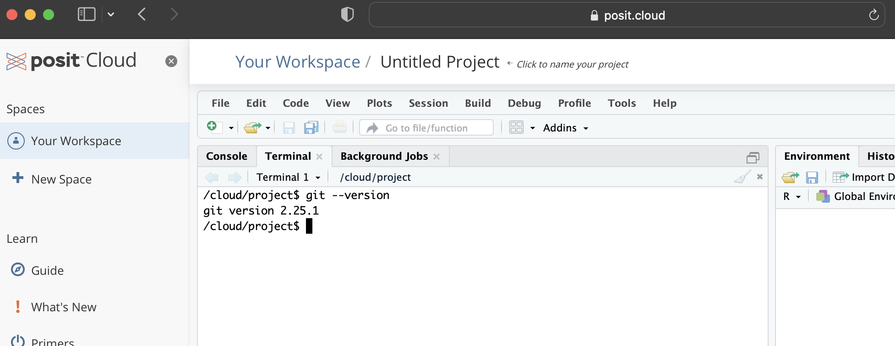{#fig-gitone}

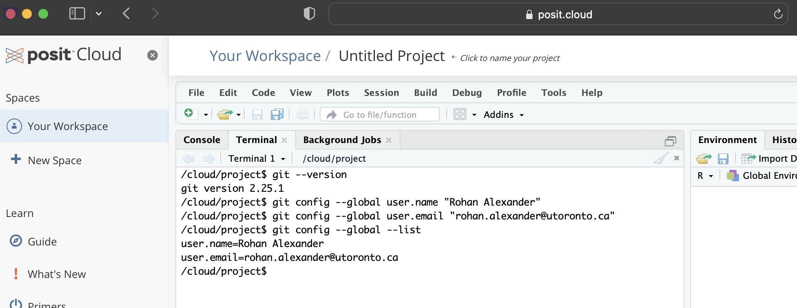{#fig-gitone-setup}

Git 설정 단계 요약

:::

Git은 Posit Cloud\index{Posit Cloud!Git}\index{Git!Posit Cloud}와 Mac에 기본적으로 설치되어 있으며, Windows에도 설치되어 있을 수 있습니다. 만약 버전 번호가 나오지 않는다면 별도로 설치해야 합니다. 설치 방법은 @happygit [5장]의 운영 체제별 지침을 따르십시오.

설치를 마쳤다면 Git에게 자신의 이름과 이메일을 알려줘야 합니다. Git은 스냅샷을 찍을 때마다(Git 용어로 '커밋'할 때마다) 이 정보를 함께 기록하기 때문입니다.

터미널에서 아래 명령어를 입력하십시오. 이때 따옴표 안의 내용은 자신의 정보로 바꾸어야 합니다. 각 줄을 입력할 때마다 Enter 키를 누르십시오.

```bash

#| eval: false
#| echo: true

git config --global user.name "로한 알렉산더"
git config --global user.email "rohan.alexander@utoronto.ca"
git config --global --list

```

설정이 제대로 되었다면 마지막 줄을 입력했을 때 앞서 설정한 이름과 이메일 주소가 화면에 표시됩니다 (@fig-gitone-setup).

여기서 설정한 이름과 이메일 주소는 공개될 수 있습니다. 이메일 주소를 노출하고 싶지 않다면 GitHub에서 제공하는 이메일 숨기기 기능을 활용할 수 있습니다. 자세한 설정 방법과 문제 해결 가이드는 @happygit [7장]을 참고하십시오.

### GitHub

Git 설정을 마쳤다면 이제 GitHub\index{GitHub}를 설정할 차례입니다. [@sec-fire-hose]에서 만든 GitHub 계정을 사용합니다. `github.com`에 로그인한 뒤, 먼저 새로운 폴더를 하나 만듭니다. Git에서는 이를 '저장소(repo)'라고 부릅니다. 화면 오른쪽 상단의 "+" 아이콘을 클릭하고 "New repository"를 선택하십시오 (@fig-githubtwo).

:::{#fig-gritshub layout-nrow=3}

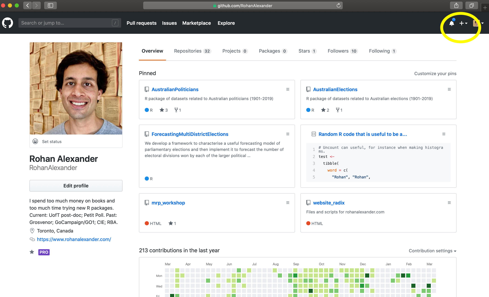{#fig-githubtwo}

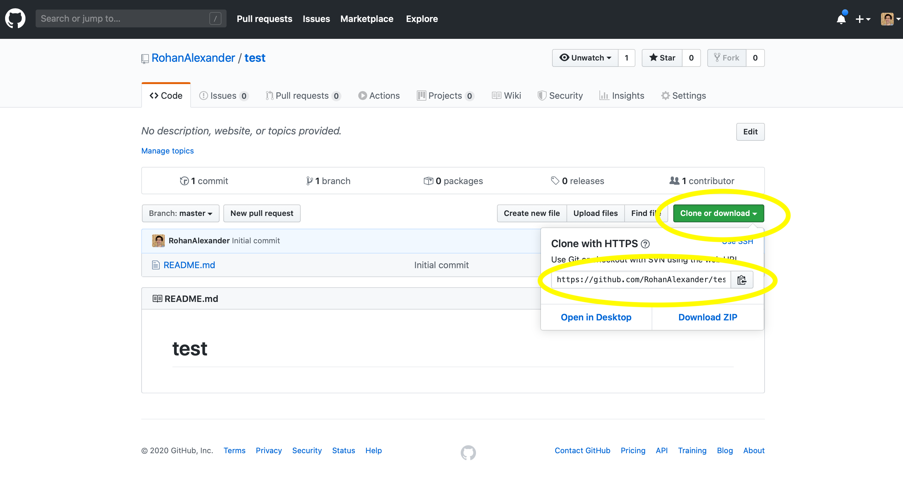{#fig-githubfour}

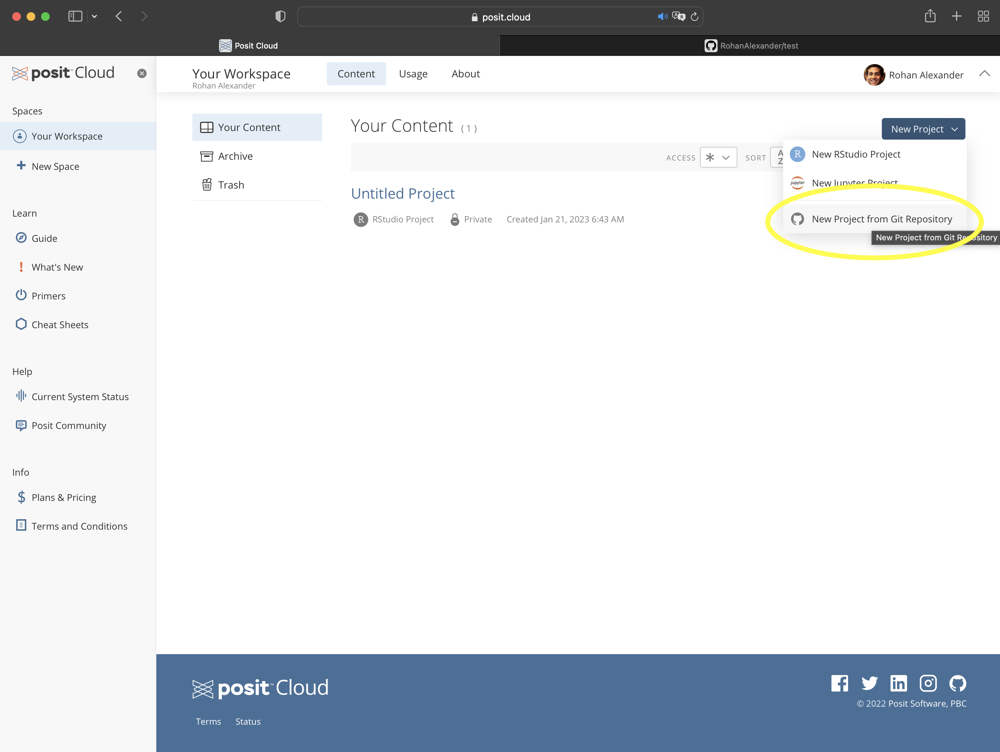{#fig-githubnewproject}

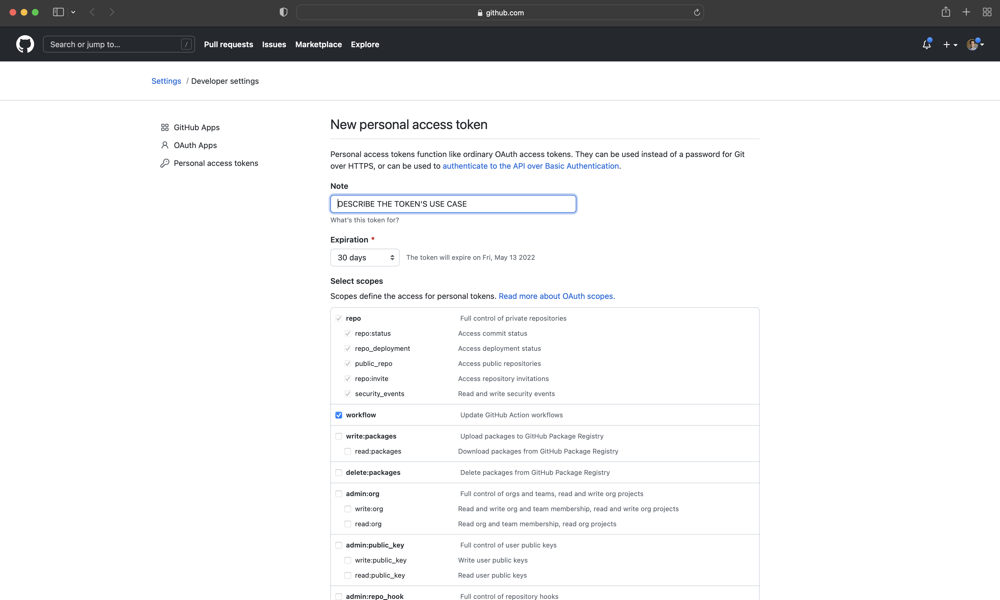{#fig-githubpat}

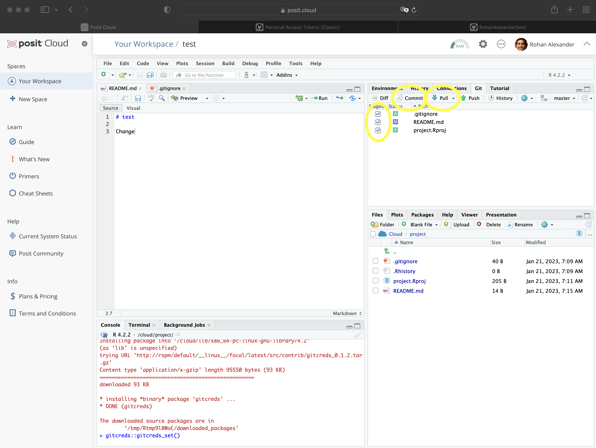{#fig-githubadd}

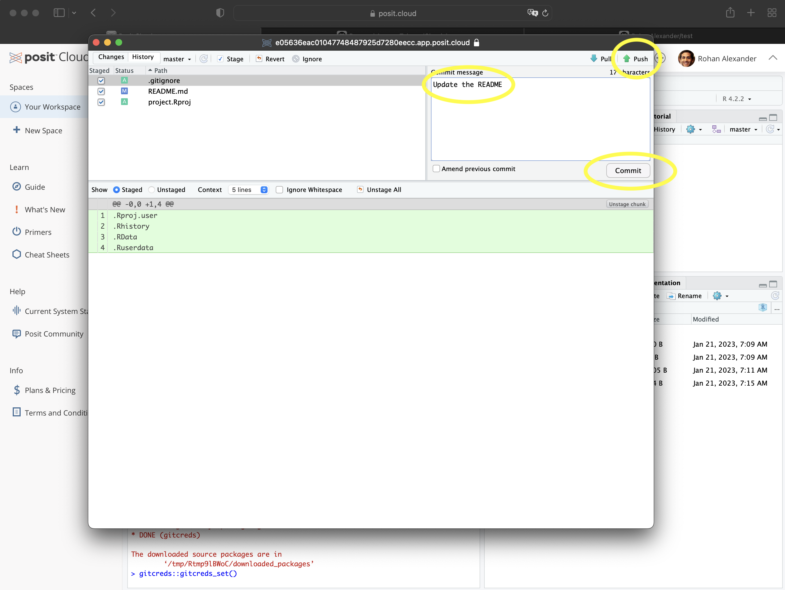{#fig-githubcommit}

GitHub 설정 단계 요약

:::

저장소 이름을 적절히 입력하고, 나중에 삭제할 수 있으므로 공개(Public) 상태로 둡니다. "Initialize this repository with a README" 항목을 체크하고, ".gitignore template"은 "R"로 선택한 뒤 "Create repository"를 클릭하십시오.

저장소가 생성되면 다소 비어 있는 화면이 나타납니다. 여기서 초록색 "Code" 버튼을 클릭하고 나타나는 URL 옆의 아이콘을 눌러 주소를 복사합니다 (@fig-githubfour).

이제 RStudio\index{R!RStudio}로 돌아와 Posit Cloud\index{Posit Cloud}에서 "New Project from Git Repository"를 선택해 새 프로젝트를 만듭니다. 이때 방금 복사한 URL을 입력하면 됩니다 (@fig-githubnewproject). 개인 컴퓨터를 사용한다면 "File" $\rightarrow$ "New Project..." $\rightarrow$ "Version Control" $\rightarrow$ "Git"을 차례로 선택한 뒤 URL을 붙여넣고, 프로젝트 폴더 이름을 지정한 다음 "Create Project"를 클릭하십시오.

이제 GitHub와 연결된 폴더가 생성되었습니다. 로컬의 변경 사항을 GitHub로 보내기(Push) 위해서는 개인 액세스 토큰(PAT)을 통한 인증이 필요합니다. 이를 위해 반복 작업을 돕는 `usethis` 패키지와 인증을 담당하는 `gitcreds` 패키지를 사용합니다. 먼저 R 세션에서 `usethis::create_github_token()`을 실행하면 브라우저에 GitHub 토큰 생성 페이지가 열립니다 (@fig-githubpat). 토큰 이름(Note)을 "RStudio PAT"처럼 알아보기 쉽게 적은 뒤 맨 아래 "Generate token"을 클릭하십시오.

생성된 토큰은 보안상 다시 확인할 수 없으므로 반드시 복사해두어야 합니다. 이 PAT\index{개인 액세스 토큰!GitHub}를 절대 코드나 문서에 직접 적지 마십시오. 대신 `gitcreds::gitcreds_set()`을 실행한 뒤, 콘솔창에 나타나는 입력 칸에 토큰을 붙여넣으면 안전하게 저장됩니다.

GitHub\index{GitHub}를 활용한 작업 흐름은 대개 다음과 같습니다.

1. **Pull (가져오기):** 작업을 시작하기 전, 항상 GitHub의 최신 변경 사항을 먼저 가져와야 합니다. RStudio의 Git 창에서 파란색 아래쪽 화살표(Pull)를 클릭하십시오.
2. **수정:** 로컬 폴더에서 파일을 자유롭게 수정하고 저장합니다. (예: README 파일 업데이트)
3. **Add, Commit, Push (추가, 커밋, 푸시):** 수정이 끝났다면 Git 창에서 변경된 파일을 체크하여 스테이징 영역에 올립니다(Add). "Commit" 버튼을 클릭해 (@fig-githubadd) 무엇이 바뀌었는지 요약한 메시지를 작성하고 다시 "Commit"을 누릅니다 (@fig-githubcommit). 마지막으로 초록색 위쪽 화살표(Push)를 클릭해 변경 사항을 GitHub로 보냅니다.

Git과 GitHub가 처음에는 어렵게 느껴질 수 있습니다. 익숙해질 때까지는 정기적으로 커밋하고 푸시하는 습관을 들이는 것이 좋습니다. 스냅샷이 많을수록 문제 발생 시 되돌리기가 쉽기 때문입니다. 커밋 메시지는 구체적으로 적는 것이 좋습니다. 첫 줄에는 변경 사항을 짧게 요약하고, 한 줄 띄운 뒤 구체적으로 무엇을 왜 바꿨는지 설명하십시오. 예를 들어 다음과 같습니다.

```

그래프 추가

데이터 섹션에 실업률과 인플레이션 추이 그래프를 추가했습니다.

```

정성 들여 작성한 커밋 메시지는 프로젝트의 훌륭한 일지가 됩니다. 또한 커밋 빈도와 전반적인 작업 품질 사이에 상관관계가 있다는 연구 결과도 있습니다 [@sprint2019mining].

한 가지 주의할 점은 GitHub의 파일 크기 제한입니다.\index{GitHub!파일 크기} GitHub는 파일당 100MB로 크기를 제한하며, 50MB가 넘으면 경고를 보냅니다. 대용량 데이터셋을 다루는 데이터 과학 프로젝트에서는 이 제한에 걸리기 쉽습니다. @sec-store-and-share 에서 대용량 데이터 저장법을 다루겠지만, 우선은 ".gitignore" 파일을 사용해 대용량 파일을 Git 추적 대상에서 제외하는 것이 좋습니다. [예시 폴더](https://github.com/RohanAlexander/starter_folder)에도 ".gitignore" 파일이 포함되어 있습니다. 또한 `usethis::git_vaccinate()`를 실행하면 시스템 전체에서 무시해야 할 파일들을 자동으로 설정해줘 편리합니다.

RStudio의 Git 창 덕분에 터미널 사용을 최소화할 수 있었지만, `usethis` 패키지를 활용하면 GitHub 설정 과정을 더욱 간소화할 수 있습니다.

먼저 `usethis::git_sitrep()` 명령어로 Git 설정 상태를 확인해 보십시오. 이름과 이메일 정보가 제대로 나오는지 확인합니다. 정보가 다르다면 `use_git_config()`로 업데이트할 수 있습니다.

```

#| eval: false
#| include: true

use_git_config(
  user.name = "로한 알렉산더",
  user.email = "rohan.alexander@utoronto.ca"
)

```

GitHub 웹사이트에서 먼저 저장소를 만드는 대신, 로컬 프로젝트에서 `use_git()`을 실행해 Git을 시작하고 커밋한 뒤, `use_github()`를 실행해 GitHub 저장소 생성과 첫 푸시를 한꺼번에 처리할 수도 있습니다.

처음에는 Git과 GitHub가 복잡해 보여도 겁먹을 필요 없습니다. 많은 데이터 과학자들이 기초적인 수준만 익혀서 잘 사용하고 있습니다. 핵심은 작업 내용을 잃어버리지 않도록 정기적으로 푸시하는 것입니다.

### Git 충돌 (Merge Conflicts)

크리스토퍼 말로우의 16세기 희곡 *파우스트 박사(Doctor Faustus)*에는 두 가지 버전이 존재합니다. 작가가 원래 의도한 판본이 무엇인지는 아무도 모릅니다. 줄 수조차 @faustus1604 는 2,048줄, @faustus1616 은 2,852줄로 크게 다릅니다 (@fig-githubconflict). 작가가 세상을 떠난 지 오래되어 인류는 이 두 버전을 모두 안고 가는 수밖에 없습니다. 하지만 말로우가 Git을 썼다면 이런 혼란은 없었을 것입니다!

:::{#fig-githubconflict layout-nrow=1}

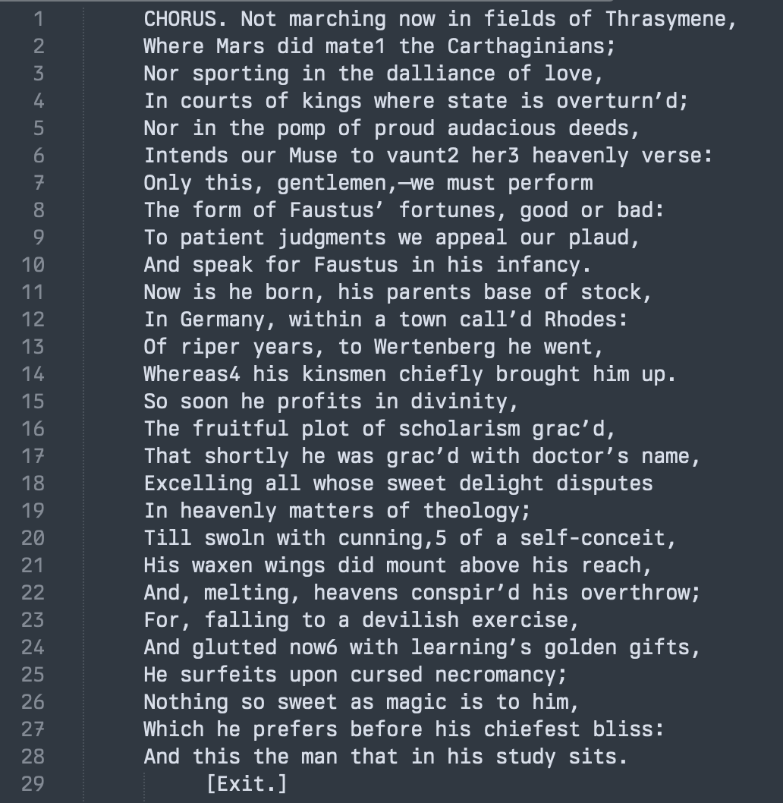{#fig-githubconflictone}

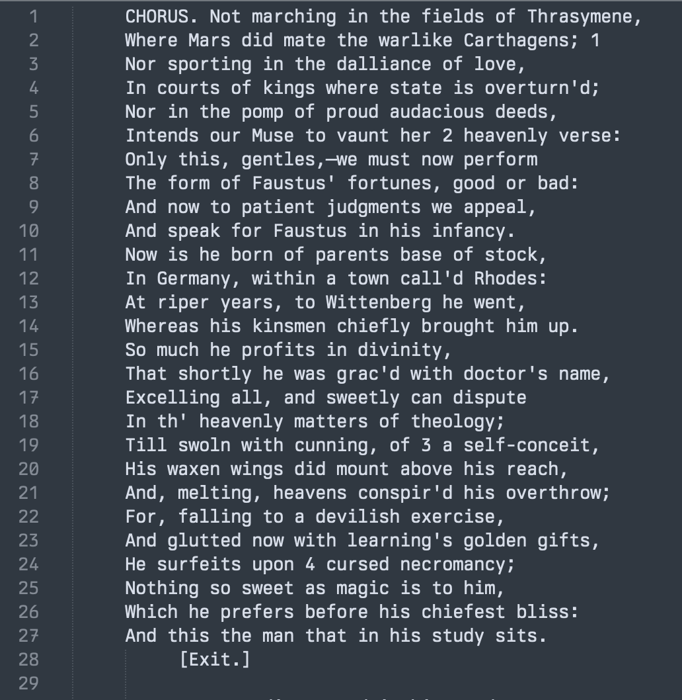{#fig-githubconflicttwo}

파우스트 박사의 두 판본 간 차이점

:::

Git을 쓰다 보면 드물게 '병합 충돌(Merge conflicts)'이 발생합니다. 두 사람이 동시에 같은 파일의 같은 줄을 수정하고 각자 커밋을 올리려 할 때 발생합니다. 이때 Git은 충돌을 알리고, 나중에 커밋을 시도한 사람이 이를 해결하도록 합니다.

Git은 충돌 지점에 특수한 마커를 표시합니다. `<<<<<<< HEAD`와 `=======` 사이에는 내가 수정한 내용이, `=======`와 `>>>>>>> branch_name` 사이에는 다른 사람이 수정한 내용이 나타납니다.

```bash

#| eval: false
#| echo: true

<<<<<<< HEAD
나의 수정 내용
=======
다른 사람의 수정 내용
>>>>>>> new_branch

```

충돌을 해결하는 방법은 간단합니다. 두 내용 중 어떤 것을 유지할지 결정하여 파일을 직접 편집한 뒤, 마커들을 지우고 저장하면 됩니다. 그 다음 평소처럼 Add와 Commit을 진행하면 충돌이 해결됩니다.

## R 실습

### 오류 해결하기 {#sec-dealingwitherrors}

> 프로그래밍을 하다 보면 코드는 반드시 깨지게 되어 있습니다. 여기서 '반드시'라는 건, 아마 하루에도 열 번, 스무 번씩 일어날 일이라는 뜻입니다.
>
> @sharlatalks

R뿐만 아니라 어떤 언어를 쓰더라도 프로그래밍 과정에서 문제를 겪는 것은 매우 자연스러운 일입니다. 프로그래밍은 본질적으로 어렵고, 누구나 코드가 실행되지 않거나 오류를 마주하게 됩니다.\index{R!오류} 좌절감이 들 수도 있겠지만, 중요한 것은 이를 해결하기 위한 자신만의 전략을 갖추는 것입니다.\index{도움말!전략}

1. **오류 메시지 정독:** 오류 메시지가 항상 난해한 것은 아닙니다. 때로는 문제 해결의 직접적인 단서가 들어 있으니 주의 깊게 읽어보십시오.
2. **검색 활용:** 오류 메시지를 그대로 구글링해 보십시오.\index{Google!도움 받기} 검색어에 "tidyverse"나 "in R"을 포함하면 훨씬 정확한 결과를 얻을 수 있습니다. 스택 오버플로우(Stack Overflow)의 답변이 큰 도움이 될 것입니다.
3. **도움말 문서 확인:** 함수 이름 앞에 물음표(?)를 붙여 실행하면 도움말을 볼 수 있습니다(예: `?pivot_wider()`). 대개 인자(argument) 이름을 잘못 적었거나 데이터 형식이 맞지 않아 발생하는 경우가 많습니다.
4. **코드 쪼개기:** 오류가 발생하는 지점을 찾아 그 부분의 코드를 지우거나 주석 처리한 뒤, 코드를 한 줄씩 다시 추가하면서 어디서 문제가 터지는지 확인해 보십시오.
5. **객체 클래스 확인:** `class()` 함수를 사용해 데이터 객체의 형식을 확인하십시오(예: `class(data_set$column)`). 내가 예상한 형식(숫자형, 문자형 등)이 맞는지 확인하는 것만으로도 많은 오류를 잡을 수 있습니다.\index{도움말!클래스 확인}
6. **세션 초기화:** RStudio 상단 메뉴에서 "Session" $\rightarrow$ "Restart R"을 클릭해 R 세션을 완전히 새로 시작해 보십시오.
7. **재부팅:** 최후의 수단으로 컴퓨터를 다시 시작하는 것도 방법입니다.
8. **방법 자체를 검색:** 오류 메시지 대신 "R ggplot2 PDF 저장 방법"처럼 내가 하려는 작업 자체를 검색해 보십시오.
9. **reprex 만들기:** 문제를 작고 독립적인 코드로 축소해 '재현 가능한 예제(reprex)'를 만드십시오. 이는 타인에게 도움을 요청할 때 필수입니다.\index{reprex}\index{도움말!재현 가능한 예제}
10. **청크 레이블 활용:** Quarto 문서에서 각 코드 청크에 이름을 붙여두면 어느 부분에서 오류가 났는지 찾기가 훨씬 수월합니다.

무엇보다 가장 좋은 해결책은 잠시 휴식을 취하고 다음 날 맑은 정신으로 코드를 다시 들여다보는 것입니다. 놀랍게도 어제는 안 보이던 실수가 금방 눈에 들어오곤 합니다.

### 재현 가능한 예제(reprex) {#sec-omgpleasemakeareprexplease}

도움을 요청하는 것 또한 다른 모든 기술처럼 부단한 연습과 요령이 필요한 기술입니다.\index{도움말!재현 가능한 예제} 단순히 "이게 안 돼요", "할 수 있는 건 다 해봤어요", "이 코드가 작동 안 해요"라고 묻지 않도록 노력해야 합니다. 이런 식의 모호한 질문에는 도움을 주기가 매우 어렵습니다. 발생 가능한 원인이 너무나 많기 때문입니다. 타인이 나를 더 효과적으로 도울 수 있게 만들려면 다음과 같은 단계가 필요합니다.\index{도움말!요청하기}

1. 무엇이 잘못되었는지 상세히 설명하고, 데이터와 코드가 포함된 **작고 독립적인 예제**를 제공하십시오.
2. 지금까지 시도해 본 구체적인 해결 방법들을 기록하십시오. 구글링이나 스택 오버플로우(Stack Overflow), 포짓 포럼(Posit Forum) 등에서 어떤 내용을 찾아봤고, 왜 그것들이 해결책이 되지 않았는지 설명하십시오.
3. 내가 궁극적으로 얻고자 하는 결과가 무엇인지 명확히 밝히십시오.

가장 먼저 해야 할 일은 **'최소한의 재현 가능한 예제(Minimal reproducible example)', 즉 'reprex'**를 만드는 것입니다.\index{reprex} 이는 오류를 재현하는 데 꼭 필요한 요소만 남긴 간결한 코드입니다. 실제 코드를 아주 작고 단순하게 축소한 버전이라고 생각하면 됩니다.

실제로 reprex를 만드는 과정에서 스스로 문제를 발견하고 해결하는 경우도 많습니다. 설령 해결하지 못하더라도, 타인이 내 문제를 즉시 파악하고 도움을 줄 수 있는 결정적인 단서를 제공하게 됩니다. 내가 겪고 있는 문제가 인류 역사상 한 번도 발생하지 않은 독보적인 문제일 가능성은 거의 없습니다. 핵심은 내가 하려는 일과 실제 벌어지고 있는 일 사이의 간극을 타인이 이해할 수 있는 언어로 전달하는 것입니다. 이 과정에서 필요한 것은 포기하지 않는 끈기입니다.

재현 가능한 예제를 개발하는 데 `reprex` 패키지가 특히 유용합니다. 사용 방법은 다음과 같습니다.

1. `reprex` 패키지를 로드합니다: `library(reprex)`.
2. 문제가 있는 코드를 블록 지정하여 복사합니다.
3. 콘솔 창에서 `reprex()`를 입력하고 실행합니다.

코드가 독립적으로 실행 가능한 상태라면 뷰어(Viewer) 창에 미리보기가 나타납니다. 만약 오류가 난다면, 해당 코드가 다른 설정 없이도 그 자체로 실행될 수 있도록 코드를 보완해야 합니다.

오류 재현에 데이터가 필요하다면 R에 기본으로 내장된 데이터를 활용하십시오. `library(help = "datasets")` 명령어로 내장 데이터 목록을 볼 수 있습니다. 가급적 `mtcars`나 `faithful`처럼 유명한 데이터를 쓰는 것이 좋습니다. [@sec-fire-hose]에서 소개한 GitHub Gist와 reprex를 함께 활용하면 더욱 효과적으로 도움을 받을 수 있습니다.

### 사고방식

> 어떤 개발 환경(IDE)을 쓰든, 어떤 도구를 사용해 작업하든, 여러분은 이미 실제적이고 유효하며 **역량 있는** 사용자이자 프로그래머입니다.
>
> 주저 말고 문을 부수고 들어오세요. 이곳에는 우리 모두를 위한 충분한 자리가 있습니다.
>
> Sharla Gelfand, 2020년 3월 10일.

코드를 작성하고 있다면 여러분은 이미 프로그래머입니다. 그 목적이나 방식, 배경은 중요하지 않습니다.\index{코드!특성} 다만 뛰어난 프로그래머들이 공통적으로 지향하는 몇 가지 태도가 있습니다.

- **구체적인 목표 지정:** "R 배우기"와 같은 목표는 끝이 보이지 않아 막막하기 쉽습니다. 대신 "ggplot2를 사용하여 2022년 호주 선거 결과 히스토그램 만들기"처럼 작고 구체적인 목표를 세우는 것이 훨씬 효율적입니다. 이는 몇 시간 안에 집중해서 달성할 수 있는 목표입니다. 모호한 목표는 도중에 길을 잃거나 좌절하여 너무 일찍 포기하게 만들 수 있습니다.
- **호기심:** "일단 해보는 것"은 언제나 가치 있습니다. 확신이 서지 않는다면 그냥 실행해 보십시오. 최악의 경우 약간의 시간을 낭비할 뿐, 컴퓨터를 돌이킬 수 없이 망가뜨리는 일은 거의 없습니다. 예를 들어, 데이터프레임이 아닌 벡터를 `ggplot()`에 넣으면 어떻게 되는지 궁금하다면 직접 확인해 보십시오.
- **실용적 접근:** 동시에 너무 큰 변화를 한꺼번에 시도하기보다 작은 단계로 나누어 진행하는 것이 좋습니다. 예를 들어, 선형 회귀 분석을 `lm()` 대신 `rstanarm`으로 수행하고 싶다면, 먼저 `rstanarm`의 기초적인 기능부터 하나씩 적용해 보며 익혀 나가는 식입니다.
- **인내와 결단:** 모든 프로젝트에는 예상치 못한 난관이 따릅니다. 끈기 있게 문제를 파헤치는 것도 중요하지만, 때로는 도저히 해결되지 않는 부분에서 과감히 방향을 틀 줄도 알아야 합니다. 이 균형은 경험이 많은 멘토의 도움을 받으면 더 빨리 터득할 수 있습니다.
- **철저한 계획:** 코드를 짜기 전, 수행할 작업을 단계별로 나누어 보는 과정은 매우 유용합니다. 히스토그램을 만든다면 1) 데이터 수집, 2) 라이브러리 선택, 3) 데이터 정제 등 세부 과정을 스케치해 보십시오. 예상치 못한 문제에 대비한 백업 계획을 세워두는 것도 좋습니다.
- **완벽보다 완료:** 많은 이들이 완벽주의 때문에 시작을 주저합니다. 하지만 처음에는 일단 '돌아가는 코드'를 만드는 데 집중하십시오. 나중에 언제든지 다듬을 수 있습니다. 완성되지 않은 아름다운 코드보다, 다소 투박하더라도 세상에 나온 결과물이 훨씬 가치 있습니다. 일단 끝내는 것이 중요합니다.

### 코드 주석 및 스타일

코드는 주석 처리되어야 합니다.\index{코드!주석} 주석은 특정 코드가 작성된 이유와 일반적인 대안이 선택되지 않은 이유에 중점을 두어야 합니다. 실제로 코드를 작성하기 전에 주석을 작성하여 무엇을 하고 싶은지, 왜 하고 싶은지 설명한 다음 코드를 작성하는 것이 좋습니다 [@refactoringbook, p. 59].

특히 R에서는 코드를 작성하는 한 가지 방법만 있는 것은 아닙니다. 그러나 혼자 작업하더라도 더 쉽게 작업할 수 있는 몇 가지 일반적인 지침이 있습니다. 대부분의 프로젝트는 시간이 지남에 따라 진화하며, 코드 주석의 한 가지 목적은 미래의 당신이 수행된 작업과 특정 결정이 내려진 이유를 다시 추적할 수 있도록 하는 것입니다 [@bowers2016improve].

R 스크립트의 주석은 # 기호를 포함하여 추가할 수 있습니다. (#의 동작은 Quarto 문서의 R 청크 내부 줄과 R 청크 외부 줄에서 헤더 수준을 설정하는 것과 다릅니다.) 줄 시작 부분에 주석을 넣을 필요는 없으며, 중간에 넣을 수도 있습니다. 일반적으로 코드의 모든 측면이 무엇을 하는지 주석을 달 필요는 없지만, 명확하지 않은 부분은 주석을 달아야 합니다. 예를 들어, 어떤 값을 읽어들이는 경우 어디에서 왔는지 주석을 달고 싶을 수 있습니다.

무엇을 하고 있는지 주석을 달아야 합니다 [@tidyversestyleguide]. 무엇을 달성하려고 합니까? 이상한 점을 설명하기 위해 주석을 달아야 합니다. 예를 들어, 특정 행, 예를 들어 27번 행을 제거하는 경우 왜 그 행을 제거하는지 설명해야 합니다. 그 순간에는 명확해 보일 수 있지만, 미래의 당신은 기억하지 못할 것입니다.

코드를 섹션으로 나누어야 합니다. 예를 들어, 작업 공간 설정, 데이터 세트 읽기, 데이터 세트 조작 및 정리, 데이터 세트 분석, 마지막으로 표 및 그림 생성 등이 있습니다. 각 섹션은 무엇이 진행되고 있는지 설명하는 주석으로 구분되어야 하며, 길이에 따라 별도의 파일로 나눌 수도 있습니다.

또한 각 파일의 상단에는 파일의 목적, 전제 조건 또는 종속성, 날짜, 저자 및 연락처 정보, 마지막으로 위험 요소 또는 할 일과 같은 기본 정보를 기록하는 것이 중요합니다.

R 스크립트에는 서문과 명확한 섹션 구분이 있어야 합니다.

```

#### 서문 ####
# 목적: 이 스크립트가 하는 일에 대한 간략한 문장
# 저자: 당신의 이름
# 날짜: 작성된 날짜
# 연락처: 이메일 추가
# 라이선스: 코드가 어떻게 사용될 수 있는지 생각하십시오.
# 전제 조건:
# - 일부 데이터 또는 다른 스크립트가 실행되어야 할 수도 있습니까?

#### 작업 공간 설정 ####
# install.packages 줄을 유지하지 마십시오. 필요한 경우 주석 처리하십시오.
# 패키지 로드
library(tidyverse)

# 편집되지 않은 데이터 읽기.
raw_data <- read_csv("inputs/data/unedited_data.csv")

#### 다음 섹션 ####
...

```

마지막으로, 코드가 작동하기 위해 사용자가 코드를 주석 처리하거나 주석 해제하는 것, 또는 디렉토리 지정과 같은 다른 수동 단계에 의존하지 않도록 노력하십시오. 이렇게 하면 자동화된 코드 검사 및 테스트를 사용할 수 없게 됩니다.

이 모든 것은 시간이 걸립니다. 대략적인 경험 법칙으로, 코드를 작성하는 데 걸린 시간만큼 주석을 달고 코드를 개선하는 데 시간을 할애해야 합니다. 잘 주석 처리된 코드의 예로는 @AhadyDolatsara2021 및 @burton2021reconsidering 이 있습니다.

### 테스트

테스트\index{테스트}는 코드 전체에 작성되어야 하며, 끝에서 한꺼번에 작성하는 것이 아니라 진행하면서 작성해야 합니다. 이렇게 하면 속도가 느려질 것입니다. 그러나 생각하는 데 도움이 되고 실수를 수정하는 데 도움이 되어 코드를 더 좋게 만들고 전반적인 생산성을 향상시킬 것입니다. 테스트 없는 코드는 의심스럽게 보아야 합니다. R 패키지 [@Vidoni2021]의 테스트 관행은 물론 R 코드 전반에 걸쳐 개선의 여지가 있습니다.

다른 사람들, 그리고 이상적으로는 자동화된 프로세스가 코드를 테스트해야 하는 필요성은 우리가 재현성을 강조하는 이유 중 하나입니다. 또한 파일 경로를 하드코딩하지 않고, 프로젝트를 사용하고, 파일 이름에 공백을 두지 않는 것과 같은 작은 측면을 강조하는 이유이기도 합니다.\index{재현성}

완전하고 일반적인 테스트 스위트를 정의하기는 어렵지만, 일반적으로 다음을 테스트하려고 합니다.

1) 경계 조건,
2) 클래스,
3) 누락된 데이터,
4) 관측치 및 변수의 수,
5) 중복,
6) 회귀 결과.

이 모든 것을 처음에는 시뮬레이션된 데이터에서 수행한 다음 실제 데이터로 이동합니다. 이는 아폴로 프로그램 중 테스트의 진화를 반영합니다. 처음에는 요구 사항에 대한 기대를 기반으로 테스트가 수행되었으며, 이러한 테스트는 나중에 실제 발사 측정값을 고려하도록 업데이트되었습니다 [@testingforsuccess, p. 21]. 무한한 수의 테스트를 작성할 수 있지만, 많은 생각 없는 테스트보다 적은 수의 고품질 테스트가 더 좋습니다.

테스트의 한 종류로 **'어설션(Assertion)'**이 있습니다.\index{테스트!어설션} 어설션은 코드 실행 중에 특정 조건이 '참'인지를 확인하고, 그렇지 않으면 즉시 실행을 중단하는 안전장치입니다 [@researchsoftware, p. 272]. 예를 들어, 특정 변수가 반드시 숫자여야 한다고 어설션할 수 있습니다. 만약 해당 변수가 문자형으로 밝혀지면 테스트는 실패하고 스크립트는 멈춥니다. 데이터 과학에서는 주로 데이터 정제 및 준비 단계에서 어설션을 적극적으로 활용합니다. 이에 대해서는 @sec-clean-and-prepare 에서 더 자세히 다룹니다. 또한 코드의 특정 기능이 의도한 대로 작동하는지 확인하는 **단위 테스트(Unit test)**도 중요합니다 [@researchsoftware, p. 274].\index{테스트!단위 테스트} 이는 모델링 단계를 다루는 @sec-its-just-a-linear-model 에서 다시 살펴보겠습니다.

## 효율성

일반적으로\index{효율성!코드} 이 책에서는 무언가를 완료하는 데만 관심이 있습니다. 가장 좋거나 가장 효율적인 방법으로 완료하는 데는 반드시 관심이 없습니다. 왜냐하면 대부분의 경우 그것에 대해 걱정하는 것은 시간 낭비이기 때문입니다. 대부분의 경우 클라우드에 푸시하고 합리적인 시간 동안 실행되도록 한 다음 파이프라인의 다른 측면에 대해 걱정하는 것이 더 좋습니다. 그러나 그것은 결국 불가능해집니다. 특정 시점에서 (그리고 이는 상황에 따라 다릅니다) 효율성이 중요해집니다. 결국 못생기거나 느린 코드, 그리고 특정 방식으로 작업을 수행하려는 독단적인 고집은 영향을 미칩니다. 그리고 그 시점에서 효율성을 보장하기 위해 새로운 접근 방식에 개방적이어야 합니다. 명백한 성능 향상을 위한 가장 일반적인 영역은 거의 없습니다. 대신 측정, 평가 및 사고 능력을 개발하는 것이 중요합니다.

코드 효율성을 향상시키는 가장 좋은 방법 중 하나는 다른 사람의 시선을 빌릴 수 있도록 준비하는 것입니다.\index{동료 검토}\index{효율성!공유를 통해} 그들의 시간을 최대한 활용하려면 코드를 읽기 쉽게 만드는 것이 중요합니다. 그래서 "코드 린팅"과 "스타일링"으로 시작합니다. 이것은 코드 속도를 높이는 것이 아니라, 다른 사람이 코드를 보거나 우리가 다시 방문할 때 더 효율적으로 만듭니다. 이를 통해 공식적인 코드 검토 및 리팩토링이 가능해집니다. 리팩토링은 코드를 더 좋게 만들기 위해 코드를 다시 작성하는 것이지만, 코드가 하는 일을 변경하지는 않습니다 (동일한 작업을 다른 방식으로 수행합니다). 그런 다음 실행 시간 측정으로 전환하고 병렬 처리를 도입하여 컴퓨터가 여러 프로세스에 대한 코드를 동시에 실행할 수 있도록 합니다.

### 코드 환경 공유

:::{.content-visible when-format="pdf"}

우리는 코드 공유의 필요성에 대해 길게 논의했으며, GitHub를 사용하여 이에 대한 접근 방식을 제시했습니다.\index{재현성}\index{효율성!재현성} 그리고 @sec-store-and-share 에서는 데이터 공유에 대해 논의할 것입니다. 그러나 다른 사람들이 우리의 코드를 실행할 수 있도록 하는 또 다른 요구 사항이 있습니다. @sec-fire-hose 에서 R 자체와 R 패키지가 새로운 기능이 개발되고 오류가 수정되며 기타 일반적인 개선 사항이 있을 때마다 때때로 업데이트된다는 점을 논의했습니다. ["R 필수 사항" 온라인 부록](https://tellingstorieswithdata.com/20-r_essentials.html)은 `tidyverse`의 한 가지 장점이 더 구체적이기 때문에 기본 R보다 더 빠르게 업데이트될 수 있다는 점을 설명합니다. 그러나 이는 우리가 사용하는 모든 코드와 데이터를 공유하더라도 사용 가능한 소프트웨어 버전이 오류를 유발할 수 있음을 의미할 수 있습니다.

:::

:::{.content-visible unless-format="pdf"}

우리는 코드 공유의 필요성에 대해 길게 논의했으며, GitHub를 사용하여 이에 대한 접근 방식을 제시했습니다.\index{재현성}\index{효율성!재현성} 그리고 @sec-store-and-share 에서는 데이터 공유에 대해 논의할 것입니다. 그러나 다른 사람들이 우리의 코드를 실행할 수 있도록 하는 또 다른 요구 사항이 있습니다. @sec-fire-hose 에서 R 자체와 R 패키지가 새로운 기능이 개발되고 오류가 수정되며 기타 일반적인 개선 사항이 있을 때마다 때때로 업데이트된다는 점을 논의했습니다. [온라인 부록 -@sec-r-essentials]은 `tidyverse`의 한 가지 장점이 더 구체적이기 때문에 기본 R보다 더 빠르게 업데이트될 수 있다는 점을 설명합니다. 그러나 이는 우리가 사용하는 모든 코드와 데이터를 공유하더라도 사용 가능한 소프트웨어 버전이 오류를 유발할 수 있음을 의미할 수 있습니다.

:::

이에 대한 해결책은 사용된 환경을 자세히 설명하는 것입니다.\index{재현성} 이를 수행하는 방법은 여러 가지가 있으며 복잡성을 더할 수 있습니다. 우리는 R 및 R 패키지의 사용된 버전을 문서화하고 다른 사람들이 정확한 버전을 더 쉽게 설치할 수 있도록 하는 데 중점을 둡니다. 본질적으로 우리는 재현성에 도움이 될 것이기 때문에 사용한 설정을 격리하는 것입니다 [@perkel2023]. `R`에서는 `renv`를 사용하여 이를 수행할 수 있습니다.

`renv`가 설치되고 로드되면 `init()`를 사용하여 필요한 인프라를 설정합니다.\index{효율성!재현성} 사용된 패키지와 버전을 기록할 파일을 만들 것입니다. 그런 다음 `snapshot()`을 사용하여 실제로 사용 중인 것을 문서화합니다. 이렇게 하면 정보를 기록하는 "잠금 파일"이 생성됩니다.

R 프로젝트에서 어떤 패키지를 사용하고 있는지 확인하려면 `dependencies()`를 사용할 수 있습니다. [예제 폴더](https://github.com/RohanAlexander/starter_folder)에 대해 이 작업을 수행하면 `rmarkdown`, `bookdown`, `knitr`, `rmarkdown`, `bookdown`, `knitr`, `palmerpenguins`, `tidyverse`, `renv`, `haven`, `readr`, `tidyverse` 패키지가 사용됨을 나타냅니다.

원한다면 잠금 파일("renv.lock")을 열어 정확한 버전을 확인할 수 있습니다. 잠금 파일은 설치된 다른 모든 패키지와 다운로드된 위치도 문서화합니다. 외부에서 이 프로젝트에 접근하는 사람은 `restore()`를 사용하여 우리가 사용한 패키지의 정확한 버전을 설치할 수 있습니다.

### 코드 린팅 및 스타일링

코드는 작성하는 시간보다 읽히는 시간이 훨씬 깁니다. 따라서 실행 속도만큼이나 중요한 것이 '반복과 협업의 효율성'입니다.\index{효율성!코드} @oldlanguages [p. 26]가 지적했듯, 이미 1954년에도 프로그래머의 인건비는 컴퓨터 비용에 비견될 정도였고, 오늘날 컴퓨팅 자원은 더욱 저렴해졌습니다. 성능이 뛰어난 코드도 좋지만, 동료(혹은 미래의 나)의 시간을 아껴주는 코드가 더 가치 있습니다. 코드는 보통 한 번 쓰고 버려지지 않으며, 버그 수정 등을 위해 반드시 다시 읽어야 합니다. 즉, 코드는 사람에게 읽히기 위해 작성되어야 합니다 [@beautifulcode, p. 478]. 가독성을 무시하면 결국 전체적인 개발 효율이 떨어지게 됩니다.

**린팅(Linting)**과 **스타일링(Styling)**은 주로 스타일의 일관성을 검사하고 코드를 읽기 좋게 다듬는 과정입니다. (린팅은 괄호를 닫지 않는 등의 문법 오류를 잡아내기도 하지만, 여기서는 스타일에 집중합니다.) 최고의 효율성 개선은 코드를 읽기 쉽게 만드는 데서 시작됩니다. 이는 휴식 후 코드로 돌아온 나 자신에게도 큰 도움이 됩니다. 미국의 퀀트 트레이딩 기업 제인 스트리트(Jane Street)\index{Jane Street}가 코드 가독성을 그토록 강조하는 이유는 그것이 곧 리스크 관리의 핵심이기 때문입니다 [@minsky2011ocaml]. 우리가 수십억 달러를 굴리는 트레이더는 아닐지라도, 오류 없는 코드를 원하는 마음은 같을 것입니다.

`lintr`의 `lint()`를 사용하여 코드를 린팅합니다. 예를 들어, 다음 R 코드를 고려하십시오 ("linting_example.R"로 저장됨).

```

#| include: true
#| message: false
#| warning: false
#| eval: false

SIMULATED_DATA <-
  tibble(
    division = c(1:150, 151),
    party = sample(
      x = c("Liberal"),
      size = 151,
      replace = T
    )
  )

```

```

#| echo: true
#| eval: false

lint(filename = "linting_example.R")

```

결과는 "linting_example.R" 파일이 열리고 `lint()`가 찾은 문제가 "마커"에 인쇄됩니다 (@fig-linter). 그런 다음 문제를 처리하는 것은 당신에게 달려 있습니다.

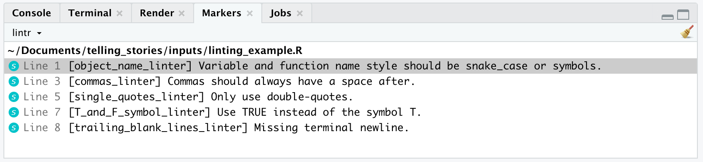{#fig-linter width=90% fig-align="center"}

권장 변경 사항을 적용하면 @tidyversestyleguide 에서 정의한 모범 사례와 일치하는 더 읽기 쉬운 코드가 생성됩니다.

```

#| include: true
#| message: false
#| warning: false
#| eval: false

simulated_data <-
  tibble(
    division = c(1:150, 151),
    party = sample(
      x = c("Liberal"),
      size = 151,
      replace = TRUE
    )
  )

```

처음에는 린터\index{코드!린팅}가 식별하는 일부 측면, 예를 들어 후행 공백과 이중 따옴표만 사용하는 것이 작고 중요하지 않게 보일 수 있습니다.\index{효율성!작은 것부터 고치기} 그러나 그것들은 더 큰 문제를 해결하는 데 방해가 됩니다. 또한, 작은 것을 제대로 처리할 수 없다면, 누가 우리가 큰 것을 제대로 처리할 수 있다고 믿을 수 있겠습니까? 따라서 린터가 식별하는 모든 작은 측면을 처리하는 것이 중요합니다.

`lintr` 외에도 `styler`도 사용합니다. 이것은 린터와 달리 스타일 문제를 자동으로 조정합니다. 린터는 검토할 문제 목록을 제공했습니다. 이를 실행하려면 `style_file()`을 사용합니다.

```

#| echo: true
#| eval: false

style_file(path = "linting_example.R")

```

이렇게 하면 공백 및 들여쓰기와 같은 변경 사항이 자동으로 적용됩니다. 따라서 오류가 발생하지 않았는지 변경 사항을 검토하고 확인하기 위해 프로젝트가 끝날 때 한 번만 하는 것이 아니라 정기적으로 수행해야 합니다.

### 코드 검토

이러한 스타일 측면을 모두 처리한 후 코드 검토\index{코드!검토}\index{효율성!코드 검토}로 넘어갈 수 있습니다. 이는 다른 사람이 코드를 검토하고 비판하는 과정입니다. 많은 전문 작가들은 편집자를 가지고 있으며, 코드 검토는 데이터 과학에서 이에 가장 가깝습니다. 코드 검토는 코드 작성의 중요한 부분이며, @researchsoftware [p. 465]는 이를 "버그를 찾는 가장 효과적인 방법"이라고 설명합니다. 특히 코딩을 배울 때 피드백을 받는 것이 개선에 큰 도움이 되기 때문에 매우 유용하지만, 상당히 부담스러울 수 있습니다.

다른 사람의 코드를 검토할 때 정중하고 협력적인 태도를 취하십시오.\index{도움말!제공} 공백 및 구분과 같은 스타일과 관련된 작은 측면은 린터와 스타일러가 처리했어야 하지만, 그렇지 않은 경우 이에 대한 일반적인 권장 사항을 제시하십시오. 데이터 과학에서 코드 검토자로서 대부분의 시간은 다음과 같은 측면에 할애해야 합니다.

1) 정보가 담긴 README가 있습니까? 어떻게 개선할 수 있습니까?
2) 파일 이름과 변수 이름이 일관되고, 정보가 담겨 있으며, 의미가 있습니까?
3) 주석을 통해 무엇이 수행되고 있는지 이해할 수 있습니까?
4) 테스트가 적절하고 충분합니까? 고려되지 않은 예외적인 경우나 코너 솔루션이 있습니까? 마찬가지로, 불필요한 테스트가 제거될 수 있습니까?
5) 변수로 변경하고 설명할 수 있는 매직 넘버가 있습니까?
6) 변경할 수 있는 중복 코드가 있습니까?
7) 해결해야 할 미해결 경고가 있습니까?
8) 더 작은 함수로 분리할 수 있는 특히 큰 함수나 파이프가 있습니까?
9) 프로젝트의 구조가 적절합니까?
10) 코드를 데이터로 변경할 수 있습니까 [@researchsoftware, p. 462]?

예를 들어, 총리와 대통령의 이름을 찾는 코드를 고려해 봅시다. 이 코드를 처음 작성했을 때 관련 이름을 코드에 직접 추가했을 것입니다. 그러나 코드 검토의 일부로, 이를 변경하도록 권장할 수 있습니다. 관련 이름의 작은 데이터 세트를 만들고, 해당 데이터 세트를 조회하도록 코드를 다시 작성하도록 권장할 수 있습니다.

코드 검토는 코드가 적어도 한 명의 다른 사람에게 이해될 수 있도록 보장합니다. 이는 세상에 대한 지식을 구축하는 데 중요한 부분입니다. Google\index{Google}에서 코드 검토는 주로 결함을 찾는 것이 아니라, 가독성과 유지 보수성을 보장하고 교육을 제공하는 것입니다 [@codereview]. Jane Street\index{Jane Street}에서도 마찬가지입니다. 그들은 코드 검토를 사용하여 버그를 잡고, 기관 지식을 공유하고, 교육을 지원하며, 직원이 읽을 수 있는 코드를 작성하도록 의무화합니다 [@ocamlyaronpodcast].

마지막으로, 코드 검토는 번거롭고 하루 종일 걸리는 모든 코드를 읽는 과정이 될 필요도 없고 되어서도 안 됩니다. 최고의 코드 검토는 단 하나의 파일에 대한 빠른 검토이며, 몇 줄의 변경 사항을 제안하는 데 중점을 둡니다. 실제로 한 명의 개인이 아닌 소규모 팀이 검토하는 것이 더 나을 수 있습니다. 한 번에 너무 많은 코드를 검토하지 마십시오. 최대 몇 백 줄 정도이며, 이는 약 한 시간이 걸려야 합니다. 그 이상은 효율성 감소와 관련이 있는 것으로 밝혀졌기 때문입니다 [@cohen2006best, p. 79].

### 코드 리팩토링

코드를 리팩토링한다는 것은 새 코드가 이전 코드와 동일한 결과를 달성하지만, 새 코드가 더 잘 수행하도록 다시 작성하는 것을 의미합니다.\index{효율성!코드} 예를 들어, @refactornature 중요한 영국 코로나 모델의 기반이 되는 코드가 처음에 역학자들에 의해 작성되었으며,\index{역학} 몇 달 후 왕립 학회, Microsoft 및 GitHub 팀에 의해 명확하고 정리되었다고 논의합니다. 이는 두 버전 모두 동일한 입력이 주어졌을 때 동일한 출력을 생성했음에도 불구하고 모델에 대한 더 많은 신뢰를 제공했기 때문에 가치 있었습니다.\index{신뢰!확립}

우리는 일반적으로 다른 사람이 작성한 코드와 관련하여 코드 리팩토링을 언급합니다. (비록 우리가 실제로 코드를 작성했지만, 그것이 오래 전의 일일 수도 있습니다.) 코드를 리팩토링하기 시작할 때, 다시 작성된 코드가 원본 코드와 동일한 결과를 달성하는지 확인하고 싶습니다. 이는 우리가 의존할 수 있는 적절한 테스트 스위트가 작성되어 있어야 함을 의미합니다. 이러한 테스트가 존재하지 않는다면, 우리는 그것들을 생성해야 할 수도 있습니다.\index{코드!테스트}

우리는 다른 사람들이 더 쉽게 이해할 수 있도록 코드를 다시 작성하며, 이는 우리의 결론에 대한 더 많은 신뢰를 가능하게 합니다.\index{신뢰!확립} 그러나 그렇게 하기 전에 기존 코드가 무엇을 하는지 이해해야 합니다. 시작하는 한 가지 방법은 코드를 살펴보고 광범위한 주석을 추가하는 것입니다. 이러한 주석은 일반적인 주석과 다릅니다. 이는 각 코드 청크가 무엇을 하려고 하는지, 그리고 어떻게 개선될 수 있는지 이해하려는 우리의 적극적인 과정입니다.

코드 리팩토링은 코드가 모범 사례를 충족하는지 확인할 수 있는 기회입니다.\index{코드!모범 사례} @Trisovic2022 9,000개의 R 스크립트를 검토한 결과 다음과 같은 핵심 권장 사항을 제시합니다.

1. `setwd()` 및 모든 절대 경로를 제거하고, ".Rproj" 파일과 관련된 상대 경로만 사용하도록 합니다.
2. 명확한 실행 순서가 있는지 확인합니다. 처음에는 파일 이름에 숫자를 사용하여 이를 달성하도록 권장했지만, 결국에는 `targets` [@targets]와 같은 더 정교한 접근 방식을 대신 사용할 수 있습니다.
3. 코드가 다른 컴퓨터에서 실행될 수 있는지 확인합니다.

예를 들어, 다음 코드를 고려하십시오.

```

#| eval: false

setwd("/Users/rohanalexander/Documents/telling_stories")

library(tidyverse)

d = read_csv("cars.csv")

mtcars =
  mtcars |>
  mutate(K_P_L = mpg / 2.352)

library(datasauRus)

datasaurus_dozen

```

R 프로젝트를 생성하여 `setwd()`를 제거하고, 모든 `library()` 호출을 맨 위에 그룹화하고, "=" 대신 "<-"를 사용하고, 변수 이름을 일관되게 유지하여 변경할 수 있습니다.

```

#| eval: false

library(tidyverse)
library(datasauRus)

cars_data <- read_csv("cars.csv")

mpg_to_kpl_conversion_factor <- 2.352

mtcars <-
  mtcars |>
  mutate(kpl = mpg / mpg_to_kpl_conversion_factor)

```

## 결론

이 장에서는 꽤 많은 내용을 다뤘습니다. 만약 지금 압도되는 기분이 든다면 그것은 지극히 정상입니다. 필요할 때마다 Quarto 섹션으로 돌아와 내용을 확인해 보십시오. 많은 사람이 Git과 GitHub를 어려워하며, 대부분의 분석가도 필요한 최소한의 기능만 숙지한 채 사용하고 있습니다. 효율성에 대해서도 길게 논의했지만, 핵심은 단 하나입니다. 코드를 읽기 쉽게 만드십시오. 그것이 동료는 물론, 며칠 뒤에 다시 코드를 열어볼 나 자신을 위한 가장 훌륭한 배려입니다.

## 연습 문제

### 실습 {.unnumbered}

1. *(계획)* 다음 시나리오를 설정해 봅시다: *어떤 국가의 의회에는 항상 4개의 정당만 존재합니다. 각 지역구에서 최다 득표를 한 후보가 해당 의석을 차지하며, 의회 의석은 총 175석입니다. 분석가는 각 정당이 지역구별로 얻은 득표수에 관심을 두고 있습니다.* 데이터셋의 구조가 어떠할지, 그리고 전체 관측치를 효과적으로 보여줄 수 있는 그래프가 무엇일지 스케치해 보십시오.
2. *(시뮬레이션)* 위 시나리오를 구체화하여 데이터를 시뮬레이션해 봅시다. 아래 코드를 참고하여 상황을 설정하고, 생성된 데이터를 바탕으로 데이터의 무결성을 확인할 수 있는 5가지 테스트를 작성해 보십시오.

```

#| eval: false
#| echo: true

library(tidyverse)

election_results <-
  tibble(
    seat = rep(1:175, each = 4),
    party = rep(x = 1:4, times = 175),
    votes = runif(n = 175 * 4, min = 0, max = 1000) |> floor()
  )

```

3. *(획득)* 관심 있는 국가의 실제 투표 데이터 소스를 지정하십시오.
4. *(탐색)* 다음 코드로 시작하여 각 정당이 얻은 의석 수 표를 만드십시오.

```

#| eval: false
#| echo: true

library(tidyverse)

election_results |>
  slice_max(votes, n = 1, by = seat) |>
  count(party) |>
  tt()

```

5. *(공유)* 식별한 소스에서 데이터를 수집한 것처럼 (시뮬레이션된 것이 아니라) 그리고 시뮬레이션된 데이터를 사용하여 만든 표가 실제 상황을 반영한 것처럼 두 단락을 작성하십시오. 단락에 포함된 정확한 세부 정보는 사실일 필요는 없지만 합리적이어야 합니다 (즉, 실제로 데이터를 얻거나 그래프를 만들 필요는 없습니다). 코드를 R 파일과 Quarto 문서로 적절하게 분리하십시오. README가 있는 GitHub 저장소 링크를 제출하십시오.

### 퀴즈 {.unnumbered}

1. @Gelman2016 에 따르면, 연구자가 데이터 분석의 유연성을 이용해 통계적으로 유의미한 결과를 찾아내는 행위를 일컫는 용어는 무엇입니까?
    a. 무작위 표본 추출(Random sampling)
    b. p-해킹(P-hacking)
    c. 귀무 가설 검정(Null hypothesis testing)
    d. 베이즈 추론(Bayesian inference)
2. @Gelman2016 이 정의한 "p-해킹"의 의미로 가장 적절한 것은 무엇입니까?
    a. p-값을 사후에 수정하는 방법
    b. 유의미하지 않은 결과가 유의미해질 때까지 데이터나 분석 방식을 조작하는 것
    c. 계산 효율성을 높이는 프로그래밍 기술
    d. 데이터 공유를 위한 윤리적 접근 방식
3. @Gelman2016 이 언급한 "파일 서랍 문제(file drawer problem)"란 무엇입니까?
    a. 유의미한 결과가 나온 연구만 출판되면서 발생하는 편향
    b. 보관된 데이터에 접근하기 어려운 물리적 문제
    c. 데이터 코딩 및 입력 과정에서 발생하는 오류
    d. 오래된 실험을 재현하는 데 따르는 기술적 어려움
4. @Gelman2016 에 따르면, 긍정적인 결과만 출판하려는 경향을 무엇이라 합니까?
    a. 데이터 마이닝(Data mining)
    b. 출판 편향(Publication bias)
    c. 확증 편향(Confirmation bias)
    d. 표본 오차(Sampling error)
5. @Gelman2016 이 설명하는 '연구자가 동일한 데이터로 유의미한 결과를 얻기 위해 취할 수 있는 수많은 선택지'를 뜻하는 용어는 무엇입니까?
    a. 연구자 자유도(Researcher degrees of freedom)
    b. 데이터 마이닝(Data mining)
    c. 표본 편향(Sampling bias)
    d. 효과 크기 조작(Effect size manipulation)
6. @Gelman2016 에 따르면, "갈림길의 정원(garden of forking paths)"은 어떤 문제를 비유합니까?
    a. 머신러닝 의사결정 트리의 복잡성
    b. 동일한 데이터로 수행할 수 있는 수많은 잠재적 분석 경로
    c. 이론 연구와 응용 연구 사이의 간극
    d. 학문 분야 간의 분화 현상
7. @Gelman2016 의 관점에서 연구의 "복제(replication)"란 무엇을 의미합니까?
    a. 새로운 데이터를 사용해 원래의 연구 결과를 다시 확인하는 연구
    b. 이전 방법론의 오류를 비판하는 연구
    c. 여러 연구 결과를 종합하는 메타 분석
    d. 원본 논문을 그대로 복사하는 행위
8. @Gelman2016 에 따르면, 사회과학 연구 결과가 재현되지 못하는 주요 원인은 무엇입니까?
    a. 표본 크기의 부족
    b. 고급 통계 소프트웨어의 부재
    c. 선택적 보고로 이어지는 연구자 자유도 문제
    d. 질적 데이터에 대한 과도한 의존
9. @Gelman2016 이 말하는 "복제 위기(replication crisis)"의 핵심은 무엇입니까?
    a. 새로운 이론을 정립하기 어려워짐
    b. 유사한 연구가 과잉 생산됨
    c. 과거의 연구 결과를 다시 재현하기가 매우 어려움
    d. 실험에 참여할 지원자가 부족함
10. @Gelman2016 에 따르면, 복제 위기를 완화하는 데 가장 도움이 되는 방법은 무엇입니까?
    a. 데이터의 철저한 비공개 유지
    b. 유의미한 결과가 나온 연구만 선별 출판
    c. 연구 및 분석 계획의 사전 등록(Preregistration)
    d. 독점 소프트웨어 사용의 확대
11. @Gelman2016 은 심리학 분야의 복제 위기를 강조합니다. 자신의 경험이나 다른 수업에서 배운 내용을 바탕으로, 또 다른 학문 분야를 선택해 해당 분야의 복제 가능성과 그 이유에 대해 서술해 보십시오.
12. 자신이 익숙한 학문 분야를 하나 선택하십시오. 해당 분야에서 재현성을 높이기 위해 실천할 수 있는 구체적인 방법은 무엇이 있을지 간략히 설명해 보십시오.
13. @wilsongoodenough 에 따르면, 데이터 관리에서 가장 중요한 관행은 무엇입니까? (해당되는 것을 모두 고르십시오)
    a. 원본 데이터와 정제된 데이터를 모두 보관한다.
    b. 데이터 처리의 모든 단계를 문서화한다.
    c. 특정 소프트웨어에 종속되지 않는 범용 파일 형식을 사용한다.
14. @wilsongoodenough 에 따르면, 프로젝트의 루트 디렉토리에 README 파일을 만드는 이유는 무엇입니까?
    a. 원본 데이터 파일을 저장하기 위해
    b. 프로젝트의 목적을 설명하고 전체 구조를 안내하기 위해
    c. 발생한 모든 오류와 버그 목록을 기록하기 위해
    d. 파일의 모든 버전 변경 이력을 추적하기 위해
15. @wilsongoodenough 가 강조하는 버전 관리 시스템 사용의 가장 큰 이점은 무엇입니까?
    a. 연구자를 대신해 코드를 자동으로 작성해준다.
    b. 변경 이력을 추적하고 협업을 원활하게 돕는다.
    c. 데이터 백업의 필요성을 완전히 없애준다.
    d. 모든 데이터를 자동으로 암호화해 보안을 강화한다.
16. @wilsongoodenough 가 권장하는 파일 이름 지정 방식은 무엇입니까?
    a. 파일의 내용이나 기능을 이름에 반영한다.
    b. result1.csv, result2.csv처럼 단순 숫자로 구분한다.
    c. 고유성을 확보하기 위해 특수 문자를 적극 활용한다.
    d. 읽기 편하도록 공백이나 구두점을 포함한다.
17. @wilsongoodenough 가 원본 데이터를 수정하지 않은 채 그대로 보관하라고 권장하는 이유는 무엇입니까?
    a. 저장 공간을 아끼기 위해
    b. 법적 규제 사항을 준수하기 위해
    c. 나중에 분석 과정을 검증하거나 재현할 때 기준점이 필요하기 때문
    d. 소프트웨어 업데이트 시 호환성을 유지하기 위해
18. @wilsongoodenough 에 따르면, 개방형 파일 형식(Open formats)을 사용할 때 얻는 이점은 무엇입니까?
    a. 데이터 처리 속도가 빨라진다.
    b. 유료/독점 소프트웨어가 없어도 데이터에 접근할 수 있다.
    c. 데이터를 더 효율적으로 압축할 수 있다.
    d. 데이터 자체의 보안성이 높아진다.
19. @wilsongoodenough 가 제안하는 데이터 파일 관리의 올바른 습관은 무엇입니까? (모두 고르십시오)
    a. 의미 있고 일관된 파일 이름을 사용한다.
    b. 관리가 편하도록 모든 파일을 한 폴더에 넣는다.
    c. 명확하고 논리적인 디렉토리 구조를 설계한다.
    d. 버전 구분을 위해 파일 이름에 날짜를 포함한다.
20. @wilsongoodenough 에 따르면, 데이터 처리 과정을 문서화하는 것이 왜 중요합니까?
    a. 분석 속도를 획기적으로 높여주기 때문
    b. 데이터 암호화 작업에 도움이 되기 때문
    c. 데이터 저장 용량을 줄여주기 때문
    d. 다른 사람이 내 분석 과정을 이해하고 똑같이 재현할 수 있게 하기 위해
21. 연구의 재현성을 확보했을 때 얻는 가장 큰 이점은 무엇입니까?
    a. 연구 결과를 제3자가 독립적으로 검증할 수 있다.
    b. 코드의 실행 속도가 빨라진다.
    c. 데이터 시각화가 훨씬 수월해진다.
    d. 문서화에 드는 수고를 덜 수 있다.
22. @Alexander2019 에 따르면, 연구가 "재현 가능하다"는 것은 어떤 의미입니까?
    a. 동료 심사를 거쳐 학술지에 출판되었다는 뜻
    b. 연구에 쓰인 일부 자료가 공개되었다는 뜻
    c. 저자의 도움 없이도 누구나 결과를 유추할 수 있다는 뜻
    d. 연구에 사용된 모든 자료가 주어졌을 때, 누구든 동일한 결과를 낼 수 있다는 뜻
23. "문학적 프로그래밍(Literate programming)"이란 무엇입니까?
    a. 코드와 문서를 별개의 파일로 나누어 관리하는 것
    b. 코드의 구문 오류를 자동으로 고쳐주는 기술
    c. 코드 설명 문서를 자동으로 생성하는 것
    d. 하나의 문서 안에 코드와 자연어 설명을 통합하는 것
24. 재현 가능한 워크플로우에서 Git의 핵심 역할은 무엇입니까?
    a. 데이터 정제 과정을 자동화한다.
    b. 코드를 여러 프로세스에서 병렬로 실행한다.
    c. 시각화 결과물을 보고서에 자동으로 삽입한다.
    d. 코드의 변경 이력을 체계적으로 관리하는 버전 제어 시스템을 제공한다.
25. @tidyversestyleguide 의 기준에 따를 때, "00_get_data.R"과 "get data.R" 중 바람직한 파일명은 무엇입니까?
    a. 둘 다 나쁨
    b. 앞의 것 좋음, 뒤의 것 나쁨
    c. 앞의 것 나쁨, 뒤의 것 좋음
    d. 둘 다 좋음
26. 재현 가능한 연구를 위해 Quarto를 사용할 때의 장점은 무엇입니까?
    a. 모든 통계 분석 과정을 자동으로 수행해준다.
    b. 코드와 분석 텍스트를 하나의 문서로 완벽히 통합한다.
    c. 버전 관리 시스템(Git)을 대신할 수 있다.
    d. 데이터 시각화의 화려함을 더해준다.
27. Quarto에서 가장 높은 수준(최상위)의 제목은 어떻게 표시합니까?
    a. ### 제목
    b. **제목**
    c. # 제목
    d. - 제목
28. Quarto에서 텍스트를 **굵게** 표시하는 방법은 무엇입니까?
    a. `**굵게**`
    b. `##굵게##`
    c. `*굵게*`
    d. `#굵게#`
29. Quarto R 코드 청크 옵션 중 "echo"의 기능은 무엇입니까?
    a. 코드의 실행 결과를 숨긴다.
    b. 소스 코드를 문서에 표시할지 여부를 결정한다.
    c. 특정 조건에서만 코드를 실행하도록 설정한다.
    d. 출력 결과에 경고 메시지를 포함한다.
30. Quarto R 청크에서 경고 메시지만 숨기려면 어떤 옵션을 써야 합니까?
    a. `echo: false`
    b. `eval: false`
    c. `warning: false`
    d. `message: false`
31. 코드는 실행하고 결과도 보여주되, 소스 코드 자체만 문서에서 숨기려면 어떤 옵션이 적절합니까?
    a. `echo: false`
    b. `include: false`
    c. `eval: false`
    d. `warning: false`
    e. `message: false`
32. R 프로젝트(R Projects)를 사용하는 것이 권장되는 이유는 무엇입니까? (모두 고르십시오)
    a. 분석의 재현성을 높여준다.
    b. 코드를 타인과 공유하기 쉬워진다.
    c. 작업 공간을 논리적이고 체계적으로 관리할 수 있다.
33. R 프로젝트 이름을 저장소 내용과 일치시키는 것이 중요한 이유는 무엇입니까? (모두 고르십시오)
    a. 작업의 일관성 유지
    b. 전문성 확보
    c. 세부 사항에 대한 꼼꼼한 관리
34. 필요한 패키지가 로드되었다고 할 때, 다음 코드의 오류 원인은 무엇입니까: `DoctorVisits |> filter(visits)`
    a. `DoctorVisits` 객체 명칭
    b. 파이프 연산자(`|>`) 사용
    c. `filter` 함수의 조건식 누락
    d. `visits` 변수 명칭
35. reprex란 무엇이며, 이를 만드는 능력이 왜 중요합니까? (모두 고르십시오)
    a. 타인이 오류를 똑같이 재현해볼 수 있게 해주는 최소한의 예제이다.
    b. 다른 사람이 나를 더 효과적으로 돕도록 유도한다.
    c. 예제를 만드는 과정에서 스스로 문제를 해결하기도 한다.
    d. 내가 문제 해결을 위해 충분히 노력했음을 보여주는 증거가 된다.
36. @sharlatalks 에 따르면, "도움이 필요할 때 가장 먼저 할 일은 reprex를 만드는 것입니다. reprex의 목적은 다른 사람이 내 고통을 똑같이 느껴보게 하는 것입니다. 그래야 그들이 해결책을 제시해 내 고통을 끝내줄 수 있기 때문입니다." 이 문장의 핵심은 무엇입니까?
    a. 문제가 되는 코드를 잘 포장하는 것
    b. 다른 사람이 내 코드를 실행해보고 문제 상황을 직접 겪어보게 하는 것
    c. 일단 reprex부터 만들고 보는 것
    d. 언젠가는 누군가 해결책을 줄 것이라 믿는 것
37. @sharlatalks 가 도움을 요청할 때 reprex를 강조하는 근본적인 이유는 무엇입니까?
    a. 문서화 작업을 줄이기 위해
    b. 자신의 코딩 실력을 뽐내기 위해
    c. 다른 사람이 문제를 정확히 파악하고 해결책을 제시할 수 있는 환경을 만들기 위해
    d. 소프트웨어 라이선스 규정을 지키기 위해
38. 협업 시 코드 효율을 높이는 가장 바람직한 습관은 무엇입니까?
    a. 컴퓨터의 절대 경로를 사용한다.
    b. 명확한 주석과 상세한 문서를 작성한다.
    c. 가급적 사용자 정의 함수를 쓰지 않는다.
    d. 지적 재산 보호를 위해 코드를 복잡하게 짠다.
39. 버전 관리를 위해 Git을 썼을 때 얻는 이점은 무엇입니까? (모두 고르십시오)
    a. 시간 흐름에 따른 모든 변경 사항을 추적할 수 있다.
    b. 여러 사용자가 동시에 협업하는 것이 수월해진다.
    c. 데이터 백업 과정을 자동화해준다.
    d. 코드의 실제 실행 속도를 높여준다.
40. R 스크립트에서 `setwd()` 사용을 지양해야 하는 이유는 무엇입니까?
    a. 실행 속도를 현저히 늦추기 때문
    b. 관리자 권한이 없으면 작동하지 않기 때문
    c. 코드가 다른 컴퓨터에서 돌아가지 않게 만들어 재현성을 해치기 때문
    d. 최신 R 버전에서 삭제된 기능이기 때문
41. 재현성 측면에서 `renv` 패키지의 주된 역할은 무엇입니까?
    a. 코드 청크를 병렬로 처리한다.
    b. 분석에 쓰인 소프트웨어 및 패키지 환경을 기록하고 공유한다.
    c. 코드 스타일을 자동으로 검사한다.
    d. 시뮬레이션 코드의 효율성을 높인다.
42. 다음 중 재현 가능한 워크플로우를 '방해'하는 요소는 무엇입니까?
    a. 작업 디렉토리 설정을 위해 `setwd()`를 사용한다.
    b. 분석 결과뿐만 아니라 코드와 데이터도 함께 공유한다.
    c. R과 Python 코드를 한 문서에 담기 위해 Quarto를 쓴다.
    d. Git과 GitHub로 변경 이력을 관리한다.
43. @tidyversestyleguide 가 권장하는 변수 이름 스타일은 무엇입니까?
    a. total-Sales
    b. TotalSales
    c. total_sales
    d. total sales
44. R에서 `lintr` 패키지의 주요 용도는 무엇입니까?
    a. 알고리즘의 논리적 오류 포착
    b. 코드 실행 속도 개선
    c. 스타일 가이드 준수 여부 확인(코드 린팅)
    d. 데이터 분포 시각화
45. "코드 리팩토링"의 정의로 가장 적절한 것은 무엇입니까?
    a. 단순히 버그를 찾아내 고치는 과정
    b. 기능은 유지하면서 코드의 내부 구조를 깔끔하게 개선하는 것
    c. 기존 코드에 새로운 기능을 계속 추가하는 것
    d. 코드를 다른 프로그래밍 언어로 번역하는 것
46. 코드에서 의미 없는 숫자(매직 넘버)를 직접 사용하지 말아야 하는 이유는 무엇입니까?
    a. 실행 속도가 느려지기 때문
    b. 가독성과 유지보수성이 현저히 떨어지기 때문
    c. 최신 하드웨어와 호환되지 않기 때문
    d. 심각한 구문 오류를 일으키기 때문
47. 코드를 짤 때 린터(linter)를 사용하는 궁극적인 목적은 무엇입니까?
    a. 복잡한 논리 오류를 잡기 위해
    b. 연산 속도를 극대화하기 위해
    c. 일관된 코딩 스타일과 가이드라인을 강제하기 위해
    d. 코드를 기계어로 변환하기 위해
48. 재현성 담론에서 말하는 "미래의 당신(future self)"이란 무엇을 의미합니까?
    a. 코드를 자동으로 생성해주는 AI
    b. 며칠 또는 몇 달 뒤에 다시 내 코드를 열어보고 이해해야 할 나 자신
    c. 미래의 잠재적 고용주
    d. 나중에 프로젝트를 물려받을 후임자

### 수업 활동 {.unnumbered}

- [시작 폴더](https://github.com/RohanAlexander/starter_folder)를 활용해 새로운 저장소를 만드십시오. 생성한 GitHub 저장소 링크를 수업 공유 문서에 기재하십시오.
- Quarto를 사용해 제목, 저자, 초록이 포함된 PDF 문서를 생성해 보십시오. (로컬 환경에서 PDF 빌드가 어렵다면 Posit Cloud를 활용하십시오.)
- 세 개의 섹션을 추가하고, `palmerpenguins::penguins` 데이터를 사용해 종별 부리 길이 평균을 계산하는 코드를 작성하십시오. (단, 결과만 보여주고 코드는 숨기십시오.)
- R 프로그램과 `palmerpenguins` 패키지에 대한 인용 정보를 추가하고, 성별에 따른 체질량 분포 그래프를 그려보십시오.
- 그래프에 대한 설명 단락과 상호 참조를 추가하십시오. 연도별 종 분포를 보여주는 표도 하나 만드십시오.
- [강사 안내] 강사의 시연에 맞춰 로컬 컴퓨터에 Git을 설정하십시오. GitHub 저장소를 만든 뒤 로컬로 복제(Clone)하고, 내용을 수정한 뒤 푸시(Push)하는 과정을 실습합니다.
- 동료의 GitHub 저장소를 찾아 포크(Fork)한 뒤, 수정 사항을 반영해 풀 리퀘스트(Pull Request)를 보내 보십시오.
- 다음 코드는 오류가 발생합니다. @sec-dealingwitherrors 에서 배운 전략을 활용해 수정해 보십시오.

```

#| eval: false

tibble(year = 1875:1972,
       level = as.numeric(datasets::LakeHuron)) |>
  ggplot(aes(x = year, y = level)) |>
  geom_point()

```

- 다음 코드의 오류를 찾아 고쳐보십시오.

```

#| eval: false

tibble(year = 1871:1970,
       annual_nile_flow = as.character(datasets::Nile)) |>
  ggplot(aes(x = annual_nile_flow)) +
  geom_histogram()

```

- 다음 코드의 오류를 해결하기 위해 @sec-omgpleasemakeareprexplease 의 지침에 따라 reprex를 만드십시오. 이때 `mtcars` 같은 범용 데이터셋을 사용하고, 결과를 GitHub Gist에 올려 강사에게 링크를 보내십시오.

```

#| eval: false

tibble(year = 1875:1972,
       level = as.numeric(datasets::LakeHuron)) |>
  ggplot(aes(x = year, y = level)) |>
  geom_point()

```

- 다음 코드의 오류 원인을 ChatGPT 등 LLM을 활용해 파악하고 수정해 보십시오. 자신이 사용한 프롬프트와 수정된 코드를 함께 정리하십시오.

```

#| eval: false

penguins |>
  ggplot(aes(x = bill_length_mm, y = bill_depth_mm, color = species)) |>
  geom_point()

```

### 과제 I {.unnumbered}

이 과제의 목적은 동료 검토(Peer review)를 직접 주고받는 경험을 쌓는 것입니다. 일반적으로 동료 검토, 특히 코드 검토 [@codereview]는 전문가로서 작업의 완성도를 높이는 데 필수적인 과정입니다.

먼저 `usethis::git_vaccinate()`를 실행하여 시작하십시오. 그런 다음 [@sec-fire-hose] 활동에서 작업한 내용을 [시작 폴더](https://github.com/rohanalexander/starter_folder) 구조에 맞춰 업데이트하십시오. 여기에는 데이터 다운로드 및 정제 코드를 적절한 스크립트 파일로 분리하고, README 파일을 보완하며, 제목을 추가하는 등의 작업이 포함됩니다. 기본적으로 [온라인 부록 -@sec-papers]에 수록된 *Donaldson* 논문 채점 기준표를 참고하여, 가능한 범위 내에서 기준을 최대한 준수하도록 노력해 보십시오. 작업이 완료되면 동료와 저장소를 서로 교환하십시오.

@googlecoderview 및 @giladpeerreview 를 읽고, GitHub 이슈(Issues) 기능을 활용해 동료의 저장소 내용에 대한 검토 의견을 남기십시오. @giladpeerreview 의 지침에 따라 동료 검토 의견은 다음 구조를 갖추어 깔끔하게 작성해야 합니다.

1. **요약:** 검토한 원고의 핵심 내용을 간략히 요약합니다.
2. **강점:** 연구나 코드에서 돋보이는 긍정적인 측면을 두세 가지 꼽아 적습니다.
3. **핵심 개선 사항:** 가장 중요한 섹션입니다. 저자가 반드시 수정하거나 해결해야 할 문제점을 정중하면서도 명확하게 짚어주십시오. 실수나 오류, 누락된 정보, 오해의 소지가 있는 부분 등을 상세히 설명하고, 가능하다면 올바른 정보나 참고할 만한 링크를 함께 제공하십시오.
4. **발전을 위한 제안:** 저자가 작업을 더 개선할 수 있도록 돕는 추가적인 의견입니다. 확신이 서지 않는 부분에 대한 질문이나 사소한 오타, 코드 스타일 제안 등을 겸손한 태도로 기술하십시오. 다섯 점 내외가 적당합니다.
5. **평가:** 채점 기준표의 각 항목에 대해 자신의 의견과 예상 점수를 기재하십시오. 이는 실제 성적에 반영되지 않으며, 저자가 자신의 작업물을 객관적으로 파악할 수 있도록 돕는 참고 자료입니다.
6. **예상 총점:** [X] / [Y]
7. **기타 의견:** 그 외에 전하고 싶은 메시지를 자유롭게 적습니다.

### 과제 II {.unnumbered}

이 과제의 목적은 다음 두 가지 도구에 익숙해지는 것입니다.

1. Quarto
2. Git 및 GitHub

웹사이트는 자신의 작업 포트폴리오를 대외적으로 알릴 수 있는 훌륭한 소통 창구입니다. Quarto의 내장 웹사이트 기능을 사용하면, RStudio와 GitHub 설정이 완료된 상태에서 약 5분 만에 자신의 사이트를 온라인에 공개할 수 있습니다.

먼저 RStudio에서 새 프로젝트를 생성하십시오 ("File" $\rightarrow$ "New Project..." $\rightarrow$ "New Directory" $\rightarrow$ "Quarto Website"). 프로젝트 이름을 지정하고 "Open in new session"과 "Create Project"를 차례로 선택하십시오 (@fig-quartoone).

:::{#fig-quartowebsiteftw layout-nrow="2" layout-valign="bottom"}

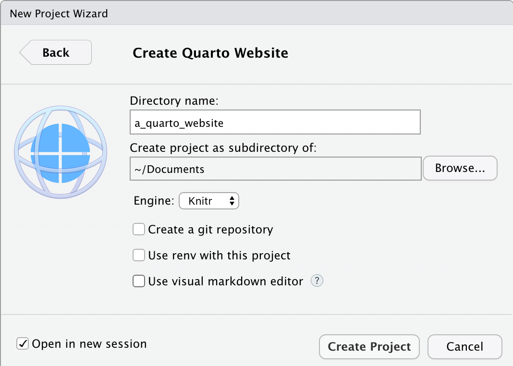{#fig-quartoone}

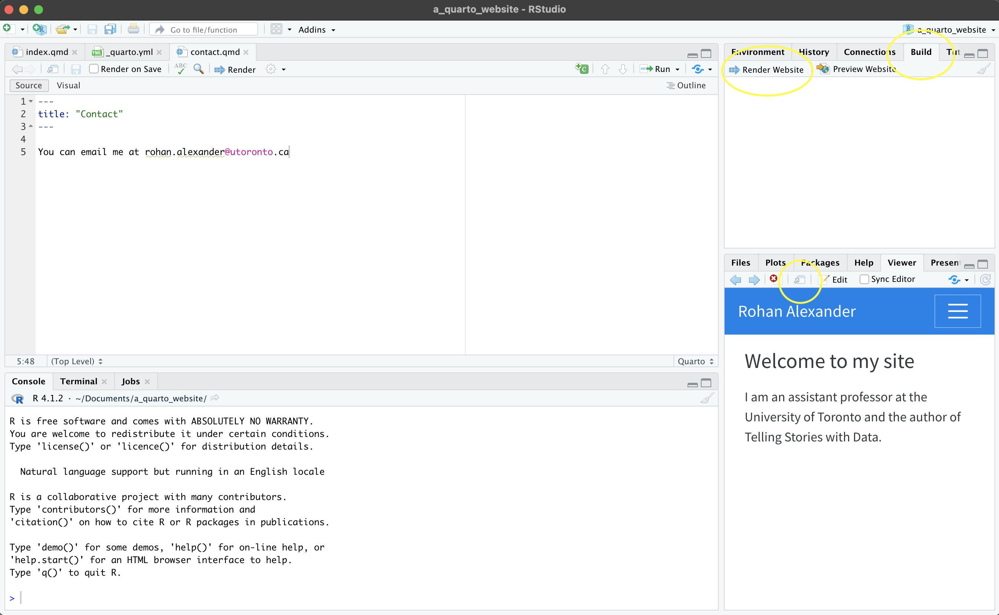{#fig-quartotwo}

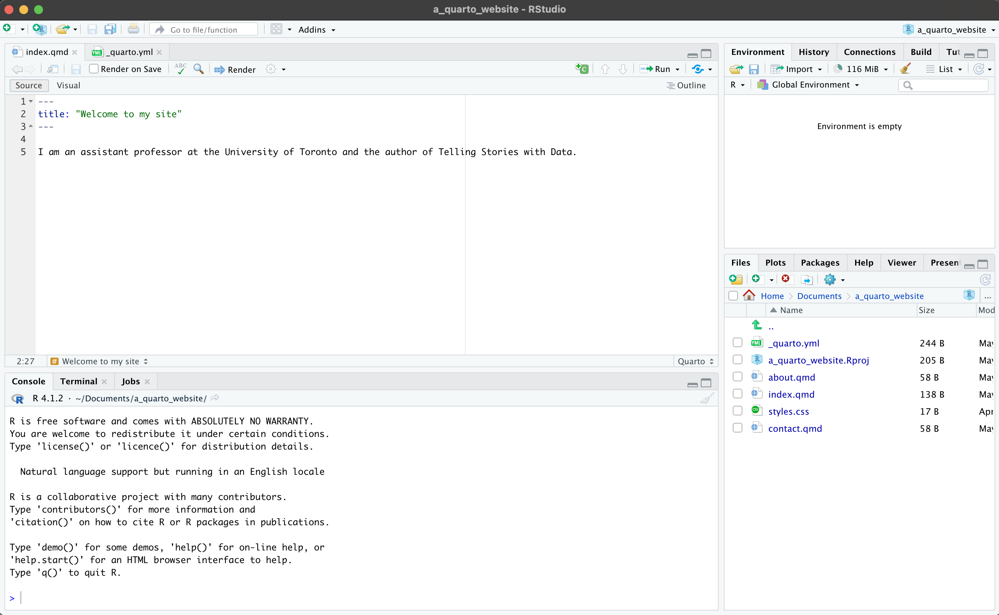{#fig-quartothree}

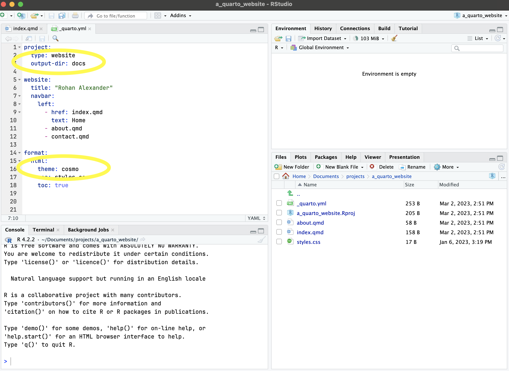{#fig-quartofour}

Quarto를 활용한 웹사이트 제작

:::

상단 메뉴의 "Build" $\rightarrow$ "Render Website"를 클릭하면 기본 웹사이트가 생성됩니다 (@fig-quartotwo). 결과물은 기본적으로 RStudio의 "Viewer" 창에 나타나지만, 웹 브라우저에서 따로 확인할 수도 있습니다. 이제 "index.qmd" 파일의 제목을 바꾸고 자신의 소개 내용을 채워 넣어 사이트를 개인화해 보십시오 (@fig-quartothree).

메인 메뉴의 구성은 `_quarto.yml` 파일에서 설정합니다. "contact.qmd" 같은 새로운 페이지를 추가하고 싶다면, 기존의 "about.qmd" 파일을 복사한 뒤 내용을 편집해 활용하면 편리합니다 (@fig-quartofour). 또한 `_quarto.yml`에서 테마(theme)를 변경할 수 있습니다. 기본값은 "cosmo"이며, [여기](https://quarto.org/docs/output-formats/html-themes.html)에서 더 다양한 테마 옵션을 확인할 수 있습니다.

개인화 작업이 끝났다면 GitHub로 푸시하여 GitHub Pages를 통해 호스팅을 시작해 봅시다. 그 전에 두 가지 설정이 필요합니다. 첫째, `_quarto.yml` 파일에서 빌드 결과물이 저장되는 폴더를 `_site` 대신 `docs`로 변경하십시오 (@fig-quartofour).

```

#| eval: false
#| echo: true

project:
  type: website
  output-dir: docs

```

둘째, GitHub Pages가 기본적으로 사용하는 Jekyll 엔진을 비활성화해야 합니다. 콘솔 창에서 다음 명령어를 실행해 숨겨진 설정 파일을 생성하십시오.

```

#| eval: false
#| echo: true

file.create(".nojekyll")

```

이제 `usethis` 패키지를 사용해 프로젝트를 GitHub에 올립니다. `use_git()`으로 저장소를 초기화하고, `use_github()`로 GitHub에 코드를 푸시합니다.

```

#| eval: false
#| echo: true

use_git()
use_github()

```

GitHub 웹사이트의 저장소 페이지에서 "Settings" $\rightarrow$ "Pages"로 이동하십시오. "Build and deployment" 섹션에서 브랜치를 "main" 또는 "master"로 설정하고, 폴더는 "/docs"로 선택한 뒤 저장하십시오. 잠시 후 GitHub가 사이트 주소를 안내해 줄 것입니다.

이후 사이트 내용을 수정할 때는 로컬 컴퓨터에서 작업한 뒤, GitHub에서 변경 사항을 먼저 받아오고(Pull), 수정한 내용을 다시 올리면(Push) 라이브 사이트가 자동으로 업데이트됩니다.

제출할 웹사이트에는 일반 텍스트 단락, 섹션 제목, 글머리 기호 등이 포함되어야 합니다. 모든 내용이 잘 문서화되어 있고 서식이 깔끔한지, 전반적인 품질이 우수한지 확인하십시오.

평가 기준에는 '수업 논문', 'LLM 활용 문서화', '본문 서술', '커밋 이력', '재현 가능한 워크플로우' 항목이 포함됩니다. 완성된 웹사이트 링크를 제출하십시오.

### 논문 {.unnumbered}

:::{.content-visible when-format="pdf"}

이 단계에서는 [온라인 부록 "Papers"](https://tellingstorieswithdata.com/23-assessment.html)에 소개된 *Donaldson* 논문을 읽어보는 것이 좋습니다.

:::

:::{.content-visible unless-format="pdf"}

이 단계에서는 [온라인 부록 -@sec-papers]에 소개된 *Donaldson* 논문을 읽어보는 것이 좋습니다.

:::
