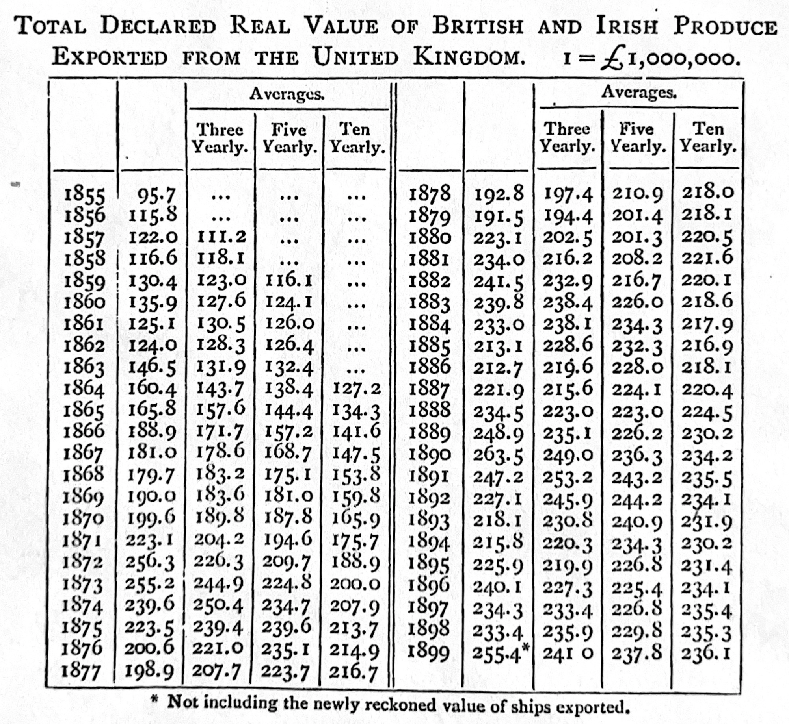

# 연구 작성 {#sec-on-writing}

::: {.callout-note}
채프먼 앤 홀/CRC(Chapman and Hall/CRC)에서 2023년 7월에 이 책을 출간했습니다. [여기](https://www.routledge.com/Telling-Stories-with-Data-With-Applications-in-R/Alexander/p/book/9781032134772)에서 구매하실 수 있습니다. 이 온라인 버전은 인쇄본 출간 이후의 일부 업데이트 내용이 반영되어 있습니다.
:::

**선행 조건**

- *고등 교육 연구 계획하기*(원제: *By Design: Planning Research on Higher Education*) 읽기, [@bydesignplanningresearch]
  - 좋은 연구 질문을 개발하기 위한 전략을 다룬 2장 "당신의 질문은 무엇인가"를 중심으로 읽어보십시오.
- *글쓰기 법칙*(원제: *On Writing Well*) 읽기, [@zinsser] (판본 상관없음)
  - 효과적인 글쓰기 스타일의 '원칙'과 '방법'을 다룬 1부와 2장에 집중하십시오.
- *소설가 코맥 맥카시의 훌륭한 과학 논문 작성법* 읽기, [@Savage2019]
  - 과학 글쓰기를 실질적으로 개선할 수 있는 구체적인 팁을 제공합니다.
- *출판, 그리고 출판*(원제: *Publication, publication*) 읽기, [@king2006publication]
  - 단순한 복제 연구에서 벗어나 출판 가능한 학술 논문으로 나아가는 전략을 상세히 설명합니다.
- *정량적 편집* 시청, [@bronnerquantediting]
  - 통계 기반 매체 'FiveThirtyEight'의 정량 편집자로서 겪은 경험을 토대로 한 글쓰기 전략을 담고 있습니다.
- *흡연과 폐암*(원제: *Smoking and carcinoma of the lung*) 읽기, [@doll1950smoking]
  - 데이터 섹션 구성의 아주 좋은 모범 사례입니다.
- *유용한 글을 쓰는 법*(원제: *How to write usefully*) 읽기, [@grahamhowtowriteusefully]
  - 독자가 아직 알지 못하는, '진실되고 중요한 것'을 쓰는 법에 관한 블로그 포스트입니다.
- 다음 잘 쓰여진 정량 논문 중 하나를 읽으십시오.
    - *Asset prices in an exchange economy*, [@lucas1978asset]
    - *Individuals, institutions, and innovation in the debates of the French Revolution*, [@barron2018individuals]
    - *Modeling: optimal marathon performance on the basis of physiological factors*, [@joyner1991modeling]
    - *On reproducible econometric research*, [@koenker2009reproducible]
    - *Prevented mortality and greenhouse gas emissions from historical and projected nuclear power*, [@kharecha2013prevented]
    - *Seeing like a market*, [@fourcade2017seeing]
    - *Simpson's paradox and the hot hand in basketball*, [@wardrop1995simpson]
    - *Some studies in machine learning using the game of checkers*, [@samuel1959some]
    - *Statistical methods for assessing agreement between two methods of clinical measurement*, [@bland1986statistical]
    - *Surgical Skill and Complication Rates after Bariatric Surgery*, [@Birkmeyer2013]
    - *The mundanity of excellence: An ethnographic report on stratification and Olympic swimmers*, [@chambliss1989mundanity]
    - *The probable error of a mean*, [@student1908probable]
- 다음 *The New Yorker* 기사 중 하나를 읽으십시오.
    - *Funny Like a Guy*, Tad Friend, 2011년 4월 4일
    - *Going the Distance*, David Remnick, 2014년 1월 19일
    - *How the First Gravitational Waves Were Found*, Nicola Twilley, 2016년 2월 11일
    - *Happy Feet*, Alexandra Jacobs, 2009년 9월 7일
    - *Levels of the Game*, John McPhee, 1969년 5월 31일
    - *Reporting from Hiroshima*, John Hersey, 1946년 8월 23일
    - *The Catastrophist*, Elizabeth Kolbert, 2009년 6월 22일
    - *The Quiet German*, George Packer, 2014년 11월 24일
    - *The Pursuit of Beauty*, Alec Wilkinson, 2015년 2월 1일
- 다음 다른 출판물의 기사 중 하나를 읽으십시오.
    - *Blades of Glory*, Holly Anderson, Grantland
    - *Born to Run*, Walt Harrington, The Washington Post
    - *Dropped*, Jason Fagone, Grantland
    - *Federer as Religious Experience*, David Foster Wallace, The New York Times Magazine
    - *Generation Why?*, Zadie Smith, The New York Review of Books
    - *One hundred years of arm bars*, David Samuels, Grantland
    - *Out in the Great Alone*, Brian Phillips, ESPN
    - *Pearls Before Breakfast*, Gene Weingarten, The Washington Post
    - *Resurrecting The Champ*, J.R. Moehringer, Los Angeles Times
    - *The Cult of "Jurassic Park"*, Bryan Curtis, Grantland
    - *The House that Hova Built*, Zadie Smith, The New York Times
    - *The Re-Education of Chris Copeland*, Flinder Boyd, SB Nation
    - *The Sea of Crisis*, Brian Phillips, Grantland
    - *The Webb Space Telescope Will Rewrite Cosmic History. If It Works.*, Natalie Wolchover, Quanta Magazine

**주요 개념 및 기술**

- 글쓰기는 데이터 분석에 필요한 모든 기술 중 가장 중요할 수 있습니다. 글쓰기를 잘할 수 있는 유일한 비결은 '매일 쓰는 것'입니다.
- 글쓰기의 이점은 결국 자기 자신에게 돌아오지만, 글은 철저히 **독자**를 위해 써야 합니다. 이는 독자가 있는 위치에서 생각하고, 전달하고자 하는 하나의 명확한 핵심 메시지를 가져야 함을 의미합니다.
- 가급적 빨리 초고를 완성하십시오. 아무리 엉망이라도 초고가 있는 것과 없는 것의 차이는 천양지차입니다. 초고가 생기는 순간부터 비로소 '다시 쓰기'가 시작됩니다. 이때 목표는 불필요한 단어를 걷어내어 명확성을 극대화하는 것입니다.
- 보통 우리는 관심 있는 분야에서 시작하여 연구 질문, 데이터셋, 분석 과정을 끊임없이 반복하며 발전시킵니다. 이 과정을 통해 우리가 무엇을 하려는지 비로소 선명하게 이해하게 됩니다.

**소프트웨어 및 패키지**

- `knitr` [@citeknitr]
- `tidyverse` [@tidyverse]
- `tinytable` [@tinytable]

```{r}
#| message: false
#| warning: false

library(knitr)
library(tidyverse)
library(tinytable)

```

## 서론

> 작가가 되고 싶다면 무엇보다 두 가지를 반드시 해야 합니다. 많이 읽고, 많이 쓰는 것입니다. 제가 아는 한 이 두 가지를 대신할 방법은 없습니다. 지름길도 없습니다.
>
> @stephenking [p. 145]

우리는 주로 데이터를 수단으로 삼아, 글로 이야기를 들려줍니다. 글쓰기는 효율적인 소통의 도구이자, 우리가 무엇을 믿고 있는지 스스로 확인하는 방법이며, 타인으로부터 아이디어에 대한 피드백을 받는 통로입니다. 잘 쓴 논문은 간결하고 체계적이며 이야기가 물 흐르듯 이어집니다. 올바른 문장 구조, 철자, 어휘, 문법은 독자가 내용에만 온전히 집중하게 해주므로 매우 중요합니다.

이 장에서는 글쓰기를 다룹니다. 이 장을 마치면, 독자의 시간을 아끼면서도 전달하고자 하는 바를 명확히 담은 정량적 연구 논문을 작성하는 법을 익히게 될 것입니다. 우리는 나 자신을 위해서가 아니라 독자를 위해 글을 씁니다. 구체적으로는 독자에게 '유용한' 글을 써야 합니다. 이는 새롭고, 진실하며, 중요한 내용을 투명하게 전달하는 것을 뜻합니다 [@grahamhowtowriteusefully]. 이와 동시에, 글쓰기의 가장 큰 수혜자는 종종 작가 자신입니다. 글을 쓰는 과정 자체가 우리의 사고를 정교하게 다듬고, 우리가 왜 그렇게 믿게 되었는지 논리적으로 구성해 나가는 과정이기 때문입니다.

이 장의 내용이 다소 열거식으로 느껴질 수도 있습니다. 처음에는 가볍게 훑어보고, 실제 논문을 쓸 때 필요한 부분을 다시 찾아보시는 것이 좋습니다.

## 글쓰기

> 글을 쓰는 방법은 세 번 또는 네 번 반복하는 것이지, 한 번에 끝내는 것이 아닙니다. 저에게 가장 어려운 부분은 먼저, 무엇이든 간에 제 앞에 내놓는 것입니다. 때로는 초조한 광란 속에서 벽에 진흙을 던지듯이 단어를 던지기도 합니다. 무엇이든 간에, 초고로 내뱉고, 쏟아내고, 지껄이십시오.
>
> @draftnumberfour [p. 159]

글을 쓰는 과정\index{글쓰기!다시 쓰기}은 곧 '다시 쓰는' 과정입니다. 가장 중요한 과제는 최대한 빨리 초고를 완성하는 것입니다. 아무리 엉망이라도 일단 전체 초고가 나오기 전까지는, 이미 쓴 내용을 지우거나 고치는 데 시간을 허비하지 않는 것이 좋습니다. 일단 끝까지 쓰십시오. (이 조언은 주로 글쓰기 경험이 부족한 분들에게 해당하며, 숙련될수록 자신만의 방식이 생길 것입니다.)

빈 페이지를 마주하는 것은 누구에게나 두려운 일입니다. 이를 극복하는 한 가지 방법은 "서론", "데이터", "모델", "결과", "논의"와 같은 소제목을 미리 달아두는 것입니다. 그리고 문서 상단에 "제목", "날짜", "저자", "초록" 등의 필드를 채워 넣으십시오. 이렇게 하면 논문의 전체적인 윤곽이 잡히는데, 이는 요리에서 재료를 미리 손질해 두는 '미장 플라스(Mise en place)'와 같은 역할을 합니다. 전문 주방에서 요리하기 전 필요한 재료를 미리 배열해 두어 지연 없이 요리에 집중하듯, 논문 쓰기에서도 전체 개요를 미리 잡아두는 것은 불필요한 고민을 줄여줍니다 [@draftnumberfour].

이러한 개요가 마련되면, 연구 질문에 대해 깊이 고민하며 내가 탐구하고자 하는 바를 구체화해야 합니다. 이론적으로는 연구 질문을 먼저 완벽히 정하고 답을 찾은 뒤 글을 써야 할 것 같지만, 실제로는 글을 쓰는 과정에서 생각이 더 선명해지는 경우가 많습니다 [@franklin2005exploratory]. 질문과 답변의 형태에 대한 막연한 아이디어가 글쓰기를 통해 구체적인 논리로 바뀌는 것입니다 [@stephenking, p. 131]. 연구 질문에 대한 생각이 정리되면 각 섹션에 핵심 내용을 불렛 포인트로 적고, 필요에 따라 하위 섹션을 추가하십시오. 그다음 이 불렛 포인트들을 단락으로 확장해 나가는 것입니다.

초고를 쓰는 동안만큼은\index{글쓰기!초고} '내가 잘할 수 있을까?' 하는 의구심이나 부족하다는 느낌을 철저히 무시해야 합니다. 그냥 써야 합니다. 아무리 엉성하더라도 일단 종이 위에 단어들이 채워져야 하기 때문입니다. 초고는 바로 그 목적을 달성하는 단계입니다. 모든 방해 요소를 제거하고 오로지 쓰는 행위에만 집중하십시오. 완벽주의는 초고의 적입니다. 아주 이른 새벽에 글을 쓰거나, 스스로 마감 기한을 정하거나, 글쓰기 모임을 만드는 등 자신을 몰아붙이는 환경을 조성해 보십시오. 적절한 인용이나 그래프 삽입은 나중으로 미루고 "[TODO: 인용 추가]", "[TODO: 연도별 그래프 추가]" 같은 표시만 해두고 속도를 내는 것이 도움이 됩니다. 어떤 식으로든 끝까지 내용을 채워 넣었다면, 그것으로 초고는 완성입니다.

당연히 이 초고는 형편없고 볼품없을 것입니다. 하지만 이 '부족한 초고'가 있어야만 비로소 '괜찮은 두 번째 초고', '훌륭한 세 번째 초고', 그리고 마침내 '탁월한 결과물'로 나아갈 수 있습니다 [@birdbybird, p. 20]. 초고는 너무 길 수도 있고, 논리가 맞지 않거나 터무니없는 주장을 포함할 수도 있습니다. 만약 자신의 초고가 부끄럽게 느껴지지 않는다면, 그것은 아직 충분히 과감하게 쓰지 않았다는 뜻일 수도 있습니다.

"삭제" 키와 "잘라내기" 및 "붙여넣기"를 광범위하게 사용하여 초고를 두 번째 초고로 바꾸십시오. 초고를 인쇄하고 빨간 펜을 사용하여 단어, 문장 및 전체 단락을 이동하거나 제거하는 것이 특히 도움이 됩니다. 초고에서 두 번째 초고로 넘어가는 과정은 이야기의 흐름과 일관성을 돕기 위해 한 번에 수행하는 것이 가장 좋습니다. 이 첫 번째 다시 쓰기의 한 가지 측면은 우리가 전달하고자 하는 이야기를 향상시키는 것입니다. 또 다른 측면은 이야기가 아닌 모든 것을 제거하는 것입니다 [@stephenking, p. 57].

초고가 되어가는 내용에 잘 맞지 않더라도 좋아 보이는 작업을 제거하는 것은 고통스러울 수 있습니다.\index{글쓰기!내용 제거} 이 고통을 덜어주는 한 가지 방법은 임시 문서, 예를 들어 "debris.qmd"를 만들어 원치 않는 단락을 즉시 삭제하는 대신 저장하는 것입니다. 또 다른 전략은 단락을 주석 처리하는 것입니다. 그렇게 하면 원본 파일을 계속 볼 수 있고 유용할 수 있는 측면을 알아차릴 수 있습니다.

각 섹션에 작성된 내용을 검토하면서 발전하는 이야기를 뒷받침하는 방식에 특별히 주의를 기울여 의미를 부여하십시오. 이 수정 과정은 글쓰기의 본질입니다 [@draftnumberfour, p. 160]. 또한 참조를 수정하고 실제 그래프와 표를 추가해야 합니다. 이 다시 쓰기 과정의 일부로 논문의 핵심 메시지가 발전하고 연구 질문에 대한 답변이 더 명확해지는 경향이 있습니다. 이 시점에서 서론과 같은 측면으로 돌아갈 수 있으며, 마지막으로 초록으로 돌아갈 수 있습니다. 오타 및 기타 문제는 작업의 신뢰성에 영향을 미칩니다. 따라서 두 번째 초고의 일부로 수정해야 합니다.\index{글쓰기!오타}

이 시점에서 초고는 의미를 갖기 시작합니다. 이제 그것을 훌륭하게 만드는 것이 목표입니다. 인쇄하여 다시 종이로 검토하십시오. 이야기에 기여하지 않는 모든 것을 제거하십시오. 이 단계쯤 되면 논문에 너무 가까워지기 시작할 수 있습니다. 이는 다른 사람에게 의견을 요청할 좋은 기회입니다. 이야기의 약점에 대해 피드백을 요청하십시오. 이를 해결한 후에는 논문을 다시 한 번 읽어보는 것이 도움이 될 수 있습니다. 이번에는 소리 내어 읽으십시오. 논문은 결코 "완료"되지 않으며, 특정 시점에서 시간이 다 떨어지거나 지겨워지는 경우가 더 많습니다.

## 질문하기

질적 접근 방식과 양적 접근 방식 모두 제자리를 찾고 있습니다. 이 책에서는 양적 접근 방식에 중점을 둡니다. 그럼에도 불구하고 질적 연구는 중요하며, 종종 가장 흥미로운 작업은 두 가지 모두를 포함합니다. 양적 분석을 수행할 때 우리는 데이터 품질, 측정 및 관련성과 같은 문제에 직면합니다. 우리는 종종 인과 관계를 파악하려고 노력하는 데 특히 관심이 있습니다. 그럼에도 불구하고 우리는 세상에 대해 무언가를 배우려고 노력합니다. 우리의 연구 질문은 이 모든 것을 고려해야 합니다.\index{양적 연구}

대략적으로, 그리고 단순화의 위험을 무릅쓰고, 연구를 수행하는 두 가지 방법이 있습니다.

1) 데이터 우선\index{양적 연구!데이터 우선}; 또는
2) 질문 우선\index{양적 연구!질문 우선}.

그러나 이는 이진법이 아니며, 종종 연구는 연구 퍼즐을 중심으로 데이터와 질문 사이를 반복적으로 진행됩니다 [@Gustafsson2017]. @bydesignplanningresearch [p. 39]는 이 접근 방식을 $\mbox{이론}\rightarrow\mbox{데이터}\rightarrow\mbox{이론}\rightarrow\mbox{데이터}$ 등의 나선형으로 설명합니다. 예를 들어, 질문 우선 접근 방식은 이론 중심 또는 데이터 중심일 수 있으며, 데이터 우선 접근 방식도 마찬가지입니다. 대안적인 틀은 귀납적, 즉 특정에서 일반으로의 접근 방식과 연역적, 즉 일반에서 특정으로의 접근 방식을 비교하는 것입니다.

두 가지 예를 고려해 봅시다.

1. @ahstonanderson 은 100,000명의 Spotify\index{Spotify!콘텐츠 탐색} 사용자로부터 80억 개의 고유한 청취 이벤트를 조사하여 사용자가 콘텐츠를 탐색하는 방법을 이해합니다. 그들은 나이와 행동 사이에 명확한 관계가 있음을 발견했습니다. 젊은 사용자는 더 다양한 소비에도 불구하고 나이든 사용자보다 알려지지 않은 콘텐츠를 덜 탐색합니다. 발견 및 탐색에 대한 연구 질문이 이 논문을 이끌고 있다는 것은 분명하지만, 이 데이터 세트에 대한 접근 없이는 불가능했을 것입니다. 궁극적인 일치가 이루어지기 전에 잠재적인 연구 질문과 잠재적인 데이터 세트가 고려되는 반복적인 과정이 있었을 것입니다.
2. @sec-fire-hose 소개된 신생아 사망률(NMR)을 탐색하고 싶다고 생각해 봅시다. 20년 후 사하라 이남 아프리카에서 NMR이 어떻게 보일지 궁금할 수 있습니다. 이것은 질문 우선 접근 방식이 될 것입니다. 그러나 이 안에는 다음과 같은 것들이 있을 수 있습니다. 다른 양과의 생물학적 관계를 기반으로 무엇을 기대하는지와 같은 이론 중심적인 측면; 또는 예측을 하기 위해 가능한 한 많은 데이터를 수집하는 것과 같은 데이터 중심적인 측면. 대안적인, 순전히 데이터 중심적인 접근 방식은 NMR에 접근한 다음 가능한 것을 알아내는 것입니다.

### 데이터 우선

데이터 우선\index{양적 연구!데이터 우선}일 때, 주요 문제는 사용 가능한 데이터로 합리적으로 답변할 수 있는 질문을 알아내는 것입니다. 이러한 질문을 결정할 때 다음을 고려하는 것이 유용합니다.

1) 이론: 인과 관계를 합리적으로 결정할 수 있는 기대가 있습니까? 예를 들어, 마크 크리스텐슨은 주식 시장을 차트화하는 질문이라면 *오디세이*로 돌아가 불 위에서 황소 내장을 읽는 것이 더 나을 수 있다고 농담하곤 했습니다. 적어도 그렇게 하면 하루가 끝날 때 먹을 것이 있을 것이기 때문입니다. 질문은 일반적으로 허위 관계를 피하는 데 도움이 되는 그럴듯한 이론적 근거를 가져야 합니다. 주어진 데이터로 이론을 개발하는 한 가지 방법은 "이것은 무엇의 사례인가?"를 고려하는 것입니다 [@ofwhatisthisaninstance, p. 7]. 그 접근 방식을 따르면, 특정 설정을 넘어 일반화하려고 노력합니다. 예를 들어, 특정 내전을 모든 내전의 사례로 생각하는 것입니다. 이것의 이점은 이론 구축에 필요한 일반적인 속성에 주의를 집중시킨다는 것입니다.
2) 중요성: 답변할 수 있는 사소한 질문은 많지만, 우리의 시간이나 독자의 시간을 낭비하지 않는 것이 중요합니다. 중요한 질문을 갖는 것은 데이터 정리 및 코드 디버깅에 4주 연속으로 시간을 보내는 것과 같은 상황에서 동기 부여에 도움이 될 수 있습니다. 산업에서는 재능 있는 직원과 자금을 유치하는 데 더 쉽게 만들 수도 있습니다. 그렇다고 해도 균형이 필요합니다. 질문은 답변될 가능성이 높아야 합니다. 세대를 정의하는 질문을 공격하는 것은 여러 부분으로 나누는 것이 가장 좋습니다.
3) 가용성: 미래에 추가 데이터가 제공될 합리적인 기대가 있습니까? 이는 관련 질문에 답변하고 하나의 논문을 연구 의제로 바꿀 수 있게 해줍니다.
4) 반복: 이것은 여러 번 실행할 수 있는 것입니까, 아니면 일회성 분석입니까? 전자라면 특정 연구 질문에 답변하기 시작하고 반복할 수 있습니다. 그러나 데이터에 한 번만 접근할 수 있다면 더 광범위한 질문에 대해 생각해야 합니다.

샤오리 멩에게 귀속되는 속담이 있습니다. 모든 통계는 결측 데이터 문제라는 것입니다.\index{통계학}\index{결측 데이터} 따라서 역설적으로, 데이터 우선 질문을 하는 또 다른 방법은 우리가 가지고 있지 않은 데이터에 대해 생각하는 것입니다. 예를 들어, 이전에 논의된 신생아 및 산모 사망률 예시로 돌아가면 한 가지 문제는 완전한 사망 원인 데이터가 없다는 것입니다. 만약 있다면, 관련 사망자 수를 셀 수 있을 것입니다. (@Castro2023 이 단순한 가설이 실제로는 복잡할 것이라고 상기시킵니다. 왜냐하면 다른 원인과 독립적이지 않은 사망 원인이 때때로 있기 때문입니다.) 결측 데이터 문제가 설정되면 데이터 중심 접근 방식을 취할 수 있습니다. 우리는 우리가 가지고 있는 데이터를 살펴보고, 가상의 데이터 세트를 근사화하는 데 사용할 수 있는 정도를 나타내는 연구 질문을 합니다.

:::{.callout-note}

## 거인의 어깨

샤오리 멩\index{멩, 샤오리}은 하버드 대학교의 휘플 V. N. 존스 통계학 교수입니다.\index{통계학} 1990년 하버드 대학교에서 통계학 박사 학위를 취득한 후 시카고 대학교에서 조교수로 임명되었고 2000년에 교수로 승진했습니다. 2001년 하버드로 옮겨 2004년부터 2012년까지 통계학과장을 역임했습니다. 그는 결측 데이터(@meng1994 및 @meng2012) 및 데이터 품질(@meng2018statistical)을 포함한 광범위한 주제에 대해 출판했습니다. 그는 2001년 COPSS 회장상\index{COPSS 회장상}을 수상했습니다.

:::

일부 연구자들이 데이터 우선인 한 가지 방법은 특정 지리적 또는 역사적 상황의 데이터에 대한 특정 전문 지식을 개발하는 것입니다. 예를 들어, 그들은 현재의 영국 또는 19세기 후반의 일본에 대해 특히 잘 알고 있을 수 있습니다. 그런 다음 다른 연구자들이 다른 상황에서 묻는 질문을 살펴보고, 그 질문에 자신의 데이터를 가져옵니다. 예를 들어, 특정 질문이 처음에 미국에 대해 질문되고, 그 다음 많은 연구자들이 영국, 캐나다, 호주 및 기타 여러 국가에 대해 동일한 질문에 답변하는 것을 흔히 볼 수 있습니다.

데이터 우선 연구에는 특히 불확실성이 크다는 점을 포함하여 여러 가지 단점이 있습니다. 또한 선택 효과에 대한 우려가 항상 있기 때문에 외부 타당성 확보에 어려움을 겪을 수 있습니다.

데이터 중심 연구의 변형은 모델 중심 연구입니다. 여기서는 연구자가 특정 통계적 접근 방식에 대한 전문가가 된 다음 해당 접근 방식을 적절한 맥락에 적용합니다.

### 질문 우선

질문 우선\index{양적 연구!질문 우선} 전략을 취할 때는 데이터 가용성을 역으로 고민해야 하는 문제가 있습니다. 의학 분야에서는 연구 질문을 다듬는 데 "FINER 프레임워크"를 활용하곤 합니다. 이는 다음과 같은 질문을 스스로에게 던질 것을 권장합니다: **실현 가능하고(Feasible), 흥미롭고(Interesting), 새롭고(Novel), 윤리적이며(Ethical), 관련성 있는(Relevant)** 질문인가? [@hulley2007designing]. @farrugia2010research 는 여기에 **PICOT** 요소를 더해 구체성을 높일 것을 제안합니다: **대상(Population), 개입(Intervention), 비교군(Comparison group), 핵심 결과(Outcome of interest), 기간(Time)**.

좋은 질문을 만드는 것이 막막하게 느껴질 수 있습니다. 그럴 때는 아주 구체적인 지점부터 시작해 보십시오. 또한 자신의 분석이 기술적(Descriptive), 예측적(Predictive), 추론적(Inferential), 혹은 인과적(Causal) 분석 중 어디에 해당하는지 결정하는 것이 도움이 됩니다. 이에 따라 질문의 성격이 달라지기 때문입니다.

- **기술적 분석:** "$x$는 어떤 모습인가?"
- **예측 분석:** "$x$에는 앞으로 어떤 일이 일어날까?"
- **추론적 분석:** "$x$의 특성을 어떻게 설명할 수 있는가?"
- **인과적 분석:** "$x$가 $y$에 실제로 어떤 영향을 미치는가?"

이 모든 분석은 각자의 가치가 있습니다. 인과 관계 혁명 [@angrist2010credibility] 이후 특정 방법론을 활용한 인과적 질문이 주류가 되었지만, 그 이면의 한계도 분명 존재합니다. 때로는 정밀한 인과 분석보다 잘 수행된 기술적 분석이 더 깊은 통찰을 주기도 합니다 [@Sen1980]. 중요한 것은 방법론 자체보다, 여러분이 그 질문의 답을 찾는 데 얼마나 진심으로 관심이 있느냐 하는 점입니다.

시간은 종종 제한될 것이며, 흥미로운 방식으로 제한될 수 있으며, 이는 연구 질문의 세부 사항을 안내할 수 있습니다. 유명인의 발표가 주식 시장에 미치는 영향에 관심이 있다면, 발표 전후의 주가를 살펴보면 됩니다. 그러나 암 치료제가 장기적인 결과에 미치는 영향에 관심이 있다면 어떨까요? 효과가 20년이 걸린다면, 우리는 한동안 기다리거나 20년 전에 치료받은 사람들을 살펴봐야 합니다. 그러면 오늘 약을 투여하는 경우와 비교하여 선택 효과와 다른 상황이 발생합니다. 종종 합리적인 유일한 방법은 통계 모델을 구축하는 것이지만, 이는 다른 문제를 야기합니다.

## 질문에 답하기

### 반사실과 편향

질문에 답할 때 반사실\index{반사실!정의}을 만드는 것이 종종 중요합니다. 반사실은 "만약"이 거짓인 "만약-그러면" 문장입니다. 루이스 캐럴의 *거울 나라의 앨리스*에 나오는 험프티 덤프티의 예를 생각해 봅시다.

> "정말 쉬운 수수께끼를 내는군요!" 험프티 덤프티가 으르렁거렸다. "물론 그렇게 생각하지 않습니다! 만약 제가 떨어졌다면---그럴 리는 없지만---만약 떨어졌다면---" 여기서 그는 입술을 오므리고 너무나 진지하고 위엄 있게 보여 앨리스는 웃음을 참을 수 없었다. "만약 제가 떨어졌다면," 그가 계속했다. "왕께서 저에게 약속하셨습니다---그의 입으로 직접---"
>
> @throughthelookingglass

험프티는 자신이 결코 떨어지지 않을 것이라고 확신하면서도, 만약 떨어졌을 때 일어날 일에 만족합니다. 질문에 대한 답을 결정하는 것은 종종 이 비교 그룹입니다. 예를 들어, @sec-causality-from-observational-data VO2 max가 사이클 선수의 경주 우승 확률에 미치는 영향을 고려합니다. 일반 인구에 걸쳐 비교하면 중요한 변수입니다. 그러나 잘 훈련된 운동선수에게만 비교하면 선택 때문에 덜 중요합니다.

연구 질문을 결정할 때 특히 주의해야 할 데이터의 두 가지 측면은 선택 편향\index{편향!선택}과 측정 편향\index{편향!측정}입니다.

선택 편향\index{편향!선택}은 결과가 표본에 누가 포함되는지에 따라 달라질 때 발생합니다. 선택 편향의 해로운 측면 중 하나는 우리가 그것의 존재를 알아야만 그것에 대해 조치를 취할 수 있다는 것입니다. 그러나 많은 기본 진단은 선택 편향을 식별하지 못합니다. @sec-hunt-data 논의하는 A/B 테스트\index{A/B 테스트}에서 A/A 테스트는 그룹을 만들고 처치를 적용하기 전에 비교하는 약간의 변형입니다 (따라서 A/A 명명법). 그룹이 처음부터 동일한지 확인하려는 이러한 노력은 선택 편향을 식별하는 데 도움이 될 수 있습니다. 더 일반적으로, 연령 그룹, 성별, 교육과 같은 표본의 속성을 모집단의 특성과 비교하는 것도 도움이 될 수 있습니다. 그러나 선택 편향과 관측 데이터의 근본적인 문제는 우리가 데이터가 있는 사람들은 데이터가 없는 사람들과 적어도 한 가지 면에서 다르다는 것을 알고 있다는 것입니다! 그러나 다른 어떤 면에서 다를 수 있는지는 알 수 없습니다.

선택 편향은 분석의 많은 측면에 스며들 수 있습니다. 처음에는 대표성이 있는 표본도 시간이 지남에 따라 편향될 수 있습니다. 예를 들어, [@sec-farm-data]에서 논의하는 설문조사 패널은 응답하지 않는 사람들이 생기기 때문에 주기적으로 업데이트해야 합니다.

주의해야 할 또 다른 편향은 측정 편향\index{편향!측정}입니다. 이는 데이터가 수집된 방식에 따라 결과가 영향을 받을 때 발생합니다. 이에 대한 일반적인 예는 응답자에게 소득을 물어보면 온라인 설문조사와 비교하여 직접 대면 설문조사에서 다른 답변을 얻을 수 있다는 것입니다.

### 추정량

우리는 데이터를 통해 질문의 답을 찾으려 하지만, 이때 사용하는 개념들을 명확히 구분하는 것이 중요합니다. 예를 들어 흡연이 기대 수명에 미치는 영향이 궁금하다고 합시다. 이때 우리가 알고자 하는 '실제 효과' 자체를 **추정량(Estimand)**이라고 합니다 [@Little2011]. 논문 작성 시, 가급적 서론에서 이 추정량\index{추정량}을 명확히 정의하는 것이 좋습니다 [@Lundberg2021]. 분석 과정에서 세부 사항이 조금만 바뀌어도 자칫 의도와 다른 것을 추정하게 될 위험이 크기 때문입니다 [@becarefulaboutyourestimand]. 최근 일부 의약품 규제 기관에서는 이를 의무적으로 요구하기도 합니다 [@kahan2024]. 추정량은 그 효과가 무엇을 의미하는지 일반 언어로도 명확히 설명될 수 있어야 합니다 [@Kahan2023]. 이 추정량을 구하기 위해 데이터를 활용하는 규칙이나 수식을 **추정기(Estimator)**\index{추정기}라고 하며, 실제로 데이터를 넣어 계산된 결과값을 **추정치(Estimate)**\index{추정치}라고 부릅니다. @steinsparadox 는 이러한 개념과 관련 문제들에 대해 유익한 논의를 제공합니다.

@de2021thinking [p. 94]은 이들의 관계를 다음과 같이 명쾌하게 요약합니다.

$$\mbox{추정치 = 추정량 + 편향 + 노이즈}$$

**편향(Bias)**\index{편향}은 추정기가 실제 추정량과 지속적으로 차이가 나는 결과를 내놓는 계통적 오차를 뜻하며, **노이즈(Noise)**\index{노이즈}는 무작위로 발생하는 비계통적 오차를 의미합니다. 예를 들어 표준정규분포에서 추출한 데이터의 평균을 알고자 한다면, 여기서 평균이 바로 우리의 추정량이 됩니다. (우리는 정답이 0이라는 것을 이미 알고 있습니다.) 이제 이 분포에서 데이터를 10번 뽑아 봅시다. 추정치를 구하는 한 가지 추정기는 '모든 값을 더해 개수로 나누는 것'일 테고, 다른 하나는 '값을 순서대로 세워 중간값을 찾는 것'일 수 있습니다. 이 상황을 코드로 시뮬레이션해 보겠습니다 (@tbl-estimators).\index{분포!정규}\index{시뮬레이션}

```{r}
#| label: tbl-estimators
#| tbl-cap: "추출 횟수 증가에 따른 무작위 추출 평균의 두 가지 추정기 결과 비교"

set.seed(853)

tibble(
  num_draws = c(
    rep(10, times = 10),
    rep(100, times = 100),
    rep(1000, times = 1000),
    rep(10000, times = 10000)
  ),
  draw = rnorm(
    n = length(num_draws),
    mean = 0,
    sd = 1)
  ) |>
  summarise(
    estimator_one = sum(draw) / unique(num_draws),
    estimator_two = sort(draw)[round(unique(num_draws) / 2, 0)],
    .by = num_draws
  ) |>
  tt() |>
  style_tt(j = 2:3, align = "r") |>
  format_tt(digits = 2, num_mark_big = ",", num_fmt = "decimal") |>
  setNames(c("추출 횟수", "추정기 1", "추정기 2"))

```

추출 횟수가 증가함에 따라 노이즈의 영향이 제거되고, 우리의 추정치는 추정기의 편향을 보여줍니다. 이 예시에서는 진실이 무엇인지 알지만, 실제 데이터를 고려할 때는 무엇을 해야 할지 알기 더 어려울 수 있습니다. 따라서 추정치를 생성하기 전에 추정량이 무엇인지 명확히 하는 것이 중요합니다.

### 방향성 비순환 그래프

분석에 사용할 변수를 선정할 때, 각 변수 간의 관계를 구체적으로 명시해 보는 것이 큰 도움이 됩니다. 관측 데이터만 보고 있으면 자칫 스스로를 속이기 쉽기 때문입니다. 데이터의 인과 구조를 깊이 있게 고민하기 위한 도구로 **방향성 비순환 그래프(Directed Acyclic Graph, DAG)**를 활용해 보십시오. DAG는 변수 간의 관계를 화살표와 선으로 나타낸 일종의 흐름도입니다.\index{방향성 비순환 그래프}

이를 구현하기 위해 Quarto에 내장된 Graphviz\index{Graphviz}를 사용해 보겠습니다. 코드는 `dot` 청크로 감싸야 하며, 옵션은 `#|` 대신 `//|`를 사용합니다. (대안으로 `DiagrammeR`이나 `ggdag` 패키지를 쓸 수도 있습니다.) 우선 가장 기본적인 인과 관계를 그려봅시다.

:::{.content-visible when-format="pdf"}

```{dot}

//| label: fig-dot-firstdag-pdf
//| fig-cap: "x가 y에 영향을 미치는 인과 관계"
//| echo: fenced
//| fig-width: 2
digraph D {
  node [shape=plaintext, fontname = "helvetica"];

  {rank=same x y};

  x -> y;
}

```

@fig-dot-firstdag-pdf 는 *x*가 *y*의 원인인 가장 단순한 구조를 보여줍니다.

#### 교란 변수

이번에는 조금 더 복잡한 상황을 가정해 봅시다. 소득과 행복의 관계를 분석하려는데, 여기에 '교육'이라는 변수가 개입된다면 어떨까요? (@fig-dot-educationasconfounder)

```{dot}

//| label: fig-dot-educationasconfounder
//| fig-cap: "교육은 소득과 행복 사이의 관계에 영향을 미치는 교란 변수입니다."
//| echo: true
//| fig-width: 2
digraph D {

  node [shape=plaintext, fontname = "helvetica"];

  a [label = "소득"];
  b [label = "행복"];
  c [label = "교육"];

  { rank=same a b};

  a->b;
  c->{a, b};
}

```

@fig-dot-educationasconfounder 우리는 소득이 행복을 유발한다고 생각합니다. 하지만 교육 역시 행복에 영향을 미치며, 동시에 소득 수준을 높이는 원인이 되기도 합니다. 이런 구조에서 교육을 고려하지 않고 소득과 행복의 관계만 분석하면, 그 관계가 실제보다 과장되거나 아예 존재하지 않는 허위 관계가 나타날 수 있습니다. 이처럼 두 변수 모두에 영향을 미치는 제3의 변수를 **교란 변수(Confounder)**라고 부릅니다.\index{방향성 비순환 그래프!교란 변수}\index{교란 변수}

@hernanrobins2020 [p. 83]은 흥미로운 사례를 듭니다. 한 사람이 하늘을 올려다볼 때 다른 사람들도 따라보는지 연구했는데, 사실은 하늘에 난 큰 소음 때문에 둘 다 동시에 하늘을 본 것일 수 있습니다. 실험 데이터라면 무작위 배정을 통해 이런 외부 요인을 차단할 수 있지만, 관측 데이터에서는 불가능합니다. 데이터가 많다고 해결되는 문제도 아닙니다. 오직 상황에 대한 신중한 고민과 DAG 같은 논리적 도구가 이 문제를 풀 실마리를 제공합니다.

교란 변수가 존재할 때 인과 효과를 정확히 파악하려면 이를 **조정(Adjust)**해야 합니다.\index{교란 변수!조정} 가장 흔한 방법은 회귀 모델에 해당 변수를 포함하는 것입니다. 다만 @gelmanandhill [p. 169]이 경고하듯, 이것이 유효하려면 '모든' 교란 변수를 포함하고 모델이 완벽하게 설계되어야 한다는 어려운 전제가 따릅니다. 결국 어떤 변수를 교란 변수로 보고 모델에 넣을지는 해당 분야에 대한 전문 지식과 이론적 배경에 달려 있습니다.

#### 매개 변수

@fig-dot-luxuryasmediator 우리는 소득이 행복을 유발한다고 다시 고려합니다. 그러나 소득이 자녀를 유발하고, 자녀도 행복을 유발한다면, 소득이 행복에 미치는 영향을 이해하기 어려운 상황이 됩니다.

```{dot}

//| label: fig-dot-luxuryasmediator
//| fig-cap: "소득과 행복 사이의 매개 변수로서의 자녀"
//| echo: true
//| fig-width: 2
digraph D {

  node [shape=plaintext, fontname = "helvetica"];

  a [label = "소득"];
  b [label = "행복"];
  c [label = "자녀"];

  { rank=same a b};

  a->{b, c};
  c->b;
}

```

@fig-dot-luxuryasmediator 자녀는 "매개 변수"라고 불리며, 소득이 행복에 미치는 영향에 관심이 있다면 이를 조정하지 않을 것입니다. 만약 조정한다면, 소득에 귀속되는 것 중 일부는 자녀 때문일 것입니다.\index{방향성 비순환 그래프!매개 변수}

#### 충돌 변수

마지막으로, @fig-dot-residenceascollider 소득이 행복을 유발한다고 생각하는 또 다른 유사한 상황이 있습니다. 그러나 이번에는 소득과 행복 모두 운동을 유발합니다. 예를 들어, 돈이 많으면 운동하기 더 쉬울 수 있지만, 더 행복하면 운동하기 더 쉬울 수도 있습니다.

```{dot}

//| label: fig-dot-residenceascollider
//| fig-cap: "소득과 행복 사이의 관계에 영향을 미치는 충돌 변수로서의 운동"
//| echo: true
//| fig-width: 2
digraph D {

  node [shape=plaintext, fontname = "helvetica"];

  a [label = "소득"];
  b [label = "행복"];
  c [label = "운동"];

  { rank=same a b};

  a->{b c};
  b->c;
}

```

이 경우 운동은 "충돌 변수"라고 불리며, 이를 조건화하면 오해의 소지가 있는 관계를 만들 수 있습니다.\index{방향성 비순환 그래프!충돌 변수} 소득은 운동에 영향을 미치지만, 사람의 행복도 이에 영향을 미칩니다. 운동은 예측 변수와 관심 결과 변수 모두가 영향을 미치기 때문에 충돌 변수입니다.

:::

:::{.content-visible unless-format="pdf"}

```{dot}

//| label: fig-dot-firstdag-quarto
//| fig-cap: "x가 y에 영향을 미치는 인과 관계를 예상합니다."
//| echo: fenced
//| fig-width: 4
digraph D {
  node [shape=plaintext, fontname = "helvetica"];

  {rank=same x y};

  x -> y;
}

```

[@fig-dot-firstdag-quarto]에서 우리는 *x*가 *y*의 원인이라고 생각합니다.

상황이 덜 명확한 또 다른 DAG를 만들 수 있습니다. 예시를 더 쉽게 따라갈 수 있도록 소득과 행복 사이의 가상의 관계에 대해 생각하고, 그 관계에 영향을 미칠 수 있는 변수를 고려해 보겠습니다. 이 첫 번째 예시에서는 소득과 행복, 그리고 교육 간의 관계를 고려합니다 ([@fig-dot-educationasconfounder-quarto]).

```{dot}

//| label: fig-dot-educationasconfounder-quarto
//| fig-cap: "교육은 소득과 행복 사이의 관계에 영향을 미치는 교란 변수입니다."
//| echo: true
//| fig-width: 4
digraph D {

  node [shape=plaintext, fontname = "helvetica"];

  a [label = "소득"];
  b [label = "행복"];
  c [label = "교육"];

  { rank=same a b};

  a->b;
  c->{a, b};
}

```

@fig-dot-educationasconfounder-quarto 우리는 소득이 행복을 유발한다고 생각합니다.\index{교란 변수} 그러나 우리는 또한 교육이 행복을 유발하고, 교육이 소득도 유발한다고 생각합니다. 이러한 관계는 "백도어 경로"이며, 회귀 분석에서 교육을 조정하지 않으면 관계의 정도를 과대평가하거나, 심지어 소득과 행복 사이에 허위 관계를 만들 수도 있습니다. 즉, 소득의 변화가 행복의 변화를 유발한다고 생각할 수 있지만, 교육이 둘 다를 변화시키는 것일 수도 있습니다. 이 경우 교육이라는 변수는 "교란 변수"라고 불립니다.

@hernanrobins2020 [p. 83]은 한 연구자가 한 사람이 하늘을 올려다보는 것이 다른 사람들도 하늘을 올려다보게 하는지 여부에 관심이 있었던 흥미로운 사례를 논의합니다. 두 사람의 반응 사이에는 명확한 관계가 있었습니다. 그러나 하늘에 소음이 있었던 경우도 있었습니다. 두 번째 사람이 첫 번째 사람이 올려다보았기 때문에 올려다보았는지, 아니면 둘 다 소음 때문에 올려다보았는지 불분명했습니다. 실험 데이터를 사용할 때 무작위화는 이러한 우려를 피할 수 있게 해주지만, 관측 데이터에서는 이에 의존할 수 없습니다. 또한 더 큰 데이터가 반드시 이 문제를 해결해 주는 것도 아닙니다. 대신, 상황에 대해 신중하게 생각해야 하며, DAG가 도움이 될 수 있습니다.

교란 변수가 있지만 여전히 인과 효과에 관심이 있다면, 이를 조정해야 합니다.\index{교란 변수!조정} 한 가지 방법은 회귀 분석에 포함하는 것입니다. 그러나 이것의 유효성은 여러 가정을 필요로 합니다. 특히, @gelmanandhill [p. 169]은 모든 교란 변수를 포함하고 올바른 모델을 가지고 있는 경우에만 우리의 추정치가 표본의 평균 인과 효과에 해당할 것이라고 경고합니다. 두 번째 요구 사항을 제쳐두고 첫 번째 요구 사항에만 집중하면, 교란 변수를 생각하고 관찰하지 않으면 조정하기 어려울 수 있습니다. 그리고 이는 도메인 전문 지식과 이론이 분석에 상당한 비중을 차지할 수 있는 영역입니다.

@fig-dot-luxuryasmediator-quarto 우리는 소득이 행복을 유발한다고 다시 고려합니다. 그러나 소득이 자녀를 유발하고, 자녀도 행복을 유발한다면, 소득이 행복에 미치는 영향을 이해하기 어려운 상황이 됩니다.

```{dot}

//| label: fig-dot-luxuryasmediator-quarto
//| fig-cap: "소득과 행복 사이의 매개 변수로서의 자녀"
//| echo: true
//| fig-width: 4
digraph D {

  node [shape=plaintext, fontname = "helvetica"];

  a [label = "소득"];
  b [label = "행복"];
  c [label = "자녀"];

  { rank=same a b};

  a->{b, c};
  c->b;
}

```

@fig-dot-luxuryasmediator-quarto 자녀는 "매개 변수"라고 불리며, 소득이 행복에 미치는 영향에 관심이 있다면 이를 조정하지 않을 것입니다. 만약 조정한다면, 소득에 귀속되는 것 중 일부는 자녀 때문일 것입니다.

마지막으로, @fig-dot-residenceascollider-quarto 소득이 행복을 유발한다고 생각하는 또 다른 유사한 상황이 있습니다. 그러나 이번에는 소득과 행복 모두 운동을 유발합니다. 예를 들어, 돈이 많으면 운동하기 더 쉬울 수 있지만, 더 행복하면 운동하기 더 쉬울 수도 있습니다.

```{dot}

//| label: fig-dot-residenceascollider-quarto
//| fig-cap: "소득과 행복 사이의 관계에 영향을 미치는 충돌 변수로서의 운동"
//| echo: true
//| fig-width: 4
digraph D {

  node [shape=plaintext, fontname = "helvetica"];

  a [label = "소득"];
  b [label = "행복"];
  c [label = "운동"];

  { rank=same a b};

  a->{b c};
  b->c;
}

```

이 경우 운동은 "충돌 변수"라고 불리며, 이를 조건화하면 오해의 소지가 있는 관계를 만들 수 있습니다. 소득은 운동에 영향을 미치지만, 사람의 행복도 이에 영향을 미칩니다. 운동은 예측 변수와 관심 결과 변수 모두가 영향을 미치기 때문에 충돌 변수입니다.

:::

우리는 이것에 대해 명확히 할 것입니다. 우리는 모델을 직접 구성하는 것과 마찬가지로 DAG를 직접 만들어야 합니다.\index{방향성 비순환 그래프!구성} 우리를 위해 그것을 만들어 줄 것은 아무것도 없습니다. 이는 상황에 대해 신중하게 생각해야 함을 의미합니다. DAG에서 무언가를 보고 그것에 대해 조치를 취하는 것은 한 가지 일이지만, 그것이 거기에 있다는 것을 알지 못하는 것은 또 다른 일입니다. @citemcelreath [p. 180]은 이를 유령 DAG라고 설명합니다. DAG는 도움이 되지만, 상황에 대해 깊이 생각하는 데 도움이 되는 도구일 뿐입니다.

모델을 구축할 때 가능한 한 많은 예측 변수를 포함하고 싶은 유혹을 느낄 수 있습니다.\index{방향성 비순환 그래프!교훈} DAG는 왜 우리가 더 신중해야 하는지 명확하게 보여줍니다. 예를 들어, 변수가 교란 변수라면 조정하고 싶을 것이고, 변수가 충돌 변수라면 조정하지 않을 것입니다. 우리는 진실을 결코 알 수 없으며, 이론, 관심사, 연구 설계, 데이터의 한계 또는 연구자로서의 우리 자신의 한계와 같은 측면에 의해 정보를 얻습니다. 한계를 아는 것은 모델을 보고하는 것만큼이나 중요합니다. 결함이 있는 데이터와 모델도 그 결함을 인정한다면 여전히 유용합니다. 상황에 대해 생각하는 작업은 결코 끝나지 않으며, 다른 사람에게 의존합니다. 이것이 우리가 모든 작업을 가능한 한 재현 가능하게 만들어야 하는 이유입니다.

## 논문의 구성 요소

> 나는 정식 교수가 되기 전까지는 아무것도 출판하지 않았다. 하지만 거의 쓰자마자 폐기했던 수많은 서툰 시도들을 거치면서, 한때 동경했던 화려하고 장황한 문체 대신 평범하고 소박한 글쓰기를 선호하게 되었다.
>
> 샬럿 브론테, *교수(The Professor)* [@theprofessor]\index{브론테, 샬럿!교수}

제목, 초록, 서론, 데이터, 결과, 논의, 그리고 그림, 표, 수식과 같은 논문의 핵심 요소들을 살펴보겠습니다.^[별도의 문헌 검토(Literature Review) 섹션이 필요할 수도 있지만, 관련 연구들을 논문 전체에 걸쳐 적재적소에 녹여내는 방식도 좋습니다. 예를 들어 데이터 관련 연구는 데이터 섹션에서, 모델 관련 연구는 모델 섹션에서 언급하는 식입니다.] 논문을 쓸 때는 항상 간결하고 구체적이어야 합니다. 대다수 독자는 제목만 보고 지나치며, 초록까지 읽는 사람도 그리 많지 않습니다. 따라서 각 섹션의 제목과 그래프/표의 캡션만 보고도 전체 맥락을 파악할 수 있도록 '자체 완결성'을 갖추는 것이 중요합니다 [@Keshav2007].

### 제목

제목\index{글쓰기!제목}은 독자를 우리의 이야기에 참여시킬 수 있는 첫 번째 기회입니다. 이상적으로는 우리가 발견한 것을 독자에게 정확히 알려줄 수 있어야 합니다. 효과적인 제목은 중요합니다. 그렇지 않으면 독자들이 논문을 무시할 수 있기 때문입니다. 제목이 "귀엽다"고 할 필요는 없지만, 의미가 있어야 합니다. 즉, 이야기를 명확하게 해야 합니다.

충분히 좋은 제목의 한 가지 예는 "2016년 브렉시트 국민투표에 대하여"입니다. 이 제목은 독자가 논문이 무엇에 관한 것인지 알 수 있기 때문에 유용합니다. 그러나 특히 정보가 많거나 흥미를 끄는 것은 아닙니다. 약간 더 나은 제목은 "2016년 브렉시트 국민투표에서 Vote Leave 결과에 대하여"일 수 있습니다. 이 변형은 정보가 담긴 구체성을 추가합니다. 우리는 가장 좋은 제목은 "2016년 브렉시트 국민투표에서 농촌 지역에서 Vote Leave가 더 나은 성과를 보였습니다: 베이즈 계층 모델의 증거"와 같은 것이라고 주장합니다. 여기에서 독자는 논문의 접근 방식과 주요 요점을 알 수 있습니다.

특히 효과적인 제목의 몇 가지 예를 살펴보겠습니다. @hug2019national 은 "1990년에서 2017년 사이 신생아 사망률의 국가, 지역 및 전 세계 수준 및 추세, 2030년까지 시나리오 기반 예측: 체계적인 분석"을 사용합니다. 여기에서 논문이 무엇에 관한 것인지, 사용된 방법이 무엇인지 명확합니다. @Alexander2020 은 "1901년에서 2018년 사이 호주 연방 의회에서 논의된 주제에 대한 선거 및 총리 변화의 증가된 효과"를 사용합니다. 주요 발견은 논문의 내용에 대한 많은 정보와 함께 제목에서 명확합니다. @alexander2018trends 는 "1979-2015년 미국 흑인 및 백인 아편 사망률 추세"를 사용합니다. @Frei2022 는 "미국 세금 허점 폐쇄가 투자자 포트폴리오에 미치는 영향"을 사용합니다. 아마도 역대 최고의 제목 중 하나는 @bickel1975sex 의 "대학원 입학에서의 성별 편향: 버클리 데이터: 편향 측정은 일반적으로 가정하는 것보다 어렵고, 증거는 때때로 예상과 다릅니다"이며, 이는 @sec-causality-from-observational-data 에서 다시 다룹니다.\index{버클리}

제목은 종종 논문의 마지막 측면 중 하나입니다. 초고를 작성하는 동안에는 일반적으로 작업을 완료하는 데 도움이 되는 작업 제목을 사용합니다. 그런 다음 다시 작성하는 과정에서 다듬습니다. 제목은 논문의 최종 이야기를 반영해야 하며, 이는 일반적으로 시작할 때 알 수 있는 것이 아닙니다. 독자가 논문을 읽을 만큼 충분히 흥미를 느끼게 하는 것과 유용하도록 충분한 내용을 전달하는 것 사이에서 균형을 맞춰야 합니다 [@hayotacademicstyle]. 두 가지 훌륭한 예시는 토마스 바빙턴 매콜리의 *제임스 2세 즉위 이후의 영국사*와 윈스턴 처칠의 *영어를 사용하는 민족의 역사*입니다. 둘 다 내용이 무엇인지 명확하며, 대상 독자에게 흥미를 유발합니다.

한 가지 특정 접근 방식은 "흥미로운 내용: 구체적인 내용" 형식입니다. 예를 들어, "뿌리로 돌아가기: 2016년 브렉시트 국민투표에서 Vote Leave의 성과 검토"와 같습니다. @kennedy2020know 는 "인구를 알고 모델을 알라: 모델 기반 회귀 및 사후 계층화를 사용하여 관측된 표본을 넘어 결과를 일반화하기"라는 이 접근 방식의 특히 좋은 예시를 제공하며, @craiu2019hiring 도 "고용 갬빗: 투퍼 데이터 과학자를 찾아서"와 같이 좋은 예시를 제공합니다. 이와 유사한 변형은 "질문? 그리고 접근 방식"입니다. 예를 들어, @cahill2020increase "2030년까지 75%의 수요를 충족시키기 위해 FP2020 국가에서 현대 피임약 사용을 얼마나 늘려야 하는가? 가속화된 전환 방법 및 가족 계획 추정 모델을 사용한 평가"와 같습니다. 이 변형에 익숙해지면, @briggs2021does 의 "왜 원조는 가장 가난한 사람들을 대상으로 하지 않는가?"와 같이 답변 부분을 생략하면서도 효과적인 상태를 유지하는 것이 적절한 시기를 알 수 있게 됩니다. 또 다른 특정 접근 방식은 "구체적인 내용 다음 광범위한 내용" 또는 그 반대입니다. 예를 들어, "2016년 브렉시트 국민투표에서 농촌성, 엘리트 및 Vote Leave 지지" 또는 "2016년 브렉시트 국민투표에서 Vote Leave 지지, 농촌성 및 엘리트"와 같습니다. 이 접근 방식은 @tolley2021gender "성별, 지방 정당 정치 및 몬트리올의 첫 여성 시장"에서 사용합니다.

때로는 부제목을 포함할 수 있습니다. 이 경우, 이를 활용하는 좋은 방법은 발견한 주요 정량적 결과의 일부 세부 정보를 포함하는 것입니다. 해당 결과에 대한 적절한 수준의 세부 정보와 추상화를 얻는 것은 어렵고, 다시 작성하고 다른 사람의 의견을 구해야 할 것입니다.

### 초록

10~15페이지 분량의 논문의 경우, 좋은 초록\index{글쓰기!초록}은 3~5문장으로 된 단락입니다. 더 긴 논문의 경우 초록이 약간 더 길어질 수 있습니다. 초록은 논문의 이야기를 명시해야 합니다. 또한 무엇이 수행되었고 왜 중요한지 전달해야 합니다. 이를 위해 초록은 일반적으로 작업의 맥락, 목표, 접근 방식 및 발견에 대해 다룹니다.

더 구체적으로, 초록을 위한 좋은 레시피는 다음과 같습니다. 첫 번째 문장: 논문의 일반적인 영역을 명시하고 독자를 격려합니다. 두 번째 문장: 데이터 세트와 방법을 일반적인 수준에서 명시합니다. 세 번째 문장: 주요 결과를 명시합니다. 그리고 네 번째 문장: 함의에 대해 설명합니다.

우리는 다양한 초록에서 이 패턴을 볼 수 있습니다. 예를 들어, @tolley2021gender 는 첫 문장에서 400년 만에 첫 여성 시장이 선출된 것을 언급하여 독자를 끌어들입니다. 두 번째 문장은 논문에서 무엇이 수행되었는지 명확하게 설명합니다. 세 번째 문장은 설문조사와 같은 방법으로 어떻게 수행되었는지 알려주고, 네 번째 문장은 일부 세부 정보를 추가합니다. 다섯 번째이자 마지막 문장은 주요 요점을 명확하게 합니다.

> 2017년 몬트리올은 400년 역사상 첫 여성 시장인 발레리 플랑트를 선출했습니다. 이 선거를 사례 연구로 사용하여, 우리는 성별이 결과에 어떻게 영향을 미쳤는지, 그리고 영향을 미치지 않았는지 보여줍니다. 몬트리올 유권자들을 대상으로 한 설문조사는 성별이 투표 선택에 중요한 요소가 아니었음을 시사합니다. 성별이 유권자에게는 크게 중요하지 않았지만, 캠페인과 정당의 조직에는 영향을 미쳤습니다. 우리는 플랑트의 승리가 덜 지도자 중심적인 정당과 정치적 리더십 위치에 대한 여성의 부적합성에 대한 고정관념을 상쇄하는 데 도움이 된 탈성별화된 캠페인을 보여주는 전략에 부분적으로 설명될 수 있다고 주장합니다.

마찬가지로, @beauregard2021antiwomen 은 첫 두 문장에서 더 넓은 환경을 명확히 하고, 해당 환경에 대한 이 논문의 구체적인 기여를 명확히 합니다. 세 번째와 네 번째 문장은 데이터 출처와 주요 발견을 명확히 합니다. 다섯 번째와 여섯 번째 문장은 이 초록의 잠재적 독자, 즉 학술 정치 과학자들에게 흥미로울 구체성을 추가합니다. 마지막 문장에서는 저자의 입장이 명확해집니다.

> 성별 할당량 지지에 대한 이전 연구는 성 평등 및 정부 개입에 대한 태도를 설명으로 집중합니다. 우리는 정치에서 여성의 존재를 늘리는 것을 목표로 하는 정책에 대한 이해에 있어 여성에 대한 태도의 역할이 양면적이라고 주장합니다. 즉, 적대적이고 자비로운 형태의 성차별주의 모두 지지를 이해하는 데 기여하지만, 다른 방식으로 기여합니다. 호주 응답자들의 확률 기반 표본에 대해 수행된 설문조사에서 얻은 원본 데이터를 사용하여, 우리의 발견은 적대적인 성차별주의자들이 성별 할당량 채택을 통해 정치에서 여성의 존재를 늘리는 것에 더 반대할 가능성이 높다는 것을 보여줍니다. 반면에 자비로운 성차별주의자들은 낮은 수준의 자비로운 성차별주의를 보이는 응답자들보다 이러한 정책을 더 지지할 가능성이 높습니다. 우리는 이것이 자비로운 성차별주의가 여성이 순수하고 보호가 필요하다고 주장하기 때문이라고 주장합니다. 그들은 할당량의 도움 없이는 정치에서 성공하는 데 필요한 것을 가지고 있지 않습니다. 마지막으로, 우리는 여성이 할당량을 더 지지할 가능성이 높지만, 양면적인 성차별주의는 여성과 남성 모두에게 지지와 동일한 관계를 가지고 있음을 보여줍니다. 이러한 발견은 성별 할당량에 대한 대중의 총체적인 지지 수준이 일반적으로 성 평등에 대한 더 큰 수용을 반드시 나타내지는 않는다는 것을 시사합니다.

초록의 또 다른 훌륭한 예시는 @sidesvavreckwarshaw 입니다. 단 다섯 문장으로, 그들은 무엇을 하는지, 어떻게 하는지, 무엇을 발견하는지, 그리고 왜 중요한지 명확하게 설명합니다.

> 우리는 2000년부터 2018년까지 미국 선거 결과에 대한 텔레비전 광고의 영향에 대한 포괄적인 평가를 제공합니다. 우리는 대통령, 상원, 하원, 주지사, 법무장관 및 주 재무장관 선거를 포함하고, 광고의 인과 효과를 식별하는 데 도움이 되는 차이-차이 및 경계-불연속성 연구 설계를 모두 사용하여 이전 연구를 확장합니다. 우리는 텔레비전 방송 캠페인 광고가 투표 전반에 걸쳐 중요하지만, 대통령 선거보다 하위 투표 선거에서 훨씬 더 큰 영향을 미친다는 것을 발견합니다. 여러 선거 주기의 설문조사 및 유권자 등록 데이터를 사용하여, 우리는 광고 효과의 주요 메커니즘이 당파의 동원이 아니라 설득임을 보여줍니다. 우리의 결과는 캠페인 및 선거 연구뿐만 아니라 유권자 의사 결정 및 정보 처리에도 영향을 미칩니다.

최고의 초록은 내용 대 단어 비율이 너무 높아서 약간 간결하게 느껴질 수도 있습니다. 예를 들어, @touvron 의 초록에는 낭비되는 단어가 하나도 없으며, 단 네 문장으로 많은 양의 정보를 전달합니다.

> 우리는 7B에서 65B 매개변수에 이르는 기초 언어 모델 컬렉션인 LLaMA를 소개합니다. 우리는 수조 개의 토큰으로 모델을 훈련했으며, 독점적이고 접근 불가능한 데이터 세트에 의존하지 않고 공개적으로 사용 가능한 데이터 세트만 사용하여 최첨단 모델을 훈련하는 것이 가능함을 보여줍니다. 특히, LLaMA-13B는 대부분의 벤치마크에서 GPT-3 (175B)를 능가하며, LLaMA-65B는 최고의 모델인 Chinchilla-70B 및 PaLM-540B와 경쟁합니다. 우리는 모든 모델을 연구 커뮤니티에 공개합니다.

@kasymatching 은 더 통계적인 초록의 훌륭한 예시를 제공합니다. 그들은 무엇을 하는지, 왜 중요한지 명확하게 식별합니다.

> 우리는 자원을 참가자에게 매칭하는 것을 반복적으로 선택해야 하고, 개별적으로 선택된 매칭의 수익은 알 수 없지만 학습할 수 있는 실험 설정을 고려합니다. 우리의 설정은 난민 재정착, 사회 주택 할당 및 위탁 양육과 같이 (잠재적으로 복잡한) 용량 제약이 있는 양면 및 단면 매칭을 다룹니다. 우리는 이러한 적응형 조합 할당 문제를 해결하기 위해 톰슨 샘플링 알고리즘의 변형을 제안합니다. 우리는 이 알고리즘에 대한 엄격하고 사전 독립적인 유한 표본 기대 후회 경계를 제공합니다. 할당 수가 매칭 수에서 기하급수적으로 증가하지만, 우리의 경계는 그렇지 않습니다. 베이즈 계층 모델을 사용한 난민 재정착 데이터를 기반으로 한 시뮬레이션에서, 우리는 이 알고리즘이 고용 확률에 대한 완벽한 지식을 기반으로 한 최적의 매칭에서 얻을 수 있는 고용 증가의 절반을 달성한다는 것을 발견합니다.

마지막으로, @briggs2021does 는 의심할 여지 없이 사실처럼 보이는 주장으로 시작합니다. 두 번째 문장에서 그는 그것이 거짓이라고 말합니다! 세 번째 문장은 이 주장의 범위를 명시하고, 네 번째 문장은 더 자세한 내용을 제공하기 전에 그가 이 입장에 도달한 방법을 자세히 설명합니다. 마지막 두 문장은 더 넓은 함의와 중요성을 언급합니다.

> 해외 원조 프로젝트는 일반적으로 지역적 영향을 미치므로, 빈곤을 줄이려면 빈곤층에 가까이 배치되어야 합니다. 저는 지역 인구 수준을 조건으로 할 때, 세계은행(WB) 프로젝트 원조가 국가의 더 부유한 지역을 대상으로 한다는 것을 보여줍니다. 이러한 관계는 시간과 전 세계 지역에 걸쳐 유지됩니다. 저는 WB 태스크 팀 리더(TTL)에 대한 사전 등록된 결합 실험을 사용하여 친부유층 대상에 대한 다섯 가지 기부자 측 설명을 테스트합니다. TTL은 원조를 받는 정부가 원조를 정치적으로 대상으로 하고 구현을 통제하는 데 가장 관심이 있다고 인식합니다. 그들은 또한 원조가 더 가난하거나 더 외딴 지역에서 더 잘 작동하지만, 이러한 지역에서의 구현은 유일하게 어렵다고 믿습니다. 이러한 결과는 분배 정치, 원조에 대한 국제 협상, 국제 기구의 본인-대리인 문제에 대한 논쟁을 시사합니다. 또한 이러한 결과는 프로젝트 구현의 용이성을 덜 중요하게 만들기 위해 WB 인센티브 구조를 조정하면 원조가 국가의 더 가난한 지역으로 흐르도록 장려할 수 있음을 시사합니다.

과학 저널인 *Nature*는 초록 구성에 대한 가이드를 제공합니다. 그들은 6개 부분으로 구성되고 약 200단어에 달하는 초록 구조를 권장합니다.

1) 광범위한 독자가 이해할 수 있는 서론 문장.
2) 잠재적 독자에게 관련성 있는 더 자세한 배경 문장.
3) 일반적인 문제를 진술하는 문장.
4) 주요 결과를 요약하고 설명하는 문장.
5) 일반적인 맥락에 대한 문장.
6) 마지막으로, 더 넓은 관점에 대한 문장.

초록의 첫 문장에서 뻔한 소리를 해서는 안 됩니다. 독자가 제목을 보고 초록까지 읽기 시작했다면, 첫 문장은 이 논문을 끝까지 읽게 만들 수 있는 절호의 기회입니다. 두 번째, 세 번째 문장도 마찬가지입니다. 초록만 읽어도 논문의 핵심을 충분히 파악할 수 있을 때까지 다듬고 또 다듬으십시오. 대다수 독자에게 여러분의 논문은 '초록' 그 자체로 기억될 것이기 때문입니다.

### 서론

서론\index{글쓰기!서론}은 자체 포함되어야 하며 독자가 알아야 할 모든 것을 전달해야 합니다. 우리는 미스터리 소설을 쓰는 것이 아닙니다. 대신, 서론에서 가장 중요한 요점을 알려주고 싶습니다. 10~15페이지 분량의 논문의 경우, 서론은 두세 단락의 주요 내용으로 구성될 수 있습니다. @hayotacademicstyle [p. 90]은 서론의 목표는 독자를 참여시키고, 특정 분야와 배경에 위치시키고, 논문의 나머지 부분에서 무엇이 일어나는지 알려주는 것이라고 말합니다. 이는 전적으로 독자 중심이어야 합니다.

서론은 배경을 설정하고 독자에게 배경 지식을 제공해야 합니다. 예를 들어, 우리는 일반적으로 조금 더 넓게 시작합니다. 이는 논문에 대한 일부 맥락을 제공합니다. 그런 다음 논문이 그 맥락에 어떻게 들어맞는지 설명하고, 이야기의 주요 부분인 하나의 핵심 결과에 특히 초점을 맞춰 일부 높은 수준의 결과를 제공합니다. 우리는 초록에서 제공한 것보다 더 자세한 내용을 제공하지만, 전체 범위는 아닙니다. 그리고 한두 문장으로 다음 단계를 광범위하게 논의합니다. 마지막으로, 논문의 구조를 강조하는 추가적인 짧은 마지막 단락으로 서론을 마무리합니다.

예시 (가상의 세부 정보 포함):

> 영국 보수당은 항상 농촌 선거구에서 좋은 성과를 거두었습니다. 그리고 2016년 브렉시트 투표도 농촌과 도시 지역 간의 지지율에 상당한 차이가 있었던 점에서 다르지 않았습니다. 그러나 보수적인 문제에 대한 농촌 지지라는 기준에서도 "Vote Leave"에 대한 지지는 이례적으로 강했습니다. "Vote Leave"는 이스트 미들랜드와 잉글랜드 동부에서 가장 강력한 지지를 받았고, "잔류"에 대한 가장 강력한 지지는 그레이터 런던에서였습니다.
>
> 이 논문에서 우리는 2016년 브렉시트 국민투표에서 "Vote Leave"의 성과가 농촌성과 그렇게 상관 관계가 있었던 이유를 살펴봅니다. 우리는 투표 지역 수준에서 "Vote Leave"에 대한 지지가 해당 지역의 농장 수, 평균 인터넷 연결성 및 중간 연령으로 설명되는 모델을 구축합니다. 우리는 지역의 중간 연령이 증가함에 따라 해당 지역이 "Vote Leave"를 지지할 가능성이 14% 포인트 감소한다는 것을 발견합니다. 향후 연구에서는 보수당 의원의 영향을 살펴봄으로써 이러한 효과에 대한 더 미묘한 이해를 가능하게 할 수 있습니다.
>
> 이 논문의 나머지 부분은 다음과 같이 구성됩니다: 2절은 데이터를 논의하고, 3절은 모델을 논의하며, 4절은 결과를 제시하고, 마지막으로 5절은 우리의 발견과 일부 약점을 논의합니다.

서론은 자체 포함되어야 하며 독자에게 필요한 거의 모든 것을 알려주어야 합니다. 독자는 서론만 읽고도 전체 논문의 모든 주요 측면에 대한 정확한 그림을 가질 수 있어야 합니다. 서론에 그래프나 표를 포함하는 경우는 드뭅니다. 서론은 논문의 구조를 암시하며 마무리되어야 합니다.

### 데이터

린든 존슨의 전기 작가인 로버트 카로는 전기를 쓸 때 "장소 감각"을 전달하는 것의 중요성을 설명합니다 [@caroonworking, p. 141]. 그는 이를 "책의 행동이 일어나는 물리적 환경: 충분히 명확하게, 충분한 세부 사항으로 볼 수 있어서, 행동이 일어나는 동안 마치 자신이 그곳에 있는 것처럼 느끼게 하는 것"이라고 정의합니다. 그는 다음 예를 제공합니다.

> 레베카가 그 작은 집의 현관문을 나섰을 때, 아무것도 없었습니다---아마도 부리에서 길고 축축한 무언가를 매달고 바위 뒤를 빠르게 지나가는 로드러너나, 흰 꼬리의 번쩍임만 보일 정도로 빠르게 덤불 뒤로 사라지는 토끼 외에는 아무것도 없었습니다. 흩어져 있는 나무들의 잎사귀가 흔들리는 것 외에는 움직임이 없었고, 끊임없이 속삭이는 바람 소리 외에는 아무 소리도 없었습니다$\dots$ 레베카가 거의 절망적으로 집 뒤 언덕을 올랐을 때, 그 정상에서 그녀가 본 것은 더 많은 언덕, 끝없이 펼쳐진 언덕, 단 하나의 집도 보이지 않는 언덕$\dots$ 아무것도 움직이지 않는 텅 빈 언덕, 그 위에는 텅 빈 하늘; 조용히 머리 위를 맴도는 매는 사건이었습니다. 그러나 무엇보다도 인간적인 것은 아무것도 없었고, 이야기할 사람도 없었습니다.
>
> @caroonworking [p. 146]

존슨의 어머니인 레베카 베인즈 존슨의 상황을 얼마나 철저하게 상상할 수 있습니까? 논문을 작성할 때, 우리는 카로가 힐 카운티에 대해 제공하는 것과 같은 장소 감각을 우리의 데이터에 대해 달성해야 합니다.\index{데이터!장소 감각} 우리는 가능한 한 명확하게 함으로써 이를 수행합니다. 우리는 일반적으로 그것에 대한 전체 섹션을 가지고 있으며, 이는 독자에게 우리의 이야기를 뒷받침하는 실제 데이터를 가능한 한 가깝게 보여주기 위해 고안되었습니다.

데이터 섹션을 작성할 때\index{글쓰기!데이터} 우리는 우리의 주장에 대한 중요한 질문에 대한 답변을 시작합니다. 즉, 이것을 어떻게 알 수 있는가? [@draftnumberfour, p. 78]. 데이터 섹션의 훌륭한 예시는 @doll1950smoking 제공합니다. 그들은 통제 그룹과 치료 그룹 간의 흡연 효과에 관심이 있습니다. 데이터 세트를 명확하게 설명한 후 관련 교차표를 표시하기 위해 표를 사용하고 그룹을 대조하기 위해 그래프를 사용합니다.

데이터 섹션에서는 우리가 사용하는 데이터 세트의 변수를 철저히 논의해야 합니다. 사용될 수 있었지만 사용되지 않은 다른 데이터 세트가 있다면 언급하고 선택을 정당화해야 합니다. 변수가 구성되거나 결합되었다면 이 과정과 동기를 설명해야 합니다.

우리는 독자가 결과의 기반이 되는 데이터가 어떻게 생겼는지 이해하기를 원합니다. 이는 분석에 사용된 데이터를 그래프로 나타내거나 가능한 한 가깝게 나타내야 함을 의미합니다. 그리고 요약 통계 표도 포함해야 합니다. 데이터 세트가 다른 출처에서 생성되었다면 해당 원본 출처의 예시를 포함하는 것도 도움이 될 수 있습니다. 예를 들어, 데이터 세트가 설문조사 응답에서 생성되었다면 기본 설문조사 질문을 부록에 포함해야 합니다.

데이터 섹션의 그림과 표에 관해서는 어느 정도 판단이 필요합니다. 독자는 세부 사항을 이해할 기회를 가져야 하지만, 일부는 부록에 더 적절하게 배치될 수 있습니다. 그림과 표는 사람들에게 이야기를 설득하는 데 중요한 측면입니다. 그래프에서는 데이터를 보여주고 독자가 스스로 결정하도록 할 수 있습니다. 그리고 표를 사용하여 데이터 세트를 요약할 수 있습니다. 최소한 모든 변수는 그래프로 표시되고 표로 요약되어야 합니다. 너무 많다면 일부는 부록으로 강등될 수 있으며, 중요한 관계는 본문에 표시됩니다. 그림과 표는 번호가 매겨지고 텍스트에서 상호 참조되어야 합니다. 예를 들어, "그림 1은 $\dots$을 보여줍니다", "표 1은 $\dots$을 설명합니다". 모든 그래프와 표에는 주요 측면을 설명하고 추가 세부 정보를 추가하는 텍스트가 함께 제공되어야 합니다.

[@sec-static-communication]에서 제목과 레이블을 포함한 그래프와 표의 구성 요소를 논의합니다. 그러나 여기서는 텍스트와 그래프 또는 표 사이에 있는 캡션\index{글쓰기!캡션}에 대해 논의할 것입니다. 캡션은 정보가 풍부하고 자체 포함되어야 합니다. @borkin2015beyond 시선 추적을 사용하여 시각화가 어떻게 인식되고 회상되는지 이해합니다. 그들은 캡션이 그림의 핵심 메시지를 명확하게 해야 하며, 중복이 있어야 한다고 말합니다. @elementsofgraphingdata [p. 57]가 말했듯이, "그래프, 캡션 및 텍스트 간의 상호 작용은 섬세한 것입니다." 그러나 독자는 캡션만 읽고도 그래프나 표가 무엇을 보여주는지 이해할 수 있어야 합니다. 두 줄 길이의 캡션이 반드시 부적절한 것은 아닙니다. 그리고 그래프나 표의 모든 측면이 설명되어야 합니다. 예를 들어, @bowley [p. 151]의 [@fig-bowleygraphisnice]와 [@fig-bowleytableisnice]를 고려해 보십시오. 둘 다 명확하고 자체 포함되어 있습니다.

:::{#fig-oldstuffsogood layout-ncol="2"}

{#fig-bowleygraphisnice}

{#fig-bowleytableisnice}

@bowley 의 그래프 및 표 예시

:::

표와 그래프 사이의 선택은 전달할 정보의 양에 따라 달라집니다. 일반적으로 요약 통계와 같이 고려해야 할 특정 정보가 있다면 표가 좋은 선택입니다. 독자가 비교하고 추세를 이해하는 데 관심이 있다면 그래프가 좋은 선택입니다 [@gelman2002let].

### 모델

우리는 종종 데이터를 탐색하는 데 사용할 통계 모델\index{글쓰기!모델}을 구축하며, 이에 대한 특정 섹션을 갖는 것이 일반적입니다. 최소한 사용되는 모델을 설명하는 방정식을 지정하고 일반 언어와 상호 참조를 사용하여 구성 요소를 설명해야 합니다.

모델 섹션은 일반적으로 모델이 작성되고 설명되며 정당화되는 것으로 시작됩니다. 예상 독자에 따라 일부 배경 지식이 필요할 수 있습니다. 적절한 수학적 표기법으로 모델을 지정하고 상호 참조한 후, 모델의 구성 요소를 정의하고 설명해야 합니다. 표기법의 각 측면을 정의하려고 노력하십시오. 이는 독자에게 모델이 잘 선택되었음을 확신시키고 논문의 신뢰성을 높이는 데 도움이 됩니다. 모델의 변수는 데이터 섹션에서 논의된 변수와 일치해야 하며, 두 섹션 간에 명확한 연결을 만들어야 합니다.

특징이 모델에 어떻게 들어가는지, 그리고 그 이유에 대한 논의가 있어야 합니다. 몇 가지 예시는 다음과 같습니다.

- 연령 그룹 대신 연령을 사용하는 이유는 무엇입니까?
- 주/도가 수준 효과를 갖는 이유는 무엇입니까?
- 성별이 범주형 변수인 이유는 무엇입니까? 일반적으로 우리는 이것이 상황에 적합한 모델이라는 느낌을 전달하려고 합니다. 우리는 독자가 데이터 섹션에서 논의된 측면이 모델링 결정에 어떻게 나타나는지 이해하기를 원합니다.

모델 섹션은 모델을 뒷받침하는 가정에 대한 논의로 마무리되어야 합니다. 또한 대체 모델 또는 변형에 대한 간략한 논의도 있어야 합니다. 강점과 약점이 명확하고 독자가 이 특정 모델이 선택된 이유를 알기를 원합니다.

이 섹션의 어느 시점에서는 일반적으로 모델을 실행하는 데 사용된 소프트웨어를 지정하고, 모델이 적절하지 않을 수 있는 상황에 대한 생각을 증명하는 것이 적절합니다. 두 번째 요점은 일반적으로 논의 섹션에서 확장될 것입니다. 그리고 모델 검증 및 확인, 모델 수렴 및/또는 진단 문제에 대한 증거가 있어야 합니다. 다시 말하지만, 여기에는 균형이 필요하며, 이 내용 중 일부는 부록에 더 적절하게 배치될 수 있습니다.

기술 용어가 사용될 때는 익숙하지 않은 독자를 위해 일반 언어로 간략하게 설명해야 합니다. 예를 들어, @monicababynames 는 지니 계수에 대한 설명을 통합하여 독자를 이해시킵니다.

> 아기 이름의 집중도를 살펴보려면 각 국가, 성별 및 연도에 대한 지니 계수를 계산해 봅시다. 지니 계수는 빈도 분포 값 간의 분산 또는 불평등을 측정합니다. 0에서 1 사이의 값을 가질 수 있습니다. 소득 분포의 경우, 지니 계수가 1이면 한 사람이 모든 소득을 가지고 있음을 의미합니다. 이 경우, 지니 계수가 1이면 모든 아기가 같은 이름을 가지고 있음을 의미합니다. 반대로, 지니 계수가 0이면 이름이 모든 아기에게 고르게 분포됨을 의미합니다.

통계 모델을 포함하지 않는 논문도 있을 수 있습니다. 이 경우 이 "모델" 섹션은 더 넓은 "방법론" 섹션으로 대체되어야 합니다. 수행된 시뮬레이션을 설명하거나 접근 방식에 대한 더 일반적인 세부 정보를 포함할 수 있습니다.

### 결과

결과\index{글쓰기!결과} 섹션의 두 가지 훌륭한 예시는 @kharecha2013prevented 및 @kiang2021racial 제공합니다. 결과 섹션에서는 분석 결과를 명확하게 전달하고 함의에 대한 논의에 너무 집중하지 않기를 원합니다. 결과 섹션에는 요약 통계, 표 및 그래프가 필요할 것입니다. 이러한 각 측면은 상호 참조되어야 하며, 각 그림에서 보이는 내용을 자세히 설명하는 텍스트가 함께 제공되어야 합니다. 이 섹션은 결과를 전달해야 합니다. 즉, 결과가 무엇을 의미하는지보다는 결과가 무엇인지에 관심이 있습니다.

이 섹션에는 모델링을 기반으로 한 계수 추정치 그래프 표도 일반적으로 포함될 것입니다. 추정치의 다양한 특징을 논의하고, 모델 간의 차이를 설명해야 합니다. 데이터의 다른 하위 집합을 별도로 고려할 수도 있습니다. 다시 말하지만, 모든 그래프와 표에는 일반 언어로 된 텍스트가 함께 제공되어야 합니다. 대략적인 지침은 텍스트의 양이 표와 그래프가 차지하는 공간의 양과 같거나 그 이상이어야 한다는 것입니다. 예를 들어, 계수 추정치 표를 표시하는 데 전체 페이지가 사용된다면, 해당 표에 대한 전체 페이지 분량의 텍스트가 함께 제공되어야 합니다.

### 논의

**논의(Discussion)**\index{글쓰기!논의} 섹션은 논문의 대미를 장식하는 부분으로, 보통 네다섯 개의 하위 섹션으로 구성됩니다.

먼저 논문이 수행한 작업을 간략하게 요약하며 시작합니다. 그다음, 이 연구를 통해 우리가 세상에 대해 새롭게 알게 된 사실이 무엇인지 핵심 내용을 두세 개의 하위 섹션에 걸쳐 심도 있게 다룹니다. 이 부분은 여러분이 들려주고자 하는 이야기의 함의를 입증하고 상세히 설명할 가장 중요한 기회입니다. 이 섹션에는 새로운 그래프나 표를 넣지 않는 것이 원칙입니다. 대신 이전 섹션에서 제시한 결과물로부터 어떤 통찰을 얻었는지에 집중하십시오. 여러분의 결과가 다른 연구자들의 발견과 일치하는지, 혹은 다르다면 왜 그런 차이가 발생하는지 논의하는 과정도 여기서 이루어집니다.

중요한 통찰을 다룬 뒤에는 연구의 한계를 짚어보는 하위 섹션이 뒤따릅니다. 사용한 데이터의 제약, 분석 방법론이나 모델의 허점 등을 솔직하게 인정해야 합니다. 특히 기계 학습 모델을 사용한다면 @realml 이 제안하는 가이드를 참고하여 발견에 영향을 줄 수 있는 요인들을 꼼꼼히 따져보아야 합니다. 마지막으로, 이 연구에서 배울 점과 향후 연구가 나아갈 방향을 몇 단락으로 정리하며 마무리합니다.

일반적으로 논의 섹션은 전체 논문 분량의 최소 25% 이상을 차지하는 것이 좋습니다. 예를 들어 8페이지짜리 논문이라면 최소 2페이지 정도는 깊이 있는 논의에 할애해야 합니다.

### 간결성, 오타, 문법

글쓰기에서 **간결성(Conciseness)**\index{글쓰기!간결성}은 미덕입니다. 이는 단지 독자의 소중한 시간을 아끼기 위해서만은 아닙니다. 작가 스스로가 논문의 핵심이 무엇인지, 주장의 근거는 충분한지, 약점은 어디인지를 치열하게 고민하게 만들기 때문입니다. 전 캐나다 총리 장 크레티앙(Jean Chrétien)은 공무원들에게 모든 문서를 두세 페이지로 요약하고 나머지는 부록으로 돌리라고 지시했습니다 [@jeanchretien, p. 105]. 그는 "무엇을 말하려는지 스스로 명확히 모르는 사람에게만 요약이 어려운 법"이라고 꼬집었습니다.

이러한 태도는 동서고금을 막론하고 훌륭한 리더들의 공통점이었습니다.\index{영국!정치} 전 영국 내각 장관 올리버 렛윈(Oliver Letwin)은 부처에서 올라오는 장황하고 불필요한 보고서들을 보고 "분량을 4분의 1로 줄이라"고 요구했습니다 [@institueforgovernment]. 부처들은 중요한 내용을 하나도 빠뜨리지 않고 이 요청을 완벽히 수행해 냈습니다. 윈스턴 처칠 또한 제2차 세계 대전 중 "핵심을 짧게 제시하는 훈련은 더 명료한 사고를 돕는다"며 간결함을 강요했습니다. 인류 역사를 바꾼 '아인슈타인-실라르드 편지'는 고작 두 페이지에 불과했습니다!

@zinsser 는 좋은 글쓰기의 비결을 "모든 문장을 가장 순수한 요소로 걸러내는 것"이라고 정의합니다. 각 문장은 본질만 남기고 깎아내야 하며, 주장에 기여하지 않는 모든 단어는 과감히 삭제해야 합니다.

오타나 문법 오류도 주장의 신뢰성을 깎아먹는 주범입니다.\index{글쓰기!오타} 맞춤법 하나 제대로 검수하지 않는 저자가 복잡한 통계 모델은 정확하게 다루었을지, 독자는 의문을 가질 수밖에 없습니다. RStudio 내장 맞춤법 검사기나 워드(Word), 구글 문서(Google Docs)의 검사 기능을 적극 활용하십시오.

완벽한 문법 이론에 집착할 필요는 없습니다. 대신 우리가 일상적으로 대화할 때 쓰는 자연스러운 문장 구조를 지향하십시오 [@stephenking, p. 118]. 좋은 글을 많이 읽고, 자신의 글을 소리 내어 읽어보는 것만으로도 어색한 표현을 많이 잡아낼 수 있습니다. 참고로, 학술적 관례상 1에서 10까지의 숫자는 문자로(예: '세 명'), 11 이상의 숫자는 아라비아 숫자로 쓰는 것이 일반적입니다.

### 글쓰기 10계명

오웰의 정치적 글쓰기 규칙 [@politicsandtheenglishlanguage]과 이코노미스트의 재해석 [@johnsontheeconomist]을 바탕으로, 데이터 스토리텔링을 위한 글쓰기 원칙\index{글쓰기!규칙}을 정리하면 다음과 같습니다.

- 독자와 그들의 필요에 집중하십시오. 나머지는 부차적입니다.
- 탄탄한 구조를 세우고, 그 흐름에 몸을 실으십시오.
- 가급적 빨리 초고를 완성하십시오.
- 그 초고가 너덜너덜해질 때까지 다시 쓰십시오.
- 간결하고 직접적으로 표현하십시오. 군더더기는 가차 없이 덜어내십시오.
- 단어를 정확하게 선택하십시오. (예: 주가는 '개선'되는 것이 아니라 '상승'하거나 '하락'합니다.)
- 문장은 가급적 짧게 끊어 쓰십시오.
- 불필요한 전문 용어를 배제하십시오.
- 신문 1면 톱기사를 쓴다는 마음가짐으로 임하십시오.
- "내가 최초다"라는 식의 참신함을 과시하지 마십시오. 세상 아래 새로운 것은 없으며, 언제나 선구자는 존재합니다.

@Savage2019 는 글을 다 쓰고 난 뒤, "이 단어나 문장, 섹션을 통째로 들어내도 원래 메시지가 전달되는가?"를 자문해 보라고 권합니다 [@Savage2019, p. 442]. 만약 그렇다면, 그것은 과감히 삭제해야 할 부분입니다.

> [여러분이 좋아하는] 논문의 가장 완벽한 버전을 쓰기 위해 노력하십시오. 익명의 독자 모두를 만족시킬 순 없어도, 최소한 자기 자신은 만족시킬 수 있어야 합니다. 여러분이 쓴 논문은 미래의 독자들을 위한 소중한 기록이 될 것입니다.

## 연습 문제

### 실습 {.unnumbered}

1. *(계획)* 다음 시나리오를 설정해 봅시다: *한 아이와 부모가 아파트 창가에서 전차(tram)가 지나가는 것을 구경합니다. 그들은 8시간 동안 매시간 지나가는 전차의 대수를 기록합니다.* 데이터셋의 구조가 어떠할지 상상해 보고, 전체 관측치를 효과적으로 보여줄 수 있는 그래프를 스케치해 보십시오.
2. *(시뮬레이션)* 위 시나리오를 바탕으로 데이터를 시뮬레이션해 보십시오. 그리고 생성된 데이터가 논리적으로 타당한지 확인할 수 있는 5가지 테스트를 작성해 보십시오.
3. *(획득)* 여러분이 관심 있는 도시의 교통 관련 실제 데이터 소스(API, 공공데이터 포털 등)를 하나 찾아보십시오.
4. *(탐색)* 시뮬레이션한 데이터를 활용해 R로 그래프와 표를 만들어 보십시오.
5. *(공유)* 생성한 그래프와 표를 설명하는 짧은 글을 써보십시오. 실제 연구 보고서의 일부라고 가정하고, 위에서 배운 글쓰기 원칙들을 적용해 보십시오.

### 퀴즈 {.unnumbered}

1. 좋은 연구 질문의 세 가지 특징은 무엇입니까 (한두 단락으로 작성)?
2. @bydesignplanningresearch 광범위한 주제에서 연구를 자세히 계획하는 방법으로 무엇을 권장합니까 (하나 선택)?
    a. 전문가와 대화.
    b. 사용 가능한 데이터 식별.
    c.  구체적인 연구 질문 세트 명확화.
3. @bydesignplanningresearch 연구 질문이 왜 그렇게 중요하다고 믿습니까 (모두 선택)?
    a.  합리적인 계획 결정을 내리는 유일한 근거입니다.
    b.  표본을 추출할 대상 인구를 식별합니다.
    c.  적절한 집계 수준을 결정합니다.
    d.  결과 변수를 식별합니다.
    e.  주요 예측 변수를 식별합니다.
    f.  측정 및 데이터 수집에 대한 과제를 제기합니다.
4. @bydesignplanningresearch 따르면, 연구에서 "이론과 데이터의 나선"의 목적은 무엇입니까 (하나 선택)?
    a. 이론을 개발하기 전에 데이터를 수집하기 위해.
    b.  이론과 데이터 사이를 오가며 반복적으로 다듬기 위해.
    c. 이론적 분석 전에 데이터 수집이 완료되도록 보장하기 위해.
    d. 데이터 없이 이론적 틀에만 집중하기 위해.
5. 연구 접근 방식의 맥락에서 데이터 우선은 무엇을 의미합니까 (하나 선택)?
    a. 데이터 가용성을 고려하지 않고 연구 질문을 개발하는 것.
    b. 미리 정의된 질문에 답하기 위해 특별히 설계된 새로운 데이터를 수집하는 것.
    c. 경험적 증거보다 이론적 틀을 우선시하는 것.
    d.  사용 가능한 데이터로 시작하여 답변할 수 있는 질문을 결정하는 것.
6. 데이터 우선 접근 방식의 장점은 무엇입니까 (하나 선택)?
    a. 이론적 틀의 필요성을 없앱니다.
    b.  연구자가 사용 가능한 데이터를 기반으로 질문을 공식화할 수 있도록 합니다.
    c. 인과 관계를 설정할 수 있음을 보장합니다.
    d. 연구에서 어떤 형태의 편향도 방지합니다.
7. 데이터 우선 접근 방식의 단점은 무엇입니까 (하나 선택)?
    a.  "가로등 아래에서 검색"하는 것에 대한 우려.
    b. 이론에 기여할 수 있는 능력에 대한 우려.
    c. 인과 관계를 파악하기 어려울 것이라는 우려.
    d. 외부 타당성에 대한 우려.
8. 반사실은 무엇입니까 (예시 및 참조를 포함하고 최소 세 단락으로 작성)?
9. 반사실은 무엇입니까 (하나 선택)?
    a. 주 이론과 모순되는 대안 가설.
    b.  만약이 거짓인 만약-그러면 문장.
    c. 논문의 주요 주장에 반대되는 사실.
    d. 교란 변수를 조정하는 데 사용되는 통계 방법.
10. "FINER" 프레임워크는 무엇을 의미합니까 (하나 선택)?
    a. 유연하고, 혁신적이며, 중립적이고, 경험적이며, 복제 가능합니다.
    b. 공식적이고, 해석적이며, 새롭고, 실험적이며, 견고합니다.
    c. 집중적이고, 통합적이며, 자연적이고, 효율적이며, 신뢰할 수 있습니다.
    d.  실현 가능하고, 흥미롭고, 새롭고, 윤리적이며, 관련성 있습니다.
11. 추정량은 무엇입니까 (하나 선택)?
    a. 오류로 측정되는 변수.
    b. 편향된 추정기.
    c. 추정치를 계산하기 위해 데이터를 사용하는 과정.
    d.  우리가 추정하고자 하는 진정한 효과 또는 관심량.
12. 추정량은 무엇입니까 (하나 선택)?
    a. 관측된 데이터를 기반으로 주어진 양의 추정치를 계산하는 규칙.
    b.  탐구 대상.
    c. 특정 데이터 세트와 접근 방식이 주어졌을 때의 결과.
13. 추정기는 무엇입니까 (하나 선택)?
    a.  관측된 데이터를 기반으로 주어진 양의 추정치를 계산하는 규칙.
    b. 탐구 대상.
    c. 특정 데이터 세트와 접근 방식이 주어졌을 때의 결과.
14. 추정기의 역할은 무엇입니까 (하나 선택)?
    a. 우리가 추정하고자 하는 진정한 효과입니다.
    b.  데이터에서 추정치를 계산하기 위한 규칙 또는 방법입니다.
    c. 데이터 세트와 방법이 주어졌을 때 계산된 값입니다.
    d. 통계 모델의 오차 항입니다.
15. 추정치는 무엇입니까 (하나 선택)?
    a. 관측된 데이터를 기반으로 주어진 양의 추정치를 계산하는 규칙.
    b. 탐구 대상.
    c.  특정 데이터 세트와 접근 방식이 주어졌을 때의 결과.
16. 선택 편향은 무엇입니까 (하나 선택)?
    a. 참가자가 시간이 지남에 따라 연구에서 이탈할 때.
    b. 데이터가 측정되는 방식에 따라 결과가 영향을 받을 때.
    c.  표본이 모집단을 대표하지 않을 때.
    d. 실험에서 변수가 제대로 통제되지 않을 때.
17. 측정 편향은 무엇입니까 (하나 선택)?
    a. 장비 고장으로 인해 데이터가 부정확하게 기록될 때.
    b.  데이터 수집 방법이 체계적으로 실제 값을 과대평가하거나 과소평가할 때.
    c. 측정 과정이 결과에 영향을 미칠 때.
    d. 결론을 내리기에 표본 크기가 너무 작을 때.
18. 방향성 비순환 그래프(DAG)의 목적은 무엇입니까 (하나 선택)?
    a. 복잡한 모집단에서 무작위 표본을 생성하기 위해.
    b. 비선형 데이터에 대한 통계 테스트를 수행하기 위해.
    c. 통계 모델을 자동으로 생성하기 위해.
    d.  변수 간의 인과 관계를 시각적으로 나타내기 위해.
19. DAG를 구축하는 이점은 무엇입니까 (하나 선택)?
    a. 데이터에서 인과 관계를 자동으로 식별합니다.
    b. 통계 분석의 필요성을 없앱니다.
    c.  연구자가 변수 관계에 대해 신중하게 생각하도록 돕습니다.
    d. 인과 효과에 대한 정확한 추정치를 제공합니다.
20. 교란 변수는 무엇입니까 (하나 선택)?
    a. 예측 변수와 결과 변수 모두에 의해 영향을 받는 변수.
    b.  예측 변수와 결과 변수 모두에 영향을 미치는 변수.
    c. 예측 변수에 의해 영향을 받고 결과 변수에 영향을 미치는 변수.
21. 매개 변수는 무엇입니까 (하나 선택)?
    a. 예측 변수와 결과 변수 모두에 의해 영향을 받는 변수.
    b. 예측 변수와 결과 변수 모두에 영향을 미치는 변수.
    c.  예측 변수에 의해 영향을 받고 결과 변수에 영향을 미치는 변수.
22. 충돌 변수는 무엇입니까 (하나 선택)?
    a.  예측 변수와 결과 변수 모두에 의해 영향을 받는 변수.
    b. 예측 변수와 결과 변수 모두에 영향을 미치는 변수.
    c. 예측 변수에 의해 영향을 받고 결과 변수에 영향을 미치는 변수.
23. @zinsser 2장에 따르면, 좋은 글쓰기의 비결은 무엇입니까 (하나 선택)?
    a. 올바른 문장 구조와 문법.
    b. 긴 단어, 부사, 수동태 사용.
    c.  모든 문장을 가장 깔끔한 구성 요소로 벗겨내는 것.
    d. 철저한 계획.
24. @zinsser 2장에 따르면, 작가는 끊임없이 무엇을 물어야 합니까 (하나 선택)?
    a. 누구를 위해 글을 쓰고 있는가?
    b.  무엇을 말하려고 하는가?
    c. 이것을 어떻게 다시 쓸 수 있는가?
    d. 이것이 왜 중요한가?
25. 논문 작성 과정에서 중요한 과제 중 하나는 무엇입니까 (하나 선택)?
    a. 글쓰기를 시작하기 전에 가능한 한 많은 데이터를 수집하는 것.
    b. 초고에서 각 문장을 완벽하게 만드는 데 많은 시간을 할애하는 것.
    c.  가능한 한 빨리 초고를 작성하는 것.
    d. 글쓰기 전에 상세한 그래프와 표를 만드는 데 집중하는 것.
26. 초고를 빨리 작성하는 것이 왜 중요합니까 (하나 선택)?
    a. 초기 초고에서 실수가 발생하지 않도록 보장합니다.
    b.  수정하고 개선할 수 있는 완전한 버전을 제공합니다.
    c. 작가가 진행하면서 각 문장을 완벽하게 만들 수 있도록 합니다.
    d. 글쓰기에 소요되는 전체 시간을 줄입니다.
27. "사랑하는 것을 죽여라"는 무엇을 의미합니까 (하나 선택)?
    a. 논란이 되는 주제에 대해 글을 쓰는 것을 피하기 위해.
    b. 작업을 개선하기 위해 가혹한 비판을 사용하기 위해.
    c.  좋아하지만 주요 이야기에 도움이 되지 않는 불필요한 내용을 제거하기 위해.
    d. 전체 초고를 처음부터 다시 작성하기 위해.
28. 독자에게 초점을 맞출 때도 작가에게 글쓰기의 주요 이점 중 하나는 무엇입니까 (하나 선택)?
    a. 작가가 논문을 다시 작성하는 것을 피할 수 있도록 합니다.
    b.  작가가 자신이 무엇을 믿고 어떻게 그것을 믿게 되었는지 알아내는 데 도움이 됩니다.
    c. 동료로부터 필요한 피드백 양을 줄입니다.
    d. 작가의 작품이 출판되도록 보장합니다.
29. 예를 들어 3장에서 @zinsser 조언을 특징짓는 두 개의 반복되는 단어는 무엇입니까 (하나 선택)?
    a. 다시 쓰기, 다시 쓰기.
    b.  단순화, 단순화.
    c. 제거, 제거.
    d. 적게, 적게.
30. 논문에서 불필요한 단어, 오타 및 문법 오류를 제거하는 주된 이유는 무엇입니까 (하나 선택)?
    a. 단어 수 제한을 충족하기 위해.
    b. 고급 어휘로 검토자를 감동시키기 위해.
    c. 논문을 더 길게 만들기 위해.
    d.  주장의 신뢰성을 높이기 위해.
31. 다음 중 가장 좋은 제목은 무엇입니까 (하나 선택)?
    a.  "작은 표본에서 추정치의 표준 오차"
    b. "표준 오차"
    c. "문제 세트 2"
32. 제목을 작성하는 한 가지 전략은 무엇입니까 (하나 선택)?
    a. 전문 용어를 사용하여 전문가 독자를 감동시키기 위해.
    b.  일반적인 주제와 주요 발견에 대한 구체적인 정보를 모두 포함합니다.
    c. 한두 단어만 사용하여 가능한 한 짧게 만듭니다.
    d. 독자를 참여시키기 위해 질문 형식으로 제목을 제시합니다.
33. @fourcade2017seeing 대한 새 제목을 작성하십시오.
34. 다음 중 초록을 작성할 때 권장되지 않는 것은 무엇입니까 (하나 선택)?
    a.  핵심 요점을 설명하기 위해 그림이나 표를 추가하는 것.
    b. 주요 결과 및 함의를 포함하는 것.
    c. 정확하고 간결한 언어를 사용하는 것.
    d. 초록을 자체 포함되도록 만드는 것.
35. 초록을 작성하는 일반적인 구조는 무엇입니까 (하나 선택)?
    a. 함의로 시작하여 방법, 그리고 맥락으로 끝납니다.
    b.  일반적인 영역에 대한 첫 문장, 방법에 대한 두 번째 문장, 주요 결과에 대한 세 번째 문장, 함의에 대한 네 번째 문장.
    c. 한계로 시작하여 데이터 출처, 그리고 결과로 이어집니다.
    d. 논문이 답변할 일련의 질문.
36. [XKCD Simple Writer](https://xkcd.com/simplewriter/)에 따르면, 영어에서 가장 많이 사용되는 1,000개의 단어만 사용하여 @chambliss1989mundanity 초록을 원래 의미를 유지하면서 다시 작성하십시오.
37. @king2006publication 따르면, 소제목의 핵심 과제는 무엇입니까 (하나 선택)?
    a. 논문을 문헌에 통합하기 위해 약어를 사용합니다.
    b. 독자가 논문의 중요성에 감동하도록 광범위하고 포괄적으로 작성합니다.
    c.  무작위로 잠들었지만 계속 페이지를 넘기는 독자가 자신이 어디에 있는지 알 수 있도록 합니다.
38. 데이터 섹션에서 무엇을 달성하고 싶습니까 (하나 선택)?
    a. 독자를 감동시키기 위해 데이터의 복잡성을 보여주기 위해.
    b.  데이터를 철저히 설명하여 장소 감각을 만들기 위해.
    c. 가능한 한 많은 그래프와 표를 포함하기 위해.
    d. 데이터의 약점을 숨기기 위해.
39. 연구 논문에서 데이터 섹션의 주요 목표는 무엇입니까 (하나 선택)?
    a. 가능한 한 많은 표와 그래프를 제시하기 위해.
    b.  독자가 결과의 기반을 이해할 수 있도록 데이터를 철저히 설명하기 위해.
    c. 분석의 복잡성을 독자에게 설득하기 위해.
    d. 사용되지 않은 데이터 소스까지 모든 가능한 데이터 소스를 논의하기 위해.
40. @king2006publication 따르면, 표준 오차가 0.05라면 계수에 대한 다음 구체성 중 어떤 것이 어리석을까요 (모두 선택)?
    a.  2.7182818
    b.  2.718282
    c.  2.71828
    d.  2.7183
    e.  2.718
    f. 2.72
    g. 2.7
    h. 3
41. 좋은 그림 또는 표 캡션은 무엇을 달성해야 합니까 (하나 선택)?
    a. 가능한 한 간결하게, 이상적으로는 한 줄로.
    b.  자체 포함되어 주요 요점을 설명합니다.
    c. 전문 지식을 보여주기 위해 복잡한 전문 용어를 포함합니다.
    d. 독자가 텍스트를 읽도록 장려하기 위해 최소한의 정보만 제공합니다.
42. 모델 섹션에는 무엇이 있어야 합니까 (하나 선택)?
    a. 문헌에서 사용된 다른 모델 요약.
    b. 방정식 없이 최종 결과만.
    c. 수학적 표기법 없는 일반적인 설명.
    d.  모든 구성 요소의 방정식, 설명 및 정의.
43. 모델 섹션에서 대체 모델 또는 변형을 논의하는 것이 왜 중요합니까 (하나 선택)?
    a.  철저한 고려를 보여주고 선택한 모델을 정당화하기 위해.
    b. 다른 모델이 열등하다는 것을 보여주기 위해.
    c. 여러 옵션으로 독자를 혼란시키기 위해.
    d. 논문의 길이를 늘리기 위해.
44. 결과 섹션의 목적은 무엇입니까 (하나 선택)?
    a. 결과를 해석하고 그 함의를 논의하는 것.
    b. 다른 연구자들의 발견을 비판하는 것.
    c. 미래 연구 방향을 제안하는 것.
    d.  광범위한 해석 없이 분석 결과를 명확하게 제시하는 것.
45. 결과 섹션에서 그래프와 표는 어떻게 통합되어야 합니까 (하나 선택)?
    a. 함께 제공되는 텍스트 없이 독립적으로 존재해야 합니다.
    b. 혼란을 피하기 위해 최소화되어야 합니다.
    c.  상호 참조되어 텍스트에서 논의되어야 합니다.
    d. 흐름을 방해하지 않기 위해 부록에 배치되어야 합니다.
46. 논의 섹션의 목적은 무엇입니까 (하나 선택)?
    a. 결과를 더 자세히 반복하기 위해.
    b. 상세한 방법론을 제공하기 위해.
    c.  결과를 해석하고, 함의를 논의하고, 약점을 인정하기 위해.
    d. 해결책을 제시하지 않고 연구의 모든 한계를 나열하기 위해.
47. @Savage2019 해당 구두점, 단어, 문장, 단락 또는 섹션 없이 원래 메시지를 보존할 수 있는지 스스로에게 물어보라고 권장하는 이유는 무엇입니까 (하나 선택)?
    a. 오류 가능성을 줄이기 위해.
    b.  명확성을 달성하기 위해.
    c. 논문을 짧게 유지하기 위해.
    d. 48. 다시 작성 과정의 핵심 측면은 무엇입니까 (모두 선택)?
    a.  불필요한 단어를 제거하기 위해 빨간 펜으로 검토하는 것.
    b.  논문을 인쇄하고 실제 사본을 읽는 것.
    c.  흐름을 향상시키기 위해 잘라내고 붙여넣는 것.
    d.  소리 내어 읽는 것.
    e.  다른 사람과 교환하는 것.
49. 문법 오류와 오타가 논문의 신뢰성에 영향을 미치는 이유는 무엇입니까 (하나 선택)?
    a. 논문의 캐주얼한 어조를 향상시킵니다.
    b. 논문을 더 짧게 만듭니다.
    c.  세부 사항에 대한 주의 부족을 나타냅니다.
    d. 내용이 좋다면 허용됩니다.

### 수업 활동 {.unnumbered}

- 연구에 대한 선호하는 접근 방식(데이터 우선/질문 우선/기타)과 그 이유를 논의하십시오.
- 예시를 참조하여 추정량, 추정기 및 추정치가 무엇인지 설명하십시오.
- "선택 편향"을 고려하고, @monicababynames 지니 계수에 대해 설명한 것과 같은 방식으로 한 문장으로 정의를 포함하십시오.
- ChatGPT 또는 동등한 LLM을 사용하여 "선택 효과는 무엇입니까?"라는 질문에 답하는 프롬프트를 만드십시오. 파트너와 함께 컨텍스트, 참조를 추가하고 (필요한 경우) 사실로 만들어 응답을 개선하십시오. 세 가지 측면을 논의하십시오: 1) 프롬프트, 2) 원본 답변, 3) 개선된 답변.
- 잘 쓰여진 정량 논문 중 하나를 선택하십시오.
  - 원본 제목을 작성하십시오. 무엇이 좋고, 무엇이 좋지 않습니까? 대체 제목을 작성하십시오.
  - 초록을 작성하십시오. 무엇이 좋고, 무엇이 좋지 않습니까?
  - ChatGPT 또는 동등한 LLM에게 대체 초록을 만들도록 프롬프트하십시오 (논의할 수 있도록 프롬프트를 복사하십시오).
  - 이 모든 것을 바탕으로 개선된 초록을 작성한 다음 모든 것을 논의하십시오.
- @king2006publication 기반으로 이 수업이 끝날 때까지 의미 있는 논문을 작성하기 위한 계획을 세우십시오. (박사 과정 학생의 경우: 제출할 세 개의 저널/학술 대회를 순서대로 자세히 설명하고, 각 저널/학술 대회에 논문이 적합한 이유를 설명하십시오.)
- *논문 검토:* @Gerring2012 읽고 한 페이지 분량의 검토를 작성하십시오.

### 과제 {.unnumbered}

@caroonworking [p. xii]은 거의 매일 최소 1,000단어를 씁니다. 이 과제의 목적은 당신에게도 그렇게 할 기회를 주는 것입니다. 선행 조건에 명시된 논문 중 하나를 선택하고 다음 작업을 완료하십시오.

- 1일차: 모든 단어를 직접 작성하여 전체 서론을 필사하십시오.
- 2일차: 서론을 5줄 (또는 10%, 더 적은 쪽) 더 짧게 다시 작성하십시오.
- 3일차: 모든 단어를 직접 작성하여 초록을 필사하십시오.
- 4일차: 논문에 대한 새로운 네 문장짜리 초록을 다시 작성하십시오.
- 5일차: [여기](https://xkcd.com/simplewriter/)에 정의된 영어에서 가장 많이 사용되는 1,000개의 단어만 사용하여 새 초록의 두 번째 버전을 작성하십시오.
- 6일차: 논문이 작성된 방식 중 마음에 드는 세 가지 점을 자세히 설명하십시오.
- 7일차: 논문이 작성된 방식 중 마음에 들지 않는 한 가지 점을 자세히 설명하십시오.

Quarto를 사용하여 일주일 동안 단일 PDF를 만드십시오. 매일 작업 후 정보가 담긴 커밋 메시지와 함께 작업을 커밋하고 푸시하십시오.
