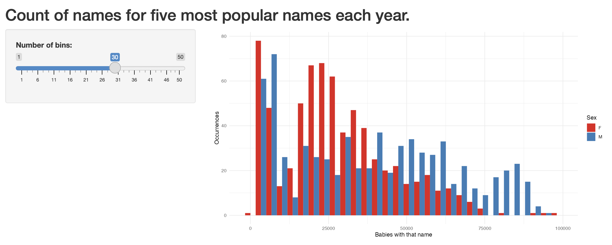

# 그래프, 표, 지도 {#sec-static-communication}

::: {.callout-note}
채프먼 앤 홀/CRC(Chapman and Hall/CRC)에서 2023년 7월에 이 책을 출간했습니다. [여기](https://www.routledge.com/Telling-Stories-with-Data-With-Applications-in-R/Alexander/p/book/9781032134772)에서 구매하실 수 있습니다. 이 온라인 버전은 인쇄본 출간 이후의 일부 업데이트 내용이 반영되어 있습니다.
:::

**선행 조건**

- *데이터 과학을 위한 R*(원제: *R for Data Science*) 읽기, [@r4ds]
  - `ggplot2`의 전반적인 기능을 다룬 1장 "데이터 시각화"를 중심으로 읽어보십시오.
- *데이터 시각화: 실무 입문*(원제: *Data Visualization: A Practical Introduction*) 읽기, [@healyviz]
  - 또 다른 관점에서 `ggplot2` 활용법을 설명하는 3장 "플롯 만들기"에 집중하십시오.
- *그래픽의 매력*(원제: *The Glamour of Graphics*) 시청, [@chase2020]
  - `ggplot2`로 만든 차트를 더 아름답고 효과적으로 다듬는 구체적인 방법들을 소개합니다.
- *통계 차트 테스트: 무엇이 좋은 그래프를 만드는가?* 읽기, [@vanderplas2020testing]
  - 그래프 제작의 모범 사례를 상세히 다룬 기사입니다.
- *데이터 페미니즘*(원제: *Data Feminism*) 읽기, [@datafeminism2020]
  - 데이터가 왜 맥락 속에서 고려되어야 하는지 보여주는 3장 "신화적이고 가상적이며 불가능한 관점에서의 객관성"을 읽어보십시오.
- *통계 데이터의 그래픽 표현에 관한 역사적 발전* 읽기, [@funkhouser1937historical]
  - 그래프의 기원과 발전 과정을 논의한 2장 "그래픽 방법의 기원"에 집중하십시오.
- *범례를 없애야 전설이 된다*(원제: *Remove the legend to become one*) 읽기, [@removethelegend]
  - 그래프를 점진적으로 개선해 나가는 과정을 보여줍니다. 선 그래프와 관련된 부분부터 흥미롭게 읽으실 수 있습니다.
- *R을 활용한 지리 정보 연산*(원제: *Geocomputation with R*) 2장 "R의 지리 데이터" 읽기, [@lovelace2019geocomputation]
  - `R`을 이용한 지도 제작의 기초를 다룹니다.
- *Mastering Shiny* 1장 "첫 번째 Shiny 앱" 읽기, [@wickham2021mastering]
  - Shiny 앱의 간단한 예제와 작동 방식을 소개합니다.

**주요 개념 및 기술**

- 시각화는 데이터를 깊이 이해하고 그 결과를 독자에게 효과적으로 전달하는 핵심적인 수단입니다. 요약된 통계치에만 의존하지 않고 데이터셋의 각 관측치를 직접 플로팅해보는 태도가 중요합니다.
- 막대 차트, 산점도, 선 그래프, 히스토그램 등 다양한 그래프 유형의 특성을 이해하고 적절히 선택할 수 있어야 합니다. 위치 정보가 포함된 데이터라면 지도를 '공간적 그래프'의 일종으로 활용할 수 있습니다.
- 표는 데이터를 체계적으로 요약하는 데 사용됩니다. 주로 데이터셋의 일부 샘플, 요약 통계량, 또는 회귀 분석 결과 등을 보여줄 때 유용합니다.

**소프트웨어 및 패키지**

- `babynames` [@citebabynames]
- Base R [@citeR]
- `carData` [@carData]
- `datasauRus` [@citedatasauRus]
- `ggmap` [@KahleWickham2013]
- `janitor` [@janitor]
- `knitr` [@citeknitr]
- `leaflet` [@ChengKarambelkarXie2017]
- `mapdeck` [@citemapdeck]
- `maps` [@citemaps]
- `mapproj` [@mapproj]
- `modelsummary` [@citemodelsummary]
- `opendatatoronto` [@citeSharla]
- `patchwork` [@citepatchwork]
- `shiny` [@citeshiny]
- `tidygeocoder` [@tidygeocoder]
- `tidyverse` [@tidyverse]
- `tinytable` [@tinytable]
- `troopdata` [@troopdata]
- `usethis` [@usethis]
- `WDI` [@WDI]

```{r}
#| message: false
#| warning: false

library(babynames)
library(carData)
library(datasauRus)
library(ggmap)
library(janitor)
library(knitr)
library(leaflet)
library(mapdeck)
library(maps)
library(mapproj)
library(modelsummary)
library(opendatatoronto)
library(patchwork)
library(tidygeocoder)
library(tidyverse)
library(tinytable)
library(troopdata)
library(shiny)
library(usethis)
library(WDI)

```

## 서론

데이터로 이야기를 들려줄 때, 우리는 데이터가 독자를 설득하는 데 결정적인 역할을 하기를 기대합니다. 이때 논문은 메시지를 담는 **그릇**이고, 데이터는 그 속에 담긴 **핵심 메시지**입니다. 독자가 우리가 왜 이런 결론에 도달했는지 납득하게 하려면, 분석의 토대가 된 데이터를 투명하게 보여주어야 합니다. 이를 위해 우리는 그래프, 표, 지도를 활용합니다.

가급적 분석의 바탕이 되는 개별 관측치를 그대로 보여주려고 노력하십시오. 예를 들어 2,500명의 설문 응답을 분석한다면, 논문의 어딘가에는 이 2,500개의 응답이 모두 찍힌 플롯이 있어야 합니다. 우리는 이를 위해 `ggplot2` 패키지를 사용합니다. `ggplot2`는 `tidyverse` 핵심 라이브러리에 포함되어 있어 별도의 설치나 로드 없이도 바로 쓸 수 있습니다. 이 장에서는 막대 차트, 산점도, 선 그래프, 히스토그램 등 다양한 시각화 기법을 배울 것입니다.

개별 관측치를 시각화하는 그래프와 달리, **표**는 주로 데이터의 일부를 발췌해 보여주거나 요약 통계량, 회귀 분석 결과 등을 일목요연하게 전달할 때 사용합니다. 표 제작에는 주로 `knitr` 패키지를 활용하며, 회귀 분석 결과표를 만들 때는 `modelsummary` 패키지가 훌륭한 도구가 될 것입니다.

마지막으로, 지리 정보를 담은 데이터에 특화된 그래프의 변형인 **지도**를 다룹니다. `tidygeocoder`를 이용해 문자로 된 주소를 좌표 정보로 변환(지오코딩)하고, `ggmap` 등을 활용해 정교한 지도를 그려내는 방법을 살펴보겠습니다.

## 그래프

> 더 건전하고 풍요로운 문명으로 나아가는 세상은 차트로 나아가는 세상이 될 것입니다.
>
> @karsetn [p. 684]

그래프\index{그래프}는 설득력 있는 데이터 스토리를 구성하는 핵심 요소입니다. 좋은 그래프는 데이터에 담긴 거대한 흐름(Pattern)과 세밀한 부분(Detail)을 동시에 파악할 수 있게 해줍니다 [@elementsofgraphingdata, p. 5]. 또한 다른 어떤 분석 방법으로도 얻기 어려운 데이터에 대한 직관과 친숙함을 제공합니다. 따라서 분석에 활용하는 모든 핵심 변수는 반드시 그래프로 그려보아야 합니다.

그래프의 궁극적인 목표는 실제 데이터와 그 맥락을 독자에게 최대한 명확하게 전달하는 것입니다. 시각화는 일종의 **정보 인코딩(Encoding)** 과정이며, 작가는 청중에게 정보를 효과적으로 전달하기 위해 의도적인 시각적 도구를 구성합니다. 청중은 이 결과물을 해석하여 정보를 **디코딩(Decoding)**하게 됩니다. 그래프의 성공 여부는 이 인코딩과 디코딩 과정에서 얼마나 많은 정보가 손실 없이 전달되느냐에 달려 있습니다 [@elementsofgraphingdata, p. 221]. 결국 우리는 특정 목표 청중이 가장 쉽고 정확하게 이해할 수 있는 그래프를 만드는 데 집중해야 합니다.

시각화가 왜 중요한지\index{그래프!중요성} 직접 확인해 봅시다. `datasauRus` 패키지를 설치하고 로드한 뒤 `datasaurus_dozen` 데이터셋을 살펴보겠습니다.

데이터셋에는 x축과 y축에 플로팅할 'x'와 'y' 값이 들어있습니다. 'dataset' 변수에는 'dino'(공룡), 'star', 'away', 'bullseye' 등 13가지 서로 다른 데이터 그룹이 포함되어 있습니다. 우선 이 중 네 가지 그룹을 골라 평균과 표준 편차 같은 요약 통계량을 계산해 보겠습니다 (@tbl-datasaurussummarystats).

```{r}
#| label: tbl-datasaurussummarystats
#| tbl-cap: "네 가지 datasauRus 데이터 세트에 대한 평균 및 표준 편차"

# Based on: https://juliasilge.com/blog/datasaurus-multiclass/
datasaurus_dozen |>
  filter(dataset %in% c("dino", "star", "away", "bullseye")) |>
  summarise(across(c(x, y), list(mean = mean, sd = sd)),
            .by = dataset) |>
  tt() |>
  style_tt(j = 2:5, align = "r") |>
  format_tt(digits = 1, num_fmt = "decimal") |>
  setNames(c("데이터 세트", "x 평균", "x 표준 편차", "y 평균", "y 표준 편차"))

```

네 가지 데이터 그룹의 요약 통계량이 거의 일치한다는 점에 유의하십시오 (@tbl-datasaurussummarystats). 만약 이 숫자들만 본다면 네 그룹이 서로 매우 비슷할 것이라고 짐작하게 될 것입니다. 하지만 실제로 데이터를 그래프로 그려보면 전혀 예상치 못한 결과가 나타납니다 (@fig-datasaurusgraph).

```{r}
#| eval: true
#| fig-cap: "네 가지 datasauRus 데이터 세트의 그래프"
#| label: fig-datasaurusgraph
#| warning: false
#| echo: true

datasaurus_dozen |>
  filter(dataset %in% c("dino", "star", "away", "bullseye")) |>
  ggplot(aes(x = x, y = y, colour = dataset)) +
  geom_point() +
  theme_minimal() +
  facet_wrap(vars(dataset), nrow = 2, ncol = 2) +
  labs(color = "데이터 세트")

```

이와 같은 통찰은 20세기의 저명한 통계학자 프랭크 앤스콤(Frank Anscombe)이 만든 '앤스콤의 콰르텟(Anscombe's Quartet)'에서도 찾을 수 있습니다. 핵심은 간단합니다. 요약 통계량에만 매몰되지 말고, 반드시 실제 데이터를 직접 눈으로 확인하라는 것입니다.\index{그래프!요약 통계에 의존하지 않기}

```{r}

head(anscombe)

```

:::{.content-visible when-format="pdf"}

앤스콤의 콰르텟은 4개의 다른 데이터 세트에 대한 11개의 관측치로 구성되며, 각 관측치에 대한 x 및 y 값이 있습니다. ["R 필수 사항" 온라인 부록](https://tellingstorieswithdata.com/20-r_essentials.html)에서 논의된 "정돈된" 형식으로 만들기 위해 `pivot_longer()`를 사용하여 이 데이터 세트를 조작해야 합니다.

:::

:::{.content-visible unless-format="pdf"}

앤스콤의 콰르텟은 4개의 다른 데이터 세트에 대한 11개의 관측치로 구성되며, 각 관측치에 대한 x 및 y 값이 있습니다. [온라인 부록 -[@sec-r-essentials]]에서 논의된 "정돈된" 형식으로 만들기 위해 `pivot_longer()`를 사용하여 이 데이터 세트를 조작해야 합니다.

:::

```{r}

# From: https://www.njtierney.com/post/2020/06/01/tidy-anscombe/
# And the pivot_longer() vignette.

tidy_anscombe <-
  anscombe |>
  pivot_longer(
    everything(),
    names_to = c(".value", "set"),
    names_pattern = "(.)(.)"
  )

```

먼저 요약 통계를 생성한 다음 (@tbl-anscombesummarystats) 데이터를 플로팅할 수 있습니다 (@fig-anscombegraph). 이는 요약 통계에만 의존하지 않고 실제 데이터를 그래프로 나타내는 것의 중요성을 다시 한번 보여줍니다.

```{r}
#| label: tbl-anscombesummarystats
#| message: false
#| tbl-cap: "앤스콤의 콰르텟에 대한 평균 및 표준 편차"

tidy_anscombe |>
  summarise(
    across(c(x, y), list(mean = mean, sd = sd)),
    .by = set
    ) |>
  tt() |>
  style_tt(j = 2:5, align = "r") |>
  format_tt(digits = 1, num_fmt = "decimal") |>
  setNames(c("데이터 세트", "x 평균", "x 표준 편차", "y 평균", "y 표준 편차"))

```

```{r}
#| eval: true
#| fig-cap: "앤스콤의 콰르텟 재현"
#| label: fig-anscombegraph
#| warning: false
#| echo: true

tidy_anscombe |>
  ggplot(aes(x = x, y = y, colour = set)) +
  geom_point() +
  geom_smooth(method = lm, se = FALSE) +
  theme_minimal() +
  facet_wrap(vars(set), nrow = 2, ncol = 2) +
  labs(colour = "데이터 세트") +
  theme(legend.position = "bottom")

```

### 막대 차트

막대 차트(Bar Chart)\index{그래프!막대 차트}는 주로 범주형 변수의 분포를 보여주고 싶을 때 사용합니다. 앞서 @sec-fire-hose 에서 병원 침대 점유 수를 시각화할 때 이 방식을 사용한 바 있습니다. 가장 보편적인 함수인 `geom_bar()`를 기본으로 하되, 분석 상황에 따라 다양한 변형을 활용할 수 있습니다. 막대 차트의 활용법을 익히기 위해 `carData` 패키지에 포함된 1997-2001년 영국 선거 패널 연구(British Election Panel Study, BEPS) 데이터를 활용해 보겠습니다.\index{성별!영국 선거 패널 연구}\index{영국 선거 패널 연구}

```{r}

beps <-
  BEPS |>
  as_tibble() |>
  clean_names() |>
  select(age, vote, gender, political_knowledge)

```

데이터 세트는 응답자가 지지하는 정당과 다양한 인구 통계학적, 경제적, 정치적 변수로 구성됩니다. 특히, 응답자의 연령 정보가 있습니다. 먼저 연령에서 연령 그룹을 만들고 `geom_bar()`를 사용하여 각 연령 그룹의 빈도를 보여주는 막대 차트를 만듭니다 (@fig-bepfitst-1).

```{r}

beps <-
  beps |>
  mutate(
    age_group =
      case_when(
        age < 35 ~ "<35",
        age < 50 ~ "35-49",
        age < 65 ~ "50-64",
        age < 80 ~ "65-79",
        age < 100 ~ "80-99"
      ),
    age_group =
      factor(age_group, levels = c("<35", "35-49", "50-64", "65-79", "80-99"))
  )

```

```{r}
#| label: fig-bepfitst
#| eval: true
#| fig-cap: "1997-2001년 영국 선거 패널 연구의 연령 그룹 분포"
#| echo: true
#| fig-subcap: ["`geom_bar()` 사용", "`count()` 및 `geom_col()` 사용"]
#| layout-ncol: 2

beps |>
  ggplot(mapping = aes(x = age_group)) +
  geom_bar() +
  theme_minimal() +
  labs(x = "연령 그룹", y = "관측치 수")

beps |>
  count(age_group) |>
  ggplot(mapping = aes(x = age_group, y = n)) +
  geom_col() +
  theme_minimal() +
  labs(x = "연령 그룹", y = "관측치 수")

```

`ggplot2`에서 사용하는 기본 축 레이블은 관련 변수의 이름이므로, 더 자세한 내용을 추가하는 것이 종종 유용합니다. 우리는 `labs()`를 사용하여 변수와 이름을 지정하여 이를 수행합니다. @fig-bepfitst-1 경우 x축과 y축에 대한 레이블을 지정했습니다.

기본적으로 `geom_bar()`는 각 연령 그룹이 데이터 세트에 나타나는 횟수를 계산합니다. `geom_bar()`의 기본 통계 변환("stat")이 "count"이기 때문에 이렇게 합니다. 이는 우리가 직접 통계를 만들 필요가 없도록 해줍니다. 그러나 이미 카운트를 구성했다면 (예: `beps |> count(age_group)`), y축에 대한 변수를 지정하고 `geom_col()`을 사용할 수 있습니다 (@fig-bepfitst-2).

다른 통찰력을 얻기 위해 데이터를 다양한 그룹으로 나누어 고려할 수도 있습니다. 예를 들어, 색상을 사용하여 연령 그룹별로 응답자가 지지하는 정당을 살펴볼 수 있습니다 (@fig-bepsecond-1).

```{r}
#| echo: true
#| eval: true
#| fig-cap: "1997-2001년 영국 선거 패널 연구의 연령 그룹 및 투표 선호도 분포"
#| label: fig-bepsecond
#| fig-subcap: ["`geom_bar()` 사용", "`geom_bar()`와 dodge2 사용"]
#| layout-ncol: 2

beps |>
  ggplot(mapping = aes(x = age_group, fill = vote)) +
  geom_bar() +
  labs(x = "연령 그룹", y = "관측치 수", fill = "투표") +
  theme(legend.position = "bottom")

beps |>
  ggplot(mapping = aes(x = age_group, fill = vote)) +
  geom_bar(position = "dodge2") +
  labs(x = "연령 그룹", y = "관측치 수", fill = "투표") +
  theme(legend.position = "bottom")

```

기본적으로 이러한 다른 그룹은 쌓여 있지만, `position = "dodge2"`를 사용하여 나란히 배치할 수 있습니다 (@fig-bepsecond-2). ("dodge" 대신 "dodge2"를 사용하면 막대 사이에 약간의 공간이 추가됩니다.)

#### 테마

어느 정도 그래프의 뼈대가 갖춰졌다면, 이제 전체적인 스타일을 결정할 차례입니다. `ggplot2`에는 다양한 **테마(Theme)**가 기본으로 내장되어 있습니다. 대표적으로 `theme_bw()`, `theme_classic()`, `theme_dark()`, `theme_minimal()` 등이 있으며, 전체 목록은 `ggplot2` [치트 시트](https://github.com/rstudio/cheatsheets/blob/main/data-visualization.pdf)에서 확인할 수 있습니다. 이러한 테마는 그래프에 레이어처럼 간단히 추가할 수 있습니다 (@fig-bepthemes). 더 나아가 `ggthemes` [@ggthemes]나 `hrbrthemes` [@hrbrthemes]와 같은 외부 패키지를 활용하면 더욱 감각적인 스타일을 적용할 수 있으며, 필요하다면 자신만의 고유한 테마를 설계할 수도 있습니다.

```{r}
#| echo: true
#| eval: true
#| fig-cap: "1997-2001년 영국 선거 패널 연구의 연령 그룹 및 투표 선호도 분포, 다양한 테마 및 `patchwork` 사용법 설명"
#| label: fig-bepthemes
#| warning: false

theme_bw <-
  beps |>
  ggplot(mapping = aes(x = age_group)) +
  geom_bar(position = "dodge") +
  theme_bw()

theme_classic <-
  beps |>
  ggplot(mapping = aes(x = age_group)) +
  geom_bar(position = "dodge") +
  theme_classic()

theme_dark <-
  beps |>
  ggplot(mapping = aes(x = age_group)) +
  geom_bar(position = "dodge") +
  theme_dark()

theme_minimal <-
  beps |>
  ggplot(mapping = aes(x = age_group)) +
  geom_bar(position = "dodge") +
  theme_minimal()

(theme_bw + theme_classic) / (theme_dark + theme_minimal)

```

@fig-bepthemes 우리는 `patchwork`를 사용하여 여러 그래프를 함께 가져옵니다. 이를 위해 패키지를 설치하고 로드한 후 그래프를 변수에 할당합니다. 그런 다음 "+"를 사용하여 서로 옆에 있어야 할 것을 나타내고, "/"를 사용하여 위에 있어야 할 것을 나타내며, 괄호를 사용하여 우선 순위를 나타냅니다.

#### 패싯

**패싯(Facet)**\index{그래프!패싯}은 하나 이상의 변수를 기준으로 데이터를 쪼개어 여러 개의 소형 그래프로 나열하는 기법입니다 [@grammarofgraphics, p. 219]. 이미 색상 등으로 특정 변수를 구분하고 있음에도 또 다른 변수에 따른 변화를 동시에 보여주고 싶을 때 매우 유용합니다. 예를 들어, 응답자의 연령과 성별에 따른 투표 성향을 한눈에 비교하고 싶다면 패싯을 활용할 수 있습니다 (@fig-facets). 이때 x축 레이블이 겹치는 것을 방지하기 위해 `guides(x = guide_axis(angle = 90))`와 같은 옵션으로 텍스트를 회전시키거나, `theme(legend.position = "bottom")`으로 범례 위치를 조정하여 가독성을 높일 수 있습니다.

```{r}
#| echo: true
#| eval: true
#| fig-cap: "1997-2001년 영국 선거 패널 연구의 성별 연령 그룹 및 투표 선호도 분포"
#| label: fig-facets
#| warning: false

beps |>
  ggplot(mapping = aes(x = age_group, fill = gender)) +
  geom_bar() +
  theme_minimal() +
  labs(
    x = "응답자 연령 그룹",
    y = "응답자 수",
    fill = "성별"
  ) +
  facet_wrap(vars(vote)) +
  guides(x = guide_axis(angle = 90)) +
  theme(legend.position = "bottom")

```

`facet_wrap()`을 `dir = "v"`로 변경하여 수평 대신 수직으로 래핑할 수 있습니다. 또는 `nrow = 2`와 같이 몇 줄을 지정하거나 `ncol = 2`와 같이 열 수를 지정할 수 있습니다.

기본적으로 두 패싯 모두 동일한 x축과 y축을 가집니다. `scales = "free"`를 사용하여 두 패싯 모두 다른 스케일을 갖도록 하거나, `scales = "free_x"`를 사용하여 x축만, 또는 `scales = "free_y"`를 사용하여 y축만 갖도록 할 수 있습니다 (@fig-facetsfancy).

```{r}
#| echo: true
#| eval: true
#| fig-cap: "1997-2001년 영국 선거 패널 연구의 성별 연령 그룹 및 투표 선호도 분포"
#| label: fig-facetsfancy
#| warning: false

beps |>
  ggplot(mapping = aes(x = age_group, fill = gender)) +
  geom_bar() +
  theme_minimal() +
  labs(
    x = "응답자 연령 그룹",
    y = "응답자 수",
    fill = "성별"
  ) +
  facet_wrap(vars(vote), scales = "free") +
  guides(x = guide_axis(angle = 90)) +
  theme(legend.position = "bottom")

```

마지막으로, `labeller()`를 사용하여 패싯의 레이블을 변경할 수 있습니다 (@fig-facetsfancylabels).

```{r}
#| echo: true
#| eval: true
#| fig-cap: "1997-2001년 영국 선거 패널 연구의 정치 지식별 연령 그룹 및 투표 선호도 분포"
#| label: fig-facetsfancylabels
#| warning: false

new_labels <-
  c("0" = "지식 없음", "1" = "낮은 지식",
    "2" = "보통 지식", "3" = "높은 지식")

beps |>
  ggplot(mapping = aes(x = age_group, fill = vote)) +
  geom_bar() +
  theme_minimal() +
  labs(
    x = "응답자 연령 그룹",
    y = "응답자 수",
    fill = "투표"
  ) +
  facet_wrap(
    vars(political_knowledge),
    scales = "free",
    labeller = labeller(political_knowledge = new_labels)
  ) +
  guides(x = guide_axis(angle = 90)) +
  theme(legend.position = "bottom")

```

이제 여러 그래프를 결합하는 세 가지 방법이 있습니다. 하위 그림, 패싯, 그리고 `patchwork`입니다. 이들은 다른 상황에서 유용합니다.

- 하위 그림 - @sec-reproducible-workflows 다루었습니다 - 다른 변수를 고려할 때;
- 패싯 - 범주형 변수를 고려할 때; 그리고
- `patchwork` - 완전히 다른 그래프를 함께 가져오는 데 관심이 있을 때.

#### 색상

이제 그래프의 시각적 완성도를 결정짓는 필수 요소인 **색상**\index{그래프!색상}에 대해 알아보겠습니다. `ggplot2`에서 색상을 변경하는 방법은 매우 다양합니다. `RColorBrewer` [@RColorBrewer] 패키지에서 제공하는 검증된 팔레트들은 `scale_fill_brewer()` 함수를 통해 간편하게 적용할 수 있습니다. 한편, `viridis` [@viridis] 패키지는 색맹인 독자들도 정보를 정확히 식별할 수 있도록 설계된 특별한 팔레트를 제공하며, 이는 `scale_fill_viridis_d()` 함수로 사용할 수 있습니다 (@fig-usecolor). 이 두 패키지는 이미 `tidyverse` 라이브러리의 일부로 포함되어 있으므로 별도로 설치할 필요가 없습니다.

::: {.callout-note}
## 거인의 어깨: 신디 브루어
"Brewer" 팔레트의 명칭은 선구적인 지도학자 **신디 브루어(Cynthia Brewer)**\index{브루어, 신디} [@brewerisarealperson]의 이름에서 따온 것입니다. 그녀는 1994년부터 펜실베이니아 주립 대학교에서 교수로 재직하며 시각화 분야에 지대한 공헌을 했습니다. 그녀의 저서 *더 나은 지도 만들기: GIS 사용자를 위한 가이드*(원제: *Designing Better Maps: A Guide for GIS Users*) [@brewerbook]는 이 분야의 고전으로 꼽힙니다. 2019년, 그녀는 지도학 분야의 권위 있는 상인 O. M. 밀러 지도학 메달\index{O. M. 밀러 지도학 메달}을 수상하는 영예를 안았습니다.
:::

```{r}
#| echo: true
#| eval: true
#| message: false
#| warning: false
#| fig-cap: "1997-2001년 영국 선거 패널 연구의 연령 그룹 및 투표 선호도 분포, 다양한 색상 설명"
#| label: fig-usecolor
#| fig-subcap: ["Brewer 팔레트 'Blues'", "Brewer 팔레트 'Set1'", "Viridis 팔레트 기본값", "Viridis 팔레트 'magma'"]
#| layout-ncol: 2

# Panel (a)
beps |>
  ggplot(mapping = aes(x = age_group, fill = vote)) +
  geom_bar() +
  theme_minimal() +
  labs(x = "연령 그룹", y = "수", fill = "투표") +
  theme(legend.position = "bottom") +
  scale_fill_brewer(palette = "Blues")

# Panel (b)
beps |>
  ggplot(mapping = aes(x = age_group, fill = vote)) +
  geom_bar() +
  theme_minimal() +
  labs(x = "연령 그룹", y = "수", fill = "투표") +
  theme(legend.position = "bottom") +
  scale_fill_brewer(palette = "Set1")

# Panel (c)
beps |>
  ggplot(mapping = aes(x = age_group, fill = vote)) +
  geom_bar() +
  theme_minimal() +
  labs(x = "연령 그룹", y = "수", fill = "투표") +
  theme(legend.position = "bottom") +
  scale_fill_viridis_d()

# Panel (d)
beps |>
  ggplot(mapping = aes(x = age_group, fill = vote)) +
  geom_bar() +
  theme_minimal() +
  labs(x = "연령 그룹", y = "수", fill = "투표") +
  theme(legend.position = "bottom") +
  scale_fill_viridis_d(option = "magma")

```

미리 만들어진 팔레트를 사용하는 것 외에도 우리만의 팔레트를 만들 수 있습니다. 그렇다고 해도 색상은 신중하게 고려해야 할 사항입니다. 색상은 전달되는 정보의 양을 늘리는 데 사용되어야 합니다 [@elementsofgraphingdata]. 색상은 불필요하게 그래프에 추가되어서는 안 됩니다. 즉, 어떤 역할을 해야 합니다. 일반적으로 그 역할은 다른 그룹을 구별하는 것이며, 이는 색상을 서로 다르게 만드는 것을 의미합니다. 색상과 변수 사이에 어떤 관계가 있다면 색상도 적절할 수 있습니다.
예를 들어, 망고와 라즈베리의 가격 그래프를 만들 때, 색상이 각각 노란색과 빨간색이라면 독자가 정보를 해독하는 데 도움이 될 수 있습니다 [@franconeri2021science, p. 121].

### 산점도

두 개의 숫자(연속형) 변수 사이의 관계를 탐구할 때 가장 즐겨 사용하는 방법은 **산점도(Scatterplot)**\index{그래프!산점도}입니다. 산점도가 언제나 최선의 선택은 아닐지 몰라도, 데이터를 가장 솔직하게 보여주는 나쁜 선택이 되는 경우는 거의 없습니다 [@weissgerber2015beyond]. 많은 통계학자가 산점도를 가장 다재다능하고 강력한 시각화 도구로 꼽는 이유이기도 합니다 [@historyofdataviz, p. 121]. 산점도의 위력을 확인하기 위해 `WDI` 패키지를 사용해 세계은행(World Bank)\index{세계은행!경제 데이터}에서 제공하는 국가별 경제 지표 데이터를 불러와 보겠습니다.

::: {.callout-note}
## 국내총생산(GDP): 숫자가 가리는 것들
국내총생산(GDP)은 특정 국가 내에서 생산된 모든 재화와 서비스의 가치를 합산한 지표입니다.\index{국내총생산(GDP)} 20세기 경제학자 사이먼 쿠즈네츠가 정립한 이 개념은 국가의 경제 규모를 단 하나의 숫자로 보여준다는 점에서 매우 강력하고 편리합니다. 하지만 모든 요약 통계량이 그렇듯, 명확함 뒤에는 위험한 함정이 숨어 있습니다. 단일 숫자는 그 속에 담긴 복잡한 구성 요소와 격차를 지워버리며, 장기적인 가치보다 단기적인 성과에만 집착하게 만들기도 합니다 [@Moyer2020Measuring]. 또한 통계적 명확성에 매몰되다 보면, 그 수치가 불완전한 데이터와 상당한 오차 범위 위에서 아슬아슬하게 계산된 것임을 잊기 쉽습니다 [@NationalIncomeAndItsComposition, p. xxvi].
:::

```{r}
#| echo: true
#| eval: false

WDIsearch("gdp growth")
WDIsearch("inflation")
WDIsearch("population, total")
WDIsearch("Unemployment, total")

```

```{r}
#| echo: true
#| eval: false

world_bank_data <-
  WDI(
    indicator =
      c("FP.CPI.TOTL.ZG", "NY.GDP.MKTP.KD.ZG", "SP.POP.TOTL","SL.UEM.TOTL.NE.ZS"),
    country = c("AU", "ET", "IN", "US")
  )

```

```{r}
#| echo: false
#| eval: false

# INTERNAL
write_csv(world_bank_data, "inputs/data/world_bank_data.csv")

```

```{r}
#| eval: true
#| warning: false
#| echo: false

# INTERNAL

world_bank_data <-
  read_csv(
    "inputs/data/world_bank_data.csv",
    show_col_types = FALSE
  )

```

변수 이름을 더 의미 있게 변경하고 필요한 변수만 유지할 수 있습니다.

```{r}
#| echo: true
#| eval: true

world_bank_data <-
  world_bank_data |>
  rename(
    inflation = FP.CPI.TOTL.ZG,
    gdp_growth = NY.GDP.MKTP.KD.ZG,
    population = SP.POP.TOTL,
    unem_rate = SL.UEM.TOTL.NE.ZS
  ) |>
  select(country, year, inflation, gdp_growth, population, unem_rate)

head(world_bank_data)

```

시작하려면 `geom_point()`를 사용하여 국가별 GDP 성장률과 인플레이션을 보여주는 산점도를 만들 수 있습니다 (@fig-scattorplot-1).

```{r}
#| warning: false
#| label: fig-scattorplot
#| fig-cap: "호주, 에티오피아, 인도, 미국의 인플레이션과 GDP 성장률 간의 관계"
#| fig-subcap: ["기본 설정", "테마 및 레이블 추가", "표준 오차 포함"]
#| layout-ncol: 2

# Panel (a)
world_bank_data |>
  ggplot(mapping = aes(x = gdp_growth, y = inflation, color = country)) +
  geom_point()

# Panel (b)
world_bank_data |>
  ggplot(mapping = aes(x = gdp_growth, y = inflation, color = country)) +
  geom_point() +
  theme_minimal() +
  labs(x = "GDP 성장률", y = "인플레이션", color = "국가")

```

막대 차트와 마찬가지로 테마를 변경하고 레이블을 업데이트할 수 있습니다 (@fig-scattorplot-2).

산점도의 경우 막대 차트에서 사용했던 "fill" 대신 "color"를 사용합니다. 점을 사용하기 때문입니다. 이는 팔레트를 변경하는 방식에도 약간 영향을 미칩니다 (@fig-scatterplotnicercolor). 그렇다고 해도 `shape = 21`과 같은 특정 유형의 점에서는 `fill`과 `color` 미학을 모두 가질 수 있습니다.

```{r}
#| echo: true
#| eval: true
#| message: false
#| warning: false
#| label: fig-scatterplotnicercolor
#| fig-cap: "호주, 에티오피아, 인도, 미국의 인플레이션과 GDP 성장률 간의 관계"
#| fig-subcap: ["Brewer 팔레트 'Blues'", "Brewer 팔레트 'Set1'", "Viridis 팔레트 기본값", "Viridis 팔레트 'magma'"]
#| layout-ncol: 2

# Panel (a)
world_bank_data |>
  ggplot(aes(x = gdp_growth, y = inflation, color = country)) +
  geom_point() +
  theme_minimal() +
  labs(x = "GDP 성장률", y = "인플레이션", color = "국가") +
  theme(legend.position = "bottom") +
  scale_color_brewer(palette = "Blues")

# Panel (b)
world_bank_data |>
  ggplot(aes(x = gdp_growth, y = inflation, color = country)) +
  geom_point() +
  theme_minimal() +
  labs(x = "GDP 성장률",  y = "인플레이션", color = "국가") +
  theme(legend.position = "bottom") +
  scale_color_brewer(palette = "Set1")

# Panel (c)
world_bank_data |>
  ggplot(aes(x = gdp_growth, y = inflation, color = country)) +
  geom_point() +
  theme_minimal() +
  labs(x = "GDP 성장률",  y = "인플레이션", color = "국가") +
  theme(legend.position = "bottom") +
  scale_colour_viridis_d()

# Panel (d)
world_bank_data |>
  ggplot(aes(x = gdp_growth, y = inflation, color = country)) +
  geom_point() +
  theme_minimal() +
  labs(x = "GDP 성장률",  y = "인플레이션", color = "국가") +
  theme(legend.position = "bottom") +
  scale_colour_viridis_d(option = "magma")

```

산점도의 점들이 때때로 겹칩니다. 이 상황은 다양한 방법으로 해결할 수 있습니다 (@fig-alphajitter).

1) "alpha"를 사용하여 점에 투명도\index{그래프!투명도}를 추가합니다 (@fig-alphajitter-1).\index{그래프!알파} "alpha" 값은 완전히 투명한 0에서 완전히 불투명한 1까지 다양할 수 있습니다.
2) `geom_jitter()`를 사용하여 약간의 노이즈를 추가하여 점을 약간 이동시킵니다 (@fig-alphajitter-2).\index{그래프!지터} 기본적으로 이동은 양방향으로 균일하지만, "width" 또는 "height"를 사용하여 이동 방향을 지정할 수 있습니다. 이 두 옵션 간의 결정은 정확성이 얼마나 중요한지, 그리고 점의 수에 따라 달라집니다. 점의 상대적 밀도를 강조하고 개별 점의 정확한 값을 반드시 강조하지 않을 때 `geom_jitter()`를 사용하는 것이 종종 유용합니다. `geom_jitter()`를 사용할 때는 @sec-fire-hose 소개된 재현성을 위해 시드를 설정하는 것이 좋습니다.

```{r}
#| fig-cap: "호주, 에티오피아, 인도, 미국의 인플레이션과 GDP 성장률 간의 관계"
#| label: fig-alphajitter
#| warning: false
#| fig-subcap: ["알파 설정 변경", "지터 사용"]
#| layout-ncol: 2

set.seed(853)

# Panel (a)
world_bank_data |>
  ggplot(aes(x = gdp_growth, y = inflation, color = country )) +
  geom_point(alpha = 0.5) +
  theme_minimal() +
  labs(x = "GDP 성장률", y = "인플레이션", color = "국가")

# Panel (b)
world_bank_data |>
  ggplot(aes(x = gdp_growth, y = inflation, color = country)) +
  geom_jitter(width = 1, height = 1) +
  theme_minimal() +
  labs(x = "GDP 성장률", y = "인플레이션", color = "국가")

```

우리는 종종 산점도를 사용하여 두 연속 변수 간의 관계를 설명합니다.\index{그래프!연속 변수} `geom_smooth()`를 사용하여 "요약" 선을 추가하는 것이 유용할 수 있습니다 ([@fig-scattorplottwo]).\index{그래프!최적 적합} "method"를 사용하여 관계를 지정하고, "color"로 색상을 변경하고, "se"로 표준 오차를 추가하거나 제거할 수 있습니다.
일반적으로 사용되는 "method"는 `lm`이며, 이는 `lm()` 함수를 사용하는 것과 유사하게 단순 선형 회귀선을 계산하고 플로팅합니다. `geom_smooth()`를 사용하면 그래프에 레이어가 추가되므로 `ggplot()`에서 미학을 상속합니다. 예를 들어, [@fig-scattorplottwo-1] 및 [@fig-scattorplottwo-2]에서 각 국가에 대해 하나의 선이 있는 이유입니다. 특정 색상을 지정하여 이를 덮어쓸 수 있습니다 ([@fig-scattorplottwo-3]). 스플라인과 같은 다른 유형의 적합선이 선호되는 상황도 있습니다.

```{r}
#| message: false
#| warning: false
#| fig-cap: "호주, 에티오피아, 인도, 미국의 인플레이션과 GDP 성장률 간의 관계"
#| label: fig-scattorplottwo
#| fig-subcap: ["기본 최적 적합선", "선형 관계 지정", "하나의 색상만 지정"]
#| layout-ncol: 2

# Panel (a)
world_bank_data |>
  ggplot(aes(x = gdp_growth, y = inflation, color = country)) +
  geom_jitter() +
  geom_smooth() +
  theme_minimal() +
  labs(x = "GDP 성장률", y = "인플레이션", color = "국가")

# Panel (b)
world_bank_data |>
  ggplot(aes(x = gdp_growth, y = inflation, color = country)) +
  geom_jitter() +
  geom_smooth(method = lm, se = FALSE) +
  theme_minimal() +
  labs(x = "GDP 성장률", y = "인플레이션", color = "국가")

# Panel (c)
world_bank_data |>
  ggplot(aes(x = gdp_growth, y = inflation, color = country)) +
  geom_jitter() +
  geom_smooth(method = lm, color = "black", se = FALSE) +
  theme_minimal() +
  labs(x = "GDP 성장률", y = "인플레이션", color = "국가")

```

### 선 그래프

**선 그래프(Line Plot)**\index{그래프!선 그래프}는 시계열 데이터와 같이 특정 순서에 따라 연결된 변수들 사이의 관계를 보여줄 때 유용합니다. 세계은행 데이터셋을 활용해 미국 인플레이션의 흐름을 시각화해 보겠습니다 (@fig-lineplot-1). 이때 `labs()` 함수의 `caption` 인자를 사용해 데이터의 출처를 명시하는 것을 잊지 마십시오.

```{r}
#| fig-cap: "미국 GDP 성장률 (1961-2020)"
#| label: fig-lineplot
#| warning: false
#| layout-ncol: 2
#| fig-subcap: ["선 플롯 사용", "계단식 선 플롯 사용"]

# Panel (a)
world_bank_data |>
  filter(country == "United States") |>
  ggplot(mapping = aes(x = year, y = gdp_growth)) +
  geom_line() +
  theme_minimal() +
  labs(x = "연도", y = "GDP 성장률", caption = "데이터 출처: 세계은행.")

# Panel (b)
world_bank_data |>
  filter(country == "United States") |>
  ggplot(mapping = aes(x = year, y = gdp_growth)) +
  geom_step() +
  theme_minimal() +
  labs(x = "연도",y = "GDP 성장률", caption = "데이터 출처: 세계은행.")

```

데이터의 변화가 일어나는 시점을 더욱 극명하게 보여주고 싶다면 `geom_line()`의 변형인 `geom_step()`을 사용하여 계단식 그래프를 그릴 수 있습니다 (@fig-lineplot-2).

**필립스 곡선(Phillips Curve)**\index{필립스 곡선}은 실업률과 인플레이션 사이의 역상관 관계를 보여주는 유명한 경제학 그래프입니다. 윌리엄 필립스(A. W. Phillips)가 1861년부터 1957년 사이의 영국 데이터를 통해 이 관계를 처음 제시했습니다 [@phillips1958relation]. 우리는 `ggplot2`를 이용해 이 관계를 두 가지 방식으로 탐색해 볼 수 있습니다.

1) **두 시계열 비교:** 연도별 실업률과 인플레이션 선을 한 그래프에 겹쳐 그립니다 (@fig-notphillips-1). 이를 위해선 `pivot_longer()` 함수를 이용해 데이터를 '정돈된(Tidy)' 형식으로 먼저 변환해야 합니다 (자세한 방법은 [온라인 부록 -@sec-r-essentials]을 참고하십시오).
2) **경로 그래프(Path Plot):** `geom_path()`를 사용해 두 변수 사이의 관계를 시계열 순서대로 선으로 연결합니다 (@fig-notphillips-2). 미국의 1960~2020년 데이터를 보면, 이론적인 필립스 곡선만큼 명확한 역상관 관계가 나타나지는 않는 것을 확인할 수 있습니다.

```{r}
#| fig-cap: "미국의 실업률과 인플레이션 (1960-2020)"
#| label: fig-notphillips
#| layout-ncol: 2
#| fig-subcap: ["두 시계열을 시간에 따라 비교", "두 시계열을 서로 플로팅"]
#| warning: false

world_bank_data |>
  filter(country == "United States") |>
  select(-population, -gdp_growth) |>
  pivot_longer(
    cols = c("inflation", "unem_rate"),
    names_to = "series",
    values_to = "value"
  ) |>
  ggplot(mapping = aes(x = year, y = value, color = series)) +
  geom_line() +
  theme_minimal() +
  labs(
    x = "연도", y = "값", color = "경제 지표",
    caption = "데이터 출처: 세계은행."
  ) +
  scale_color_brewer(palette = "Set1", labels = c("인플레이션", "실업률")) +
  theme(legend.position = "bottom")

world_bank_data |>
  filter(country == "United States") |>
  ggplot(mapping = aes(x = unem_rate, y = inflation)) +
  geom_path() +
  theme_minimal() +
  labs(
    x = "실업률", y = "인플레이션",
    caption = "데이터 출처: 세계은행."
  )

```

### 히스토그램

**히스토그램(Histogram)**\index{그래프!히스토그램}은 연속형 변수의 분포 형태를 파악하는 데 유용한 도구입니다. 데이터의 전체 범위를 '빈(Bin)'이라고 불리는 여러 개의 구간으로 나누고, 각 구간에 속하는 관측치의 개수(도수)를 막대 형태로 나타냅니다. @fig-hisogramone 을 통해 에티오피아의 GDP 성장률 분포를 살펴보겠습니다.

```{r}
#| fig-cap: "에티오피아의 GDP 성장률 분포 (1960-2020)"
#| label: fig-hisogramone
#| message: false
#| warning: false

world_bank_data |>
  filter(country == "Ethiopia") |>
  ggplot(aes(x = gdp_growth)) +
  geom_histogram() +
  theme_minimal() +
  labs(
    x = "GDP 성장률",
    y = "발생 횟수",
    caption = "데이터 출처: 세계은행."
  )

```

히스토그램의 모양을 결정하는 핵심 요소는 **빈의 개수**입니다. `ggplot2`에서는 다음 두 가지 방식 중 하나로 이를 조절할 수 있습니다 (@fig-hisogrambins).

1) `bins` 옵션으로 전체 구간의 **개수**를 직접 지정하거나,
2) `binwidth` 옵션으로 각 구간의 **너비**를 설정합니다.

```{r}
#| message: false
#| warning: false
#| fig-cap: "에티오피아의 GDP 성장률 분포 (1960-2020)"
#| label: fig-hisogrambins
#| fig-subcap: ["5개 빈", "20개 빈", "빈 너비 2", "빈 너비 5"]
#| layout-ncol: 2

# Panel (a)
world_bank_data |>
  filter(country == "Ethiopia") |>
  ggplot(aes(x = gdp_growth)) +
  geom_histogram(bins = 5) +
  theme_minimal() +
  labs(
    x = "GDP 성장률",
    y = "발생 횟수"
  )

# Panel (b)
world_bank_data |>
  filter(country == "Ethiopia") |>
  ggplot(aes(x = gdp_growth)) +
  geom_histogram(bins = 20) +
  theme_minimal() +
  labs(
    x = "GDP 성장률",
    y = "발생 횟수"
  )

# Panel (c)
world_bank_data |>
  filter(country == "Ethiopia") |>
  ggplot(aes(x = gdp_growth)) +
  geom_histogram(binwidth = 2) +
  theme_minimal() +
  labs(
    x = "GDP 성장률",
    y = "발생 횟수"
  )

# Panel (d)
world_bank_data |>
  filter(country == "Ethiopia") |>
  ggplot(aes(x = gdp_growth)) +
  geom_histogram(binwidth = 5) +
  theme_minimal() +
  labs(
    x = "GDP 성장률",
    y = "발생 횟수"
  )

```

어떤 면에서 히스토그램은 데이터를 국소적으로 평균화하여 보여주는 장치이며, 빈의 개수는 이 평활화(Smoothing)의 정도를 결정합니다. 빈이 너무 적으면 데이터가 과하게 뭉뚱그려져 정보 손실이 크고 편향(Bias)이 발생하기 쉽습니다. 반대로 빈이 너무 많으면 데이터의 미세한 노이즈까지 모두 반영되어 전체적인 흐름을 파악하기 어려운 높은 분산(Variance) 문제가 생깁니다 [@wasserman, p. 303]. 따라서 적절한 빈의 개수를 정하는 것은 편향과 분산 사이의 균형을 찾는 과정이며, 이는 분석의 목적이나 데이터의 특성에 따라 달라질 수 있습니다 [@elementsofgraphingdata, p. 135]. 이러한 유연성 덕분에 @Denby2009 는 히스토그램을 매우 가치 있는 탐색적 분석 도구로 꼽습니다.

마지막으로, "fill"을 사용하여 다른 유형의 관측치를 구별할 수 있지만, 상당히 지저분해질 수 있습니다. 일반적으로 다음이 더 좋습니다.

1. `geom_freqpoly()`로 분포의 윤곽을 그립니다 (@fig-different-obs-1).
2. `geom_dotplot()`로 점 스택을 만듭니다 (@fig-different-obs-2).
3. 투명도를 추가합니다. 특히 차이가 더 뚜렷한 경우 (@fig-different-obs-3).

```{r}
#| fig-cap: "다양한 국가의 GDP 성장률 분포 (1960-2020)"
#| label: fig-different-obs
#| message: false
#| warning: false
#| layout-ncol: 2
#| fig-subcap: ["윤곽선 그리기", "점 사용", "투명도 추가"]

# Panel (a)
world_bank_data |>
  ggplot(aes(x = gdp_growth, color = country)) +
  geom_freqpoly() +
  theme_minimal() +
  labs(
    x = "GDP 성장률", y = "발생 횟수",
    color = "국가",
    caption = "데이터 출처: 세계은행."
  ) +
  scale_color_brewer(palette = "Set1")

# Panel (b)
world_bank_data |>
  ggplot(aes(x = gdp_growth, group = country, fill = country)) +
  geom_dotplot(method = "histodot") +
  theme_minimal() +
  labs(
    x = "GDP 성장률", y = "발생 횟수",
    fill = "국가",
    caption = "데이터 출처: 세계은행."
  ) +
  scale_color_brewer(palette = "Set1")

# Panel (c)
world_bank_data |>
  filter(country %in% c("India", "United States")) |>
  ggplot(mapping = aes(x = gdp_growth, fill = country)) +
  geom_histogram(alpha = 0.5, position = "identity") +
  theme_minimal() +
  labs(
    x = "GDP 성장률", y = "발생 횟수",
    fill = "국가",
    caption = "데이터 출처: 세계은행."
  ) +
  scale_color_brewer(palette = "Set1")

```

히스토그램의 흥미로운 대안으로는 **경험적 누적 분포 함수(Empirical Cumulative Distribution Function, ECDF)**가 있습니다.\index{그래프!ECDF} 어떤 것을 선택할지는 청중의 통계적 숙련도에 달려 있습니다. 통계 지식이 부족한 청중에게 ECDF는 다소 생소할 수 있지만, 정량적 분석에 익숙한 청중에게는 히스토그램보다 임의적인 평활화가 적은 ECDF가 더 정확한 정보 전달 수단이 될 수 있습니다. `stat_ecdf()` 함수를 이용해 이를 구현할 수 있으며, @fig-ecdfismyfavohidonthavefavs 는 앞서 본 에티오피아 GDP 데이터를 ECDF 형식으로 나타낸 것입니다.

```{r}
#| fig-cap: "네 개 국가의 GDP 성장률 분포 (1960-2020)"
#| label: fig-ecdfismyfavohidonthavefavs
#| warning: false

world_bank_data |>
  ggplot(mapping = aes(x = gdp_growth, color = country)) +
  stat_ecdf(geom = "point") +
  theme_minimal() +
  labs(
    x = "GDP 성장률", y = "비율", color = "국가",
    caption = "데이터 출처: 세계은행."
  ) +
  theme(legend.position = "bottom")

```

### 상자 그림

**상자 그림(Boxplot)**\index{그래프!상자 그림}은 데이터의 분포를 다섯 가지 핵심 수치로 요약해 보여줍니다. 1) 중앙값, 2) 제1사분위수(25번째 백분위수), 3) 제3사분위수(75번째 백분위수)가 상자의 골격을 형성합니다. 나머지 두 요소는 기준에 따라 다르지만, 일반적으로 상자 양끝(제1, 제3사분위수)에서 사분위수 범위(IQR, 제3사분위수와 제1사분위수의 차이)의 1.5배 이내에 있는 관측치 중 최댓값과 최솟값을 선(Whiskers)으로 연결합니다. `ggplot2`의 `geom_boxplot()` 함수가 바로 이 방식을 따릅니다. 이러한 요약 방식은 @chartingstatistics [p. 166]에서 처음 제안되었고, @tukeyeda 에 의해 대중화되었습니다.

우리가 그래프를 그리는 중요한 이유 중 하나는 데이터에 내재된 복잡성을 숨기거나 단순화하지 않고, 그 자체를 온전히 이해하기 위해서입니다 [@armstrongembracecomplexity]. 상자 그림은 @Bethlehem2022 처럼 여러 변수의 요약 통계량을 한눈에 비교할 때 매우 편리합니다. 하지만 상자 그림에만 의존하는 것은 위험할 수 있습니다. 상자 그림은 분포의 세부적인 형태를 보여주기보다 오히려 '숨기는' 경향이 있기 때문입니다. 서로 완전히 다른 형태의 분포가 동일한 상자 그림으로 나타날 수 있다는 사실을 이해하기 위해, 시뮬레이션된 베타 분포 데이터를 살펴보겠습니다.\index{시뮬레이션!베타 분포}

```{r}

set.seed(853)

number_of_draws <- 10000

both_left_and_right_skew <-
  c(
    rbeta(number_of_draws / 2, 5, 2),
    rbeta(number_of_draws / 2, 2, 5)
  )

no_skew <-
  rbeta(number_of_draws, 1, 1)

beta_distributions <-
  tibble(
    observation = c(both_left_and_right_skew, no_skew),
    source = c(
      rep("왼쪽 및 오른쪽 왜곡", number_of_draws),
      rep("왜곡 없음", number_of_draws)
    )
  )

```

먼저 두 시리즈의 상자 그림을 비교할 수 있습니다 (@fig-boxplotfirst-1). 그러나 실제 데이터를 플로팅하면 얼마나 다른지 알 수 있습니다 (@fig-boxplotfirst-2).

```{r}
#| label: fig-boxplotfirst
#| message: false
#| warning: false
#| layout-ncol: 2
#| fig-cap: "다른 매개변수를 가진 베타 분포에서 추출한 데이터"
#| fig-subcap: ["상자 그림으로 설명", "실제 데이터"]

beta_distributions |>
  ggplot(aes(x = source, y = observation)) +
  geom_boxplot() +
  theme_classic()

beta_distributions |>
  ggplot(aes(x = observation, color = source)) +
  geom_freqpoly(binwidth = 0.05) +
  theme_classic() +
  theme(legend.position = "bottom")

```

상자 그림을 사용해야 한다면, 한 가지 방법은 상자 그림 위에 실제 데이터를 레이어로 포함하는 것입니다.\index{그래프!상자 그림} 예를 들어, @fig-bloxplotandoverlay 에서는 네 개 국가의 인플레이션 분포를 보여줍니다. 이것이 잘 작동하는 이유는 실제 관측치와 요약 통계를 모두 보여주기 때문입니다.

```{r}
#| fig-cap: "네 개 국가의 인플레이션 데이터 분포 (1960-2020)"
#| label: fig-bloxplotandoverlay
#| message: false
#| warning: false

world_bank_data |>
  ggplot(mapping = aes(x = country, y = inflation)) +
  geom_boxplot() +
  geom_jitter(alpha = 0.3, width = 0.15, height = 0) +
  theme_minimal() +
  labs(
    x = "국가",
    y = "인플레이션",
    caption = "데이터 출처: 세계은행."
  )

```

### 대화형 그래프

`shiny` [@citeshiny] 패키지를 사용하면 R을 이용해 사용자와 상호작용하는 웹 애플리케이션을 만들 수 있습니다. 처음에는 조금 까다롭게 느껴질 수 있지만, 데이터 탐색의 차원을 넓혀주는 매우 강력한 도구입니다. 대화형 그래프가 왜 효과적인지에 대한 좋은 사례로 @theeconomistforecasts 가 만든 2022년 프랑스 대선 예측 모델을 들 수 있습니다. 사용자가 시점이나 조건을 바꿔가며 결과를 직접 탐색해볼 수 있게 함으로써 훨씬 깊은 통찰을 제공합니다.

`babynames` [@citebabynames]의 "babynames" 데이터 세트를 기반으로 대화형 그래프를 만들 것입니다. 먼저 정적 버전을 만들 것입니다 (@fig-babynames).

```{r}
#| fig-cap: "인기 있는 아기 이름"
#| label: fig-babynames
#| message: false
#| warning: false

top_five_names_by_year <-
  babynames |>
  arrange(desc(n)) |>
  slice_head(n = 5, by = c(year, sex))

top_five_names_by_year |>
  ggplot(aes(x = n, fill = sex)) +
  geom_histogram(position = "dodge") +
  theme_minimal() +
  scale_fill_brewer(palette = "Set1") +
  labs(
    x = "그 이름을 가진 아기",
    y = "발생 횟수",
    fill = "성별"
  )

```

우리가 관심 있을 수 있는 한 가지는 "bins" 매개변수의 효과가 우리가 보는 것에 어떻게 영향을 미치는지입니다. 우리는 상호 작용을 사용하여 다른 값을 탐색하고 싶을 수 있습니다.

시작하려면 새 `shiny` 앱을 만드십시오 ("파일" -> "새 파일" -> "Shiny 웹 앱"). "not_my_first_shiny"와 같은 이름을 지정하고 다른 모든 옵션은 기본값으로 두십시오. 새 파일 "app.R"이 열리고 "앱 실행"을 클릭하여 어떻게 보이는지 확인합니다.

이제 해당 파일 "app.R"의 내용을 아래 내용으로 바꾼 다음 다시 "앱 실행"을 클릭하십시오.

```{r}
#| eval: false

library(shiny)

# Define UI for application that draws a histogram
ui <- fluidPage(
  # Application title
  titlePanel("매년 가장 인기 있는 다섯 가지 이름에 대한 이름 수."),

  # Sidebar with a slider input for number of bins
  sidebarLayout(
    sidebarPanel(
      sliderInput(
        inputId = "number_of_bins",
        label = "빈의 수:",
        min = 1,
        max = 50,
        value = 30
      )
    ),

    # Show a plot of the generated distribution
    mainPanel(plotOutput("distPlot"))
  )
)

# Define server logic required to draw a histogram
server <- function(input, output) {
  output$distPlot <- renderPlot({
    # Draw the histogram with the specified number of bins
    top_five_names_by_year |>
      ggplot(aes(x = n, fill = sex)) +
      geom_histogram(position = "dodge", bins = input$number_of_bins) +
      theme_minimal() +
      scale_fill_brewer(palette = "Set1") +
      labs(
        x = "그 이름을 가진 아기",
        y = "발생 횟수",
        fill = "성별"
      )
  })
}

# Run the application
shinyApp(ui = ui, server = server)

```

빈의 수를 변경할 수 있는 대화형 그래프를 만들었습니다. @fig-shinyone 같아야 합니다.

{#fig-shinyone width=90% fig-align="center"}

## 표

**표(Table)**\index{표}는 데이터를 독자에게 전달하는 데 있어 그래프만큼이나 강력한 수단입니다. 그래프가 대략적인 패턴과 흐름을 보여주는 데 유리하다면, 표는 특정 수치 하나하나를 정밀하게 전달하는 데 최적화되어 있습니다 [@andersen2021presenting]. 이 책에서는 주로 다음과 같은 세 가지 목적으로 표를 사용합니다.

1. 전체 데이터셋 중 대표적인 **일부 관측치**를 그대로 보여줄 때
2. 주요 변수들의 **요약 통계량**(평균, 표준편차 등)을 일목요연하게 정리할 때
3. 통계적 분석의 핵심인 **회귀 분석 결과**를 보고할 때

### 데이터셋 일부 보여주기

`tinytable` 패키지의 `tt()` 함수를 이용해 데이터셋의 일부를 표로 나타내는 방법을 알아보겠습니다. 앞서 사용한 세계은행 데이터셋에서 인플레이션, GDP 성장률, 인구수 변수를 중심으로 처음 10개 행을 추출해 보겠습니다.\index{표!kable()}

```{r}

world_bank_data <-
  world_bank_data |>
  select(-unem_rate)

```

시작하려면 `tinytable`을 설치하고 로드한 후 기본 `tt()` 설정으로 처음 10개 행을 표시할 수 있습니다.

```{r}

world_bank_data |>
  slice(1:10) |>
  tt()

```

텍스트본문에서 표를 상호 참조하려면 @sec-reproducible-workflows 와 @sec-quartocrossreferences 에서 설명한 대로 Quarto 코드 청크 상단에 캡션(`tbl-cap`)과 레이블(`label`)을 추가해야 합니다. 또한 `setNames()`를 이용해 열 이름을 가독성 있게 고치고, `format_tt()`로 소수점 자릿수를 조정하여 독자가 읽기 편한 표를 만들 수 있습니다 (@tbl-gdpfirst).

```{r}
#| echo: fenced
#| label: tbl-gdpfirst
#| message: false
#| tbl-cap: "네 개 국가의 경제 지표 데이터 세트"

world_bank_data |>
  slice(1:10) |>
  tt() |>
  style_tt(j = 2:5, align = "r") |>
  format_tt(digits = 1, num_mark_big = ",", num_fmt = "decimal") |>
  setNames(c("국가", "연도", "인플레이션", "GDP 성장률", "인구"))

```

### 서식 다듬기

`style_tt()` 함수 내의 `align` 인자에 "l"(왼쪽), "c"(가운데), "r"(오른쪽) 문자를 지정하여 열별 정렬을 조절할 수 있습니다 (@tbl-gdpalign).\index{표!정렬} 또한 숫자가 큰 경우 `num_mark_big = ","` 옵션으로 천 단위마다 쉼표를 넣어 가독성을 높일 수 있습니다.

```{r}
#| label: tbl-gdpalign
#| message: false
#| tbl-cap: "호주, 에티오피아, 인도, 미국의 경제 지표 데이터 세트의 처음 10개 행"

world_bank_data |>
  slice(1:10) |>
  mutate(year = as.factor(year)) |>
  tt() |>
  style_tt(j = 1:5, align = "lccrr") |>
  format_tt(digits = 1, num_mark_big = ",", num_fmt = "decimal") |>
  setNames(c("국가", "연도", "인플레이션", "GDP 성장률", "인구"))

```

### 요약 통계 전달

`modelsummary`를 설치하고 로드한 후 `datasummary_skim()`을 사용하여 데이터 세트에서 요약 통계 표를 만들 수 있습니다.\index{표!요약 통계}

이를 사용하여 @tbl-testdatasummarynormal 같은 표를 얻을 수 있습니다. 이는 @sec-exploratory-data-analysis 다루는 탐색적 데이터 분석에 유용할 수 있습니다. (여기서는 공간 절약을 위해 인구를 제거하고 각 변수의 히스토그램을 포함하지 않습니다.)

```{r}
#| message: false
#| warning: false
#| label: tbl-testdatasummarynormal
#| tbl-cap: "네 개 국가의 경제 지표 변수 요약"

world_bank_data |>
  select(-population) |>
  datasummary_skim(histogram = FALSE)

```

기본적으로 `datasummary_skim()`은 숫자 변수를 요약하지만, 범주형 변수를 요청할 수 있습니다 (@tbl-testdatasummary). 또한 `kable()`과 동일한 방식으로 상호 참조를 추가할 수 있습니다. 즉, "tbl-cap" 항목을 포함한 다음 R 청크의 이름을 상호 참조합니다.

```{r}
#| label: tbl-testdatasummary
#| tbl-cap: "네 개 국가의 범주형 경제 지표 변수 요약"

world_bank_data |>
  datasummary_skim(type = "categorical")

```

`datasummary_correlation()`을 사용하여 변수 간의 상관 관계\index{표!상관 관계}를 보여주는 표를 만들 수 있습니다 (@tbl-correlationtable).

```{r}
#| label: tbl-correlationtable
#| tbl-cap: "네 개 국가(호주, 에티오피아, 인도, 미국)의 경제 지표 변수 간 상관 관계"

world_bank_data |>
  datasummary_correlation()

```

우리는 일반적으로 논문에 추가할 수 있는 기술 통계 표\index{표!기술 통계}가 필요합니다 (@tbl-descriptivestats). 이는 논문의 주요 섹션에 포함되지 않을 @tbl-testdatasummary 대조되며, 데이터를 이해하는 데 더 도움이 됩니다. `notes`를 사용하여 데이터 출처에 대한 메모를 추가할 수 있습니다.

```{r}
#| label: tbl-descriptivestats
#| warning: false
#| tbl-cap: "인플레이션 및 GDP 데이터 세트에 대한 기술 통계"

datasummary_balance(
  formula = ~country,
  data = world_bank_data |>
    filter(country %in% c("Australia", "Ethiopia")),
  dinm = FALSE,
  notes = "데이터 출처: 세계은행."
)

```

### 회귀 결과 표시

`modelsummary`의 `modelsummary()`를 사용하여 회귀 결과\index{표!회귀 결과}를 보고할 수 있습니다. 예를 들어, 몇 가지 다른 모델의 추정치를 표시할 수 있습니다 (@tbl-twomodels).

```{r}
#| label: tbl-twomodels
#| tbl-cap: "인플레이션의 함수로서 GDP 설명"

first_model <- lm(
  formula = gdp_growth ~ inflation,
  data = world_bank_data
)

second_model <- lm(
  formula = gdp_growth ~ inflation + country,
  data = world_bank_data
)

third_model <- lm(
  formula = gdp_growth ~ inflation + country + population,
  data = world_bank_data
)

modelsummary(list(first_model, second_model, third_model))

```

유효 자릿수는 "fmt"로 조정할 수 있습니다 (@tbl-twomodelstwo). 신뢰성을 확립하는 데 도움이 되도록 가능한 한 많은 유효 자릿수를 추가해서는 안 됩니다 [@howes2022representing]. 대신, 데이터 생성 프로세스에 대해 신중하게 생각하고 그에 따라 조정해야 합니다.

```{r}
#| label: tbl-twomodelstwo
#| tbl-cap: "인플레이션의 함수로서 GDP의 세 가지 모델"

modelsummary(
  list(first_model, second_model, third_model),
  fmt = 1
)

```

## 지도

여러 면에서 지도는 x축이 위도, y축이 경도이고, 어떤 윤곽선이나 배경 이미지가 있는 또 다른 유형의 그래프로 생각할 수 있습니다.\index{표!지도}\index{지도} 지도는 가장 오래되고 가장 잘 이해되는 차트 유형일 수 있습니다 [@karsetn, p. 1]. 우리는 지도를 간단한 방식으로 생성할 수 있습니다. 그렇다고 해서 가볍게 여겨서는 안 됩니다. 상황이 빠르게 복잡해집니다!

첫 번째 단계는 데이터를 얻는 것입니다.\index{지도!데이터} `ggplot2`에는 `map_data()`로 접근할 수 있는 일부 지리 데이터가 내장되어 있습니다. `maps`의 `world.cities` 데이터 세트에는 추가 변수가 있습니다.

```{r}
#| message: false
#| warning: false

france <- map_data(map = "france")

head(france)

french_cities <-
  world.cities |>
  filter(country.etc == "France")

head(french_cities)

```

그 정보를 사용하여 가장 큰 도시를 보여주는 프랑스 지도\index{프랑스!도시}를 만들 수 있습니다 (@fig-heyitsfrance).\index{지도!프랑스} `ggplot2`의 `geom_polygon()`을 사용하여 그룹 내의 점을 연결하여 모양을 그립니다. 그리고 `coord_map()`은 3D 세계를 나타내기 위해 2D 지도를 만드는 사실을 조정합니다.

```{r}
#| label: fig-heyitsfrance
#| fig-cap: "가장 큰 도시를 보여주는 프랑스 지도"
#| message: false
#| warning: false

ggplot() +
  geom_polygon(
    data = france,
    aes(x = long, y = lat, group = group),
    fill = "white",
    colour = "grey"
  ) +
  coord_map() +
  geom_point(
    aes(x = french_cities$long, y = french_cities$lat),
    alpha = 0.3,
    color = "black"
  ) +
  theme_minimal() +
  labs(x = "경도", y = "위도")

```

R의 경우와 마찬가지로 정적 지도를 만드는 다양한 방법이 있습니다. `ggplot2`만 사용하여 지도를 만드는 방법을 보았지만, `ggmap`은 추가 기능을 제공합니다.

지도에는 두 가지 필수 구성 요소가 있습니다.

1) 테두리 또는 배경 이미지 (때로는 타일이라고도 함); 그리고
2) 해당 테두리 내 또는 해당 타일 위에 있는 관심 대상.

`ggmap`에서는 타일로 오픈 소스 옵션인 Stamen Maps를 사용합니다.\index{지도!Stamen Maps} 그리고 위도와 경도를 기반으로 점을 플로팅합니다.

### 정적 지도

#### 호주 투표소

호주에서는\index{호주!선거} 사람들이 투표하기 위해 "부스"로 가야 합니다. 부스에는 좌표(위도 및 경도)가 있으므로 플로팅할 수 있습니다. 그렇게 하고 싶은 한 가지 이유는 공간 투표 패턴을 파악하기 위함입니다.

시작하려면 타일을 얻어야 합니다.\index{지도!타일} `ggmap`을 사용하여 Stamen Maps에서 타일을 얻을 것입니다. Stamen Maps는 [OpenStreetMap](openstreetmap.org)을 기반으로 합니다. 이 함수의 주요 인수는 경계 상자를 지정하는 것입니다.\index{지도!경계 상자} 경계 상자는 관심 있는 가장자리의 좌표입니다.
두 개의 위도와 두 개의 경도가 필요합니다.

Google 지도\index{지도!Google 지도} 또는 기타 매핑 플랫폼을 사용하여 필요한 좌표 값을 찾는 것이 유용할 수 있습니다. 이 경우 호주의 수도 캔버라\index{호주!캔버라}를 중심으로 하는 좌표를 제공했습니다.

```{r}
#| warning: false
#| message: false

bbox <- c(left = 148.95, bottom = -35.5, right = 149.3, top = -35.1)

```

무료이지만, 지도를 얻으려면 등록해야 합니다. 이를 위해 https://client.stadiamaps.com/signup/으로 이동하여 계정을 만드십시오. 그런 다음 새 속성을 만들고 "API 키 추가"를 클릭하십시오. 키를 복사하고 (PUT-KEY-HERE를 키로 대체하여) `register_stadiamaps(key = "PUT-KEY-HERE", write = TRUE)`를 실행하십시오. 그런 다음 경계 상자를 정의하면 `get_stadiamap()` 함수가 해당 지역의 타일을 가져옵니다 (@fig-heyitscanberra).\index{지도!타일} 필요한 타일 수는 확대/축소에 따라 달라지며, 가져오는 타일 유형은 지도 유형에 따라 달라집니다. 우리는 흑백인 "toner-lite"를 사용했지만, "terrain", "toner", "toner-lines"와 같은 다른 유형도 있습니다. 타일을 `ggmap()`에 전달하면 플로팅됩니다. `get_stadiamap()`이 타일을 다운로드하므로 인터넷 연결이 필요합니다.\index{인터넷!지도 타일}

```{r}
#| label: fig-heyitscanberra
#| fig-cap: "호주 캔버라 지도"
#| warning: false
#| message: false
#| eval: false

canberra_stamen_map <- get_stadiamap(bbox, zoom = 11, maptype = "stamen_toner_lite")

ggmap(canberra_stamen_map)

```

지도를 얻으면 `ggmap()`를 사용하여 플로팅할 수 있습니다. 이제 타일 위에 플로팅할 데이터를 얻고 싶습니다. "division"을 기반으로 투표소 위치를 플로팅할 것입니다. 이는 [호주 선거 관리 위원회(AEC)](https://results.aec.gov.au/20499/Website/Downloads/HouseTppByPollingPlaceDownload-20499.csv)에서 사용할 수 있습니다.\index{호주!호주 선거 관리 위원회}

:::{.content-visible when-format="pdf"}

```{r}
#| warning: false
#| message: false
#| echo: true
#| eval: false

booths <-
  read_csv(
    paste0(
      "https://results.aec.gov.au/24310/Website/Downloads/",
      "GeneralPollingPlacesDownload-24310.csv"
    ),
    skip = 1,
    guess_max = 10000
  )

```
:::

:::{.content-visible unless-format="pdf"}

```{r}
#| warning: false
#| message: false
#| echo: true
#| eval: false

booths <-
  read_csv(
    "https://results.aec.gov.au/24310/Website/Downloads/GeneralPollingPlacesDownload-24310.csv",
    skip = 1,
    guess_max = 10000
  )

```
:::

```{r}
#| echo: false
#| eval: false

# INTERNAL

write_csv(booths, "inputs/data/booths.csv")

```

```{r}
#| echo: false
#| eval: true
#| warning: false
#| message: false

booths <-
  read_csv(
    file = "inputs/data/booths.csv",
    guess_max = 10000
  )

```

이 데이터 세트는 호주 전체에 대한 것이지만, 캔버라 주변 지역만 플로팅하므로 캔버라에 가까운 지리적 위치를 가진 부스만 필터링할 것입니다.\index{호주!캔버라}

```{r}
#| warning: false
#| message: false
#| eval: false
booths_reduced <-
  booths |>
  filter(State == "ACT") |>
  select(PollingPlaceID, DivisionNm, Latitude, Longitude) |>
  filter(!is.na(Longitude)) |> # 지리 정보가 없는 행 제거
  filter(Longitude < 165) # 노퍽 섬 제거

```

이제 이전과 동일한 방식으로 `ggmap`을 사용하여 기본 타일을 플로팅한 다음 `geom_point()`를 사용하여 관심 지점을 추가할 수 있습니다.\index{지도!위치 플로팅}

```{r}
#| label: fig-heyitscanberrapolling
#| fig-cap: "투표소가 있는 호주 캔버라 지도"
#| warning: false
#| message: false
#| eval: false

ggmap(canberra_stamen_map, extent = "normal", maprange = FALSE) +
  geom_point(data = booths_reduced,
             aes(x = Longitude, y = Latitude, colour = DivisionNm),
             alpha = 0.7) +
  scale_color_brewer(name = "2019년 디비전", palette = "Set1") +
  coord_map(
    projection = "mercator",
    xlim = c(attr(map, "bb")$ll.lon, attr(map, "bb")$ur.lon),
    ylim = c(attr(map, "bb")$ll.lat, attr(map, "bb")$ur.lat)
  ) +
  labs(x = "경도",
       y = "위도") +
  theme_minimal() +
  theme(panel.grid.major = element_blank(),
        panel.grid.minor = element_blank())

```

지도를 저장하여 매번 만들 필요가 없도록 할 수 있으며, `ggsave()`를 사용하여 다른 그래프와 동일한 방식으로 저장할 수 있습니다.

```{r}
#| eval: false

ggsave("map.pdf", width = 20, height = 10, units = "cm")

```

마지막으로, Stamen Maps와 OpenStreetMap을 사용한 이유는 오픈 소스이기 때문이지만, Google 지도\index{지도!Google 지도}도 사용할 수 있었습니다. 이를 위해서는 먼저 Google에 신용 카드를 등록하고 키를 지정해야 하지만, 사용량이 적으면 서비스는 무료여야 합니다. `ggmap` 내에서 `get_googlemap()`을 사용하여 Google 지도를 사용하면 `get_stadiamap()`보다 몇 가지 장점이 있습니다. 예를 들어, 경계 상자를 지정할 필요 없이 장소 이름을 찾으려고 시도합니다.

#### 미국 군사 기지

정적 지도의 또 다른 예시를 보기 위해 `troopdata`를 설치하고 로드한 후 일부 미국 군사 기지를 플로팅할 것입니다.\index{지도!미국 군사 기지} `get_basedata()`를 사용하여 냉전 시작 이후의 미국 해외 군사 기지에 대한 데이터에 접근할 수 있습니다.

```{r}

bases <- get_basedata()

head(bases)

```

독일\index{독일!미국 군사 기지}, 일본\index{일본!미국 군사 기지}, 호주\index{호주!미국 군사 기지}에 있는 미국 군사 기지의 위치를 살펴볼 것입니다. `troopdata` 데이터 세트에는 이미 각 기지의 위도와 경도가 있으며, 이를 관심 항목으로 사용할 것입니다. 첫 번째 단계는 각 국가에 대한 경계 상자를 정의하는 것입니다.\index{지도!경계 상자}

```{r}
#| message: false
#| warning: false
#| eval: false
# 사용: https://data.humdata.org/dataset/bounding-boxes-for-countries
bbox_germany <- c(left = 5.867, bottom = 45.967, right = 15.033, top = 55.133)

bbox_japan <- c(left = 127, bottom = 30, right = 146, top = 45)

bbox_australia <- c(left = 112.467, bottom = -45, right = 155, top = -9.133)

```

그런 다음 `ggmap`의 `get_stadiamap()`을 사용하여 타일을 가져와야 합니다.\index{지도!타일}

```{r}
#| message: false
#| warning: false
#| eval: true

german_stamen_map <- get_stadiamap(bbox_germany, zoom = 6, maptype = "stamen_toner_lite")

japan_stamen_map <- get_stadiamap(bbox_japan, zoom = 6, maptype = "stamen_toner_lite")

aus_stamen_map <- get_stadiamap(bbox_australia, zoom = 5, maptype = "stamen_toner_lite")

```

마지막으로, 독일 (@fig-mapbasesin-1), 일본 (@fig-mapbasesin-2), 호주 (@fig-mapbasesin-3)에 있는 미국 군사 기지를 보여주는 지도를 모두 함께 가져올 수 있습니다.\index{지도!위치 플로팅}

```{r}
#| fig-cap: "세계 여러 지역의 미국 군사 기지 지도"
#| label: fig-mapbasesin
#| message: false
#| warning: false
#| fig-subcap: ["독일", "일본", "호주"]
#| layout-ncol: 2
#| eval: false
ggmap(german_stamen_map) +
  geom_point(data = bases, aes(x = lon, y = lat)) +
  labs(x = "경도",
       y = "위도") +
  theme_minimal()

ggmap(japan_stamen_map) +
  geom_point(data = bases, aes(x = lon, y = lat)) +
  labs(x = "경도",
       y = "위도") +
  theme_minimal()

ggmap(aus_stamen_map) +
  geom_point(data = bases, aes(x = lon, y = lat)) +
  labs(x = "경도",
       y = "위도") +
  theme_minimal()

```

### 지오코딩

지금까지 우리는 이미 지오코딩된 데이터를 가지고 있다고 가정했습니다. 즉, 각 장소에 대한 위도 및 경도 좌표가 있다는 의미입니다. 그러나 때로는 "시드니, 호주", "토론토, 캐나다", "아크라, 가나", "과야킬, 에콰도르"와 같은 장소 이름만 가지고 있는 경우가 있습니다. 플로팅하기 전에 각 경우에 대한 위도 및 경도 좌표를 얻어야 합니다. 이름을 좌표로 변환하는 과정을 지오코딩이라고 합니다.\index{지도!지오코딩}

:::{.callout-note}
## 아, 우리가 그 데이터에 대한 좋은 데이터를 가지고 있다고 생각하는군요!

당신이 어디에 사는지 거의 확실히 알고 있겠지만, 많은 장소의 경계를 구체적으로 정의하는 것은 놀랍도록 어려울 수 있습니다.\index{지도!경계} 그리고 다른 수준의 정부가 다른 정의를 가지고 있을 때 특히 더 어려워집니다. @bronnerquantediting 조지아주 애틀랜타의 경우\index{미국!조지아} 세 가지 이상의 공식적인 정의가 있다고 설명합니다.

1) 대도시 통계 지역;
2) 도시화 지역; 그리고
3) 인구 조사 장소.

어떤 정의를 사용하느냐에 따라 분석, 심지어 사용 가능한 데이터에도 상당한 영향을 미칠 수 있습니다. 비록 모두 "애틀랜타"라고 불리더라도 말입니다.

:::

R에서 데이터를 지오코딩하는 다양한 옵션이 있지만, `tidygeocoder`는 특히 유용합니다. 먼저 위치 데이터프레임이 필요합니다.

```{r}

place_names <-
  tibble(
    city = c("시드니", "토론토", "아크라", "과야킬"),
    country = c("호주", "캐나다", "가나", "에콰도르")
  )

place_names

```

```{r}
#| message: false
#| warning: false

place_names <-
  geo(
    city = place_names$city,
    country = place_names$country,
    method = "osm"
  )

place_names

```

이제 이 도시들을 플로팅하고 레이블을 지정할 수 있습니다 (@fig-mynicemap).

```{r}
#| fig-cap: "위치를 얻기 위해 지오코딩 후 아크라, 시드니, 토론토, 과야킬 지도"
#| label: fig-mynicemap
#| message: false
#| warning: false

world <- map_data(map = "world")

ggplot() +
  geom_polygon(
    data = world,
    aes(x = long, y = lat, group = group),
    fill = "white",
    colour = "grey"
  ) +
  geom_point(
    aes(x = place_names$long, y = place_names$lat),
    color = "black") +
  geom_text(
    aes(x = place_names$long, y = place_names$lat, label = place_names$city),
    nudge_y = -5) +
  theme_minimal() +
  labs(x = "경도",
       y = "위도")

```

### 대화형 지도

**대화형 지도**의 가장 큰 장점은 사용자가 직접 자신에게 의미 있는 정보를 탐색할 수 있다는 것입니다. 예를 들어 세계 지도를 보여줄 때, 어떤 독자는 토론토에, 어떤 독자는 첸나이나 오클랜드에 더 관심이 있을 수 있습니다. 모든 지역을 자세히 담은 정적 지도를 수십 장 만드는 대신, 대화형 지도를 하나 제공하면 사용자가 원하는 곳을 직접 확대하고 살펴볼 수 있게 됩니다.

하지만 디지털 지도를 제작할 때는 대규모 데이터 수집과 그 이면에 숨겨진 함의를 인식할 필요가 있습니다. 구글(Google)과 같은 거대 IT 기업의 행보에 대해 @mcquire2019one 은 다음과 같이 지적합니다.

> 구글은 1998년 인터넷의 방대한 데이터를 정리하는 회사로 시작했습니다. 하지만 지난 20년간 그 야망은 근본적으로 변화했습니다. 이제 물리적 세계의 단어와 숫자를 추출하는 것은 세상을 데이터로 영문화(Capture)하고 정리하는 과정의 시작일 뿐입니다. (...) 유전학에서부터 외모, 이동성, 몸짓, 언어, 행동에 이르기까지 인간 삶의 모든 요소가 지속적으로 수집(Harvest)될 뿐만 아니라, 시간이 지남에 따라 변용될 수 있는 '생산적 자원'으로 변모하고 있습니다.

그렇다고 우리가 대화형 지도를 쓰는 것을 두려워할 필요는 없습니다. 다만 기술이 인간의 삶과 세상을 어떻게 데이터화하는지, 그리고 그 과정에서 발생하는 윤리적·사회적 경계가 무엇인지 인식하는 것이 중요합니다. 실제로 디지털 지도의 국경 표현은 정치적 상황에 따라 다르게 나타나기도 합니다. 예를 들어 구글 지도는 우크라이나와 러시아 사이의 국경을 접속 지역(러시아 혹은 우크라이나)에 따라 실선 혹은 점선으로 다르게 표시하며 분쟁 당사국들의 입장을 반영하곤 합니다 [@washingtonpostmaps].

#### 리플릿

`leaflet` [@ChengKarambelkarXie2017] 패키지는 R에서 대화형 지도를 만드는 가장 대중적인 도구입니다. 기본적인 작동 원리는 `ggmap`과 비슷하지만 훨씬 다채로운 기능을 제공합니다. 앞서 @sec-static-communication 에서 정적 지도로 그렸던 미국 해외 군사 기지 배치를 대화형 지도로 다시 그려보겠습니다. 대화형 지도를 쓰면 특정 국가만 골라낼 필요 없이 전 세계의 기지를 한꺼번에 표시하고, 사용자가 직접 관심 지역을 확대해볼 수 있어 편리합니다.

`ggplot2`가 `ggplot()`으로 시작하듯, `leaflet` 지도는 `leaflet()` 함수로 시작합니다. 여기에 데이터를 연결하고 지도의 크기 등을 설정한 뒤, 파이프 연산자(`|>`)를 이용해 레이어를 하나씩 쌓아 올립니다. 가장 먼저 `addTiles()`를 통해 기본 배경 지도(타일)를 깔아주는데, 기본값으로는 오픈스트리트맵(OpenStreetMap)이 사용됩니다. 그 위에 `addMarkers()` 함수로 개별 기지의 위치를 마커로 표시합니다 (@fig-canhasbase).

```{r}
#| eval: false
#| fig-cap: "미국 기지 대화형 지도"
#| label: fig-canhasbase
#| message: false
#| warning: false

bases <- get_basedata()

# 일부 기지에는 예상치 못한 문자가 포함되어 있어 처리해야 합니다.
Encoding(bases$basename) <- "latin1"

leaflet(data = bases) |>
  addTiles() |> # 기본 OpenStreetMap 지도 타일 추가
  addMarkers(
    lng = bases$lon,
    lat = bases$lat,
    popup = bases$basename,
    label = bases$countryname
  )

```

`ggmap`과 비교하여 두 가지 새로운 인수가 있습니다. 첫 번째는 "popup"으로, 사용자가 마커를 클릭할 때 발생하는 동작입니다. 이 경우 기지 이름이 제공됩니다. 두 번째는 "label"로, 사용자가 마커 위에 마우스를 올릴 때 발생하는 동작입니다. 이 경우 국가 이름입니다.

이번에는 기지 건설에 사용된 금액에 대한 또 다른 예시를 시도해 보겠습니다. 여기서는 다른 유형의 마커인 원을 도입할 것입니다. 이를 통해 각 유형의 결과에 다른 색상을 사용할 수 있습니다. 가능한 결과는 네 가지입니다. "1억 달러 이상", "1천만 달러 이상", "1백만 달러 이상", "1백만 달러 이하" [@fig-canhasbaseandmoney].

```{r}
#| fig-cap: "색상 원으로 지출을 나타내는 미국 기지 대화형 지도"
#| label: fig-canhasbaseandmoney
#| message: false
#| warning: false
#| eval: false
build <-
  get_builddata(startyear = 2008, endyear = 2019) |>
  filter(!is.na(lon)) |>
  mutate(
    cost = case_when(
      spend_construction > 100000 ~ "1억 달러 이상",
      spend_construction > 10000 ~ "1천만 달러 이상",
      spend_construction > 1000 ~ "1백만 달러 이상",
      TRUE ~ "1백만 달러 이하"
    )
  )

pal <-
  colorFactor("Dark2", domain = build$cost |> unique())

leaflet() |>
  addTiles() |> # 기본 OpenStreetMap 지도 타일 추가
  addCircleMarkers(
    data = build,
    lng = build$lon,
    lat = build$lat,
    color = pal(build$cost),
    popup = paste(
      "<b>위치:</b>",
      as.character(build$location),
      "<br>",
      "<b>금액:</b>",
      as.character(build$spend_construction),
      "<br>"
    )
  ) |>
  addLegend(
    "bottomright",
    pal = pal,
    values = build$cost |> unique(),
    title = "유형",
    opacity = 1
  )

```

#### 맵덱

`mapdeck` [@citemapdeck]은 WebGL 기술을 기반으로 작동합니다. 이는 그래픽 처리를 상당 부분 웹 브라우저의 성능에 맡긴다는 의미이며, 덕분에 `leaflet`이 다루기 버거워하는 대용량 데이터셋도 매끄럽게 시각화할 수 있습니다.

지금까지 배경 지도 타일로 스타멘 맵(Stamen Maps)을 주로 사용했다면, `mapdeck`은 [맵박스(Mapbox)](https://www.mapbox.com/) 서비스를 이용합니다. 이를 위해선 맵박스 계정을 만들고 고유 토큰(Access Token)을 발급받아야 합니다. 계정 생성은 무료이며 토큰은 한 번만 설정해두면 계속 쓸 수 있습니다. 발급받은 토큰은 `edit_r_environ()` 함수를 실행해 열리는 환경 설정 파일(.Renviron)에 다음과 같은 형식으로 저장하십시오 (자세한 과정은 @sec-gather-data 를 참고하십시오).

```{r}
#| eval: false

MAPBOX_TOKEN <- "여기에 Mapbox 비밀 키를 입력하세요"

```

그런 다음 이 `.Renviron` 파일을 저장하고 R을 다시 시작합니다 ("세션" -> "R 다시 시작").

토큰을 얻었으므로 이전의 기지 지출 데이터에 대한 플롯을 만들 수 있습니다 (@fig-canhasbaseandmoneymapdeck).

```{r}
#| fig-cap: "Mapdeck을 사용한 미국 기지 대화형 지도"
#| label: fig-canhasbaseandmoneymapdeck
#| message: false
#| warning: false
#| eval: false
mapdeck(style = mapdeck_style("light")) |>
  add_scatterplot(
    data = build,
    lat = "lat",
    lon = "lon",
    layer_id = "scatter_layer",
    radius = 10,
    radius_min_pixels = 5,
    radius_max_pixels = 100,
    tooltip = "location"
  )

```

## 결론

이 장에서는 데이터를 타인에게 전달하기 위한 다양한 시각화 기법을 살펴보았습니다. 특히 **그래프**에 많은 공을 들였는데, 이는 방대한 정보를 가장 효율적이고 직관적으로 전달할 수 있는 매체이기 때문입니다. 아울러 수치를 정확하게 전달하는 **표**, 그리고 공간 정보를 담아내는 **지도**의 활용법도 익혔습니다. 시각화의 가장 큰 원칙은 '독자를 현혹하지 않고, 데이터가 가진 본연의 모습을 투명하게 보여주는 것'임을 잊지 마십시오.

## 연습 문제

### 실습 {.unnumbered}

1. *(계획)* 다음 시나리오를 구상해 보십시오. "세 친구(에드워드, 휴고, 루시)는 각각 주변 지인 20명의 키를 측정합니다. 세 친구는 각자 조금씩 다른 측정 방식을 사용하며, 이에 따라 오차의 특성도 달라집니다." 이 데이터셋이 어떤 구조일지 구상해 보고, 모든 관측치를 효과적으로 보여줄 수 있는 그래프를 스케치해 보십시오.
2. *(시뮬레이션)* 위 시나리오를 바탕으로, 모든 변수가 서로 독립적인 상황을 시뮬레이션하십시오. 시뮬레이션된 데이터를 검증할 수 있는 세 가지 테스트 코드를 포함하십시오.
3. *(획득)* 사람의 키와 관련된 실제 데이터 소스를 하나 이상 찾아보십시오.
4. *(탐색)* 시뮬레이션된 데이터를 활용해 적절한 그래프와 표를 만드십시오.
5. *(소통)* 작성한 그래프와 표를 설명하는 텍스트를 작성하십시오. 실제 연구 보고서처럼 논리적이고 타당하게 서술해야 합니다. (단락에 포함된 세부 수치가 반드시 사실일 필요는 없으나, 상식적인 수준이어야 합니다.) 코드는 R 스크립트 파일과 Quarto 문서로 적절히 나누어 관리하고, README 파일이 포함된 GitHub 저장소 링크를 제출하십시오.

### 퀴즈 {.unnumbered}

1. 데이터를 항상 플로팅하는 주된 이유는 무엇입니까 (하나 선택)?
    a.  데이터를 더 잘 이해하기 위해.
    b. 데이터가 정규 분포를 따르는지 확인하기 위해.
    c. 결측값을 확인하기 위해.
2. @r4ds 에 따르면, 정돈된 데이터(tidy data)를 가장 잘 설명하는 것은 무엇입니까 (하나 선택)?
    a.  각 변수는 자체 열에 있고, 각 관측치는 자체 행에 있습니다.
    b. 모든 데이터가 단일 행에 있습니다.
    c. 셀당 여러 값.
    d. 데이터가 하나의 셀에 저장됩니다.
3. @healyviz 에 따르면, `ggplot()`은 첫 번째 인수로 무엇을 요구합니까 (하나 선택)?
    a.  데이터프레임.
    b. geom 함수.
    c. 범례.
    d. 미학적 매핑.
4. @healyviz 에 따르면, `ggplot2`에서 `+` 연산자는 무엇을 합니까 (하나 선택)?
    a. 플롯을 저장합니다.
    b. 플롯에 데이터를 추가합니다.
    c.  플롯의 레이어를 결합합니다.
    d. 플롯에서 요소를 제거합니다.
5. @r4ds 에 따르면, `ggplot2`의 맥락에서 "미학"은 무엇입니까 (하나 선택)?
    a. 사용된 차트 유형.
    b. 축 레이블.
    c. 플롯의 색상.
    d.  데이터 세트의 변수가 시각적 속성에 매핑되는 방식.
6. @r4ds 에 따르면, `ggplot2`에서 "geom"은 무엇입니까 (하나 선택)?
    a. 데이터 변환 함수.
    b.  플롯이 데이터를 나타내는 데 사용하는 기하학적 객체.
    c. 플롯 제목.
    d. 통계 변환.
7. 산점도를 만들려면 어떤 geom을 사용해야 합니까 (하나 선택)?
    a. `geom_dotplot()`
    b. `geom_bar()`
    c. `geom_smooth()`
    d.  `geom_point()`
8. 막대 차트를 만들려면 (이미 카운트를 계산한 경우) 무엇을 사용해야 합니까 (하나 선택)?
    a. `geom_line()`
    b. `geom_bar()`
    c. `geom_histogram()`
    d.  `geom_col()`
9. 히스토그램을 만들려면 어떤 `ggplot2` geom을 사용하시겠습니까 (하나 선택)?
    a. `geom_col()`
    b. `geom_bar()`
    c. `geom_density()`
    d.  `geom_histogram()`
10. `tidyverse`와 `datasauRus`가 설치되고 로드되었다고 가정합니다. 다음 코드의 결과는 무엇입니까 (하나 선택)?
    a. 두 개의 수직선.
    b. 세 개의 수직선.
    c.  네 개의 수직선.
    d. 다섯 개의 수직선.

```{r}
#| eval: false
#| echo: true

datasaurus_dozen |>
  filter(dataset == "v_lines") |>
  ggplot(aes(x=x, y=y)) +
  geom_point()

```

11. @r4ds 에 따르면, `ggplot2`에서 변수를 `color` 미학에 매핑하면 어떤 일이 발생합니까 (모두 선택)?
    a.  변수에 따라 점의 색상이 달라집니다.
    b.  범례가 자동으로 생성됩니다.
    c. 변수에 따라 점의 크기가 변경됩니다.
12. @healyviz 에 따르면, `ggplot2`에서 `color`와 `fill` 미학의 주요 차이점은 무엇입니까 (하나 선택)?
    a. 두 용어는 서로 바꿔 사용할 수 있습니다.
    b.  `color`는 점과 선에 적용되고, `fill`은 영역 요소에 적용됩니다.
    c. `color`는 글꼴 색상을 제어하고, `fill`은 플롯 제목을 제어합니다.
    d. `color`는 배경에 적용되고, `fill`은 텍스트에 적용됩니다.
13. `geom_point()`를 사용할 때 점에 투명도를 추가하려면 어떻게 합니까 (하나 선택)?
    a.  `alpha`를 0에서 1 사이의 값으로 설정하여.
    b. 플롯에서 `geom_point()`를 제거하여.
    c. `aes()`에서 `color = NULL`을 사용하여.
14. `ggplot2`에서 `labs()`는 무엇을 합니까 (하나 선택)?
    a. 플롯의 배경색을 변경합니다.
    b.  범례 및 축 레이블과 같은 레이블을 추가합니다.
    c. 최적 적합선을 추가합니다.
    d. 플롯 레이아웃을 수정합니다.
15. 아래 코드에서 범례의 텍스트를 변경하려면 `labs()`에 무엇을 추가해야 합니까 (하나 선택)?
    a. `scale = "투표"`
    b. `legend = "투표"`
    c. `color = "투표"`
    d.  `fill = "투표"`

```{r}
#| eval: false
#| echo: true

beps |>
  ggplot(mapping = aes(x = age, fill = vote)) +
  geom_bar() +
  theme_minimal() +
  labs(x = "응답자 연령", y = "응답자 수")

```

16. `scale_colour_brewer()`의 도움말 파일에 따르면 어떤 팔레트가 발산합니까 (하나 선택)?
    a. "GnBu"
    b. "Set1"
    c. "Accent"
    d.  "RdBu"
17. x축과 y축을 따라 실선이 없는 테마는 무엇입니까 (하나 선택)?
    a.  `theme_minimal()`
    b. `theme_classic()`
    c. `theme_bw()`
18. 막대를 서로 겹치지 않고 나란히 배치하려면 `geom_bar()`에 `position` 인수에 무엇을 추가해야 합니까 (하나 선택)?
    a. `position = "adjacent"`
    b. `position = "side_by_side"`
    c. `position = "closest"`
    d.  `position = "dodge2"`

```{r}
#| eval: false
#| echo: true

beps |>
  ggplot(mapping = aes(x = age, fill = vote)) +
  geom_bar()

```

19. @vanderplas2020testing 에 따르면, 그래프를 만들 때 고려해야 할 인지 원칙은 무엇입니까 (하나 선택)?
    a.  근접성.
    b. 부피 추정.
    c. 상대 운동.
    d. 축 위치.
20. @vanderplas2020testing 에 따르면, 색상은 무엇에 사용될 수 있습니까 (하나 선택)?
    a. 차트 디자인 미학 개선.
    b.  범주형 및 연속형 변수를 인코딩하고 플롯 요소를 그룹화합니다.
    c. 크기 식별.
21. 다음 중 가장 많은 빈을 생성하는 것은 무엇입니까 (하나 선택)?
    a.  `geom_histogram(binwidth = 2)`
    b. `geom_histogram(binwidth = 5)`
22. 세 가지 다른 종에서 각각 100마리의 새의 키를 포함하는 데이터 세트가 있다고 가정합니다. 이 키의 분포를 이해하는 데 관심이 있다면, 한두 단락으로 어떤 유형의 그래프를 사용해야 하는지, 그리고 그 이유는 무엇인지 설명하십시오.
23. 라이브러리가 로드되고 데이터 세트와 열이 존재한다고 가정할 때, 이 코드 `data |> ggplot(aes(x = col_one)) |> geom_point()`가 작동할까요 (하나 선택)?
    a.  아니요.
    b. 예.
24. `ggplot2`에서 플롯에 패싯을 사용하는 목적은 무엇입니까 (하나 선택)?
    a. 점의 투명도를 조정하기 위해.
    b. 데이터 포인트에 레이블을 추가하기 위해.
    c.  하나 이상의 변수 값으로 분할된 여러 플롯을 만들기 위해.
    d. 플롯의 색상 구성표를 변경하기 위해.
25. `ggplot2`로 막대 차트를 만들 때, 막대를 다른 색상으로 채우기 위해 범주형 변수에 일반적으로 매핑되는 미학은 무엇입니까 (하나 선택)?
    a.  `fill`
    b. `x`
    c. `y`
    d. `size`
26. `ggplot2`에서 `geom_bar()`에 `position = "dodge"` 또는 `position = "dodge2"`를 추가하는 효과는 무엇입니까 (하나 선택)?
    a. 막대에 투명도를 추가합니다.
    b.  각 그룹에 대해 막대를 나란히 배치합니다.
    c. 막대를 서로 쌓습니다.
    d. 막대 색상을 회색조로 변경합니다.
27. `ggplot2`의 맥락에서 `geom_point()`와 `geom_jitter()`의 주요 차이점은 무엇입니까 (하나 선택)?
    a.  `geom_jitter()`는 과도한 플로팅을 줄이기 위해 점에 무작위 노이즈를 추가합니다.
    b. `geom_jitter()`는 연속형 데이터에 사용되고, `geom_point()`는 범주형 데이터에 사용됩니다.
    c. `geom_point()`는 투명도를 추가하고, `geom_jitter()`는 추가하지 않습니다.
    d. `geom_point()`는 점을 플로팅하고, `geom_jitter()`는 선을 플로팅합니다.
28. 산점도에 최적 적합선을 추가하려면 어떤 `ggplot2` geom을 사용하시겠습니까 (하나 선택)?
    a. `geom_histogram()`
    b.  `geom_smooth()`
    c. `geom_bar()`
    d. `geom_line()`
29. 표준 오차 없이 선형 모델을 지정하려면 `geom_smooth()`에서 어떤 인수를 사용하시겠습니까 (하나 선택)?
    a. `fit = lm, show_se = FALSE`
    b. `type = "linear", ci = FALSE`
    c. `model = linear, error = FALSE`
    d.  `method = lm, se = FALSE`
30. 히스토그램의 빈 수를 조정하거나 빈 너비를 변경하는 것은 무엇에 영향을 미칩니까 (하나 선택)?
    a. x축의 레이블.
    b. 데이터 포인트의 크기.
    c. 플롯에 사용된 색상.
    d.  분포가 얼마나 부드럽게 나타날지.
31. 상자 그림을 사용하는 한 가지 단점은 무엇입니까 (하나 선택)?
    a. 이상치를 보여줄 수 없습니다.
    b. 계산하는 데 너무 오래 걸립니다.
    c.  데이터의 기본 분포를 숨깁니다.
    d. 너무 화려합니다.
32. 그 단점을 어떻게 해결할 수 있습니까 (하나 선택)?
    a. 상자 그림에서 수염을 제거합니다.
    b. 각 범주에 색상을 추가합니다.
    c.  `geom_jitter()`를 사용하여 실제 데이터 포인트를 오버레이합니다.
    d. 상자 너비를 늘립니다.
33. `stat_ecdf()`는 무엇을 계산합니까 (하나 선택)?
    a.  누적 분포 함수.
    b. 오차 막대가 있는 산점도.
    c. 상자 그림.
    d. 히스토그램.
34. 기술 통계 표를 만들려면 `modelsummary`의 어떤 함수를 사용할 수 있습니까 (하나 선택)?
    a.  `datasummary_balance()`
    b. `datasummary_skim()`
    c. `datasummary_descriptive()`
    d. `datasummary_crosstab()`
35. 지오코딩은 무엇입니까 (하나 선택)?
    a. 위도와 경도를 장소 이름으로 변환하는 것.
    b. 지도 경계 그리기.
    c. 지도 투영 선택.
    d.  장소 이름을 위도와 경도로 변환하는 것.
36. @lovelace2019geocomputation 에 따르면, 지리 데이터의 맥락에서 벡터 데이터와 래스터 데이터의 차이점은 무엇인지 한두 단락으로 설명하십시오.
37. 마커를 클릭한 후 발생하는 동작을 지정하는 데 `addMarkers()`의 어떤 인수가 사용됩니까 (하나 선택)?
    a. `layerId`
    b. `icon`
    c.  `popup`
    d. `label`

### 수업 활동 {.unnumbered}

- [시작 폴더](https://github.com/RohanAlexander/starter_folder)를 사용하여 새 저장소를 만드십시오. 수업의 공유 Google 문서에 GitHub 저장소 링크를 추가하십시오. 다음 모든 작업을 `paper.qmd`에서 수행하십시오.
- 1875년부터 1972년 사이 휴런 호수의 수위(피트)를 나타내는 아래 산점도를 더 이해하기 쉽고 아름답게 **개선하십시오.**

```{r}
#| eval: false

tibble(year = 1875:1972,
       level = as.numeric(datasets::LakeHuron)) |>
  ggplot(aes(x = year, y = level)) +
  geom_point()

```

- 블랙 체리 나무 31그루의 높이 분포를 보여주는 아래 막대 차트를 적절한 시각화 기법(예: 히스토그램)으로 **개선하십시오.**

```{r}
#| eval: false

datasets::trees |>
  as_tibble() |>
  ggplot(aes(x = Height)) +
  geom_bar()

```

- 병아리의 일령별 체중 변화를 보여주는 아래 선 그래프를 더 효과적으로 **개선하십시오.**

```{r}
#| eval: false

datasets::ChickWeight |>
  as_tibble() |>
  ggplot(aes(x = Time, y = weight, group = Chick)) +
  geom_line()

```
```{r}
#| echo: false
#| eval: false

# The best I've managed (based on stealing the best bits of past student work) is:
datasets::ChickWeight |>
  group_by(Diet, Time) |>
  summarize(average_weight = mean(weight)) |>
  ggplot(aes(x = Time,
             y = average_weight,
             color = Diet)) +
  geom_line(linewidth = 1.5) +
  geom_point(data = datasets::ChickWeight,
             aes(x = Time, y = weight),
             alpha = 0.5) +
  geom_line(data = datasets::ChickWeight,
            aes(x = Time, y = weight, group = Chick),
            alpha = 0.1) +
  labs(x = "출생 후 일수",
       y = "평균 체중 (그램)",
       color = "식단") +
  theme_classic() +
  scale_color_brewer(palette = "Set1") +
  scale_y_continuous(breaks = seq(0, 400, 50))

```

- 1700년부터 1988년까지의 연간 흑점 수를 보여주는 아래 히스토그램을 **개선하십시오.**

```{r}
#| eval: false

tibble(year = 1700:1988,
       sunspots = as.numeric(datasets::sunspot.year) |> round(0)) |>
  ggplot(aes(x = sunspots)) +
  geom_histogram()

```

- Saloni Dattani의 [이 코드](https://github.com/saloni-nd/misc/blob/main/Mortality%20rates%20by%20age%20-%20HMD.R)를 참고하여, 여러분이 관심 있는 두 국가의 연령별 사망률 그래프를 그려보십시오.
- `palmerpenguins` [비네트](https://allisonhorst.github.io/palmerpenguins/articles/examples.html)의 예제 코드는 매우 아름다운 그래프를 생성합니다. 역으로, 이 코드를 수정하여 세상에서 **가장 보기 흉한 그래프**를 만들어 보십시오.^[이 연습 문제의 아이디어는 Liza Bolton에게서 얻었습니다.]

```{r}
#| eval: false
#| warning: false

ggplot(data = penguins,
       aes(x = flipper_length_mm,

```
