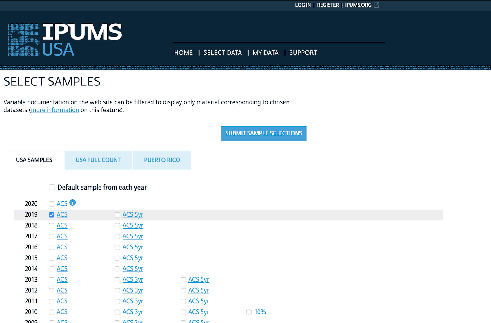
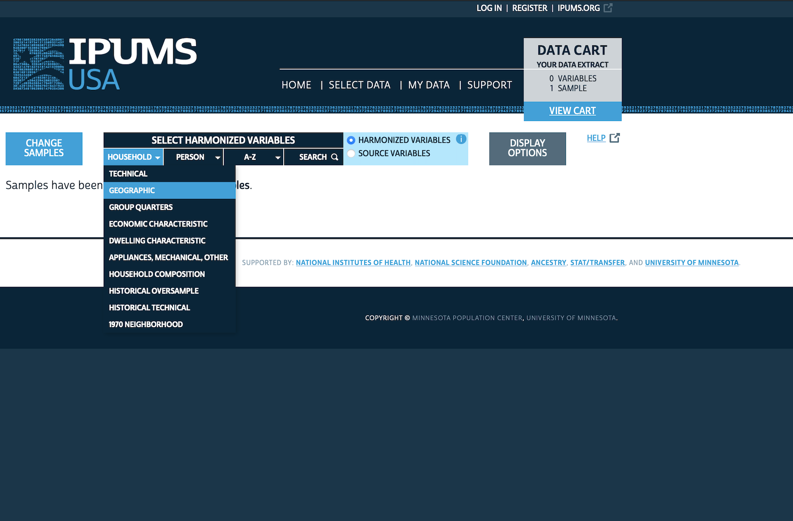
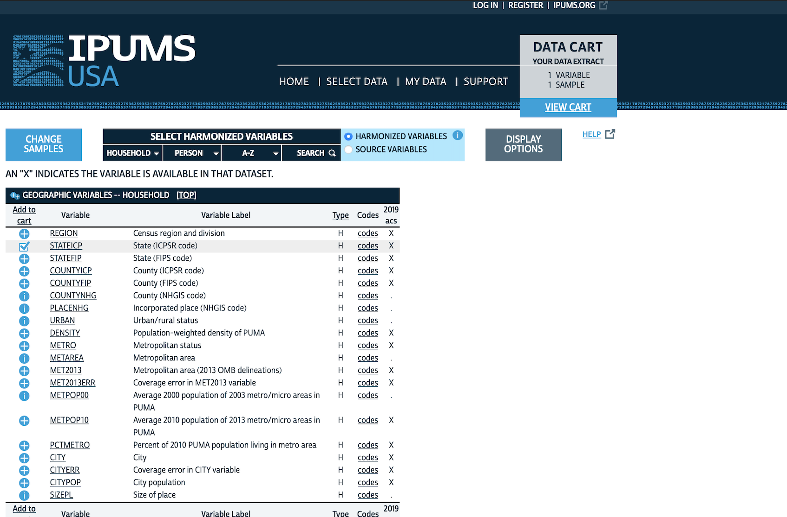
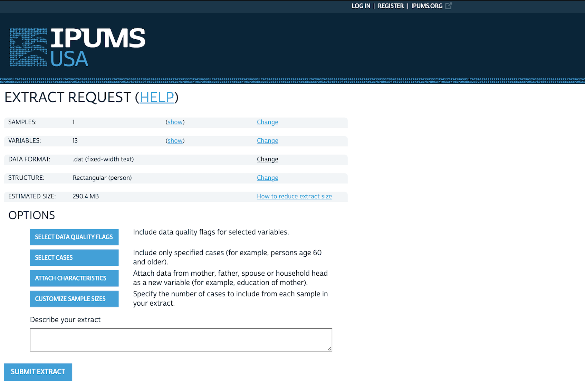
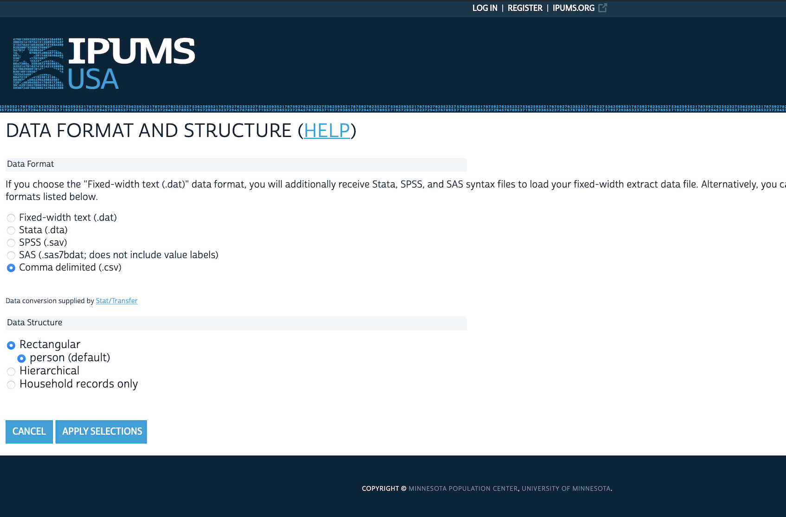
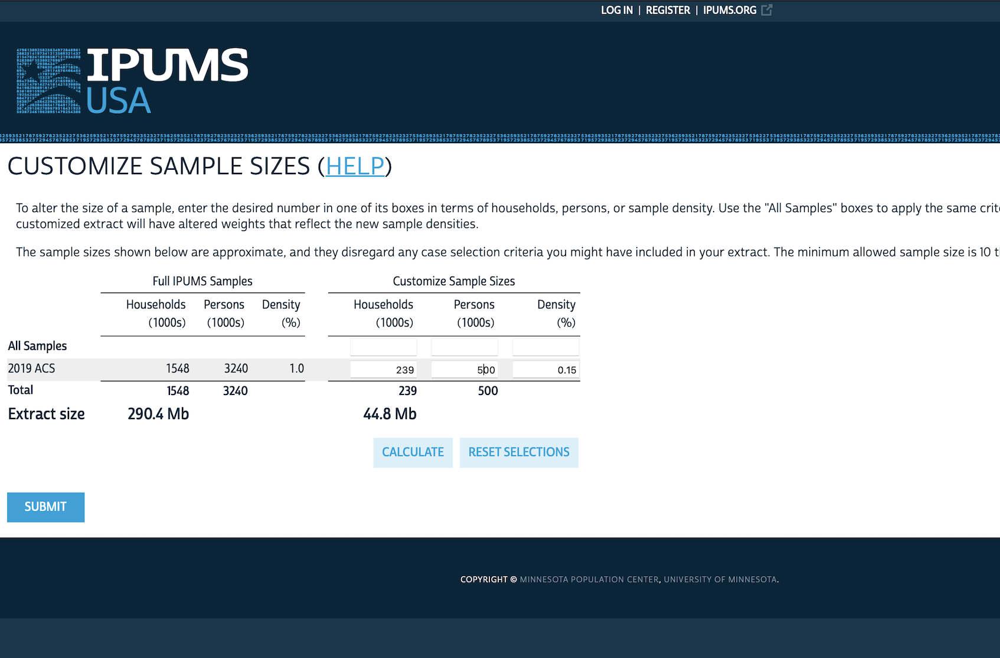
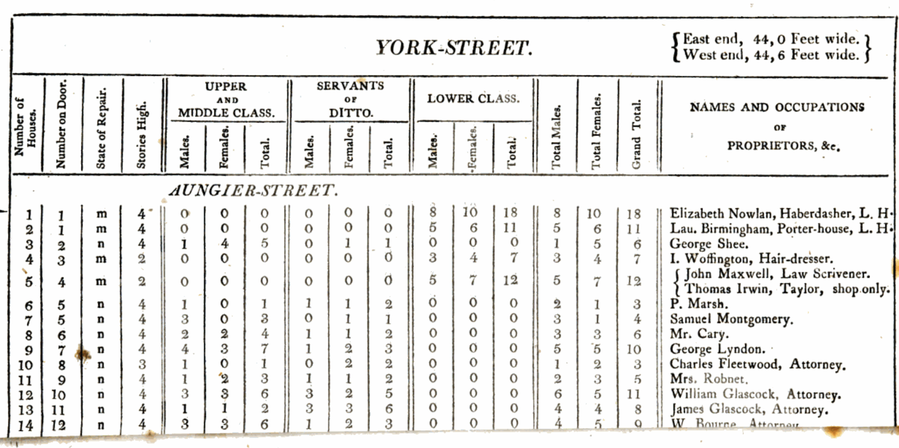
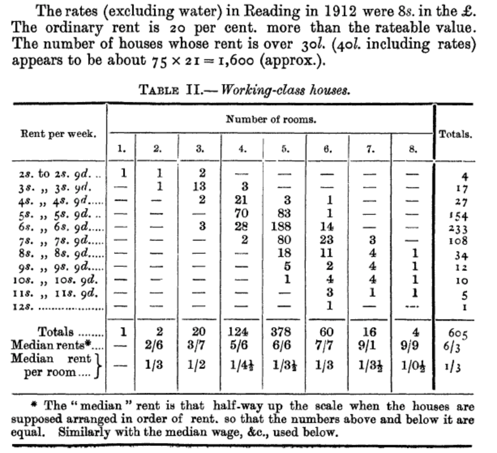

# 측정, 인구 조사, 표본 추출 {#sec-farm-data}

::: {.callout-note}
채프먼 앤 홀/CRC(Chapman and Hall/CRC)에서 2023년 7월에 이 책을 출간했습니다. [여기](https://www.routledge.com/Telling-Stories-with-Data-With-Applications-in-R/Alexander/p/book/9781032134772)에서 구매할 수 있습니다. 온라인 버전에는 인쇄본 이후의 최신 업데이트가 포함되어 있습니다.
:::

**선수 지식**

- *표본 추출 및 무작위화 소개(Introduction to Sampling and Randomization)* 시청 [@register2020sampling]:
  - 다양한 표본 추출 기법의 개요와 유용한 사례를 다룹니다.
- *리딩의 노동자 계층 가구(Working-class Households in Reading)* 읽기 [@bowley1913working]:
  - 1900년대 초 영국에서 수행된 설문 조사를 바탕으로, 체계적 표집(Systematic Sampling)에 대해 깊이 있게 논의한 역사적 논문입니다.
- *대표 방법의 두 가지 측면에 관하여(On the Two Different Aspects of the Representative Method)* 읽기 [@neyman1934two]:
  - 층화 표집(Stratified Sampling)의 개요를 다룹니다. 특히 1장 "서론", 3장 "대표 방법의 다른 측면", 5장 "결론" 및 립(Bowley)과의 논의 부분에 주목하십시오.
- *인구 조사 안내서(Guide to the Census)* 읽기 [@statcanhistory]:
  - 10장 "데이터 품질 평가"에 집중하십시오. 캐나다 정부가 특정 인구 조사를 위해 작성한 자료이지만, 거의 모든 설문 조사에서 발생하는 공통적인 문제와 데이터 품질 관리 방안을 잘 설명하고 있습니다.
- *그, 그녀, 그들: 설문 조사에서 성별 구분(He, She, They: Using Gender in Survey Adjustment)* 읽기 [@kennedy2020using]:
  - 설문 조사에서 생물학적 성(Sex)과 사회적 성(Gender)을 고려할 때 마주하는 현실적인 어려움을 설명하고 대안을 제시합니다.

**핵심 개념 및 기술**

- 데이터셋이 존재하기 위해서는 먼저 **측정(Measurement)**이 선행되어야 하며, 이 과정에는 많은 도전 과제가 따릅니다.
- **인구 조사(Census)**는 특정 측면에서 완전성을 목표로 설계된 데이터셋입니다. 완벽할 수는 없으나, 정부가 막대한 예산을 들여 관리하는 인구 조사 및 공식 통계는 매우 훌륭한 기초 데이터 소스입니다.
- 전수 조사가 불가능한 상황에서도 **표본 추출(Sampling)**을 통해 모집단에 대한 합리적인 추론을 내릴 수 있습니다.
- 확률 표집과 비확률 표집의 차이를 이해하고, 목표 모집단, 표집 틀, 표본, 단순 무작위 표집, 체계적 표집, 층화 표집, 군집 표집과 같은 핵심 용어를 익힙니다.

**주요 패키지 및 함수**

- Base R [@citeR]
- `cancensus` [@citecancensus]
- `canlang` [@canlang] (이 패키지는 CRAN에 없으므로 `install.packages("devtools")` 후 `devtools::install_github("ttimbers/canlang")`로 설치하세요)
- `maps` [@citemaps]
- `tidycensus` [@tidycensus]
- `tidyverse` [@tidyverse]
- `tinytable` [@tinytable]

```{r}
#| message: false
#| warning: false

library(cancensus)
library(canlang)
library(maps)
library(tidycensus)
library(tidyverse)
library(tinytable)

```

## 서론

우리가 세상을 이해하고 그에 관한 이야기를 할 때 가장 어려운 일 중 하나는, 복잡하고 아름다운 세상을 우리가 분석할 수 있는 형태의 **데이터셋**으로 압축하는 과정입니다. 이 과정에서 우리가 무엇을 놓치고 있는지 자각해야 하며, 데이터화 과정 전반에 걸쳐 신중하고 사려 깊은 태도를 유지해야 합니다. 어떤 이들은 데이터셋이 워낙 방대하여 개별 데이터 포인트 하나쯤은 중요하지 않다고 생각할지도 모릅니다. 하지만 과연 그럴까요? 만약 여러분의 어머니가 다른 분이었다면, 여러분의 삶이 얼마나 달라졌을지 상상해 보십시오 [@crawford p. 94].

우리는 종종 데이터셋을 통해 미래를 예측하거나 더 넓은 세상에 대한 주장을 펼치고 싶어 합니다. 하지만 세상을 어떻게 데이터로 치환하든, 우리가 손에 넣는 것은 대개 전체 중 일부인 **표본(Sample)**일 뿐입니다. **통계학**은 이러한 제약 조건을 인지한 상태에서 데이터에 담긴 의미를 파악하는 공식적인 방법론을 제공합니다.\index{statistics} 하지만 통계학 자체가 수집된 데이터로부터 누가 혜택을 받는지, 데이터에 누구의 권력이 투영되어 있는지와 같은 윤리적·사회적 문제에 정답을 주지는 않습니다.\index{data!power}

이 장에서는 먼저 **측정** 과정에서 마주하는 고민들을 살펴봅니다. 이어 모집단 전체를 파악하려는 **인구 조사**와 유기적으로 생산되는 **정부 공식 통계**\index{statistics!official}, 그리고 장기 설문 조사 데이터를 다룹니다. 우리는 이러한 유형의 데이터셋을 **"경작 데이터(Farmed Data)"**라고 부릅니다.

마치 농장에서 식량을 생산하기 위해 수많은 노력을 기울이면 소비자는 요리만 하면 되는 것처럼, 경작 데이터셋도 구조가 잘 잡혀 있고 문서화가 철저합니다. 무엇보다 데이터를 수집, 가공, 정리하는 고된 작업이 이미 완료되어 있어, 우리는 분석에 집중할 수 있다는 장점이 있습니다. 또한 인공지능이 예측하기 쉬운 일정한 주기에 따라 발표됩니다. 예를 들어 주요 국가는 실업률 및 인플레이션 데이터를 매월, GDP를 매 분기, 그리고 인구 조사를 5~10년마다 공표합니다.

다음으로는 분석의 기초가 되는 **표본 추출**의 통계적 개념을 소개합니다. 지난 100여 년 동안 통계학자들은 표본을 다루는 정교한 기법들을 발전시켜 왔으며, 그 과정에서 많은 논쟁을 거쳤습니다 [@brewer2013three]. 여기서는 확률 표집과 비확률 표집을 살펴보고 주요 핵심 용어들을 정리하겠습니다.

데이터는 결코 중립적이지 않습니다.\index{data!not neutral}\index{ethics} 기록학자들에 따르면 기록 보관소\index{archives}는 단순히 사실을 모아둔 곳이 아니라, 특정 맥락(특히 국가의 의도)에 의해 생산된 사실의 파편들을 담은 곳입니다 [@Stoler2002].\index{archives} 따라서 데이터셋에 누가 포함되고 누가 체계적으로 배제되었는지 파악하는 것이 중요합니다. 데이터를 수집하고, 분류하고, 명명하는 행위는 본질적으로 세상을 구축하는 권력의 반영이며 사회적·역사적·재정적·법적 힘을 내포하고 있습니다 [@crawford, p. 121].\index{data!power}

예를 들어, 설문 조사에서 생물학적 성(Sex)과 사회적 성(Gender)의 구분을 생각해 보십시오.\index{surveys!sex}\index{surveys!gender} 생물학적 성은 출생 시 지정되는 신체적 속성에 기반하지만, 사회적 성은 문화적 요인에 의해 구성됩니다 [@sexandgender, p. 7].\index{gender!surveys} 연구자가 실제 알고 싶은 것은 생물학적 차이가 아니라 사회적 성에 따른 결과의 차이일 수 있습니다. 하지만 공식 통계에서 이러한 미묘한 구분을 반영한 것은 그리 오래된 일이 아닙니다. 생물학적 성만을 고집하거나 이분법적 성별만을 제공하는 설문 조사는 그 범주에 속하지 않는 수많은 응답자의 삶을 누락하게 됩니다. 설문 조사 결과를 처리할 때 윤리성, 정확성, 유연성을 어떻게 확보할지에 대해 @kennedy2020using 이 가이드를 제공하지만, 정답은 없습니다. 다만 응답자에 대한 존중을 최우선으로 두어야 한다는 점은 명확합니다 [@kennedy2020using p. 16].

때로는 "복잡한 세상을 왜 굳이 분류하고 그룹화해야 하는가?"라는 의문이 생길 수 있습니다.\index{classification} @scott1998seeing 은 이를 국가가 통치를 위해 사회를 '읽기 쉽게' 만들려는 욕망 때문이라고 분석합니다. 예를 들어 성씨(Surname)를 사용하는 관습도 세금을 징수하고, 부동산을 관리하며, 인센티브를 주거나 징집하기 위한 현대 국가의 필요에서 비롯된 것이 많습니다. 이러한 가독성에 대한 욕구는 자연스럽게 측정의 표준화를 불러왔습니다. 현대의 계측학(Metrology)은 프랑스 혁명기의 표준 단위 도입에서 싹텄고, 나폴레옹 시대에 이르러 국가 체제 구축의 일환으로 더욱 견고해졌습니다 [@scott1998seeing p. 30]. 지식이 "파편적이고 지역적인 것"에서 "보편적이고 수치화된 것"으로 이동한 것입니다 [@prevost2015statistics p. 154]. 하지만 이러한 측정 기준 없이는 데이터를 대규모로 수집하는 것 자체가 불가능합니다. 여기서 주의할 점은, 이러한 측정 기준이 인위적으로 '구성'된 것임을 잊고 마치 절대적인 진리인 양 믿어버리는 **재구체화(Reification)**의 함정입니다.

모든 데이터셋에는 한계가 있습니다. 이 장에서는 **경작 데이터**를 다루는 데 익숙해지는 시간을 가질 것입니다. 다시 말하지만, 경작 데이터란 데이터 분석이라는 목적을 위해 특별히 정교하게 설계되고 축적된 데이터셋을 뜻합니다.

경작 데이터셋은 누군가 미리 만들어 두었기에 얻기는 쉽지만, 그 내부 구조와 구성 과정을 철저히 이해하는 것은 분석가의 몫입니다. 19세기의 제임스 밀(James Mill)은 인도 땅을 한 번도 밟아보지 않고도 방대한 《영국령 인도사(The History of British India)》를 쓴 것으로 유명합니다. 그는 다음과 같이 주장했습니다.

> 인도에서 보고 들을 가치가 있는 모든 지식은 글로 기록될 수 있다. 중요한 정보들이 기록으로 남겨지는 순간, 자질을 갖춘 학자는 영국 서재에 앉아 단 1년 만에, 인도 현장에서 한 평생을 바친 이보다 더 깊은 지식을 얻을 수 있다.
>
> @thehistoryofbritishindia [p. xv]

당시 그가 전문가로 대접받았다는 사실이 지금으로서는 놀랍게 느껴질 수도 있습니다. 하지만 현대의 우리도 물가를 직접 조사하지 않고 인플레이션 통계를 믿고 유권자를 만나지 않고 여론조사 결과를 분석하며 개별 이미지에 직접 라벨을 붙여보지 않고 대규모 데이터셋(ImageNet 등)을 활용합니다. 데이터의 세부 사항을 파고들고 그 이면을 이해하려는 노력은 시대를 불문하고 데이터 과학자의 핵심 윤리입니다.

## 측정

**측정(Measurement)**\index{measurement}은 인류의 아주 오래된 관심사입니다. 아리스토텔레스는 이미 일찍이 양(Quantity)과 질(Quality)을 구분했습니다 [@sepmeasurementscience]. 측정은 모든 정량 분석의 기초이지만, 무엇을 어떻게 측정할지 결정하는 일은 결코 쉽지 않습니다.

측정은 생각보다 훨씬 까다로운 작업입니다. 예를 들어, 아이오와 주립대학교의 데이비드 피터슨(David Peterson) 교수는 음악계의 '원히트 원더(One-hit wonder)'를 정의하는 것이 얼마나 어려운지 보여주었습니다. 당장 떠오르는 가수들도 자세히 살펴보면 차트에서 성공한 곡이 한두 곡 더 있는 경우가 많기 때문입니다 [@molophany]. 다른 분야도 마찬가지입니다. 단임 정부를 분석할 때, 임기를 다 채우지 못한 정부는 포함해야 할까요? 단 한 달, 혹은 일주일만 지속된 정부는 어떨까요? 정부 지원의 상당 부분이 현금이 아닌 현물 급여일 때 그 규모를 어떻게 측정할 수 있을까요 [@garfinkel2006re]? 민주주의에서 시민이 얼마나 잘 대변되고 있는지는 어떻게 수치화할까요 [@Achen1978]? 또한 세계보건기구(WHO)가 산모 사망을 분만 후 42일 이내 발생 건으로 제한할 때, 그 정의가 추정치에 어떤 영향을 끼칠지 고민해 보셨나요 [@Gazeley2022]?\index{World Health Organization}

철학적 관점\index{measurement!philosophy}은 측정의 정의에 깊이를 더해주지만 [@sepmeasurementscience], 실용적으로는 “대상의 특성(양)에 합리적으로 귀속될 수 있는 값을 실험적으로 얻는 과정”으로 정의할 수 있습니다 [@metrology, p. 44]. 여기서 값은 “숫자와 참조(참조 단위)의 조합”을 의미하며, 이는 “측정 결과의 용도, 절차, 교정된 시스템 등을 전제로 한 비교 과정”을 내포합니다.\index{measurement!metrology} 이 정의를 통해 우리는 측정에 있어 **참조 단위(Units)**가 얼마나 중요한지, 그리고 **타당도(Validity)**\index{measurement!valid}와 **신뢰도(Reliability)**\index{measurement!reliable}가 보장된 측정이 왜 핵심인지를 알 수 있습니다.

**계측(Instrumentation or Metrology)**\index{measurement!instrumentation}\index{instrumentation}은 측정을 수행하는 도구와 체계를 의미합니다. 어떤 도구를 쓰느냐에 따라 우리가 무엇을 측정할 수 있는지가 결정됩니다. 예를 들어 16세기 현미경의 발명은 모세혈관(1661년), 세포(1665년), 박테리아(1677년)의 관찰로 이어지며 인류의 지평을 넓혔습니다 [@morange, p. 63; @lane2015unseen]. 시간 측정의 역사도 흥미롭습니다. 초기 해시계로는 한 시간 단위를 정확히 맞추기 어려웠지만, 정밀한 기계식 시계와 원자시계의 등장은 스포츠 경기를 1,000분의 1초 단위로 가르고 GPS를 통해 오차 범위 수 미터 내의 항법을 가능케 했습니다.

::: {.callout-note}

## "정확한 데이터가 있다"는 착각

**시간**은 우리 삶에서 가장 중요한 측정 단위 중 하나입니다.\index{measurement!time} 포뮬러 1(F1) 경주에서는 랩 타임을 1,000분의 1초 단위로 측정하며, 수영 황제 마이클 펠프스는 베이징 올림픽에서 단 100분의 1초 차이로 금메달을 거머쥐었습니다. 정밀한 타이밍 측정은 겉보기에 동시에 일어난 것처럼 보이는 일들 사이의 선후 관계를 밝혀줍니다. @chambliss1989mundanity 의 수영 선수 사례에서 보듯, 기록이 없다면 누가 더 탁월한지 증명하기란 불가능했을 것입니다. 금융 시장에서도 거래 시점은 자산 가치와 직결되는 핵심 요소입니다. 

하지만 "지금 몇 시인가?"라는 단순한 질문에 답하는 것은 의외로 복잡합니다. 개인의 시계는 저마다 기준이 다를 수 있기 때문입니다. 1970년대 이후 인류는 **원자 시간**을 표준으로 삼았습니다. 1초의 정의는 "세슘 133 원자의 바닥 상태에 있는 두 초미세 준위 사이의 전이에 대응하는 복사선의 9,192,631,770주기 지속 시간"입니다 [@Levine2023, p. 4]. 하지만 원자시계가 알려주는 시간을 전 세계 수많은 컴퓨터에 어떻게 동일하게 동기화할 것인가 하는 문제는 여전히 남아 있습니다.\index{internet!clock synchronization} 이에 대해 @hopper2022와 @mills1991internet 은 인터넷 망을 통해 시각을 맞추는 **NTP(Network Time Protocol)**의 원리와 한계를 설명합니다. 또한 지구의 자전을 기준으로 하는 **천문 시간**과 원자 시간 사이의 오차를 교정하기 위해 도입된 '윤초(Leap second)' 제도는 최근 디지털 인프라에 혼란을 줄 수 있다는 우려로 폐지 수순을 밟고 있습니다 [@Levine2023; @Gibney2022; @mitchell2022again].

:::

사회과학에서 가장 보편적인 측정 도구는 **설문 조사**입니다 (@sec-hunt-data 참조). 자연과학이나 공학에서는 **센서**가 그 역할을 대신합니다.\index{measurement!sensors} 기후 과학자는 온습도와 기압 센서를 활용하고, 동물의 움직임을 분석하는 연구자는 가속도계(Accelerometer) 데이터를 분석합니다 [@LeosBarajas2016].\index{measurement!accelerometer} 인공위성의 센서는 지표면 이미지를 촬영하며(Landsat 프로그램 등), 물리학 연구는 데이터 저장 용량이 한계에 다다를 만큼 방대한 양의 정보를 쏟아냅니다. 예를 들어 CERN의 ATLAS 검출기는 입자 충돌 시 초당 80TB의 데이터를 발생시키는데, 이를 모두 저장할 수 없어 필요한 정보만 골라내는 고도의 필터링 과정을 거칩니다 [@Colombo2016].

마케팅 분야의 **A/B 테스트**\index{A/B test}에서는 쿠키, 비콘, 행동 로그 등을 통해 사용자의 반응을 측정합니다. 이때 측정 도구를 대상에게 어떻게 전달할지도 중요한 문제입니다.\index{instrumentation!delivery} 설문 조사의 경우 우편, 전화, 온라인 중 어떤 방식을 택할지, 응답자가 직접 기입하게 할지 조사원이 개입할지에 따라 결과가 달라질 수 있습니다.

또한 측정을 위해서는 반드시 **단위(Units)**라는 참조 기준이 필요합니다.\index{measurement!units} 단위의 선택은 연구 질문과 도구의 정밀도에 달려 있습니다. 만약 식물의 성장을 측정한다면 '킬로미터' 보다는 '밀리미터'가 적절하며, 정밀한 캘리퍼스를 쓴다면 '마이크로미터' 단위까지 고려할 수 있을 것입니다.

### 측정의 속성

**타당도(Validity)**있는 측정이란 우리가 측정하는 값이 실제 알고자 하는 연구 질문(추정량)과 밀접하게 연관되어 있음을 뜻합니다.\index{measurement!valid} 이는 "우리가 정말로 재야 할 것을 재고 있는가?"에 관한 적절성의 문제입니다. [@sec-on-writing] 에서 다룬 **추정량(Estimand)**\index{estimand}은 흡연이 기대 수명에 미치는 실제 영향과 같은 '객관적 실체'입니다. 따라서 우리는 단순히 흡연에 대한 개인의 주관적 견해가 아니라, 그가 피운 담배 개수와 실제 수명과 같은 관련 정보를 정확히 측정해야 합니다.

미터(m)나 초(s)처럼 정의가 확고한 단위는 측정의 타당성에 의문이 적습니다. 하지만 '은총'이나 '미덕', '지능', 혹은 '대학의 질'과 같은 추상적인 개념을 수치화하려 할 때는 타당도가 핵심적인 쟁점이 됩니다. 중세에도 은총을 측정하려는 시도가 있었고 [@crosby1997measure, p. 14], 현대에도 복잡한 지적 능력을 IQ라는 단일 지표로 가두려 합니다. 이러한 가치들이 실재하지 않는다는 뜻은 아니지만, 이를 측정하는 방식에 대해서는 항상 비판적인 시각이 필요합니다.

대표적인 사례가 *U.S. News & World Report*\index{U.S. News and World Report}의 대학 순위입니다. 이들은 학급 규모, 교수진 학위 등 여러 지표를 조합해 대학의 질을 서열화합니다. 하지만 이러한 인위적 지표는 구성원들의 행동을 왜곡하는 부작용을 낳기도 합니다. 컬럼비아 대학교가 1988년 18위에서 2022년 2위로 수직 상승한 배경에 대해, 이 대학 소속 마이클 태디어스(Michael Thaddeus) 교수는 대학 측이 보고한 데이터와 실제 데이터 사이에 유리한 왜곡이 있음을 폭로하기도 했습니다 [@hartocollis2022].

심리학\index{measurement!psychology} 분야에서도 명확한 척도가 없는 개념을 다루기에 타당도와 신뢰도 문제가 큰 비중을 차지합니다. @Fried2022 가 우울증 측정 도구들을 검토한 결과, 상당수의 도구가 타당성과 신뢰성이 부족하다는 사실을 밝혀냈습니다. 그렇다고 측정을 포기할 것이 아니라, 측정 기준을 정하는 과정을 더 **투명하게** 공개해야 합니다.\index{measurement!transparency} @Flake2020 은 새로운 척도를 만들 때마다 연구자가 개념 정의, 결정 과정, 대안 검토, 정량화 방식 등에 관한 구체적인 질문에 답할 것을 제안합니다. 이는 연구자가 원하는 결과를 얻기 위해 유리한 척도를 자의적으로 선택하는 일을 방지하기 위함입니다.

**신뢰도(Reliability)**\index{measurement!reliable}는 측정의 '일관성'을 의미합니다. 동일한 대상을 여러 번 반복 측정하더라도 결과가 비슷하게 나와야 한다는 뜻입니다. 예를 들어 두 명의 조사원이 같은 거리의 상점 수를 셌는데 값이 다르다면, 한 명이 지침을 오해했거나 폐업한 가게를 포함하는 등 측정 상의 오류가 있었을 가능성이 큽니다. 국제 통계에서도 A국의 B국행 이민자 수와 B국이 집계한 A국발 입국자 수가 일치하지 않는 등 신뢰도 문제는 빈번하게 발생합니다.

::: {.callout-note}

## "정확한 데이터가 있다"는 착각

비행기 조종사가 승객에게 현재 고도를 안내하는 것은 흔한 일입니다.\index{measurement!altitude} 하지만 '고도'라는 개념을 정의하고 측정하는 과정은 생각보다 훨씬 복잡하며, 모든 측정은 특정한 맥락 안에서 이루어진다는 사실을 잘 보여줍니다 [@skyfaring]. 

예를 들어 '비행기와 지면 사이의 거리'를 고도라고 한다면, 기준점을 조종석으로 잡아야 할까요(이는 안내 방송에 적합할 것입니다), 아니면 바퀴 아래로 잡아야 할까요(이는 착륙에 필수적일 것입니다)? 만약 비행기가 거대한 산맥 위를 지나간다면 어떻게 될까요? 비행기 자체는 고도를 유지하며 수평 비행 중이더라도, 지면과의 거리는 급격히 줄어들 것입니다. 그렇다고 비행기가 하강했다고 말하기는 어렵습니다. 

이 때문에 항공 분야에서는 조석에 따라 변화하는 해수면 대신, 기압을 기준으로 고도를 측정하는 방식을 주로 사용합니다. 하지만 기압 역시 날씨, 계절, 위치에 따라 수시로 변하기 때문에 동일한 기압 고도라도 실제 지면으로부터의 거리는 천차만별일 수 있습니다. 결국 비행기에서 사용하는 고도 측정법은 '비행기 간의 충돌을 방지하고 안전한 운항을 보장한다'는 실용적인 목적에 맞게 설계된 타협점인 셈입니다.

:::

### 측정 오차

**측정 오차(Measurement Error)**\index{measurement!error}는 우리가 관찰한 값과 실제 참값 사이의 차이를 말합니다. 특정한 경우에는 응답의 진위를 확인할 수 있는데, 확인 가능한 샘플에서 오차의 패턴이 일정하다면 전체 데이터의 오차 정도를 추정할 수 있습니다. 예를 들어 @Sakshaug2010 은 대학 동문 조사에서 응답자가 말한 성적과 실제 대학 기록을 대조했습니다. 그 결과 사람이 직접 전화로 묻는지, 컴퓨터가 묻는지, 혹은 온라인 설문인지에 따라 오차의 수준이 달라진다는 흥미로운 사실을 발견했습니다.

이러한 오차는 조사원이 응답자를 대신해 설문지를 작성할 때 더 심해질 수 있으며, 특히 인종 문제와 결합할 때 민감하게 작용합니다.\index{measurement!race} @davis1997nonrandom [p. 177]은 미국의 흑인 응답자들이 백인 면접관 앞에서는 자신의 정치적·인종적 신념을 가감 없이 드러내지 않을 가능성이 있다고 지적합니다.

오차의 또 다른 유형으로 **검열된 데이터(Censored Data)**가 있습니다.\index{data!censored} 이는 실제 값에 대해 부분적인 정보만 알고 있는 경우입니다. **우측 검열(Right-censoring)**은 실제 값이 관찰된 값보다 '크다'는 것은 알지만 정확히 얼마나 큰지 모르는 상황입니다. 1986년 체르노빌 원전 사고 당시, 현장에 투입된 방사능 측정기들은 최대 측정 한계가 있었습니다. 기계가 최대치를 가리키고 있다면, 실제 방사능 수치는 그보다 훨씬 높았을 것임을 짐작할 수 있습니다.

우측 검열은 의료 연구에서도 흔히 발생합니다. 어떤 환자를 10년간 추적 관찰했을 때, 연구 종료 시점까지 생존해 있다면 우리가 알 수 있는 것은 그가 '최소 10년은 살았다'는 사실일 뿐, 정확한 전체 수명은 아닙니다. 반대로 실제 값이 관찰된 값보다 작을 때 발생하는 **좌측 검열(Left-censoring)**도 있습니다. 예를 들어 영하로 내려가지 않는 온도계는 실제 기온이 영하 10도라 하더라도 0도로 표시할 것입니다.

검열과 비슷하지만 조금 다른 개념으로 **윈저화(Winsorizing)**가 있습니다. 이는 극단적인 값이 통계 분석에 미치는 영향을 줄이기 위해, 관찰된 값을 의도적으로 덜 극단적인 값으로 변환하는 기법입니다. 예를 들어 100세가 넘는 고령자의 나이를 모두 100세로 처리하는 식입니다.

**절단된 데이터(Truncated Data)**\index{data!truncated}는 아예 일정 범위를 벗어나는 관측치를 기록조차 하지 않는 경우입니다. 어린이의 나이와 키의 관계를 연구할 때, "나이가 어떻게 되세요?"라고 물어보고 성인이라면 아예 키를 재지 않고 데이터에서 제외하는 상황이 이에 해당합니다. 절단된 데이터는 **선택 편향(Selection Bias)**과 밀접한 관련이 있습니다.\index{bias!selection} 강의 중간에 자퇴한 학생의 의견이 강의 평가 데이터에 누락되는 것이 전형적인 사례입니다.

이러한 개념들의 차이를 이해하기 위해 신생아 몸무게 데이터를 시뮬레이션해 보겠습니다.\index{measurement!baby weights} 실제 신생아 몸무게는 평균 3.5kg인 정규 분포를 따른다고 가정합시다. 이때 세 가지 가상 시나리오를 설정합니다.

1.  **실제 데이터(Actual):** 모든 아기의 몸무게가 정확히 측정됨.
2.  **검열된 데이터(Censored):** 저울 결함으로 2.75kg 이하의 아기는 모두 2.75kg로 기록됨.
3.  **절단된 데이터(Truncated):** 고위험군(4.25kg 이상) 아기는 다른 병원으로 이송되어 우리 데이터셋에서 완전히 제외됨.

@fig-babyweights 는 이 세 시나리오의 분포 차이를 보여주며, @tbl-meansofscenarios 는 이로 인해 평균값이 어떻게 왜곡(편향)되는지 보여줍니다.\index{distribution!Normal}

```{r}
#| warning: false
#| message: false
#| fig-cap: "실제 체중과 검열 및 절단된 체중 비교"
#| label: fig-babyweights

set.seed(853)

newborn_weight <-
  tibble(
    weight = rep(
      x = rnorm(n = 1000, mean = 3.5, sd = 0.5),
      times = 3),
    measurement = rep(
      x = c("Actual", "Censored", "Truncated"),
      each = 1000)
    )

newborn_weight <-
  newborn_weight |>
  mutate(
    weight = case_when(
      weight <= 2.75 & measurement == "Censored" ~ 2.75,
      weight >= 4.25 & measurement == "Truncated" ~ NA_real_,
      TRUE ~ weight
    )
  )

newborn_weight |>
  ggplot(aes(x = weight)) +
  geom_histogram(bins = 50) +
  facet_wrap(vars(measurement)) +
  theme_minimal()

```

```{r}
#| label: tbl-meansofscenarios
#| eval: true
#| echo: true
#| tbl-cap: "다양한 시나리오의 평균을 비교하여 편향을 식별합니다."

newborn_weight |>
  summarise(mean = mean(weight, na.rm = TRUE),
            .by = measurement) |>
  tt() |>
  style_tt(j = 1:2, align = "lr") |>
  format_tt(digits = 3, num_fmt = "decimal") |>
  setNames(c("측정", "평균"))

```

### 결측 데이터

아무리 완벽한 설문 조사라도 **결측 데이터(Missing Data)**는 발생하기 마련입니다.\index{missing data} 우리가 얻지 못한 관측치가 있다는 사실을 인지하는 것이 중요합니다. 하지만 더 무서운 것은 우리가 결측되었다는 사실조차 모르는 데이터입니다. 즉, 아예 변수 항목으로 고려되지 않아 "짖지 않는 개"처럼 존재를 감추고 있는 데이터들입니다. 이를 방지하기 위해서는 연구 설계 단계에서 주제 전문가와 협력하여 데이터의 흐름을 시뮬레이션하고 꼼꼼히 스케치해 보는 과정이 필수적입니다.

**무응답(Non-response)**은 측정 오차의 특수한 형태입니다.\index{measurement!error}\index{missing data!non-response} 설문 조사 자체를 거부하는 것부터 특정 질문에만 답하지 않는 것까지 그 층위가 다양합니다. 특히 비확률 표본에서 무응답은 치명적인데, 응답한 집단과 그렇지 않은 집단 사이에 체계적인 차이가 있을 가능성이 크기 때문입니다.\index{sampling!non-probability} @gelman2016mythical 은 선거 기간의 여론 변화가 유권자의 변심 때문이라기보다, 지지 후보의 형세에 따라 응답 확률이 달라지는 '차등적 무응답' 때문일 수 있다고 지적합니다. 다행히 사전 통지나 리마인더 발송 등의 기법으로 무응답률을 낮추려는 노력을 기울일 수 있습니다 [@koitsalu2018effects; @frandell2021effects].

무응답 편향이 국가적 비교에 영향을 준 사례로 PISA(국제 학업성취도 평가)를 들 수 있습니다. 캐나다는 학생들의 성적이 우수한 국가로 꼽히지만, @Anders2020 에 따르면 2015년 조사 당시 캐나다의 15세 학생 표본 참여율은 약 50%에 불과했습니다. 반면 다른 고성과 국가들은 90% 이상이 참여했습니다. 연구팀은 참여율을 동일하게 맞출 경우 캐나다의 성적 우위가 상당 부분 사라진다는 사실을 밝혀냈습니다.

데이터가 결측되는 양상은 크게 세 가지로 나뉩니다 [@missingdatatypes].\index{missing data!reasons}

1.  **MCAR (완전 무작위 결측, Missing Completely at Random):**\index{missing data!types} 어떤 변수와도 상관없이 정말 우연히 빠진 경우입니다. 가장 이상적이지만 현실에선 거의 드뭅니다.
2.  **MAR (무작위 결측, Missing at Random):** 특정 변수(예: 성별)에 따라 결측 확률이 달라지지만, 결측된 값 자체(예: 정치적 지향)와는 상관없는 경우입니다. 예를 들어 남성이 설문 응답을 더 귀찮아하지만, 응답한 남성과 하지 않은 남성의 정치 성향이 비슷하다면 성별 가중치를 주어 보정할 수 있습니다.
3.  **MNAR (비무작위 결측, Missing Not at Random):** 결측된 이유가 결측된 값 자체와 연관된 경우입니다. 정치 성향이 너무 극단적이어서 아예 응답을 거부하는 경우가 이에 해당하며, 보정이 매우 까다롭습니다.

이러한 결측치 문제에 대해서는 @sec-exploratory-data-analysis 에서 더 자세히 다루겠습니다.

## 인구 조사 및 기타 정부 데이터

데이터 분석을 위해 국가적 차원에서 체계적으로 생산된 가장 대표적인 소스는 **인구 조사(Census)**입니다.\index{census} 역사적으로 인구 조사는 매우 오래된 전통을 가지고 있습니다. @whitby [p. 30-31]에 따르면 기록상 가장 오래된 인구 조사는 중국 황하 유역에서 실시되었습니다.\index{census!China} 인구 조사의 주요 동기 중 하나는 세금 징수였으며, @jones1953census 는 기원후 3~4세기경 로마에서 새로운 조세 제도를 뒷받침하기 위해 작성된 상세한 인구 기록을 설명합니다.

하지만 인구 조사의 정교한 기록이 비극적으로 악용된 사례도 있습니다. @luebke1994locating [p. 25]은 나치\index{census!Nazis}가 인구 조사와 경찰 등록 데이터를 활용해 유대인 등 박해 대상을 선별하고 학살지로 이송한 과정을 고발합니다. 또한 @clairemckaybowen [p. 17]은 제2차 세계 대전 당시 미국 인구 조사국이 일본계 미국인을 수용소에 감금하는 데 필요한 정보를 제공했음을 밝히고 있습니다. 이에 대해 1990년대 빌 클린턴 대통령은 공식적으로 사과한 바 있습니다.\index{census!Japanese American internship}

정부가 생산하는 또 다른 핵심 데이터는 실업률, 물가 상승률, 국내총생산(GDP)과 같은 **공식 통계**입니다.\index{statistics!official}\index{Gross Domestic Product} 흥미롭게도 이러한 경제 지표들이 처음부터 국가 주도로 개발된 것은 아니었습니다 [@rockoff2019controversies]. 하지만 현재는 국가의 인적·재정적 자원이 뒷받침된 인구 조사와 정부 설문 조사가 그 어떤 민간 데이터보다 강력한 신뢰성과 포괄성을 자랑합니다. 2020년 미국 인구 조사에만 무려 156억 달러의 예산이 투입된 것으로 추정됩니다 [@Hawes2020Implementing]. 물론 막대한 자본이 투입되었다고 해서 데이터가 완벽하다는 뜻은 아닙니다. 모든 데이터와 마찬가지로 인구 조사 역시 누락, 중복, 오보 등의 오류에서 자유로울 수 없으며, 통계학자들은 이러한 품질을 평가하기 위해 끊임없이 노력합니다 [@statcanhistory].\index{census!United States}

::: {.callout-note}

## "정확한 데이터가 있다"는 착각

인구 조사는 국가 정책의 기초가 되지만 결코 무결하지 않습니다. @anderson1999counts 에 따르면 미국 인구 조사의 역사는 곧 '누락(Undercount)'의 역사이기도 합니다. 조지 워싱턴\index{census!George Washington}조차도 1790년대 첫 조사 당시 누락이 너무 많다며 불만을 터뜨렸습니다.\index{census!undercount} 실제 누락 정도를 파악하기 위해 통계학자들은 제2차 세계 대전 당시의 징집 병역 등록 시스템과 인구 조사 데이터를 비교했습니다. 그 결과 징집 대상 남성 수가 인구 조사 기록보다 약 50만 명이나 더 많다는 사실이 발견되었습니다. 이는 인종에 따라 더 심각한 차이를 보였는데, 전체 평균 누락률은 3%였지만 징집 연령대 흑인 남성들의 누락률은 13%에 달했습니다 [@anderson1999counts, p. 29].\index{census!race}\index{bias!race} 인종별 인구 집계는 데이터의 객관적 수치를 넘어 계급, 법률, 정치적 이해관계가 얽힌 복잡한 사회적 산물이기도 합니다 [@nobles2002racial, p. 48].

:::

::: {.callout-note}

## 거인의 어깨 위에서

**마고 앤더슨(Margo Anderson)**\index{Anderson, Margo}은 위스콘신-밀워키 대학교의 역사 및 도시 연구 특훈 교수입니다. 럿거스 대학교에서 역사학 박사 학위를 취득한 뒤, 미국의 인구 조사 제도와 역사에 관한 독보적인 연구 성과를 쌓아왔습니다. 주요 저서로는 @anderson1999counts 와 @anderson2015census 가 있으며, 1998년에는 미국 통계 협회(ASA) 펠로우로 선출되기도 했습니다.

:::

정부 데이터의 또 다른 축은 장기적인 **사회 설문 조사**들입니다. 정부가 직접 수행하기도 하지만, 대개 정부의 재정 지원을 받는 전문 연구 기관들이 정기적으로 실시합니다. 캐나다 선거 연구(Canadian Election Study)나 영국 선거 연구(British Election Study)가 대표적이며, 이들은 수십 년간의 데이터를 축적해 시민들의 정치적 태도 변화를 추적할 수 있게 해줍니다.

최근 전 세계적으로 불고 있는 **공공 데이터 개방(Open Data)** 운동도 주목할 만합니다. 정부가 보유한 데이터를 시민에게 투명하게 공개해야 한다는 원칙은 민주주의의 기본입니다. 하지만 정부가 '입맛에 맞는' 데이터만 골라 공개하거나, 정부의 성과를 홍보하기 위해 데이터를 가공할 위험성도 상존합니다 [@Kalgin2014; @Zhang2019; @Berdine2018]. 이럴 때 시민 사회가 활용할 수 있는 강력한 도구가 **정보공개청구(Freedom of Information, FOI)**입니다 [@walby2019freedom]. 실제로 @biasbehindbars 는 정보공개청구를 통해 입수한 데이터를 분석하여 캐나다 교도소 시스템 내부의 체계적인 인종 차별 실태를 세상에 알린 바 있습니다.

과거에는 이러한 방대한 데이터셋을 다루는 것이 전문가들만의 영역이었지만, 이제는 R 패키지를 통해 누구나 손쉽게 접근할 수 있습니다. 다음은 그중 특히 유용한 도구들입니다.

### 캐나다

캐나다 최초의 인구 조사는 1666년에 실시되었습니다.\index{census!Canada} 이것은 또한 모든 개인이 이름으로 기록된 최초의 현대 인구 조사였지만, 원주민은 포함하지 않습니다[@godfrey1918history, p. 179]. 3,215명의 주민이 집계되었으며, 인구 조사는 나이, 성별, 결혼 여부 및 직업에 대해 질문했습니다[@statcanhistory]. 1867년 캐나다 연방과 관련하여, 새로운 의회에 정치 대표를 할당하기 위해 10년마다 인구 조사가 요구되었습니다. 그 이후로 정기적인 인구 조사가 있었습니다.

`canlang`을 사용하여 2016년 인구 조사에서 캐나다에서 사용되는 언어에 대한 일부 데이터를 탐색할 수 있습니다. 이 패키지는 CRAN에 없지만 GitHub에서 `install.packages("devtools")` 후 `devtools::install_github("ttimbers/canlang")`로 설치할 수 있습니다.\index{packages!install}

`canlang`을 로드한 후 `can_lang` 데이터셋을 사용할 수 있습니다. 이것은 214개 언어 각각을 사용하는 캐나다인의 수를 제공합니다.

```{r}
#| message: false
#| warning: false

can_lang

```

우리는 모국어로 가장 흔한 상위 10개 언어를 빠르게 볼 수 있습니다.

```{r}

can_lang |>
  slice_max(mother_tongue, n = 10) |>
  select(language, mother_tongue)

```

`region_lang`과 `region_data`라는 두 데이터셋을 결합하여 가장 큰 지역인 토론토와 가장 작은 지역인 벨빌 간에 가장 흔한 5개 언어가 다른지 확인할 수 있습니다.

```{r}

region_lang |>
  left_join(region_data, by = "region") |>
  slice_max(c(population)) |>
  slice_max(mother_tongue, n = 5) |>
  select(region, language, mother_tongue, population) |>
  mutate(prop = mother_tongue / population)

region_lang |>
  left_join(region_data, by = "region") |>
  slice_min(c(population)) |>
  slice_max(mother_tongue, n = 5) |>
  select(region, language, mother_tongue, population) |>
  mutate(prop = mother_tongue / population)

```

토론토에서는 50%가 조금 넘는 사람들이 영어를 모국어로 사용하는 반면, 벨빌에서는 약 90%가 영어를 모국어로 사용하는 등 비율에 상당한 차이가 있음을 알 수 있습니다.

일반적으로 캐나다 인구 조사 데이터는 다른 국가에 비해 관련 정부 기관을 통해 쉽게 이용할 수 없지만, 나중에 논의할 통합 공공 이용 마이크로데이터 시리즈(IPUMS)는 일부에 대한 접근을 제공합니다. 인구 조사 및 기타 공식 통계를 담당하는 정부 기관인 캐나다 통계청\index{Canada!Statistics Canada}은 2016년 인구 조사의 "개인 파일"을 공공 이용 마이크로데이터 파일(PUMF)로 무료로 제공하지만 요청에 응해서만 제공합니다. 그리고 2016년 인구 조사의 2.7% 표본이지만 이 PUMF는 제한된 세부 정보만 제공합니다.

캐나다 통계청(Statistics Canada)은 방대한 데이터를 제공하며, `cansim` 패키지\index{R!cansim}\index{cansim} [@cansim]를 통해 이를 R로 직접 불러올 수 있습니다. 전체 데이터 카탈로그를 검색하거나 특정 테이블 ID를 알고 있다면 바로 호출이 가능합니다. 예를 들어 테이블 "17-10-0005-01"은 주/지역별 인구 추계 및 요약 통계를 담고 있습니다. 해당 패키지는 데이터를 깔끔한(Tidy) 형식으로 변환해 주므로 별도의 정제 과정 없이 바로 시각화나 분석에 활용할 수 있다는 점이 큰 장점입니다.

캐나다 인구 조사 데이터에 접근하는 또 다른 방법은 `cancensus`를 사용하는 것입니다.\index{census!Canada} API 키가 필요하며\index{API}, [계정](https://censusmapper.ca/users/sign_up)을 만든 다음 "프로필 편집"으로 이동하여 요청할 수 있습니다. 이 패키지에는 API 키를 ".Renviron" 파일에 더 쉽게 추가할 수 있는 도우미 함수가 있으며, 이에 대해서는 @sec-gather-data 더 자세히 설명하겠습니다.

`cancensus`를 설치하고 로드한 후 `get_census()`를 사용하여 인구 조사 데이터를 얻을 수 있습니다. 관심 있는 인구 조사와 다양한 기타 인수를 지정해야 합니다. 예를 들어, 인구 기준으로 캐나다에서 가장 큰 주인 온타리오에 대한 2016년 인구 조사 데이터를 얻을 수 있습니다.\index{Canada}

```{r}
#| message: false
#| warning: false
#| eval: false

set_api_key("YOUR_API_KEY_HERE", install = TRUE)

ontario_population <-
  get_census(
    dataset = "CA16",
    level = "Regions",
    vectors = "v_CA16_1",
    regions = list(PR = c("35"))
  )

ontario_population

```

```{r}
#| message: false
#| warning: false
#| include: false
#| eval: false

# INTERNAL

ontario_population <-
  get_census(
    dataset = "CA16",
    level = "Regions",
    vectors = "v_CA16_1",
    regions = list(PR = c("35"))
  )

write_csv(ontario_population, "inputs/data/census_population.csv")

```

```{r}
#| message: false
#| warning: false
#| echo: false

ontario_population <-
  read_csv("inputs/data/census_population.csv")

ontario_population

```

1996년 이후의 인구 조사 데이터를 사용할 수 있으며, `list_census_datasets()`는 이러한 데이터에 접근하기 위해 `get_census()`에 제공해야 하는 메타데이터를 제공합니다. 데이터는 다양한 지역을 기반으로 사용할 수 있으며, `list_census_regions()`는 필요한 메타데이터를 제공합니다. 마지막으로, `list_census_vectors()`는 사용 가능한 변수에 대한 메타데이터를 제공합니다.

### 미국

#### 인구조사

인구 조사는 미국 헌법에 포함되어 있지만, 1639년 초 매사추세츠가 된 지역에서는 출생과 사망이 법적으로 등록되어야 했습니다[@gutman1958birth].

미국 인구 조사국(United States Census Bureau)의 데이터는 `tidycensus` 패키지\index{R!tidycensus}\index{tidycensus} [@tidycensus]를 통해 편리하게 이용할 수 있습니다. 이 패키지는 5년 단위 미국 지역사회 조사(ACS)와 인구 조사 데이터를 R의 데이터프레임 형식을 불러와 줍니다. 특히 공간 정보(Geometry)를 함께 가져올 수 있는 기능이 강력하여, 앞서 @sec-graphs-tables-maps 에서 다룬 지도를 제작할 때 매우 유용합니다. 패키지를 사용하려면 인구 조사국 웹사이트에서 API 키를 발급받아야 합니다.
\index{API}

설정이 완료되면 `get_decennial()`을 사용하여 관심 변수에 대한 데이터를 얻을 수 있습니다. 예를 들어, 2010년 특정 주에 대한 전체 및 소유자 또는 임차인별 평균 가구 규모에 대한 데이터를 수집할 수 있습니다(@fig-utahvsdc).

```{r}
#| message: false
#| warning: false
#| eval: false
#| echo: true

census_api_key("YOUR_API_KEY_HERE")

us_ave_household_size_2010 <-
  get_decennial(
    geography = "state",
    variables = c("H012001", "H012002", "H012003"),
    year = 2010
  )

us_ave_household_size_2010 |>
  filter(NAME %in% c("District of Columbia", "Utah", "Massachusetts")) |>
  ggplot(aes(y = NAME, x = value, color = variable)) +
  geom_point() +
  theme_minimal() +
  labs(
    x = "평균 가구 규모", y = "주", color = "가구 유형"
    ) +
  scale_color_brewer(
    palette = "Set1", labels = c("전체", "소유자 점유", "임차인 점유")
    )

```

```{r}
#| message: false
#| warning: false
#| include: false
#| eval: false

# INTERNAL

us_ave_household_size_2010 <-
  get_decennial(
    geography = "state",
    variables = c("H012001", "H012002", "H012003"),
    year = 2010
  )

write_csv(us_ave_household_size_2010, "inputs/data/census_household_size.csv")

```

```{r}
#| message: false
#| warning: false
#| echo: false
#| eval: true
#| label: fig-utahvsdc
#| fig-cap: "DC, 유타, 매사추세츠의 가구 유형별 평균 가구 규모 비교"

us_ave_household_size_2010 <-
  read_csv("inputs/data/census_household_size.csv")

us_ave_household_size_2010 |>
  filter(NAME %in% c(
    "District of Columbia",
    "Utah",
    "Massachusetts"
  )) |>
  ggplot(aes(
    y = NAME,
    x = value,
    color = variable
  )) +
  geom_point() +
  theme_minimal() +
  labs(
    x = "평균 가구 규모",
    y = "주",
    color = "가구 유형"
  ) +
  scale_color_brewer(
    palette = "Set1",
    labels = c(
      "전체",
      "소유자 점유",
      "임차인 점유"
    )
  )

```

@walker2022 R로 미국 인구 조사 데이터를 분석하는 방법에 대해 더 자세히 설명합니다.\index{census!United States}

#### 미국 지역사회 조사

미국은 일반적으로 인구 조사를 사용하는 것보다 더 나은 접근 방식이 있고 정부 통계 기관 웹사이트를 사용해야 하는 것보다 더 나은 방법이 있는 부러운 상황에 있습니다.\index{IPUMS} IPUMS는 국제 인구 조사 마이크로데이터를 포함한 광범위한 데이터셋에 대한 접근을 제공합니다. 미국의 특정 경우, 미국 지역사회 조사(ACS)는 많은 인구 조사에서 질문하는 내용과 내용이 유사한 설문 조사이지만, 데이터가 사용 가능해질 때까지 상당히 오래될 수 있는 인구 조사와 비교하여 연간 단위로 제공됩니다.\index{American Community Survey} 매년 수백만 건의 응답으로 끝납니다. ACS는 인구 조사보다 작지만, 더 시기적절하게 사용할 수 있다는 장점이 있습니다. 우리는 IPUMS를 통해 ACS에 접근합니다.

:::{.callout-note}

## 거인의 어깨 위에 서서

스티븐 러글스\index{Ruggles, Steven}는 미네소타 대학교의 역사 및 인구 연구 리전트 교수이며 IPUMS를 담당하고 있습니다.\index{IPUMS} 1984년 펜실베이니아 대학교에서 역사 인구 통계학\index{demography} 박사 학위를 받은 후, 그는 미네소타 대학교의 조교수로 임명되었고 1995년에 정교수로 승진했습니다. 초기 IPUMS 데이터 릴리스는 1993년에 있었습니다[@sobek1999ipums]. 그 이후로 성장하여 현재 많은 국가의 사회 및 경제 데이터를 포함합니다. 러글스는 2022년에 맥아더 재단 펠로우십을 수상했습니다.\index{MacArthur Foundation Fellowship}

:::

### IPUMS

전 세계 각국의 인구 조사 데이터와 대규모 설문 조사 결과를 통합하여 제공하는 **IPUMS(Integrated Public Use Microdata Series)**\index{IPUMS}는 데이터 과학자들에게 보물창고와 같습니다 [@ipums]. 정부에서 발표하는 '공식 통계'가 성별·연령별로 이미 집계된 요약표라면, IPUMS는 개별 응답자의 정보를 담은 **미시 데이터(Microdata)**를 제공합니다. 물론 개인 정보 보호를 위해 비식별 처리가 되어 있지만, 연구자가 원하는 방식대로 직접 집계하고 분석할 수 있다는 점에서 활용도가 매우 높습니다.

IPUMS를 사용할 때는 `ipumsr` 패키지\index{R!ipumsr}\index{ipumsr} [@ipumsr]가 필수적입니다. 이 패키지는 IPUMS 웹사이트에서 내려받은 데이터 파일(.dat)과 이에 수반되는 메타데이터 파일(.xml)을 읽어와 R 데이터프레임으로 변환해 줍니다. 무엇보다 파일 내에 포함된 다양한 코드북 정보(예: '1'은 '기혼', '2'은 '미혼')를 R의 레이블(Label) 속성으로 자동 처리해 주므로 분석이 훨씬 수월해집니다.

[IPUMS](https://ipums.org)로 이동한 다음 "IPUMS USA"를 클릭하고 "데이터 가져오기"를 클릭합니다. 우리는 표본에 관심이 있으므로 "표본 선택"으로 이동합니다. "각 연도의 기본 표본"을 선택 취소하고 대신 "2019 ACS"를 선택한 다음 "표본 선택 제출"을 클릭합니다(@fig-ipumstwo).\index{IPUMS}

:::{#fig-ipums layout-nrow=3}

{#fig-ipumstwo}

{#fig-ipumsfour}

{#fig-ipumssix}

{#fig-ipumseight}

{#fig-ipumsnine}

{#fig-ipumsten}

IPUMS에서 데이터를 얻는 단계 개요

:::

우리는 주별 데이터에 관심이 있을 수 있습니다. "HOUSEHOLD" 변수를 보고 "GEOGRAPHIC"을 선택하여 시작합니다(@fig-ipumsfour). 더하기를 클릭하여 "STATEICP"를 "장바구니"에 추가하면 체크 표시로 바뀝니다(@fig-ipumssix). 그런 다음 "PERSON" 기준의 데이터, 예를 들어 "DEMOGRAPHIC" 변수인 "AGE"에 관심이 있을 수 있으며, 이를 장바구니에 추가해야 합니다. 또한 "SEX"와 "EDUC"(둘 다 "PERSON"에 있음)도 원합니다.

완료되면 "장바구니 보기"를 클릭한 다음 "데이터 추출 생성"을 클릭합니다(@fig-ipumseight). 이 시점에서 변경하고 싶은 두 가지 측면이 있습니다.

1. "DATA FORMAT"을 ".dat"에서 ".dta"로 변경합니다(@fig-ipumsnine).
2. 3백만 개의 응답이 필요하지 않을 수 있으므로 표본 크기를 사용자 지정하고, 예를 들어 500,000개로 변경할 수 있습니다(@fig-ipumsten).

요청의 크기를 간략하게 확인하십시오. 약 40MB를 훨씬 넘지 않아야 합니다. 그렇다면 실수로 필요하지 않은 변수가 선택되었는지 확인하거나 관측치 수를 더 줄이십시오.

마지막으로, 추출물에 대한 설명적인 이름을 포함하고 싶습니다. 예를 들어, "2023-05-15: 주, 나이, 성별, 교육"과 같이 추출한 날짜와 추출물에 포함된 내용을 지정합니다. 그 후에 "추출 제출"을 클릭할 수 있습니다.

로그인하거나 계정을 만들라는 요청을 받게 되며, 그 후에 요청을 제출할 수 있습니다. IPUMS는 추출물이 사용 가능해지면 이메일을 보내며, 그 후에 다운로드하여 일반적인 방법으로 R로 읽을 수 있습니다. 데이터셋이 로컬에 "usa_00015.dta"로 저장되었다고 가정합니다(데이터셋 파일 이름이 약간 다를 수 있음).

이 데이터셋을 사용할 때 인용하는 것이 중요합니다. 예를 들어, @ipumsusa 대해 다음 BibTeX 항목을 사용할 수 있습니다.\index{citation!IPUMS}

:::{.content-visible when-format="pdf"}

```

@misc{ipumsusa,
  author       = {Ruggles,  Steven and Flood,  Sarah and $\dots$},
  year         = 2021,
  title        = {IPUMS USA: Version 11.0},
  publisher    = {Minneapolis,  MN: IPUMS},
  doi          = {10.18128/d010.v11.0},
  url          = {https://usa.ipums.org},
  language     = {en},
}

```
:::

:::{.content-visible unless-format="pdf"}

```

@misc{ipumsusa,
  author       = {Ruggles,  Steven and Flood,  Sarah and Foster,  Sophia and Goeken,  Ronald and Pacas,  Jose and Schouweiler,  Megan and Sobek,  Matthew},
  year         = 2021,
  title        = {IPUMS USA: Version 11.0},
  publisher    = {Minneapolis,  MN: IPUMS},
  doi          = {10.18128/d010.v11.0},
  url          = {https://usa.ipums.org},
  language     = {en},
}

```
:::

@sec-multilevel-regression-with-post-stratification 이 데이터셋을 사용할 것이므로 간략하게 정리하고 준비하겠습니다. 우리의 코드는 @greatstudentwork 기반으로 합니다.

```{r}
#| message: false
#| warning: false
#| eval: false
#| echo: true

ipums_extract <- read_dta("usa_00015.dta")

ipums_extract <-
  ipums_extract |>
  select(stateicp, sex, age, educd) |>
  to_factor()

ipums_extract

```

```{r}
#| eval: false
#| warning: false
#| message: false
#| echo: false

# INTERNAL

ipums_extract <- read_dta(here::here("dont_push/usa_00015.dta"))

ipums_extract <-
  ipums_extract |>
  select(stateicp, sex, age, educd) |>
  to_factor()

arrow::write_parquet(
  x = ipums_extract,
  sink = "inputs/data/ipums_extract.parquet")

```

```{r}
#| eval: true
#| echo: false

ipums_extract <-
  arrow::read_parquet(
    file = "inputs/data/ipums_extract.parquet"
    )

ipums_extract

```

```{r}
#| eval: true
#| echo: true

cleaned_ipums <-
  ipums_extract |>
  mutate(age = as.numeric(age)) |>
  filter(age >= 18) |>
  rename(gender = sex) |>
  mutate(
    age_group = case_when(
      age <= 29 ~ "18-29",
      age <= 44 ~ "30-44",
      age <= 59 ~ "45-59",
      age >= 60 ~ "60+",
      TRUE ~ "Trouble"
    ),
    education_level = case_when(
      educd %in% c(
        "nursery school, preschool", "kindergarten", "grade 1",
        "grade 2", "grade 3", "grade 4", "grade 5", "grade 6",
        "grade 7", "grade 8", "grade 9", "grade 10", "grade 11",
        "12th grade, no diploma", "regular high school diploma",
        "ged or alternative credential", "no schooling completed"
      ) ~ "High school or less",
      educd %in% c(
        "some college, but less than 1 year",
        "1 or more years of college credit, no degree"
      ) ~ "Some post sec",
      educd  %in% c("associate's degree, type not specified",
                    "bachelor's degree") ~ "Post sec +",
      educd %in% c(
        "master's degree",
        "professional degree beyond a bachelor's degree",
        "doctoral degree"
      ) ~ "Grad degree",
      TRUE ~ "Trouble"
    )
  ) |>
  select(gender, age_group, education_level, stateicp) |>
  mutate(across(c(
    gender, stateicp, education_level, age_group),
    as_factor)) |>
  mutate(age_group =
           factor(age_group, levels = c("18-29", "30-44", "45-59", "60+")))

cleaned_ipums

```

@sec-multilevel-regression-with-post-stratification 이 데이터셋을 사용할 것이므로 저장하겠습니다.

```{r}
#| eval: false
#| include: true

write_csv(x = cleaned_ipums,
          file = "cleaned_ipums.csv")

```

```{r}
#| eval: true
#| echo: false

arrow::write_parquet(x = cleaned_ipums,
              sink = "outputs/data/cleaned_ipums.parquet")

```

일부 변수도 살펴볼 수 있습니다(@fig-ipumsquickgraph).

```{r}
#| fig-cap: "IPUMS ACS 표본의 연령, 성별, 교육별 수 검토"
#| label: fig-ipumsquickgraph

cleaned_ipums |>
  ggplot(mapping = aes(x = age_group, fill = gender)) +
  geom_bar(position = "dodge2") +
  theme_minimal() +
  labs(
    x = "응답자 연령 그룹",
    y = "응답자 수",
    fill = "교육"
  ) +
  facet_wrap(vars(education_level)) +
  guides(x = guide_axis(angle = 90)) +
  theme(legend.position = "bottom") +
  scale_fill_brewer(palette = "Set1")

```

전체 집계 데이터, 즉 전체 인구 조사는 1890년을 제외하고 1850년에서 1940년 사이에 실시된 미국 인구 조사에 대해 IPUMS\index{IPUMS}를 통해 사용할 수 있습니다.\index{census!United States} 1890년 인구 조사 기록의 대부분은 1921년 화재로 소실되었습니다. 1990년까지 모든 인구 조사에 대해 1% 표본을 사용할 수 있습니다. ACS 데이터는 2000년부터 사용할 수 있습니다.

<!-- 노숙자 측정? -->

<!-- https://www.ncbi.nlm.nih.gov/books/NBK218229/ -->

<!-- "1990년 미국 인구 조사국에서 실시한 S-Night 설문 조사" -->

<!-- ### 호주 -->

<!-- ## 기타 정부 데이터 -->

<!-- ### 실업 -->

<!-- ### 날씨 -->

<!-- ### 일반 사회 조사 -->

<!-- ## 개방형 정부 데이터 -->

<!-- ### 캐나다 -->

<!-- - 캐나다 정부 개방형 데이터: https://open.canada.ca/en/open-data. -->

<!-- - 토론토시 개방형 데이터 포털 -->

<!-- ## 선거 연구 -->

<!-- ### 캐나다 선거 연구 -->

<!-- cesR -->

<!-- ### 호주 선거 연구 -->

<!-- ### CCES -->

## 표본 추출의 필수 사항

모집단 전체를 조사하는 전수 조사는 이상적이지만, 비용과 시간 측면에서 불가능할 때가 많습니다. 이때 우리는 **표본 추출(Sampling)**\index{sampling}이라는 강력한 대안을 사용합니다. 잘 뽑힌 한 스푼의 국이 냄비 전체의 맛을 알려주듯, 적절한 표본은 모집단의 특성을 놀라울 정도로 정확하게 반영합니다.

하지만 표본 추출은 단순히 '무작위'로 뽑는 것 이상의 정교한 설계가 필요합니다. 잘못된 표본 추출은 심각한 편향을 초래하며, 이는 100년 전이나 지금이나 데이터 분석에서 가장 경계해야 할 부분입니다 [@brewer2013three]. 표본 추출을 이해하기 위해 먼저 몇 가지 핵심 용어를 명확히 짚고 넘어가겠습니다.

- **목표 모집단(Target Population):** 우리가 정말로 알고 싶어 하는 전체 집단입니다 (예: "투표권이 있는 모든 한국인").
- **표집 틀(Sampling Frame):** 모집단에 접근하기 위해 사용하는 실제 명부나 방법입니다 (예: "유선전화 가입자 리스트").
- **표본(Sample):** 표집 틀에서 실제로 선정되어 조사에 응한 데이터 포인트들의 집합입니다.

이상적인 상황에서는 목표 모집단과 표집 틀이 일치해야 합니다. 하지만 현실에서는 유선전화가 없는 사람, 혹은 리스트에 누락된 사람 등이 발생하여 **포괄 오차(Coverage Error)**가 생기게 됩니다. 

표본 추출 방식은 크게 **확률 표집**과 **비확률 표집**으로 나뉩니다.

데이터가 있다고 가정해 봅시다.\index{simulation!toddler bedtime} 예를 들어, 특정 유아는 매일 저녁 6시에 잠자리에 듭니다. 우리는 그 취침 시간이 모든 유아에게 공통적인지, 아니면 특이한 유아를 가지고 있는지 알고 싶을 수 있습니다. 유아가 한 명뿐이라면 그들의 취침 시간을 사용하여 모든 유아에 대해 말하는 능력은 제한될 것입니다.

한 가지 접근 방식은 유아를 둔 친구들과 이야기하는 것입니다. 그런 다음 친구의 친구들과 이야기합니다. 유아 취침 시간에 대한 어떤 근본적인 진실에 대해 말할 수 있다고 편안하게 느끼기 시작하기 전에 얼마나 많은 친구와 친구의 친구들에게 물어봐야 할까요?

@wuandthompson [p. 3]은 통계학\index{statistics!definition}을 "데이터를 수집하고 분석하며 알려지지 않은 모집단에 대한 진술과 결론을 도출하는 방법에 대한 과학"으로 설명합니다. 여기서 "모집단"은 통계적 의미로 사용되며, 우리가 정확히 알 수는 없지만 무작위 변수의 확률 분포를 사용하여 특성을 설명할 수 있는 어떤 무한한 그룹을 의미합니다. 우리는 @sec-its-just-a-linear-model 확률 분포\index{distribution!probability}에 대해 더 자세히 논의합니다. @fisherresearchworkers [p. 41]는 더 나아가 다음과 같이 말합니다.\index{Fisher, Ronald}

> 하나 이상의 특성에 대한 빈도 분포로 분포된 무한 모집단에 대한 아이디어는 모든 통계 작업의 기본입니다. 제한된 경험에서... 우리는 우리 표본이 추출된 무한한 가상 모집단에 대한 어떤 아이디어를 얻을 수 있으며, 따라서 우리 결론이 적용될 미래 표본의 가능한 성격에 대한 아이디어를 얻을 수 있습니다.

이것을 다른 방식으로 말하면, 통계학\index{statistics}은 모든 데이터를 가질 수 없음에도 불구하고 일부 데이터를 얻고 그것을 기반으로 합리적인 것을 말하려고 시도하는 것을 포함합니다.

세 가지 중요한 용어는 다음과 같습니다.

- "목표 모집단": 우리가 결론을 내리고자 하는 모든 항목의 집합입니다.\index{sampling!target population}
- "표집 틀": 목표 모집단에서 데이터를 얻을 수 있는 모든 항목의 목록입니다.\index{sampling!sampling frame}
- "표본": 표집 틀에서 데이터를 얻는 항목입니다.\index{sampling!sample}

목표 모집단은 크기가 $N$인 레이블이 지정된 항목의 유한 집합입니다.\index{sampling!target population} 예를 들어, 이론적으로 우리는 세상의 모든 책에 "책 1", "책 2", "책 3", $\dots$, "책 $N$"과 같이 레이블을 추가할 수 있습니다. 여기서 모집단이라는 용어의 사용과 일상적인 사용법 사이에는 차이가 있습니다.\index{census!sampling error} 예를 들어, 인구 조사 데이터를 다루는 사람들은 국가 전체 인구를 가지고 있기 때문에 표본 추출에 대해 걱정할 필요가 없다고 말하는 것을 때때로 듣습니다. 이것은 용어의 혼동이며, 그들이 가지고 있는 것은 국가 인구의 인구 조사에 의해 수집된 표본입니다. 인구 조사의 목표는 모든 단위를 얻는 것이지만(그리고 이것이 달성되면 표본 추출 오차는 덜 문제가 될 것입니다), 여전히 다른 많은 문제가 있을 것입니다. 인구 조사가 완벽하게 수행되고 목표 모집단의 모든 단위에 대한 데이터를 얻더라도, 예를 들어 측정 오차로 인한 문제와 특정 시점의 표본이라는 문제가 여전히 있습니다. @totalsurveyerror 전체 설문 조사 오차의 진화에 대한 논의를 제공합니다.\index{census!total survey error}

측정할 대상을 정의하기가 얼마나 어려운지 본 것처럼, 목표 모집단을 정의하기도 어려울 수 있습니다.\index{sampling!target population} 예를 들어, 대학생들의 소비 습관에 대해 알아봐 달라는 요청을 받았다고 가정해 봅시다. 그 목표 모집단을 어떻게 정의할 수 있을까요? 학생이지만 정규직으로 일하는 사람은 모집단에 포함될까요? 다른 책임을 가질 수 있는 성인 학생은 어떻습니까? 우리가 관심 있을 수 있는 일부 측면은 항상 일반적으로 인식되는 정도까지 공식적으로 정의됩니다. 예를 들어, 한 지역이 도시로 분류되는지 농촌으로 분류되는지는 종종 국가 통계 기관에 의해 공식적으로 정의됩니다. 그러나 다른 측면은 덜 명확합니다. @gelmanhillvehtari2020 [p. 24]은 누군가를 "흡연자"로 분류하는 방법의 어려움에 대해 논의합니다. 15세가 평생 100개비의 담배를 피웠다면, 우리는 그들을 전혀 피우지 않은 사람과 다르게 대해야 합니다. 그러나 90세가 평생 100개비의 담배를 피웠다면, 그들은 전혀 피우지 않은 90세와 다를 가능성이 있을까요? 어떤 나이와 담배 수에서 이러한 대답이 바뀔까요?

지금까지 쓰여진 모든 책의 제목에 대해 이야기하고 싶다고 가정해 봅시다. 우리의 목표 모집단은 지금까지 쓰여진 모든 책입니다. 그러나 19세기에 쓰여졌지만 저자가 책상에 잠그고 아무에게도 말하지 않은 책의 제목에 대한 정보를 얻을 수 있다고 상상하기는 거의 불가능합니다.\index{sampling!target population} 한 가지 표집 틀은 의회 도서관 온라인 카탈로그의 모든 책일 수 있고, 다른 하나는 구글이 디지털화한 2,500만 권의 책일 수 있습니다[@somers2017torching].\index{sampling!sampling frame} 우리의 표본은 나중에 사용할 [구텐베르크 프로젝트](https://www.gutenberg.org)를 통해 이용 가능한 수만 권의 책일 수 있습니다.

또 다른 예를 들어, 독일에 거주하는 모든 브라질인의 태도에 대해 이야기하고 싶다고 가정해 봅시다. 목표 모집단은 독일에 거주하는 모든 브라질인입니다. 한 가지 가능한 정보 출처는 페이스북일 수 있으므로 이 경우 표집 틀은 페이스북을 가진 독일에 거주하는 모든 브라질인일 수 있습니다. 그리고 우리의 표본은 우리가 데이터를 수집할 수 있는 페이스북을 가진 독일에 거주하는 모든 브라질인일 수 있습니다. 독일에 거주하는 모든 브라질인이 페이스북을 가지고 있지는 않기 때문에 목표 모집단과 표집 틀은 다를 것입니다. 그리고 우리가 페이스북을 가진 독일에 거주하는 모든 브라질인에 대한 데이터를 수집할 수 없을 가능성이 높기 때문에 표집 틀은 표본과 다를 것입니다.

### 더블린과 리딩에서의 표본 추출

더 명확하게 하기 위해 두 가지 예를 고려합니다. 1798년 아일랜드 더블린의 주민 수 조사[@whitelaw1805]와 1912년 영국 리딩의 노동자 계층 가구 조사[@bowley1913working]입니다.

#### 1798년 더블린 조사

1798년 제임스 휘틀로 목사는 아일랜드 더블린의 인구를 세기 위해 조사를 실시했습니다.\index{Ireland!Population of Dublin in 1798} @whitelaw1805 는 당시 인구 추정치가 상당히 다양했다고 설명합니다. 예를 들어, 당시 런던의 추정 인구는 128,570명에서 300,000명에 달했습니다. 휘틀로는 더블린 시장이 각 가구의 책임자에게 그 가구의 주민 목록을 문에 부착하도록 강제할 수 있고, 그러면 휘틀로는 이것을 간단히 사용할 수 있을 것이라고 예상했습니다.

대신, 그는 목록이 "자주 읽기 어렵고, 실제 숫자보다 3분의 1 또는 심지어 절반이 부족하다"는 것을 발견했습니다. 그래서 대신 그는 조수를 모집했고, 그들은 집집마다 다니며 직접 수를 셌습니다. 그 결과 추정치는 특히 유익합니다(@fig-whitelawsresults). 1798년 더블린의 총인구는 182,370명으로 추정되었습니다.

{#fig-whitelawsresults width=85% fig-align="center"}

주목할 만한 한 가지 측면은 휘틀로가 계급에 대한 정보를 포함한다는 것입니다. 그것이 어떻게 결정되었는지 알기는 어렵지만, 데이터 수집에 큰 역할을 했습니다. 휘틀로는 "중산층과 상류층의 집에는 항상 [목록을 만드는] 작업에 능숙한 개인이 있었다"고 설명합니다. 그러나 "이 도시 인구의 대부분을 형성하는 하층 계급 사이에서는 상황이 매우 달랐다"고 합니다. 휘틀로가 상류층과 하류층의 집에 들어가지 않고는 그것을 어떻게 알 수 있었는지 알기 어렵습니다. 그러나 휘틀로가 상류층의 집에 들어가 그들의 수를 세는 것을 상상하기도 어렵습니다. 다른 접근 방식이 필요했을 수 있습니다.

휘틀로는 자신의 선택을 안내하기 위해 통계적 장치를 많이 사용하지 않고 더블린 주민의 전체 표본을 구성하려고 시도했습니다. 이제 1912년에 수행된 두 번째 예를 고려해 보겠습니다. 여기서는 오늘날에도 여전히 사용하는 표본 추출 접근 방식을 사용하기 시작할 수 있었습니다.

#### 1912년 리딩의 노동자 계층 가구 조사

@whitelaw1805 이후 100여 년이 지난 후, @bowley1913working 은 영국 리딩의 노동자 계층 가구 수를 세는 데 관심이 있었습니다.\index{England!survey in Reading} 볼리는 다음 절차를 사용하여 표본을 선택했습니다[@bowley1913working, p. 672]:

> 지역 디렉토리 전체에서 거리의 알파벳 순서로 10개 건물 중 하나를 표시하여 총 1,950개 정도를 만들었습니다. 그 중 약 300개는 상점, 공장, 기관 및 비주거용 건물로 표시되었고, 약 300개는 주요 거주자 중에서 색인되어 그렇게 표시되었습니다. 나머지 1,350개는 노동자 계급 주택이었습니다... [나는] 중간 10분의 1에 대한 불완전한 정보를 거부하고 20개 주택 중 하나만 취하기로 결정했습니다. 방문객들은 정보를 얻기가 아무리 어렵거나 주택 유형이 어떻든 간에 표시된 주택을 다른 주택으로 대체하지 말라는 지시를 받았습니다.

@bowley1913working 은 622개의 노동자 계층 가구에 대한 정보를 얻을 수 있었다고 말합니다. 예를 들어, 그들은 매주 얼마의 임대료를 지불했는지 추정할 수 있었습니다(@fig-bowleyrents).

{#fig-bowleyrents width=85% fig-align="center"}

그런 다음, 인구 조사에서 리딩에 약 18,000가구가 있다고 판단한 후, @bowley1913working 은 표본에 21의 승수를 적용하여 리딩 전체에 대한 추정치를 산출했습니다. 결과 추정치가 합리적임을 보장하는 핵심 측면은 표본 추출이 무작위 방식으로 수행되었다는 것입니다.\index{sampling!systematic} 이것이 @bowley1913working 이 방문객들이 선택된 실제 집에 가고 다른 집으로 대체하지 않도록 그렇게 주장한 이유입니다.

### 확률 표집

**확률 표집(Probability Sampling)**\index{sampling!probability}은 모집단의 모든 구성원이 표본에 포함될 확률이 0보다 크고, 그 확률을 우리가 미리 알 수 있는 추출 방식을 말합니다. 확률 표집은 통계 이론의 견고한 뒷받침을 받으므로, 표본을 통해 모집단을 추측할 때 발생하는 오차의 범위를 과학적으로 계산할 수 있다는 큰 장점이 있습니다.

#### 단순 무작위 표집

**단순 무작위 표집(Simple Random Sampling, SRS)**\index{sampling!simple random}은 가장 기초적인 확률 표집 방식입니다. 제비뽑기처럼 모집단의 모든 구성원이 표본으로 뽑힐 확률이 동일(1/N)한 경우입니다. 

R의 `slice_sample()` 함수를 사용하면 데이터셋에서 손쉽게 무작위 표본을 추출할 수 있습니다.
없으므로 응답자 측에서 자원하는 측면이 거의 항상 있습니다. 많은 국가에서 인구 조사 양식을 작성하지 않으면 처벌이 있는 경우에도 정부조차도 사람들이 그것을 완전히 또는 진실하게 작성하도록 강요하기는 어렵습니다. 유명하게도 2001년 뉴질랜드 인구 조사에서는 인구의 1% 이상이 자신의 종교를 "제다이"로 기재했습니다[@nzjedis]. 확률 표집에서 명확히 해야 할 가장 중요한 측면은 불확실성의 역할입니다. 이를 통해 우리는 알려진 양의 오차로 표본을 기반으로 모집단에 대한 주장을 할 수 있습니다. 절충안은 확률 표집이 종종 비싸고 어렵다는 것입니다.

우리는 네 가지 유형의 확률 표집을 고려할 것입니다.

1) 단순 무작위;
2) 체계적;
3) 층화; 그리고
4) 군집.

우리의 논의에 좀 더 구체성을 더하기 위해, @lohr [p. 27]에서도 사용되는 방식으로, 1부터 100까지의 숫자를 목표 모집단으로 간주하는 것이 도움이 될 수 있습니다. 단순 무작위 표집에서는 모든 단위가 포함될 확률이 동일합니다. 이 경우 20%라고 가정해 봅시다.\index{sampling!simple random} 이는 표본에 약 20개의 단위가 있을 것으로 예상하거나, 목표 모집단에 비해 5개 중 1개 정도가 될 것으로 예상한다는 의미입니다.

```{r}
#| message: false
#| warning: false

set.seed(853)

illustrative_sampling <- tibble(
  unit = 1:100,
  simple_random_sampling =
    sample(x = c("In", "Out"),
           size = 100,
           replace = TRUE,
           prob = c(0.2, 0.8))
  )

illustrative_sampling |>
  count(simple_random_sampling)

```

#### 체계적 표집

**체계적 표집(Systematic Sampling)**\index{sampling!systematic}은 모집단 목록에서 일정한 간격(k)마다 표본을 추출하는 방식입니다. 예를 들어 100명의 명단에서 10명을 뽑고 싶다면, 먼저 1번부터 10번 사이에서 무작위로 시작점(예: 3번)을 정한 뒤, 그다음부터는 10명 간격으로 13번, 23번... 식으로 추출하는 것입니다.

이 방식은 목록이 이미 무작위로 섞여 있다면 단순 무작위 표집과 유사한 효과를 냅니다. 하지만 목록에 특정한 주기성이나 패턴이 있다면 표본이 편향될 위험이 있으므로 주의해야 합니다.

```{r}

set.seed(853)

starting_point <- sample(x = c(1:5), size = 1)

illustrative_sampling <-
  illustrative_sampling |>
  mutate(
    systematic_sampling =
      if_else(unit %in% seq.int(from = starting_point, to = 100, by = 5),
              "In",
              "Out"
              )
    )

illustrative_sampling |>
  count(systematic_sampling)

```

우리가 모집단을 고려할 때, 일반적으로 어떤 그룹화가 있을 것입니다. 이것은 국가가 주, 도, 군 또는 통계 구역을 갖는 것만큼 간단할 수 있습니다. 대학은 학부와 학과를 가지고 있고, 인간은 연령 그룹을 가지고 있습니다. 층화 구조는 모집단을 상호 배타적이고 총체적으로 완전한 하위 모집단인 "층"으로 나눌 수 있는 구조입니다.\index{sampling!stratified}

우리는 표본 추출의 효율성을 높이거나\index{efficiency!sampling} 설문 조사의 균형을 맞추기 위해 층화를 사용합니다. 예를 들어, 미국 인구는 약 3억 3,500만 명이며, 캘리포니아에는 약 4,000만 명, 와이오밍에는 약 50만 명이 있습니다. 10,000건의 응답으로 구성된 설문 조사조차도 와이오밍에서 15건의 응답만 기대할 수 있으므로 와이오밍에 대한 추론이 어려울 수 있습니다. 우리는 층화를 사용하여 각 주에서 200건의 응답이 있도록 보장할 수 있습니다. 각 주 내에서 무작위 표본 추출을 사용하여 데이터를 수집할 사람을 선택할 수 있습니다.

우리의 경우, 층이 10 단위라고 가정하여 그림을 층화할 것입니다. 즉, 1에서 10은 한 층, 11에서 20은 다른 층 등입니다. 우리는 이러한 층 내에서 단순 무작위 표본 추출을 사용하여 각각에서 두 단위를 선택할 것입니다.

```{r}

set.seed(853)

picked_in_strata <-
  illustrative_sampling |>
  mutate(strata = (unit - 1) %/% 10) |>
  slice_sample(n = 2, by = strata) |>
  pull(unit)

illustrative_sampling <-
  illustrative_sampling |>
  mutate(stratified_sampling =
           if_else(unit %in% picked_in_strata, "In", "Out"))

illustrative_sampling |>
  count(stratified_sampling)

```

#### 군집 표집

**군집 표집(Cluster Sampling)**\index{sampling!cluster}은 개인 단위가 아니라 그룹(군집, Cluster) 단위로 무작위 추출을 하는 방식입니다. 예를 들어 전국의 초등학생을 조사할 때, 먼저 전국 학교 중에서 몇 곳을 무작위로 뽑은 뒤 그 학교의 학생들만 조사하는 식입니다.

이 방식은 조사 대상을 일일이 찾아가는 비용을 획기적으로 줄여주지만, 같은 군집에 속한 사람들은 서로 비슷한 성향을 가질 가능성이 크기 때문에 통계적 효율성은 단순 무작위 표집보다 떨어질 수 있습니다.
 그러나 이러한 그룹에 대한 우리의 의도가 다릅니다. 구체적으로, 군집 표집에서는 모든 군집에서 데이터를 수집할 의도가 없지만, 층화 표집에서는 그렇습니다. 층화 표집에서는 모든 층을 살펴보고 각 층 내에서 단순 무작위 표집을 수행하여 표본을 선택합니다. 군집 표집에서는 관심 있는 군집을 선택합니다. 그런 다음 선택된 군집의 모든 단위를 표집하거나 선택된 군집 내에서 단순 무작위 표집을 사용하여 단위를 선택할 수 있습니다. 그렇긴 하지만, 이 차이는 특히 사후에 실제로 덜 명확해질 수 있습니다. @rose2006comparison 2005년 수단 북다르푸르의 사망률 데이터를 수집합니다. 그들은 군집 표집과 체계적 표집 모두 유사한 결과를 제공하며, 체계적 표집은 설문 조사 팀의 훈련이 덜 필요하다고 지적합니다. 일반적으로 군집 표집은 지리적으로 가까운 위치에 초점을 맞추기 때문에 더 저렴할 수 있습니다.

우리의 경우, 10 단위에 따라 다시 그림을 군집화할 것입니다. 단순 무작위 표본 추출을 사용하여 전체 군집을 사용할 두 군집을 선택할 것입니다.

```{r}

set.seed(853)

picked_clusters <-
  sample(x = c(0:9), size = 2)

illustrative_sampling <-
  illustrative_sampling |>
  mutate(
    cluster = (unit - 1) %/% 10,
    cluster_sampling = if_else(cluster %in% picked_clusters, "In", "Out")
    ) |>
  select(-cluster)

illustrative_sampling |>
  count(cluster_sampling)

```

이 시점에서 우리는 접근 방식 간의 차이점을 설명할 수 있습니다([@fig-samplingexamples]). 또한 세계 여러 지역에서 다른 방법을 사용하여 무작위로 표본을 추출하는 것처럼 시각적으로 고려할 수도 있습니다([@fig-samplingexamplesworld]).
<!-- 프랑스 (@fig-samplingexamplesfrance). -->

```{r}
#| fig-cap: "1부터 100까지의 숫자에 대한 단순 무작위 표집, 체계적 표집, 층화 표집 및 군집 표집의 예시"
#| label: fig-samplingexamples
#| message: false
#| warning: false

new_labels <- c(
  simple_random_sampling = "단순 무작위 표집",
  systematic_sampling = "체계적 표집",
  stratified_sampling = "층화 표집",
  cluster_sampling = "군집 표집"
)

illustrative_sampling_long <-
  illustrative_sampling |>
  pivot_longer(
    cols = names(new_labels), names_to = "sampling_method",
    values_to = "in_sample"
    ) |>
  mutate(sampling_method =
           factor(sampling_method,levels = names(new_labels)))

illustrative_sampling_long |>
  filter(in_sample == "In") |>
  ggplot(aes(x = unit, y = in_sample)) +
  geom_point() +
  facet_wrap(vars(sampling_method), dir = "v", ncol = 1,
             labeller = labeller(sampling_method = new_labels)
             ) +
  theme_minimal() +
  labs(x = "단위", y = "표본에 포함됨") +
  theme(axis.text.y = element_blank())

```

```{r}
#| fig-cap: "세계 여러 지역에 걸친 단순 무작위 표집, 체계적 표집, 층화 표집 및 군집 표집의 예시"
#| fig-subcap:
#|   - "세계"
#|   - "체계적 표집"
#|   - "층화 표집"
#|   - "군집 표집"
#| label: fig-samplingexamplesworld
#| layout-ncol: 2
#| echo: false
#| message: false
#| warning: false

set.seed(853)

cluster_sample <-
  tibble(
    x = c(
      seq(from = -180, to = -130, by = 1), # No samples
      seq(from = -130, to = -60, by = 5), # Lots of samples from Canada
      seq(from = -60, to = 110, by = 1), # No samples
      seq(from = 110, to = 155, by = 5), # Lots of samples from Australia
      seq(from = 155, to = 180, by = 1) # No samples
    ),
    type = rep("Cluster", length(x))
  )

systematic_sample <-
  tibble(
    x = c(
      seq(from = -180, to = 180, by = 3) # Some samples from everywhere
    ),
    type = rep("Systematic", length(x))
  )

stratified_sample <-
  tibble(
    x = c(
      seq(from = -180, to = -130, by = 1), # No samples
      seq(from = -130, to = -60, by = 3), # Some samples from the US
      seq(from = -60, to = 0, by = 1), # No samples
      seq(from = 0, to = 60, by = 3), # Some samples from Europe/Africa
      seq(from = 60, to = 110, by = 1), # No samples
      seq(from = 110, to = 155, by = 3), # Some samples from Australia
      seq(from = 155, to = 180, by = 1) # No samples
    ),
    type = rep("Stratified", length(x))
  )

world <- map_data(map = "world")

base <-
  ggplot() +
  geom_polygon(
    data = world,
    aes(
      x = long,
      y = lat,
      group = group
    ),
    fill = "white",
    colour = "grey"
  ) +
  coord_map(xlim = c(-180, 180), ylim = c(-70, 80)) + # https://stackoverflow.com/a/23659405
  theme_minimal() +
  labs(
    x = "경도",
    y = "위도"
  )

base

base +
  geom_vline(
    data = systematic_sample,
    aes(xintercept = x),
    linewidth = 1,
    alpha = 0.7
  )

base +
  geom_vline(
    data = stratified_sample,
    aes(xintercept = x),
    linewidth = 1,
    alpha = 0.7
  )

base +
  geom_vline(
    data = cluster_sample,
    aes(xintercept = x),
    linewidth = 1,
    alpha = 0.7
  )

```

@fig-samplingexamples @fig-samplingexamplesworld 다른 방법 간의 절충안과 그것들이 다르게 적절할 수 있는 방식을 보여줍니다.\index{sampling!trade-offs} 예를 들어, 체계적 표집이 @fig-samplingexamplesworld 세계의 유용한 그림을 제공하지만, 만약 우리가 예를 들어 육지에만 관심이 있다면, 여전히 유익하지 않은 많은 표본이 남을 것입니다. 층화 표집과 군집 표집은 관심 있는 측면에 집중할 수 있게 해주지만, 더 전체적인 그림을 희생해야 합니다.\index{maps!sampling}

이러한 접근 방식 간의 차이점을 이해하는 좋은 방법은 실제로 고려하는 것입니다. @thatrandyaupersonagain 여러 가지 예를 제공합니다. 특히 맹금류를 세는 맥락에서 @raptors 단순 무작위 표집, 층화 표집, 체계적 표집 및 군집 표집뿐만 아니라 추가적인 고려 사항을 비교합니다.

#### 확률 표본에 대한 추론

표본을 확립한 후에는 일반적으로 이를 사용하여 모집단에 대한 주장을 하고자 합니다. @neyman1934two [p. 561]는 더 나아가 "대표 방법의 문제는 통계적 추정의 문제이다. 우리는 특정 모집단, 예를 들어 $\pi$의 특성에 관심이 있지만, 이를 자세히 연구하는 것은 불가능하거나 적어도 매우 어렵기 때문에 표본에 근거하여 이러한 특성을 추정하려고 노력한다"고 말합니다.\index{sampling!population}

특히, 우리는 일반적으로 모집단 평균과 분산을 추정하는 데 관심이 있을 것입니다. 우리는 @sec-on-writing 추정량, 추정 대상 및 추정치에 대한 아이디어를 소개했습니다.\index{estimand}\index{estimator}\index{estimate} 우리는 모집단 평균과 분산을 추정하기 위해 추정량을 구성할 수 있습니다.\index{sampling!estimator} 예를 들어, 크기가 $n$인 표본으로 단순 무작위 표집을 사용하고 있다면, 표본 평균과 분산(@sec-its-just-a-linear-model 다시 다룸)을 구성하여 모집단 평균과 분산의 추정치를 생성할 수 있습니다.

$$
\begin{aligned}
 \hat{\mu} &= \frac{1}{n} \times \sum_{i = 1}^{n}x_i\\
 \hat{\sigma}^2 &= \frac{1}{n-1} \times \sum_{i = 1}^{n}\left(x_i - \hat{\mu}\right)^2
\end{aligned}
$$

지금까지 사용한 접근 방식을 사용하여 다양한 유형의 설문 조사 설계를 시뮬레이션할 수 있습니다. `DeclareDesign` [@citedeclaredesign] 및 `survey` [@citesurvey]를 포함하여 도움이 될 수 있는 패키지도 있습니다.

추정치를 확장하는 것은 표본의 수를 사용하여 목표 모집단의 총 수를 추론하는 데 관심이 있을 때 사용할 수 있습니다. 우리는 이것을 @bowley1913working 보았습니다. 여기서 표본의 가구 수와 인구 조사에서 알려진 가구 수의 비율은 21이었고 이 정보는 표본을 확장하는 데 사용되었습니다.

예를 들어, 1부터 100까지의 숫자 합에 관심이 있었다고 가정해 봅시다. 이 숫자들에서 표본을 추출하는 다양한 방법을 설명하는 예로 돌아가서, 우리는 표본 크기가 20이라는 것을 알고 있으므로 5배로 확장해야 합니다(@tbl-scaleup).

```{r}
#| label: tbl-scaleup
#| eval: true
#| echo: false
#| tbl-cap: "각 표본의 숫자 합계 및 암시된 모집단 합계"

illustrative_sampling_long |>
  filter(in_sample == "In") |>
  summarise(sum_from_sample = sum(unit),
            .by = sampling_method) |>
  mutate(scaled_by_five = sum_from_sample * 5) |>
  mutate(
    sampling_method =
      case_when(
        sampling_method == "systematic_sampling" ~ "체계적 표집",
        sampling_method == "stratified_sampling" ~ "층화 표집",
        sampling_method == "cluster_sampling" ~ "군집 표집",
        sampling_method == "simple_random_sampling" ~ "단순 무작위 표집"
      )
  ) |>
  tt() |>
  style_tt(j = 1:3, align = "lrr") |>
  format_tt(digits = 0, num_mark_big = ",") |>
  setNames(c(
      "표집 방법",
      "표본 합계",
      "암시된 모집단 합계"
    ))

```

모집단의 실제 합계는 5,050입니다.^[18세기 수학자 칼 프리드리히 가우스에게 귀속된 트릭을 사용하여 이를 얻을 수 있습니다. 그는 1부터 임의의 숫자까지의 합은 중간 숫자를 찾은 다음 그 숫자에 1을 더한 값을 곱하여 빠르게 얻을 수 있다는 것을 발견했습니다. 이 경우 $50 \times 101$입니다. 또는 R을 사용할 수 있습니다: `sum(1:100)`.] 세부 사항은 이 표본에 고유하지만, 척도에 기반한 모집단 합계의 추정치는 드러납니다.\index{sampling!comparison} 가장 가까운 것은 층화 표본이며, 체계적 표집이 그 뒤를 잇습니다. 군집 표집은 10% 이상 차이가 나고, 단순 무작위 표집은 조금 더 멀리 떨어져 있습니다. 실제 합계에 가까워지려면 표집 방법이 가능한 한 높은 값을 많이 얻는 것이 중요합니다. 따라서 더 큰 숫자에서 결과를 보장한 층화 표집과 체계적 표집이 특히 잘 수행되었습니다. 군집 표집과 단순 무작위 표집의 성능은 선택된 특정 군집과 단위에 따라 달라집니다. 이 경우 층화 표집과 체계적 표집은 모집단 합계의 추정치가 실제 모집단 합계에서 너무 멀리 떨어져 있지 않도록 보장했습니다. 여기서 우리는 GDP 및 합산되는 기타 구성과 같은 측정의 구성 및 평가에 대한 함의와 크기에 따른 다른 층의 총계에 대한 영향을 생각할 수 있습니다.

이 접근 방식은 오랜 역사를 가지고 있습니다. 예를 들어, @stigler [p. 163]는 1826년까지 19세기 천문학자인 아돌프 케틀레\index{Quetelet, Adolphe}가 인구 조사를 계획하고 있던 통계국에 관여하게 되었다고 설명합니다. 케틀레는 출생과 사망은 잘 알려져 있지만 이주는 그렇지 않다고 주장했습니다. 그는 특정 지역의 수를 기반으로 한 접근 방식을 제안했으며, 이를 전국으로 확장할 수 있었습니다. 계획에 대한 비판은 적절한 지역을 선택하는 어려움에 초점을 맞추었으며, 이는 군집 표집의 예에서도 볼 수 있었습니다. 비판은 합리적이었고, 오늘날에도 약 200년이 지난 지금도 우리가 염두에 두어야 할 것입니다[@stigler]:

> 그[케틀레]는 자신이 측정하고자 하는 양에 영향을 미칠 수 있는 무한한 수의 요인을 예리하게 인식하고 있었고, 어떤 것이 실제로 중요한지 알려줄 정보가 부족했습니다. 그는... 동질적이라고 믿을 이유가 없는 데이터를 동질적으로 그룹화하는 것을 꺼렸습니다... 어떤 것이 진정으로 중요하고 그 효과가 어떻게 느껴질 수 있는지 알지 못한 채 무수한 잠재적으로 중요한 요인을 인식하는 것은 종종 최악을 두려워하는 것입니다... 그[케틀레]는 넓은 지역을 동질적으로 취급할 수 없었고, [그래서] 단일 비율이 넓은 지역에 적용된다고 생각할 수 없었습니다.

모집단 총계를 알 때 이러한 확장을 할 수 있지만, 그것을 모르거나 그 접근 방식의 정밀도에 대한 우려가 있는 경우 비율 추정량을 사용할 수 있습니다.

비율 추정량\index{estimator!ratio}은 1802년 피에르-시몽 라플라스가 프랑스의 총인구를 추정하는 데 사용되었습니다. 이는 전국적으로 알려진 등록된 출생아 수와 특정 코뮌에서만 알려진 주민 수의 비율을 기반으로 했습니다.\index{France!1802 estimated population} 그는 세 코뮌에 대해 이 비율을 계산한 다음, 전국 출생아 수를 알고 있는 것을 기반으로 프랑스 인구의 추정치를 산출하기 위해 확장했습니다[@lohr].

<!-- 예를 들어, 19세기 천문학자, 수학자, 통계학자 및 사회학자인 아돌프 케틀레는 다음과 같이 설명합니다[@quetelet2013treatise, p. 11]: -->

<!-- > 제가 제시할 몇 가지 계산은 이것을 쉽게 이해하게 할 것입니다. $f$를 한 국가의 출산율, $n$을 연간 출생아 수, $m$을 결혼 수, $c$를 나머지 인구, 그리고 $f'$, $n'$, $m'$, $c'$를 각각 다른 국가의 동일한 숫자라고 합시다. 우리는 결혼의 출산율에 대해 다음과 같은 비율을 가질 것입니다. -->
<!-- $$f:f'::\frac{n}{m}:\frac{n'}{m'}$$ -->
<!-- 이제 인구가 우리가 가정하는 경우와 같이 동질적이라면, 우리는 또한 다음을 가질 것입니다. -->
<!-- $$\frac{m}{c+m} = \frac{m'}{c'+m'}$$ -->
<!-- 이제, 우리가 비율의 후자 항의 양변에 이 등식을 곱하면, 우리는 다음을 가질 것입니다. -->
<!-- $$f:f'::\frac{n}{c+m}:\frac{n'}{c'+m'}$$ -->
<!-- ---본문에서 제시된 것과 일치하는 결과이며, 후자 비율의 항은 인구의 출산율을 나타냅니다. -->

어떤 모집단 모수의 비율 추정량은 두 평균의 비율입니다.\index{estimator!ratio} 예를 들어, 30일 동안 유아가 잠을 잔 총 시간을 알고 있고, 같은 기간 동안 부모가 잠을 잔 시간을 알고 싶다고 상상해 봅시다. 우리는 30일 동안 유아가 밤에 잠을 자는 시간, $x$, 그리고 부모가 밤에 잠을 자는 시간, $y$에 대한 일부 정보를 가지고 있을 수 있습니다.\index{simulation!toddler sleep}

```{r}

set.seed(853)

sleep <-
  tibble(
    toddler_sleep = sample(x = c(2:14), size = 30, replace = TRUE),
    difference = sample(x = c(0:3), size = 30, replace = TRUE),
    parent_sleep = toddler_sleep - difference
  ) |>
  select(toddler_sleep, parent_sleep, difference)

sleep

```

각각의 평균은 다릅니다(@tbl-averagesleepestimate).

```{r}
#| label: tbl-averagesleepestimate
#| eval: true
#| echo: false
#| tbl-cap: "평균 유아 수면과 평균 부모 수면 비교"

sleep |>
  summarise(
    toddler_sleep_average = mean(toddler_sleep),
    parent_sleep_average = mean(parent_sleep)
  ) |>
  tt() |>
  style_tt(j = 1:2, align = "lr") |>
  format_tt(digits = 2, num_fmt = "decimal") |>
  setNames(c("유아 수면 평균", "부모 수면 평균"))

```

부모가 유아에 비해 잠을 자는 비율은 다음과 같습니다.

$$\hat{B} = \frac{\bar{y}}{\bar{x}} = \frac{4.9}{6.17} \approx 0.8.$$

유아가 30일 동안 185시간을 잤다는 점을 감안할 때, 부모가 잔 시간의 추정치는 $185 \times 0.8 = 148$입니다. 이것은 합계가 147이므로 거의 정확한 것으로 나타났습니다. 이 예에서는 데이터를 합산할 수 있었기 때문에 추정이 필요하지 않았지만, 다른 부모 집단이 유아가 잔 시간만 기록하고 자신이 얼마나 잤는지는 기록하지 않았다면, 이것을 사용하여 그들이 얼마나 잤는지 추정할 수 있습니다.

비율 추정량의 흥미로운 변형 중 하나로 **포획-재포획(Capture-Recapture)**법이 있습니다.\index{sampling!capture and recapture} 이는 전체 수를 파악하기 어려운 야생 동물의 개체 수를 추정할 때 주로 쓰이는 생태학의 핵심 기법입니다.\index{ecology} 

방법은 이렇습니다. 먼저 동물의 일부를 포획해 표식을 남긴 뒤 다시 풀어줍니다(포획). 일정 시간이 지나 동물이 다시 골고루 섞였을 때, 두 번째 표본을 추출합니다(재포획). 이때 전체 모집단에서 포획된 비율이 두 번째 표본 내에서 재포획된 비중과 같을 것이라는 가정을 바탕으로 전체 개체 수를 역산합니다.

이 기법은 인구 조사에서도 유용하게 쓰입니다. 1990년 미국 인구 조사 당시, 누락된 인구 집계를 보정하기 위해 이 모델을 도입할지를 두고 학계와 정계에서 뜨거운 논쟁이 벌어지기도 했습니다 [@Breiman1994; @newwoyktimesgleickcensus]. 최근에는 웹 스크래핑 데이터와 결합하여 설문 조사의 모집단 틀(Sampling Frame)을 보완하는 데 활용되기도 합니다 [@Hyman2021].

### 비확률 표집

**비확률 표집(Non-probability Sampling)**\index{sampling!non-probability}은 모집단 구성원이 표본에 포함될 확률을 미리 알 수 없는 방식입니다. 편의 표집, 자발적 응답 표집 등이 이에 해당합니다. 과거에는 통계적 근거가 부족하다는 이유로 배척받기도 했지만, 인터넷의 발달로 방대한 비확률 데이터를 얻기 쉬워진 현대에는 이 데이터를 어떻게 잘 활용할지가 중요한 과제가 되었습니다.

비확률 표집은 여전히 많은 비판을 받습니다. 특히 1936년 미국 대선 당시 *리터러리 다이제스트(Literary Digest)*가 200만 명의 대규모 설문으로도 예측에 실패한 사례는 유명합니다. 반면 갈럽(Gallup)은 단 5만 명의 확률 표본으로 결과를 정확히 맞춰, 표본의 크기보다 '추출 방식'이 훨씬 중요함을 증명했습니다.

하지만 현대에는 확률 표집 조차 응답률이 급격히 낮아져(흔히 10% 미만), 사실상 응답한 사람만으로 구성된 비확률 표본과 다름없어지고 있습니다. 이에 대한 해결책으로 **다층 모형 및 사후 층화(Multilevel Regression and Post-stratification, MRP)**\index{MRP}와 같은 기법이 주목받고 있습니다. 이 기법은 비확률 표본의 편향을 모집단 통계(주로 인구 조사 데이터)를 활용해 보정하는 방식입니다.
\index{sampling!non-probability} @beaumont2020probability 는 확률 표본에 대한 응답률 감소 및 실시간 통계에 대한 수요 증가를 포함하여 비확률 표본에 유리한 다양한 요인을 설명합니다. 또한, 우리가 논의했듯이 확률 표본과 비확률 표본의 차이는 때때로 이분법보다는 정도의 차이입니다. 비확률 표본은 절충안에 대해 명확하고 투명성을 보장하는 한 일부 작업에 합법적이고 적절합니다[@nonprobabilitysmaples]. 낮은 응답률은 진정한 확률 표본이 드물다는 것을 의미하므로 비확률 표집의 함의를 다루는 것이 중요합니다.

편의 표집은 접근하기 쉬운 표본에서 데이터를 수집하는 것을 포함합니다.\index{sampling!convenience} 예를 들어, 대규모 배포 전에 설문 조사를 테스트하는 방법으로 친구나 가족에게 설문 조사를 작성해 달라고 자주 요청합니다. 이러한 표본을 분석한다면 편의 표집을 사용하고 있을 가능성이 높습니다.

편의 표집의 주요 관심사는 더 넓은 모집단에 대해 말할 수 있는지 여부입니다. 또한 까다로운 윤리적 고려 사항이 있으며, 일반적으로 익명성이 부족하여 결과를 더욱 편향시킬 수 있습니다.\index{ethics!convenience sampling} 반면에 상황을 빠르고 저렴하게 파악하는 데 유용할 수 있습니다.

할당 표집은 층이 있지만 해당 층 내에서 단위를 선택하기 위해 무작위 표집을 사용하지 않을 때 발생합니다.\index{sampling!quota} 예를 들어, 미국을 주별로 다시 층화했지만 와이오밍의 모든 사람이 해당 층에 선택될 기회를 보장하는 대신 잭슨 홀에서 사람들을 그냥 선택했다면 말입니다. 이 접근 방식에는 특히 속도와 비용 측면에서 몇 가지 장점이 있지만 결과 표본은 다양한 방식으로 편향될 수 있습니다. 그렇다고 해서 장점이 없는 것은 아닙니다. 예를 들어, 캐나다 은행은 상품 및 서비스 지불 방법에 초점을 맞춘 비확률 설문 조사를 실시합니다.\index{Canada!Bank of Canada} 그들은 할당 표집과 다양한 조정 방법을 사용합니다. 이러한 비확률 표집의 사용은 그들이 도달하기 어려운 인구의 측면에 의도적으로 집중할 수 있게 해줍니다[@chen20182017].

속담처럼, 같은 깃털의 새는 함께 모입니다. 그리고 우리는 표본 추출에서 그것을 활용할 수 있습니다. @handcock2011comment 이전에 다양한 용도를 설명하고 다학문적 작업에서 귀속을 정의하기가 악명 높게 어렵지만, 눈덩이 표집은 @goodman1961snowball 의해 잘 정의됩니다.\index{sampling!snowball} @goodman1961snowball 따라 눈덩이 표집을 수행하려면 먼저 표집 틀에서 무작위 표본을 추출합니다. 이들 각각에게 표본 모집단에 있지만 초기 추출에는 없는 다른 $k$명을 지명하도록 요청하고, 이들이 "1단계"를 형성합니다. 1단계의 각 개인은 유사하게 표본 모집단에 있지만 무작위 추출이나 1단계에는 없는 다른 $k$명을 지명하도록 요청받고, 이들이 "2단계"를 형성합니다. 우리는 단계 수 $s$와 $k$를 미리 지정해야 합니다.

2) 응답자는 다른 사람에 대한 정보를 조사관에게 제공하도록 요청받는 것이 아니라, 연구에 그들을 모집합니다. 표본으로의 선택은 표집 틀에서가 아니라, 이미 표본에 있는 사람들의 네트워크에서 발생합니다 [@salganik2004sampling].

::: {.callout-note}

## 거인의 어깨 위에서

**네이먼(Jerzy Neyman)**\index{Neyman, Jerzy}은 20세기 통계학의 거인 중 한 명입니다. 폴란드(현 우크라이나 지역)에서 태어난 그는 1934년 확률 표집의 이론적 토대를 닦은 기념비적인 논문 [@neyman1934two]을 발표했습니다. 그는 이 논문에서 확률 표집이 비확률 표집보다 우월하다는 점을 논리적으로 입증했으며, 이는 오늘날 여론조사와 통계 조사의 표준이 되었습니다. 또한 그는 신뢰 구간(Confidence Interval), 가설 검정 등 현대 통계학의 핵심 개념들을 정립하는 데 크게 기여했습니다.

:::

## 결론

이 장에서는 우리가 세상을 데이터로 보존하고 관리하는 과정, 즉 '경작 데이터'의 세계를 살펴보았습니다. 데이터는 결코 하늘에서 떨어진 객관적 진리가 아닙니다. 수집 과정에는 누군가의 의도와 권력이 개입되며, 측정 도구의 한계로 인해 항상 오차가 발생합니다.

인구 조사 및 공식 통계는 방대한 예산과 노력이 투입된 훌륭한 자원이지만, 그 이면에 숨겨진 누락과 편향을 읽어낼 수 있어야 합니다. 또한 전수 조사가 불가능한 상황에서 표본 추출이 모집단을 어떻게 대변하는지, 그리고 확률 표집과 비확률 표집이 각각 어떤 장단점을 가지는지 이해하는 것은 데이터 과학자의 기초 체력입니다.

우리는 이제 잘 가꿔진 농장(Farmed Data)을 떠나, 더 거칠고 방대한 야생의 데이터(Scraped/Found Data)를 수집하는 방법으로 나아갈 준비가 되었습니다.

## 연습 문제

### 실습 {.unnumbered}

1.  *(계획)* 특정 대학교 학부생들의 '정치 성향'을 조사한다고 가정해 봅시다.
    -   목표 모집단과 표집 틀은 무엇이 될까요?
    -   포괄 오차가 발생할 수 있는 구체적인 예를 하나 들어보십시오.
2.  *(시뮬레이션)* @fig-babyweights 에서 다룬 신생아 몸무게 시나리오를 R로 직접 시뮬레이션해 보십시오. 표본 크기가 10, 100, 1,000으로 늘어남에 따라 각 시나리오의 평균값이 이론적 평균(3.5kg)에 수렴하는 속도를 비교해 보십시오.
3.  *(획득)* `tidycensus` 패키지를 사용하여 여러분이 관심 있는 미국 주의 인구 밀도 데이터를 시각화해 보십시오. (R 코드 포함)
4.  *(탐색)* IPUMS 웹사이트에 접속하여 1950년대 미국 인구 조사 데이터에서 사용할 수 있는 변수들을 살펴보십시오. 현대의 데이터와 비교할 때 어떤 항목이 추가되고 제거되었나요? 그 이유는 무엇이라고 생각합니까?
5. *(소통)* 그래프와 표를 동반할 텍스트를 작성하십시오. 코드를 `R` 파일과 Quarto 문서로 적절하게 분리하십시오. 고품질 GitHub 리포지토리 링크를 제출하십시오.

### 퀴즈 {.unnumbered}

1. 세상의 어떤 현상을 데이터셋으로 변환할 때 어려운 점은 무엇입니까 (하나 선택)?
    a. 데이터 저장 솔루션의 높은 비용.
    b. 편향되지 않은 데이터의 과잉.
    c. 사용 가능한 데이터 수집 도구의 부족.
    d.  무엇을 측정하고 어떻게 적절하게 측정할지 결정하는 것.
2. @statsoftheworld 를 참조하여 GDP와 인구 수가 발명된 것인지 발견된 것인지 논의하십시오.
3. 계측학에 따르면, 다음 중 측정을 가장 잘 정의하는 것은 무엇입니까 (하나 선택)?
    a. 예측 모델을 사용한 미지 변수 추정.
    b. 데이터 분석에서 통계적 유의성 계산.
    c. 객체에 임의로 숫자를 할당하는 행위.
    d.  현상, 신체 또는 물질의 속성에 귀속될 수 있는 양 값을 실험적으로 얻는 과정.
4. 최소 두 단락으로, 자신의 말로 측정 오차를 정의하고 자신의 경험에서 예를 들어 설명하십시오.
5. @Gargiulo2022 를 참조하여 실제 세계에서 측정의 어려움에 대해 논의하십시오.
6. 측정의 타당성은 무엇을 의미합니까 (하나 선택)?
    a. 측정 결과의 통계적 유의성.
    b.  측정이 측정하려는 개념을 얼마나 정확하게 반영하는지의 정도.
    c. 데이터를 수집할 수 있는 속도.
    d. 측정을 복제할 수 있는 정밀도.
7. @kennedy2020using 은 윤리를 어떻게 정의합니까 (하나 선택)?
    a.  개별 설문 조사 응답자의 관점과 존엄성을 존중하는 것.
    b. 일반 인구 및 관심 있는 하위 인구에 대한 추정치를 생성하는 것.
    c. 유용한 기능을 제공할 때만 더 복잡한 절차를 사용하는 것.
8. 다음 중 측정 오차를 가장 잘 설명하는 것은 무엇입니까 (하나 선택)?
    a.  관찰된 값과 측정되는 것의 실제 값 사이의 차이.
    b. 데이터가 정규 분포가 아닐 때만 발생하는 오류.
    c. 더 나은 기기로 제거할 수 있는 오류 유형.
    d. 분석을 오도하기 위한 데이터의 의도적인 변경.
9. 검열된 데이터란 무엇입니까 (하나 선택)?
    a. 손상되어 읽을 수 없는 데이터.
    b. 개인 정보 보호 문제로 인해 의도적으로 생략된 데이터.
    c.  관측 값이 부분적으로만 알려진 데이터.
    d. 승인되지 않은 출처에서 수집된 데이터.
10. 절단된 데이터는 검열된 데이터와 어떻게 다릅니까 (하나 선택)?
    a. 절단된 데이터는 과대평가를 다루고, 검열된 데이터는 과소평가를 다룹니다.
    b.  절단된 데이터에서는 특정 값이 데이터셋에서 생략되는 반면, 검열된 데이터에서는 값이 부분적으로 알려져 있지만 불완전합니다.
    c. 절단된 데이터는 검열된 데이터보다 덜 정확합니다.
11. 완전히 무작위로 결측(MCAR)이란 무엇을 의미합니까 (하나 선택)?
    a. 통계 모델을 사용하여 쉽게 예측할 수 있는 결측 데이터.
    b. 결측될 가능성이 관찰되지 않은 데이터와 관련된 결측 데이터.
    c. 결측될 가능성이 관찰된 데이터와 관련된 결측 데이터.
    d.  결측이 관찰되거나 관찰되지 않은 데이터와 전혀 관련이 없는 완전히 무작위인 결측 데이터.
12. 인구 조사가 중요한 데이터셋으로 간주되는 이유는 무엇입니까 (하나 선택)?
    a. 드물게 수행되므로 새로운 정보가 있습니다.
    b.  모집단의 모든 단위에 대한 데이터를 수집하여 분석을 위해 설계된 포괄적인 데이터셋을 제공하는 것을 목표로 합니다.
    c. 독점적인 통찰력을 제공하는 비공개 데이터셋입니다.
    d. 경제 계획에 필수적인 농업 데이터에만 초점을 맞춥니다.
13. @statcanhistory 에서 인구 조사 데이터의 품질이 평가되는 이유는 무엇입니까 (하나 선택)?
    a. 미래 인구 조사의 비용을 줄이기 위해.
    b. 데이터 보급을 제한하기 위해.
    c. 데이터 개인 정보 보호를 개선하기 위해.
    d.  인구 조사 데이터가 신뢰할 수 있고 사용자 요구를 충족하는지 확인하기 위해.
14. @statcanhistory 에서 표본 추출 오차의 주요 원인은 무엇입니까 (하나 선택)?
    a. 개인의 무응답.
    b.  모집단이 아닌 표본 사용.
    c. 처리 중 데이터 캡처 오류.
    d. 주거지 오분류.
15. @statcanhistory 에서 사람이나 주거지가 누락되거나 두 번 이상 계산될 때 발생하는 오류는 무엇입니까 (하나 선택)?
    a. 무응답 오류.
    b.  포괄 범위 오류.
    c. 표본 추출 오류.
    d. 처리 오류.
16. @statcanhistory 에서 응답자나 조사원의 오해나 오보와 관련된 오류 유형은 무엇입니까 (하나 선택)?
    a. 표본 추출 오류.
    b.  응답 오류.
    c. 처리 오류.
    d. 포괄 범위 오류.
17. @statcanhistory 에서 주거지 분류 조사(DCS)의 목적은 무엇입니까 (하나 선택)?
    a. 장기 설문지를 개선하기 위해.
    b. 새로운 주택 개발을 분류하기 위해.
    c. 가구 소득에 대한 데이터를 수집하기 위해.
    d.  주거지의 분류 오류를 연구하기 위해.
18. @statcanhistory 에서 인구 조사 과소 집계 연구(CUS)는 무엇을 추정하도록 설계되었습니까 (하나 선택)?
    a.  인구 조사에서 누락된 사람의 수.
    b. 표본 추출 오차의 분산.
    c. 결측 데이터에 대한 대체율.
    d. 장기 설문지에 대한 무응답률.
19. @statcanhistory 에서 인구 조사 과대 집계 연구(COS)는 무엇을 식별합니까 (하나 선택)?
    a. 잘못 분류된 주거지.
    b.  개인이 두 번 이상 계산된 경우.
    c. 인구 조사에서 누락된 사람들.
    d. 처리 중 잘못된 데이터 입력.
20. @statcanhistory 에서 인구 조사의 총 무응답(TNR)률은 어떻게 정의됩니까 (하나 선택)?
    a. 인구 조사 데이터의 대체된 값의 수.
    b. 인구 조사의 부정확한 응답 비율.
    c. 부분 응답이 있는 설문지의 비율.
    d.  설문지가 최소 내용을 충족하지 않는 주거지의 비율.
21. @chen2019forensic 및 @martinez2019much 참조하여 정부 통계를 어느 정도 신뢰할 수 있다고 생각하십니까? 최소 한 페이지를 작성하고 답변에서 최소 두 정부를 비교하십시오.
14. 2021년 캐나다 인구 조사는 먼저 "이 사람의 출생 시 성별은 무엇이었습니까? 성별은 출생 시 지정된 성별을 의미합니다. 남성/여성"이라고 물었고, 그런 다음 "이 사람의 성별은 무엇입까? 현재 성별을 의미하며 출생 시 지정된 성별과 다를 수 있으며 법적 문서에 표시된 것과 다를 수 있습니다. 남성/여성/또는 이 사람의 성별을 구체적으로 기재하십시오(타이핑 또는 손으로 쓴 답변을 위한 공간)". @statcan2020 참조하여 이것이 인구 조사가 진행하기에 적절한 방법이라고 생각하는 정도를 논의하십시오. 더 익숙하다면 다른 국가의 경우를 논의해도 좋습니다.
22. IPUMS를 사용하여 2020 ACS에 액세스하십시오. 코드북을 사용하여 캘리포니아(STATEICP)에서 박사 학위를 최고 학력(EDUC)으로 가진 응답자는 몇 명이었습니까 (하나 선택)?
    a. 2,007
    b. 732
    c. 5,765
    d.  4,684
23. IPUMS를 사용하여 1940년 1% 표본에 액세스하십시오. 코드북을 사용하여 캘리포니아(STATEICP)에서 최고 학력(EDUC)으로 5년 이상의 대학 교육을 받은 응답자는 몇 명이었습니까 (하나 선택)?
    a. 532
    b. 1,056
    c.  904
    d. 1,789
24. @Dean2024 를 참조하여 확률 표집과 비확률 표집의 차이점을 논의하십시오.
25. 목표 모집단이란 무엇입니까 (하나 선택)?
    a.  우리가 결론을 내리고자 하는 전체 그룹.
    b. 표본을 추출할 수 있는 목표 모집단의 모든 단위 목록.
    c. 표본 추출을 위해 쉽게 접근할 수 있는 모집단의 하위 집합.
    d. 연구 참여에 동의한 개인 목록.
26. 표집 틀이란 무엇입니까 (하나 선택)?
    a. 응답자로부터 데이터를 수집하는 데 사용되는 방법.
    b.  표본을 추출할 수 있는 목표 모집단의 모든 단위 목록.
    c. 데이터 수집이 발생하는 기간.
    d. 연구자가 결론을 내리고자 하는 전체 그룹.
27. 확률 표집과 비확률 표집의 차이점은 무엇입니까 (하나 선택)?
    a. 확률 표집에는 표집 틀이 필요하지 않습니다.
    b. 확률 표집은 항상 비확률 표집보다 비용 효율적입니다.
    c.  확률 표집에서는 모든 단위가 선택될 확률이 알려져 있는 반면, 비확률 표집에서는 선택이 확률에 기반하지 않습니다.
    d. 비확률 표집 방법은 확률 표집 방법보다 더 정확합니다.
28. @beaumont2020probability 를 참조하여 확률 조사가 사라질 것이라고 생각하십니까? 그리고 그 이유는 무엇입니까 (한두 단락으로 작성하십시오)?
29. 표집 틀의 모든 관측치가 선택될 확률이 동일하도록 단위를 선택하는 표집 방법은 무엇입까 (하나 선택)?
    a. 체계적 표집.
    b. 층화 표집.
    c.  단순 무작위 표집.
    d. 군집 표집.
30. 첫 번째 단위는 무작위로 선택되고 후속 단위는 일정한 간격으로 선택되는 표집 방법은 무엇입니까 (하나 선택)?
    a.  체계적 표집.
    b. 편의 표집.
    c. 층화 표집.
    d. 군집 표집.
31. 층화 표집의 특징은 무엇입니까 (하나 선택)?
    a.  모집단을 하위 그룹으로 나누고 각 하위 그룹에서 무작위 표본을 추출합니다.
    b. 참가자는 네트워크를 통해 다른 참가자를 모집합니다.
    c. 전체 군집이 무작위로 선택되고 그 안의 모든 단위가 표집됩니다.
    d. 전체 그룹 또는 군집을 무작위로 선택한 다음 그 안의 모든 또는 일부 단위를 표집합니다.
32. 군집 표집에서 단위는 어떻게 선택됩니까 (하나 선택)?
    a. 모집단을 하위 그룹으로 나누고 각 하위 그룹에서 무작위 표본을 추출합니다.
    b.  전체 그룹 또는 군집을 무작위로 선택한 다음 그 안의 모든 또는 일부 단위를 표집합니다.
    c. 목록에서 n번째 단위를 선택합니다.
    d. 특정 할당량을 기준으로 단위를 선택합니다.
33. 군집 표집을 사용하려는 몇 가지 이유를 들어보십시오 (해당하는 모든 것을 선택하십시오)?
    a.  하위 모집단 측면에서 응답의 균형.
    b.  관리상의 편의.
    c.  비용 측면에서의 효율성.
34. 정수 [1:100]을 고려하십시오. 단 10개의 표본을 기반으로 중앙값을 추정하기 위해 표집 접근 방식을 구현하는 데 관심이 있다면 어떤 접근 방식을 선택하시겠습니까 (하나 선택)?
    a. 단순 무작위 표집.
    b.  체계적 표집.
    c. 군집 표집.
    d. 층화 표집.
35. 1부터 100까지의 숫자를 고려하고 20개 숫자의 군집 표본을 기반으로 평균을 추정하는 `R` 코드를 작성하십시오. 이 코드를 100번 다시 실행하고 매번 평균의 추정치를 기록한 다음 히스토그램을 그리십시오. 그래프에 대해 무엇을 알 수 있습니까? 설명과 토론의 단락을 추가하십시오.
36. @bowley1913working 에서 리딩 가구 연구를 위한 표본은 어떻게 선택되었습니까 (하나 선택)?
    a. 거리의 무작위 선택에 의해.
    b. 소득에 따라 가구를 선택하여.
    c.  지역 디렉토리에서 10개 건물 중 하나를 표시하여.
    d. 5번째 가구마다 인터뷰하여.
37. @bowley1913working 에서 사용된 표집 접근 방식은 무엇입니까 (하나 선택)?
    a. 군집 표집.
    b. 단순 무작위 표집.
    c. 층화 표집.
    d.  체계적 표집.
38. @bowley1913working 에서 표본 데이터를 기반으로 리딩 전체에 대한 추정치를 제공하기 위해 사용된 방법은 무엇입니까 (하나 선택)?
    a. 비례 인구 조사 데이터 사용.
    b. 중간 소득 수준 계산.
    c.  승수 적용.
39. @bowley1913working 에서 리딩의 노동자 계층 가구로부터 임대료 및 소득 데이터를 수집하는 방법은 무엇이었습니까 (하나 선택)?
    a. 집주인 인터뷰를 통해.
    b. 인구 조사 기록을 검사하여.
    c. 세금 기록에서 데이터를 수집하여.
    d.  가구와의 자원 봉사 인터뷰를 통해.
40. [@bowley1913working, p. 673] 의 다음 진술에 대해 논의하십시오. "표집 과정에 익숙하지 않은 사람들에게는 21분의 1의 비율이 어떤 결론을 내리기에는 너무 작고, 어떤 경우에도 막연한 확률 이상을 얻을 수 없다고 생각될 수 있습니다. ... [그러나] 표본의 정밀도는 전체에 대한 비율이 아니라, 무작위 표집의 조건이 확보된다면, 이 조사에서 그랬다고 믿어지는 것처럼, 자체의 크기에 달려 있습니다."
41. @neyman1934two 에서 층화 표집의 주요 목표는 무엇입니까 (하나 선택)?
    a. 무작위화의 필요성을 줄이기 위해.
    b.  모집단의 모든 층이 대표되도록 보장하기 위해.
    c. 표본 선택의 편향을 증가시키기 위해.
42. @neyman1934two 의 주요 초점은 무엇이었습니까 (하나 선택)?
    a. 단순 무작위 표본의 도입.
    b. 할당 표집 기법의 개발.
    c. 표본 선택의 모든 편향 제거.
    d.  층화 표집과 비확률 표집의 구별.
43. @neyman1934two 에서 단순 무작위 표집에 비해 층화 표집의 한 가지 장점은 무엇입니까 (하나 선택)?
    a. 표집 틀이 필요하지 않습니다.
    b. 더 적은 표본이 필요합니다.
    c. 더 저렴합니다.
    d.  추정치의 정밀도를 높일 수 있습니다.
44. [@neyman1934two, 섹션 V] 에서 모집단의 속성에 관계없이 모집단의 평균 집단적 특성에 대한 일관된 추정치를 허용하는 접근 방식은 무엇입니까 (하나 선택)?
    a.  무작위 표집.
    b. 의도적 표집.
45. 다음 중 편의 표집을 가장 잘 설명하는 것은 무엇입니까 (하나 선택)?
    a. 모든 하위 그룹이 비례적으로 대표되도록 보장하는 표집.
    b. 무작위 숫자를 기반으로 참가자를 선택하는 것.
    c.  가장 접근하기 쉬운 참가자를 선택하는 것.
    d. 알고리즘을 사용하여 표본을 선택하는 것.
46. 눈덩이 표집은 일반적으로 무엇에 사용됩니까 (하나 선택)?
    a. 포괄적인 표집 틀을 가진 잘 정의된 모집단을 연구하는 것.
    b.  기존 참가자가 미래 참가자를 모집하여 숨겨지거나 접근하기 어려운 모집단을 연구하는 것.
    c. 다른 인구 통계학적 그룹에 걸쳐 동등한 대표성을 보장하는 것.
    d. 포획-재포획 방법을 사용하여 총 모집단 크기를 추정하는 것.
47. 응답자 주도 표집이란 무엇입니까 (하나 선택)?
    a. 자동화된 시스템을 사용하여 응답자를 선택하는 표집 기법.
    b.  응답자가 다른 응답자를 추천하는 비확률 표집의 한 형태로, 종종 숨겨진 모집단에 사용되며 모집에 대한 인센티브를 포함합니다.
    c. 응답자가 확률 메커니즘에 따라 선택되는 무작위 표집 유형.
    d. 모집 노력 없이 자원하는 응답자에 의존하는 표집 방법.
48. 캐나다의 모든 사람을 대상으로 연령, 생물학적 성별, 사회적 성별을 묻는 설문 조사를 실시했다고 가정해 봅시다. 친구가 "전체 인구를 가지고 있으므로 불확실성에 대해 걱할 필요가 없다"고 주장합니다. 친구가 맞습니까, 틀립니까? 그리고 그 이유는 무엇입니까?
49. @meng2018statistical 을 참조하여 "백만 개의 응답이 있으면 무작위화에 대해 걱할 필요가 없다"는 주장에 대해 논의하십시오.
50. 은행에 취직했는데 이미 사용할 데이터셋이 있다고 상상해 보십시오. 해당 데이터가 유용할지 결정할 때 탐색해야 할 몇 가지 질문은 무엇입니까?

### 수업 활동 {.unnumbered}

- `usethis::git_vaccinate()`는 무엇을 합니까?
- @sec-r-essentials 의 아미아 스리니바산의 인용문을 되돌아보고, 지능 측정과 관련하여 논의하십시오.
- 시뮬레이션할 때 `set.seed()`를 사용하는 것이 왜 중요합니까?
- 행복 측정이 어느 정도 타당한지 논의하고, 논의의 일부로 용어를 정의하십시오.
- 아름다움 측정이 어느 정도 신뢰할 수 있는지 논의하고, 논의의 일부로 용어를 정의하십시오.
- A국의 B국으로부터의 특정 상품 수입 측정치가 B국의 A국으로의 동일 상품 수출 측정치와 같지 않을 수 있는 이유는 무엇입니까? 이것이 의문을 제기하게 만드는 다른 측정에 대해 자세히 논의하십시오.
- 결측 데이터와 관련하여 @tbl-bandmembers 에 대해 논의하십시오.

```{r}
#| echo: false
#| label: tbl-bandmembers
#| tbl-cap: "다양한 밴드의 멤버와 관련된 출생 연도"

tibble(
  band = c(rep("Beatles", 3), rep("Spice Girls", 3), NA_character_, rep("Girls' Generation", 8)),
  name = c(
    "Ringo Starr", "John Lennon", "George Harrison",
    "Victoria Beckham", "Mel B", NA_character_, "Mel C",
    "Taeyeon", "Sunny", NA_character_, "Hyoyeon", "Yuri", "Sooyoung", "Yoona", NA_character_
  ),
  birth_year = c(1940, 1940, NA_integer_,
                 1975, 1975, 1976, 1974,
                 1989, 1989, NA_integer_, NA_integer_, 1989, 1990, 1990, 1991)
  ) |>
  tt() |>
  style_tt(j = 1:3, align = "lrr") |>
  setNames(c("밴드", "사람", "출생 연도"))

```

- 올 소울스 칼리지의 펠로우인 캐서린 런델이 "해방"이라는 단어가 존 던에서 유래했는지에 대한 질문에 대한 답변과 관련하여 표본 추출 편향에 대해 논의하십시오.

> 그렇습니다. 물론, OED가 항상 정전 작가에서 첫 사용을 발견했다는 경고를 제공하지 않는 것은 제게 잘못된 일이라고 생각합니다. 부분적으로는 그들이 불에서 살아남은 사람들이기 때문입니다. 그래서 물론, 그는 발명가가 아니라 일반적인 용어로 단어를 기록했을 수도 있습니다.
>
> 캐서린 런델 [@conversationswithkatherinerundell]

- 학장은 학부 학생들의 평균 통계 능력을 이해하고 싶어합니다. 그녀는 당신에게 약간의 자금을 제공하기로 동의하지만, 인구 조사를 할 수 있을 만큼은 아니며, 일주일 안에 보고하라고 요청합니다. 목표 모집단, 표집 틀 및 표본을 정의하십시오. 또한 확률 표집 또는 비확률 표집을 사용할지, 그리고 이들 내에서 어떤 접근 방식을 사용할지 논의하십시오. 접근 방식의 장단점을 논의하십시오.
- 확률적 표집 접근 방식을 사용하여 학급의 평균 키를 결정하십시오.
- 대규모 언어 모델을 사용하여 '캐나다의 모든 사람을 대상으로 연령, 생물학적 성별, 사회적 성별을 묻는 설문 조사를 실시했다고 가정해 봅시다. 친구가 "전체 인구를 가지고 있으므로 불확실성에 대해 걱할 필요가 없다"고 주장합니다. 친구가 맞습니까, 틀립니까? 그리고 그 이유는 무엇입니까?'에 대한 초기 응답을 생성하십시오. 그런 다음 수업에서 다룬 내용, 자신의 연구를 사용하여 수정하고 확장하십시오. 특히 맥락, 뉘앙스, 인용 및 기타 측면을 추가해야 합니다. 제출: 1) 프롬프트, 2) 초기 LLM 응답, 3) 증강된 응답.^[데이미언 패트릭 윌리엄스가 이 질문의 아이디어를 냈습니다.]
- 지금 캠퍼스에 있는 사람들의 수를 추정하는 데 관심이 있습니다. 1-3명의 소그룹을 구성하고 15분이 주어졌을 때 실행할 수 있는 표집 기반 계획을 개발하십시오. 측정, 계산, 오차, 계측 및 표집 방법론에 대해 반드시 언급하십시오. 계획을 학급과 공유하고, 피드백을 바탕으로 개선한 다음, 실행하십시오. 지금 캠퍼스에 몇 명이 있는지 추정치를 알려주십시오.
- "라보이스의 실수": 표본이 관심 있는 어떤 질문에 대한 전체 모집단으로 구성되어 있다고 상상해 보십시오. 편향에 대해 걱정해야 합니까? (힌트: 어떤 해에 어떤 나라의 모든 사람이 병원에 갔는지 여부와 사망했는지 여부에 대한 데이터셋을 가지고 있고, 그것이 병원이 사망에 미치는 영향에 대해 어떤 결론을 내리게 할 수 있는지 생각해 보십시오.) 더 나은 품질의 데이터를 위해 어느 정도의 관측치를 포기할 의향이 있습니까 (강력한 답변은 @meng2018statistical 및 @Bradley2021 을 참조해야 함)? 어떤 데이터가 필요합니까 (강력한 답변은 추정량을 설정해야 함)?
- *논문 검토:* @Bradley2021 을 읽고 익숙한 예를 들어 최소 한 페이지의 검토를 작성하십시오.

### 과제 I {.unnumbered}

이 과제의 목적은 다음에 대한 편안함을 개발하는 것입니다.

1. 더 큰 데이터셋 처리,
2. 비율 추정량 이해, 그리고
3. 표집.

IPUMS를 사용하여 2022 ACS에 액세스하십시오. 코드북을 사용하여 각 주(STATEICP)에서 박사 학위를 최고 학력(EDUC)으로 가진 응답자는 몇 명이었습니까? (힌트: 이것을 티블의 열로 만드십시오.)

캘리포니아(STATEICP)에 모든 교육 수준에 걸쳐 391,171명의 응답자가 있었다면, 라플라스의 비율 추정량 접근 방식을 사용하여 각 주의 총 응답자 수를 추정할 수 있습니까? 즉, 캘리포니아에 대해 계산한 비율을 나머지 주에 적용하십시오. (힌트: 이제 한 주의 박사 학위 소지 응답자 수와 한 주의 응답자 수 사이의 비율을 계산한 다음 해당 비율을 각 주의 박사 학위 소지 응답자 수 열에 적용할 수 있습니다.) 각 주의 실제 응답자 수와 비교하십시오.

Quarto를 사용하여 간략한 논문을 작성하고 과정의 일반적인 기대를 충족하는 GitHub 리포지토리 링크를 제출하십시오(그룹당 하나의 리포지토리). 루브릭의 관련 구성 요소는 "R/Python 인용", "데이터 적절하게 인용", "수업 논문", "LLM 사용 기록", "제목", "저자, 날짜 및 리포지토리", "초록", "서론", "데이터", "결과", "토론", "산문", "상호 참조", "캡션", "그래프 및 표", "참고 문헌", "커밋", "스케치", "시뮬레이션", "테스트" 및 "재현 가능한 워크플로"입니다.

논문은 최소한 다음을 다루어야 합니다.

- 데이터 획득 방법에 대한 지침(부록).
- 비율 추정량 접근 방식에 대한 간략한 개요.
- 추정치 및 실제 응답자 수.
- 왜 다르다고 생각하는지에 대한 설명, 즉 비율 추정량 사용의 장단점.
- ACS에서 사용된 표집 접근 방식의 장단점에 대한 논의. (힌트: 한 가지 재미있는 것은 한 주의 실제 인구를 찾은 다음, 해당 주와 모든 주의 응답자 수를 감안할 때 비율 추정량 접근 방식을 사용하여 모든 주의 인구를 추정하고 실제 인구와 비교하는 것입니다.)

데이터를 인용하는 것을 잊지 마십시오(단, 원시 데이터는 GitHub에 업로드하지 마십시오).

참고:

- 압축 파일을 여는 데 문제가 있는 경우 터미널을 열고 폴더로 이동한 다음 다음을 사용하십시오.
`gunzip usa_00004.csv.gz` (파일 이름을 자신의 것으로 변경).
- 박사 학위에 초점을 맞추려면 EDUC 대신 EDUCD가 필요합니다(단, 데이터를 다운로드한 후 선택할 수 있습니다).
- 원시 데이터는 GitHub에 업로드하지 마십시오. 너무 크고 IPUMS에서도 요청하지 않습니다.

### 과제 II {.unnumbered}

이 과제의 목적은 다음과 같습니다.

1. 단순 무작위 표집과 군집 표집을 비교합니다.
2. 확률 표집과 비확률 표집의 차이점을 고려합니다.

바이오뱅크에는 식별되지 않은 생의학 데이터가 포함되어 있습니다. 예를 들어, UK 바이오뱅크에는 50만 명의 영국 참가자의 표본이 포함되어 있습니다. 한 가지 용도는 응답자의 전체 게놈 시퀀싱 데이터를 보고 유전적 결정 요인의 정도를 더 잘 이해하기 위해 그들이 가진 다양한 질환과 관련시키는 것입니다.

UK 바이오뱅크 데이터셋을 시뮬레이션하십시오. 전체 게놈은 약 30억 길이의 A, T, C, G 문자의 시퀀스입니다. 각 개인에 대해 총 12 길이만 시뮬레이션하고, 세 글자로 구성된 네 그룹으로 구성하십시오. 그런 다음 결장암, 낭포성 섬유증, 파킨슨병 및 피부암의 네 가지 질환을 고려하십시오. 시뮬레이션된 게놈 시퀀스의 다른 세 글자 조합과 그 사람이 해당 질환을 앓고 있는지 여부 사이에 어떤 확률적 연관성을 만드십시오. 예를 들어, 처음 세 위치에 AAA가 있으면 결장암 발병률이 5% 더 높은 것과 관련이 있을 수 있습니다. UK 바이오뱅크가 단순 무작위 표집을 사용한다고 가정하십시오. 시드를 설정하는 것을 잊지 마십시오.

@Davies2024 UK 바이오뱅크가 가족 기반 표집을 사용해야 한다고 주장합니다. 즉, 가족 수준에서 군집화할 것입니다. 우리는 가족이 유사한(반드시 동일하지는 않음) 시퀀스를 가질 것으로 예상합니다. 시뮬레이션을 다시 수행하여 크기가 1에서 5인 가족을 가정하십시오.

이제 시뮬레이션을 분석하고 세 글자 위치와 다양한 질환 간의 관계를 찾는 능력을 비교하십시오. 이것을 표본 무작위 표집과 군집 표집의 차이와 관련하여 논의하십시오.

주목해야 할 다른 측면은 가족 수준에서의 표집이 수집가에게 더 쉬울 수 있다는 것입니다. 왜냐하면 가족의 한 구성원에 대한 데이터를 수집하는 경우 해당 가족의 다른 구성원에 대한 데이터를 수집하는 것이 약간 더 편리할 수 있기 때문입니다. 확률 표집과 비확률 표집의 차이와 구별의 뉘앙스에 대해 논의하십시오.

Quarto를 사용하여 간략한 논문을 작성하고 과정의 일반적인 기대를 충족하는 GitHub 리포지토리 링크를 제출하십시오(그룹당 하나의 리포지토리). 루브릭의 관련 구성 요소는 "R/Python 인용", "수업 논문", "LLM 사용 기록", "제목", "저자, 날짜 및 리포지토리", "초록", "서론", "데이터", "결과", "토론", "산문", "상호 참조", "캡션", "그래프 및 표", "참고 문헌", "커밋", "스케치", "시뮬레이션", "테스트" 및 "재현 가능한 워크플로"입니다.
