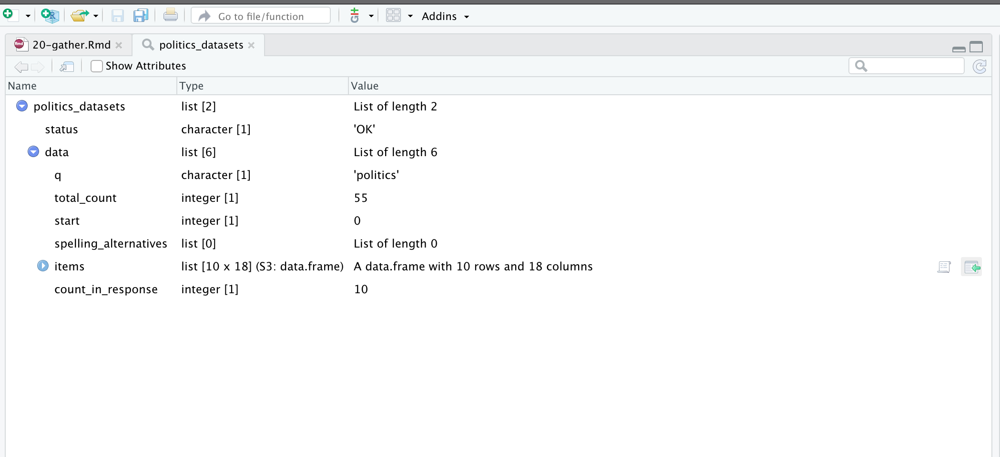
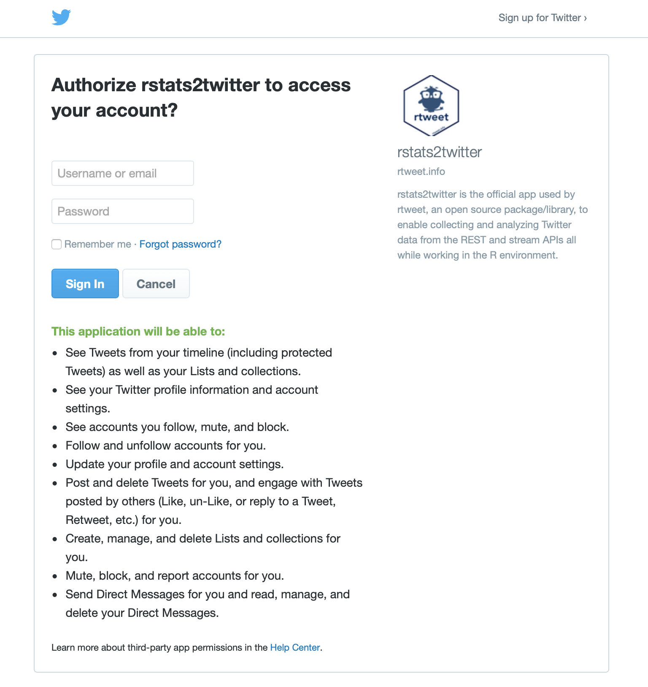
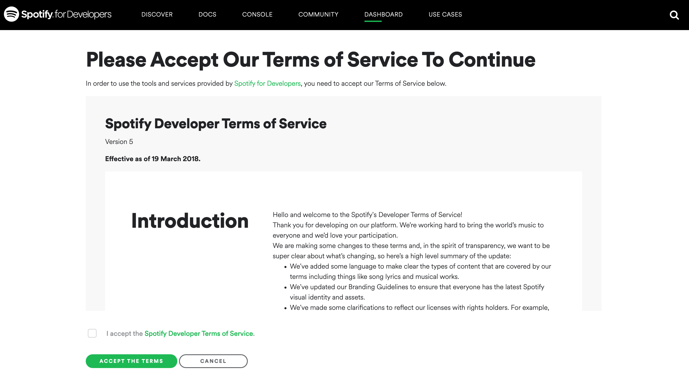
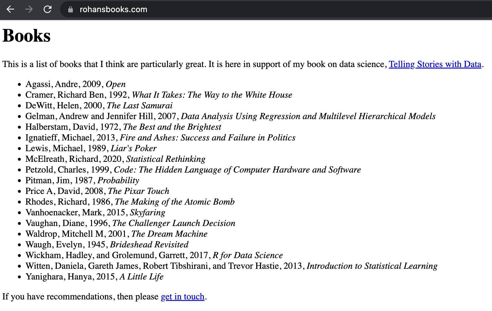
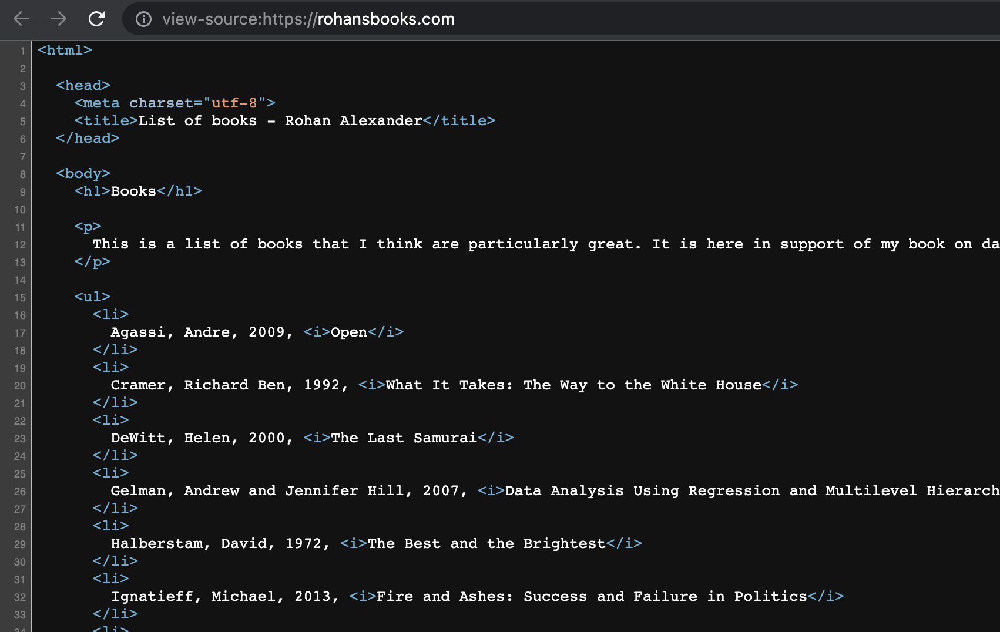
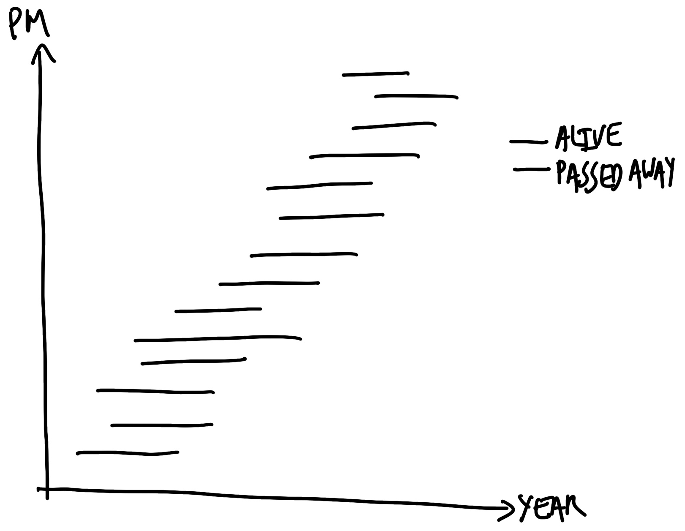
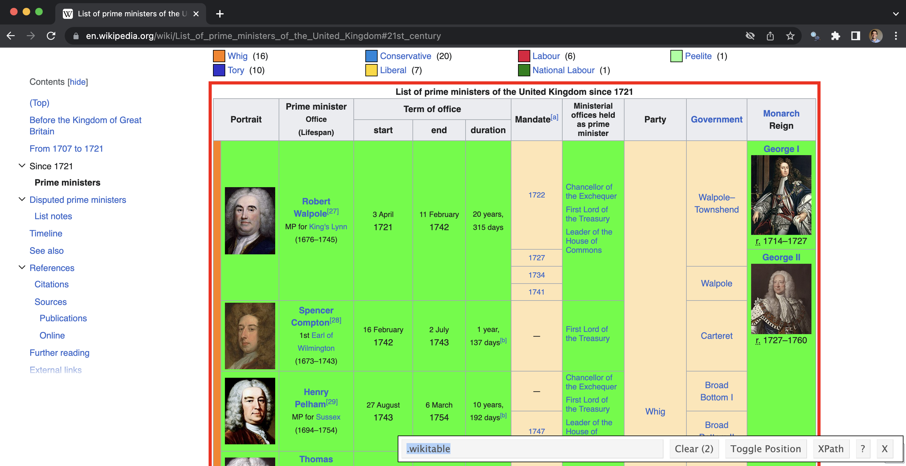

# API, 스크래핑, 파싱 {#sec-gather-data}

:::{.callout-note}

Chapman and Hall/CRC에서 2023년 7월에 이 책을 출판했습니다. [여기](https://www.routledge.com/Telling-Stories-with-Data-With-Applications-in-R/Alexander/p/book/9781032134772)에서 구매할 수 있습니다. 이 온라인 버전은 인쇄된 내용에서 일부 업데이트되었습니다.

:::

**선수 지식**

- @cirone, "Turning History into Data: Data Collection, Measurement, and Inference at the HPE" 읽기
  - 데이터셋 생성 과정에서 마주하게 되는 여러 실무적 어려움을 다룹니다.
- @Johnson2021Two, "Two Regimes of Box-Score Data Collection" 읽기
  - 서로 다른 두 시대의 NBA 박스 스코어(기록지) 데이터 수집 방식을 비교 분석합니다.
- @crawford, "The Atlas of AI" 읽기
  - 특히 3장 "데이터"를 중심으로 데이터 출처(Provenance)를 이해하는 것이 왜 중요한지 살펴봅니다.

**핵심 개념 및 기술**

- 분석에 필요한 데이터가 존재하더라도, 처음부터 분석용 데이터셋 형태로 제공되지 않는 경우가 많습니다. 우리는 이러한 데이터를 직접 찾아서 '수집'해야 합니다.
- 비정형 데이터 소스에서 얻은 데이터를 정리하고 준비하는 과정은 번거롭고 시간이 많이 걸릴 수 있습니다. 하지만 그렇게 얻은 구조화된 정돈된 데이터(Tidy data)는 종종 매우 흥미롭고 유용한 통찰을 제공합니다.
- 우리는 API(직접 요청하거나 R 패키지를 통한 간접 방식)를 사용해 반정형 데이터를 가져올 수 있습니다. 또한 합리적이고 윤리적인 원칙을 지키며 웹 스크래핑을 수행하거나, PDF 문서에 담긴 데이터를 추출할 수도 있습니다.

**소프트웨어 및 패키지**

- Base `R` [@citeR]
- `babynames` [@citebabynames]
- `gh` [@gh]
- `here` [@here]
- `httr` [@citehttr]
- `janitor` [@janitor]
- `jsonlite` [@jsonlite]
- `lubridate` [@GrolemundWickham2011]
- `pdftools` [@pdftools]
- `purrr` [@citepurrr]
- `rvest` [@citervest]
- `spotifyr` [@spotifyr ] (이 패키지는 CRAN에 없으므로 `install.packages("devtools")` 후 `devtools::install_github("charlie86/spotifyr")`로 설치하세요)
- `tesseract` [@citetesseract]
- `tidyverse` [@tidyverse]
- `tinytable` [@tinytable]
- `usethis` [@usethis]
- `xml2` [@xml2]

```{r}
#| message: false
#| warning: false

library(babynames)
library(gh)
library(here)
library(httr)
library(janitor)
library(jsonlite)
library(lubridate)
library(pdftools)
library(purrr)
library(rvest)
library(spotifyr)
# library(tesseract)
library(tidyverse)
library(tinytable)
library(usethis)
library(xml2)

```

## 서론

이 장에서는 우리가 직접 발로 뛰어 수집해야 하는 데이터를 다룹니다. 이는 분석에 필요한 관측치가 세상 어딘가에 존재하긴 하지만, 이를 활용 가능한 데이터셋으로 바꾸려면 직접 데이터를 가져와 파싱(Parsing)하고, 정리 및 정제(Wrangling)하는 과정이 필요함을 의미합니다. @sec-farm-data 에서 다룬 '경작 데이터(Farmed Data)'와 달리, 이러한 데이터는 대개 분석을 목적으로 공개된 것이 아닙니다. 따라서 문서화, 표본의 포함 및 제외 결정, 결측 데이터 처리, 그리고 무엇보다 '윤리적 수집'에 각별한 주의를 기울여야 합니다.

이러한 수집 데이터의 예로, @Cummins2022 는 1892년부터 1992년까지 영국의 유언 검인 기록을 직접 파싱하여 새로운 데이터셋을 구축했습니다. 이를 통해 그들은 상류층 상속의 약 3분의 1이 교묘하게 은폐되어 왔음을 밝혀냈습니다.\index{England!inheritance} 또한 @Taflaga2019 는 호주 장관들의 전화번호부를 바탕으로 직무 책임에 관한 체계적인 데이터셋을 만들었으며, 그 과정에서 성별에 따른 뚜렷한 차이를 발견했습니다. 유언장이나 전화번호부 모두 처음부터 데이터 분석을 위해 만들어진 것은 아닙니다. 하지만 연구자가 존중하는 태도로 데이터에 접근한다면, 다른 방법으로는 결코 얻을 수 없는 깊은 통찰을 얻을 수 있습니다. 이것이 바로 우리가 "데이터 수집(Data Gathering)"이라 부르는 과정입니다.

프로젝트를 시작할 때는 팀이 지향해야 할 가치를 먼저 정해야 합니다. 예를 들어, **Hugging Face**\index{ethics!values}는 투명성, 재현성, 공정성, 자기 비판, 공로 인정 등을 핵심 가치로 둡니다 [@huggingfaceethics]. '공로 인정'을 중시한다면 출처(Attribution) 표기와 라이선스 준수에 더욱 완벽을 기해야 합니다. 특히 우리가 직접 수집한 원본 데이터는 우리의 소유가 아닐 가능성이 크므로, 이를 다룰 때 더욱 신중해야 합니다.

데이터 과학 워크플로의 결과물은 결코 입력 데이터의 품질을 넘어설 수 없습니다 [@bailey2008design]. 아무리 화려하고 정교한 통계 분석 기법을 쓰더라도, 애당초 잘못 수집된 데이터를 사후에 수습하기란 불가능에 가깝습니다. 따라서 팀 프로젝트에서 데이터 수집 단계는 반드시 선임 분석가가 직접 감독하거나 수행해야 할 만큼 중요합니다. 혼자 작업할 때도 이 단계에 가장 많은 정성과 주의를 쏟으시기 바랍니다.

이 장에서는 데이터를 수집하는 다양한 경로를 소개합니다. 가장 먼저 API와 JSON, XML 같은 반정형 데이터 형식을 살펴봅니다. API를 사용한다는 것은 데이터 제공자가 정해놓은 규칙에 따라 정중하게 데이터를 요청하는 것과 같습니다. API를 활용하면 수집 과정을 자동화하고 대규모로 확장할 수 있어 매우 효율적입니다. 실제 사례로 @facebookapitrump 는 페이스북의 정치 광고 API를 활용해 2020년 트럼프 대선 캠페인 광고 약 22만 개를 수집하여 분석한 바 있습니다.

다음으로 웹 스크래핑(Web Scraping)을 다룹니다. 웹사이트에 가치 있는 정보가 시각적으로는 보이지만, 편리한 API가 제공되지 않을 때 사용하는 최후의 수단입니다. 스크래핑은 웹 서버에 부담을 줄 수 있으므로 명확한 윤리 원칙 하에 수행되어야 합니다. 팬데믹 초기, 수많은 코로나19 대시보드들이 웹 스크래핑을 통해 실시간 데이터를 수집하며 방역에 기여했던 사례가 대표적입니다 [@scrapecoviddata].

마지막으로 PDF 문서에서 데이터를 추출하는 방법을 알아봅니다. 정부 보고서나 오래된 고서에 잠들어 있는 귀중한 데이터들을 깨우는 작업입니다. 많은 국가에서 정보공개법에 따라 데이터를 공개하고 있지만, 정작 데이터가 CSV 형식이 아닌 PDF로 제공되는 경우가 많아 데이터 과학자에게는 필수적인 기술입니다.

직접 데이터를 수집하는 과정은 이미 잘 차려진 밥상인 '경작 데이터'를 쓰는 것보다 훨씬 힘들고 고된 작업입니다. 하지만 이 과정을 마스터하면 다른 누구도 던지지 못한 질문에 답할 수 있는 독보적인 데이터셋을 갖게 될 것입니다.

## API

일상적인 대화에서, 그리고 이 책의 목적상 **API(Application Programming Interface)**\index{API}란 누군가가 자신의 컴퓨터(서버)에 특정 파일을 설정해 두고, 우리가 그들이 정한 지침(Protocol)을 따라 데이터를 가져올 수 있게 만든 통로를 의미합니다. 예를 들어, 슬랙(Slack)에서 고양이 GIF를 검색해 올린다고 해봅시다. 이때 슬랙은 백그라운드에서 Giphy 서버에 적절한 이미지를 요청하고, Giphy 서버는 요청에 맞는 GIF를 슬랙에 보내주며, 슬랙은 이를 채팅창에 띄워줍니다. 슬랙과 Giphy가 정보를 주고받는 이 구체적인 규칙이 바로 Giphy의 API입니다. 기술적으로 더 엄밀하게 말하면, API는 우리가 HTTP 프로토콜을 이용해 특정 서버의 애플리케이션에 접근하여 데이터를 요청하고 받는 규약을 뜻합니다.

우리는 데이터 수집을 위한 API 활용에 집중할 것입니다. 이 맥락에서 API는 사람이 아닌 '다른 컴퓨터'가 데이터를 쉽게 가져갈 수 있도록 설계된 웹사이트라고 이해하면 쉽습니다. 예를 들어, 브라우저를 켜고 [Google Maps](https://www.google.com/maps)\index{Google!Maps}에 직접 접속해 호주 캔버라 지도를 검색할 수 있습니다. 하지만 브라우저에서 일일이 클릭하는 대신, [이 링크](https://www.google.com/maps/@-35.2812958,149.1248113,16z)와 같은 특정 URL을 서버에 '요청(Request)'하면 그에 맞는 지도 데이터를 '응답(Response)'으로 돌려받을 수 있습니다. 이것이 바로 API의 작동 방식입니다.

API의 가장 큰 장점은 데이터 제공자가 공개할 데이터의 범위와 사용 조건을 미리 명시해 두었다는 점입니다. 여기에는 **속도 제한(Rate Limit)**(예: "1분에 100번만 요청 가능")이나 데이터 활용 방식(예: "상업적 재배포 금지") 등이 포함됩니다. 정해진 통로를 통해 데이터를 가져오므로, 갑작스러운 웹사이트 구조 변경이나 법적 문제로부터 비교적 자유롭습니다. 따라서 데이터를 수집할 때 API가 존재한다면 웹 스크래핑보다 API를 쓰는 것이 훨씬 현명한 선택입니다.

이제 실제 API 활용 사례를 살펴보겠습니다. 먼저 `httr` 패키지를 사용해 API에 직접 요청을 보내는 방법을 배우고, 그다음 `spotifyr` 패키지처럼 API를 더 쓰기 쉽게 감싼 도구를 활용하는 법을 익힐 것입니다.

### arXiv, NASA, Dataverse

`httr` 패키지를 로드한 뒤 `GET()` 함수를 사용해 API에 데이터를 요청해 봅시다. 이 함수의 핵심 인자는 데이터를 가져올 주소인 `url`입니다. 앞서 구글 맵 사례에서 URL을 통해 특정 위경도의 지도를 가져왔던 것과 같은 논리입니다.

#### arXiv

첫 번째 사례로 학술 논문의 온라인 저장소인 [arXiv API](https://arxiv.org/help/api/)\index{API!arXiv}\index{arXiv}를 사용해 보겠습니다. arXiv에는 아직 저널의 심사를 거치기 전의 논문들이 '프리프린트(Preprint)' 형태로 업로드됩니다. 특정 논문의 정보를 가져오기 위해 다음과 같이 `GET()` 함수에 URL을 전달합니다.

```{r}
#| message: false
#| warning: false
#| eval: false

arxiv <- GET("http://export.arxiv.org/api/query?id_list=2310.01402")

status_code(arxiv)

```

응답 결과는 `status_code()` 함수로 확인할 수 있습니다. 예를 들어, **200**이라면 성공을 의미하고, **404**는 페이지를 찾을 수 없음, **400**대는 보통 클라이언트(사용자) 측의 요청 오류를 뜻합니다. 성공적으로 데이터를 받았다면 `content()` 함수로 내용을 확인합니다.

arXiv API는 **XML** 형식의 데이터를 반환합니다. XML은 항목들이 태그(Tag)로 구분되며, 태그 안에 다른 태그가 중첩될 수 있는 마크업 언어입니다 \index{XML}. 이를 리스트나 데이터프레임 구조로 읽으려면 `xml2` 패키지의 `read_xml()`을 사용합니다. XML은 반정형(Semi-structured) 구조이므로, 본격적으로 파싱하기 전에 `html_structure()`로 전체적인 트리를 한눈에 살펴보는 것이 좋습니다.

:::{.content-visible when-format="pdf"}

```{r}
#| eval: false
#| echo: true

content(arxiv) |>
  read_xml() |>
  html_structure()

```
:::

:::{.content-visible unless-format="pdf"}

```{r}
#| eval: false

content(arxiv) |>
  read_xml() |>
  html_structure()

```
:::

이 XML 트리에서 우리가 필요한 부분만 골라내어 데이터셋을 만들어 봅시다 \index{XML}. 예를 들어, 8번째 자식 노드인 "entry" 내에서 4번째 항목인 "title"과 9번째 항목인 "link"를 추출할 수 있습니다.

:::{.content-visible when-format="pdf"}

```{r}
#| eval: false
#| echo: true

data_from_arxiv <-
  tibble(
    title = content(arxiv) |>
      read_xml() |>
      xml_child(search = 8) |>
      xml_child(search = 4) |>
      xml_text(),
    link = content(arxiv) |>
      read_xml() |>
      xml_child(search = 8) |>
      xml_child(search = 9) |>
      xml_attr("href")
  )

```
:::

:::{.content-visible unless-format="pdf"}

```{r}
#| eval: false

data_from_arxiv <-
  tibble(
    title = content(arxiv) |>
      read_xml() |>
      xml_child(search = 8) |>
      xml_child(search = 4) |>
      xml_text(),
    link = content(arxiv) |>
      read_xml() |>
      xml_child(search = 8) |>
      xml_child(search = 9) |>
      xml_attr("href")
  )
data_from_arxiv

```
:::

#### NASA 오늘의 천문학 사진

또 다른 예로, NASA는 매일 [APOD API](https://api.nasa.gov)를 통해 오늘의 천문학 사진(APOD)을 제공합니다.\index{API!APOD}\index{astronomy} `GET()`을 사용하여 특정 날짜의 사진 URL을 얻은 다음 표시할 수 있습니다.

```{r}

NASA_APOD_20190719 <-
  GET("https://api.nasa.gov/planetary/apod?api_key=DEMO_KEY&date=2019-07-19")

```

`content()`를 사용하여 반환된 데이터를 검사하면 날짜, 제목, 설명 및 URL과 같은 다양한 필드가 제공됨을 알 수 있습니다.

:::{.content-visible when-format="pdf"}

공간상의 이유로 여기서는 출력이 생략되었지만, 이 [책](https://tellingstorieswithdata.com)의 무료 온라인 버전에서 볼 수 있습니다.

```{r}
#| eval: false
#| echo: true

# APOD 2019년 7월 19일
content(NASA_APOD_20190719)$date
content(NASA_APOD_20190719)$title
content(NASA_APOD_20190719)$explanation
content(NASA_APOD_20190719)$url

```

:::

:::{.content-visible unless-format="pdf"}

```{r}

# APOD 2019년 7월 19일
content(NASA_APOD_20190719)$date
content(NASA_APOD_20190719)$title
content(NASA_APOD_20190719)$explanation
content(NASA_APOD_20190719)$url

```

`knitr`의 `include_graphics()`에 해당 URL을 제공하여 표시할 수 있습니다(@fig-nasaone).

:::{#fig-nasaone}

{#fig-nasamoon}

NASA APOD API에서 얻은 이미지

:::
:::

#### Dataverse

마지막으로, API 응답으로 가장 널리 쓰이는 형식인 **JSON**을 살펴보겠습니다 \index{JSON}. JSON은 기계가 읽기 쉬우면서도 인간이 이해하기 좋게 만들어진 텍스트 데이터 저장 방식입니다. 우리가 익숙한 CSV(행과 열)와 달리, JSON은 **키-값(Key-Value)** 쌍으로 정보를 구성합니다.

```json
{
  "firstName": "Rohan",
  "lastName": "Alexander",
  "age": 36,
  "favFoods": {
    "first": "Pizza",
    "second": "Bagels",
    "third": null
  }
}
#| warning: false
#| eval: false
#| echo: true

politics_datasets <-
  fromJSON("https://demo.dataverse.org/api/search?q=politics")

```
:::

:::{.content-visible unless-format="pdf"}

```{r}
#| message: false
#| warning: false
#| eval: true
#| echo: true

복잡한 JSON 데이터는 `View()` 함수로 계층 구조를 확장해 가며 살펴보는 것이 좋습니다. RStudio의 `View()`창에서 요소 위에 마우스를 올리고 녹색 화살표 아이콘을 누르면, 해당 요소까지 도달하는 R 코드를 자동으로 생성해 줍니다 (@fig-jsonfirst).

{#fig-jsonfirst width=90% fig-align="center"}

이를 통해 관심 있는 데이터셋을 얻는 방법을 알 수 있습니다.

```{r}
#| eval: false
#| echo: true

as_tibble(politics_datasets[["data"]][["items"]])

```

<!-- ### 트위터에서 데이터 수집 -->

<!-- 트위터는 텍스트 및 기타 데이터의 풍부한 소스이며 엄청난 양의 학술 연구에서 사용됩니다[@twitterseemsokay]. 트위터 API는 트위터가 이러한 데이터를 수집하도록 요청하는 방식입니다. `rtweet`는 이 API를 중심으로 구축되었으며 다른 `R` 패키지를 사용하는 것과 유사한 방식으로 상호 작용할 수 있습니다. (또 다른 유용한 `R` 패키지는 `academictwitteR`[@academictwitteR]이며, 이는 전체 접근 권한이 있는 학술 트랙 API에서만 작동하지만 전체 아카이브 검색을 가능하게 합니다.) 처음에는 일반 트위터 계정으로 트위터 API를 사용할 수 있습니다. -->

<!-- `rtweet` 및 `tidyverse`를 설치하고 로드하는 것으로 시작합니다. 그런 다음 `rtweet`를 승인해야 하며, 예를 들어 사용자의 즐겨찾기를 반환하는 `get_favorites()`와 같은 패키지의 함수를 호출하여 이 프로세스를 시작합니다. 승인 전에 실행되면 브라우저가 열리고 일반 트위터 계정에 로그인합니다(@fig-rtweetlogin). -->

<!-- ```{r} -->
<!-- #| warning: false -->
<!-- #| message: false -->
<!-- #| label: loadpackages -->

<!-- library(rtweet) -->
<!-- library(tidyverse) -->
<!-- ``` -->

<!-- ```{r} -->
<!-- #| eval: false -->
<!-- #| label: initialise_rtweet -->

<!-- get_favorites(user = "RohanAlexander") -->
<!-- ``` -->

<!-- {#fig-rtweetlogin width=90% fig-align="center"} -->

<!-- 애플리케이션이 승인되면 `get_favorites()`를 사용하여 사용자의 즐겨찾기를 실제로 가져와 저장할 수 있습니다. -->

<!-- ```{r} -->
<!-- #| label: get_rohan_favs -->
<!-- #| eval: false -->

<!-- rohans_favorites <- get_favorites("RohanAlexander") -->

<!-- saveRDS(rohans_favorites, "rohans_favorites.rds") -->
<!-- ``` -->

<!-- ```{r} -->
<!-- #| label: get_rohan_favsactual -->
<!-- #| include: false -->
<!-- #| eval: false -->

<!-- # INTERNAL -->

<!-- rohans_favorites <- get_favorites("RohanAlexander") -->

<!-- saveRDS(rohans_favorites, "inputs/data/rohans_favs.rds") -->
<!-- ``` -->

<!-- ```{r} -->
<!-- #| include: false -->
<!-- rohans_favorites <- readRDS(here::here("inputs/data/rohans_favs.rds")) -->
<!-- ``` -->

<!-- 그런 다음 최근 즐겨찾기를 살펴볼 수 있습니다. 액세스 시점에 따라 다를 수 있다는 점을 염두에 두십시오. -->

<!-- ```{r} -->
<!-- #| label: look_at_rohans_favs -->

<!-- rohans_favorites |> -->
<!--   arrange(desc(created_at)) |> -->
<!--   slice(1:10) |> -->
<!--   select(screen_name, text) -->
<!-- ``` -->

<!-- `search_tweets()`를 사용하여 특정 주제에 대한 트윗을 검색할 수 있습니다. 예를 들어, R과 일반적으로 관련된 해시태그인 "#rstats"를 사용하는 트윗을 살펴볼 수 있습니다. -->

<!-- ```{r} -->
<!-- #| label: get_rstats -->
<!-- #| eval: false -->

<!-- rstats_tweets <- search_tweets( -->
<!--   q = "#rstats", -->
<!--   include_rts = FALSE -->
<!-- ) -->

<!-- saveRDS(rstats_tweets, "rstats_tweets.rds") -->
<!-- ``` -->

<!-- ```{r} -->
<!-- #| label: get_rstatsactual -->
<!-- #| include: false -->
<!-- #| eval: false -->

<!-- # INTERNAL -->

<!-- rstats_tweets <- search_tweets( -->
<!--   q = "#rstats", -->
<!--   include_rts = FALSE -->
<!-- ) -->

<!-- saveRDS(rstats_tweets, "inputs/data/rstats_tweets.rds") -->
<!-- ``` -->

<!-- ```{r} -->
<!-- #| include: false -->
<!-- rstats_tweets <- readRDS(here::here("inputs/data/rstats_tweets.rds")) -->
<!-- ``` -->

<!-- ```{r} -->
<!-- #| label: look_at_rstats -->

<!-- rstats_tweets |> -->
<!--   select(screen_name, text) |> -->
<!--   head() -->
<!-- ``` -->

<!-- 사용할 수 있는 다른 유용한 함수로는 사용자가 팔로우하는 모든 계정을 가져오는 `get_friends()`와 사용자의 최근 트윗을 가져오는 `get_timelines()`가 있습니다. 개발자로 등록하면 더 많은 트위터 API 기능에 접근할 수 있습니다. -->

<!-- API를 사용할 때, 심지어 `R` 패키지(이 경우 `rtweet`)로 래핑된 경우에도 접근이 제공되는 조건을 읽는 것이 중요합니다. 트위터 API 문서는 놀랍도록 읽기 쉬우며, [개발자 정책](https://developer.twitter.com/en/developer-terms/policy)은 특히 명확합니다. API 제공자가 데이터를 제공하는 조건을 위반하기가 얼마나 쉬운지 보려면, 우리가 다운로드한 트윗을 저장했다고 가정해 보십시오. 이것을 GitHub에 푸시하면 트윗에 민감한 정보가 포함되어 있었다면 실수로 저장했을 수 있습니다. 트위터는 또한 API를 사용하는 사람들에게 민감한 정보에 대해 특히 주의하고 트위터 사용자를 트위터 외부의 신원과 일치시키지 않도록 명시적으로 요청합니다. 다시 말하지만, [이러한 제한된 사용 사례에 대한 문서](https://developer.twitter.com/en/developer-terms/more-on-restricted-use-cases)는 명확하고 읽기 쉽습니다. -->

### Spotify

때로는 특정 API를 아주 쉽게 쓸 수 있도록 잘 만들어진 R 패키지가 존재합니다. 세계적인 음악 스트리밍 서비스인 스포티파이(Spotify)의 API를 R에서 편하게 다루게 해주는 `spotifyr` 패키지가 대표적입니다 \index{API!Spotify}\index{Spotify!API}. 이러한 패키지(래퍼, Wrapper)를 사용할 때도 제공 데이터의 활용 지침을 꼼꼼히 읽는 습관이 중요합니다.

스포티파이 API를 쓰려면 먼저 [Spotify for Developers](https://developer.spotify.com/dashboard/)\index{Spotify} 대시보드에서 계정을 생성해야 합니다. 로그인을 마친 뒤 개발자 약관에 동의하는 과정을 거칩니다 (@fig-spotifyaccept).

{#fig-spotifyaccept width=90% fig-align="center"}

가입 과정에서 프로젝트의 목적을 묻는데, 우리는 상업적 목적이 아니므로 비상업적(Non-commercial) 계약을 선택하면 됩니다. 등록을 마치면 가장 중요한 두 가지 정보인 **클라이언트 ID(Client ID)**와 **클라이언트 시크릿(Client Secret)**이 발급됩니다. 이 정보는 일종의 비밀번호이므로 절대로 타인에게 노출해서는 안 됩니다.

이러한 비밀 키를 코드에 직접 써넣지 않고 안전하게 관리하는 좋은 방법은 **시스템 환경 변수(System Environment)**에 보관하는 것입니다 \index{API!key storage}. 이렇게 하면 코드를 GitHub 등에 공유해도 키 정보가 유출되지 않습니다. `usethis` 패키지의 `edit_r_environ()` 함수를 사용하여 R의 환경 설정 파일인 `.Renviron`을 수정해 봅시다.

```{r}
#| eval: false

edit_r_environ()

```

`edit_r_environ()`을 실행하면 ".Renviron" 파일이 열리고 "Spotify Client ID"와 "Client Secret"을 추가할 수 있습니다. `.Renviron` 파일에 발급받은 키 정보를 아래와 같이 입력합니다. `spotifyr` 패키지가 정해진 이름의 변수를 찾아 읽어 가므로, 변수명을 정확히 똑같이 적는 것이 중요합니다. (주의: 여기서는 값 주위에 작은따옴표를 사용해야 합니다.)

```r
SPOTIFY_CLIENT_ID = '여러분의_클라이언트_ID를_여기에_입력하세요'
SPOTIFY_CLIENT_SECRET = '여러분의_클라이언트_시크릿을_여기에_입력하세요'
```

파일을 저장한 뒤 설정이 적용되도록 R을 다시 시작합니다 (**Session > Restart R**). 이제부터는 키 정보를 코드에 명시하지 않아도 패키지의 함수들이 자동으로 환경 변수에서 키를 읽어와 인증을 수행할 것입니다.

준비가 끝났으니 `spotifyr` 패키지를 이용해 영국 록 밴드 **라디오헤드(Radiohead)**의 정보를 가져와 봅시다. `get_artist_audio_features()` 함수는 아티스트의 모든 곡에 대한 음악적 특징을 데이터프레임 형태로 반환합니다.

```{r}
#| eval: false

radiohead <- get_artist_audio_features("radiohead")
saveRDS(radiohead, "radiohead.rds")

```

```{r}
#| include: false
#| eval: false

# INTERNAL

radiohead <- get_artist_audio_features("radiohead")
saveRDS(radiohead, "inputs/data/radiohead.rds")

```

```{r}
#| eval: true
#| include: false

radiohead <- readRDS("inputs/data/radiohead.rds")

```

```{r}
#| eval: false
#| include: true

radiohead <- readRDS("radiohead.rds")

```

수집된 데이터에는 노래마다 다양한 변수가 들어 있습니다. 예를 들어, 라디오헤드의 노래들이 시간이 지나면서 점점 길어지는 추세를 보이는지 궁금할 수 있습니다 (@fig-readioovertime). @sec-static-communication 에서 배운 시각화 원칙을 적용하여, 앨범별로 분포를 보여주는 박스 플롯(Boxplot)과 개별 곡을 나타내는 지터 플롯(Jitter plot)을 함께 그려보겠습니다.

```{r}
#| fig-cap: "Spotify에서 수집한 라디오헤드 각 노래의 길이, 시간 경과에 따라"
#| label: fig-readioovertime
#| message: false
#| warning: false

radiohead <- as_tibble(radiohead)

radiohead |>
  mutate(album_release_date = ymd(album_release_date)) |>
  ggplot(aes(
    x = album_release_date,
    y = duration_ms,
    group = album_release_date
  )) +
  geom_boxplot() +
  geom_jitter(alpha = 0.5, width = 0.3, height = 0) +
  theme_minimal() +
  labs(
    x = "앨범 발매일",
    y = "노래 길이 (ms)"
  )

```

스포티파이는 각 곡에 대해 **'Valence'**라는 흥미로운 변수를 제공합니다 \index{Spotify!valence}. 스포티파이 [문서](https://developer.spotify.com/documentation/web-api/reference/#/operations/get-audio-features)에 따르면, 이 값은 0에서 1 사이의 숫자로 음악의 '긍정성'을 나타냅니다. 값이 높을수록 밝고 행복한 느낌의 곡임을 뜻합니다. 라디오헤드, 미국의 인디 록 밴드 더 내셔널(The National), 그리고 팝스타 테일러 스위프트(Taylor Swift)의 음악이 시간에 따라 어떻게 변했는지 valence 값을 비교해 봅시다.

데이터 분석 결과에 따르면 테일러 스위프트와 라디오헤드는 오랜 활동 기간에도 불구하고 비교적 일관된 감성을 유지해 온 반면, 더 내셔널의 음악은 시간이 흐를수록 valence 값이 서서히 감소하는 경향을 보였습니다.

거의 비용을 들이지 않고 전 세계 음악 라이브러리에 접근해 이런 정교한 분석을 할 수 있다는 사실이 정말 놀랍지 않나요? @kaylinpavlik 은 이런 데이터를 활용해 음악 장르를 자동 분류하고, [@theeconomistonspotify]는 언어와 스트리밍 횟수 사이의 흥미로운 상관관계를 밝혀내기도 했습니다. 과거에는 엄청난 규모의 실험을 통해서나 겨우 얻을 수 있었던 통찰을, 이제는 단 몇 줄의 코드로 관측 데이터에서 뽑아낼 수 있게 되었습니다(예: @salganik2006experimental).

물론 주의할 점도 있습니다. 'Valence'라는 하나의 숫자가 복잡한 음악의 감성을 완벽히 요약할 수 있을까요? 스포티파이의 산출 공식은 비공개(Black box)이므로, 측정의 타당성에 항상 의문을 가져야 합니다. 또한 스포티파이에 등록되지 않은 수많은 아티스트의 목소리가 이 데이터에서는 누락되어 있다는 점도 잊지 말아야 합니다. 이는 앞서 배운 **측정과 표본 추출**의 문제가 우리가 다루는 모든 데이터에 깊숙이 스며들어 있음을 보여주는 아주 좋은 예입니다 \index{Spotify!measurement}.

## 웹 스크래핑

### 기본 원칙

**웹 스크래핑(Web Scraping)**이란 웹사이트에 게시된 정보를 자동으로 수집하는 기술을 말합니다 \index{web scraping}. 브라우저를 켜고 사람이 직접 데이터를 복사해 저장하는 대신, 코드를 이용해 이 과정을 자동화하는 것입니다. 스크래핑은 방대한 데이터를 다룰 수 있게 해주지만, 대개 웹사이트 운영자가 데이터 수집을 목적으로 페이지를 만든 것이 아니라는 점을 명심해야 합니다. 따라서 스크래핑을 할 때는 항상 **상호 존중의 태도**가 필요합니다. 스크래핑 행위 자체가 불법은 아닌 경우가 많지만, 상업적 경쟁이나 서비스 약관 위반 여부에 따라 법적·윤리적 문제가 발생할 수 있습니다 [@luscombe2021algorithmic].

특히 주의해야 할 지점은 개인 정보 보호입니다 \index{ethics!privacy vs reproducibility}. 웹사이트에 공개된 정보라고 해서, 이를 마음대로 긁어모아 새로운 데이터셋으로 배포해도 된다는 뜻은 아닙니다. 예를 들어, @kirkegaard2016okcupid 는 데이팅 앱인 OKCupid의 공개된 프로필 약 7만 개를 스크래핑하여 공개했다가 큰 윤리적 지탄을 받았습니다 [@hackett2016researchers]. @zimmer2018addressing 은 "피해 최소화"와 "정보에 입각한 동의"의 가치를 강조하며, 데이터가 공개된 '맥락'이 변경될 때 발생할 수 있는 위험을 경고합니다. 사용자가 특정 플랫폼에 올린 정보는 그 플랫폼 안에서만 쓰일 것을 전제로 한 것이지, 불특정 다수의 연구자가 분석하도록 허락한 것이 아닐 수 있기 때문입니다 \index{ethics!context specific}.

::: {.callout-note}

## "데이터가 있다"는 착각

경찰의 공권력 남용 문제는 사회적 신뢰와 직결된 민감한 사안입니다 \index{police violence!measurement of}. 하지만 이에 대한 공식적이고 정확한 정부 통계는 찾기가 매우 어렵습니다 [@bronnerpolicenordata]. 폭력적인 상황이 벌어진 맥락을 데이터셋으로 단순화하는 것이 조심스럽기 때문입니다. 현재 가장 널리 쓰이는 두 가지 경찰 폭력 데이터셋은 모두 웹 스크래핑을 통해 만들어졌습니다.

1) **Mapping Police Violence**
2) **The Fatal Force Database**

@Bor2018 은 이 데이터를 분석하여 비무장 흑인에 대한 경찰의 치명적 무력 사용이 흑인 공동체의 정신 건강에 심각한 악영향을 미친다는 사실을 밝혔습니다. 반면 @Nix2020 은 동일한 데이터를 재사용하면서도 데이터 코딩 방식(예: '장난감 총기를 든 경우를 무장으로 볼 것인가 말 것인가')에 따라 결론이 달라질 수 있음을 지적하며 신중한 접근을 당부했습니다. 이는 정성적인 맥락이 있는 사건을 정량적인 데이터셋으로 변환할 때 피할 수 없는 '단순화'의 문제입니다 [@washpostfatalforce; @washpostfatalforcemethods; @Comer2022].

:::

웹 스크래핑은 강력한 도구이지만, 웹 서버에 의도치 않은 부하를 줄 수 있습니다. 다음은 매너 있는 데이터 과학자가 지켜야 할 **스크래핑 7원칙**입니다 \index{web scraping!principles}.

1. **최후의 수단으로 활용하라**: 가능하다면 API를 먼저 쓰세요.
2. **주인의 요구(robots.txt)를 따르라**: 웹사이트 주소 뒤에 `/robots.txt`를 붙여보세요. `Disallow`에 적힌 폴더는 접근하지 말고, `Crawl-delay`가 있다면 그만큼 기다려야 합니다.
3. **서버에 미치는 영향을 최소화하라**: `Sys.sleep()`을 써서 요청 사이에 쉬는 시간을 두세요. 대량 수집이 필요하다면 사용자가 적은 밤 시간대에 천천히 진행하는 것이 좋습니다.
4. **필요한 것만 가져가라**: 위키피디아 전체를 긁지 말고 필요한 특정 페이지만 수집하세요.
5. **한 번만 긁어라**: 수집한 원본 데이터는 반드시 로컬에 저장해 두세요. 코드를 수정할 때마다 서버에 다시 요청하는 것은 낭비입니다.
6. **스크래핑한 페이지를 그대로 재배포하지 마라**: 원본 페이지 내용 전체를 공개하는 것은 저작권 위반 소지가 큽니다.
7. **책임감 있게 행동하라**: 스크래핑 스크립트의 사용자 에이전트(User-Agent)에 본인의 연락처를 남기거나, 대규모 수집 전에는 미리 허락을 구하는 것이 예의입니다.

### HTML/CSS 핵심 개념

웹 스크래핑은 웹페이지가 **HTML(HyperText Markup Language)**이라는 약속된 구조로 짜여 있다는 점을 이용합니다 \index{HTML!web scraping}. 우리가 원하는 데이터가 어떤 태그(Tag) 안에 숨어 있는지 찾으려면 브라우저에서 '검사(Inspect)' 기능을 활용하거나 페이지 소스를 직접 확인해야 합니다.

HTML은 꺾쇠괄호(`<>`)로 감싸진 태그들이 중첩된 구조를 가집니다. 예를 들어 텍스트를 굵게 하려면 다음과 같이 씁니다.

```html
<b>이 글자는 굵게 표시됩니다.</b>
```

또는 목록을 만들 때는 다음과 같이 씁니다.

```html
<ul>
  <li>첫 번째 항목</li>
  <li>두 번째 항목</li>
  <li>세 번째 항목</li>
</ul>
```

스크래핑 코드의 핵심은 바로 이 태그(`<b>`, `<li>` 등)를 찾아내어 그 안의 알맹이(텍스트)만 쏙 뽑아내는 것입니다.

가장 대중적인 R 패키지인 `rvest`를 사용해 봅시다. `rvest`는 태그 정보를 '노드(Node)'라고 부릅니다. `read_html()`로 웹페이지를 읽어들인 뒤, `html_elements()`로 특정 태그를 찾고, `html_text()`로 텍스트를 추출하는 것이 기본 흐름입니다.

스크래핑은 한 페이지에서 끝나는 경우가 드뭅니다. 보통 전체 목록을 먼저 가져오는 **인덱스 스크래핑(Index scraping)**과, 목록의 개별 링크를 따라가 상세 내용을 담는 **콘텐츠 스크래핑(Content scraping)**의 두 단계로 진행됩니다. 대규모 스크래핑이 필요하다면 서버에 예의를 갖추는 `polite` 패키지를 활용하거나, GitHub Actions로 자동화하는 방법도 고려해 볼 수 있습니다 [@luscombe2022jumpstarting; @polite].

```{r}
#| eval: true
#| echo: true

website_extract <- "<p>안녕하세요, 저는 <b>로한</b> 알렉산더입니다.</p>"

```

`rvest`는 `tidyverse`의 일부이므로 설치할 필요는 없지만, 핵심 부분은 아니므로 로드해야 합니다. 그 후 `read_html()`을 사용하여 데이터를 읽어들입니다.

```{r}
#| eval: true
#| echo: true
#| warning: false
#| message: false

rohans_data <- read_html(website_extract)

rohans_data

```

`rvest`가 태그를 찾는 데 사용하는 언어는 "node"이므로 굵은 노드에 집중합니다. 기본적으로 `html_elements()`는 태그도 반환합니다. `html_text()`로 텍스트를 추출합니다.

```{r}
#| eval: true
#| echo: true

rohans_data |>
  html_elements("b")

rohans_data |>
  html_elements("b") |>
  html_text()

```

웹 스크래핑은 흥미로운 데이터 소스이며, 이제 몇 가지 예시를 살펴보겠습니다. 그러나 이러한 예시와 달리 정보는 일반적으로 한 페이지에 모두 있지 않습니다. 웹 스크래핑은 연습이 필요한 어려운 예술 형식으로 빠르게 변합니다. 예를 들어, 인덱스 스크래핑과 콘텐츠 스크래핑을 구별합니다. 전자는 원하는 콘텐츠가 있는 URL 목록을 구축하기 위한 스크래핑이고, 후자는 해당 URL에서 콘텐츠를 가져오기 위한 스크래핑입니다. @luscombe2022jumpstarting 예시를 제공합니다. 웹 스크래핑을 많이 하게 된다면 `polite`[@polite]가 워크플로를 더 잘 최적화하는 데 도움이 될 수 있습니다. 그리고 GitHub Actions를 사용하여 시간이 지남에 따라 더 크고 느린 스크래핑을 허용할 수 있습니다.

### 사례 연구: 도서 정보 수집

이번 실습에서는 [Rohan's Books](https://rohansbooks.com) 웹사이트에 게시된 도서 목록을 스크래핑해 보겠습니다. 수집한 데이터를 정리하여, 저자 성(Last name)의 첫 글자가 어떻게 분포되어 있는지 시각화하는 것이 목표입니다. 앞서 배운 예제보다 조금 더 복잡하지만, 전체적인 워크플로는 동일합니다. **웹사이트 다운로드 $\rightarrow$ 관심 노드 찾기 $\rightarrow$ 정보 추출 $\rightarrow$ 데이터 정제** 순서로 진행합니다 \index{web scraping!books example}.

먼저 `rvest` 패키지로 웹사이트를 불러오고, `tidyverse`를 이용해 데이터를 가공하겠습니다. 스크래핑을 할 때는 웹사이트에 계속 접근하는 대신, 웹페이지의 로컬 복사본을 만들어 두고 작업하는 것이 서버에 대한 예의입니다.

```{r}
#| include: false
#| eval: false
#| echo: true

# INTERNAL

books_data <- read_html("https://rohansbooks.com")

write_html(books_data, "inputs/my_website/raw_data.html")

```

```{r}
#| echo: true
#| eval: false
#| include: true

books_data <- read_html("https://rohansbooks.com")

write_html(books_data, "raw_data.html")

```

이제 저장된 HTML 파일에서 원하는 정보를 뽑아낼 차례입니다 \index{web scraping!HTML}. 추출한 데이터는 가능한 한 빨리 **티블(tibble)** 형태로 변환하는 것이 좋습니다. 그래야 `dplyr` 같은 `tidyverse`의 강력한 도구들을 즉시 활용할 수 있기 때문입니다.

:::{.content-visible when-format="pdf"}

익숙하지 않다면 ["R 필수 사항"](https://tellingstorieswithdata.com/20-r_essentials.html)을 참조하십시오.

:::

:::{.content-visible unless-format="pdf"}

익숙하지 않다면 [온라인 부록 -@sec-r-essentials]을 참조하십시오.

:::

```{r}
#| eval: false
#| echo: true
#| include: true
#| message: false
#| warning: false

books_data <- read_html("raw_data.html")

```

```{r}
#| eval: true
#| echo: false
#| include: true
#| message: false
#| warning: false

books_data <- read_html("inputs/my_website/raw_data.html")

```

```{r}
#| eval: true
#| include: true
#| message: false
#| warning: false
#| echo: true

books_data

```

HTML 태그를 분석하여 우리가 원하는 데이터가 어디에 있는지 확인해 봅시다. 웹사이트 화면을 보면 도서 제목과 저자가 목록 형태로 나열되어 있고 (@fig-rohansbooks-display), 소스 코드를 확인하면 이 내용들이 특정 목록 태그 안에 담겨 있음을 알 수 있습니다 (@fig-rohansbooks-html).

:::{#fig-rohansbooks layout-ncol=2}

{#fig-rohansbooks-display width=50%}

{#fig-rohansbooks-html width=50%}

2022년 6월 16일 기준 도서 웹사이트의 화면 캡처

:::

목록 항목을 뜻하는 태그는 `<li>`입니다. 이를 이용해 도서 정보만 골라내 보겠습니다.

```{r}
#| eval: true
#| include: true
#| echo: true

text_data <-
  books_data |>
  html_elements("li") |>
  html_text()

all_books <-
  tibble(books = text_data)

head(all_books)

```

이제 수집된 날것의 데이터를 분석하기 좋게 다듬어야 합니다. 먼저 `separate()` 함수를 사용해 한 덩어리로 되어 있는 제목, 저자, 발표 연도를 각각의 열로 분리하겠습니다. 연도 정보를 기준으로 텍스트를 나누면 편리합니다.

```{r}
#| eval: true
#| include: true
#| message: false
#| warning: false
#| echo: true

all_books <-
  all_books |>
  mutate(books = str_squish(books)) |>
  separate(books, into = c("author", "title"), sep = "\\, [[:digit:]]{4}\\, ")

head(all_books)

```

마지막으로, 예를 들어 이름의 첫 글자 분포에 대한 표를 만들 수 있습니다(@tbl-lettersofbooks).

```{r}
#| label: tbl-lettersofbooks
#| eval: true
#| echo: true
#| tbl-cap: "도서 컬렉션에서 저자 이름의 첫 글자 분포"

all_books |>
  mutate(
    first_letter = str_sub(author, 1, 1)
  ) |>
  count(.by = first_letter) |>
  tt() |>
  style_tt(j = 1:2, align = "lr") |>
  format_tt(digits = 0, num_mark_big = ",", num_fmt = "decimal") |>
  setNames(c("첫 글자", "횟수"))

```

### 영국 총리

이 사례 연구에서는 영국 총리\index{United Kingdom!prime ministers}가 태어난 해를 기준으로 얼마나 오래 살았는지에 관심이 있습니다. `rvest`를 사용하여 위키피디아\index{web scraping!Wikipedia}에서 데이터를 스크래핑하고, 정리한 다음 그래프를 만들 것입니다.\index{Wikipedia!web scraping}\index{Wikipedia!UK prime ministers} 때때로 웹사이트가 변경됩니다. 이로 인해 많은 스크래핑이 대부분 맞춤형이 되지만, 이전 프로젝트의 일부 코드를 빌릴 수는 있습니다. 때때로 좌절감을 느끼는 것은 정상입니다. 끝을 염두에 두고 시작하는 것이 도움이 됩니다.

이를 위해 먼저 시뮬레이션된 데이터를 생성할 수 있습니다.\index{simulation!UK prime ministers} 이상적으로는 각 총리에 대한 행, 이름에 대한 열, 출생 및 사망 연도에 대한 열이 있는 표를 원합니다. 아직 살아 있다면 사망 연도는 비어 있을 수 있습니다. 출생 및 사망 연도는 1700년에서 1990년 사이여야 하며, 사망 연도는 출생 연도보다 커야 한다는 것을 알고 있습니다. 마지막으로, 연도는 정수여야 하고 이름은 문자여야 한다는 것도 알고 있습니다. 대략 다음과 같이 생긴 것을 원합니다.

```{r}
#| echo: true
#| message: false
#| warning: false

set.seed(853)

simulated_dataset <-
  tibble(
    prime_minister = babynames |>
      filter(prop > 0.01) |>
      distinct(name) |>
      unlist() |>
      sample(size = 10, replace = FALSE),
    birth_year = sample(1700:1990, size = 10, replace = TRUE),
    years_lived = sample(50:100, size = 10, replace = TRUE),
    death_year = birth_year + years_lived
  ) |>
  select(prime_minister, birth_year, death_year, years_lived) |>
  arrange(birth_year)

simulated_dataset

```

시뮬레이션된 데이터셋을 생성하는 장점 중 하나는 그룹으로 작업하는 경우 한 사람이 시뮬레이션된 데이터셋을 사용하여 그래프를 만들기 시작할 수 있고, 다른 사람은 데이터를 수집할 수 있다는 것입니다. 그래프 측면에서 우리는 [@fig-pmsgraphexample]과 같은 것을 목표로 합니다.

{#fig-pmsgraphexample width=75% fig-align="center"}

우리는 영국 총리가 얼마나 오래 살았는지에 대한 흥미로운 질문으로 시작합니다. 따라서 데이터 소스를 식별해야 합니다. 각 총리의 출생 및 사망 정보를 가진 데이터 소스는 많지만, 우리는 신뢰할 수 있는 것을 원하며, 스크래핑할 것이므로 어느 정도 구조가 있는 것을 원합니다. [영국 총리에 대한 위키피디아 페이지](https://en.wikipedia.org/wiki/List_of_prime_ministers_of_the_United_Kingdom)는 이 두 가지 기준을 모두 충족합니다. 인기 있는 페이지이므로 정보가 정확할 가능성이 높고, 데이터는 표 형식으로 제공됩니다.

`rvest`를 로드한 다음 `read_html()`을 사용하여 페이지를 다운로드합니다. 로컬에 저장하면 웹사이트가 변경될 경우 재현성을 위해 필요한 사본을 제공하고, 웹사이트를 계속 방문할 필요가 없습니다. 그러나 우리의 것이 아니므로 일반적으로 공개적으로 재배포해서는 안 됩니다.

```{r}
#| echo: true
#| eval: false
#| include: false

# INTERNAL

raw_data <-
  read_html(
    "https://en.wikipedia.org/wiki/List_of_prime_ministers_of_the_United_Kingdom"
  )
write_html(raw_data, "inputs/wiki/pms.html") # 파일을 HTML 파일로 저장합니다.

```

```{r}
#| echo: true
#| eval: false
#| include: true

raw_data <-
  read_html(
    "https://en.wikipedia.org/wiki/List_of_prime_ministers_of_the_United_Kingdom"
  )
write_html(raw_data, "pms.html")

```

이전 사례 연구와 마찬가지로, 우리는 원하는 데이터의 규칙성을 찾기 위해 HTML 구조를 분석해야 합니다. 스크래핑은 한 번에 성공하기 어려운 반복적인 과정이며, 많은 시행착오가 따릅니다. 아주 간단한 페이지라 하더라도 데이터를 완벽하게 파싱하는 데는 꽤 많은 시간이 걸릴 수 있습니다.

이때 큰 도움이 되는 도구가 바로 **SelectorGadget**입니다. 브라우저에서 원하는 요소를 마우스로 클릭하기만 하면, `html_element()` 함수에 넣을 수 있는 적절한 CSS 선택자(Selector)를 찾아줍니다 (@fig-selectorgadget). 물론 원하는 정보의 위치를 지정하는 방법이 CSS 선택자만 있는 것은 아닙니다. 상황에 따라 **XPath**\index{web scraping!SelectorGadget}와 같은 대안을 쓰는 것이 더 효율적일 수도 있습니다.

{#fig-selectorgadget width=75% fig-align="center"}

```{r}
#| eval: false
#| include: true

raw_data <- read_html("pms.html")

```

```{r}
#| eval: true
#| include: false

raw_data <- read_html("inputs/wiki/pms.html")

raw_data

```

```{r}
#| eval: true
#| include: true

parse_data_selector_gadget <-
  raw_data |>
  html_element(".wikitable") |>
  html_table()

head(parse_data_selector_gadget)

```

위키피디아의 표 데이터를 `html_table()`로 가져오면, 대개 불필요한 열이나 중복된 행이 포함되어 있습니다.

```{r}
#| eval: true
#| include: true

parsed_data <-
  parse_data_selector_gadget |>
  clean_names() |>
  rename(raw_text = prime_minister_office_lifespan) |>
  select(raw_text) |>
  filter(raw_text != "Prime ministerOffice(Lifespan)") |>
  distinct()

head(parsed_data)

```

이제 추출된 텍스트를 이름, 출생 연도, 사망 연도 열로 깔끔하게 나눠보겠습니다. 도서 목록 사례에서는 고정된 구분자를 썼다면, 이번에는 조금 더 강력한 도구인 **정규 표현식(Regular Expression, Regex)**을 활용합니다. 괄호 안에 숫자가 들어있는 패턴(`[[:digit:]]{4}`) 등을 찾아 텍스트를 분리하거나 필요한 부분만 골라내는 방식입니다.

```{r}
#| eval: true
#| include: true

initial_clean <-
  parsed_data |>
  separate(
    raw_text, into = c("name", "not_name"), sep = "\\[", extra = "merge",
  ) |>
  mutate(date = str_extract(not_name, "[[:digit:]]{4}–[[:digit:]]{4}"),
         born = str_extract(not_name, "born[[:space:]][[:digit:]]{4}")
         ) |>
  select(name, date, born)

head(initial_clean)

```

마지막으로 열을 정리해야 합니다.

```{r}
#| message: false
#| warning: false

cleaned_data <-
  initial_clean |>
  separate(date, into = c("birth", "died"),
           sep = "–") |>   # 사망한 총리는 출생 및 사망 연도가 하이픈으로 구분되지만, 하이픈이 약간 이상한 유형이므로 복사/붙여넣기해야 합니다.
  mutate(
    born = str_remove_all(born, "born[[:space:]]"),
    birth = if_else(!is.na(born), born, birth)
  ) |> # 살아있는 총리는 형식이 약간 다릅니다.
  select(-born) |>
  rename(born = birth) |>
  mutate(across(c(born, died), as.integer)) |>
  mutate(Age_at_Death = died - born) |>
  distinct() # 일부 총리는 두 번 시도했습니다.

head(cleaned_data)

```

마침내 우리가 처음에 구상했던 것과 비슷한 형태의 깔끔한 데이터셋이 완성되었습니다 (@tbl-canadianpmscleanddata).

```{r}
#| echo: true
#| eval: true
#| label: tbl-canadianpmscleanddata
#| tbl-cap: "영국 총리, 사망 시 나이별"

cleaned_data |>
  head() |>
  tt() |>
  style_tt(j = 1:4, align = "lrrr") |>
  setNames(c("총리", "출생 연도", "사망 연도", "사망 시 나이"))

```

이제 이 데이터를 바탕으로 각 총리의 생애 주기를 보여주는 그래프를 그려봅시다 (@fig-pmslives). 여전히 생존 중인 총리의 경우 바(bar)가 현재 시점까지 이어지도록 하되, 색상을 다르게 표시하여 구분하겠습니다.

```{r}
#| echo: true
#| fig-height: 8
#| fig-cap: "영국 총리가 얼마나 오래 살았는지"
#| label: fig-pmslives

cleaned_data |>
  mutate(
    still_alive = if_else(is.na(died), "Yes", "No"),
    died = if_else(is.na(died), as.integer(2023), died)
  ) |>
  mutate(name = as_factor(name)) |>
  ggplot(
    aes(x = born, xend = died, y = name, yend = name, color = still_alive)
    ) +
  geom_segment() +
  labs(
    x = "출생 연도", y = "총리", color = "총리는 현재 살아있음"
    ) +
  theme_minimal() +
  scale_color_brewer(palette = "Set1") +
  theme(legend.position = "bottom")

```

### 수집 과정의 자동화 (Iteration)

텍스트를 분석 가능한 데이터로 취급하는 것은 매우 흥미로운 일이며, 이를 통해 수많은 연구 질문에 답할 수 있습니다 \index{text!gathering}. @sec-text-as-data 에서 이를 본격적으로 다룰 것입니다. 대개의 가이드북은 이미 깔끔하게 정돈된 텍스트 데이터셋이 있다고 가정하지만, 현실은 그렇지 않습니다. 이번 사례 연구에서는 여러 페이지를 돌아다니며 여러 개의 파일을 자동으로 다운로드하는 법을 배웁니다. 앞서 본 웹 스크래핑 예제들은 한 페이지에만 집중했지만, 실제로는 수십 수백 개의 페이지를 훑어야 할 때가 많기 때문입니다.

우리는 이 반복(Iteration) 작업을 위해 `download.file()` 함수와 `purrr` 패키지의 함수들을 활용할 것입니다 \index{web scraping!multiple files}. `purrr`는 `tidyverse` 핵심 패키지에 포함되어 있으므로, `library(tidyverse)`만으로도 바로 사용할 수 있습니다.

호주 중앙은행(RBA)을 사례로 들어봅시다 \index{Australia!Reserve Bank of Australia}. RBA는 매년 2월, 5월, 8월, 11월에 통화 정책 성명서(Statement on Monetary Policy)를 PDF 형식으로 발표합니다. 2023년에 발표된 두 개의 성명서를 자동으로 다운로드해 보겠습니다.

먼저 수집할 주소(URL) 정보를 담은 티블을 만듭니다. URL의 공통적인 구조를 파악하면 `paste0()` 함수로 주소를 쉽게 생성할 수 있습니다.

```{r}
#| eval: true
#| message: false

first_bit <- "https://www.rba.gov.au/publications/smp/2023/"
last_bit <- "/pdf/overview.pdf"

statements_of_interest <-
  tibble(
    address =
      c(
        paste0(first_bit, "feb", last_bit),
        paste0(first_bit, "may", last_bit)
      ),
    local_save_name = c("2023-02.pdf", "2023-05.pdf")
    )

```

:::{.content-visible unless-format="pdf"}

```{r}

statements_of_interest

```
:::

이제 주소 목록을 순회하며 파일을 내려받을 차례입니다. 단순히 다운로드만 하는 기능 외에, 현재 작업 상황을 출력하고 서버에 무리가 가지 않도록 잠시 쉬어주는(Sleep) 기능을 포함한 사용자 정의 함수를 작성해 보겠습니다.

```{r}
#| eval: false

visit_download_and_wait <-
  function(address_to_visit,
           where_to_save_it_locally) {
    download.file(url = address_to_visit,
                  destfile = where_to_save_it_locally)

    print(paste("완료:", address_to_visit, "시간:", Sys.time()))

    Sys.sleep(sample(5:10, 1))
  }

```

마지막으로 `purrr`의 `walk2()` 함수를 사용하여 주소 목록과 저장할 파일명 목록을 함수에 전달합니다.

```{r}
#| eval: false
#| include: true

walk2(
  statements_of_interest$address,
  statements_of_interest$local_save_name,
  ~ visit_download_and_wait(.x, .y)
)

```

실행 결과, 지정된 PDF들이 내 컴퓨터에 자동으로 저장되었습니다. 매번 함수를 직접 짜는 것이 번거롭다면, PDF나 CSV 등 대량의 파일을 내려받는 기능에 특화된 `heapsofpapers` 패키지를 사용하는 것도 좋은 방법입니다 [@heapsofpapers; @collinsalexander].

## PDF

1990년대 어도비(Adobe)가 개발한 **PDF(Portable Document Format)**\index{PDFs}는 문서의 레이아웃을 어떤 환경(OS, 기기 등)에서든 똑같이 유지하도록 설계된 파일 형식입니다. PDF는 텍스트뿐만 아니라 이미지, 표 등 다양한 요소를 담을 수 있다는 장점이 있지만, 바로 그 특징 때문에 데이터를 곧장 활용하기는 매우 어렵습니다. 분석을 위해서는 PDF라는 고정된 틀 안에 갇힌 데이터를 '추출'하는 과정이 필수입니다.

PDF에서 데이터를 가져오는 가장 단순한 방법은 '복사해서 붙여넣기'입니다. 만약 PDF가 한글(HWP)이나 워드(Word) 프로그램에서 생성되어 텍스트 정보가 살아있다면 이 방법이 꽤 잘 통합니다. 하지만 문서를 직접 스캔하거나 사진을 찍어 만든 PDF라면 이야기가 다릅니다. 이 경우에는 글자가 아닌 이미지로 저장되어 있기 때문입니다. 이에 대해서는 잠시 후 자세히 다루겠습니다.

API와 달리 PDF는 애당초 컴퓨터가 읽으라고 만든 것이 아니라 '사람'이 보라고 만든 결과물입니다. 따라서 다음과 같은 한계가 있습니다.

- 수작업이 많이 들어 대규모 데이터를 다루기 비효율적입니다.
- 데이터의 생성 과정을 알 수 없어 데이터의 신뢰성을 보장하기 어렵습니다.
- 표의 형태를 바꾸는 등 데이터를 유연하게 조작하기가 힘듭니다.

PDF에서 데이터를 성공적으로 추출하려면 다음 두 가지 원칙을 기억하세요.

1.  **최종 목표를 먼저 그리세요**: 어떤 형태의 데이터프레임이나 그래프를 원하는지 종이에 먼저 스케치해 보세요. 그래야 불필요한 노력을 줄일 수 있습니다.
2.  **작게 시작해 반복하세요**: 처음부터 전체 PDF를 파싱하려 하지 마세요. 단 한 줄, 혹은 한 페이지만이라도 제대로 불러오는 코드를 짜고, 거기서부터 범위를 넓혀나가는 것이 가장 빠른 길입니다.

먼저 셜록 홈즈나 에드거 앨런 포의 소설만큼이나 데이터 수집의 고전적인 예제인 *제인 에어* 소설 PDF로 연습을 시작한 뒤, 미국 출생 통계 보고서(TFR)를 파싱하는 실전 사례 연구로 넘어가 보겠습니다.

### 사례 1: *제인 에어*

@fig-firstpdfexample 은 샬럿 브론테의 소설 *제인 에어*의 첫 문장만 담긴 단순한 PDF입니다 \index{Brontë, Charlotte!Jane Eyre}. 이 PDF에서 텍스트를 R로 가져오려면 `pdftools` 패키지의 `pdf_text()` 함수를 사용합니다 \index{text!gathering}.

```{r}
#| eval: false
#| include: true

first_example <- pdf_text("first_example.pdf")

first_example

class(first_example)

```

```{r}
#| eval: true
#| echo: false

first_example <- pdf_text("inputs/pdfs/first_example.pdf")

first_example

class(first_example)

```

이제 여러 단락과 장 제목이 포함된 조금 더 긴 문서를 읽어보겠습니다 (@fig-secondpdfexample). `pdf_text()`로 읽어온 결과는 각 페이지가 하나의 요소인 문자 벡터(character vector)가 됩니다. 줄 바꿈은 `\n` 기호로 표시됩니다.

데이터 분석을 위해서는 이 문자 벡터를 가능한 한 빨리 우리가 익숙한 직사각형(Rectangular) 형태의 데이터프레임(티블)으로 변환해야 합니다.

```{r}
#| eval: false
#| echo: true

third_example <- pdf_text("third_example.pdf")
class(third_example)
third_example

```

:::{.content-visible when-format="pdf"}

```{r}
#| eval: true
#| echo: false

third_example <- pdf_text("inputs/pdfs/third_example.pdf")
class(third_example)
third_example |> str_trunc(width = 70)

```
:::

:::{.content-visible unless-format="pdf"}

```{r}
#| eval: true
#| echo: false

third_example <- pdf_text("inputs/pdfs/third_example.pdf")
class(third_example)
third_example

```
:::

첫 페이지는 문자 벡터의 첫 번째 요소이고, 두 번째 페이지는 두 번째 요소입니다. 우리는 직사각형 데이터에 가장 익숙하므로 가능한 한 빨리 그 형식으로 가져오려고 노력할 것입니다. 그런 다음 `tidyverse`의 함수를 사용하여 처리할 수 있습니다.

먼저 문자 벡터를 티블로 변환해야 합니다. 이 시점에서 페이지 번호도 추가하고 싶을 수 있습니다.

```{r}
#| echo: true

jane_eyre <- tibble(
  raw_text = third_example,
  page_number = c(1:2)
)

```

그런 다음 각 줄이 관측치가 되도록 줄을 분리하고 싶습니다. 특수 문자이므로 백슬래시를 이스케이프해야 한다는 점을 기억하면서 "\\n"을 찾아 그렇게 할 수 있습니다.

```{r}
#| echo: true

jane_eyre <-
  separate_rows(jane_eyre, raw_text, sep = "\\n", convert = FALSE)

jane_eyre

```

### 실전 사례 연구: 미국 총 출산율(TFR) 수집

미국 정부의 생명 통계 보고서에는 주별 **총 출산율(TFR)** 데이터가 포함되어 있습니다 \index{United States!Vital Statistics Report}\index{United States!Total Fertility Rate}. 우리가 원하는 정보가 담긴 표는 PDF 형식으로만 공개되어 있습니다. 앞서 배운 PDF 파싱 기술을 동원해 이 데이터를 쓸모 있는 데이터셋으로 만들어 봅시다.

작업을 시작하기 전, 우리가 최종적으로 얻고 싶은 데이터셋의 모습을 그려봅니다 (@fig-tfrdesired). 주(State), 연도(Year), 그리고 TFR 수치가 담긴 깔끔한 표입니다.

안타깝게도 모든 PDF를 한 번에 파싱하는 마법 같은 방법은 없습니다. 수동으로 웹사이트에서 원하는 보고서를 찾고, 해당 데이터가 몇 페이지의 어떤 열에 있는지 일일이 확인하는 지루한 과정이 선행되어야 합니다. 여기서는 미리 조사해 둔 보고서 메타데이터(URL, 페이지 번호 등)가 담긴 CSV 파일을 활용하겠습니다.

```{r}
#| eval: false
#| echo: true
#| warning: false
#| message: false

summary_tfr_dataset <- read_csv(
  paste0("https://raw.githubusercontent.com/RohanAlexander/",
         "telling_stories/main/inputs/tfr_tables_info.csv")
  )

```

```{r}
#| eval: true
#| echo: false
#| warning: false
#| message: false

summary_tfr_dataset <- read_csv("inputs/tfr_tables_info.csv")

```

:::{.content-visible unless-format="pdf"}

```{r}
#| include: true
#| echo: false
#| warning: false
#| message: false
#| label: tbl-dhslinks
#| tbl-cap: "TFR 표에 대한 연도 및 관련 데이터"

summary_tfr_dataset |>
  select(year, page, table, column_name, url) |>
  filter(year == 2000) |>
  tt() |>
  style_tt(j = 1:5, align = "lrrrr") |>
  setNames(c("연도", "페이지", "표", "열", "URL"))

```
:::

먼저 `download.file()`를 사용하여 PDF를 다운로드하고 저장합니다.

```{r}
#| echo: true
#| label: justfirstyearr
#| eval: false

download.file(
  url = summary_tfr_dataset$url[1],
  destfile = "year_2000.pdf"
)

```

```{r}
#| label: justfirstyear
#| eval: false
#| include: false

# INTERNAL

download.file(
  url = summary_tfr_dataset$url[1],
  destfile = "inputs/pdfs/dhs/year_2000.pdf"
)

```

그런 다음 `pdftools`의 `pdf_text()`를 사용하여 PDF를 문자 벡터로 읽어들입니다. 그리고 익숙한 동사를 사용할 수 있도록 티블로 변환합니다.

```{r}
#| eval: false
#| echo: true

dhs_2000 <- pdf_text("year_2000.pdf")

```

```{r}
#| eval: true
#| echo: false

dhs_2000 <- pdf_text("inputs/pdfs/dhs/year_2000.pdf")

```

```{r}
#| echo: true

dhs_2000_tibble <- tibble(raw_data = dhs_2000)

head(dhs_2000_tibble)

```

관심 있는 페이지를 가져옵니다(각 페이지는 문자 벡터의 요소이므로 티블의 행입니다).

```{r}
#| echo: true

dhs_2000_relevant_page <-
  dhs_2000_tibble |>
  slice(summary_tfr_dataset$page[1])

head(dhs_2000_relevant_page)

```

행을 분리하고 `tidyr`의 `separate_rows()`를 사용하고 싶습니다. 이는 핵심 tidyverse의 일부입니다.

```{r}
#| echo: true

dhs_2000_separate_rows <-
  dhs_2000_relevant_page |>
  separate_rows(raw_data, sep = "\\n", convert = FALSE)

head(dhs_2000_separate_rows)

```

사용할 수 있는 패턴을 검색하고 있습니다. 내용의 처음 10줄을 살펴보겠습니다(페이지 상단의 제목 및 페이지 번호와 같은 측면은 무시합니다).

```{r}
#| echo: true

dhs_2000_separate_rows[13:22, ] |>
  mutate(raw_data = str_remove(raw_data, "\\.{40}"))

```

이제 한 줄만 살펴보겠습니다.

```{r}
#| echo: true

dhs_2000_separate_rows[20, ] |>
  mutate(raw_data = str_remove(raw_data, "\\.{40}"))

```

이것보다 더 좋을 수는 없습니다.

1. 주와 데이터를 구분하는 점이 있습니다.
2. 각 열 사이에 공백이 있습니다.

이제 이것을 열로 분리할 수 있습니다. 먼저, 적어도 두 개의 점이 있는 경우에 일치시키고 싶습니다(점이 특수 문자이므로 이스케이프해야 한다는 점을 기억하십시오).

```{r}
#| echo: true

dhs_2000_separate_columns <-
  dhs_2000_separate_rows |>
  separate(
    col = raw_data,
    into = c("state", "data"),
    sep = "\\.{2,}",
    remove = FALSE,
    fill = "right"
  )

dhs_2000_separate_columns[18:28, ] |>
  select(state, data)

```

그런 다음 공백을 기준으로 데이터를 분리합니다. 공백 수가 일치하지 않으므로 먼저 `stringr`의 `str_squish()`를 사용하여 두 개 이상의 공백을 하나로 압축합니다.

```{r}
#| echo: true

dhs_2000_separate_data <-
  dhs_2000_separate_columns |>
  mutate(data = str_squish(data)) |>
  separate(
    col = data,
    into = c(
      "number_of_births",
      "birth_rate",
      "fertility_rate",
      "TFR",
      "teen_births_all",
      "teen_births_15_17",
      "teen_births_18_19"
    ),
    sep = "\\s",
    remove = FALSE
  )

dhs_2000_separate_data[18:28, ] |>
  select(-raw_data, -data)

```

이 모든 것이 꽤 좋아 보입니다. 남은 것은 정리하는 것뿐입니다.

```{r}
#| echo: true
dhs_2000_cleaned <-
  dhs_2000_separate_data |>
  select(state, TFR) |>
  slice(18:74) |>
  drop_na() |>
  mutate(
    TFR = str_remove_all(TFR, ","),
    TFR = as.numeric(TFR),
    state = str_trim(state),
    state = if_else(state == "United States 1", "Total", state)
  )

```

그리고 모든 주가 포함되었는지와 같은 몇 가지 검사를 실행합니다.

```{r}
#| echo: true

all(state.name %in% dhs_2000_cleaned$state)

```

마침내 모든 과정이 끝났습니다 (@tbl-tfrforthewin). 완성된 데이터셋을 통해 2000년 미국 주별 출산율 분포를 한눈에 확인할 수 있습니다 (@fig-smalldhsexample). 유타주가 가장 높고, 버몬트주가 가장 낮다는 사실이 시각적으로 명확히 드러납니다.

```{r}
#| label: tbl-tfrforthewin
#| echo: true
#| tbl-cap: "미국 주별 TFR 데이터셋의 처음 10행, 2000-2019"

dhs_2000_cleaned |>
  slice(1:10) |>
  tt() |>
  style_tt(j = 1:2, align = "lr") |>
  format_tt(digits = 0, num_mark_big = ",", num_fmt = "decimal") |>
  setNames(c("주", "TFR"))

```

```{r}
#| fig-cap: "2000년 미국 주별 TFR 분포"
#| label: fig-smalldhsexample
#| fig-height: 7

dhs_2000_cleaned |>
  filter(state != "Total") |>
  ggplot(aes(x = TFR, y = fct_reorder(state, TFR))) +
  geom_point() +
  theme_classic() +
  labs(y = "주", x = "총 출산율")

```

```{r}
#| eval: true
#| include: false

write_csv(dhs_2000_cleaned, "outputs/notmonicas_tfr.csv")

```

@kieransparsing 다른 맥락에서 이 접근 방식을 사용하는 또 다른 예를 제공합니다.

### 광학 문자 인식 (OCR)

앞서 다룬 내용은 모두 컴퓨터가 이미 텍스트로 인식할 수 있는 '라이브' PDF를 전제로 했습니다. 하지만 문서를 스캔하거나 사진을 찍어 만든 '이미지형' PDF나 사진 파일은 어떨까요? 이러한 파일에 담긴 글자는 기계에게 그저 의미 없는 점들의 집합(이미지)일 뿐입니다. **광학 문자 인식(Optical Character Recognition, OCR)**\index{Optical Character Recognition}은 바로 이런 이미지 속 글자를 기계가 읽을 수 있는 실제 텍스트 데이터로 변환해 주는 마법 같은 기술입니다 [@Cheriet2007]. 1950년대부터 연구되어 온 이 기술은 이제 딥러닝 기반의 통계 모델을 통해 매우 높은 정확도를 자랑하게 되었습니다 \index{text!gathering}.

이번 실습에서는 HP와 구글이 개발한 오픈 소스 OCR 엔진인 **Tesseract**를 R에서 쓸 수 있게 해주는 `tesseract` 패키지를 사용하겠습니다 \index{Google!Tesseract}. `ocr()` 함수 하나로 간편하게 이미지에서 텍스트를 추출할 수 있습니다.

*제인 에어*의 첫 페이지를 스캔한 이미지 파일(@fig-janescan)을 대상으로 OCR을 해봅시다 \index{Brontë, Charlotte!Jane Eyre}.

{#fig-janescan width=90% fig-align="center"}

```{r}
#| eval: false
#| include: true

text <- ocr(
  here("jane_scan.png"),
  engine = tesseract("eng")
)
cat(text)

```

```{r}
#| eval: false
#| echo: false

text <- ocr(
  here("figures/jane_scan.png"),
  engine = tesseract("eng")
)
cat(text)

```

보시다시피 결과가 꽤 훌륭합니다. 하지만 OCR은 완벽하지 않습니다. 고서적이나 인쇄 상태가 불량한 문서는 오타가 발생할 수 있으므로 추출된 데이터를 반드시 검토해야 합니다. 결과가 만족스럽지 않다면 이미지의 대비(Contrast)를 높이거나 전처리를 거쳐 정확도를 높일 수 있습니다. Tesseract 외에도 Amazon Textract, Google Vision API 같은 강력한 도구들이 데이터 과학자들의 작업을 돕고 있습니다 \index{text!gathering}.

## 연습 문제

### 연습 {.unnumbered}

1. **(계획)** 다음 시나리오를 구상해 봅시다. "다섯 명의 학부생(매트, 애쉬, 재키, 롤, 마이크)이 100일 동안 매일 책을 읽으며 그 분량(페이지 수)을 기록합니다. 이 중 두 명은 커플이라 읽는 페이지 수 사이에 강한 양의 상관관계가 있지만, 나머지는 서로 독립적입니다." 이 데이터셋의 구조를 상상해서 스케치해 보고, 전체 관측치를 효과적으로 보여줄 수 있는 그래프를 그려보세요.
2. **(시뮬레이션)** 위 시나리오에 따라 데이터를 시뮬레이션해 보세요(변수 간의 관계 설정에 유의하세요). 시뮬레이션된 데이터를 검증하기 위한 테스트 코드 5개를 작성하세요.
3. **(수집)** 위 시나리오와 유사한 실제 데이터를 웹에서 찾아보거나 직접 수집해 보세요. 그리고 2단계에서 만든 테스트 코드를 실제 데이터에 적용할 수 있도록 수정하세요.
4. **(탐색)** 실제 데이터를 활용해 의미 있는 그래프와 표를 만들어 보세요.
5. **(소통)** 제작한 그래프와 표를 설명하는 분석 보고서를 작성하세요. 코드는 R 스크립트(.R)와 Quarto 문서(.qmd)로 적절히 나누어 정리하고, 고품질의 GitHub 리포지토리에 업로드하여 링크를 공유하세요.

### 퀴즈 {.unnumbered}

1. 데이터 수집 맥락에서 **API**란 무엇을 의미합니까? (하나 선택)
    a. 로컬 데이터를 처리하기 위한 표준 함수 모음.
    b. 데이터 구조를 정의하는 마크업 언어.
    c. 웹 브라우저가 화면을 그릴 때 쓰는 규칙.
    d. 다른 사람이 코드를 사용하여 정해진 규칙에 따라 데이터를 요청하고 받을 수 있도록 서버가 제공하는 인터페이스.
2. API를 통해 데이터를 수집할 때, 사용자가 정당한 권한을 가졌는지 확인하는 **인증(Authentication)** 과정에서 주로 쓰이는 방법은 무엇입니까? (하나 선택)
    a. 요청(Request) 시 API 키(Key)나 토큰(Token)을 함께 전달한다.
    b. 브라우저에 저장된 쿠키(Cookie)를 활용한다.
    c. 보안을 위해 SSL 확인 기능을 끈다.
    d. 클라이언트 기기의 `hosts` 파일을 수정한다.
3. `gh` 패키지를 사용해 GitHub API에 접근하는 다음 코드를 참고할 때, `heapsofpapers` 리포지토리가 생성된 날짜는 언제입니까? (하나 선택)
    a. 2021-02-23
    b. 2021-03-06
    c. 2021-05-25
    d. 2021-04-27

```{r}
#| eval: false
# Tyler Bradley와 Monica Alexander의 코드 기반
repos <- gh("/users/RohanAlexander/repos", per_page = 100)
repo_info <- tibble(
  name = map_chr(repos, "name"),
  created = map_chr(repos, "created_at"),
  full_name = map_chr(repos, "full_name"),
)
```

4. UN의 [데이터 API](https://population.un.org/dataportal/about/dataapi) 가이드를 참고하세요. 아르헨티나의 위치 코드는 `32`입니다. 아래 코드를 수정하여 **1995년 아르헨티나의 20세 여성**에 대한 출산율을 찾으면 얼마입니까? (하나 선택)
    a. 147.679
    b. 172.988
    c. 204.124
    d. 128.665

```{r}
#| eval: false

my_indicator <- 68
my_location <- 50
my_startyr <- 1996
my_endyr <- 1999

url <- paste0(
  "https://population.un.org/dataportalapi/api/v1",
  "/data/indicators/", my_indicator, "/locations/",
  my_location, "/start/", my_startyr, "/end/",
  my_endyr, "/?format=csv"
)

un_data <- read_delim(file = url, delim = "|", skip = 1)

un_data |>
  filter(AgeLabel == 25 & TimeLabel == 1996) |>
  select(Value)
```

5. `httr` 패키지의 `GET()` 함수에서 가장 중요한 인자는 무엇입니까? (하나 선택)
    a. `url`
    b. `website`
    c. `domain`
    d. `location`
6. 웹 스크래핑 시 `robots.txt` 파일을 확인하고 존중해야 하는 가장 큰 이유는 무엇입니까? (하나 선택)
    a. 수집된 데이터의 정확도를 높이기 위해서.
    b. 웹사이트 운영자가 정한 규칙을 준수하여 서비스 약관을 위반하지 않기 위해서.
    c. 스크래핑 속도를 획기적으로 높이기 위해서.
    d. 관리자 인증 권한을 얻기 위해서.
7. 웹사이트의 특정 데이터를 파싱할 때, 개발자가 가장 일반적으로 활용하는 정보는 무엇입니까? (하나 선택)
    a. HTML 태그 및 CSS 선택자 구조.
    b. 사이트 방문 쿠키 정보.
    c. 페이스북 비콘 데이터.
    d. 소스 코드 안의 주석 내용.
8. 웹 스크래핑을 수행할 때 지켜야 할 매너(도끼가 아닌 메스를 사용하는 법)는 무엇입니까? (모두 선택)
    a. 가능하다면 API를 먼저 활용한다.
    b. 사이트가 제시한 가이드라인(`robots.txt`)을 준수한다.
    c. 요청 사이에 지연 시간을 두어 서버 부하를 줄인다.
    d. 필요한 데이터만 정교하게 골라 수집한다.
9. 다음 중 웹 스크래핑 시 권장되지 **않는** 행동은 무엇입니까? (하나 선택)
    a. 해당 웹사이트의 서비스 약관을 꼼꼼히 살핀다.
    b. 요청 속도를 늦춰 서버에 미치는 영향을 최소화한다.
    c. 나중에 쓸 일이 있을지 모르니 일단 사이트의 모든 데이터를 긁어모은다.
    d. 스크래핑한 결과 페이지를 그대로 내 사이트에 재게시하지 않는다.
10. 정규 표현식에서 점(.) 그 자체를 문자로 인식하게 하려면 어떻게 표현해야 합니까? (하나 선택)
    a. `.`
    b. `\\.`
    c. `\\\\\\.`
11. 한 국가의 연간 출생아 수와 같은 인구 통계 데이터를 수집한 뒤, 데이터의 무결성을 확인하기 위해 실행해 볼 수 있는 테스트 세 가지를 제안해 보세요.
12. 다음 중 `purrr` 패키지에 포함된 함수는 무엇입니까? (모두 선택)
    a. `map()`
    b. `walk()`
    c. `run()`
    d.  `safely()`
13. HTML에서 목록의 개별 항목을 나타내는 태그는 무엇입니까? (하나 선택)
    a. `<li>`
    b. `<body>`
    c. `<b>`
    d. `<em>`
14. "names" 열에 "rohan_alexander"라는 텍스트가 저장되어 있습니다. 밑줄(`_`)을 기준으로 이름(First name)과 성(Last name)을 두 개의 열로 분리하려고 할 때 가장 적합한 함수는 무엇입니까? (하나 선택)
    a. `spacing()`
    b. `slice()`
    c. `separate()`
    d. `text_to_columns()`
15. OCR(광학 문자 인식)에 대한 설명으로 올바른 것은 무엇입니까? (하나 선택)
    a. 손글씨 노트를 수동으로 타이핑하여 디지털화하는 과정.
    b. 텍스트가 담긴 이미지 파일을 기계가 읽을 수 있는 텍스트 데이터로 변환하는 기술.
    c. API에서 구조화된 데이터를 추출하여 파싱하는 기법.
    d. 코드 실행 속도를 높이기 위해 프로그램을 최적화하는 과정.
16. 웹 스크래핑 시 서버 부하를 줄이기 위해 요청 사이에 지연 시간을 두려 합니다. R에서 일정 시간 동안 실행을 일시 중단시키는 데 쓰이는 함수는 무엇입니까? (하나 선택)
    a. `sleep()`
    b. `pause()`
    c. `sys.sleep()`
    d. `wait()`
17. PDF 파일에서 데이터를 추출할 때 겪게 되는 근본적인 어려움은 무엇입니까? (하나 선택)
    a. PDF는 어떤 프로그래밍 언어로도 읽을 수 없도록 설계되었다.
    b. PDF는 애초에 데이터 추출이 아닌, 사람이 읽을 때의 시각적 일관성을 위해 설계되었다.
    c. PDF는 항상 비정형 데이터만 포함하고 있어 파싱이 원천적으로 불가능하다.
    d. 모든 PDF는 암호화되어 있어 일반적인 방법으로는 접근할 수 없다.
18. 스캔한 문서에 OCR을 수행할 때, 텍스트 인식 정확도에 가장 큰 영향을 미치는 요소는 무엇입니까? (하나 선택)
    a. 이미지 파일의 용량.
    b. 사용 중인 프로그래밍 언어의 종류.
    c. 스캔된 이미지의 선명도(품질) 및 해상도.
    d. 문서의 전체 페이지 수.
19. @cirone 에 따르면, 역사적 데이터를 다룰 때 추론의 타당성을 위협하는 요인이 **아닌** 것은 무엇입니까? (하나 선택)
    a. 선택 편향(Selection bias).
    b. 확증 편향(Confirmation bias).
    c. 시간의 경과(Passage of time).
    d. 소외된 그룹에 대한 과도한 대표성(Over-representation).
20. @cirone 가 언급한 역사적 정치경제학에서의 '술꾼의 검색 문제(Drunkard’s search problem)'란 무엇을 뜻합니까? (하나 선택)
    a. 데이터의 대표성을 따지기보다, 단순히 가장 입수하기 쉬운 데이터만 선택하여 분석하는 현상.
    b. 엘리트 계층이 작성한 출처에서만 데이터를 찾는 경향.
    c. 디지털 아카이브에만 지나치게 의존하여 연구를 진행하는 방식.
    d. 현대의 관점으로 역사적 텍스트를 오독하여 발생하는 편향.
21. @cirone 에 따르면, 인과 관계를 나타내는 도식인 DAG(Directed Acyclic Graph)는 어떤 역할을 합니까? (하나 선택)
    a. 고대 문서에 대한 OCR 인식률을 높여준다.
    b. 역사적 문헌에서 자동으로 텍스트를 추출해 준다.
    c. 연구자가 가정한 인과 관계를 시각화하고 논리적 오류를 해결하도록 돕는다.
    d. 역사적 아카이브를 분류하기 위한 메타데이터 규격을 제안한다.
22. @Johnson2021Two 에 따르면, 미국 인구 조사국의 초기 교도소 데이터 수집의 주된 목적은 무엇이었습니까? (하나 선택)
    a. 수감자들의 건강 상태를 기록하기 위해.
    b. 형량 결정 과정에서의 인종차별을 조사하기 위해.
    c. 수감자들의 사회경제적 배경 및 고용 이력을 파악하기 위해.
    d. 단순히 수감자 수와 기본적인 인구 통계 정보를 집계하기 위해.
23. @Johnson2021Two 에 따르면, 민간 지역 사회에서 수집한 교도소 데이터는 정부(주) 데이터와 어떻게 다릅니까? (하나 선택)
    a. 지역 데이터는 주로 정부 공무원들이 비밀리에 수집한다.
    b. 지역 데이터는 수감자들의 실제 경험과 교도소 내부의 열악한 조건을 부각한다.
    c. 정부 데이터는 지역 데이터보다 항상 신뢰도가 낮다.
    d. 정부 데이터가 지역 데이터보다 통계적으로 더 정확하고 신뢰할 수 있다.
24. @Johnson2021Two 가 지적한 정부 수집 데이터의 한계는 무엇입니까? (하나 선택)
    a. 정부 데이터는 학술적 가치가 전혀 없다.
    b. 실제 교도소 수감 인원을 실제보다 더 많게 부풀리는 경향이 있다.
    c. 과거 데이터 수집 과정에 반영된 편향과 고정관념을 그대로 재현할 위험이 있다.
    d. 오직 비폭력 사범에게만 초점이 맞추어져 있다.
25. @Johnson2021Two 에 따르면, 교도소 데이터를 비판적으로 읽기 위해 던져야 할 핵심 질문은 무엇입니까? (하나 선택)
    a. "이 데이터 인프라를 누가, 어떤 정책적 목적을 위해 구축했는가?"
    b. "경제적 요인이 교도소 운영 예산에 어떤 영향을 미치는가?"
    c. "수집된 데이터가 실제 공공 정책 수립에 반영되고 있는가?"
    d. "수감자 1인당 관리 비용은 적절하게 책정되었는가?"

### 수업 활동 {.unnumbered}

- [시작 폴더(Starter folder)](https://github.com/RohanAlexander/starter_folder)를 다운로드해 새 GitHub 리포지토리를 만드세요. API를 이용해 오늘의 NASA APOD 이미지를 가져와 리포지토리의 Quarto 문서에 추가해 보세요.
- Spotify API를 사용하여 비욘세(Beyoncé)의 앨범 중 "평균 댄스 지수(Danceability)"가 가장 높은 앨범이 무엇인지 찾아보세요.
- 카밀라 카베요(Camila Cabello)가 2016년 12월 그룹 피프스 하모니(Fifth Harmony)를 탈퇴한 사건이, 이후 발매된 스튜디오 앨범 수록곡들의 긍정성(Valence)에 영향을 미쳤을까요? 이를 확인하기 위한 그래프를 그려보세요.^[과제를 빨리 끝낸 학생은 2014년 9월 소녀시대를 탈퇴한 제시카의 사례를 찾아보고 두 상황을 비교해 보세요.] 다음의 데이터 정제 코드가 도움이 될 것입니다.

```{r}
#| eval: false

fifth_harmony |>
  filter(album_name %in% c("Reflection", "7/27 (Deluxe)", "Fifth Harmony")) |>
  mutate(album_release_date = ymd(album_release_date)) |>
  filter(album_release_date != "2017-10-29") # 중복 앨범 제외
```

- @fig-pmslives 예제와 유사한 '역대 총리 생애 주기 그래프'를 캐나다에 대해서도 만들어 보세요.
- **논문 리뷰:** @Kish1959 를 읽고, 본인이 잘 아는 사례를 하나 들어 최소 한 페이지 분량의 리뷰를 작성하세요.

### 과제 {.unnumbered}

다음 국가 중 하나를 선택해 역대 총리 목록을 웹 스크래핑해 보세요: [호주](https://en.wikipedia.org/wiki/List_of_prime_ministers_of_Australia), [캐나다](https://en.wikipedia.org/wiki/List_of_prime_ministers_of_Canada), [인도](https://en.wikipedia.org/wiki/List_of_prime_ministers_of_India), 또는 [뉴질랜드](https://en.wikipedia.org/wiki/List_of_prime_ministers_of_New_Zealand).

데이터 수집 계획을 세우고, 코드를 짜서 데이터를 가져온 뒤 깔끔하게 정제하세요. 그리고 이를 바탕으로 본문에 나온 것과 유사한 통계 표를 만들어야 합니다. 분석 결과에 대해 두세 단락의 짧은 글을 쓰세요. 이어서 데이터 소스가 어디인지, 어떤 과정을 거쳐 수집했는지에 대해서도 자세히 설명하세요. 예상보다 시간이 오래 걸린 부분이 무엇이었는지, 어떤 과정이 특히 흥미로웠는지, 다음에 비슷한 과제를 한다면 무엇을 다르게 하고 싶은지도 포함하세요. 전체 분량은 최소 두 페이지 이상이어야 합니다.

Quarto 문서를 사용하고, 제목, 저자명, 날짜를 정확히 기입하세요. GitHub 리포지토리 링크와 참고 문헌 인용도 잊지 마세요. 최종 결과물은 PDF 형식으로 제출하세요.
