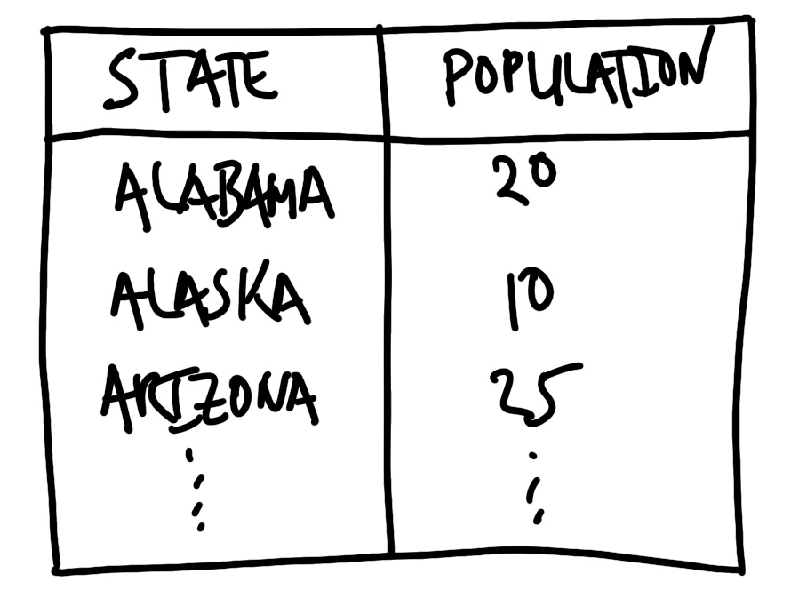
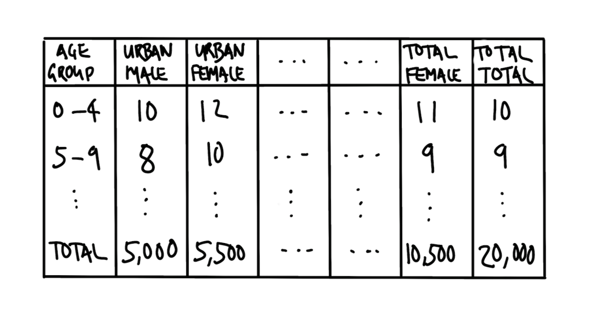
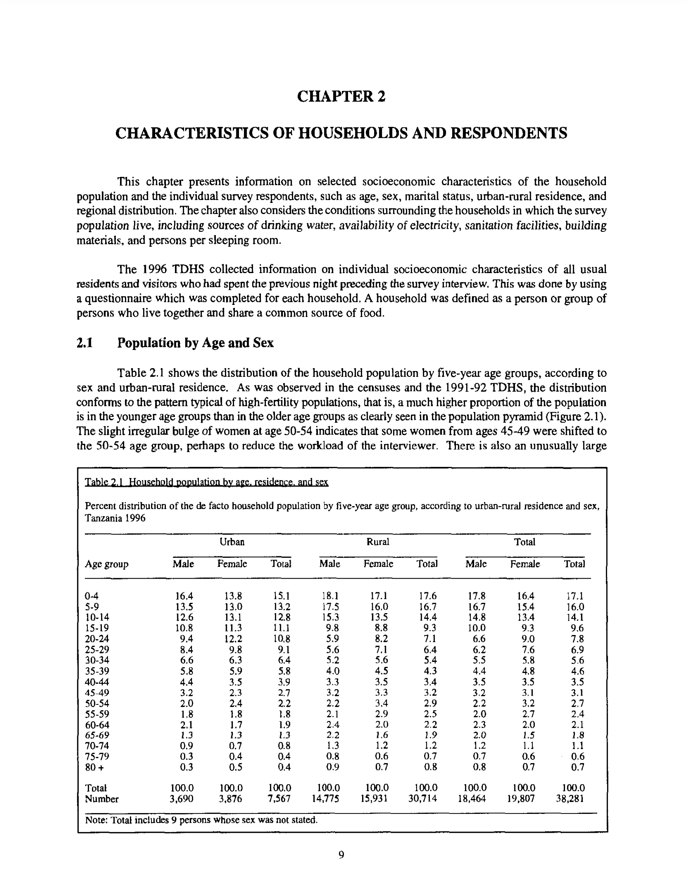
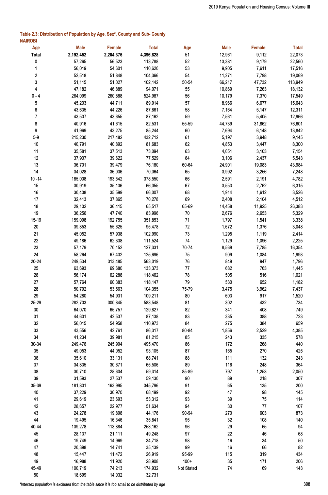

# 데이터 정제, 준비 및 검증 {#sec-clean-and-prepare}

**권장 도서 및 논문**

- *데이터 페미니즘* (원제: *Data Feminism*), Catherine D'Ignazio & Lauren F. Klein [@datafeminism2020] 읽기.
  - 데이터 정제 과정에서 내리는 수많은 결정이 어떤 사회적, 정치적 함의를 갖는지 논의하는 5장 "유니콘, 관리인, 닌자, 마법사, 록 스타"에 주목하세요.
- *데이터 과학을 위한 R* (원제: *R for Data Science*), Hadley Wickham & Garrett Grolemund [@r4ds] 읽기.
  - 정돈된 데이터(Tidy data)의 개념과 이를 만들기 위한 전략을 설명하는 6장 "데이터 정리"를 참고하세요.
- *R을 이용한 데이터 정제 입문* (원제: *An Introduction to Data Cleaning with R*), Edwin de Jonge & Mark van der Loo [@de2013introduction] 읽기.
  - 원시 데이터를 기술적으로 올바른(Technically correct) 데이터로 변환하는 과정을 상세히 다루는 2장을 읽어보세요.
- *워싱턴 포스트 선거 공학 팀의 교훈* (원제: *What the Washington Post’s election engineering team had to learn about election data*), Jeremy Bowers [@washingtonpostelections] 읽기.
  - 실제 대규모 선거 데이터를 다루면서 마주하게 되는 현실적인 문제들을 다룹니다.
- *계약으로서의 열 이름* (원제: *Column Names as Contracts*), Emily Riederer [@columnnamesascontracts] 읽기.
  - 변수 이름을 일정한 규칙에 따라 명명하는 것이 협업과 유지보수에 어떤 이점을 주는지 소개합니다.
- *역사적 해수면 온도 기록의 개선* (원제: *Combining statistical, physical, and historical evidence to improve historical sea-surface temperature records*), Duo Chan et al. [@Chan2021Combining] 읽기.
  - 서로 다른 시기에 각기 다른 선박에서 수집된 방대한 데이터를 하나의 일관된 데이터셋으로 통합하는 과정의 어려움을 잘 보여줍니다.

**핵심 개념 및 기술**

- 데이터셋을 정제하고 준비하는 과정은 무수히 많은 결정을 수반하는 까다로운 작업입니다. 최종 결과물에 대한 명확한 계획을 세우고, 우리가 얻고자 하는 데이터의 형태를 미리 **시뮬레이션**해 보는 것이 매우 중요합니다.
- 처음부터 전체 데이터를 다루기보다 작은 규모의 샘플(Small sample)로 시작하여 **반복적(Iterative)**으로 작업하는 것이 효율적입니다. 특정 기능을 처리하는 코드를 먼저 작성한 후, 점차 적용 범위를 넓히고 일반화해 나가세요.
- 작업 과정에서 데이터가 반드시 통과해야 할 일련의 **테스트와 검증 절차**를 수립해야 합니다. 이는 데이터셋이 갖춰야 할 핵심적인 특징들에 초점을 맞춰야 합니다.
- 변수의 데이터 타입(Class), 명확한 변수명, 그리고 각 변수의 고유값이 상식적인 범위 내에 있는지 세심하게 살펴야 합니다.

**소프트웨어 및 패키지**

- Base R [@citeR]
- `janitor` [@janitor]
- `lubridate` [@GrolemundWickham2011]
- `modelsummary` [@citemodelsummary]
- `opendatatoronto` [@citeSharla]
- `pdftools` [@pdftools]
- `pointblank` [@pointblank]
- `readxl` [@readxl]
- `scales` [@scales]
- `stringi` [@stringi]
- `testthat` [@testthat]
- `tidyverse` [@tidyverse]
- `tinytable` [@tinytable]
- `validate` [@validate]

```{r}
#| message: false
#| warning: false

library(janitor)
library(lubridate)
library(modelsummary)
library(opendatatoronto)
library(pdftools)
# library(pointblank)
library(readxl)
library(scales)
library(stringi)
library(testthat)
library(tidyverse)
library(tinytable)
# library(validate)

```

## 서론

> "이보게 린든, 자네 말이 맞을지도 모르지. 그들이 자네 말대로 정말 똑똑할 수도 있어. 하지만 그들 중 단 한 명이라도 보안관 선거에 출마해 본 사람이 있었다면 훨씬 더 좋았을 텐데 말이야."
>
> — 린든 존슨 전 미국 대통령이 새로 임명된 내각 인사들의 천재성을 칭송하자, 샘 레이번 하원의장이 남긴 말(David Halberstam의 *The Best and the Brightest* [@halberstam, p. 41]에서 재인용).

이 장에서는 데이터 정제 및 준비(Data cleaning and preparation)\index{data!cleaning}를 위한 체계적이고 공식적인 접근 방식을 제시합니다. 이 방식은 다음 세 가지 축을 중심으로 합니다.

1. **타당성(Validity)**\index{validity}
2. **내부 일관성(Internal consistency)**\index{consistency!internal}
3. **외부 일관성(External consistency)**\index{consistency!external}

여러분이 돌리는 통계 모델은 데이터가 사전에 제대로 검증되었는지 상관하지 않지만, 분석가인 여러분은 반드시 신경 써야 합니다. **타당성**은 데이터셋의 값이 명백히 틀리지 않았음을 의미합니다. 예를 들어 숫자로 표시되어야 할 금액에 문자가 섞여 있거나, 사람 이름에 숫자가 포함되거나, 자동차의 속도가 빛의 속도보다 빠르면 안 됩니다. **내부 일관성**은 데이터셋 내에서 논리적 모순이 없음을 뜻합니다. 예를 들어 세부 항목들의 합이 총계와 일치해야 한다는 식입니다. 마지막으로 **외부 일관성**은 우리 데이터가 외부의 신뢰할 수 있는 소스와 모순되지 않음을 의미합니다. 만약 우리 데이터셋이 특정 도시의 인구를 다룬다면, 그 값은 대략적으로 인구 조사(Census) 데이터와 일치해야 하며, 큰 차이가 있다면 그 이유가 명확히 설명되어야 합니다.

미국의 로켓 기업 SpaceX는 로켓 제어를 위해 10Hz 또는 50Hz(각각 0.1초와 0.02초 간격) 주기를 사용합니다[@martinpopper]. 매 주기마다 온도나 압력 센서의 값을 읽어 처리하고, 그 값을 바탕으로 설정을 조정할지 결정합니다. 데이터 정제와 준비 과정에서도 이와 유사한 **반복적(Iterative) 접근 방식**을 권장합니다. 처음부터 모든 것을 완벽하게 마무리하려 애쓰기보다는, 작고 지속적인 개선 과정을 반복하며 데이터의 완성도를 높여가야 합니다.

데이터 정제와 준비의 비중은 매우 커서, 때로는 해당 데이터를 직접 정제한 사람만이 그 구조를 완벽히 이해하기도 합니다. 하지만 정제 과정에서 마주치는 수많은 오류 때문에, 정작 작업을 수행한 당사자가 결과물을 가장 불신하게 되는 '정제의 역설'이 발생하기도 합니다. 모든 분석 프로젝트에서 모델링을 수행하는 사람은 반드시 직접 데이터 정제 과정에 참여해야 합니다. 비록 환영받지 못하는 지루한 작업일 때가 많지만[@Sambasivan2021], 정제 과정에서의 결정은 최종 모델만큼이나 결과에 큰 영향을 미칩니다. 가령 @labelsiswrongs 는 컴퓨터 과학 분야에서 널리 쓰이는 유명 데이터셋의 테스트 세트 중 약 3%에 잘못된 레이블이 붙어 있음을 발견했습니다.\index{computer science} @Banes2022 는 수마트라 오랑우탄의 참조 게놈 데이터를 재검토한 끝에 샘플 10개 중 9개에서 문제점을 찾아냈습니다. 또한 @eveninaccountingwhat 은 기업 회계 데이터의 공시 버전과 표준화 버전 사이에, 특히 재무 구조가 복잡할수록 상당한 수치 차이가 존재한다는 것을 입증했습니다. 새 장관들이 머리만 좋기보다 현장 경험을 갖췄기를 바랐던 샘 레이번처럼, 데이터 과학자 역시 데이터셋이라는 지저분한 현실 속에 직접 뛰어들어야 합니다.

심리학 분야에서 처음 지적되었지만[@anniesfind] 이후 물리 및 사회 과학 전반으로 확장된 **재현성 위기(Reproducibility crisis)**\index{reproducibility!crisis}는 p-값 해킹(p-hacking)\index{p-hacking}, 연구자의 자의적 선택권(Researcher degrees of freedom), 출판 편향(File drawer problem), 심지어 데이터 조작과 같은 심각한 문제를 드러냈습니다[@gelman2013garden]. 현재는 이러한 문제를 해결하기 위한 다각도의 노력이 진행 중입니다. 하지만 데이터 수집, 정제, 준비 단계에서 내린 결정이 통계적 결과에 막대한 영향을 미친다는 증거가 충분함에도 불구하고[@huntington2021influence], 이 과정 자체에 대한 논의는 상대적으로 부족했습니다. 이 장에서는 바로 이 문제에 집중합니다.

데이터 과학의 근간이 되는 통계적 기법들은 시뮬레이션된 정교한 데이터셋에 적용될 때는 매우 정확하고 강력합니다. 하지만 실제 데이터 과학 현장의 데이터는 통상적인 모델의 가정을 따르지 않는 경우가 많습니다. 데이터 과학자들이 다루는 데이터는 "이질적이고, 복잡한 의존성을 가지며, 결측치가 혼재된 지저분하고 가공되지 않은" 상태인 경우가 많으며, 이는 불과 얼마 전까지만 해도 전통적인 통계학자들 사이에서는 입에 올리기조차 꺼려지는 주제였습니다[@craiu2019hiring]. 단순히 데이터의 양이 많은 **빅 데이터(Big data)**\index{data!big data}라고 해서 이 문제가 해결되지는 않습니다. 오히려 품질이 낮은 대용량 데이터를 정제 없이 사용할 경우, 통계적으로 "더 자신 있게 잘못된 결론"을 내리게 될 뿐입니다[@meng2018statistical]. 응용 통계 연구에서 나타나는 오류는 연구자의 실력이나 편향 때문만이 아닙니다[@silberzahn2018many]. 그것은 데이터 과학이 수행되는 복잡한 현실 맥락에서 기인하는 필연적인 결과입니다. 이 장에서는 이러한 작업을 체계적으로 다루기 위한 사고방식과 도구를 제공합니다.

@gelman2020most 는 지난 50년간의 가장 중요한 통계적 아이디어들을 회고하며, 각각의 아이디어가 데이터 분석에 대한 새로운 사고의 지평을 열었다고 말했습니다. 이러한 아이디어들은 과거에 "취향이나 철학의 문제"로 치부되던 영역들을 통계학의 공고한 영역 안으로 끌어들였습니다.\index{statistics} 이 장에서 데이터 정제와 준비를 강조하는 것 역시, 그동안 핵심 통계학의 영역이 아니라고 오해받던 "데이터 다듬기" 과정을 공식적인 분석 프로세스의 일부로 정립하려는 노력의 일환입니다.

데이터 정제와 준비를 위해 우리가 제안하는 **워크플로(Workflow)**\index{workflow}는 다음과 같습니다.

1.  **원본 데이터 보존**: 수정되지 않은 최초의 원본 데이터를 안전하게 저장합니다.
2.  **스케치 및 시뮬레이션**: 최종 목표를 염두에 두고 결과물의 형태를 미리 구상하고 시뮬레이션합니다.
3.  **테스트 및 문서화**: 데이터가 충족해야 할 구체적인 테스트 조건과 문서를 작성합니다.
4.  **소규모 샘플 적용**: 전체 데이터에 적용하기 전, 작은 샘플에 대해 계획을 실행해 봅니다.
5.  **반복 및 개선**: 실험 결과를 바탕으로 계획을 수정하고 반복합니다.
6.  **전체 적용 및 일반화**: 검증된 절차를 전체 데이터셋으로 확장합니다.
7.  **최종 업데이트**: 테스트 결과와 문서를 최종적으로 업데이트합니다.

우리는 효율적인 작업을 위해 다양한 기술이 필요하지만, 무엇보다 **끈기(Persistence)**와 **합리적 사고(Reasonableness)**의 균형이 중요합니다. 데이터 정제 단계에서 '완벽'은 '충분히 좋은 것'의 적이 될 수 있습니다. 구체적으로 말해, 데이터의 90% 정도를 정제했다면 나머지 10%를 완벽히 다듬기 위해 엄청난 시간과 노력을 쏟기보다는, 먼저 탐색적 분석을 시작하며 그 노력이 정말 가치가 있는지 판단해 보는 것이 현명할 수 있습니다.

방법론(경작, 수집, 사냥)과 상관없이 모든 데이터에는 결함이 있습니다. 우리는 이러한 결함을 체계적으로 다룰 수 있는 접근 방식이 필요하며, 무엇보다 그 결함이 결과적인 모델링에 어떤 영향을 주는지 이해해야 합니다[@van2005data]. 데이터를 정제하는 과정 그 자체가 이미 분석의 시작입니다. 왜냐하면 그 과정에서 우리는 무엇을 남기고 무엇을 버릴지, 결과에서 무엇을 중요하게 여길지 끊임없이 **선택**해야 하기 때문입니다[[@thatrandyauperson]].

## 워크플로

### 원본 데이터 보존

첫 번째 단계는 수정되지 않은 **원본 데이터(Raw data)**\index{data!unedited}를 별도의 로컬 폴더에 안전하게 저장하는 것입니다. 이는 데이터 분석의 **재현성(Reproducibility)**을 확보하기 위한 가장 기초적이고 중요한 단계입니다[@wilsongoodenough]. 정부 웹사이트 등 제3자가 제공하는 데이터의 경우, 주소가 바뀌거나 데이터가 업데이트되어 이전 버전을 찾기 어려워질 수도 있습니다. 따라서 로컬에 사본을 저장해 두는 것은 분석의 안정성을 높여줄 뿐만 아니라, 원격 서버에 중복된 요청을 보내는 부담도 덜어줍니다.

원본 데이터를 저장한 후에는 절대로 그 파일을 직접 수정해서는 안 됩니다. 데이터 정제와 준비는 항상 원본의 복사본 위에서 이루어져야 하며, 모든 변경 사항은 스크립트(Script) 형식으로 기록되어야 합니다. 원본을 그대로 유지한 채 스크립트로만 분석 데이터를 생성하는 워크플로를 구축해야 전체 과정을 투명하게 재현할 수 있습니다. 오늘 내린 결정이 나중에 데이터에 대해 더 깊이 이해한 뒤에는 바뀔 수도 있기 때문입니다. 우리는 언제든지 원본 상태로 돌아갈 수 있는 '안전장치'를 항상 마련해 두어야 합니다[@Borer2009].

보안상의 이유로 원본 데이터를 직접 공유하기 어려운 경우(예: 민감한 정보가 포함된 경우), 데이터의 주요 특징을 잘 반영하면서도 개인정보를 보호할 수 있는 **시뮬레이션 데이터**를 만들어 공유하는 것이 좋습니다. 또한 README 파일 등에 실제 원본 데이터에 접근할 수 있는 상세한 절차를 남겨두어 다른 연구자들이 참고할 수 있게 해야 합니다.

### 계획 단계

최종 목표를 미리 계획하는 것은 프로젝트의 범위를 명확히 하고('Scope creep' 방지), 불필요한 시행착오를 줄여줍니다. 특히 데이터 정제 단계에서는 "내가 원하는 최종 데이터셋이 구체적으로 어떤 모습이어야 하는가"를 깊이 고민하게 만듭니다.

먼저 우리가 만들고자 하는 데이터셋의 구조를 **스케치**해 보세요. 열(Column) 이름, 데이터 타입(Class), 그리고 데이터가 가질 수 있는 값의 범위 등을 미리 구상하는 것입니다. 예를 들어 미국 각 주의 인구 데이터에 관심이 있다면, [@fig-sketchdataplan]과 같은 형태로 스케치를 그려볼 수 있습니다.

{#fig-sketchdataplan width=40% fig-align="center"}

이 스케치 과정을 통해 우리는 "주 이름은 약어가 아닌 전체 이름을 사용하겠다", "인구 단위는 백만 명으로 하겠다"와 같은 중요한 결정을 미리 내릴 수 있습니다. 최종 목표가 선명해지면 무엇을 정제해야 할지도 명확해집니다.

그 다음으로는 코드를 사용하여 데이터를 **시뮬레이션**해 봅니다.\index{simulation!US state population} 이 과정에서 우리는 실제 데이터를 다루기 전에 어떤 함수를 쓸지, 각 변수의 고유값(Unique values)이 어느 정도 범위에 있어야 상식적인지 등을 구체적으로 생각하게 됩니다. 예를 들어 '성별' 변수라면 "남성", "여성", "기타", "알 수 없음" 같은 범주가 예상되겠지만, "1,000" 같은 숫자가 들어온다면 오류로 간주해야 한다는 기준을 세울 수 있습니다. R을 사용하여 미국 주별 인구 데이터를 간단히 시뮬레이션하는 코드는 다음과 같습니다.

```{r}
#| message: false
#| warning: false

set.seed(853)

simulated_population <-
  tibble(
    state = state.name,
    population = runif(n = 50, min = 0, max = 50) |>
      round(digits = 2)
  )

simulated_population

```

:::{.content-visible when-format="pdf"}

데이터 정제와 준비의 목표는 원본 데이터를 앞서 세운 계획에 최대한 가깝게 만드는 것입니다. 이상적으로는 최종 결과물이 **정돈된 데이터(Tidy data)**\index{tidy data} 형식을 갖추도록 해야 합니다. 정돈된 데이터란 다음 세 가지 원칙을 따르는 데이터를 말합니다 [@r4ds; @wickham2014tidy, p. 4]. (자세한 내용은 ["R 필수 사항" 온라인 부록](https://tellingstorieswithdata.com/20-r_essentials.html)을 참고하세요.)

1.  각 변수(Variable)는 하나의 열(Column)을 형성한다.
2.  각 관측치(Observation)는 하나의 행(Row)을 형성한다.
3.  각 값(Value)은 하나의 셀(Cell)에 저장된다.

계획 단계에서 데이터의 **타당성**과 **내부 일관성**\index{consistency!internal}에 대해 충분히 고민해 보세요. 이 데이터가 가져야 할 필수적인 특징들은 무엇인가요? 시뮬레이션 과정에서 발견한 이러한 특징들은 나중에 코드로 작성할 **테스트 조건**의 기초가 됩니다.

:::

:::{.content-visible unless-format="pdf"}

데이터 정제와 준비의 목표는 원본 데이터를 앞서 세운 계획에 최대한 가깝게 만드는 것입니다. 이상적으로는 최종 결과물이 **정돈된 데이터(Tidy data)**\index{tidy data} 형식을 갖추도록 해야 합니다. 정돈된 데이터란 다음 세 가지 원칙을 따르는 데이터를 말합니다 [@r4ds; @wickham2014tidy, p. 4]. (자세한 내용은 [온라인 부록 -@sec-r-essentials]을 참고하세요.)

1.  각 변수(Variable)는 하나의 열(Column)을 형성한다.
2.  각 관측치(Observation)는 하나의 행(Row)을 형성한다.
3.  각 값(Value)은 하나의 셀(Cell)에 저장된다.

계획 단계에서 데이터의 **타당성**과 **내부 일관성**\index{consistency!internal}에 대해 충분히 고민해 보세요. 이 데이터가 가져야 할 필수적인 특징들은 무엇인가요? 시뮬레이션 과정에서 발견한 이러한 특징들은 나중에 코드로 작성할 **테스트 조건**의 기초가 됩니다.

:::

### 작게 시작하기

철저한 계획을 세웠다면 이제 실제 원본 데이터를 다룰 차례입니다. 우리의 최우선 과제는 가급적 빨리 원본 데이터를 우리가 다루기 익숙한 '사각형 모양의 데이터셋(Rectangular dataset)'으로 변환하는 것입니다. 그래야 `tidyverse`와 같은 강력한 도구들을 활용할 수 있기 때문입니다. 예를 들어 텍스트(`.txt`) 파일에서 데이터를 읽어오는 상황을 가정해 봅시다.

데이터 정제의 첫 단추는 데이터에서 **규칙성(Regularity)**을 찾는 것입니다. 텍스트를 표 형태로 바꾸려면 열을 구분할 수 있는 **구분자(Delimiter)**가 필요합니다. 쉼표(`,`), 세미콜론(`;`), 탭, 혹은 일정한 공백이나 줄 바꿈 등이 좋은 예입니다. 아래와 같은 데이터라면 쉼표를 구분자로 활용할 수 있을 것입니다.

```

앨라배마, 5
알래스카, 0.7
애리조나, 7
아칸소, 3
캘리포니아, 40

```

구분자가 명확하지 않은 복잡한 경우라도 데이터 어딘가에는 반복되는 규칙이 있기 마련입니다. 예를 들어 아래와 같이 문장 형태로 된 데이터가 있다고 해봅시다.\index{text!cleaning}\index{data cleaning!text}

```

주는 앨라배마이고 인구는 5백만입니다.
주는 알래스카이고 인구는 0.7백만입니다.
주는 애리조나이고 인구는 7백만입니다.
주는 아칸소이고 인구는 3백만입니다.
주는 캘리포니아이고 인구는 40백만입니다.

```

이 경우 쉼표 같은 전통적인 구분자는 없지만, "주는 ", "이고 인구는 ", "백만입니다."와 같이 반복되는 패턴을 활용해 필요한 정보만 쏙쏙 골라낼 수 있습니다. 가장 까다로운 경우는 아래처럼 줄 바꿈조차 없는 경우입니다.

```

앨라배마 5 알래스카 0.7 애리조나 7 아칸소 3 캘리포니아 40

```

이럴 때는 데이터의 **타입(Type)**이나 **값(Value)**의 특성을 활용해야 합니다. 우리는 지금 '미국 주 이름'을 찾고 있다는 것을 알고 있으므로, 50개 주의 목록을 기준 삼아 데이터를 쪼갤 수 있습니다. 혹은 "공백 뒤에 숫자가 온다"는 규칙을 정규 표현식으로 표현해 구분자로 쓸 수도 있습니다.

위의 줄 바꿈 없는 데이터를 정돈된 데이터로 변환하는 코드는 다음과 같습니다.

```{r}

unedited_data <-
  c("앨라배마 5 알래스카 0.7 애리조나 7 아칸소 3 캘리포니아 40")

tidy_data <-
  tibble(raw = unedited_data) |>
  separate(
    col = raw,
    into = letters[1:5],
    sep = "(?<=[[:digit:]]) " # 숫자 뒤에 오는 괄호
  ) |>
  pivot_longer(
    cols = letters[1:5],
    names_to = "drop_me",
    values_to = "separate_me"
  ) |>
  separate(
    col = separate_me,
    into = c("state", "population"),
    sep = " (?=[[:digit:]])" # 숫자 뒤에 오는 공백
  ) |>
  select(-drop_me)

tidy_data

```

### 테스트 및 문서화

:::{.content-visible when-format="pdf"}

데이터를 사각형 모양으로 정돈했다면, 이제 각 열의 **데이터 타입(Class)**을 꼼꼼히 살펴야 합니다. 이 단계에서 무작정 타입을 바꾸기보다는(자칫 데이터가 손실될 수 있습니다), 현재 어떤 타입인지 확인하고 우리가 계획했던 시뮬레이션 데이터와 비교해 보며 수정이 필요한 부분을 기록해 두세요. 데이터 타입에 대한 기초 지식은 ["R 필수 사항" 온라인 부록](https://tellingstorieswithdata.com/20-r_essentials.html)에서 확인할 수 있습니다.

:::

:::{.content-visible unless-format="pdf"}

데이터를 사각형 모양으로 정돈했다면, 이제 각 열의 **데이터 타입(Class)**을 꼼꼼히 살펴야 합니다. 이 단계에서 무작정 타입을 바꾸기보다는(자칫 데이터가 손실될 수 있습니다), 현재 어떤 타입인지 확인하고 우리가 계획했던 시뮬레이션 데이터와 비교해 보며 수정이 필요한 부분을 기록해 두세요. 데이터 타입에 대한 기초 지식은 [온라인 부록 -@sec-r-essentials]에서 확인할 수 있습니다.

:::

본격적으로 데이터 타입을 수정하기 전, 다음과 같이 흔히 발생하는 문제들을 먼저 해결해야 합니다.

-   숫자 데이터에 포함된 쉼표(`,`)나 통화 기호(`$`, `₩` 등).
    -   날짜 형식이 제각각인 경우(예: "January", "Jan", "01"이 혼용됨).
-   인코딩 문제로 인해 글자가 깨지는 경우.^[참고로 컴퓨터는 모든 문자를 0과 1의 조합으로 이해하며, 이를 위해 특정 규칙(인코딩)을 사용합니다. 특히 외국어나 특수 문자를 다룰 때 인코딩이 맞지 않으면 글자가 깨지는데, 전 세계적으로 통용되는 **UTF-8** 방식을 사용하는 것이 가장 안전합니다. R에서 `Encoding()` 함수를 쓰면 현재 문자열의 인코딩을 확인할 수 있습니다.]

눈에 띄는 명백한 오류는 즉시 수정하는 것이 좋지만, 데이터 양이 많으면 어디서부터 손을 대야 할지 막막할 수 있습니다. 이럴 때는 각 변수의 고유값들을 나열해 보고, 가장 빈번하게 나타나는 형태부터 차례대로 정리해 나가는 전략이 효과적입니다.

우리는 소프트웨어 개발에서 사용하는 '단위 테스트(Unit testing)' 개념을 데이터 정제에 도입할 것입니다. 테스트는 우리가 만든 데이터가 분석 목적에 적합한지 검증하는 안전장치입니다[@researchsoftware]. 데이터 과학에서 테스트는 한 번 쓰고 버리는 것이 아니라, 분석이 진행됨에 따라 계속 업데이트하고 진화시켜야 하는 살아있는 문서와 같습니다.

:::{.callout-note}

## 데이터만으로는 알 수 없는 것들: 스포츠 기록의 사례

현실을 숫자로 단순화하는 과정은 스포츠 기록에서 잘 드러납니다. 스포츠 기록은 특정 목적에는 완벽하지만, 모든 것을 말해주지는 않습니다. 예를 들어 체스 게임은 8x8 보드 위에서 각 말의 위치를 '대수 표기법(Algebraic notation)'으로 기록합니다. 나이트는 N, 비숍은 B와 같은 식이죠. 이 기록만 있으면 당시의 게임을 완벽하게 재현할 수 있습니다. 2021년 체스 세계 선수권 대회에서 매그너스 칼슨과 이안 네폼니아치치가 둔 역사적인 대국을 복기해 보면, 두 천재 기사 모두 중요한 순간에 의외의 실수를 저질렀음을 알 수 있습니다[@PeterDoggers]. 통계적으로는 명백한 실수이지만, 왜 그런 실수를 했는지는 기록만으로는 알 수 없습니다. 당시 두 플레이어에게 남은 시간이 거의 없었다는 사실(시간 압박)이 기록 데이터에는 빠져 있기 때문입니다. 이처럼 데이터는 일어난 일을 '정확하게' 기록하지만, 그 이면의 '이유'까지는 담아내지 못할 수 있음을 기억해야 합니다.

:::

지저분한 문자열이 섞인 예시를 통해 구체적인 정제 과정을 살펴봅시다. 이러한 데이터는 광학 문자 인식(OCR)을 통해 생성된 텍스트에서 흔히 볼 수 있으며, 겉보기엔 그럴듯해 보이지만 세부적으로는 많은 수작업이 필요합니다.

```{r}

messy_string <- paste(
  c("Patricia, Ptricia, PatricIa, Patric1a, PatricIa"),
  c("PatrIcia, Patricia, Patricia, Patricia , 8atricia"),
  sep = ", "
)

```

가장 먼저 이 데이터를 사각형 모양의 데이터셋으로 변환합니다.

```{r}

messy_dataset <-
  tibble(names = messy_string) |>
  separate_rows(names, sep = ", ")

messy_dataset

```

이제 어떤 오류부터 수정할지 결정해야 합니다. `count()` 함수를 사용하여 각 이름이 몇 번씩 나타나는지 확인해 봅시다.

```{r}

messy_dataset |>
  count(names, sort = TRUE)

```

가장 많이 나타나는 "Patricia"가 올바른 철자임을 알 수 있습니다. 그 다음으로 많은 "PatricIa"나 "PatrIcia"는 'i'가 잘못 대문자로 표시된 경우입니다. `str_to_title()` 함수를 쓰면 각 단어의 첫 글자만 대문자로 만들고 나머지는 소문자로 변환하여 이러한 대문자 오타를 일괄 수정할 수 있습니다.

:::{.content-visible when-format="pdf"}

문자열 처리에 대한 자세한 내용은 ["R 필수 사항" 온라인 부록](https://tellingstorieswithdata.com/20-r_essentials.html)을 참고하세요.

:::

:::{.content-visible unless-format="pdf"}

문자열 처리에 대한 자세한 내용은 [온라인 부록 -@sec-r-essentials]을 참고하세요.

:::

```{r}

messy_dataset_fix_I_8 <-
  messy_dataset |>
  mutate(
    names = str_to_title(names)
  )

messy_dataset_fix_I_8 |>
  count(names, sort = TRUE)

```

간단한 작업만으로도 정확도가 30%에서 60%로 올라갔습니다. 이제 "8atricia"와 "Ptricia"라는 명백한 오류가 남았습니다. 전자는 "P"가 "8"로 잘못 인식되었고, 후자는 "a"가 누락된 경우입니다. `str_replace_all()` 함수를 사용하여 이를 수정합니다.

```{r}

messy_dataset_fix_a_n <-
  messy_dataset_fix_I_8 |>
  mutate(
    names = str_replace_all(names, "8atricia", "Patricia"),
    names = str_replace_all(names, "Ptricia", "Patricia")
  )

messy_dataset_fix_a_n |>
  count(names, sort = TRUE)

```

이제 정확도가 80%까지 올라왔습니다. 남은 두 가지 오류는 좀 더 미묘합니다. 하나는 'i'가 숫자 '1'로 잘못 코딩된 경우(`Patric1a`)인데, 이는 OCR에서 매우 흔히 발생하는 문제입니다. 다른 하나는 이름 뒤에 보이지 않는 공백이 붙어 있는 경우입니다. `str_trim()` 함수를 사용하여 선행 및 후행 공백을 제거하고 숫자 문제를 해결하면 모든 정제가 완료됩니다.

```{r}

cleaned_data <-
  messy_dataset_fix_a_n |>
  mutate(
    names = str_replace_all(names, "Patric1a", "Patricia"),
    names = str_trim(names, side = c("right"))
  )

cleaned_data |>
  count(names, sort = TRUE)

```

방금 우리는 머릿속으로 세운 "모든 값은 'Patricia'여야 한다"는 기준을 바탕으로 정제 작업을 수행했습니다. 이러한 기준을 실제 코드로 **문서화**하고 자동화할 수 있습니다. 예를 들어 정제된 데이터셋에 "Patricia"가 아닌 다른 값이 섞여 있는지 확인하는 코드는 다음과 같습니다.

```{r}

check_me <-
  cleaned_data |>
  filter(names != "Patricia")

if (nrow(check_me) > 0) {
  print("여전히 Patricia가 아닌 잘못된 값이 존재합니다!")
}

```

조건이 충족되지 않으면 아예 코드 실행을 멈추게 하는 `stopifnot()` 함수를 쓰면 더 강력한 검증이 가능합니다. 이 함수는 데이터의 개수, 타입, 속성 등이 예상과 다를 때 즉시 경고를 보냄으로써 분석 오류의 연쇄 반응을 막아줍니다.

```{r}

stopifnot(nrow(check_me) == 0)

```

또한 `testthat` 패키지를 활용하면 더욱 체계적인 테스트가 가능합니다. 원래는 소프트웨어 패키지 검증용으로 개발되었지만, 데이터셋이 우리가 의도한 형태인지 확인하는 데에도 매우 유용합니다.

```{r}
#| message: false
#| warning: false

# 잘못된 데이터의 행 수가 0입니까?
expect_length(check_me$names, 0)
# names 열의 데이터 타입이 문자(character)입니까?
expect_equal(class(cleaned_data$names), "character")
# 모든 고유값이 "Patricia"입니까?
expect_equal(unique(cleaned_data$names), "Patricia")

```

테스트가 무사히 통과되면 아무런 메시지가 출력되지 않지만, 하나라도 실패하면 스크립트 실행이 중단됩니다. 1960년대 아폴로(Apollo) 프로젝트\index{Apollo}의 엔지니어들은 처음에는 테스트 작성을 번거로운 일로 여겼지만, 결국 NASA를 설득하기 위해 완벽한 테스트 시스템을 구축해야만 했습니다. 데이터 과학도 마찬가지입니다.\index{data science!need for tests} 완벽한 테스트 없이는 그 누구도(심지어 분석가 자신조차) 데이터의 신뢰성을 보장할 수 없습니다.

가장 먼저 **타당성(Validity)**\index{validity}\index{testing!validity} 테스트부터 시작하세요. 변수의 타입, 고유값의 범위, 행의 개수 등이 정상인지 확인하는 것입니다. 예를 들어 최근 연도 데이터를 다룬다면, 모든 연도값이 '2'로 시작하는 4자리 숫자인지를 테스트할 수 있습니다. @peterbaumgartnertesting 은 이를 '스키마(Schema) 테스트'라고 부릅니다.

그다음은 **내부 일관성(Internal consistency)**\index{consistency!internal}입니다. 세부 항목의 합계가 총계와 일치하는지 등을 확인하는 단계입니다. 마지막으로 **외부 일관성(External consistency)**\index{consistency!external} 테스트를 통해 외부의 신뢰할 수 있는 지표와 우리 데이터를 비교해 보세요. (예: 우리 데이터의 신생아 사망률 수치가 세계보건기구(WHO)의 통계와 크게 다르지 않은가?) 노련한 분석가는 이 과정을 머릿속으로 수행하지만, 이를 코드로 명시화(Code as documentation)하지 않으면 협업과 확장이 불가능합니다.

코드 전체에 테스트를 작성하며, 끝에만 작성하지 않습니다. 특히 중간 단계에 `stopifnot()` 문을 사용하면 데이터셋이 예상대로 정리되고 있는지 확인할 수 있습니다. 예를 들어, 두 데이터셋을 병합할 때 다음을 확인할 수 있습니다.

1) 데이터셋의 변수 이름은 고유하며, 키로 사용될 열은 제외합니다.
2) 각 유형의 관측치 수가 적절하게 전달되고 있습니다.
3) 데이터셋의 차원이 예상치 않게 변경되지 않습니다.

### 반복, 일반화 및 업데이트

이제 계획을 반복할 수 있습니다. 가장 최근의 경우, 10개의 항목으로 시작했습니다. 이것을 100개 또는 심지어 1,000개로 늘릴 수 없는 이유는 없습니다. 정리 절차와 테스트를 일반화해야 할 수도 있습니다. 그러나 결국 데이터셋을 어떤 종류의 순서로 가져오기 시작할 것입니다.

## 확인 및 테스트

@sec-on-writing 말했듯이, 린든 존슨의 전기 작가 로버트 카로는 미국 36대 대통령과 관련된 모든 사람을 추적하는 데 수년을 보냈습니다. 카로와 그의 아내 이나는 존슨이 어디 출신인지 더 잘 이해하기 위해 텍사스 힐 컨트리에서 3년 동안 살았습니다. 카로는 존슨이 상원 의원으로서 D.C.에 머물던 곳에서 상원까지 달려갔다는 소식을 듣고, 존슨이 왜 달렸는지 이해하기 위해 그 경로를 여러 번 직접 달렸습니다. 카로는 존슨이 그랬던 것처럼 해가 뜰 때 그 경로를 달렸을 때 비로소 이해했습니다. 즉, 해가 상원 로툰다에 특히 영감을 주는 방식으로 비친다는 것을 알게 되었습니다[@caroonworking, p. 156]. 이러한 배경 작업은 그가 다른 누구도 알지 못했던 측면을 밝혀낼 수 있게 했습니다. 예를 들어, 존슨은 거의 확실히 첫 선거에서 승리를 훔쳤습니다[@caroonworking, p. 116]. 우리는 이와 동일한 정도로 데이터를 이해해야 합니다. 우리는 비유적으로 모든 페이지를 넘겨보고 싶습니다.

음의 공간 개념은 디자인에서 잘 확립되어 있습니다. 이는 주제를 둘러싸고 있는 것을 의미합니다. 때로는 음의 공간이 효과로 사용됩니다. 예를 들어, 미국 물류 회사 FedEx의 로고는 E와 X 사이에 음의 공간이 있어 화살표를 만듭니다. 이와 유사하게, 우리는 우리가 가지고 있는 데이터와 가지고 있지 않은 데이터에 대해 인식해야 합니다[@citemyboy]. 우리는 우리가 가지고 있지 않은 데이터가 어떤 식으로든 의미를 가지고 있으며, 잠재적으로 우리의 결론을 바꿀 정도까지 의미를 가질 수 있다고 우려합니다. 데이터를 정리할 때, 우리는 이상 징후를 찾고 있습니다. 우리는 데이터셋에 있어야 하지만 없어야 하는 값뿐만 아니라 그 반대 상황, 즉 데이터셋에 있어야 하지만 없는 값에도 관심이 있습니다. 이러한 상황을 식별하는 데 사용하는 세 가지 도구는 그래프, 개수 및 테스트입니다.

우리는 또한 이러한 도구를 사용하여 올바른 관측치를 잘못된 것으로 변경하지 않도록 합니다. 특히 정리 및 준비에 여러 단계가 필요한 경우, 한 단계에서 수정된 내용이 나중에 취소될 수 있습니다. 우리는 그래프, 개수, 특히 테스트를 사용하여 이를 방지합니다. 이러한 것들의 중요성은 데이터셋의 크기에 따라 기하급수적으로 증가합니다. 작고 중간 규모의 데이터셋은 수동 검사 및 분석가에 의존하는 다른 측면에 더 적합하지만, 대규모 데이터셋은 특히 더 효율적인 전략을 필요로 합니다[@hand2018statistical].

### 그래프

그래프는 데이터를 정리할 때 귀중한 도구입니다. 왜냐하면 데이터셋의 각 관측치를 잠재적으로 다른 관측치와 관련하여 보여주기 때문입니다.\index{data!graphs} 값이 속하지 않는 경우를 식별하는 데 유용합니다. 예를 들어, 값이 숫자여야 하지만 여전히 문자이면 플롯되지 않고 경고가 표시됩니다. 그래프는 숫자 데이터에 특히 유용하지만, 텍스트 및 범주형 데이터에도 여전히 유용합니다. 예를 들어, 청소년 설문 조사에서 사람의 나이에 관심이 있는 상황을 가정해 봅시다. 다음과 같은 데이터가 있습니다.

```{r}

youth_survey_data <-
  tibble(ages = c(
    15.9, 14.9, 16.6, 15.8, 16.7, 17.9, 12.6, 11.5, 16.2, 19.5, 150
  ))

```

```{r}
#| eval: true
#| echo: false

youth_survey_data_fixed <-
  youth_survey_data |>
  mutate(ages = if_else(ages == 150, 15.0, ages))

```

```{r}
#| label: fig-youth-survey
#| fig-cap: "시뮬레이션된 청소년 설문 조사 데이터셋의 연령은 데이터 문제를 식별합니다."
#| fig-subcap: ["정리 전", "정리 후"]
#| layout-ncol: 2

youth_survey_data |>
  ggplot(aes(x = ages)) +
  geom_histogram(binwidth = 1) +
  theme_minimal() +
  labs(
    x = "응답자 연령",
    y = "응답자 수"
  )

youth_survey_data_fixed |>
  ggplot(aes(x = ages)) +
  geom_histogram(binwidth = 1) +
  theme_minimal() +
  labs(
    x = "응답자 연령",
    y = "응답자 수"
  )

```

@fig-youth-survey-1 예상치 못한 값 150을 보여줍니다. 가장 가능성 있는 설명은 데이터가 소수점을 놓쳐 잘못 입력되었으며, 15.0이어야 한다는 것입니다. 이를 수정하고 문서화한 다음 그래프를 다시 그리면 모든 것이 더 유효해 보일 것입니다(@fig-youth-survey-2).

### 개수

우리는 대부분의 데이터를 올바르게 얻는 데 집중하고 싶으므로 고유 값의 개수에 관심이 있습니다.\index{data!counts} 대부분의 데이터가 가장 일반적인 개수에 집중되기를 바랍니다. 그러나 그것을 뒤집어 특히 흔하지 않은 것이 무엇인지 보는 것도 유용할 수 있습니다. 이것들을 다루고 싶은 정도는 우리가 필요한 것에 따라 달라집니다. 궁극적으로, 우리가 하나를 수정할 때마다 우리는 매우 적은 추가 관측치를 얻습니다. 심지어 하나만 얻을 수도 있습니다. 개수는 텍스트 또는 범주형 데이터에 특히 유용하지만, 숫자 데이터에도 도움이 될 수 있습니다.

각각 "호주"를 의미하는 텍스트 데이터의 예를 살펴보겠습니다.\index{text!cleaning}

```{r}

australian_names_data <-
  tibble(
    country = c(
      "Australie", "Austrelia", "Australie", "Australie", "Aeustralia",
      "Austraia", "Australia", "Australia", "Australia", "Australia"
    )
  )

australian_names_data |>
  count(country, sort = TRUE)

```

이 개수를 사용하면 시간을 어디에 투자해야 할지 알 수 있습니다. "Australie"를 "Australia"로 변경하면 사용 가능한 데이터 양이 거의 두 배가 됩니다.

간략하게 숫자 데이터로 돌아가서, [@Preece1981] 변수의 각 관측치의 마지막 숫자의 개수를 플로팅할 것을 권장합니다. 예를 들어, 변수의 관측치가 "41.2", "80.3", "20.7", "1.2", "46.5", "96.2", "32.7", "44.3", "5.1", "49.0"이라면, 0, 1, 5는 한 번씩 나타나고, 3, 7은 두 번씩 나타나고, 2는 세 번 나타납니다. 우리는 이러한 마지막 숫자가 균일하게 분포되어야 한다고 예상할 수 있습니다. 그러나 놀랍게도 종종 그렇지 않으며, 차이가 있는 방식은 유익할 수 있습니다. 예를 들어, 데이터가 반올림되었거나 다른 수집자에 의해 기록되었을 수 있습니다.

예를 들어, 이 장의 뒷부분에서 2019년 케냐 인구 조사에서 일부 데이터를 수집, 정리 및 준비할 것입니다. 여기서는 해당 데이터셋을 미리 사용하여 연령의 마지막 숫자의 개수를 살펴봅니다. 즉, 35세에서 "5"를 가져오고, 74세에서 "4"를 가져옵니다. @tbl-countofages 일부 응답자가 연령에 대한 질문에 가장 가까운 5 또는 10으로 응답하기 때문에 발생하는 예상되는 연령 집중 현상을 보여줍니다. 그러한 패턴이 없는 연령 변수가 있다면 다른 유형의 질문에서 구성되었을 것으로 예상할 수 있습니다.

```{r}
#| eval: true
#| echo: false
#| message: false
#| warning: false
#| label: tbl-countofages
#| tbl-cap: "2019년 케냐 인구 조사에서 나이로비의 단일 연령의 마지막 숫자의 개수에서 0과 5 숫자의 초과"

arrow::read_parquet(
  file = "outputs/data/cleaned_nairobi_2019_census.parquet") |>
  filter(!age %in% c("Total", "NotStated", "100+")) |>
  filter(age_type != "age-group") |>
  mutate(age = str_squish(age)) |>
  mutate(age = as.integer(age)) |>
  filter(age >= 20 & age < 100) |>
  filter(gender == "total") |>
  mutate(final_digit = str_sub(age, start= -1)) |>
  summarise(sum = sum(number),
            .by = final_digit) |>
  tt() |>
  style_tt(j = 1:2, align = "lr") |>
  format_tt(digits = 0, num_mark_big = ",", num_fmt = "decimal") |>
  setNames(c("나이의 마지막 숫자", "횟수"))

```

### 테스트

@sec-reproducible-workflows 에서 언급했듯이, 코드를 작성한다고 해서 모두가 다 같은 '프로그래머'인 것은 아닙니다. 취미로 코드를 짜는 사람과 제임스 웹 우주 망원경을 작동시키는 코드를 짜는 사람 사이에는 분명한 격차가 있습니다. [@weinbergpsychology] [p. 122]는 아마추어와 전문가를 가르는 기준 중 하나로 '후속 사용자(Subsequent user)의 존재 여부'를 꼽았습니다. 입문자 시절에는 오직 자신만 보는 코드를 작성합니다. 과제 제출용 코드가 대표적이죠. 하지만 전문가는 다른 사람들과 협업하거나, 나중에 자신의 코드를 다시 볼 누군가를 위해 코드를 작성합니다.

오늘날 많은 학술 연구는 코드에 기반합니다. 연구 결과가 지속적인 지식으로서 가치를 지니려면, 그 바탕이 되는 코드는 다른 연구자가 쉽게 이해하고 실행할 수 있어야 합니다. 전문가는 자신의 코드가 타인에게 읽힐 것을 고려하여 적절한 주의를 기울이는데, 그 핵심이 바로 **테스트(Testing)**입니다.\index{data!tests}

NASA의 제트 추진 연구소(JPL)에 따르면, 사후 분석 결과 작성된 코드 100줄당 평균적으로 최소 한 개의 결함이 발견된다고 합니다[@jplcodingstandards, p. 14]. 테스트를 거치지 않은 코드에 버그가 없다고 믿을 근거는 어디에도 없습니다. 단지 아직 발견되지 않았을 뿐이죠. 따라서 데이터 과학자 역시 가능한 한 코드 곳곳에 테스트를 심어두려 노력해야 합니다.

어떤 조건들은 데이터셋에 반드시 포함되거나 준수되어야 합니다. 이는 연구자의 경험, 도메인 지식, 또는 앞서 수행한 시뮬레이션 단계에서 도출됩니다. 예를 들어 나이 변수에는 음수가 올 수 없으며, 110세를 넘는 경우는 극히 드물 것입니다. 이러한 상식적인 조건들을 테스트로 명시해야 합니다.

구체적인 예를 들어 케냐\index{Kenya!Nairobi}의 인구 상위 5대 카운티(나이로비, 키암부, 나쿠루, 카카메가, 분고마)를 분석한다고 가정해 봅시다.

```{r}

correct_kenya_counties <-
  c(
    "나이로비", "키암부", "나쿠루", "카카메가", "분고마"
  )

```

하지만 우리가 수집한 원본 데이터에 다음과 같은 오류들이 섞여 있다면 어떨까요?

```{r}

top_five_kenya <-
  tibble(county = c(
    "나이로비",  "나이로비1", "나쿠루", "카카메가", "나쿠루",
    "키암부", "키암브루", "카바메가", "분고마8", "분고마"
  ))

top_five_kenya |>
  count(county, sort = TRUE)

```

숫자가 포함된 명백한 오타들을 먼저 수정합니다.

```{r}

top_five_kenya_fixed_1_8 <-
  top_five_kenya |>
  mutate(
    county = str_replace_all(county, "나이로비1", "나이로비"),
    county = str_replace_all(county, "분고마8", "분고마")
  )

top_five_kenya_fixed_1_8 |>
  count(county, sort = TRUE)

```

이제 정제된 데이터와 우리가 미리 정의한 '정답 목록'(`correct_kenya_counties`)을 비교해 봅니다. 검증은 양방향으로 이루어져야 합니다. 즉, (1) 데이터셋에 있는 값이 정답 목록에 모두 포함되는지, 그리고 (2) 정답 목록에 있는 값이 데이터셋에 빠짐없이 들어있는지를 확인해야 합니다.

```{r}

# 1. 데이터셋의 값이 모두 정답 목록에 포함되는가?
if (all(top_five_kenya_fixed_1_8$county |>
  unique() %in% correct_kenya_counties)) {
  "데이터셋의 카운티 이름이 모두 유효합니다."
} else {
  "여전히 유효하지 않은 카운티 이름이 섞여 있습니다."
}

# 2. 정답 목록의 값이 데이터셋에 모두 존재하는가?
if (all(correct_kenya_counties %in% top_five_kenya_fixed_1_8$county |>
  unique())) {
  "예상한 모든 카운티가 데이터셋에 존재합니다."
} else {
  "일부 카운티가 데이터셋에서 누락되었습니다."
}

```

위의 결과에서 알 수 있듯이, 명백한 오타(숫자)를 수정했음에도 여전히 '키암브루'나 '카바메가' 같은 오타가 남아 있어 테스트를 통과하지 못했습니다. 우리는 이 테스트를 통과할 때까지 정제 과정을 반복해야 합니다.

```

모든 카운티가 예상과 일치하지 않으므로 여전히 정리해야 할 것이 분명합니다.

#### 검증해야 할 핵심 측면들

날짜나 데이터 타입에 대한 기술적 테스트 외에도, 데이터의 실제 내용이 상식에 부합하는지 확인해야 합니다. 주요 검토 대상은 다음과 같습니다.\index{data!tests}

-   **금액(Currency)**: 금액 변수는 데이터의 맥락에 따라 합리적인 범위 내에 있어야 합니다. 예를 들어 물건 가격이 음수이거나, 일반적인 상거래 범위를 터무니없이 벗어나는 경우(예: 사과 한 알에 1억 원)를 걸러내야 합니다. 또한 금액 변수는 반드시 숫자형이어야 하며, 쉼표(`,`)나 통화 기호(`$`, `₩` 등)가 포함되어서는 안 됩니다.
-   **인구 및 수치(Population)**: 인구수 역시 음수일 수 없습니다. 도시 인구라면 대략 수만 명에서 수천만 명 사이의 값을 가질 것입니다. 이 역시 오직 숫자 데이터만 포함해야 합니다.
-   **이름 및 문자열(Names)**: 이름은 문자형이어야 합니다. 맥락에 따라 숫자나 특수 문자가 포함되지 않아야 하는 규칙을 적용할 수 있습니다.
-   **관측치 개수(Observation count)**: 데이터 정제 과정에서 의도치 않게 행이 삭제되거나 중복되는 일이 매우 흔합니다. 조인(Join)이나 필터링 전후에 행의 개수를 확인하여 의도한 대로 데이터가 유지되고 있는지 반드시 체크해야 합니다.

가장 좋은 방법은 해당 분야의 전문가와 협력하거나 자신의 도메인 지식을 총동원하여 '정상적인 데이터'의 기준을 수립하는 것입니다. 예를 들어 [@scamswillnotsaveus] 는 미국 내 연방 지원 기관의 총수와 비교해 보는 것만으로도 특정 통계의 오류를 빠르게 잡아낼 수 있었습니다.

`validate` 패키지를 사용하면 이러한 일련의 테스트를 체계적으로 실행할 수 있습니다. 먼저 고의로 몇 가지 문제점을 넣은 시뮬레이션 데이터를 만들어 보겠습니다.

```{r}
#| warning: false
#| message: false

set.seed(853)

dataset_with_issues <-
  tibble(
    age = c(
      runif(n = 9, min = 0, max = 100) |> round(),
      1000
    ),
    gender = c(
      sample(
        x = c("female", "male", "other", "prefer not to disclose"),
        size = 9,
        replace = TRUE,
        prob = c(0.4, 0.4, 0.1, 0.1)
      ),
      "tasmania"
    ),
    income = rexp(n = 10, rate = 0.10) |> round() |> as.character()
  )

dataset_with_issues

```

이 데이터셋에는 유효 범위를 벗어난 나이(1000세), 잘못된 성별 값("tasmania"), 그리고 문자형으로 되어 있는 소득 변수라는 세 가지 명백한 문제가 있습니다. `validator()` 함수로 규칙을 정의하고, `confront()`로 데이터를 대조해 보겠습니다.

```{r}
#| warning: false
#| message: false
#| eval: false
# 데이터 검증 규칙 정의
rules <- validator(
  numeric_age = is.numeric(age),
  character_gender = is.character(gender),
  numeric_income = is.numeric(income),
  valid_age = age < 120,
  valid_gender = gender %in% c("female", "male", "other", "prefer not to disclose")
)

# 데이터와 규칙 대조
out <- confront(dataset_with_issues, rules)

# 결과 요약
summary(out)

```

결과를 보면 우리가 설정한 규칙들 중 일부에서 오류(Fail)가 발생했음을 명확히 수치로 확인할 수 있습니다. [@datavalidationbook] 에는 이처럼 실무에서 활용할 수 있는 수많은 테스트 사례가 담겨 있습니다.

@sec-farm-data 에서 언급했듯이 '성별' 변수는 특히 주의가 필요합니다. "남성"이나 "여성"이 아닌 소수 응답자가 존재할 수 있는데, 데이터 양이 너무 적어 분석에서 제외해야 할 상황이라 하더라도 이를 단순히 무시해서는 안 됩니다. 응답자에 대한 존중을 담아, 분석 제외 사유와 함께 그들의 다른 특성들이 전체 데이터와 어떻게 유사하거나 다른지 부록 등에서 간략히 논의하는 것이 권장됩니다.

#### 데이터 타입(클래스)

:::{.content-visible when-format="pdf"}

"미국인은 돈에 집착하고, 영국인은 계급(Class)에 집착한다"는 농담이 있습니다. 데이터 정제 과정에서만큼은 우리도 '데이터 타입(Class)'에 집착하는 영국인이 되어야 합니다.\index{data!class} 데이터 타입은 분석의 성패를 가르는 핵심 요소입니다. ["R 필수 사항" 온라인 부록](https://tellingstorieswithdata.com/20-r_essentials.html)에서 다루었듯이, 여기서는 "숫자형(numeric)", "문자형(character)", "요인형(factor)"에 집중하겠습니다. 변수에 잘못된 클래스를 할당하면 이후의 모든 통계 분석 결과가 왜곡될 수 있습니다.

:::

:::{.content-visible unless-format="pdf"}

"미국인은 돈에 집착하고, 영국인은 계급(Class)에 집착한다"는 농담이 있습니다. 데이터 정제 과정에서만큼은 우리도 '데이터 타입(Class)'에 집착하는 영국인이 되어야 합니다.\index{data!class} 데이터 타입은 분석의 성패를 가르는 핵심 요소입니다. [온라인 부록 -@sec-r-essentials]에서 다루었듯이, 여기서는 "숫자형(numeric)", "문자형(character)", "요인형(factor)"에 집중하겠습니다. 변수에 잘못된 클래스를 할당하면 이후의 모든 통계 분석 결과가 왜곡될 수 있습니다.

:::

데이터 타입을 요인(Factor)으로 설정할지 정수(Integer)로 설정할지에 따라 분석 결과가 어떻게 달라지는지 다음 예시로 확인해 봅시다.\index{data!class}\index{simulation!check class}

```{r}

simulated_class_data <-
  tibble(
    response = c(1, 1, 0, 1, 0, 1, 1, 0, 0),
    group = c(1, 2, 1, 1, 2, 3, 1, 2, 3)
  ) |>
  mutate(
    group_as_integer = as.integer(group),
    group_as_factor = as.factor(group),
  )

```

@sec-its-just-a-linear-model 에서 자세히 다룰 로지스틱 회귀 분석을 적용해 보겠습니다. 하나는 그룹 정보를 정수형 변수로, 다른 하나는 요인형 변수로 사용하여 모델을 만들었습니다. @tbl-effect-of-class 를 보면 두 모델의 결과가 확연히 다름을 알 수 있습니다. 정수형 변수는 그룹 간에 선형적인 순서 관계가 있다고 가정하는 반면, 요인형 변수는 각 그룹을 독립적인 범주로 취급하여 분석에 더 많은 유연성을 부여하기 때문입니다.

```{r}
#| label: tbl-effect-of-class
#| tbl-cap: "데이터 타입(클래스)이 회귀 분석 결과에 미치는 영향"

models <- list(
  "정수형 그룹" = glm(
    response ~ group_as_integer,
    data = simulated_class_data,
    family = "binomial"
  ),
  "요인형 그룹" = glm(
    response ~ group_as_factor,
    data = simulated_class_data,
    family = "binomial"
  )
)
modelsummary(models)

```

이처럼 데이터 타입은 모델링에 결정적인 영향을 미치므로, 분석 전 반드시 테스트 절차를 거치는 것이 좋습니다.\index{data!class} 미국의 유명 퀀트 투자 회사인 제인 스트리트(Jane Street)가 특정 프로그래밍 언어인 OCaml을 고집하는 이유 중 하나도 바로 데이터 타입을 엄격하게 다루는 시스템을 통해 오류를 미연에 방지할 수 있기 때문입니다[@somers2015].\index{Jane Street} 데이터가 비즈니스나 정책 결정의 핵심일수록 데이터 타입의 중요성은 아무리 강조해도 지나치지 않습니다.

컴퓨터 과학계에서는 데이터 타입을 선언하는 방식에 따라 버그를 얼마나 줄일 수 있는지에 대한 논의가 활발합니다. 일례로 @Gao2017 은 정적 타입 시스템(Static type system)을 도입하는 것만으로도 자바스크립트(JavaScript) 환경의 상용 시스템에서 발생하는 오류의 약 15%를 사전에 방지할 수 있다는 사실을 발견했습니다. R 역시 이러한 엄격함을 도입하려는 시도가 꾸준히 이어지고 있지만, 언어 특유의 유연성 때문에 대규모 적용에는 현실적인 어려움이 따릅니다[@Turcotte2020].

따라서 우리는 데이터를 불러오는 단계부터 **의도적으로** 데이터 타입을 지정하는 습관을 가져야 합니다. `read_csv()` 함수가 자동으로 타입을 추측하게 내버려 두는 대신, `col_types` 인자를 사용하여 각 열의 성격을 명시하는 것을 권장합니다.

:::{.content-visible when-format="pdf"}

```{r}
#| eval: false
#| echo: true

raw_igme_data <-
  read_csv(
    file =
      paste0("https://childmortality.org/wp-content",
             "/uploads/2021/09/UNIGME-2021.csv"),
    show_col_types = FALSE
  )

```

다음과 같이 사용하는 것을 권장합니다.

```{r}
#| eval: false
#| echo: true

raw_igme_data <-
  read_csv(
    file =
      paste0("https://childmortality.org/wp-content",
             "/uploads/2021/09/UNIGME-2021.csv"),
    col_select = c(`Geographic area`, TIME_PERIOD, OBS_VALUE),
    col_types = cols(
      `Geographic area` = col_character(),
      TIME_PERIOD = col_character(),
      OBS_VALUE = col_double(),
    )
  )

```
:::

:::{.content-visible unless-format="pdf"}

```{r}
#| eval: false
#| echo: true

raw_igme_data <-
  read_csv(
    file = "https://childmortality.org/wp-content/uploads/2021/09/UNIGME-2021.csv",
    show_col_types = FALSE
  )

```

다음과 같이 사용하는 것을 권장합니다.

```{r}
#| eval: false
#| echo: true

raw_igme_data <-
  read_csv(
    file = "https://childmortality.org/wp-content/uploads/2021/09/UNIGME-2021.csv",
    col_select = c(`Geographic area`, TIME_PERIOD, OBS_VALUE),
    col_types = cols(
      `Geographic area` = col_character(),
      TIME_PERIOD = col_character(),
      OBS_VALUE = col_double(),
    )
  )

```
:::

이것은 일반적으로 데이터셋을 처음 읽고, 빠르게 파악한 다음, 필요한 열과 클래스만 지정하여 제대로 읽는 반복적인 과정입니다. 이것은 약간의 추가 작업이 필요하지만, 클래스에 대해 명확하게 하는 것이 중요합니다.

#### 날짜와 시간

어떤 데이터 과학자가 날짜 데이터와 씨름해 본 적이 있는지 알아보는 가장 쉬운 방법은, 그에게 "날짜와 함께 작업하는 게 어떤가요?"라고 물어보는 것입니다.\index{data!cleaning} 그가 즉시 고개를 절레절레 흔들며 끔찍한 오해와 버그에 대한 이야기를 쏟아낸다면, 그는 산전수전 다 겪은 베테랑일 가능성이 높습니다!

날짜 데이터는 꼼꼼한 검증이 필수적입니다. 데이터 과학계의 국제 표준인 **ISO 8601**에 따라, 날짜는 가급적 **YYYY-MM-DD** 형식을 유지해야 합니다. 7월 1일을 "2022-07-01"로 쓸지 "01 July 2022"로 쓸지에 대해서는 개인의 취향이 갈릴 수 있지만, 컴퓨터가 오차 없이 인식하고 정렬하기 위해서는 국제 표준 형식을 사용하는 것이 가장 좋습니다.

날짜 검증을 위해 다음과 같은 테스트를 수행해 보세요.

-   **구성 요소 확인**: 요일 변수가 있다면 월, 화, ..., 일요일 외에 다른 값이 있는지 확인합니다. 또한 일주일 7일 혹은 12개월 데이터가 모두 빠짐없이 존재하는지 체크합니다.
-   **월별 일수 확인**: 각 월의 일수가 달력에 맞는지 확인합니다. 예를 들어 9월은 30일까지 있고, 2월은 28일(윤년에는 29일)까지 있어야 합니다.
-   **순서 확인**: 데이터가 시간 순서대로 정렬되어 있는지 확인합니다. 반드시 시간순일 필요는 없으나, 흐름이 끊기거나 과거로 역행하는 부분이 있다면 데이터 수집 과정의 오류를 의심해 봐야 합니다.
-   **연도 범위 확인**: 모든 연도 값이 분석 대상 기간(예: 2010~2020년) 내에 있는지 확인합니다.

@sec-fire-hose 에서 `opendatatoronto` 패키지를 사용하여 2021년 토론토 쉼터 사용량 데이터셋을 살펴보았습니다.\index{Canada!Toronto shelter usage} 이번에는 날짜와 관련된 더 복잡한 문제들을 살펴보기 위해 2017년도 데이터를 검토해 보겠습니다. 먼저 데이터를 불러옵니다.^[토론토 시 오픈 데이터 포털의 주소가 변경되었을 수 있습니다. 아래 코드가 작동하지 않는다면 `toronto_shelters_2017 <- read_csv("https://www.tellingstorieswithdata.com/inputs/data/earlier_toronto_shelters.csv")`를 직접 실행하세요.]

```{r}
#| eval: false
#| echo: true

toronto_shelters_2017 <-
  search_packages("Daily Shelter Occupancy") |>
  list_package_resources() |>
  filter(name == "Daily shelter occupancy 2017.csv") |>
  group_split(name) |>
  map_dfr(get_resource, .id = "file")

write_csv(
  x = toronto_shelters_2017,
  file = "toronto_shelters_2017.csv"
)

```

```{r}
#| eval: false
#| echo: false
#| warning: false

write_csv(
  x = toronto_shelters_2017,
  file = here::here("inputs/data/toronto_shelters_2017.csv")
)

```

```{r}
#| eval: true
#| echo: false
#| warning: false
#| message: false

toronto_shelters_2017 <-
  read_csv(here::here("inputs/data/toronto_shelters_2017.csv"),
           show_col_types = FALSE)

```

데이터를 불러와 구조를 살펴보면, `OCCUPANCY_DATE` 열이 날짜가 아닌 문자열(character) 타입으로 인식되어 있음을 알 수 있습니다.

```{r}

# 날짜 열의 데이터 타입 확인
class(toronto_shelters_2017$OCCUPANCY_DATE)

# 데이터의 앞부분 확인
toronto_shelters_2017 |>
  select(OCCUPANCY_DATE) |>
  head()

```

이처럼 날짜가 "17-01-01"과 같은 문자열로 되어 있으면, 이를 실제 날짜 객체로 변환해야 합니다. 이를 위해 `lubridate` 패키지가 유용하게 쓰이지만, 그전에 먼저 데이터가 어떤 형식인지 파악해야 합니다. 이 데이터에서는 연-월-일 순서로 되어 있는 듯하므로 `lubridate::ymd()`를 시도해 볼 수 있습니다.

```{r}
#| message: false
#| warning: false

library(lubridate)

# 날짜 변환 및 연도 추출
toronto_shelters_2017_cleaned <-
  toronto_shelters_2017 |>
  mutate(
    occupancy_date = ymd(OCCUPANCY_DATE),
    occupancy_year = year(occupancy_date)
  )

# 연도별 데이터 수 확인
toronto_shelters_2017_cleaned |>
  count(occupancy_year)

```

이처럼 날짜 데이터는 변환 후 반드시 **합리성 검토(Reasonableness check)**를 거쳐야 합니다. "2017년 쉼터 사용량" 데이터셋에 2020년 데이터가 들어있다면, 이는 원본 데이터에 오류가 있거나 정제 로직에 문제가 있음을 의미합니다.

이제 토론토 쉼터 데이터의 날짜 문제를 더 체계적으로 추적하고 정제하는 과정을 살펴보겠습니다.
```{r}
#| message: false
#| warning: false

library(janitor)

# 열 이름을 정비하고 필요한 변수만 선택
toronto_shelters_2017 <-
  toronto_shelters_2017 |>
  clean_names() |>
  select(occupancy_date, sector, occupancy, capacity)

# 날짜 문자열에서 시간 정보 제거 및 날짜 형식으로 변환 시도
toronto_shelters_2017 <-
  toronto_shelters_2017 |>
  mutate(
    occupancy_date = str_remove(occupancy_date, "T[:digit:]{2}:[:digit:]{2}:[:digit:]{2}")
  ) |>
  mutate(generated_date = ymd(occupancy_date, quiet = TRUE))

```

날짜 데이터의 일자(Day) 분포를 그려보면, 무언가 체계적인 문제가 있음을 직감할 수 있습니다(@fig-homeless-daycount-1). 만약 날짜가 정상적으로 기록되었다면 1~31일이 고르게 나타나야 하지만, 데이터가 특정 구간에 쏠려 있는 것을 볼 수 있습니다.

```{r}
#| label: fig-homeless-daycount
#| fig-cap: "토론토 쉼터 데이터의 날짜 분포 검토"
#| fig-subcap: ["일자별 데이터 빈도", "행 번호와 날짜의 상관관계"]
#| layout-ncol: 2
#| warning: false

# 1. 일자별 빈도 시각화
toronto_shelters_2017 |>
  separate(
    generated_date,
    into = c("year", "month", "day"),
    sep = "-",
    remove = FALSE
  ) |>
  count(day) |>
  ggplot(aes(x = day, y = n)) +
  geom_point() +
  theme_minimal() +
  labs(x = "일자 (Day)", y = "데이터 수")

# 2. 데이터 순서와 날짜의 흐름 시각화
toronto_shelters_2017 |>
  mutate(row_number = seq_len(nrow(toronto_shelters_2017))) |>
  ggplot(aes(x = row_number, y = generated_date)) +
  geom_point(alpha = 0.1) +
  theme_minimal() +
  labs(x = "행 번호 (데이터 순서)", y = "인식된 날짜")

```

@fig-homeless-daycount-2 에서 보듯 데이터 순서와 날짜가 일치하지 않는 것은, 엑셀 등에서 편집 과정 중 날짜 형식이 뒤섞였음을 시사합니다. 상식적으로 2017년 데이터에 2020년이 섞여 있거나 날짜가 과거로 역행할 리 없기 때문입니다.

가장 의심되는 원인은 "연-월-일(YMD)"과 "연-일-월(YDM)" 형식이 혼용된 것입니다. 특히 월과 일이 모두 12 이하인 경우 두 형식을 구분하기 어렵습니다. Monica Alexander가 제안한 대로, 오류가 의심되는 연초 12일 구간에 대해 형식을 뒤집어 적용해 보겠습니다.

```{r}
#| warning: false
#| message: false

# 뒤집기가 필요한 날짜 목록 생성 (2017년 각 월의 1~12일)
padded_1_to_12 <- sprintf("%02d", 1:12)

# 날짜 정정 로직 실행
toronto_shelters_2017_fixed <-
  toronto_shelters_2017 |>
  separate(
    occupancy_date,
    into = c("year", "month", "day"),
    sep = "-",
    remove = FALSE
  ) |>
  mutate(
    # 월과 일이 모두 12 이하인 경우 형식을 뒤집어 시도
    new_date = if_else(
      condition = month %in% padded_1_to_12 & day %in% padded_1_to_12,
      true = ymd(paste0(year, "-", day, "-", month)),
      false = ymd(paste(year, month, day, sep = "-"))
    )
  )

```

이제 정정한 결과를 시각화해 보겠습니다(@fig-shelters-fixed).

```{r}
#| label: fig-shelters-fixed
#| fig-cap: "날짜 정정 후 토론토 쉼터 데이터"
#| fig-subcap: ["정정 후 시간 흐름", "정정 후 일일 점유 규모"]
#| layout-ncol: 2
#| warning: false

# 1. 정정 후 시간 흐름 확인
toronto_shelters_2017_fixed |>
  mutate(row_number = seq_len(nrow(toronto_shelters_2017_fixed))) |>
  ggplot(aes(x = row_number, y = new_date)) +
  geom_point(alpha = 0.1) +
  theme_minimal() +
  labs(x = "행 번호", y = "정정된 날짜")

# 2. 정정 후 일일 점유 규모 확인
toronto_shelters_2017_fixed |>
  drop_na(occupancy, capacity) |>
  summarise(occupancy = sum(occupancy),
            .by = new_date) |>
  ggplot(aes(x = day(new_date), y = occupancy)) +
  geom_point(alpha = 0.3) +
  facet_wrap(vars(month(new_date, label = TRUE)), scales = "free_x") +
  theme_minimal() +
  labs(x = "일 (Day)", y = "점유 인원 (수)")

```

여전히 모든 문제가 해결된 것은 아니지만, 정정 전과 비교하면 데이터의 흐름이 훨씬 더 자연스러워졌고 매월 초반에 쏠려 있던 현상도 상당 부분 완화되었습니다. 실제 데이터 정제는 이처럼 가설을 세우고, 시각화로 확인하며, 보완해 나가는 끈질긴 과정입니다.

#### 문자열(Strings)

문자열 정제는 정규 표현식(Regular expressions)\index{regular expressions}과 `stringr` 패키지를 활용한 끈질긴 싸움입니다. 

문자열 정제의 대표적인 사례로 **"검거된 오랑우탄(Captured Orangutans)"** 연구를 들 수 있습니다. 연구자들이 야생 오랑우탄의 서식지 데이터를 정리하던 중, 특정 지역에서만 인구 밀도가 비정상적으로 높게 나타나는 것을 발견했습니다. 원인을 파악해 보니, 엑셀에서 숫자 "1"이 알파벳 대문자 "I"로 잘못 입력되어 있었고, 시스템은 이를 숫자로 인식하지 못해 데이터가 누락되거나 왜곡되었던 것입니다. 이처럼 눈으로 보기에는 비슷해 보여도 컴퓨터에게는 완전히 다른 문자열을 찾아내는 것이 정제의 핵심입니다.

문자열 정제에서 마주치는 흔한 문제와 해결책은 다음과 같습니다.

-   **공백 문제**: "Toronto "와 "Toronto"는 서로 다른 데이터입니다. `str_trim()`으로 양 끝 공백을 제거하고, `str_squish()`로 내부의 이중 공백을 정비하세요.
-   **대소문자 불일치**: "TORONTO", "toronto", "Toronto"를 하나로 합치기 위해 `str_to_lower()`나 `str_to_title()`을 사용합니다.
-   **패턴 매칭**: 특정 키워드(예: "Pty Ltd")를 찾아내거나 제거할 때는 `str_detect()`와 `str_replace_all()`이 유용합니다.

가장 중요한 전략은 **"전체에서 부분으로"** 접근하는 것입니다. 수만 개의 데이터를 하나씩 고치기보다는, 공통된 패턴을 찾아 일괄 처리하고 남은 예외 사항들을 좁혀나가는 반복적인 작업이 필요합니다.

---

## 데이터 가공 및 기초 분석

데이터 정제가 "틀린 것을 바로잡는 과정"이라면, 데이터 가공(Data manipulation)\index{data!manipulation}은 "필요한 정보를 만드는 과정"입니다. 이 과정의 목표는 앞서 강조한 **정돈된 데이터(Tidy data)** 형식을 유지하면서 분석에 필요한 통찰을 추출하는 것입니다.

데이터 가공의 핵심 작업은 다음 네 가지로 요약할 수 있습니다.

1.  **추출(Select)**: 수많은 열 중 분석에 필요한 정보만 골라내기
2.  **구성(Filter)**: 특정 조건을 만족하는 행만 걸러내기
3.  **변환(Mutate)**: 기존 변수를 조합하여 새로운 변수 만들기
4.  **집계(Summarise)**: 데이터를 그룹별로 묶어 평균, 합계 등 요약 통계량 계산하기

이 작업들은 마치 요리사가 신선한 재료를 다듬고 조리하여 훌륭한 요리를 완성하는 것과 같습니다. 데이터 정리와 가공의 경계는 때로 모호할 수 있지만, '분석 가능한 상태'로 만드는 것이 가공의 본질입니다.

### 사례 연구: 마라톤 완주 시간 시뮬레이션

@sec-its-just-a-linear-model 에서 다시 다룰 구체적인 예시를 위해, 5km 달리기 기록과 마라톤(42.195km) 완주 기록 사이의 관계를 시뮬레이션해 보겠습니다(@fig-fivekmvsmarathon-1). 

일반적으로 5km를 빨리 달리는 사람은 마라톤도 빨리 달리는 경향이 있습니다. 두 기록 사이에는 대략 8.4배 정도의 비율이 성립한다고 가정하고(마라톤 거리가 5km의 약 8.4배이기 때문), 정규 분포(Normal distribution)\index{distribution!Normal}를 활용해 데이터를 생성해 봅니다.\index{simulation!running times}

```{r}
#| label: fig-fivekmvsmarathon
#| fig-cap: "5km 달리기 기록과 마라톤 완주 기록의 관계 시뮬레이션"
#| fig-subcap: ["기록 간 상관관계", "정제(Filtering) 후 기록 분포"]
#| layout-ncol: 2
#| message: false
#| warning: false

set.seed(853)

# 1,000명의 러너 데이터 시뮬레이션
n <- 1000
simulated_run_times <-
  tibble(
    five_km_time_mins = rnorm(n, mean = 25, sd = 3),
    marathon_time_mins = five_km_time_mins * 8.4 + rnorm(n, mean = 10, sd = 10)
  )

# 시각화: 상관관계 확인
simulated_run_times |>
  ggplot(aes(x = five_km_time_mins, y = marathon_time_mins)) +
  geom_point(alpha = 0.2) +
  theme_minimal() +
  labs(x = "5km 기록 (분)", y = "마라톤 기록 (분)")

```

시산점도는 우리가 지정한 선형 관계를 명확히 보여줍니다. 이제 이 데이터를 바탕으로 기본적인 데이터 가공 기법들을 익혀보겠습니다.

### 추출 및 필터링 (Select & Filter)\index{tidyverse!select}\index{tidyverse!filter}

가장 먼저 할 일은 분석에 필요한 '열'을 선택하고, 조건에 맞는 '행'을 추려내는 것입니다. 예를 들어 마라톤 기록(`marathon_time_mins`) 열만 따로 추출하거나, 5km 기록이 20분 미만인 '엘리트 러너'들의 데이터만 필터링할 수 있습니다.

```{r}

# 1. 특정 열 추출 (Select)
simulated_run_times |>
  select(marathon_time_mins) |>
  head()

# 2. 조건에 맞는 행 필터링 (Filter)
# 예: 5km 기록이 20분 미만인 데이터만 추출
simulated_run_times |>
  filter(five_km_time_mins < 20) |>
  ggplot(aes(x = five_km_time_mins, y = marathon_time_mins)) +
  geom_point(alpha = 0.5) +
  theme_minimal() +
  labs(x = "엘리트 5km 기록 (분)", y = "마라톤 기록 (분)")

```

### 변환 (Mutate)\index{tidyverse!mutate}

`mutate()`는 기존 데이터를 활용해 새로운 정보를 만들어낼 때 사용합니다. 예를 들어 분 단위 기록을 시간 단위로 변환하거나, 5km 기록 대비 마라톤 기록의 실제 비율을 계산해 볼 수 있습니다.

```{r}

# 새로운 변수 생성 (Mutate)
simulated_run_times_ext <-
  simulated_run_times |>
  mutate(
    marathon_time_hours = marathon_time_mins / 60,
    actual_ratio = marathon_time_mins / five_km_time_mins
  )

simulated_run_times_ext |>
  select(marathon_time_hours, actual_ratio) |>
  head()

```

```{r}
set.seed(853)

num_observations <- 200
expected_relationship <- 8.4
fast_time <- 15
good_time <- 30

sim_run_data <-
  tibble(
    five_km_time =
      runif(n = num_observations, min = fast_time, max = good_time),
    noise = rnorm(n = num_observations, mean = 0, sd = 20),
    marathon_time = five_km_time * expected_relationship + noise
  ) |>
  mutate(
    five_km_time = round(x = five_km_time, digits = 1),
    marathon_time = round(x = marathon_time, digits = 1)
  ) |>
  select(-noise)

sim_run_data

```

우리는 시뮬레이션을 사용하여 실제 데이터가 충족하기를 원하는 다양한 테스트를 설정할 수 있습니다. 예를 들어, 5킬로미터 및 마라톤 달리기 시간의 클래스가 숫자이기를 원합니다. 그리고 200개의 관측치를 원합니다.

```{r}

stopifnot(
  class(sim_run_data$marathon_time) == "numeric",
  class(sim_run_data$five_km_time) == "numeric",
  nrow(sim_run_data) == 200
)

```

5킬로미터 달리기 시간의 경우 15분 미만이거나 30분 이상인 값은 후속 조치가 필요한 값일 가능성이 높다는 것을 알고 있습니다.

```{r}

stopifnot(
  min(sim_run_data$five_km_time) >= 15,
  max(sim_run_data$five_km_time) <= 30
)

```

시뮬레이션 데이터에 적용했던 테스트(5km 기록은 15~30분, 마라톤 기록은 118~300분 사이)를 실제 데이터에도 적용해 봅니다. 물론 실제 세계에는 15분보다 훨씬 빠른 초인적인 러너도 있고, 5시간(300분) 넘게 마라톤을 즐기는 거북이 러너도 많습니다. 테스트에서 오류가 발생한다면, 이는 데이터가 잘못된 것이 아니라 우리가 설정한 '합리성의 기준'을 조정하거나 데이터를 더 정밀하게 탐색해야 한다는 신호입니다. 시뮬레이션은 이처럼 실제 데이터를 마주하기 전 우리가 가진 가설을 명확히 하고, 예상치 못한 데이터 포인트를 발견하도록 돕는 강력한 도구입니다.

---

## 이름 짓기의 미학

> 프로그램은 사람이 읽을 수 있도록 작성되어야 하며, 기계가 실행하는 것은 부수적인 일일 뿐이다.
>
> --- 하롤드 아벨슨(Harold Abelson) [@abelson1996structure]

이름은 생각보다 훨씬 강력한 힘을 가집니다.\index{data!names} 호주의 울루루(Uluru)는 한때 에어즈 록(Ayers Rock)으로 불렸고, 캐나다는 터틀 아일랜드(Turtle Island)라는 이름을 가지고 있었습니다. 이름은 그 대상이 무엇인지뿐만 아니라, 그것을 부르는 사람의 의도와 맥락까지 담아냅니다. 코드에서도 마찬가지입니다. 변수나 함수에 어떤 이름을 붙이느냐는 그 코드를 읽는 사람에게 정보를 전달하는 가장 중요한 방법입니다.

데이터 과학에서 좋은 이름은 다음 두 가지 조건을 동시에 만족해야 합니다[@hermans2021programmer]:\index{data!names}

1.  **기계가 읽기 좋아야 합니다**: 특수 문자나 공백이 없어 컴퓨터가 오해 없이 처리할 수 있어야 합니다.
2.  **사람이 읽기 좋아야 합니다**: 이름만 보고도 그 안에 어떤 정보가 담겨 있는지 직관적으로 이해할 수 있어야 합니다.

### 기계가 읽기 좋은 이름

컴퓨터는 까다로운 독자입니다. 파일명이나 변수 이름에 공백이 있으면 운영 체제마다 처리 방식이 달라 재현성에 문제가 생길 수 있습니다. 따라서 공백 대신 밑줄(`_`)을 사용하는 관습(Snake Case)을 따르는 것이 좋습니다. "my data"보다는 "my_data"가 탭 완성(Tab completion)도 잘 되고 협업 시 오류도 줄여줍니다.

또한 슬래시(`/`), 백슬래시(`\`), 별표(`*`), 따옴표(`"`) 같은 특수 문자는 가급적 피해야 합니다. 이러한 문자들은 프로그래밍 언어에서 특별한 의미로 쓰이는 경우가 많아 예기치 못한 버그를 유발할 수 있기 때문입니다.

`janitor` 패키지의 `clean_names()` 함수는 지저분한 열 이름을 기계가 읽기 좋은 형태로 순식간에 바꿔주는 아주 유용한 도구입니다.\index{data!names}

```{r}

library(janitor)

# 좋지 않은 이름들이 섞인 데이터프레임
some_bad_names <-
  tibble(
    "두 번째 이름에 공백이 있습니다" = c(1),
    "이상한#기호" = c(1),
    "일관성없는대소문자" = c(1)
  )

# clean_names() 적용
bad_names_made_better <-
  some_bad_names |>
  clean_names()

bad_names_made_better

```

### 사람이 읽기 좋은 이름

코드는 나 자신뿐만 아니라 미래의 나, 그리고 동료들이 읽는 문서입니다. [[@jsfcodingstandards], p. 25] 는 숫자 '0'과 알파벳 'O', 숫자 '5'와 알파벳 'S'처럼 혼동하기 쉬운 문자를 이름에 섞어 쓰지 말라고 경고합니다.

또한 의미 없는 약어보다는 명확한 단어를 사용하는 것이 좋습니다. "f"보다는 "flag", "age_r"보다는 "age_respondent"가 훨씬 친절한 이름입니다. 연구에 따르면 너무 짧은 이름은 오히려 코드를 이해하는 시간을 늘린다고 합니다[[@shorternamestakelonger]].

파일 이름을 지을 때도 전략이 필요합니다[@jennybryanonnames]. 가령 프로젝트 파일에 `00-load_data.R`, `01-clean_data.R`처럼 숫자로 접두사를 붙이면 작업 순서를 명확히 보여줄 수 있습니다. 또한 날짜는 항상 **ISO 8601(YYYY-MM-DD)** 형식을 유지하세요. "2022-12-02"라고 써야 컴퓨터가 날짜순으로 정확하게 정렬해 줍니다.

R에서는 열 이름의 일부분만 써도 데이터를 찾아주는 '부분 일치(Partial matching)' 기능이 있지만, 실무에서는 절대 사용하지 말아야 합니다. 코드가 모호해지고 나중에 버그를 찾기 매우 힘들어지기 때문입니다.

변수 이름을 지을 때 일종의 **"계약(Contract)"**을 맺는다고 생각하세요[@columnnamesascontracts]. 예를 들어 모든 금액 변수는 `val_`로 시작하고, 범주형 변수는 `fact_`로 시작하는 식의 내부 규칙을 정하면 데이터셋이 아무리 복잡해져도 길을 잃지 않을 수 있습니다. 셰익스피어는 "장미를 다른 이름으로 불러도 똑같이 향기롭다"고 했지만, 데이터 과학에서는 이를 "Rosa rubiginosa"라고 정확히 불러줘야 다른 연구자가 헷갈리지 않고 협업할 수 있습니다.

## 1996년 탄자니아 DHS

이제 두 가지 예시 중 첫 번째를 살펴보겠습니다. 인구 통계 및 건강 설문 조사(DHS)\index{Demographic and Health Surveys}는 다른 데이터셋이 없을 수 있는 지역에서 데이터를 수집하는 데 중요한 역할을 합니다. 여기서는 1996년 탄자니아\index{Tanzania!population in 1996}의 가구 인구에 대한 DHS 표를 정리하고 준비할 것입니다.\index{text!cleaning}
이 책에서 옹호하는 워크플로는 다음과 같습니다.

$$
\mbox{계획}\rightarrow\mbox{시뮬레이션}\rightarrow\mbox{획득}\rightarrow\mbox{탐색}\rightarrow\mbox{공유}
$$

우리는 연령대, 성별 및 도시/농촌 분포에 관심이 있습니다. 빠른 스케치는 @fig-tanzaniasketch 같을 수 있습니다.

{#fig-tanzaniasketch width=70% fig-align="center"}

그런 다음 데이터셋을 시뮬레이션할 수 있습니다.\index{simulation!Tanzania DHS}\index{distribution!Normal}

```{r}
#| warning: false
#| message: false

set.seed(853)

age_group <- tibble(starter = 0:19) |>
  mutate(lower = starter * 5, upper = starter * 5 + 4) |>
  unite(string_sequence, lower, upper, sep = "-") |>
  pull(string_sequence)

mean_value <- 10

simulated_tanzania_dataset <-
  tibble(
    age_group = age_group,
    urban_male = round(rnorm(length(age_group), mean_value)),
    urban_female = round(rnorm(length(age_group), mean_value)),
    rural_male = round(rnorm(length(age_group), mean_value)),
    rural_female = round(rnorm(length(age_group), mean_value)),
    total_male = round(rnorm(length(age_group), mean_value)),
    total_female = round(rnorm(length(age_group), mean_value))
  ) |>
  mutate(
    urban_total = urban_male + urban_female,
    rural_total = rural_male + rural_female,
    total_total = total_male + total_female
  )

simulated_tanzania_dataset

```

이 시뮬레이션을 기반으로 우리는 다음을 테스트하는 데 관심이 있습니다.\index{testing}

a) 숫자만 있는지 여부.
b) 도시 및 농촌의 합계가 총 열과 일치하는지 여부.
c) 연령대의 합계가 총계와 일치하는지 여부.

데이터를 다운로드하는 것으로 시작합니다.^[또는 https://www.tellingstorieswithdata.com/inputs/pdfs/1996_Tanzania_DHS.pdf를 사용하십시오.]

```{r}
#| eval: false
#| include: true

download.file(
  url = "https://dhsprogram.com/pubs/pdf/FR83/FR83.pdf",
  destfile = "1996_Tanzania_DHS.pdf",
  mode = "wb"
)

```

```{r}
#| eval: true
#| include: false

# INTERNAL
if (!file.exists(here::here("inputs/pdfs/1996_Tanzania_DHS.pdf"))) {
  dir.create(here::here("inputs/pdfs"), recursive = TRUE, showWarnings = FALSE)
  download.file(
    url = "https://dhsprogram.com/pubs/pdf/FR83/FR83.pdf",
    destfile = here::here("inputs/pdfs/1996_Tanzania_DHS.pdf"),
    mode = "wb"
  )
}

```

```{r}
#| eval: true
#| include: false

# INTERNAL
tanzania_dhs <- pdf_text(here::here("inputs/pdfs/1996_Tanzania_DHS.pdf"))

```

이 경우 우리는 PDF의 33페이지에 있는 표 2.1에 관심이 있습니다(@fig-tanzanian-dhs).

{#fig-tanzanian-dhs width=95% fig-align="center"}

`stringi`의 `stri_split_lines()`를 사용하여 해당 특정 페이지에 초점을 맞춥니다.

```{r}
#| eval: true
# Bob Rudis에서: https://stackoverflow.com/a/47793617
tanzania_dhs_page_33 <- stri_split_lines(tanzania_dhs[[33]])[[1]]

```

먼저 모든 작성된 내용을 제거하고 표에 초점을 맞추고 싶습니다. 그런 다음 익숙한 `tidyverse` 접근 방식을 사용할 수 있도록 티블로 변환하고 싶습니다.

```{r}
#| eval: true
#| warning: false
#| message: false

tanzania_dhs_page_33_only_data <- tanzania_dhs_page_33[31:55]

tanzania_dhs_raw <- tibble(all = tanzania_dhs_page_33_only_data)

tanzania_dhs_raw

```

모든 열이 하나로 축소되었으므로 분리해야 합니다. "Age group"을 "Age-group"으로 변경해야 합니다. 왜냐하면 그것을 분리하고 싶지 않기 때문입니다.

```{r}
#| eval: false
# 열 분리
tanzania_dhs_separated <-
  tanzania_dhs_raw |>
  mutate(all = str_squish(all)) |>
  mutate(all = str_replace(all, "Age group", "Age-group")) |>
  separate(
    col = all,
    into = c(
      "age_group",
      "male_urban", "female_urban", "total_urban",
      "male_rural", "female_rural", "total_rural",
      "male_total", "female_total", "total_total"
    ),
    sep = " ",
이 시점에서 데이터셋은 티블(Tibble) 형식으로 들어와 있으며, 이제 `dplyr`의 강력한 기능들을 활용할 수 있습니다. 특히 열을 분리하는 작업이 중요합니다.

```{r}
#| warning: false
#| message: false

# 열 분리 및 텍스트 정제
tanzania_dhs_cleaned <-
  tanzania_dhs_raw |>
  mutate(all = str_squish(all)) |> # 불필요한 공백 제거
  separate(
    col = all,
    into = c("age_group", "urban_male", "urban_female", "urban_total", 
             "rural_male", "rural_female", "rural_total", 
             "total_male", "total_female", "total_total"),
    sep = " ",
    fill = "right"
  )

```

이제 행과 열을 정밀하게 다듬어야 합니다. 유용한 팁 중 하나는 **"음의 공간(Negative space)"** 접근법입니다. 즉, 우리가 원하는 데이터(숫자)를 제외한 나머지 "잡음"이 무엇인지 확인하기 위해, 일시적으로 모든 숫자를 제거해 보는 것입니다.

```{r}
#| eval: false

# 숫자를 모두 제거했을 때 남는 잡음 확인
tanzania_dhs_cleaned |>
  mutate(across(everything(), ~ str_remove_all(., "[:digit:]"))) |>
  distinct()

```

확인 결과, 쉼표(`,`)나 세미콜론(`;`)이 소수점으로 오인되었거나, 물결표(`~`) 같은 특수 문자가 섞여 있음을 알 수 있습니다. 이를 정규 표현식으로 교체하고 데이터 타입을 숫자로 변환합니다.

```{r}
#| warning: false

tanzania_dhs_final <-
  tanzania_dhs_cleaned |>
  slice(6:22) |> # 실제 데이터가 있는 행만 선택
  mutate(across(everything(), ~ str_replace_all(., "[,;]", "."))) |>
  mutate(across(starts_with(c("urban", "rural", "total")), as.numeric))

# 결과 확인
head(tanzania_dhs_final)

```

마지막으로 **내부 일관성(Internal consistency)**을 점거합니다. 구성 요소(남성, 여성)의 합이 총계와 일치하는지 확인하는 과정입니다.

```{r}
#| warning: false

tanzania_dhs_final |>
  mutate(
    check_total = total_male + total_female,
    is_correct = if_else(abs(total_total - check_total) < 0.1, TRUE, FALSE)
  ) |>
  filter(!is_correct)

```

수치상 미세한 차이가 있을 수 있지만(반올림 오차 등), 대세에 지장이 없다면 다음 단계로 넘어갈 준비가 된 것입니다.

---

## 2019년 케냐 인구 조사 사례 연구

마지막 예시로, 보다 복잡한 상황인 2019년 케냐 인구 조사(Kenyan Census)\index{Kenya!2019 census} 데이터를 다뤄보겠습니다. 나이로비(Nairobi) 지역의 단일 연령별(Single-year) 인구 통계를 정돈된 데이터셋으로 만드는 것이 목표입니다.

정부 보고서인 PDF 파일은 사람이 읽기에는 좋지만, 기계가 분석하기에는 최악의 형식 중 하나입니다(@fig-examplekenyancensuspage). 이를 '직사각형' 데이터로 변환하는 과정을 살펴보겠습니다.

{#fig-examplekenyancensuspage width=90%}

### 데이터 획득 및 구조화

우선 PDF의 특정 페이지(나이로비 데이터가 포함된 410쪽)를 텍스트로 읽어 들여 기초적인 정제 작업을 수행합니다.

```{r}
#| eval: true
#| include: false

# INTERNAL
if (!file.exists(here::here("inputs/pdfs/2019_Kenya_census.pdf"))) {
  dir.create(here::here("inputs/pdfs"), recursive = TRUE, showWarnings = FALSE)
  download.file(
    url = "https://www.tellingstorieswithdata.com/inputs/pdfs/2019_Kenya_census.pdf",
    destfile = here::here("inputs/pdfs/2019_Kenya_census.pdf"),
    mode = "wb"
  )
}
kenya_census <- pdf_text(here::here("inputs/pdfs/2019_Kenya_census.pdf"))

```

```{r}
#| warning: false
#| message: false

# 410쪽 텍스트 추출 및 행 분리
just_nairobi <- stri_split_lines(kenya_census[[410]])[[1]]

# 불필요한 머리글/바닥글 제거 (5행부터 66행까지가 실제 데이터)
just_nairobi_raw <- just_nairobi[5:66] |> 
  as_tibble() |> 
  filter(value != "")

# 열 분리 시도
demography_data <- 
  just_nairobi_raw |> 
  mutate(value = str_squish(value)) |> 
  separate(
    col = value,
    into = c("age", "male", "female", "total", 
             "age_2", "male_2", "female_2", "total_2"),
    sep = " ",
    fill = "right"
  )

```


이 예시에서는 나이로비에 대한 PDF 페이지에 초점을 맞출 것입니다(@fig-examplekenyancensuspage).

{#fig-examplekenyancensuspage width=95% fig-align="center"}

#### 데이터 구조 조정 (Reshaping)

PDF에서 긁어온 데이터는 종종 한 줄에 여러 열의 정보가 섞여 있거나(@fig-examplekenyancensuspage), 보기 좋게 두 개 이상의 표가 나란히 배치되어 있기도 합니다. 이를 우리가 다루기 쉬운 '세로로 긴(Long)' 형태로 합쳐야 합니다.

```{r}
#| warning: false

# 나란히 배치된 두 개의 표를 하나로 합치기
demography_data_long <-
  rbind(
    demography_data |> select(age, male, female, total),
    demography_data |>
      select(age_2, male_2, female_2, total_2) |>
      rename(age = age_2, male = male_2, female = female_2, total = total_2)
  ) |> 
  remove_empty(which = "rows") |> # 빈 행 제거
  as_tibble()

# 결과 확인
head(demography_data_long)

```

#### 타당성 및 숫자로 변환

이제 텍스트를 실제 숫자로 바꿀 차례입니다. 앞서 보았듯이 쉼표(`,`) 같은 천 단위 구분 기호는 `as.integer()` 변환을 방해하므로 먼저 제거해야 합니다.

```{r}
#| warning: false

# 쉼표 제거 후 정수형으로 변환
demography_data_long <-
  demography_data_long |>
  mutate(across(c(male, female, total), ~ str_remove_all(., ","))) |>
  mutate(across(c(male, female, total), as.integer))

# 연령대(Age group)와 단일 연령(Single year) 구분 플래그 추가
demography_data_long <-
  demography_data_long |>
  mutate(
    age_type = if_else(str_detect(age, "-|Total"), "age-group", "single-year")
  )

```

#### 내부 일관성 검증 (Validation)

데이터가 정확한지 확인하기 위해, 성별 인구의 합이 총계와 일치하는지 테스트해 봅니다.

```{r}
#| warning: false

# 남성 + 여성 = 총계 일치 여부 확인
demography_data_long |>
  mutate(
    check_sum = male + female,
    mismatch = if_else(total != check_sum, 1, 0)
  ) |>
  filter(mismatch == 1)

```

만약 차이가 나는 행이 없다면, 적어도 표 내부의 산술적인 계산은 정확하게 추출된 것입니다.

#### 데이터 정돈 (Tidy Format)

마지막으로, '성별'이라는 변수가 열 이름이 아닌 하나의 열(Variable)로서 존재하도록 **정돈된(Tidy)** 형식으로 변환합니다. `pivot_longer()`가 활약할 차례입니다.

```{r}
#| warning: false

demography_data_tidy <-
  demography_data_long |>
  rename_with(~paste0(., "_total"), male:total) |>
  pivot_longer(cols = contains("_total"),
               names_to = "type",
               values_to = "number") |>
  separate(
    col = type,
    into = c("gender", "part_of_area"),
    sep = "_"
  ) |>
  select(age, age_type, gender, number)

head(demography_data_tidy)

```

```{r}
#| include: false
#| eval: false

arrow::write_parquet(
  x = demography_data_tidy,
  sink = "outputs/data/cleaned_nairobi_2019_census.parquet")

```

이 데이터셋을 정리하는 원래 목적은 @alexander2021bayesian 사용되는 표를 만드는 것이었습니다. 이 데이터셋으로 돌아갈 것이지만, 이 모든 것을 종합하기 위해 나이로비에 대한 성별 단일 연령별 집계 그래프를 만들고 싶을 수 있습니다(@fig-monicasnairobigraph).

```{r}
#| label: fig-monicasnairobigraph
#| echo: true
#| fig-cap: "2019년 케냐 인구 조사를 기반으로 한 나이로비의 연령 및 성별 분포"
#| fig-height: 6

demography_data_tidy |>
  filter(age_type == "single-year") |>
  select(age, gender, number) |>
  filter(gender != "total") |>
  ggplot(aes(x = age, y = number, fill = gender)) +
  geom_col(aes(x = age, y = number, fill = gender),
           position = "dodge") +
  scale_y_continuous(labels = comma) +
  scale_x_discrete(breaks = c(seq(from = 0, to = 99, by = 5), "100+")) +
  theme_classic() +
  scale_fill_brewer(palette = "Set1") +
  labs(
    y = "수",
    x = "연령",
    fill = "성별",
    caption = "데이터 출처: 2019년 케냐 인구 조사"
  ) +
  theme(legend.position = "bottom") +
  coord_flip()

```

@fig-monicasnairobigraph 연령 집중 현상, 남녀 출생 비율의 약간의 차이, 15세에서 25세 사이의 상당한 차이를 포함하여 다양한 특징이 분명합니다.

마지막으로, 더 유익한 이름을 사용하고 싶을 수 있습니다. 예를 들어, 이전 케냐 데이터 예시에서는 다음과 같은 열 이름이 있습니다: "area", "age", "gender", "number". 열 이름을 계약으로 사용한다면 다음과 같을 수 있습니다: "chr_area", "fctr_group_age", "chr_group_gender", "int_group_count".

이제 이 데이터를 활용해 나이로비의 인구 피라미드를 그리거나 통계 모델을 만드는 등 본격적인 분석을 시작할 수 있습니다.

---

## 결측치 처리 (Missing Values)\index{data!missing values}

현실의 데이터에는 항상 구멍이 뚫려 있습니다. 결측치(NAs)를 어떻게 다루느냐는 분석 결과의 신뢰도를 결정짓는 중요한 요소입니다. 단순히 `drop_na()`로 모두 지워버리는 것은 가장 쉬운 방법일 수 있지만, 때로는 치명적인 편향(Bias)을 낳기도 합니다.

결측치는 발생 원인에 따라 크게 세 가지로 나뉩니다.

1.  **완전 무작위 결측 (MCAR)**: 데이터가 누락된 이유가 다른 변수와 아무런 관련이 없는 경우입니다. (예: 설문지가 바람에 날아감)
2.  **무작위 결측 (MAR)**: 누락 여부가 다른 관측된 변수와 관련이 있는 경우입니다. (예: 남성이 여성보다 소득 질문에 덜 응답함)
3.  **비무작위 결측 (MNAR)**: 누락된 값 자체가 누락 여부에 영향을 주는 경우입니다. (예: 소득이 아주 높거나 아주 낮은 사람이 소득 질문을 거부함)

결측치를 처리할 때는 먼저 그 패턴을 시각화해 보는 것이 좋습니다. `naniar` 패키지는 이를 위한 훌륭한 도구를 제공합니다.

```{r}
#| warning: false
#| message: false

library(naniar)

# 결측치 패턴 시각화 (예시)
# vis_miss(your_dataset) 

```

처리 방법은 상황에 따라 다릅니다.

-   **제거**: 결측치가 적고 MCAR인 경우 해당 행을 삭제합니다.
-   **대체(Imputation)**: 평균, 중앙값 또는 회귀 모델을 활용해 결측된 값을 추정하여 채워 넣습니다.
-   **별도 범주화**: 범주형 변수의 경우 "알 수 없음"이라는 새로운 카테고리를 만듭니다.

---

## 데이터 요약 및 집계 (Summarising)\index{tidyverse!summarise}

데이터 가공의 마지막 단계는 수천, 수만 개의 행을 의미 있는 몇 개의 숫자로 압축하는 것입니다. `group_by()`와 `summarise()`의 조합은 데이터 과학자의 가장 강력한 무기 중 하나입니다.

예를 들어 앞서 정제한 케냐 인구 데이터를 성별로 묶어 총인구를 계산해 볼 수 있습니다.

```{r}
#| warning: false

# 성별 총인구 집계
demography_data_tidy |>
  group_by(gender) |>
  summarise(
    total_population = sum(number, na.rm = TRUE)
  )

```

또는 연령대별로 데이터를 묶어 특정 세대의 특징을 파악할 수도 있습니다. 이처럼 요약은 방대한 데이터 속에서 숨겨진 패턴을 추출하고, 우리가 전하고자 하는 '이야기'의 핵심을 짚어내는 과정입니다.

---

## 검증 및 워크플로 관리

데이터 정제는 단 한 번의 작업으로 끝나지 않습니다. 분석 도중에 새로운 오류를 발견하고 다시 정제 단계로 돌아가는 일이 허다합니다. 따라서 우리는 코드를 작성할 때마다 그것이 우리가 의도한 대로 작동하는지 끊임없이 확인해야 합니다.

`pointblank` 패키지는 데이터의 품질을 체계적으로 관리하고 리포트를 생성해 주는 유용한 도구입니다.

```{r}
#| echo: true
#| eval: false
#| message: false

library(pointblank)

# 데이터 검증 에이전트 생성
agent <-
  create_agent(tbl = demography_data_tidy) |>
  col_is_character(columns = vars(gender)) |>
  col_vals_not_null(columns = vars(number)) |>
  interrogate()

# 결과 확인
agent
```

이러한 자동화된 검증 파이프라인을 구축하면, 데이터가 업데이트되거나 코드가 수정되어도 데이터의 품질이 일정하게 유지되고 있는지 즉시 확인할 수 있습니다.

## 연습 문제

### 연습 {.unnumbered}

1. *(계획)* 다음 시나리오를 고려하십시오: *두 명의 직원이 있는 상점을 관리하고 있으며 그들의 효율성을 모델링하는 데 관심이 있습니다. 상점은 오전 9시에 열고 오후 5시에 닫습니다. 직원의 효율성은 약간 상관 관계가 있으며, 시간당 서비스하는 고객 수로 정의됩니다. 음의 상관 관계 또는 양의 상관 관계를 가정하는지 명확히 하십시오.* 데이터셋이 어떻게 생겼을지 스케치한 다음, 모든 관측치를 보여주기 위해 만들 수 있는 그래프를 스케치하십시오.
2. *(시뮬레이션)* 설명된 시나리오를 더 고려하고 상황을 시뮬레이션하십시오. 시뮬레이션된 데이터를 기반으로 5개의 테스트를 포함하십시오. 코드가 포함된 GitHub Gist 링크를 제출하십시오.
3. *(수집)* 그러한 데이터셋의 가능한 출처를 설명하십시오.
4. *(탐색)* `ggplot2`를 사용하여 1단계에서 스케치한 그래프를 시뮬레이션된 데이터를 사용하여 만드십시오. 코드가 포함된 GitHub Gist 링크를 제출하십시오.
5. *(소통)* 자신이 한 일에 대해 두 단락을 작성하십시오.

### 퀴즈 {.unnumbered}

1. "some_words"라는 문자 변수에 "You know what"이라는 하나의 관측치가 있는 `sayings`라는 데이터셋이 있다면, 다음 중 어떤 것이 그것을 구성 단어로 분리할까요 (하나 선택)?
    a.  `separate(data = sayings, col = some_words, into = c("one", "two", "three"), sep = " ")`
    b. `split(data = sayings, col = some_words, into = c("one", "two", "three"), sep = " ")`
    c. `divide(data = sayings, col = some_words, into = c("one", "two", "three"), sep = " ")`
    d. `part(data = sayings, col = some_words, into = c("one", "two", "three"), sep = " ")`
    e. `unattach(data = sayings, col = some_words, into = c("one", "two", "three"), sep = " ")`
2. 다음은 정돈된 데이터의 예입니까?

```{r}
#| echo: true
#| eval: false
tibble(
  name = c("이안", "패트리샤", "빌", "카렌"),
  age_group = c("18-29", "30-44", "45-60", "60+"),
)

```

    a.  예
    b. 아니오
3. "lemons"를 "lemonade"로 변경하는 함수는 무엇입니까?
    a.  `str_replace(string = "lemons", pattern = "lemons", replacement = "lemonade")`
    b. `chr_replace(string = "lemons", pattern = "lemons", replacement = "lemonade")`
    c. `str_change(string = "lemons", pattern = "lemons", replacement = "lemonade")`
    d. `chr_change(string = "lemons", pattern = "lemons", replacement = "lemonade")`
4. 연령을 다룰 때 변수에 대한 바람직한 클래스는 무엇입니까 (모두 선택하십시오)?
    a.  정수
    b. 행렬
    c.  숫자
5. 다음 독일 도시를 고려하십시오: "베를린", "함부르크", "뮌헨", "쾰른", "프랑크푸르트", "로스토크". `testthat`를 사용하여 "german_cities" 변수가 이러한 도시만 포함한다고 주장하는 데이터셋이 있다면 적용할 수 있는 세 가지 테스트를 정의하십시오. GitHub Gist 링크를 제출하십시오.
6. 데이터 과학에서 날짜에 가장 적합한 형식은 무엇입까?
    a. YYYY-DD-MM
    b.  YYYY-MM-DD
    c. DD-MM-YYYY
    d. MM-MM-YYYY
7. 다음 중 속하지 않을 가능성이 있는 것은 무엇입니까? `c(15.9, 14.9, 16.6, 15.8, 16.7, 17.9, I2.6, 11.5, 16.2, 19.5, 15.0)`
8. [[@jsfcodingstandards], p. 25] 의 "AV 규칙 48"과 관련하여 다음 중 식별자를 다르게 할 수 없는 것은 무엇입니까 (모두 선택하십시오)?
    a.  대소문자 혼합만
    b.  밑줄 문자의 존재/부재
    c.  문자 "O"와 숫자 "0" 또는 문자 "D"의 교환
    d.  문자 "I"와 숫자 "1" 또는 문자 "l"의 교환
9. [@Preece1981] 관련하여 마지막 숫자가 유익할 수 있는 두 가지 방법을 논의하십시오. 각각에 대해 최소 한 단락을 작성하고 예시를 포함하십시오.

### 수업 활동 {.unnumbered}

- 잘 아는 주제를 선택한 다음:
    - R 스크립트에서 이상적인 데이터셋을 재현 가능하게 시뮬레이션하십시오.
    - 다른 R 스크립트에서 5개의 테스트를 작성하십시오.
    - 데이터셋을 생성하는 코드(테스트는 아님)를 GitHub Gist를 통해 다른 사람에게 제공하십시오. 그들이 코드에서 의도적으로 세 가지 다른 데이터 문제를 만들도록 한 다음 다시 보내도록 하십시오(일관성 없는 날짜 형식, 결측값 추가, 음수 값 추가, 소수점 변경 등).
    - 테스트가 문제를 식별합니까?
- 시뮬레이션의 도움을 받아 다음 주장을 논의하십시오: "이 집은 문자열이 요인보다 낫다고 믿습니다."^[이 연습의 기본 아이디어는 마이클 도넬리에서 나왔습니다.]
- 소득에 대한 데이터를 얻었습니다. 소득 "999999"를 가진 응답자가 많다면 왜 걱정해야 할까요?
- 새 R 프로젝트를 만들고 R 스크립트를 사용하여 원본 "Adélie penguin data"[@penguinsoriginaldata] 를 다운로드하고 로드한 다음(이를 돕기 위한 일부 코드^[이 코드는 크리스티나 웨이에서 나왔습니다.]가 아래에 포함되어 있습니다):
    - `rename()`을 사용하여 이름을 개선하십시오.
    - 폴더를 GitHub 리포지토리에 추가하십시오.
    - 리포지토리를 다른 학생과 교환하십시오.
    - 이름이 개선될 수 있는 두 가지 점에 대해 GitHub 이슈를 만드십시오.
    - `palmerpenguins::penguins`와 비교하여 이름이 어떻게 다른지 논의하십시오.

```{r}
#| eval: false
raw_penguin_data <-
  read_csv(file = "https://portal.edirepository.org/nis/dataviewer?packageid=knb-lter-pal.219.5&entityid=002f3893385f710df69eeebe893144ff",
           show_col_types = FALSE)

```

- `anscombe`를 사용하여 Anscombe의 콰르텟의 정돈된 버전을 생성하십시오.
- 미국 일반 사회 조사(US General Social Survey)는 "모름"을 어떻게 코딩합니까?
- 결측 데이터를 코딩하는 각 옵션의 장단점을 논의하십시오.

```{r}
#| eval: false
tibble(
  income_1 = c(88515, 103608, -99, 87644, 118279, 107342, 97300, 97226, 73367, 101528),
  income_2 = c(88515, 103608, 102582, 87644, 118279, 107342, "missing", 97226, 73367, 101528),
  income_3 = c(999999, 103608, 102582, 87644, 118279, 107342, 97300, 97226, 73367, 101528),
  income_4 = c(88515, 103608, 102582, 87644, 0, 107342, 97300, 97226, 73367, 101528),
  income_5 = c(88515, 103608, 102582, 87644, 118279, 107342, 97300, 97226, 73367, NA_integer_)
)

```

- 결측 데이터는 데이터셋에서 어떻게 코딩되어야 한다고 생각하십니까?
- 새 R 프로젝트를 사용하여 관심 있는 도시에 대해:^[이 연습의 아이디어는 테일러 존 라이트에서 나왔습니다.]
    - [여기](http://justicetechlab.org/shotspotter-data/)에서 ShotSpotter 데이터셋을 다운로드하고 데이터셋을 정리하는 재현 가능한 코드를 작성하십시오.
    - 코드를 GitHub에 추가하십시오.
    - 수업의 다른 학생과 리포지토리를 교환하십시오. 그들은 당신의 데이터셋을 사용하여 그래프를 만들기 위한 풀 리퀘스트를 해야 합니다.
- ImageNet 데이터셋을 가져와 무작위 이미지 10개를 엽니다. 자신의 레이블을 적용하십시오. 자신의 레이블이 실제 레이블과 어느 정도 일치합니까? 이 데이터셋으로 훈련된 모델의 결과에 미치는 영향은 무엇입니까?
- 세대 간 부를 이해하는 데 관심이 있다고 가정해 보십시오. 이 중 한 가지 측면은 오늘날 사람들의 교육 결과와 100년 전 다른 나라 사람들의 교육 결과를 연결하는 것입니다. 데이터셋을 일관되게 만들고, 선택한 이유를 문서화하십시오.

```{r}
#| echo: true
#| eval: false

tibble(
  period = c(1901, 1901, 1901, 2023, 2023, 2023),
  country = c(
    "프로이센",
    "오스트리아-헝가리 제국",
    "헝가리 왕국",
    "캐나다",
    "호주",
    "영국"
  ),
  highest_education = c(
    "김나지움",
    "고등 공과 학교",
    "마투라",
    "고등학교",
    "학부 우등",
    "A-레벨"
  )
)

```

- `datasets::UCBAdmissions`에서 정돈된 데이터를 만드십시오.
- `datasets::LifeCycleSavings`를 사용하여:
    - 먼저 `pivot_longer()`를 사용하여 길게 만드십시오.
    - `ggplot`를 사용하여 그래프를 만드십시오.
    - 그런 다음 `pivot_wider()`를 사용하여 다시 넓게 만드십시오.
    - 호주, 캐나다, 뉴질랜드 및 자신이 선택한 국가에 대해 `tinytable::tt()`를 사용하여 표를 만드십시오.
- 다음을 수정하십시오.

```{r}
#| echo: true
#| eval: false

tibble(
  date = c("20-02-2023",
           "20 February 2023",
           "02-20-2023",
           "2023-20-02",
           "February 20, 2023")
  )

```

- 다음을 수정하십시오.

```{r}
#| echo: true
#| eval: false

tibble(
  date = c("01-02-2023",
           "02-01-2023",
           "2023-01-02")
  )

```

- 캐나다 토론토에 살고 있다고 가정해 보십시오. 다음 날짜에 무엇이 잘못되었습니까?^[이 연습의 아이디어는 데릭 비튼에서 나왔습니다.] `2023-03-12 02:01:00`.
- @sec-multilevel-regression-with-post-stratification 예시를 따라 [미국 일반 사회 조사](https://gss.norc.org/Get-The-Data)에서 ".dta" 파일을 읽어들이고, 레이블을 추가하고, 일부 변수의 그래프를 만드십시오. 결측 데이터는 어떻게 됩니까?

### 과제 {.unnumbered}

[@Jordan2019Artificial], @datafeminism2020 [6장], [@thatrandyauperson] 및 기타 관련 작업을 참조하여 데이터가 스스로 말하도록 어느 정도 허용해야 한다고 생각하십니까? 최소 두 페이지를 작성하십시오.

Quarto를 사용하고, 적절한 제목, 저자, 날짜, GitHub 리포지토리 링크 및 인용을 포함하여 초안을 작성하십시오. 그 후, 다른 학생과 짝을 이루어 작성한 작업을 교환하십시오. 그들의 피드백을 바탕으로 업데이트하고, 논문에 그들의 이름을 명시하여 인정하십시오. PDF를 제출하십시오.
