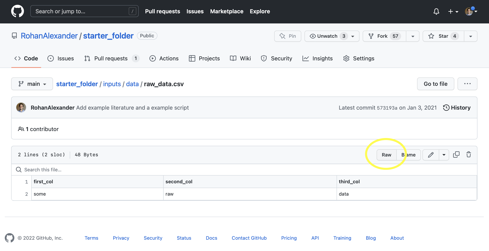

# 저장 및 공유 {#sec-store-and-share}

**권장 선행 학습**

- "연구 데이터 관리를 통한 오픈 사이언스 촉진"(*Promoting Open Science Through Research Data Management*), [@Borghi2022Promoting] 읽기.
    - 데이터 관리의 현주소를 짚어보고, 재현 가능한 연구를 위한 구체적인 전략들을 제안합니다.
- "대규모 교육 연구의 데이터 관리"(*Data Management in Large-Scale Education Research*), [@lewiscrystal] 읽기.
    - 데이터 관리 과정에서 발생하는 다양한 문제와 워크플로, 전문 용어를 정리한 2장 "연구 데이터 관리"에 집중해 보시기 바랍니다.
- "투명하고 재현 가능한 사회 과학 연구"(*Transparent and Reproducible Social Science Research*), [@christensen2019transparent] 읽기.
    - 데이터를 효과적으로 공유하는 방법을 다룬 10장 "데이터 공유"를 꼼꼼히 읽어보세요.
- "데이터셋을 위한 데이터시트"(*Datasheets for Datasets*), [@gebru2021datasheets] 읽기.
    - 데이터의 투명성을 높이기 위한 '데이터시트(Datasheets)'의 개념과 필요성을 소개합니다.
- "데이터 및 그 (불)내용: 기계 학습 연구에서 데이터셋 개발 및 사용에 대한 조사"(*Data and Its (Dis)Contents: A Survey of Dataset Development and Use in Machine Learning Research*), [@Paullada2021] 읽기.
    - 기계 학습 분야에서 효율적인 데이터 관리가 왜 중요한지 상세히 분석합니다.

**핵심 개념 및 기술**

- **FAIR 원칙**은 데이터 공유 및 저장의 대전제입니다. 데이터는 **찾을 수 있고(Findable)**, **접근 가능하며(Accessible)**, **상호 운용 가능하고(Interoperable)**, **재사용 가능해야(Reusable)** 합니다.
- 가장 중요한 첫 단추는 데이터를 내 로컬 컴퓨터를 넘어 타인이 접근할 수 있는 개방된 공간으로 옮기는 것입니다. 이후 누구나 데이터를 쉽게 이해하고 활용할 수 있도록 정교한 문서화와 데이터시트를 구축해야 합니다. 이상적으로는 연구자의 개입 없이도 누구나 데이터를 찾아 쓸 수 있는 환경을 만드는 것이 목표입니다.
- 데이터를 널리 공유하되, 정보의 주체인 '사람'을 존중해야 합니다. 개인 식별 정보를 보호하기 위해 **선택적 공개, 해싱(Hashing), 데이터 시뮬레이션, 차등 프라이버시(Differential Privacy)** 등의 기법을 비용과 효익을 고려하여 적절히 활용해야 합니다.
- 데이터 규모가 커질수록 기존의 처리 방식은 한계에 부딪힙니다. Apache Arrow와 같은 효율적인 데이터 형식과 저장 체계를 탐색하여 대규모 데이터를 효과적으로 관리하는 법을 익힙니다.

**소프트웨어 및 패키지**

- 기본 R [@citeR]
- `arrow` [@arrow]
- `devtools` [@citeDevtools]
- `diffpriv` [@diffpriv]
- `fs` [@fs]
- `janitor` [@janitor]
- `openssl` [@openssl]
- `tictoc` [@Izrailev2014]
- `tidyverse` [@tidyverse]
- `tinytable` [@tinytable]

```{r}
#| message: false
#| warning: false

library(arrow)
library(devtools)
# library(diffpriv)
library(fs)
library(janitor)
library(openssl)
# library(tictoc)
library(tidyverse)
library(tinytable)

```

## 서론

데이터셋을 공들여 구성했다면, 이제 이를 안전하게 저장하고 효율적으로 검색할 수 있도록 관리해야 합니다. 데이터 공유 방식에 정해진 정답은 없지만, 우리가 지향해야 할 최선의 표준(Gold standard)은 분명히 존재하며 이는 현재 활발히 연구되는 분야이기도 합니다 [@lewiscrystal]. @Wicherts2011 의 연구에 따르면, 데이터 공유를 꺼리는 태도는 해당 논문의 증거가 빈약하거나 오류가 많을 가능성이 높다는 것을 암시하기도 합니다. 사실 데이터 저장과 검색은 그 자체로 깊은 전문성이 필요한 영역이지만, 입문자라면 기본 원칙만 잘 지켜도 충분합니다. 내 컴퓨터에만 갇혀 있던 데이터를 외부 세상으로 꺼내놓는 것만으로도 이미 큰 진전을 이룬 셈입니다. 만약 내가 직접 설명해주지 않아도 다른 누군가가 내 데이터를 스스로 찾아내고 사용할 수 있는 수준에 도달한다면, 당신은 이미 상위 그룹에 속한 데이터 과학자입니다. 데이터와 모델, 코드를 이 정도로 재현 가능하게 만드는 것만으로도 @heil2021reproducibility 가 제안한 "브론즈" 표준을 훌륭히 충족하게 됩니다.

**FAIR 원칙**\index{FAIR principles}은 데이터 공유와 관리를 체계적으로 고민할 때 아주 유용한 나침반이 되어줍니다. 이 원칙은 좋은 데이터셋이 다음 네 가지 조건을 갖추어야 함을 강조합니다 [@wilkinson2016fair].

1.  **찾을 수 있음(Findable)**: 데이터셋에 고유하고 영구적인 식별자가 부여되어야 하며, 품질 높은 메타데이터(설명 정보)가 함께 제공되어야 합니다.
2.  **접근 가능함(Accessible)**: 표준화된 통신 프로토콜을 통해 데이터를 누구나 검색할 수 있어야 하며, 설령 데이터가 삭제되더라도 그 존재를 알리는 메타데이터는 유지되어야 합니다.
3.  **상호 운용 가능함(Interoperable)**: 광범위하게 쓰이는 언어와 형식을 사용하여 다른 데이터와 결합하거나 교환하기 쉬워야 합니다.
4.  **재사용 가능함(Reusable)**: 라이선스와 출처가 명확히 명시되어야 하며, 데이터가 생성된 맥락에 대한 충분한 정보가 포함되어야 합니다.

데이터 과학이 매력적인 이유는 그 중심에 늘 '사람'이 있기 때문입니다\index{data science!humans}. 우리가 다루는 데이터는 대부분 직간접적으로 실제 인간의 삶과 연결되어 있습니다. 이는 연구의 **재현성을 위한 데이터 공유**와 **개인 정보 보호** 사이에 필연적인 긴장감을 유발하죠\index{privacy!reproducibility}. 의료계에서는 이미 오래전부터 HIPAA(미국 보건 의료 정보 보호법)\index{Health Insurance Portability and Accountability Act} 같은 체계를 통해 이 문제를 다루어 왔고, 최근에는 유럽의 GDPR\index{General Data Protection Regulation}이나 캘리포니아의 CCPA\index{California Consumer Privacy Act} 같은 강력한 법규들이 전 세계적인 영향을 미치고 있습니다.

데이터 과학자로서 우리의 주된 관심사는 **개인 식별 정보(PII)**를 어떻게 안전하게 보호하느냐에 있습니다\index{privacy!personally identifying information}. 이메일이나 주소 같은 민감한 정보를 암호화(해싱)하거나, 실제 데이터 대신 특징만을 살린 시뮬레이션 데이터를 배포하는 방식 등이 널리 쓰입니다. 최근에는 미국 인구 조사 등에 도입된 **차등 프라이버시(Differential Privacy)** 기술이 새로운 대안으로 떠오르고 있습니다. 개인 정보 보호 수준을 높일수록 데이터의 분석 가치는 떨어질 수밖에 없는 숙명적인 딜레마 속에서\index{data!privacy}, 우리는 비용과 이득을 정교하게 따져 균형 잡힌 결정을 내려야 합니다. 특히 소수 집단이 데이터 공개로 인해 사회적 불이익을 겪지 않도록 세심한 주의가 필요합니다.

데이터셋이 'FAIR' 하다고 해서 그것이 반드시 편향되지 않았거나 윤리적으로 정당하다는 것을 보장하지는 않습니다. FAIR는 어디까지나 데이터의 '사용 편의성'을 정의하는 기술적 기준일 뿐이며, 그 내용의 적절성까지 담보하는 것은 아니기 때문입니다 [@deLima2022].

마지막으로, 본 장에서는 데이터 처리의 **효율성**을 다룹니다. 데이터와 코드가 방대해질수록 이를 공유하고 배포하는 일은 고된 노동이 됩니다. 우리가 효율성을 고민하는 이유는 단순히 속도를 높이기 위해서가 아닙니다. 효율적인 도구 없이는 결코 발견할 수 없었을 세상의 이야기를 더 생생하게 전달하기 위함입니다. 이를 위해 CSV의 한계를 넘어 Apache Arrow나 Parquet 같은 효율적인 형식을 도입하고 데이터베이스를 활용하는 방법을 배우게 될 것입니다.

## 계획

정보를 저장하고 검색하는 기술은 인류의 지적 유산인 **도서관**\index{libraries!curation}의 역사와 궤를 같이합니다. 도서관은 고대부터 어떤 정보를 보존하고 무엇을 폐기할지 결정하는 엄격한 시스템과 프로토콜을 발전시켜 왔습니다. 도서관의 정수는 의도적인 **큐레이션(Curation)**과 조직화에 있습니다\index{curation}. 체계적인 분류 체계는 흩어진 지식을 유기적으로 연결하고, 방대한 정보 속에서 우리가 필요한 것을 즉시 찾아낼 수 있게 해줍니다.

현대 데이터 과학은 정보를 저장하고 전송하기 위해 **인터넷**\index{internet}이라는 거대한 신경망에 전적으로 의존합니다. 1945년 배니버 부시(Vannevar Bush)는 인간의 기억을 확장하기 위해 모든 지식을 연결하고 저장하는 장치인 '메멕스(Memex)'를 구상했습니다 [@vannevarbush]. 이 상상은 훗날 팀 버너스-리(Tim Berners-Lee)의 하이퍼텍스트 제안 [@berners1989information]으로 이어졌고, 오늘날 우리가 정보를 식별하고 공유하는 월드 와이드 웹(WWW)의 뿌리가 되었습니다.

결국 데이터 과학의 여정은 데이터를 안전하게 저장하고 효율적으로 검색하는 과정의 연속입니다. 데이터를 공유할 때는 그 보존 기간과 대상 청중을 신중하게 결정해야 합니다 [@michener2015ten]. 영구적인 보존과 광범위한 공유가 목적이라면 개방적이고 표준화된 형식을 선택하는 것이 필수적입니다 [@hart2016ten]. 반면 분석 과정의 중간 결과물이라면 관리의 강도를 유연하게 조절할 수도 있겠죠. 자기 테이프에서 클라우드에 이르기까지 저장 매체는 끊임없이 변해왔지만, 그 속에서도 데이터의 접근성을 유지하는 것은 여전히 정교한 계획이 필요한 도전 과제입니다.

무엇보다 **수정되지 않은 원본 데이터(Raw data)**를 보존하는 일은 데이터 과학자의 가장 신성한 의무입니다. 원본 데이터가 투명하게 공개되어 있었기에 수많은 데이터 조작이나 부정행위를 잡아낼 수 있었던 사례는 수없이 많습니다 [@simonsohn2013just]. 데이터를 공유하는 행위\index{data!sharing}는 자신의 분석 결과에 대한 신뢰를 증명하는 일인 동시에, 다른 연구자가 새로운 질문을 던질 수 있는 지적 토양을 제공하는 숭고한 기여입니다 [@christensen2019transparent]. 비록 데이터 공유 문화가 완전히 정착되기까지는 시간이 더 필요하겠지만 [@Tierney2021], 공유된 데이터가 더 많은 인용과 협업을 이끌어낸다는 사실은 이미 증명되고 있습니다 [@christensen2019study].

우리는 자신의 작업을 타인의 비판적 검증 앞에 기꺼이 내놓을 수 있는 용기를 가져야 합니다. 이는 때로 불편한 일일 수 있지만, 인류의 지식을 견고하게 쌓아 올릴 수 있는 유일한 길입니다. 예를 들어 알츠하이머병 연구에서 발생한 조작 의혹 [@pillerblots]은 원본 데이터가 공개되지 않았기에 진실을 규명하는 데 훨씬 더 긴 시간과 고통이 따랐음을 기억해야 합니다.

**데이터의 유래(Data provenance)** 또한 결코 간과해서는 안 될 요소입니다. 이는 데이터 한 조각이 어디에서 태어나 어떤 경로를 거쳐 지금의 데이터베이스에 도달했는지를 명확히 기록하는 일입니다 [@Buneman2001, p. 316]. 원본 데이터를 보존하고, 모든 변환 과정을 스크립트로 남기며, 이 모든 것을 투명하게 공유하는 본 서의 워크플로는 바로 이 데이터의 족보를 가장 확실하게 관리하는 방법입니다.

## 공유

### GitHub 활용하기

데이터셋을 저장하고 배포하는 가장 직관적인 방법은 이미 우리의 워크플로에 깊숙이 들어와 있는 **GitHub**를 활용하는 것입니다\index{GitHub!data storage}. 공개 리포지토리에 데이터를 푸시하는 것만으로도 전 세계 누구나 해당 데이터를 즉시 사용할 수 있는 상태가 됩니다. 특히 프로젝트 디렉토리를 체계적으로 구성했다면 원본 데이터, 변환 스크립트, 정돈된 데이터가 한곳에 모여 있을 것이므로, 별다른 노력 없이도 @heil2021reproducibility 의 "브론즈" 표준을 충족하게 됩니다.

구체적인 예시로, ["starter_folder"](https://github.com/RohanAlexander/starter_folder) 리포지토리에 담긴 `raw_data.csv` 파일을 불러와 봅시다. GitHub 웹페이지에서 해당 파일 경로(`inputs` $\rightarrow$ `data` $\rightarrow$ `raw_data.csv`)로 들어간 뒤, 상단의 **"Raw"** 버튼을 클릭하면 파일의 직접 링크를 얻을 수 있습니다 (@fig-githubraw).

{#fig-githubraw width=95% fig-align="center"}

이 URL을 R의 `read_csv()` 함수에 전달하면, 파일을 내 컴퓨터로 직접 내려받지 않고도 실시간으로 데이터를 읽어올 수 있습니다.

```{r}
#| message: false
#| warning: false

data_location <-
  paste0(
    "https://raw.githubusercontent.com/RohanAlexander/",
    "starter_folder/main/data/01-raw_data/raw_data.csv"
  )

starter_data <-
  read_csv(file = data_location,
           col_types = cols(
             first_col = col_character(),
             second_col = col_character(),
             third_col = col_character()
             )
           )

starter_data
```

이 방식은 매우 간편하지만, 데이터셋에 대한 상세한 설명(메타데이터)이나 공식적인 라이선스 정보를 체계적으로 담기에는 한계가 있습니다. 또한 GitHub는 파일당 크기를 100MB로 제한하고 있으므로, 그보다 큰 대용량 데이터를 다룰 때는 **Git LFS(Large File Storage)**라는 별도의 도구를 활용해야 합니다.

### 데이터 전용 R 패키지 제작

그동안 주로 코드 배포를 위해 R 패키지를 사용해 왔다면, 이제는 **데이터 공유**만을 목적으로 패키지를 구성해 볼 수도 있습니다. `babynames`나 `troopdata` 패키지가 좋은 선례입니다. 데이터셋을 R 패키지 형태로 GitHub나 CRAN에 배포하면, 사용자는 단순히 패키지를 로드하는 것만으로 데이터에 접근할 수 있어 매우 편리합니다. 일반 CSV 파일과 달리 패키지는 데이터 정의서와 상세한 문서화를 함께 제공할 수 있다는 독보적인 장점이 있죠.

데이터 전용 패키지를 만드는 기본 과정은 다음과 같습니다 (자세한 내용은 @sec-production 에서 다룹니다).

1.  RStudio에서 **New Project** $\rightarrow$ **New Directory** $\rightarrow$ **R Package**를 선택하고 이름을 `favcolordata`로 정합니다.
2.  프로젝트 내부에 `data` 폴더를 생성합니다.
3.  공유할 데이터를 준비합니다. 여기서는 좋아하는 색상 데이터를 간단히 시뮬레이션해 보죠.

```{r}
#| message: false
#| eval: false

set.seed(853)

color_data <-
  tibble(
    name =
      c(
        "Edward", "Helen", "Hugo", "Ian", "Monica",
        "Miles", "Patricia", "Roger", "Rohan", "Ruth"
      ),
    fav_color =
      sample(
        x = colors(),
        size = 10,
        replace = TRUE
      )
  )
```

4.  패키지에 데이터를 포함하려면 `save()` 함수를 써서 `.rda` 형식으로 `data` 폴더에 저장해야 합니다.

```{r}
#| eval: false
save(color_data, file = "data/color_data.rda")
```

5.  `R` 폴더 안에 `data.R` 파일을 만들고, `roxygen2` 주석(`#'`)을 사용해 데이터 구조와 출처를 꼼꼼히 기록합니다.

```{r}
#| eval: false
#' 좋아하는 색상 데이터셋
#'
#' @description 가상의 인물 10명과 그들이 선호하는 색상 정보를 담고 있습니다.
#' @format 변수 2개를 가진 데이터프레임:
#' \describe{
#'   \item{name}{인물의 이름}
#'   \item{fav_color}{선호하는 색상 이름}
#' }
#' @source \url{https://tellingstorieswithdata.com/10-store_and_share_ko.html}
"color_data"
```

이제 **Build** 탭에서 **Install**을 누르면 로컬 환경에서 `library(favcolordata)`로 데이터를 즉시 사용할 수 있습니다. GitHub에 올린다면 다른 사람들도 `devtools::install_github()`를 통해 당신의 데이터를 손쉽게 내려받아 활용하게 될 것입니다.

이 방식은 체계적인 데이터 관리와 배포를 가능케 하지만, R 사용자에게만 친화적이라는 점과 CRAN 배포 시 용량 제한(최대 5MB)이 있다는 점은 염두에 두어야 합니다.

### 전문 데이터 저장소 예치

데이터셋을 영구적이고 공식적으로 보존하고 싶다면 학술용 **데이터 저장소(Repository)**를 활용하는 것이 최선의 선택입니다\index{data!deposit}. 무엇보다 연구 성과의 인용에 필수적인 **DOI(Digital Object Identifier)**를 발급받을 수 있다는 점이 큰 매력입니다.

[Zenodo](https://zenodo.org)\index{Zenodo}나 [Open Science Framework](https://osf.io)(OSF)\index{OSF}는 전 세계 연구자들이 가장 신뢰하는 저장소입니다. 수많은 데이터 과학자들이 논문을 출판할 때 Zenodo 등에 원본 데이터와 분석 코드를 업로드하여 연구의 재현성을 보장하고 영구적인 접근 링크를 확보합니다 [@chris_carleton_2021_4550688; @katzhansard]. 하버드 대학의 [Dataverse](https://dataverse.harvard.edu)\index{dataverse!Harvard Dataverse} 역시 훌륭한 대안이 됩니다.

이러한 전문 저장소를 활용하면 다음과 같은 이점이 있습니다.
-   데이터 호스팅 및 보존 책임을 신뢰할 수 있는 전문 기관에 맡길 수 있습니다.
-   한번 등록된 데이터는 수정이 불가능하거나 엄격한 버전 관리가 적용되어 '단일 진실 지점'을 확보할 수 있습니다.
-   독립적인 메타데이터가 생성되어 검색 엔진을 통한 데이터 발견이 용이해집니다.
-   대부분의 저장소가 무료로 제공되어 연구자의 경제적 부담을 덜어줍니다.

## 데이터 문서화의 정석

전통적인 **데이터 문서화**\index{data!documentation}의 뿌리는 **데이터 사전(Data dictionary)**\index{data!dictionary}이었습니다. 데이터 사전은 변수 목록과 각 변수에 대한 해설, 데이터의 출처 등을 담은 지식의 색인과 같습니다. @sec-farm-data 장에서 살펴본 미국 지역사회 조사(ACS)의 데이터 사전은 그 방대함과 정교함 면에서 완벽한 교과서라 할 수 있습니다. 본 서가 강조하는 워크플로에 따르면, 데이터 사전은 실제 데이터를 마주하기 전인 **시뮬레이션 단계**부터 작성을 시작하는 것이 좋습니다. 분석을 진행하며 계속 내용을 보완해야겠지만, 초기 단계의 문서화는 데이터 구조에 대한 통찰을 깊게 해줍니다.

최근에는 문서화의 새로운 표준으로 **데이터시트(Datasheets)**\index{data!datasheets} [@gebru2021datasheets]가 각광받고 있습니다. 데이터 사전을 '데이터셋의 상세 부품 목록'이라고 한다면, 데이터시트는 '데이터셋의 영양 성분표이자 품질 보증서'와 같습니다. 데이터시트를 작성하는 일은 우리가 분석에 어떤 데이터를 사용하며, 그 데이터가 어떤 맥락과 의도 속에서 탄생했는지를 세상에 투명하게 밝히는 작업입니다.

:::{.callout-note}

## 거인의 어깨 위에 서서: 팀닛 게브루

팀닛 게브루(Timnit Gebru)\index{Gebru, Timnit}는 분산 인공지능 연구소(DAIR)의 설립자이자 세계적인 AI 윤리 학자입니다. 스탠포드 대학교에서 박사 학위를 받은 후 Microsoft와 Google에서 활동하며 기술의 사회적 책임을 강조해 왔습니다. 대규모 언어 모델의 위험성을 경고한 연구 [@Bender2021]와 얼굴 인식 알고리즘의 편향성을 폭로한 논문 [@buolowini2018gender]은 세상을 놀라게 했죠. 그녀가 제안한 데이터시트 [@gebru2021datasheets] 개념은 이제 책임감 있는 데이터 과학을 위한 필수 도구가 되었습니다.

:::

데이터시트는 변수 설명을 넘어 다음과 같은 본질적인 질문들을 독자에게 던집니다.

-   누가 이 데이터셋을 제작했으며, 그 비용은 어디서 충당되었는가?
-   데이터셋의 완전성은 어느 정도인가? 알려진 누락이나 결함은 무엇인가?
-   파일 내에 어떤 변수들이 존재하며, 반대로 어떤 중요한 정보가 누락되었는가?
-   이 데이터셋의 유지보수 및 업데이트는 향후 어떻게 이루어지는가?

데이터시트 작성은 번거로운 일일 수 있지만, 분석 결과의 공정성과 신뢰성을 확보하기 위해 반드시 거쳐야 하는 과정입니다. @gebru2021datasheets 의 템플릿을 기본으로 활용하되, 연구의 특성에 따라 권력 관계나 사회적 영향에 관한 질문들을 유연하게 추가해 보시기 바랍니다 [@Miceli2022].

## 개인 정보 보호와 데이터 윤리

@christensen2019transparent [p. 180]에 따르면, 연구자가 개별 관측치와 연결된 실제 인물을 알지만 공개용 데이터에서는 이 연결 고리를 끊어버린 경우를 "기밀(Confidential)" 데이터라고 부릅니다. 반면 연구자조차 누가 누구인지 모르는 상태라면 이를 "익명(Anonymous)" 데이터라고 정의하죠\index{privacy!personally identifying information}.

**개인 식별 정보(Personally Identifying Information, PII)**는 데이터 속의 관측치를 실제 인물과 연결할 수 있게 해주는 핵심 정보입니다. 사람을 다루는 데이터 과학에서 PII 보호는 그 무엇보다 중요한 과제입니다. 이메일, 이름, 상세 주소 등이 대표적이죠. 때로는 개별 변수 자체는 문제가 없어 보여도 특정인에게는 PII가 될 수 있습니다. 예를 들어, 인구 통계 조사에서 '100세 이상'의 초고령자 정보는 그 희소성 때문에 주소 등과 결합하면 특정인을 역추적하기 매우 쉽습니다.

이런 위험을 방지하기 위해 @sec-farm-data 에서 배운 '데이터 검열' 기법을 활용할 수 있습니다. 예를 들어 나이를 0세부터 90세까지 기록하고, 그 이상의 고령자는 모두 '90세 이상'으로 묶어버리는 식입니다. 물론 이런 조치는 개인 정보 보호를 강화해주지만, 데이터의 정확도(유용성)는 떨어뜨리는 결과를 낳습니다. 결국 우리는 정보 보호와 분석 유용성 사이에서 최적의 균형점을 찾아야 하는 숙명을 안고 있습니다. 더 큰 문제는 여러 데이터셋을 결합했을 때 발생하는 재식별(Re-identification) 위험인데, 이를 수학적으로 해결하려는 시도가 바로 차등 프라이버시입니다.

우리의 목표는 '합리적인 사람의 기대치'를 충족하는 수준의 보호 체계를 갖추는 것입니다\index{privacy!personally identifying information}. 이는 단순히 모든 데이터를 감추는 것을 넘어, 보호의 비용과 정보 공유의 이득을 면밀히 비교해야 함을 뜻합니다. 과거 국가 안보 분야에서는 문서를 지나치게 비밀로 분류하여 정보의 흐름을 막는 부작용이 지적되기도 했습니다 [@overclassification]. 데이터 과학에서도 마찬가지입니다. 완벽한 익명화가 불가능하다는 이유로 데이터 공유 자체를 포기한다면, 연구를 통한 사회적 발전이라는 더 큰 가치를 놓치게 될 수 있습니다. 우리는 '예방 원칙'에만 매몰되지 말고, 투명하고 합리적인 기준에 따라 데이터의 유용성을 살리는 길을 찾아야 합니다.

**무작위 응답(Randomized response)** 기법은 익명성을 보장하는 매우 영리한 통계적 해법입니다\index{privacy!randomized response}. 응답자가 민감한 질문에 답하기 전 동전을 던지게 하되, 연구자에게는 결과를 보여주지 않습니다. 동전이 앞면이면 진실을 말하고, 뒷면이면 무조건 '예'라고 답하게 하는 식이죠. 연구자는 나중에 수학적으로 확률을 보정해 전체 추정치를 얻을 수 있지만, 특정 응답자가 실제로 어떤 답을 했는지는 결코 알 수 없습니다. 이는 주로 @sec-farm-data 의 눈덩이 표집 등에서 민감한 사회적 주제를 다룰 때 요긴하게 쓰입니다. 다만 이 방식은 특정 질문에만 최적화된 데이터셋을 생성하므로 데이터의 일반적인 활용도는 낮아질 수 있습니다.

@zook2017ten 은 애초에 꼭 필요한 정보가 아니라면 수집조차 하지 말라고 권고합니다\index{privacy!not gathering data}. 전화번호가 분석에 필수적이지 않다면, 나중에 이를 보호하느라 애쓰는 대신 처음부터 묻지 않는 것이 현명하다는 뜻입니다.
유럽의 **GDPR**\index{General Data Protection Regulation}과 미국의 **HIPAA**\index{Health Insurance Portability and Accountability Act}는 현대 데이터 환경을 규정하는 가장 강력한 법적 기둥입니다. GDPR은 모든 개인 데이터를 폭넓게 다루며, 식별 가능한 자연인과 관련된 모든 정보를 엄격히 규제합니다 [@gdpr]. HIPAA는 미국의 의료 정보 보호에 집중하며, 환자의 정보 접근권과 승인권을 명문화하고 있습니다 [@annas2003hipaa]. 하지만 HIPAA는 특정 기관에만 적용된다는 한계가 있어, 소셜 미디어의 건강 관련 게시물이나 활동량 데이터 등은 사각지대에 놓여 있는 실정입니다 [@Cohen2018]. 이런 데이터들은 엄청난 상업적 가치를 지니고 있어 기업 간 거래의 대상이 되기도 하죠 [@ibmdataset].

이제 PII를 보호하면서도 분석의 가치를 살릴 수 있는 구체적인 기술들을 살펴보겠습니다. 개별 변수를 넘어 여러 변수의 조합이 일으키는 '재식별' 위험을 막는 것이 우리의 주된 과제입니다.

### 암호화 해싱 (Hashing)

**암호화 해시(Cryptographic hash)**는 동일한 입력에 대해 항상 고정된 길이의 고유한 출력을 내놓지만, 출력값만으로는 절대 입력값을 역추적할 수 없는 '단방향' 변환 기술입니다\index{data!privacy}. 데이터 과학에서는 개인 정보를 노출하지 않으면서도 서로 다른 데이터셋에 흩어진 동일 인물을 식별하고 연결하는 용도로 널리 쓰입니다.

해싱의 원리를 간단한 사례로 익혀보죠. 여기 이름과 나이가 담긴 비밀 데이터가 있습니다.

```{r}
#| message: false
#| warning: false

some_private_information <-
  tibble(
    names = c("Rohan", "Monica"),
    ages = c(36, 35)
  )

some_private_information
```

단순히 이름의 첫 글자만 남기거나 나이를 로마 숫자로 바꾸는 방식은 위험합니다. "Rohan"과 "Robert"가 똑같이 "R"이 되어 데이터가 꼬이는 '충돌'이 발생하거나, 로마 숫자를 아는 사람에게 정보가 즉시 유출되기 때문입니다.

따라서 실제 연구에서는 `openssl` 패키지의 `md5()`와 같이 수학적으로 검증된 해시 알고리즘을 사용합니다.

```{r}
#| message: false
#| warning: false

some_private_information |>
  mutate(
    md5_names = md5(names),
    md5_ages = md5(ages |> as.character())
  )
```

이 해시 값을 공유하면 원래 정보를 알아내기 매우 어렵습니다. 하지만 여전히 빈틈은 있습니다. 만약 누군가 내 데이터셋에 "Rohan"이 있다는 사실을 이미 알고 있다면, 직접 `md5("Rohan")`을 계산해 보고 내가 공개한 해시 값과 비교하여 본인임을 확신할 수 있기 때문입니다. 이를 방지하기 위해 입력 값에 무작위 문자열인 **솔트(Salt)**를 덧붙여 해싱하는 기술을 사용합니다. 솔트 정보만 유출되지 않는다면 외부인이 데이터를 역추적하는 것은 불가능에 가까워집니다.

```{r}
#| message: false
#| warning: false

# 솔트를 추가한 보안 해싱 예시
some_private_information |>
  mutate(names_salted = paste0(names, "_secret_key_853")) |>
  mutate(md5_salted = md5(names_salted))
```

### 차등 프라이버시 (Differential Privacy)

**차등 프라이버시**\index{privacy!differential privacy}는 개인 정보 보호를 위한 수학적 약속입니다. 이는 특정 기술이라기보다는, 데이터 분석 알고리즘이 충족해야 하는 엄격한 보안 표준에 가깝습니다. 핵심 아이디어는 **"데이터셋에 특정 개인의 정보가 포함되든 아니든, 분석 결과값에 실질적인 차이가 없어야 한다"**는 것입니다.

:::{.callout-note}

## 거인의 어깨 위에 서서: 신시아 드워크

신시아 드워크(Cynthia Dwork)\index{Dwork, Cynthia}는 하버드 대학교 컴퓨터 과학과 교수로, 차등 프라이버시 개념을 정립한 선구자입니다 [@dwork2006calibrating]. 이 획기적인 공로로 괴델상과 도널드 커누스 상을 수상했죠. 그녀의 연구는 오늘날 Apple, Google, 미국 인구 조사국 등이 개인 정보를 철저히 보호하면서도 방대한 사용자 데이터를 분석할 수 있게 하는 든든한 기술적 토대가 되었습니다.

:::

데이터 프라이버시의 본질적인 어려움은 '정확한 정보'를 얻는 것과 '완벽한 익명성'을 지키는 것이 서로 충돌한다는 점입니다 [@Dwork2013, p. 6]. 차등 프라이버시는 데이터에 미세한 수학적 **노이즈**를 추가함으로써 이 문제를 해결합니다. 특정인이 데이터셋에 있든 없든 결과가 거의 동일하게 나오도록 설계하여, 거꾸로 데이터를 추적해 개인을 식별하는 행위를 무력화하는 원리입니다.

예를 들어, 어느 교수가 수업의 평균 점수를 공개하려 합니다. 정확한 수치를 공개하면, 동료들의 점수를 알고 있는 영리한 학생은 나머지 학생의 점수를 역추적해낼 수도 있습니다.

데이터셋은 개인 정보 보호의 강도에 따라 차등적으로 '프라이빗'해집니다. 이는 한 사람의 데이터 유무가 결과값을 얼마나 변화시키는지에 달려 있죠. 분석가는 보안을 위해 어느 수준의 정확도를 포기할지 결정해야 합니다. 이는 정보 노출로 인한 사회적 비용과 데이터 활용을 통한 사회적 효익 사이에서 균형을 찾는 매우 섬세한 작업입니다. 현재 미국 인구 조사국이나 Apple [@differentialprivacyatapple] 같은 기관들은 이 기술을 실무에 적용하여 사용자 프라이버시를 지키고 있습니다.

실제 작동 원리를 시뮬레이션해 보죠.

```{r}
set.seed(853)
grades <- tibble(score = sample(1:100, size = 10, replace = TRUE))

# 실제 평균값
mean(grades$score)
```

교수는 정확한 값 대신, 여기에 약간의 무작위 노이즈를 섞은 값을 발표함으로써 개별 학생의 점수가 노출되는 것을 방지합니다.

```{r}
# 노이즈가 추가된 안전한 평균값
mean(grades$score) + runif(n = 1, min = -2, max = 2)
```

차등 프라이버시의 핵심 매개변수는 **앱실론($\epsilon$)**입니다. 이 값이 작을수록 더 강력한 개인 정보를 제공하지만(노이즈가 큼), 데이터의 정확도는 그만큼 희생됩니다. 반대로 $\epsilon$이 크면 데이터는 정확해지지만 개인 정보 노출 위험은 커집니다. 이러한 조절 가능한 보안 체계는 미국 인구 조사 [@ruggles2019differential]나 IT 대기업의 데이터 수집 시스템 [@differentialprivacyatapple]에서 실제로 구현되어 활발히 쓰이고 있습니다.

## 데이터 관리의 효율성

많은 경우 "완벽한 것보다 일단 분석을 완료하는 것이 낫다"는 격언이 통합니다. 불필요한 기술적 최적화에 시간을 쏟기보다는 결과물을 내놓는 것이 더 중요하니까요\index{efficiency!data}. 하지만 데이터셋 규모가 일정 수준을 넘어서면 기존의 방식(예: 거대한 단일 CSV 파일)은 한계를 드러냅니다. 이때부터는 '효율성'이 단순한 선택의 문제를 넘어 분석의 성패를 가르는 핵심 요인이 됩니다. 이번 섹션에서는 여러 파일을 효율적으로 불러오는 반복 기법을 살펴본 뒤, **Apache Arrow**와 **Parquet** 형식을 통한 대규모 데이터 최적화 전략을 배웁니다. 관계형 데이터베이스(SQL)를 활용하는 심화 내용은 [온라인 부록 -@sec-sql]에서 자세히 다루겠습니다.

### 반복 작업의 자동화 (Iteration)

데이터 관리 효율을 높이는 가장 확실한 방법은 거대한 데이터셋을 관리 가능한 작은 조각으로 나누는 것입니다\index{efficiency!data iteration}. 예를 들어, 10년 치 로그 데이터를 하나의 거대한 CSV 파일에 몰아넣는 대신, 연도별이나 월별 파일로 분할하여 저장하는 식이죠. 이를 위해서는 수많은 파일을 한꺼번에, 그리고 빠르게 읽어들일 수 있는 프로그래밍 기법이 필요합니다.

여러 파일을 읽어 하나의 티블(tibble)로 결합하는 작업은 실무에서 매우 빈번하게 발생합니다\index{efficiency!multiple files}\index{data!read multiple files}. 1년 치 댓글 데이터가 월별 CSV 파일로 흩어져 있는 상황을 가정해 봅시다. `purrr` 패키지의 `walk()`나 `map()` 함수, 그리고 `fs` 패키지를 조합하면 이 과정을 깔끔하게 자동화할 수 있습니다.

먼저 테스트용 데이터를 생성해 보겠습니다. 헤비 유저가 많은 소셜 미디어의 특성을 살려 지수 분포(`rexp`)에서 추출한 가상의 댓글 데이터를 월별 파일로 나누어 저장하겠습니다\index{distribution!exponential}.

```{r}
#| message: false
#| warning: false

library(fs)
library(purrr)

# 데이터 폴더 생성 (기존 폴더가 있다면 삭제 후 재생성)
if (dir_exists("user_data")) dir_delete("user_data")
dir_create(path = "user_data")

set.seed(853)

# 월별 데이터를 시뮬레이션하고 저장하는 전용 함수
simulate_and_save_data <- function(month) {
  num_obs <- 1000
  file_name <- paste0("user_data/", month, ".csv")
  user_comments <-
    tibble(
      user = 1:num_obs,
      month = rep(month, num_obs),
      comments = rexp(n = num_obs, rate = 0.3) |> round()
    )
  write_csv(x = user_comments, file = file_name)
}

# 1월부터 12월까지 순회하며 데이터 생성 실행
walk(month.name |> tolower(), simulate_and_save_data)
```

이제 생성된 12개의 파일을 한 번에 불러와 보죠. 먼저 `dir_ls()` 함수를 사용하여 폴더 내 모든 CSV 파일의 목록을 확보합니다.

```{r}
#| message: false

# CSV 파일 목록 가져오기
files_of_interest <- dir_ls(path = "user_data/", glob = "*.csv")

# 목록의 앞부분 확인
head(files_of_interest)
```

이 목록을 `read_csv()` 함수에 직접 전달하면, `tidyverse`는 영리하게도 파일들을 순차적으로 읽어 하나의 데이터프레임으로 합쳐줍니다. `purrr::map_dfr()`의 `.id` 인자를 활용하면 각 행이 어떤 파일에서 왔는지 출처를 남길 수 있어 더욱 정교한 관리가 가능해집니다.

```{r}
#| message: false

# 모든 파일을 읽어 하나의 통합 데이터셋으로 결합
year_of_data <-
  files_of_interest |>
  map_dfr(read_csv, .id = "source_file",
          col_types = cols(
            user = col_double(),
            month = col_character(),
            comments = col_double()
          )) |>
  mutate(source_file = str_remove(source_file, "user_data/"))

head(year_of_data)
```

### Apache Arrow와 Parquet의 위력

데이터 과학계에서 CSV 파일은 가장 보편적인 표준이지만, 데이터 규모가 커질수록 명백한 한계를 보입니다\index{data science!CSV alternatives}\index{data science!parquet}\index{efficiency!parquet}. CSV는 텍스트 기반이라 사람이 읽기 좋다는 장점은 있지만, 데이터의 타입(클래스) 정보가 보존되지 않고 파일 용량이 매우 크다는 치명적인 약점이 있습니다.

이에 대한 강력한 대안으로 부상한 것이 **Apache Arrow**와 **Parquet** 형식입니다. Parquet은 데이터를 행(Row)이 아닌 **열(Column)** 단위로 저장하는 이진(Binary) 파일 형식입니다\index{Apache Arrow!parquet}\index{parquet}.

:::{.callout-note}

## 거인의 어깨 위에 서서: 웨스 맥키니

웨스 맥키니(Wes McKinney)\index{McKinney, Wes}는 현대 데이터 과학 인프라의 상징적인 인물입니다. Python의 필수 라이브러리인 `pandas`를 창시하고 베스트셀러 *파이썬 라이브러리를 활용한 데이터 분석* [@pythonfordataanalysis]을 집필했습니다. 그는 현재 데이터가 서로 다른 언어와 시스템 사이를 빠르고 효율적으로 이동할 수 있게 돕는 Apache Arrow 프로젝트를 이끌며 데이터 분석의 지평을 넓히고 있습니다.

:::

Parquet 형식을 도입하면 CSV 대비 압도적인 이점을 누릴 수 있습니다\index{parquet!benefits}.

-   **용량의 혁신**: 정교한 압축 알고리즘을 통해 파일 크기를 비약적으로 줄여줍니다.
-   **유형 보존(Schema preservation)**: 날짜, 팩터 등 데이터의 타입 정보를 파일 자체에 저장하므로, 다시 읽어들일 때 변환 작업을 반복할 필요가 없습니다.
-   **압도적 속도**: 필요한 열만 선택적으로 읽어들일 수 있어 대용량 데이터를 처리할 때 비교할 수 없는 속도를 제공합니다.

R에서는 `arrow` 패키지의 `read_parquet()`와 `write_parquet()` 함수를 통해 이 강력한 기능들을 CSV 함수들과 거의 동일한 방식으로 편리하게 사용할 수 있습니다.

```{r}
#| message: false
#| warning: false

num_draws <- 1000000

# 100만 개의 무작위 데이터 생성
a_million_random_digits <-
  tibble(
    numbers = runif(n = num_draws),
    letters = sample(x = letters, size = num_draws, replace = TRUE),
    states = sample(x = state.name, size = num_draws, replace = TRUE),
  )

# 두 형식으로 저장 및 크기 비교
write_csv(x = a_million_random_digits,
          file = "a_million_random_digits.csv")

write_parquet(x = a_million_random_digits,
              sink = "a_million_random_digits.parquet")

file_size("a_million_random_digits.csv")
file_size("a_million_random_digits.parquet")

```

```{r}
#| eval: true
#| include: false

file.remove("a_million_random_digits.csv")
file.remove("a_million_random_digits.parquet")

```

`write_parquet()`로 파일을 생성하고 `read_parquet()`로 불러올 수 있습니다. @tbl-filesize 에서 확인할 수 있듯이, 데이터 규모가 커질수록 Parquet의 파일 크기 감소 효과와 읽기/쓰기 속도 향상은 더욱 드라마틱해집니다. 이는 과거에는 불가능했던 대규모 분석을 실현 가능하게 만들어주는 혁신적인 기술입니다\index{parquet!benefits}.

```{r}
#| label: tbl-filesize
#| echo: false
#| eval: true
#| message: false
#| tbl-cap: "데이터 규모 증가에 따른 CSV와 Parquet의 파일 크기 및 처리 시간 비교"

read_csv("inputs/data/file_size_comparison.csv", show_col_types = FALSE) |>
  mutate(
    draws = format(draws, scientific = TRUE, big.mark = ","),
    csv_size = as_fs_bytes(csv_size),
    parquet_size = as_fs_bytes(parquet_size)
  ) |>
  clean_names() |>
  select(draws,
         csv_size,
         csv_write,
         csv_read,
         parquet_size,
         parquet_write,
         parquet_read) |>
  tt() |>
  style_tt(j = 1:7, align = "llrrlrr") |>
  format_tt(digits = 2,
            num_mark_big = ",",
            num_fmt = "decimal") |>
  setNames(
    c(
      "데이터 개수",
      "CSV 크기",
      "CSV 쓰기 (초)",
      "CSV 읽기 (초)",
      "Parquet 크기",
      "Parquet 쓰기 (초)",
      "Parquet 읽기 (초)"
    )
  )

```

@arrowcookbook 은 다양한 실무 작업에 대한 추가 정보를 제공하며, @navarro2021getting 은 구체적인 구현 예시를, @navarroworkshop 은 광범위한 학습 자료를 제공하고 있습니다. Parquet 파일을 모든 프로젝트의 기본 데이터셋 형식으로 써야 하는지에 대해서는 이견이 있을 수 있지만, 데이터 타입의 지속성과 효율성 측면에서 CSV 외에 Parquet을 적극 활용해야 할 이유는 매우 충분합니다.

이 책의 나머지 부분에서도 우리는 Parquet 형식을 적극적으로 사용할 예정입니다.

## 연습 문제

### 실습 {.unnumbered}

1. *(계획)* 다음 시나리오를 구상해 보세요. "대형 언론사에서 구독자들의 커뮤니티 활동을 관리하고 있습니다. 1년 동안 대다수의 구독자는 댓글을 거의 달지 않지만, 아주 극소수의 열성 팬들이 전체 댓글의 대부분을 차지하는 불균형한 분포를 보입니다." 이 데이터셋의 구조를 상상해 보고, 전체 관측치를 효과적으로 보여줄 수 있는 그래프를 스케치해 보세요.
2. *(시뮬레이션)* 위 시나리오를 바탕으로 데이터를 시뮬레이션해 보세요. 적절한 확률 분포를 신중하게 선택하고, 생성된 데이터를 검증할 수 있는 5가지 테스트 코드를 작성해 보세요. 결과 코드가 포함된 GitHub Gist 링크를 제출하십시오.
3. *(수집)* 그러한 가상의 데이터가 아닌, 유사한 실제 데이터셋을 얻을 수 있는 공공 출처를 찾아 설명해 보세요.
4. *(탐색)* `ggplot2`를 사용하여 1단계에서 스케치한 그래프를 시뮬레이션 데이터로 구현해 보세요. 코드가 포함된 GitHub Gist 링크를 제출하십시오.
5. *(소통)* 자신이 수행한 일련의 과정을 두 단락 내외로 요약하여 설명해 보세요.

### 퀴즈 {.unnumbered}

1. @wilkinson2016fair 를 참고하여, 본인이 익숙한 데이터셋 하나를 골라 FAIR 원칙의 관점에서 논의해 보세요. (데이터셋 요약 한 단락, 각 원칙별 한 단락씩 작성)
2. 시뮬레이션한 데이터셋을 포함한 R 패키지를 직접 제작해 보세요. GitHub에 푸시한 뒤, 해당 패키지를 원격으로 설치하는 코드(예: `devtools::install_github("여러분의계정/favcolordata")`)를 제출하십시오.
3. @gebru2021datasheets 에 따르면, 데이터시트는 데이터셋의 어떤 측면들을 문서화해야 합니까? (모두 선택)
    a. **구성 요소(Composition)**
    b. **권장 사용법(Recommended Use)**
    c. **제작 동기(Motivation)**
    d. **수집 과정(Collection Process)**
4. 실제 사례와 참고 문헌을 활용하여 사람의 '이름'이 PII(개인 식별 정보)에 해당하는지 여부를 비판적으로 논의해 보세요. (최소 세 단락 이상 작성)
5. `md5()` 알고리즘을 사용했을 때 "Monica"라는 문자열의 해시 값은 무엇입니까?
    a. 243f63354f4c1cc25d50f6269b844369
    b. 02df8936eee3d4d2568857ed530671b2
    c. **09084cc0cda34fd80bfa3cc0ae8fe3dc**
    d. 1b3840b0b70d91c17e70014c8537dbba
6. `palmerpenguins` 패키지의 `penguins` 데이터를 CSV와 Parquet 형식으로 각각 저장해 보세요. 두 파일의 크기는 대략 얼마입니까?
    a. 12.5K; 6.04K
    b. **14.9K; 6.04K**
    c. 14.9K; 5.02K
    d. 12.5K; 5.02K

### 수업 활동 {.unnumbered}

- `usethis::git_vaccinate()` 함수를 실행해 보세요. 이 함수는 무슨 일을 하며, 왜 중요한가요?
- 다음 코드를 시뮬레이션 스크립트에 추가하고 린팅(Lint)을 수행해 보세요. 도출된 권장 사항에 대해 어떻게 생각하시나요?

```{r}
#| echo: true
#| eval: false

set.seed(853)
tibble(
  age_days=runif(n=10,min=0,max=36500),
  age_years=age_days%/%365
)

```

- 1,000만 개의 행과 최소 5개의 변수(날짜 변수 포함)를 가진 데이터셋을 시뮬레이션해 보세요. 이를 CSV와 Parquet 형식으로 각각 저장했을 때 파일 크기 차이를 확인해 보세요.
- 시뮬레이션한 데이터셋을 위한 가상의 데이터시트를 작성해 보고 학급에서 논의해 보세요.
- `left_join()`으로 두 데이터셋을 결합할 때, 실수로 행이 중복되거나 누락되는 일을 막기 위한 검증 테스트 코드를 작성해 보세요.

```{r}

set.seed(853)

# 여기서 설정을 고민해 보세요.

main_data <-
  tibble(
    participant_id = stringi::stri_rand_strings(n = 100, length = 5),
    education_value = sample(
      x = 1:5,
      size = 100,
      replace = TRUE
    )
  )

# 레이블 데이터를 준비합니다.

education_labels <-
  tibble(
    education_value = 1:5,
    education_label = c(
      "일부 고등학교",
      "고등학교 졸업",
      "일부 대학 교육",
      "학사 학위",
      "대학원 학위"
    )
  )

# 두 데이터를 결합합니다.

joined_data <-
  main_data |>
  left_join(education_labels, by = join_by(education_value))

# 결합이 제대로 되었는지 확인할 테스트를 아래에 추가해 보세요.

```

- 다음 코드를 수정하여 "T" 대신 반드시 "TRUE"를 써야 하는 이유를 증명해 보세요. (힌트: "T"에 "FALSE"를 할당해 보세요.)

```{r}

set.seed(853)
# 여기서 실험해 보세요.
sample(x = 1:5, size = 5, replace = T)

```

- @lewiscrystal 의 한 장을 골라 핵심 내용을 슬라이드 5장 분량으로 요약하여 발표해 보세요.
- 학우들과 팀을 이루어 평가 결과 데이터셋 (@tbl-classmarks) 실습을 진행해 보세요.
    - 이름을 해시화하되 솔트는 쓰지 말고 교환해 보세요. 원래 이름을 역추적할 수 있나요?
    - 데이터를 시뮬레이션할 때 어떤 특성이 본질적이고 어떤 것이 부차적인지 토론해 보세요.
    - 학급 평균에서 한 명의 점수만 빼고 공유했을 때, 빠진 학생의 점수를 맞힐 수 있나요? (차등 프라이버시의 필요성을 체감해 보세요.)

```{r}
#| label: tbl-classmarks
#| tbl-cap: "특정 수업의 가상 성적 데이터셋 (100점 만점)"

library(babynames)

set.seed(853)

class_marks <-
  tibble(
    student = sample(
      x = babynames |> filter(prop > 0.01) |>
        select(name) |> unique() |> unlist(),
      size = 10,
      replace = FALSE
    ),
    mark = rnorm(n = 10, mean = 50, sd = 10) |> round(0)
  )

class_marks |>
  tt() |>
  style_tt(j = 1:2, align = "lr") |>
  setNames(c("학생 이름", "시험 점수"))

```

### 과제 {.unnumbered}

평소 관심 있었지만 데이터시트가 없는 공개 데이터셋 하나를 찾아보세요 [@gebru2021datasheets]. 해당 데이터셋의 "제작 동기, 구성, 수집 과정, 권장 사용법" 등을 충실히 담은 데이터시트를 작성해 보세요. ["starter_folder"](https://github.com/RohanAlexander/starter_folder)의 템플릿을 활용해도 좋습니다.

Quarto를 사용하여 제목, 저자, 날짜, GitHub 리포지토리 링크, 적절한 인용을 포함한 보고서를 작성하세요. 동료와 과제를 교환하여 피드백을 주고받은 뒤 내용을 보완하고, 최종 결과물을 PDF로 제출하세요.

### 논문 과제 {.unnumbered}

:::{.content-visible when-format="pdf"}

본 장을 마친 후에는 [온라인 부록](https://tellingstorieswithdata.com/23-assessment.html)에 수록된 *Dysart* 논문을 분석해 보는 것이 좋습니다.

:::

:::{.content-visible unless-format="pdf"}

본 장을 마친 후에는 [온라인 부록 -@sec-papers]에 수록된 *Dysart* 논문을 분석해 보는 것이 좋습니다.

:::
