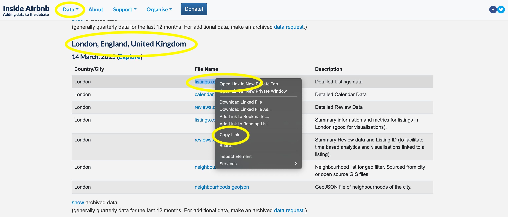

# 탐색적 데이터 분석 {#sec-exploratory-data-analysis}

**선수 지식**

- 존 투키(John Tukey)의 저작 《데이터 분석의 미래》(원제: *The Future of Data Analysis*) [@tukey1962future] 읽기.
  - 20세기 최고의 통계학자 중 한 명인 존 투키는 이 논문의 제1부 "일반적 고려 사항"을 통해 데이터를 통해 무언가를 배운다는 것이 무엇인지, 시대를 앞서간 통찰을 제시했습니다.
- 《데이터 정리를 위한 모범 사례》(원제: *Best Practices in Data Cleaning*) [@bestpracticesindatacleaning] 읽기.
  - 특히 결측치나 불완전한 데이터를 다루는 법을 상세히 설명한 제6장 "결측 또는 불완전 데이터 처리"를 중점적으로 살펴보세요.
- 《데이터 과학을 위한 R》(원제: *R for Data Science*) [@r4ds] 읽기.
  - 실질적인 EDA 작업 예시를 풍부하게 제공하는 제11장 "탐색적 데이터 분석"을 참고하세요.
- 비디오 강좌 《전체 게임》(원제: *The Whole Game*) [@hadleycodes] 시청.
  - 전문가가 데이터를 탐색하며 어떻게 실수하고, 또 어떻게 그 실수를 바로잡아 나가는지 생생하게 볼 수 있는 훌륭한 자료입니다.

**핵심 개념 및 기술**

- 탐색적 데이터 분석(Exploratory Data Analysis, EDA)은 데이터를 면밀히 살펴보고 그래프, 표, 모델을 구성하며 새로운 데이터셋과 친밀해지는 과정입니다. 우리는 크게 세 가지 측면을 이해하고자 합니다.
  1. 개별 변수 자체의 통계적 특성 및 분포
  2. 변수 간의 관계 속에서 나타나는 상호작용과 의미
  3. 존재하지 않는 데이터(결측치)의 맥락과 기제
- EDA 과정을 통해 데이터셋의 잠재적인 문제점을 파악하며, 이것이 이후 분석 결정에 어떤 영향을 미칠지 이해합니다. 특히 결측치(Missing values)와 이상치(Outliers)를 식별하고 처리하는 법을 익힙니다.

**소프트웨어 및 패키지**

- Base R [@citeR]
- `arrow` [@arrow]
- `janitor` [@janitor]
- `lubridate` [@GrolemundWickham2011]
- `mice` [@mice]
- `modelsummary` [@citemodelsummary]
- `naniar` [@naniar]
- `opendatatoronto` [@citeSharla]
- `tidyverse` [@tidyverse]
- `tinytable` [@tinytable]

```{r}
#| message: false
#| warning: false

library(arrow)
library(janitor)
library(lubridate)
library(mice)
library(modelsummary)
library(naniar)
library(opendatatoronto)
library(tidyverse)
library(tinytable)

```

## 서론

> 데이터 분석의 미래는 큰 발전, 실제 어려움의 극복, 그리고 모든 과학 기술 분야에 대한 훌륭한 서비스 제공을 포함할 수 있습니다. 그럴까요? 그것은 우리에게 달려 있습니다. 비현실적인 가정, 임의의 기준, 실제와 무관한 추상적인 결과의 부드러운 길 대신 실제 문제의 험난한 길을 택하려는 우리의 의지에 달려 있습니다. 누가 이 도전에 나설까요?
> 
> @tukey1962future [p. 64].

탐색적 데이터 분석(Exploratory Data Analysis, EDA)\index{exploratory data analysis}은 분석이 끝날 때까지 멈추지 않는 과정입니다. 이는 데이터를 적극적으로 탐색하고 데이터와 친숙해지는 능동적인 여정입니다. 흙을 만지며 그 상태를 살피는 농부처럼, 데이터 분석가 역시 데이터의 모든 굴곡과 측면을 속속들이 파악해야 합니다. 데이터가 어떻게 변하는지, 무엇을 말하고 무엇을 숨기는지, 그리고 그 한계가 어디까지인지 알아야 합니다. EDA는 바로 이러한 작업을 수행하는 비구조화된 과정입니다.

EDA는 그 자체로 목적이라기보다 목표를 향해 나아가는 과정에 가깝습니다.\index{exploratory data analysis!how to} EDA의 결과물은 최종 보고서나 논문의 '데이터' 섹션을 구성하는 뼈대가 되지만, 분석 과정에서 생성한 수많은 그래프나 표가 모두 최종 본문에 포함되지는 않습니다. 효과적인 EDA를 위해서는 별도의 Quarto 문서를 열어 자유롭게 코드를 실행하고, 그 과정에서 스쳐 지나가는 데이터에 대한 의문이나 가설들을 즉시 메모해두는 것이 좋습니다. 이전 코드를 지우지 않고 계속 덧붙여 나가며 기록하는 이 '노트북(Notebook)' 방식은 장차 수행될 정밀 분석의 가장 든든한 가이드라인이 될 것입니다.

EDA는 정해진 공식이 있는 고수준의 작업이 아닙니다. 분석가는 시각화뿐만 아니라 사용 가능한 모든 수단을 동원해야 합니다 [@staniak2019landscape]. 데이터를 직접 훑어보고, 요약 통계량을 계산하며, 간단한 모델을 만들어보는 과정이 반복됩니다. 핵심은 세밀하게 깎아내는 완벽함보다, **빠르게 반복(Iterate)**하며 데이터를 다각도에서 입체적으로 이해하는 것입니다. 흥미로운 사실은, 현재 가진 데이터를 철저히 파악하려는 노력이 때로는 우리에게 '지금 없는 데이터가 무엇인지'를 깨닫게 해준다는 점입니다.

성공적인 EDA를 위해 우리는 다음 세 가지 질문에 집중합니다.\index{exploratory data analysis!aims}

- **개별 변수의 분포와 속성**: 각 변수는 어떤 범위에 있으며 어떤 형태를 띠고 있는가?
- **변수 간의 관계**: 어떤 변수가 서로 밀접하게 연결되어 움직이는가?
- **존재하지 않는 것(Missingness)**: 무엇이 누락되었으며, 왜 누락되었는가?

EDA에는 정답이 없습니다. 과정과 도구는 데이터의 특성과 분석 목적에 따라 끊임없이 변합니다. 본 장에서는 미국 주의 인구 통계부터 토론토의 지하철 지연, 런던의 에어비앤비 목록까지 다양한 사례를 통해 EDA의 실전 접근법을 살펴보겠습니다. 또한 [@sec-farm-data] 에서 다루었던 결측 자아(Missing self)로 돌아가 데이터를 더 깊이 이해하는 법을 배웁니다.

## 1975년 미국 인구 및 소득 데이터

첫 번째 예시로 1975년 기준 미국 주 인구\index{United States}를 고려합니다. 이 데이터셋은 `state.x77`과 함께 R에 내장되어 있습니다.\index{exploratory data analysis} 데이터셋은 다음과 같습니다.

```{r}
#| message: false
#| warning: false

us_populations <-
  state.x77 |>
  as_tibble() |>
  clean_names() |>
  mutate(state = rownames(state.x77)) |>
  select(state, population, income)

us_populations

```

데이터를 빠르게 훑어보기 위한\index{exploratory data analysis} 첫 단추는 `head()`와 `tail()`로 데이터의 시작과 끝을 확인하고, 슬라이싱을 통해 중간 대목을 무작위로 추출해 보는 것입니다. 또한 `glimpse()`를 활용해 각 변수의 타입과 대략적인 값을 입체적으로 파악해야 합니다. 특히 무작위 추출은 표본의 편향을 사전에 인지하는 데 매우 중요한 역할을 하므로 습관적으로 수행하는 것이 좋습니다.

```{r}

us_populations |>
  head()

us_populations |>
  tail()

us_populations |>
  slice_sample(n = 6)

us_populations |>
  glimpse()

```

그런 다음 base R의 `summary()`를 사용하여 숫자 변수의 최소값, 중앙값, 최대값과 같은 주요 요약 통계와 관측치 수에 관심이 있습니다.

```{r}

us_populations |>
  summary()

```

요약 통계량을 살펴볼 때는 특히 **극단값(Limits)**에서의 거동을 관찰하는 것이 중요합니다.\index{exploratory data analysis!limits} 한 가지 유용한 테크닉은 관측치 중 일부를 무작위로 제거해본 뒤, 요약 통계량이 어떻게 변하는지 비교하는 것입니다. 예를 들어, 특정 주(State)를 제외했을 때 평균값이 요동친다면, 그 주가 전체 분석 결과에 매우 강력한 영향력(Leverage)을 행사하고 있음을 알 수 있습니다. 이러한 **영향력 있는 관측치(Influential points)**\index{influential points}를 식별하는 것은 모델의 강건성을 검증하는 첫걸음입니다.

```{r}
#| echo: true
#| label: tbl-summarystatesrandom
#| tbl-cap: "일부 주를 무작위로 제외했을 때의 평균 인구 변화 비교"
#| message: false
#| warning: false

sample_means <- tibble(seed = c(), mean = c(), states_ignored = c())

for (i in 1:5) {
  set.seed(i)
  dont_get <- sample(x = state.name, size = 5)
  sample_means <-
    sample_means |>
    rbind(tibble(
      seed = i,
      mean =
        us_populations |>
          filter(!state %in% dont_get) |>
          summarise(mean = mean(population)) |>
          pull(),
      states_ignored = str_flatten_comma(dont_get)
    ))
}

sample_means |>
  tt() |> 
  style_tt(j = 1:3, align = "lrr") |> 
  format_tt(digits = 0, num_mark_big = ",", num_fmt = "decimal") |> 
  setNames(c("시드", "평균 인구", "제외된 주"))
```

미국 주 인구의 경우, 캘리포니아와 뉴욕과 같은 큰 주가 평균 추정치에 큰 영향을 미칠 것이라는 것을 알고 있습니다. @tbl-summarystatesrandom 이를 뒷받침하며, 시드 2와 3을 사용할 때 평균이 더 낮다는 것을 알 수 있습니다.

## 결측치 (Missing Data)

우리는 이 책 전반에서, 특히 @sec-farm-data 에서 결측치에 대해 깊이 있게 다루었습니다. 여기서는 왜 결측치를 이해하는 것이 EDA의 핵심적인 초점\index{exploratory data analysis!missing data}이 되어야 하는지 다시 한번 짚어보겠습니다. 분석 과정에서 결측치를 발견하는 것은 매우 흔한 일이며, 중요한 것은 우리가 어떤 유형의 결측 기제(Mechanism)를 마주하고 있는지 파악하는 것입니다. [@gelmanhillvehtari2020, p. 323] 을 참고하여 데이터셋에서 나타나는 세 가지 주요 결측 기제를 살펴보겠습니다.\index{missing data!types}

1) **완전 무작위 결측 (Missing Completely At Random, MCAR)**\index{missing data!MCAR}: 데이터가 누락된 이유가 데이터셋 내부의 다른 변수(관측된 것이든 아니든)와 아무런 상관이 없는 경우입니다. 데이터가 MCAR일 때는 요약 통계량이나 추론 결과의 왜곡이 적지만, 현실 데이터에서 완벽한 MCAR은 매우 드뭅니다.
2) **무작위 결측 (Missing At Random, MAR)**\index{missing data!MAR}: 데이터의 결측 여부가 데이터셋 내의 다른 '관측된' 변수와 관련이 있는 경우입니다. 예를 들어, 설문 조사에서 특정 성별이나 연령대가 소득 질문에 덜 응답하는 경향이 있다면 이는 MAR에 해당합니다.
3) **비무작위 결측 (Missing Not At Random, MNAR)**\index{missing data!MNAR}: 데이터의 결측 여부가 관측되지 않은 변수나 혹은 결측된 값 그 자체와 관련이 있는 경우입니다. 예를 들어, 소득이 아주 높거나 아주 낮은 사람들이 의도적으로 소득을 기입하지 않는 경우가 이에 해당합니다.

데이터가 MCAR인 상황을 시뮬레이션해 보겠습니다. 예를 들어, 무작위로 선택된 3개 주의 인구 데이터를 누락시키는 코드는 다음과 같습니다.\index{simulation}

```{r}

set.seed(853)

remove_random_states <-
  sample(x = state.name, size = 3, replace = FALSE)

us_states_MCAR <-
  us_populations |>
  mutate(
    population =
      if_else(state %in% remove_random_states, NA_real_, population)
  )

summary(us_states_MCAR)

```

관측치가 무작위 결측(MAR)되는 상황은 데이터셋 내의 다른 변수와 연관된 방식으로 발생합니다.\index{missing data!MAR} 예를 들어, 소득 순위가 가장 높은 3개 주의 인구 데이터를 누락시켜 MAR 데이터셋을 시뮬레이션할 수 있습니다.

```{r}

highest_income_states <-
  us_populations |>
  slice_max(income, n = 3) |>
  pull(state)

us_states_MAR <-
  us_populations |>
  mutate(population =
           if_else(state %in% highest_income_states, NA_real_, population)
         )

summary(us_states_MAR)

```

데이터가 비무작위로 결측(MNAR)될 때는 결측 여부가 관측되지 않은 변수나 혹은 결측된 값 그 자체와 관련이 있습니다.\index{missing data!MNAR} 통계적으로 가장 다루기 까다로운 상황입니다. 예를 들어, 인구가 아주 많은 주의 인구가 누락될 수도 있고, 소득이 극도로 높거나 낮은 사람들이 의도적으로 응답을 거부하는 경우입니다.

미국 주 데이터셋의 경우, 인구가 가장 많은 상위 3개 주를 누락시켜 MNAR 데이터셋을 시뮬레이션해 보겠습니다.

```{r}
highest_population_states <-
  us_populations |>
  slice_max(population, n = 3) |>
  pull(state)

us_states_MNAR <-
  us_populations |>
  mutate(population =
           if_else(state %in% highest_population_states,
                   NA_real_,
                   population))

summary(us_states_MNAR)
```

어떤 결측치 처리 방식을 택할지는 데이터의 성격과 분석 목적에 따라 결정해야 합니다. 우리는 시뮬레이션을 통해 특정 선택이 결과에 어떤 함의를 가지는지 면밀히 검토해야 합니다. 크게 두 가지 방향이 있습니다. 결측치가 포함된 관측치를 아예 제거(Deletion)하거나, 적절한 값으로 '대체(Imputation)'하는 것입니다. 어떤 방식을 택하든 그 한계와 가정을 명확히 인지하고 보고해야 합니다.

미국 주 인구 데이터셋을 활용해 대표적인 결측치 처리 전략 세 가지를 비교해 보겠습니다.\index{missing data!strategies}

1) **완전 제거(Listwise deletion)**: 결측치가 하나라도 있는 행을 분석에서 통째로 제외합니다.
2) **평균 대체(Mean imputation)**: 결측치를 해당 변수의 평균값으로 채워 넣습니다.
3) **다중 대체(Multiple imputation)**: 통계적 모델을 사용해 여러 개의 가능한 대체값을 생성하고 이를 종합합니다.

결측 데이터가 있는 관측치를 삭제하려면 `mean()`을 사용할 수 있습니다. 기본적으로 계산에서 결측값을 제외합니다. 평균을 대체하려면 결측 데이터가 제거된 두 번째 데이터셋을 구성합니다. 그런 다음 인구 열의 평균을 계산하고, 원본 데이터셋의 결측값에 대체합니다. 다중 대체는 많은 잠재적 데이터셋을 생성하고, 추론을 수행한 다음, 잠재적으로 평균을 통해 그것들을 결합하는 것을 포함합니다[@gelmanandhill, p. 542]. `mice`의 `mice()`를 사용하여 다중 대체를 구현할 수 있습니다.

```{r}
#| message: false
#| warning: false

multiple_imputation <-
  mice(
    us_states_MCAR,
    print = FALSE
  )

mice_estimates <-
  complete(multiple_imputation) |>
  as_tibble()

```

```{r}
#| echo: false
#| label: tbl-imputationoptions
#| tbl-cap: "세 미국 주 및 전체 평균 인구에 대한 인구의 대체된 값 비교"
#| message: false
#| warning: false

# 미국 주 평균 인구
actual_us_mean <- mean(us_populations$population)

# 결측값이 제거된 미국 주 평균 인구
us_mean_drop_missing <- mean(us_states_MCAR$population, na.rm = TRUE)

# 결측값에 대한 평균 대체
us_states_MCAR_mean_imputation <- us_states_MCAR |>
  mutate(population = if_else(is.na(population), us_mean_drop_missing, population))

# 평균 대체 후 미국 주 평균 인구
mean_imputation_overall <- mean(us_states_MCAR_mean_imputation$population)

tibble(
  observation = c("플로리다", "몬태나", "뉴햄프셔", "전체"),
  dropped = c(NA, NA, NA, us_mean_drop_missing),
  impute_mean = c(
    us_mean_drop_missing,
    us_mean_drop_missing,
    us_mean_drop_missing,
    mean_imputation_overall
  ),
  multiple_imputation = c(
    mice_estimates |> filter(state == "Florida") |> select(population) |> pull(),
    mice_estimates |> filter(state == "Montana") |> select(population) |> pull(),
    mice_estimates |> filter(state == "New Hampshire") |> select(population) |> pull(),
    mice_estimates |> summarise(mean = mean(population)) |> pull()
  ),
  actual = c(
    us_populations |> filter(state == "Florida") |> select(population) |> pull(),
    us_populations |> filter(state == "Montana") |> select(population) |> pull(),
    us_populations |> filter(state == "New Hampshire") |> select(population) |> pull(),
    actual_us_mean
  )
) |>
  tt() |>
  style_tt(j = 1:5, align = "lcccr") |>
  format_tt(digits = 0,
            num_mark_big = ",",
            num_fmt = "decimal") |>
  setNames(c(
    "관측치",
    "제거된 값",
    "평균 대체",
    "다중 대체",
    "실제 값"
  ))

```

@tbl-imputationoptions 결과를 보면 어떤 접근 방식도 기계적으로 적용해서는 안 된다는 사실이 명확해집니다. 예를 들어, 실제 인구가 약 820만 명인 플로리다의 경우, 평균 대체법은 430만 명으로 너무 낮게 잡고 다중 대체법(mice)은 1,120만 명으로 너무 높게 추정했습니다. 만약 데이터셋의 상당 부분이 결측되어 대체의 신뢰도가 낮다면, 억지로 분석을 강행하기보다 연구 질문 자체를 변경하는 것이 더 현명한 판단일 수 있습니다.

결론적으로 결측 데이터를 완벽하게 보완할 수 있는 마법 같은 방법은 없습니다 [@manskiwow].\index{missing data!strategies} 분석 상황에 따라 최선의 선택은 달라지며, 분석가는 자신이 내린 결정(제거 혹은 특정 방식의 대체)을 투명하게 문서화하고, 그 선택이 분석 결과에 미친 영향을 민감도 분석 등을 통해 검증해야 합니다. 또한 실제 데이터에서는 결측치가 "NA"가 아닌 특정 값(예: 소득 조사에서의 "888", "999" 등)으로 인코딩되는 경우가 많으니, 범위를 벗어난 이상한 값들이 있는지 그래프와 표를 통해 끊임없이 의심해야 합니다.

## 사례 연구: 토론토 지하철(TTC) 운행 지연

EDA의 두 번째 사례로, @sec-fire-hose 에서 소개한 `opendatatoronto` 패키지와 `tidyverse`를 활용해 캐나다 토론토의 지하철 시스템\index{Canada!Toronto subway delays} 데이터를 탐색해 보겠습니다.\index{exploratory data analysis!Toronto} 우리의 주된 관심사는 실제 발생하는 지연(Delay) 데이터의 특성을 파악하는 것입니다.

시작하려면 2021년 토론토 교통 위원회(TTC) 지하철 지연 데이터를 다운로드합니다. 데이터는 각 월별 별도의 시트가 있는 Excel 파일로 제공됩니다. 2021년에만 관심이 있으므로 해당 연도만 필터링한 다음 `opendatatoronto`의 `get_resource()`를 사용하여 다운로드하고 `bind_rows()`로 월을 결합합니다.

```{r}
#| eval: false
#| echo: true

all_2021_ttc_data <-
  list_package_resources("996cfe8d-fb35-40ce-b569-698d51fc683b") |>
  filter(name == "ttc-subway-delay-data-2021") |>
  get_resource() |>
  bind_rows() |>
  clean_names()

write_csv(all_2021_ttc_data, "all_2021_ttc_data.csv")

all_2021_ttc_data

```

```{r}
#| include: false
#| eval: false

# INTERNAL - 위를 실행한 다음 이것을 실행하여 적절한 위치에 저장합니다.

write_csv(all_2021_ttc_data, "inputs/data/all_2021_ttc_data.csv")

```

```{r}
#| eval: true
#| echo: false
#| warning: false
#| message: false

all_2021_ttc_data <- read_csv("inputs/data/all_2021_ttc_data.csv")

all_2021_ttc_data

```

데이터셋에는 다양한 열이 있으며, 코드북을 다운로드하여 각 열에 대해 더 자세히 알아볼 수 있습니다. 각 지연의 원인이 코딩되어 있으므로 설명을 다운로드할 수도 있습니다. 관심 있는 변수 중 하나는 "min_delay"이며, 이는 지연 시간을 분 단위로 나타냅니다.

```{r}
#| eval: false
#| include: true

# 데이터 코드북
delay_codebook <-
  list_package_resources(
    "996cfe8d-fb35-40ce-b569-698d51fc683b"
  ) |>
  filter(name == "ttc-subway-delay-data-readme") |>
  get_resource() |>
  clean_names()

write_csv(delay_codebook, "delay_codebook.csv")

# 지연 코드 설명
delay_codes <-
  list_package_resources(
    "996cfe8d-fb35-40ce-b569-698d51fc683b"
  ) |>
  filter(name == "ttc-subway-delay-codes") |>
  get_resource() |>
  clean_names()

write_csv(delay_codes, "delay_codes.csv")

```

```{r}
#| include: false
#| eval: false

# INTERNAL - 위를 실행한 다음 이것을 실행하여 적절한 위치에 저장합니다.

write_csv(delay_codebook, "inputs/data/delay_codebook.csv")
write_csv(delay_codes, "inputs/data/delay_codes.csv")

```

```{r}
#| eval: true
#| include: false

delay_codebook <- read_csv("inputs/data/delay_codebook.csv")
delay_codebook

delay_codes <- read_csv("inputs/data/delay_codes.csv")
delay_codes

```

EDA를 수행할 때 정해진 정답은 없습니다. 하지만 우리는 보통 다음과 같은 핵심 질문들을 던지며 탐색을 시작합니다.

- **데이터의 구조와 자료형**: 각 변수의 클래스(Class)는 무엇인가? 값의 범위와 분포가 상식적인 수준인가?
- **의외의 값과 결측**: 이상치(Outliers)나 중복(Duplicates), 결측치(Missingness)가 발견되는가? 왜 발견되는가?
- **분석 목표의 구체화**: 예를 들어, 특정 지하철 역이나 시간대, 특정 노선에서 지연이 더 빈번하게 발생하는가?

분석 과정을 꼼꼼히 기록하는 '연구 노트' 습관을 들이세요. EDA 과정에서 발견한 모든 특이 사항과 가정을 문서화하는 것은 분석의 재현성과 신뢰성을 담보하는 가장 중요한 자산이 됩니다 [@nihtalk].

### 개별 변수의 분포와 성격

먼저 각 변수가 실제 데이터와 부합하는지 확인해야 합니다. 자료형이 적절한지(예: 범주형 변수가 문자열이 아닌 Factor로 되어 있는지 등) 점검하는 것이 첫걸음입니다. 이를 위해 `unique()`나 `table()` 함수를 유용하게 사용할 수 있습니다.

```{r}

unique(all_2021_ttc_data$day)

unique(all_2021_ttc_data$line)

table(all_2021_ttc_data$day)

table(all_2021_ttc_data$line)

```

지하철 노선 측면에서 문제가 있을 가능성이 높습니다. 일부는 명확한 해결책이 있지만 전부는 아닙니다. 한 가지 옵션은 그것들을 삭제하는 것이지만, 이러한 오류가 관심 있는 것과 상관 관계가 있는지 여부를 고려해야 합니다. 그렇다면 중요한 정보를 삭제하는 것일 수 있습니다. 일반적으로 올바른 답은 없습니다. 왜냐하면 우리가 데이터를 무엇에 사용하는지에 따라 달라지기 때문입니다. 지금은 문제를 기록하고 EDA를 계속 진행한 다음 나중에 무엇을 할지 결정할 것입니다. 지금은 코드북을 기반으로 올바른 것으로 알려진 노선만 제거할 것입니다.

```{r}

delay_codebook |>
  filter(field_name == "Line")

all_2021_ttc_data_filtered_lines <-
  all_2021_ttc_data |>
  filter(line %in% c("YU", "BD", "SHP", "SRT"))

```

전체 경력이 결측 데이터를 이해하는 데 사용되며, 결측값의 존재 또는 부재는 분석을 괴롭힐 수 있습니다. 시작하려면 알려진-알 수 없는 값, 즉 각 변수에 대한 NA를 살펴볼 수 있습니다. 예를 들어, 변수별로 개수를 만들 수 있습니다.

이 경우 "bound"에 많은 결측값이 있고 "line"에 두 개가 있습니다. [@sec-farm-data] 에서 논의했듯이, 이러한 알려진-알 수 없는 값에 대해 우리는 그것들이 무작위로 결측되었는지 여부에 관심이 있습니다. 이상적으로는 데이터가 그냥 누락되었다는 것을 보여주고 싶습니다. 그러나 이것은 가능성이 낮으므로 우리는 일반적으로 데이터가 결측된 방식에 대한 체계적인 것을 찾으려고 합니다.

때로는 데이터가 중복되는 경우가 있습니다. 이것을 알아차리지 못하면 우리의 분석은 일관되게 예상할 수 없는 방식으로 잘못될 것입니다. 중복된 행을 찾는 다양한 방법이 있지만, `janitor`의 `get_dupes()`는 특히 유용합니다.

```{r}
#| eval: true
#| include: true
#| message: false
#| warning: false

get_dupes(all_2021_ttc_data_filtered_lines)

```

이 데이터셋에는 많은 중복이 있습니다. 우리는 체계적인 문제가 있는지 여부에 관심이 있습니다. EDA 동안 데이터셋에 빠르게 익숙해지려고 노력한다는 점을 기억하면, 한 가지 방법은 이것을 나중에 다시 탐색할 문제로 플래그를 지정하고, 지금은 `distinct()`를 사용하여 중복을 제거하는 것입니다.

```{r}
#| eval: true
#| include: true

all_2021_ttc_data_no_dupes <-
  all_2021_ttc_data_filtered_lines |>
  distinct()

```

역 이름에 많은 오류가 있습니다.

```{r}

all_2021_ttc_data_no_dupes |>
  count(station) |>
  filter(str_detect(station, "WEST"))

```

"ST. CLAIR" 및 "ST. PATRICK"과 같은 이름을 처리하고 "WEST"가 포함된 역과 그렇지 않은 역을 구별하여 첫 단어 또는 처음 몇 단어만 가져와 혼란을 약간 정리할 수 있습니다. 다시 말하지만, 우리는 데이터를 파악하려고 노력하는 것이지, 여기서 구속력 있는 결정을 내리려는 것은 아닙니다. `stringr`의 `word()`를 사용하여 역 이름에서 특정 단어를 추출합니다.

```{r}
#| eval: true
#| include: true

all_2021_ttc_data_no_dupes <-
  all_2021_ttc_data_no_dupes |>
  mutate(
    station_clean =
      case_when(
        str_starts(station, "ST") &
          str_detect(station, "WEST") ~ word(station, 1, 3),
        str_starts(station, "ST") ~ word(station, 1, 2),
        str_detect(station, "WEST") ~ word(station, 1, 2),
        TRUE ~ word(station, 1)
      )
  )

all_2021_ttc_data_no_dupes

```

데이터를 이해하려면 원본 상태로 봐야 하며, 이를 위해 막대 차트, 산점도, 선 그래프, 히스토그램을 자주 사용합니다. EDA 동안 우리는 그래프가 멋지게 보이는지보다는 가능한 한 빨리 데이터를 파악하는 데 더 관심이 있습니다. 관심 있는 결과 중 하나인 "min_delay"의 분포를 살펴보는 것으로 시작할 수 있습니다.

```{r}
#| eval: true
#| include: true
#| message: false
#| warning: false
#| fig-cap: "지연 분포 (분 단위)"
#| label: fig-delayhist
#| layout-ncol: 2
#| fig-subcap: ["지연 분포", "로그 스케일 사용"]

all_2021_ttc_data_no_dupes |>
  ggplot(aes(x = min_delay)) +
  geom_histogram(bins = 30) +
  theme_classic() +
  labs(
    x = "지연 (분)",
    y = "관측치 수"
  )

all_2021_ttc_data_no_dupes |>
  ggplot(aes(x = min_delay)) +
  geom_histogram(bins = 30) +
  theme_classic() +
  labs(
    x = "지연 (분)",
    y = "관측치 수"
  ) +
  scale_x_log10()

```

@fig-delayhist-1 거의 비어 있는 그래프는 이상치의 존재를 시사합니다. 무엇이 진행되고 있는지 이해하려고 노력하는 다양한 방법이 있지만, 한 가지 빠른 방법은 로그를 사용하는 것입니다. 0 값은 사라질 것으로 예상된다는 점을 기억하십시오(@fig-delayhist-2).

이 초기 탐색은 우리가 더 탐색하고 싶은 소수의 큰 지연이 있음을 시사합니다. 무슨 일이 일어나고 있는지 이해하기 위해 이 데이터셋을 "delay_codes"와 결합할 것입니다.

```{r}
#| eval: true
#| include: true

fix_organization_of_codes <-
  rbind(
    delay_codes |>
      select(sub_rmenu_code, code_description_3) |>
      mutate(type = "sub") |>
      rename(
        code = sub_rmenu_code,
        code_desc = code_description_3
      ),
    delay_codes |>
      select(srt_rmenu_code, code_description_7) |>
      mutate(type = "srt") |>
      rename(
        code = srt_rmenu_code,
        code_desc = code_description_7
      )
  )

all_2021_ttc_data_no_dupes_with_explanation <-
  all_2021_ttc_data_no_dupes |>
  mutate(type = if_else(line == "SRT", "srt", "sub")) |>
  left_join(
    fix_organization_of_codes,
    by = c("type", "code")
  )

all_2021_ttc_data_no_dupes_with_explanation |>
  select(station_clean, code, min_delay, code_desc) |>
  arrange(-min_delay)

```

여기서 348분 지연은 "견인 전력 레일 관련" 때문이었고, 343분 지연은 "신호 - 선로 회로 문제" 때문이었음을 알 수 있습니다.

우리가 찾고 있는 또 다른 것은 데이터의 다양한 그룹화입니다. 특히 하위 그룹에 소수의 관측치만 포함될 수 있는 경우입니다. 이는 우리의 분석이 그들에게 특히 영향을 받을 수 있기 때문입니다. 이를 수행하는 한 가지 빠른 방법은 관심 있는 변수, 예를 들어 "line"을 색상으로 사용하여 데이터를 그룹화하는 것입니다.

```{r}
#| eval: true
#| include: true
#| message: false
#| warning: false
#| fig-cap: "지연 분포 (분 단위)"
#| label: fig-delaydensity
#| layout-ncol: 2
#| fig-subcap: ["밀도", "빈도"]

all_2021_ttc_data_no_dupes_with_explanation |>
  ggplot() +
  geom_histogram(
    aes(
      x = min_delay,
      y = ..density..,
      fill = line
    ),
    position = "dodge",
    bins = 10
  ) +
  scale_x_log10()

all_2021_ttc_data_no_dupes_with_explanation |>
  ggplot() +
  geom_histogram(
    aes(x = min_delay, fill = line),
    position = "dodge",
    bins = 10
  ) +
  scale_x_log10()

```

@fig-delaydensity-1 밀도를 사용하여 분포를 더 비교할 수 있도록 하지만, 빈도의 차이도 알아야 합니다(@fig-delaydensity-2). 이 경우 "SHP"와 "SRT"는 훨씬 더 작은 개수를 가집니다.

다른 변수로 그룹화하려면 패싯을 추가할 수 있습니다(@fig-delayfreqfacet).

```{r}
#| eval: true
#| fig-cap: "지연 분포의 빈도 (분 단위), 일별"
#| include: true
#| label: fig-delayfreqfacet
#| message: false
#| warning: false

all_2021_ttc_data_no_dupes_with_explanation |>
  ggplot() +
  geom_histogram(
    aes(x = min_delay, fill = line),
    position = "dodge",
    bins = 10
  ) +
  scale_x_log10() +
  facet_wrap(vars(day)) +
  theme(legend.position = "bottom")

```

또한 평균 지연 및 노선별 상위 5개 역을 플로팅할 수도 있습니다(@fig-whatisthisagraphforants). 이는 "YU"의 "ZONE"이 무엇인지와 같이 후속 조치가 필요한 문제를 제기합니다.

```{r}
#| eval: true
#| include: true
#| message: false
#| fig-cap: "평균 지연 및 노선별 상위 5개 역"
#| label: fig-whatisthisagraphforants

all_2021_ttc_data_no_dupes_with_explanation |>
  summarise(mean_delay = mean(min_delay), n_obs = n(),
            .by = c(line, station_clean)) |>
  filter(n_obs > 1) |>
  arrange(line, -mean_delay) |>
  slice(1:5, .by = line) |>
  ggplot(aes(station_clean, mean_delay)) +
  geom_col() +
  coord_flip() +
  facet_wrap(vars(line), scales = "free_y")

```

@sec-clean-and-prepare 논의했듯이, 날짜는 문제가 발생하기 쉽기 때문에 작업하기 어려운 경우가 많습니다. 이러한 이유로 EDA 동안 날짜를 고려하는 것이 특히 중요합니다. 주별로 그래프를 만들어 연간 계절성이 있는지 확인할 수 있습니다. 날짜를 사용할 때 `lubridate`는 특히 유용합니다. 예를 들어, `week()`를 사용하여 주를 구성하여 주별 평균 지연(지연된 경우)을 살펴볼 수 있습니다(@fig-delaybyweek).

```{r}
#| eval: true
#| fig-cap: "토론토 지하철의 주별 평균 지연 (분 단위)"
#| include: true
#| label: fig-delaybyweek
#| message: false
#| warning: false

all_2021_ttc_data_no_dupes_with_explanation |>
  filter(min_delay > 0) |>
  mutate(week = week(date)) |>
  summarise(mean_delay = mean(min_delay),
            .by = c(week, line)) |>
  ggplot(aes(week, mean_delay, color = line)) +
  geom_point() +
  geom_smooth() +
  facet_wrap(vars(line), scales = "free_y")

```

이제 10분 이상 지연된 비율을 살펴보겠습니다(@fig-longdelaybyweek).

```{r}
#| eval: true
#| fig-cap: "토론토 지하철의 주별 10분 이상 지연"
#| include: true
#| label: fig-longdelaybyweek
#| message: false
#| warning: false

all_2021_ttc_data_no_dupes_with_explanation |>
  mutate(week = week(date)) |>
  summarise(prop_delay = sum(min_delay > 10) / n(),
            .by = c(week, line)) |>
  ggplot(aes(week, prop_delay, color = line)) +
  geom_point() +
  geom_smooth() +
  facet_wrap(vars(line), scales = "free_y")

```

이러한 그림, 표 및 분석은 최종 논문에 포함되지 않을 수 있습니다. 대신, 데이터를 편안하게 다룰 수 있도록 해줍니다. 우리는 눈에 띄는 각 측면과 경고 및 함의 또는 다시 돌아올 측면을 기록합니다.

### 변수 간의 관계

두 변수 간의 관계를 살펴보는 데도 관심이 있습니다. 이를 위해 그래프를 많이 활용할 것입니다. 다양한 상황에 적합한 유형은 @sec-static-communication 논의되었습니다. 산점도는 연속 변수에 특히 유용하며, 모델링의 좋은 전조입니다. 예를 들어, 지연과 간격(열차 간의 시간) 간의 관계에 관심이 있을 수 있습니다(@fig-delayvsgap).

```{r}
#| eval: true
#| fig-cap: "2021년 토론토 지하철의 지연과 간격 간의 관계"
#| include: true
#| label: fig-delayvsgap
#| message: false
#| warning: false

all_2021_ttc_data_no_dupes_with_explanation |>
  ggplot(aes(x = min_delay, y = min_gap, alpha = 0.1)) +
  geom_point() +
  scale_x_log10() +
  scale_y_log10()

```

범주형 변수 간의 관계는 더 많은 작업이 필요하지만, 예를 들어 역별 지연 상위 5가지 원인을 살펴볼 수도 있습니다. 그들이 다른지, 그리고 어떤 차이가 어떻게 모델링될 수 있는지에 관심이 있을 수 있습니다(@fig-categorical).

```{r}
#| eval: true
#| fig-cap: "2021년 토론토 지하철의 범주형 변수 간의 관계"
#| include: true
#| label: fig-categorical
#| message: false
#| warning: false

all_2021_ttc_data_no_dupes_with_explanation |>
  summarise(mean_delay = mean(min_delay),
            .by = c(line, code_desc)) |>
  arrange(-mean_delay) |>
  slice(1:5) |>
  ggplot(aes(x = code_desc, y = mean_delay)) +
  geom_col() +
  facet_wrap(vars(line), scales = "free_y", nrow = 4) +
  coord_flip()

```

<!-- ## 사례 연구 - 역사적 캐나다 선거 -->

<!-- https://twitter.com/semrasevi/status/1122889166008745985?s=21 -->

<!-- ```{r} -->
<!-- #| eval: false -->
<!-- #| include: true -->

<!-- <!-- library(tidyverse) -->

<!-- <!-- elections_data <- read_csv("inputs/federal_candidates-1.csv") -->

<!-- <!-- elections_data$Province |> table() -->

<!-- <!-- # 주 이름에 불일치가 있습니다. -->
<!-- <!-- elections_data$Province[elections_data$Province == "Québec"] <- "Quebec" -->

<!-- <!-- elections_data <- elections_data |> -->
<!-- <!--   filter(!is.na(Province)) -->

<!-- <!-- # 성별 확인 -->
<!-- <!-- elections_data$Gender |> table() -->

<!-- <!-- # 직업 확인 -->
<!-- <!-- elections_data$occupation |> table() -->
<!-- <!-- # 고유한 개수 확인 -->
<!-- <!-- elections_data$occupation |> unique() |> length() -->

<!-- <!-- # 정당 확인 -->
<!-- <!-- elections_data$party_short |> table() -->
<!-- <!-- elections_data$party_short |> unique() |> length() -->

<!-- <!-- # 현직 확인 -->
<!-- <!-- elections_data$incumbent_candidate |> table() -->
<!-- <!-- elections_data$party_short |> unique() |> length() -->

<!-- <!-- # 연도 추가 -->
<!-- <!-- elections_data <- -->
<!-- <!--   elections_data |>
<!-- <!--   mutate(year = year(edate)) -->

<!-- <!-- # 연도 카운터 추가 -->
<!-- <!-- elections_data <- -->
<!-- <!--   elections_data |>
<!-- <!--   mutate(counter = year - 1867) -->

<!-- <!-- #### 저장 #### -->
<!-- <!-- write_csv(elections_data, "outputs/elections.csv") -->
<!-- ``` -->

<!-- ```{r} -->
<!-- #| eval: false -->
<!-- #| include: true -->

<!-- <!-- library(lubridate) -->
<!-- <!-- library(tidyverse) -->

<!-- <!-- elections_data <- read_csv("outputs/elections.csv") -->

<!-- <!-- elections_data |> -->
<!-- <!--   ggplot(aes(x = edate)) + -->
<!-- <!--   geom_histogram() -->

<!-- <!-- elections_data |> -->
<!-- <!--   ggplot(aes(x = edate, y = Result, color = Gender)) + -->
<!-- <!--   geom_point() + -->
<!-- <!--   facet_wrap(vars(Province)) -->

<!-- <!-- elections_data |> -->
<!-- <!--   ggplot(aes(x = Province, fill = Gender)) + -->
<!-- <!--   geom_bar(position = "dodge") -->
<!-- <!-- # 우리는 1차 세계 대전을 발견했습니다! -->

<!-- ``` -->

<!-- ```{r} -->
<!-- #| eval: false -->
<!-- #| include: true -->

<!-- <!-- #### 작업 공간 설정 ### -->
<!-- <!-- library(broom) -->
<!-- <!-- library(tidyverse) -->

<!-- <!-- #### 데이터 읽기 #### -->
<!-- <!-- elections_data <- read_csv("outputs/elections.csv") -->

<!-- <!-- #### 모델 #### -->
<!-- <!-- # 성별만 -->
<!-- <!-- model1 <- lm(Result ~ Gender, data = elections_data) -->

<!-- <!-- tidy(model1) -->

<!-- <!-- # 성별 및 현직 -->
<!-- <!-- model2 <- lm(Result ~ Gender + incumbent_candidate, data = elections_data) -->

<!-- <!-- tidy(model2) -->

<!-- <!-- # 성별, 현직 및 주 -->
<!-- <!-- model3 <- lm(Result ~ Gender + incumbent_candidate + Province, data = elections_data) -->

<!-- <!-- tidy(model3) -->

<!-- <!-- # 성별, 현직, 주 및 연도 -->
<!-- <!-- model4 <- lm(Result ~ Gender + incumbent_candidate + Province + year, data = elections_data) -->
<!-- <!-- model5 <- lm(Result ~ Gender + incumbent_candidate + Province + year*Gender, data = elections_data) -->

<!-- <!-- tidy(model4) -->
<!-- <!-- tidy(model5) -->

<!-- <!-- # 연도를 매년 1씩 증가하는 카운터로 변경 -->
<!-- <!-- model6 <- lm(Result ~ Gender + incumbent_candidate + Province + counter + counter*Gender, data = elections_data) -->
<!-- <!-- tidy(model6) -->

<!-- ``` -->

## 사례 연구: 런던 에어비앤비 숙소 목록

이 사례 연구에서는 2023년 3월 14일 기준 영국 런던\index{United Kingdom!London}의 에어비앤비\index{Airbnb} 숙소 데이터를 분석합니다.\index{exploratory data analysis!Airbnb} 데이터는 [Inside Airbnb](http://insideairbnb.com) 사이트에서 제공하는 자료를 활용합니다 [@airbnbdata]. 웹사이트에서 실시간으로 읽어올 수도 있지만, 재현성을 확보하고 해당 서버에 미치는 부하를 줄이기 위해 로컬에 사본을 저장하여 사용하는 방식을 권장합니다.

데이터를 확보하려면 Inside Airbnb $\rightarrow$ "Get the Data" 메뉴에서 런던(London) 섹션으로 이동합니다. "listings.csv.gz" 파일의 URL을 복사하여 사용합니다 (@fig-getairbnb).

{#fig-getairbnb width=95% fig-align="center"}

원본 데이터셋은 용량이 크고 저작권 문제가 얽혀 있을 수 있으므로, 재현성을 위해 로컬에 사본을 저장하되 GitHub에는 올라가지 않도록 설정(`.gitignore`)하는 것이 좋습니다. `read_csv()` 함수를 사용할 때 `guess_max` 인자를 넉넉히 설정하면, R이 데이터 앞부분만 보고 자료형을 잘못 추측하는 실수를 줄일 수 있습니다.

```{r}
#| include: true
#| message: false
#| warning: false
#| eval: false

url <-
  paste0(
    "http://data.insideairbnb.com/united-kingdom/england/",
    "london/2023-03-14/data/listings.csv.gz"
  )

airbnb_data <-
  read_csv(
    file = url,
    guess_max = 20000
  )

write_csv(airbnb_data, "airbnb_data.csv")

airbnb_data

```

스크립트를 실행할 때마다 매번 Airbnb 서버에 데이터를 요청하면 서버에 부하를 줄 뿐만 아니라 속도도 느려집니다. 한 번 다운로드한 뒤에는 로컬 파일을 읽어오도록 코드를 구성하세요. (실수로 대용량 데이터를 GitHub에 푸시하지 않도록 주의가 필요합니다.)

```{r}
#| eval: false
#| include: false

# INTERNAL
write_csv(airbnb_data, "dont_push/2023-03-14-london-airbnb_data.csv")

airbnb_data <-
  read_csv(
    file = "dont_push/2023-03-14-london-airbnb_data.csv",
    guess_max = 20000
  )

```

원본 데이터셋은 우리의 것이 아니므로 보관해야 하지만, 100MB가 넘는 크기이므로 다루기 어렵습니다. 탐색 목적으로 선택된 변수를 사용하여 parquet 파일\index{parquet}을 생성할 것입니다(변수 이름을 파악하기 위해 `names(airbnb_data)`를 사용하여 반복적인 방식으로 수행합니다).

```{r}
#| eval: false
#| include: true

airbnb_data_selected <-
  airbnb_data |>
  select(
    host_id,
    host_response_time,
    host_is_superhost,
    host_total_listings_count,
    neighbourhood_cleansed,
    bathrooms,
    bedrooms,
    price,
    number_of_reviews,
    review_scores_rating,
    review_scores_accuracy,
    review_scores_value
  )

write_parquet(
  x = airbnb_data_selected, 
  sink = 
    "2023-03-14-london-airbnblistings-select_variables.parquet"
  )

rm(airbnb_data)

```

```{r}
#| eval: true
#| include: false
#| warning: false
#| message: false

airbnb_data_selected <-
  read_parquet(file = "inputs/data/2023-03-14-london-airbnblistings-select_variables.parquet")

airbnb_data_selected

```

먼저 숙박 가격(`price`) 변수를 살펴보겠습니다. 원본 데이터에서 가격은 문자열(예: "$120.00") 형태이므로, 기호와 쉼표를 제거하고 숫자형으로 변환하는 과정이 필요합니다. 이 과정에서 변환 오류로 인해 원치 않는 결측치(NA)가 발생하지 않는지 주의 깊게 확인해야 합니다.

```{r}
#| eval: true
#| include: true

airbnb_data_selected$price |>
  head()

airbnb_data_selected$price |>
  str_split("") |>
  unlist() |>
  unique()

airbnb_data_selected |>
  select(price) |>
  filter(str_detect(price, ","))

airbnb_data_selected <-
  airbnb_data_selected |>
  mutate(
    price = str_remove_all(price, "[\\$,]"),
    price = as.integer(price)
  )

```

이제 가격 분포를 살펴볼 수 있습니다(@fig-airbnbpricesfirst-1). 이상치가 있으므로 로그 스케일로 고려하고 싶을 수 있습니다(@fig-airbnbpricesfirst-2).

```{r}
#| eval: true
#| include: true
#| warning: false
#| message: false
#| label: fig-airbnbpricesfirst
#| fig-cap: "2023년 3월 런던 에어비앤비 임대료 가격 분포"
#| fig-subcap:
#|   - "가격 분포"
#|   - "1,000달러 이상 가격에 대한 로그 스케일 사용"
#| layout-ncol: 2

airbnb_data_selected |>
  ggplot(aes(x = price)) +
  geom_histogram(binwidth = 10) +
  theme_classic() +
  labs(
    x = "1박당 가격",
    y = "숙소 수"
  )

airbnb_data_selected |>
  filter(price > 1000) |>
  ggplot(aes(x = price)) +
  geom_histogram(binwidth = 10) +
  theme_classic() +
  labs(
    x = "1박당 가격",
    y = "숙소 수"
  ) +
  scale_y_log10()

```

@fig-airbnbpricesbunch 의 왼쪽 그래프를 보면 대부분의 숙소 가격이 1박당 250달러 미만에 집중되어 있음을 알 수 있습니다. @sec-clean-and-prepare 에서 다루었던 연령 데이터처럼, 가격 데이터에서도 특정 숫자에 값이 몰리는 **뭉침(Bunching)** 현상이 나타납니다. 호스트들이 가격을 설정할 때 $100, $150처럼 딱 떨어지는 숫자를 선호하기 때문입니다. 오른쪽 그래프에서 90~210달러 구간을 확대해 보면 이러한 경향이 더 극명하게 드러납니다.

```{r}
#| eval: true
#| include: true
#| warning: false
#| message: false
#| label: fig-airbnbpricesbunch
#| fig-cap: "2023년 3월 런던 에어비앤비 목록 가격 분포"
#| fig-subcap:
#|   - "1,000달러 미만 가격은 일부 뭉침을 시사합니다."
#|   - "90달러에서 210달러 사이의 가격은 뭉침을 더 명확하게 보여줍니다."
#| layout-ncol: 2

airbnb_data_selected |>
  filter(price < 1000) |>
  ggplot(aes(x = price)) +
  geom_histogram(binwidth = 10) +
  theme_classic() +
  labs(
    x = "1박당 가격",
    y = "숙소 수"
  )

airbnb_data_selected |>
  filter(price > 90) |>
  filter(price < 210) |>
  ggplot(aes(x = price)) +
  geom_histogram(binwidth = 1) +
  theme_classic() +
  labs(
    x = "1박당 가격",
    y = "숙소 수"
  )

```

지금은 999달러를 초과하는 모든 가격을 제거할 것입니다.

```{r}
#| eval: true
#| include: true

airbnb_data_less_1000 <-
  airbnb_data_selected |>
  filter(price < 1000)

```

슈퍼호스트는 특히 경험이 많은 에어비앤비 호스트이며, 우리는 그들에 대해 더 자세히 알고 싶을 수 있습니다. 예를 들어, 호스트는 슈퍼호스트이거나 아니거나 둘 중 하나이므로 NA는 예상하지 않습니다. 그러나 NA가 있음을 알 수 있습니다. 호스트가 목록을 제거했거나 유사한 이유일 수 있지만, 이는 더 자세히 조사해야 할 사항입니다.

```{r}
#| eval: true
#| include: true

airbnb_data_less_1000 |>
  filter(is.na(host_is_superhost)) |>
  nrow()

```

또한 이로부터 이진 변수를 생성하고 싶습니다. 현재는 참/거짓이지만, 모델링에는 괜찮지만, 0/1로 만드는 것이 더 쉬운 몇 가지 상황이 있습니다. 그리고 지금은 슈퍼호스트 여부에 NA가 있는 사람은 모두 제거할 것입니다.

```{r}
#| eval: true
#| include: true

airbnb_data_no_superhost_nas <-
  airbnb_data_less_1000 |>
  filter(!is.na(host_is_superhost)) |>
  mutate(
    host_is_superhost_binary =
      as.numeric(host_is_superhost)
  )

```

에어비앤비에서 게스트는 청결도, 정확성, 가치 등 다양한 측면에서 1점부터 5점까지 별점을 줄 수 있습니다. 그러나 데이터셋의 리뷰를 보면, 사실상 이진이며, 거의 모든 경우에 별점이 5점이거나 아니거나 둘 중 하나임을 알 수 있습니다(@fig-airbnbreviews).

```{r}
#| eval: true
#| message: false
#| warning: false
#| include: true
#| fig-cap: "2023년 3월 런던 에어비앤비 임대료의 리뷰 점수 분포"
#| label: fig-airbnbreviews

airbnb_data_no_superhost_nas |>
  ggplot(aes(x = review_scores_rating)) +
  geom_bar() +
  theme_classic() +
  labs(
    x = "리뷰 점수",
    y = "숙소 수"
  )

```

"review_scores_rating"의 NA를 처리하고 싶지만, NA가 많기 때문에 더 복잡합니다. 단순히 리뷰가 없기 때문일 수 있습니다.

```{r}
#| eval: true
#| include: true

airbnb_data_no_superhost_nas |>
  filter(is.na(review_scores_rating)) |>
  nrow()

airbnb_data_no_superhost_nas |>
  filter(is.na(review_scores_rating)) |>
  select(number_of_reviews) |>
  table()

```

이러한 숙소는 아직 리뷰 점수가 없습니다. 왜냐하면 충분한 리뷰가 없기 때문입니다. 전체의 거의 5분의 1에 달하는 큰 비율이므로 개수를 사용하여 더 자세히 살펴보고 싶을 수 있습니다.
<!-- `vis_miss()` from `visdat` [@citevisdat]. -->
이러한 숙소에서 체계적으로 어떤 일이 일어나고 있는지 확인하고 싶습니다. 예를 들어, NA가 최소 리뷰 수와 같은 어떤 요구 사항에 의해 발생한다면, 모두 결측될 것으로 예상할 것입니다.
<!-- ```{r} -->
<!-- #| eval: true -->
<!-- #| include: true -->

<!-- library(visdat) -->

<!-- airbnb_data_no_superhost_nas |> -->
<!--   select( -->
<!--     review_scores_rating, -->
<!--     review_scores_accuracy, -->
<!--     review_scores_cleanliness, -->
<!--     review_scores_checkin, -->
<!--     review_scores_communication, -->
<!--     review_scores_location, -->
<!--     review_scores_value -->
<!--   ) |> -->
<!--   vis_miss() -->
<!-- ``` -->

<!-- 거의 모든 경우에 다른 유형의 리뷰가 동일한 관측치에 대해 결측되어 있다는 것이 설득력 있게 보입니다. -->
한 가지 접근 방식은 결측되지 않은 것과 주요 리뷰 점수에만 초점을 맞추는 것입니다(@fig-airbnbreviewsselected).

```{r}
#| include: true
#| fig-cap: "2023년 3월 런던 에어비앤비 임대료의 리뷰 점수 분포"
#| label: fig-airbnbreviewsselected
#| eval: true
#| warning: false
#| message: false

airbnb_data_no_superhost_nas |>
  filter(!is.na(review_scores_rating)) |>
  ggplot(aes(x = review_scores_rating)) +
  geom_histogram(binwidth = 1) +
  theme_classic() +
  labs(
    x = "평균 리뷰 점수",
    y = "숙소 수"
  )

```

지금은 주요 리뷰 점수에 NA가 있는 사람은 모두 제거할 것입니다. 비록 이렇게 하면 관측치의 약 20%가 제거되지만 말입니다. 이 데이터셋을 실제 분석에 사용하게 된다면, 부록 등에서 이 결정을 정당화해야 할 것입니다.

```{r}
#| eval: true
#| include: true

airbnb_data_has_reviews <-
  airbnb_data_no_superhost_nas |>
  filter(!is.na(review_scores_rating))

```

또 다른 중요한 요소는 호스트가 문의에 얼마나 빨리 응답하는지입니다. 에어비앤비는 호스트에게 최대 24시간 이내에 응답하도록 허용하지만, 1시간 이내에 응답하도록 권장합니다.

```{r}
#| eval: true
#| include: true

airbnb_data_has_reviews |>
  count(host_response_time)

```

호스트가 응답 시간이 NA인 경우는 불분명합니다. 다른 변수와 관련이 있을 수 있습니다. 흥미롭게도 "host_response_time" 변수의 "NA"는 실제 NA로 코딩되지 않고 다른 범주로 처리되는 것 같습니다. 실제 NA로 다시 코딩하고 변수를 요인으로 변경할 것입니다.

```{r}
#| eval: true
#| include: true

airbnb_data_has_reviews <-
  airbnb_data_has_reviews |>
  mutate(
    host_response_time = if_else(
      host_response_time == "N/A",
      NA_character_,
      host_response_time
    ),
    host_response_time = factor(host_response_time)
  )

```

NA에 문제가 있습니다. NA가 많기 때문입니다. 예를 들어, 리뷰 점수와 관계가 있는지 확인하고 싶을 수 있습니다(@fig-airbnbreviewsselectednasresponse). 전체 리뷰가 100인 경우가 많습니다.

```{r}
#| eval: true
#| include: true
#| message: false
#| warning: false
#| fig-cap: "2023년 3월 런던 에어비앤비 임대료의 응답 시간 NA인 숙소에 대한 리뷰 점수 분포"
#| label: fig-airbnbreviewsselectednasresponse

airbnb_data_has_reviews |>
  filter(is.na(host_response_time)) |>
  ggplot(aes(x = review_scores_rating)) +
  geom_histogram(binwidth = 1) +
  theme_classic() +
  labs(
    x = "평균 리뷰 점수",
    y = "숙소 수"
  )

```

일반적으로 결측값은 `ggplot2`에 의해 제거됩니다. `naniar`의 `geom_miss_point()`를 사용하여 그래프에 포함할 수 있습니다(@fig-visualisemissing).

```{r}
#| eval: true
#| include: true
#| message: false
#| warning: false
#| fig-cap: "호스트 응답 시간별 런던 에어비앤비 데이터의 결측값"
#| label: fig-visualisemissing

airbnb_data_has_reviews |>
  ggplot(aes(
    x = host_response_time,
    y = review_scores_accuracy
  )) +
  geom_miss_point() +
  labs(
    x = "호스트 응답 시간",
    y = "리뷰 점수 정확도",
    color = "결측값입니까?"
  ) +
  theme(axis.text.x = element_text(angle = 90, vjust = 0.5, hjust=1))

```

지금은 응답 시간에 NA가 있는 사람은 모두 제거할 것입니다. 이렇게 하면 다시 관측치의 약 20%가 제거됩니다.

```{r}
#| eval: true
#| include: true

airbnb_data_selected <-
  airbnb_data_has_reviews |>
  filter(!is.na(host_response_time))

```

호스트가 에어비앤비에 얼마나 많은 숙소를 가지고 있는지 관심이 있을 수 있습니다(@fig-airbnbhostlisting).

```{r}
#| eval: true
#| fig-cap: "2023년 3월 런던 에어비앤비 임대료에 대한 호스트가 에어비앤비에 가지고 있는 숙소 수 분포"
#| include: true
#| label: fig-airbnbhostlisting
#| message: false
#| warning: false

airbnb_data_selected |>
  ggplot(aes(x = host_total_listings_count)) +
  geom_histogram() +
  scale_x_log10() +
  labs(
    x = "호스트별 총 목록 수",
    y = "호스트 수"
  )

```

@fig-airbnbhostlisting 보면 2-500개 범위의 숙소를 가진 호스트가 많고, 일반적인 긴 꼬리가 있음을 알 수 있습니다. 그렇게 많은 목록을 가진 호스트의 수는 예상치 못했으며 후속 조치가 필요합니다. 그리고 NA가 있는 호스트도 많으므로 처리해야 합니다.

```{r}
#| eval: true
#| include: true

airbnb_data_selected |>
  filter(host_total_listings_count >= 500) |>
  head()

```

10개 이상의 목록을 가진 사람들에 대해 즉시 이상한 점은 없지만, 동시에 여전히 명확하지 않습니다. 지금은 간단하게 한 숙소만 가진 사람들에게 초점을 맞출 것입니다.

```{r}
#| eval: true
#| include: true

airbnb_data_selected <-
  airbnb_data_selected |>
  add_count(host_id) |>
  filter(n == 1) |>
  select(-n)

```

### 변수 간의 관계

변수 간에 어떤 관계가 있는지 확인하기 위해 그래프를 만들고 싶을 수 있습니다. 떠오르는 몇 가지 측면은 가격을 살펴보고 리뷰, 슈퍼호스트, 숙소 수 및 이웃과 비교하는 것입니다.

리뷰가 1개 이상인 숙소에 대해 가격과 리뷰, 그리고 슈퍼호스트 여부 간의 관계를 살펴볼 수 있습니다(@fig-priceandreview).

```{r}
#| eval: true
#| fig-cap: "2023년 3월 런던 에어비앤비 임대료에 대한 가격과 리뷰, 그리고 호스트가 슈퍼호스트인지 여부 간의 관계"
#| include: true
#| label: fig-priceandreview
#| message: false
#| warning: false

airbnb_data_selected |>
  filter(number_of_reviews > 1) |>
  ggplot(aes(x = price, y = review_scores_rating, 
             color = host_is_superhost)) +
  geom_point(size = 1, alpha = 0.1) +
  theme_classic() +
  labs(
    x = "1박당 가격",
    y = "평균 리뷰 점수",
    color = "슈퍼호스트"
  ) +
  scale_color_brewer(palette = "Set1")

```

슈퍼호스트가 되는 요인 중 하나는 문의에 얼마나 빨리 응답하는지입니다. 슈퍼호스트는 문의에 빨리 예 또는 아니오라고 말하는 것을 포함한다고 상상할 수 있습니다. 데이터를 살펴보겠습니다. 먼저, 응답 시간별 슈퍼호스트의 가능한 값을 살펴보고 싶습니다.

```{r}
#| eval: true
#| include: true

airbnb_data_selected |>
  count(host_is_superhost) |>
  mutate(
    proportion = n / sum(n),
    proportion = round(proportion, digits = 2)
  )

```

다행히도 리뷰 행을 제거했을 때 슈퍼호스트 여부에 대한 NA가 제거된 것 같지만, 다시 살펴보면 다시 확인해야 할 수도 있습니다. `janitor`의 `tabyl()`을 사용하여 호스트의 응답 시간과 슈퍼호스트 여부를 나타내는 표를 만들 수 있습니다. 호스트가 1시간 이내에 응답하지 않으면 슈퍼호스트가 아닐 가능성이 높다는 것이 분명합니다.

```{r}
#| eval: true
#| include: true

airbnb_data_selected |>
  tabyl(host_response_time, host_is_superhost) |>
  adorn_percentages("col") |>
  adorn_pct_formatting(digits = 0) |>
  adorn_ns() |>
  adorn_title()

```

마지막으로, 이웃을 살펴볼 수 있습니다. 데이터 제공자가 이웃 변수를 정리하려고 시도했으므로 지금은 해당 변수를 사용할 것입니다. 그러나 실제 분석에 이 변수를 사용하게 된다면 어떻게 구성되었는지 조사해야 할 것입니다.

```{r}
#| eval: true
#| include: true

airbnb_data_selected |>
  tabyl(neighbourhood_cleansed) |>
  adorn_pct_formatting() |>
  arrange(-n) |>
  filter(n > 100) |>
  adorn_totals("row") |>
  head()

```

준비된 데이터로 간단한 모델을 실행해 보겠습니다. 모델링에 대해서는 @sec-its-just-a-linear-model 에서 자세히 다루겠지만, EDA 단계에서도 변수 간의 대략적인 관계를 파악하기 위해 모델을 활용할 수 있습니다. 예를 들어, 어떤 요인이 '슈퍼호스트' 여부를 결정하는지 궁금할 수 있습니다. 결과값이 이진(Yes/No)이므로 로지스틱 회귀 분석이 적합합니다. 우리는 숙소에 대한 응답 속도가 빠르고 리뷰 점수가 높을수록 슈퍼호스트일 확률이 높을 것이라고 가설을 세울 수 있습니다. 구체적인 모델식은 다음과 같습니다.

$$\mbox{Prob}(\mbox{superhost}=1) = \mbox{logit}^{-1}\left( \beta_0 + \beta_1 \mbox{response\_time} + \beta_2 \mbox{review\_rating} + \epsilon\right)$$

`glm` 함수를 사용하여 모델을 추정합니다.

```{r}
#| eval: true
#| include: true

logistic_reg_superhost_response_review <-
  glm(
    host_is_superhost ~
      host_response_time +
      review_scores_rating,
    data = airbnb_data_selected,
    family = binomial
  )

```

`modelsummary`를 설치하고 로드한 후 `modelsummary()`를 사용하여 결과를 빠르게 살펴볼 수 있습니다(@tbl-modelsummarylogisticregressionsuper).

```{r}
#| eval: true
#| include: true
#| label: tbl-modelsummarylogisticregressionsuper
#| tbl-cap: "응답 시간을 기반으로 호스트가 슈퍼호스트인지 여부 설명"

modelsummary(logistic_reg_superhost_response_review)

```

각 수준이 슈퍼호스트가 될 확률과 양의 상관 관계가 있음을 알 수 있습니다. 그러나 1시간 이내에 응답하는 호스트는 데이터셋에서 슈퍼호스트인 개인과 관련이 있습니다.

이 분석 데이터셋을 저장할 것입니다.

```{r}
#| eval: false
#| include: true

write_parquet(
  x = airbnb_data_selected, 
  sink = "2023-05-05-london-airbnblistings-analysis_dataset.parquet"
  )

```

```{r}
#| eval: false
#| include: false

write_parquet(x = airbnb_data_selected, 
                     sink = "outputs/data/2023-05-05-london-airbnblistings-analysis_dataset.parquet")

```

## 결론

이 장에서는 탐색적 데이터 분석(EDA)을 다루었습니다. 이는 데이터셋을 알아가는 적극적인 과정입니다. 우리는 결측 데이터, 변수의 분포, 변수 간의 관계에 초점을 맞추었습니다. 그리고 이를 위해 그래프와 표를 광범위하게 사용했습니다.

EDA에 대한 접근 방식은 맥락과 데이터셋에서 발생하는 문제 및 특징에 따라 달라질 것입니다. 또한 기술에 따라 달라질 것입니다. 예를 들어, 회귀 모델 및 차원 축소 접근 방식을 고려하는 것이 일반적입니다.

## 연습 문제

### 연습 {.unnumbered}

1. **(계획)** 다음 시나리오를 구상해 보세요. "어느 소셜 미디어 회사가 사용자 연령 데이터를 보유하고 있으며, 이 플랫폼에는 미국 인구의 약 80%가 가입되어 있다." 이 데이터셋의 구조를 설계해 보고, 모든 관측치를 효과적으로 보여줄 수 있는 그래프를 스케치해 보세요.
2. **(시뮬레이션)** 위 시나리오를 바탕으로 가상의 데이터를 생성해 보세요. 데이터 규모를 고려하여 Parquet 형식을 사용하고, 데이터의 무결성을 검증하기 위한 테스트 코드 10개를 포함하세요.
3. **(수집)** 이와 같은 실제 데이터를 얻을 수 있는 통로가 있다면 무엇이 있을지 기술해 보세요.
4. **(탐색)** `ggplot2`를 사용하여 직접 스케치한 그래프를 구현해 보세요.
5. **(소통)** 분석 과정과 결과를 한 페이지 분량으로 요약하고, 해당 표본을 기반으로 한 추론이 가질 수 있는 잠재적 위험 요소들을 논의해 보세요.

### 퀴즈 {.unnumbered}

1. 투키의 논문(@tukey1962future)을 읽고 몇 단락으로 요약한 뒤, 이를 현대 데이터 과학의 관점에서 재해석해 보세요.
2. 본인이 생각하는 탐색적 데이터 분석(EDA)의 정의를 인용과 예시를 곁들여 최소 세 단락 이상의 글로 서술해 보세요.
3. "my_data"라는 이름의 데이터셋이 있고 "first_col", "second_col"이라는 두 개의 열이 있을 때, 이를 시각화하는 R 코드를 작성해 보세요.
4. 500개의 관측치와 3개의 변수로 이루어진 데이터셋(총 1,500개의 셀)에서 특정 열의 100개 행이 결측된 경우를 가정해 봅시다. 이 상황에서 데이터 제거(Deletion)와 대체(Imputation) 중 어떤 방식을 택하겠습니까? 데이터 규모가 10,000행으로 늘어난다면 결정이 달라질까요? 예시와 인용을 포함하여 논의해 보세요.
5. 특이값(Unusual values)을 식별하는 세 가지 방법을 각각 한 단락씩 설명해 보세요.
6. 범주형 변수(Categorical variable)와 연속형 변수(Continuous variable)의 결정적인 차이점은 무엇입니까?
7. Factor 변수와 Integer 변수의 차이점은 무엇입니까?
8. 데이터셋 수집 과정에서 특정 집단이 '체계적으로 배제'되는 상황(Systemic exclusion)에 대해 본인의 견해를 밝혀 보세요.
9. `opendatatoronto` 패키지를 사용하여 2014년 토론토 시장 선거 기부금 데이터를 다운로드하고 다음 분석을 수행하세요.
    a. 데이터 전처리(파싱 오류 수정 및 열 이름 표준화)를 수행하세요.
    b. 변수별 결측치 현황을 파악하고 분석에 미칠 영향을 논의하세요.
    c. 기부 금액의 분포를 시각화하고 이상치를 식별해 보세요.
    d. 총 기부액, 평균 기부액, 기부 횟수 기준 상위 5명의 후보자를 나열하세요.
    e. 후보자 본인의 기부금을 제외하고 분석을 반복했을 때 결과가 어떻게 달라지는지 확인하세요.
    f. 두 명 이상의 후보자에게 중복 기부한 사람의 수를 계산해 보세요.
10. `ggplot2`에서 막대 그래프(Bar chart)를 그릴 수 있는 세 가지 `geom` 함수를 나열하세요.
11. 10,000개의 관측치와 27개의 변수가 있고, 모든 행에 최소 하나 이상의 결측치가 있는 데이터셋을 마주했다면 어떤 순서로 분석을 진행하겠습니까?
12. 맥클렐랜드(@mcclelland2019lock)와 러스크콤(@luscombe2020policing)의 연구를 참고하여, 데이터셋에 '기록되지 않은(Unrecorded)' 데이터가 결과에 어떤 편향을 불러올 수 있는지 비판적으로 논의해 보세요.

### 수업 활동 {.unnumbered}

- **파일 명명 규칙**: 다음 프로젝트 폴더의 파일 이름들을 더 나은 방식으로 수정해 보세요.

```text
example_project/
├── .gitignore
├── Example project.Rproj
├── scripts
│   ├── simulate data.R
│   ├── DownloadData.R
│   ├── data-cleaning.R
│   ├── test(new)data.R
```

- **앤스컴의 콰르텟(Anscombe's Quartet)**: @sec-static-communication 에서 소개한 앤스컴의 콰르텟 데이터를 활용해 결측치 연습을 수행합니다. 무작위로 일부 데이터를 삭제한 뒤, 본 장에서 배운 대체 기법을 적용하여 실제값과 대체값을 비교하고 그 결과를 시각화해 보세요.

```{r}

set.seed(853)

tidy_anscombe <-
  anscombe |>
  pivot_longer(everything(),
               names_to = c(".value", "set"),
               names_pattern = "(.)(.)")

tidy_anscombe_MCAR <-
  tidy_anscombe |>
  mutate(row_number = row_number()) |>
  mutate(
    x = if_else(row_number %in% sample(
      x = 1:nrow(tidy_anscombe), size = 10
    ), NA_real_, x),
    y = if_else(row_number %in% sample(
      x = 1:nrow(tidy_anscombe), size = 10
    ), NA_real_, y)
  ) |>
  select(-row_number)

tidy_anscombe_MCAR

# 여기에 코드 추가

```

- 다음 데이터셋으로 연습을 다시 수행하십시오. 이 경우 주요 차이점은 무엇입까?

```{r}

tidy_anscombe_MNAR <-
  tidy_anscombe |>
  arrange(desc(x)) |>
  mutate(
    ordered_x_rows = 1:nrow(tidy_anscombe),
    x = if_else(ordered_x_rows %in% 1:10, NA_real_, x)
  ) |>
  select(-ordered_x_rows) |>
  arrange(desc(y)) |>
  mutate(
    ordered_y_rows = 1:nrow(tidy_anscombe),
    y = if_else(ordered_y_rows %in% 1:10, NA_real_, y)
  ) |>
  arrange(set) |>
  select(-ordered_y_rows)

tidy_anscombe_MNAR

# 여기에 코드 추가

```

- 페어 프로그래밍(5분마다 교대)을 사용하여 새 R 프로젝트를 만든 다음, @Bombieri2023 다음 데이터셋을 읽어들이고 Quarto 문서에 코드와 메모를 추가하여 탐색하십시오.

```{r}
#| echo: true
#| eval: false

download.file(url = "https://doi.org/10.1371/journal.pbio.3001946.s005",
              destfile = "data.xlsx")

data <-
  read_xlsx(path = "data.xlsx",
            col_types = "text") |>
  clean_names() |>
  mutate(date = convert_to_date(date))

```

- 다른 학생과 짝을 이루어 데이터 과학자 역할을 수행하십시오. 파트너는 주제와 질문을 선택할 수 있으며, 당신은 잘 모르지만 그들은 잘 아는 것이어야 합니다(예: 국제 학생이라면 그들의 나라에 대한 것). 그들과 협력하여 분석 계획을 개발하고, 데이터를 시뮬레이션하고, 사용할 수 있는 그래프를 만들어야 합니다.

### 과제 {.unnumbered}

다음 옵션 중 하나를 선택하십시오. Quarto를 사용하고, 적절한 제목, 저자, 날짜, GitHub 리포지토리 링크 및 인용을 포함하십시오. PDF를 제출하십시오.

**옵션 1:**

미국 주 및 인구에 대해 수행된 결측 데이터 연습을 `palmerpenguins`에서 사용 가능한 `penguins()` 데이터셋의 "bill_length_mm" 변수에 대해 반복하십시오. 대체된 값과 실제 값을 비교하십시오.

자신이 한 일과 발견한 내용에 대해 최소 두 페이지를 작성하십시오.

그 후, 다른 학생과 짝을 이루어 작성한 작업을 교환하십시오. 그들의 피드백을 바탕으로 업데이트하고, 논문에 그들의 이름을 명시하여 인정하십시오.

**옵션 2:**

파리에 대한 에어비앤비 EDA를 수행하십시오.

**옵션 3:**

"결측 데이터란 무엇이며 어떻게 처리해야 하는가?"라는 주제에 대해 최소 두 페이지를 작성하십시오.

그 후, 다른 학생과 짝을 이루어 작성한 작업을 교환하십시오. 그들의 피드백을 바탕으로 업데이트하고, 논문에 그들의 이름을 명시하여 인정하십시오.
