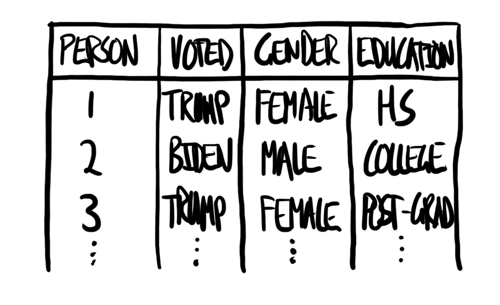
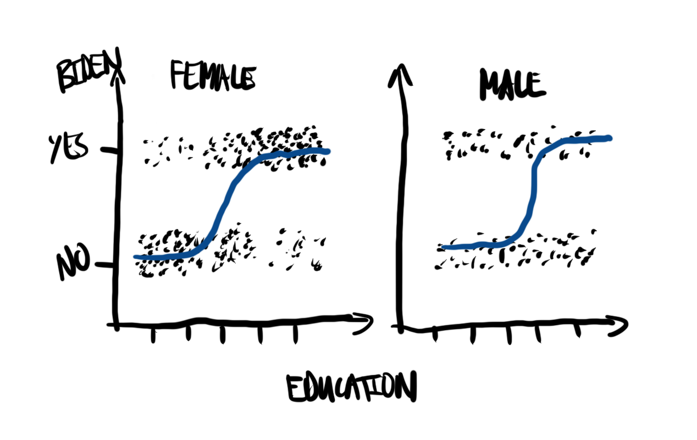
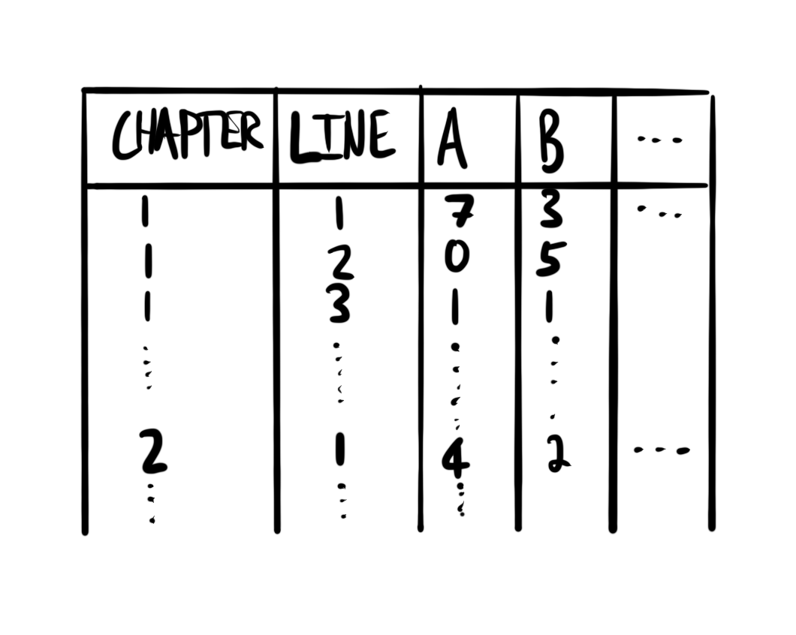
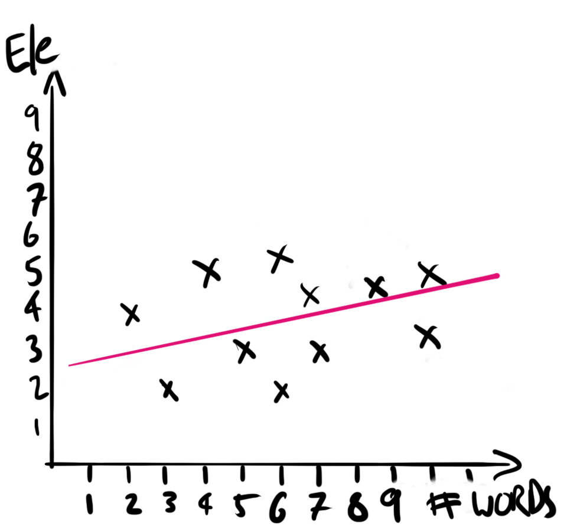
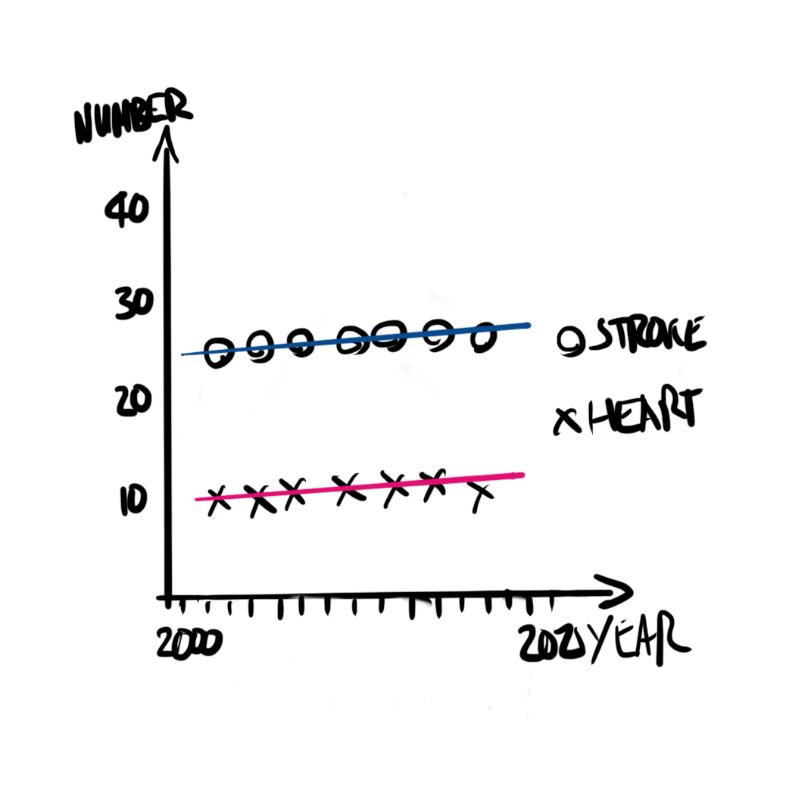
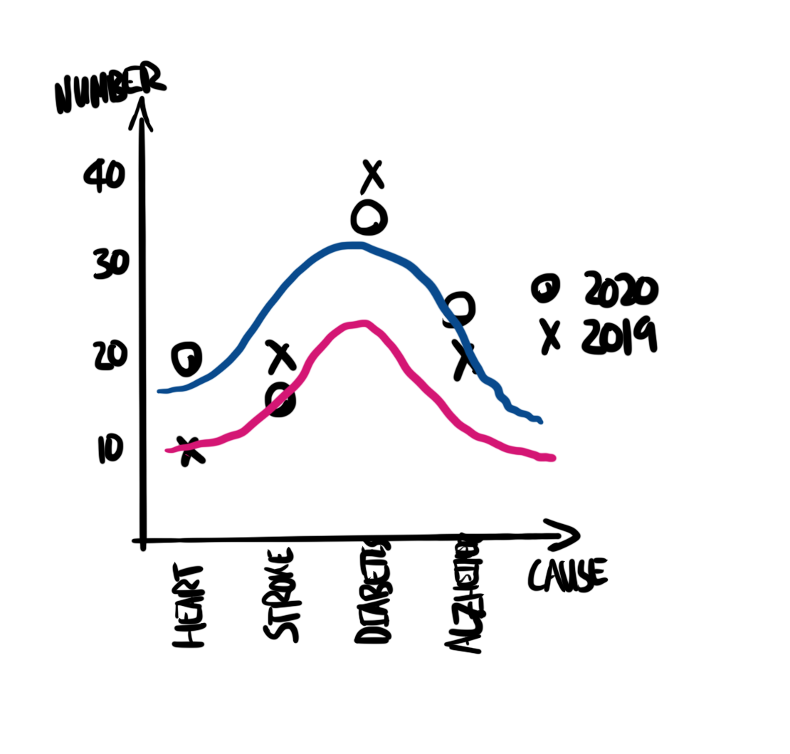

# 일반화 선형 모델 {#sec-its-just-a-generalized-linear-model}

:::{.callout-note}

Chapman and Hall/CRC에서 2023년 7월에 이 책을 출판했습니다. [여기](https://www.routledge.com/Telling-Stories-with-Data-With-Applications-in-R/Alexander/p/book/9781032134772)에서 구매할 수 있습니다.

이 온라인 버전은 인쇄된 내용에서 일부 업데이트되었습니다. 인쇄 버전과 일치하는 온라인 버전은 [여기](https://rohanalexander.github.io/telling_stories-published/)에서 사용할 수 있습니다.

:::

**선수 지식**

- *회귀 및 기타 이야기(Regression and Other Stories)* 읽기[@gelmanhillvehtari2020].
  - 특히 일반화 선형 모델에 대한 상세한 가이드를 제공하는 13장 "로지스틱 회귀" 및 15장 "기타 일반화 선형 모델"을 중점적으로 읽어보세요.
- *R을 활용한 통계 학습 입문(An Introduction to Statistical Learning with Applications in R)* 읽기[@islr].
  - 일반화 선형 모델을 색다른 관점에서 다루어 시야를 넓혀주는 4장 "분류(Classification)"를 집중적으로 살펴보세요.
- *우리는 네 명의 훌륭한 여론조사원에게 동일한 원시 데이터를 주었다. 그들은 네 가지 다른 결과를 얻었다(We Gave Four Good Pollsters the Same Raw Data. They Had Four Different Results)* 기사 읽기[@cohn2016].
  - 완전히 동일한 데이터셋이 주어졌더라도, 분석가가 어떤 모델링 전략을 선택하느냐에 따라 도출되는 예측이 얼마나 극명하게 달라질 수 있는지 생생하게 보여줍니다.

**핵심 개념 및 기술**

- 우리가 배운 선형 회귀는 그 틀을 유지한 채 다양한 형태의 결과 변수(outcome variable)를 다룰 수 있도록 훌륭하게 **일반화(generalized)**될 수 있습니다.
- 결과 변수가 0 아니면 1인 **이진(binary) 데이터**일 때는 **로지스틱 회귀(Logistic regression)**를 사용합니다.
- 결과 변수가 물건의 개수나 횟수처럼 **정수(integer) 형태의 카운트(count) 데이터**일 때는 **포아송 회귀(Poisson regression)**를 사용합니다. **음이항 회귀(Negative binomial regression)**는 포아송 회귀의 깐깐한 분산 가정을 완화해주기 때문에 실무에서 포아송 대신 종종 유연하게 고려되는 변형입니다.
- **다층 모델링(Multilevel modeling)**은 데이터 내부에 잠재된 그룹 차원이나 위계 구조를 적극적으로 끌어안아 데이터를 훨씬 더 알뜰하고 강력하게 활용할 수 있게 해주는 선진적인 접근 방식입니다.

**소프트웨어 및 패키지**

- Base R [@citeR]
- `boot` [@boot; @bootii]
- `broom.mixed` [@mixedbroom]
- `collapse` [@collapse]
- `dataverse` [@dataverse]
- `gutenbergr` [@gutenbergr]
- `janitor` [@janitor]
- `marginaleffects` [@marginaleffects]
- `modelsummary` [@citemodelsummary]
- `rstanarm` [@citerstanarm]
- `tidybayes` [@citetidybayes]
- `tidyverse` [@tidyverse]
- `tinytable` [@tinytable]

```{r}
#| message: false
#| warning: false

library(boot)
library(broom.mixed)
library(collapse)
library(dataverse)
library(gutenbergr)
library(janitor)
library(marginaleffects)
library(modelsummary)
library(rstanarm)
library(tidybayes)
library(tidyverse)
library(tinytable)

```

## 서론

이전 장([-@sec-its-just-a-linear-model])에서 다루었던 기본 선형 모델은 지난 한 세기 동안 눈부신 발전을 이룩해 왔습니다.\index{statistics!history of} 앞서 [-@sec-hunt-data] 장에서 언급했던 프랜시스 골턴\index{Galton, Francis}과 그의 동시대 학자들은 이미 1800년대 후반에서 1900년대 초반 무렵 선형 회귀 모형을 진지한 과학적 분석 도구로써 널리 활용하기 시작했습니다. 그러나 시간이 흐르며 연속적인 숫자뿐만 아니라 '성공/실패'와 같은 이진(binary) 결과를 예측해야 하는 문제들이 빠르게 학계의 주요 관심사로 떠올랐고, 이에 대한 특별한 수학적 처리 방식이 절실하게 요구되었습니다. 이러한 시대적 요구는 결국 1900년대 중반 로지스틱 회귀를 비롯한 유사한 방법론들의 눈부신 개발과 광범위한 현장 확산으로 이어졌습니다[@cramer2002origins]. 

이후 1970년대에 이르러 넬더(Nelder)와 웨더번(Wedderburn)은 기존의 잡다한 모델들을 하나로 우아하게 통합하는 틀을 제시했는데, 이것이 바로 **일반화 선형 모델(Generalized Linear Model, GLM)**\index{linear models!generalized} 프레임워크입니다[@nelder1972generalized]. GLM은 기본 선형 회귀 모형이 다룰 수 있는 관측 결과의 범위를 폭발적으로 극대화합니다. 본질적으로 우리는 여전히 설명 변수들의 '선형 조합(linear function)'을 사용하여 결과 변수를 모델링하지만, 예측되는 결과 변수의 형태 자체에는 훨씬 더 관대해집니다. 구체적으로 결과 변수는 지수족(exponential family)이라는 특정한 확률 분포 모임에 속하기만 하면 어떤 형태든 무방한데, 데이터 과학에서 가장 큰 사랑을 받는 대표적인 선택지가 바로 이진 데이터를 다루는 '로지스틱(이항) 분포'와 개수(count) 데이터를 다루는 '포아송 분포'입니다. 여기서 조금 더 시야를 확장하여 일반화 선형 모델이 궁극적으로 어떻게 진화했는지(비록 이 책의 범위를 살짝 벗어나긴 하지만) 엿본다면, 1990년대 헤이스티와 티브시라니(@hastie1990generalized)가 제창한 **일반화 가법 모델(Generalized Additive Model, GAM)**을 만나게 됩니다. GAM은 GLM의 뼈대를 유지하면서도 식의 우변인 설명 변수 파트에 비선형(non-linear) 형태의 유연한 함수 조각들을 이어 붙이는 방식(additive function)을 허용하여 예측력을 비약적으로 끌어올린 걸작입니다.

저명한 일반화 선형 모델의 가족 중에서도, 이 장에서는 주로 가장 활용 빈도가 높은 '로지스틱 회귀', '포아송 회귀', 그리고 '음이항 회귀'를 차례로 만나볼 것입니다. 단순 선형 모델과 일반화 선형 모델 모두에 찰떡같이 결합하여 사용할 수 있는 '다층 모델링(Multilevel modeling)'에 대해서도 간략히 탐험할 예정입니다. 다층 모델링은 데이터셋 내부에 잠재해 있는 여러 위계적 그룹(예: 국가 내의 도시들, 학급 내의 학생들) 구조를 적극적으로 활용하여 추정의 질을 높이는 세련된 기법입니다.

## 로지스틱 회귀(Logistic Regression)

선형 회귀\index{regression!logistic}\index{logistic regression}는 데이터를 깊이 있게 이해하고 인과를 시뮬레이션하는 데 대단히 직관적이며 유용한 방법입니다. 그러나 이는 결과 변수가 실수(real number) 선상의 모든 숫자, 즉 소수점 아래로 무한히 연속된 음수와 양수를 제한 없이 가질 수 있는 완벽한 형태의 '연속 변수(continuous variable)'라는 매우 까다로운 전제 조건을 깔고 있습니다. 하지만 우리가 마주칠 현실 세계의 데이터, 가령 동전의 앞뒤나 질병의 유무처럼 이 가정을 도저히 충족할 수 없는 상황에서도 우리는 익숙하고 강력한 선형 모델의 메커니즘을 계속해서 활용하고 싶어 합니다. 따라서 결과 변수가 오직 두 가지뿐인 '이진 데이터'일 때는 로지스틱 회귀로, 횟수나 명수를 세어야 하는 '개수(count) 데이터'일 때는 포아송 회귀로 각각 엔진을 교체하여 대응하게 됩니다. 흥미로운 점은, 엔진을 교체했더라도 예측 변수(X)들은 여전히 더하기(+) 기호를 통해 수식에 '선형적'으로 결합되므로 이들은 본질적으로 여전히 자랑스러운 선형 모델(Linear Models)의 일원이라는 사실입니다.

로지스틱 회귀\index{logistic regression}와 그 유용한 변형들은 대통령 선거 결과 예측[@wang2015forecasting]부터 경마의 승률 베팅[@chellel2018gambler; @boltonruth]에 이르기까지 너무나 다채로운 환경에서 막강한 위력을 발휘합니다. 결과 변수가 오직 0 아니면 1, "예(Yes)" 아니면 "아니오(No)"와 같이 칼로 무 베듯 둘 중 하나로 나뉘는 **이진 결과(binary outcome)**\index{binary outcome}일 때가 바로 로지스틱 회귀가 출격할 완벽한 타이밍입니다. 얼핏 생각하면 결과 변수가 둘 중 하나밖에 없는 상황이 턱없이 제한적으로 들릴 수도 있습니다. 하지만 조금만 주변을 둘러봐도 승리와 패배, 투표 지지와 반대, 이메일의 스팸 여부, 질병의 양성과 음성처럼 세상의 수많은 본질적인 관측 결과들이 이 이진법의 틀 안에 아주 자연스럽게 녹아들거나, 큰 무리 없이 두 가지 갈래로 조정 및 변환될 수 있음을 깨닫게 될 것입니다.

이러한 이진 논리의 근저를 지탱하는 수학적 초석은 바로 **베르누이 분포(Bernoulli distribution)**\index{distribution!Bernoulli}입니다. 동전을 한 번 던졌을 때의 결과를 상상하면 쉽습니다. "1(성공)"이라는 아주 특정한 결과가 발생할 확률을 $p$라고 한다면, 동전의 반대면이 나올 나머지 확률, 즉 "0(실패)"의 결과가 극명하게 나타날 확률은 필연적으로 $1-p$가 될 수밖에 없습니다. R에서는 단 한 번의 시도(`size = 1`)를 수행하는 `rbinom()` 함수를 가볍게 호출하여 이 베르누이 분포에서 가공의 이진 데이터들을 원하는 만큼 무작위로 추출(시뮬레이션)할 수 있습니다.\index{simulation}

```{r}
#| message: false
#| warning: false

set.seed(853)

bernoulli_example <-
  tibble(draws = rbinom(n = 20, size = 1, prob = 0.1))

bernoulli_example |> pull(draws)

```

로지스틱 회귀\index{logistic regression}를 사용하는 가장 핵심적인 이유는, 우리가 궁극적으로 모델링하고자 하는 대상이 어떤 사건이 일어날 '확률(probability)'이라는 점에 있습니다. 확률은 정의상 반드시 0과 1 사이의 값만 가져야 하는데, 기존의 선형 회귀는 계산 결과로 음수나 1을 초과하는 황당한 값을 기꺼이 뱉어낼 수 있습니다. 이러한 문제를 우아하게 해결해 주는 로지스틱 회귀의 마법 같은 기초가 바로 **로짓 함수(logit function)**\index{logit function}입니다.

$$
\mbox{logit}(x) = \log\left(\frac{x}{1-x}\right).
$$
수식을 보면 알 수 있듯, 로짓 함수는 0과 1 사이에 갇혀 있는 좁은 확률 값($x$)을 무한대로 뻗어 나가는 넓은 실수(real number) 선상으로 완벽하게 '변환'해 줍니다. 예를 들어, 어떤 확률이 0.1이라면 `logit(0.1) = -2.2` 가 되고, 딱 반반인 0.5라면 `logit(0.5) = 0` 이 되며, 0.9라면 `logit(0.9) = 2.2` 가 됩니다([-@fig-heyitslogit] 참조). 우리는 이렇게 변환을 담당하는 함수를 가리켜 **링크 함수(link function)**라고 부릅니다. 링크 함수는 일반화 선형 모델 안에서 우리가 진정으로 관심 있는 확률 분포 특성과, 선형 모델이 계산을 수행하는 내부 메커니즘을 잇는 튼튼한 다리 역할을 수행합니다.

```{r}
#| eval: true
#| include: true
#| echo: false
#| fig-cap: "0과 1 사이의 값에 대한 로짓 함수의 예시"
#| label: fig-heyitslogit
#| message: false
#| warning: false

tibble(values = seq(from = 0, to = 1, by = 0.001),
       logit = logit(values)) |>
  ggplot(aes(x = values, y = logit)) +
  geom_line() +
  theme_classic() +
  geom_hline(yintercept = 0, linetype = "dashed") +
  labs(x = "x 값",
       y = "logit(x)")

```

### 시뮬레이션 예시: 낮 또는 밤? 평일 또는 주말?

로지스틱 회귀\index{logistic regression}의 작동 원리를 직관적으로 이해하기 위해, 창문 밖 도로 위를 굴러가는 '자동차 수'만 보고 오늘이 '평일'인지 아니면 '주말'인지 맞혀야 하는 재미있는 상황을 시뮬레이션해 보겠습니다.\index{simulation} 논리적으로는 당연히 사람들이 출퇴근하는 평일(weekday)에 도로가 훨씬 더 혼잡할 것이라고 가정할 수 있습니다.\index{distribution!Normal}

```{r}
#| message: false
#| warning: false

set.seed(853)

week_or_weekday <-
  tibble(
    num_cars = sample.int(n = 100, size = 1000, replace = TRUE),
    noise = rnorm(n = 1000, mean = 0, sd = 10),
    is_weekday = if_else(num_cars + noise > 50, 1, 0)
  ) |>
  select(-noise)

week_or_weekday

```

```{r}
#| eval: false
#| include: false

arrow::write_parquet(x = week_or_weekday,
                     sink = "outputs/data/week_or_weekday.parquet")

```

R에 기본으로 내장된 `glm()` 함수를 사용하면 순식간에 추정을 마칠 수 있습니다.\index{logistic regression!Base R} 이 예시에서 우리의 유일한 무기는 관찰된 '자동차 수'이며, 이를 바탕으로 오늘이 평일일 확률을 모델링하려고 시도합니다. 우리가 구체적으로 세운 추정 수식은 방정식 [-@eq-logisticexample]과 같습니다.

$$
\mbox{Pr}(y_i=1) = \mbox{logit}^{-1}\left(\beta_0+\beta_1 x_i\right)
$$ {#eq-logisticexample}

여기서 결과 변수 $y_i$는 해당 날짜가 평일인지 여부(평일=1, 주말=0)를 나타내고, 설명 변수 $x_i$는 관찰된 자동차 수를 뜻합니다. (참고로 $\mbox{logit}^{-1}$는 앞서 보았던 로짓 변환을 다시 원상 복구시키는 *역 로짓(inverse logit)* 함수입니다.)

```{r}
week_or_weekday_model <-
  glm(
    is_weekday ~ num_cars,
    data = week_or_weekday,
    family = "binomial"
  )

summary(week_or_weekday_model)

```

출력된 결과를 보면 자동차 수에 대한 추정 계수($\beta_1$)가 0.19로 나왔습니다. 여기서 주의할 점은, 로지스틱 회귀\index{logistic regression!interpretation}에서 추정된 계수를 해석하는 방식이 기존 선형 회귀보다 조금 더 까다롭다는 것입니다. 선형 회귀의 계수처럼 "확률이 0.19만큼 직관적으로 올라간다"라고 단순하게 해석하면 안 됩니다. 이 계수는 정확히 말하자면, 이진 결과에 대한 **로그-오즈(log-odds)의 평균 변화량**을 의미합니다. 즉, 0.19라는 추정치는 도로에서 자동차가 '한 대' 더 관찰될 때마다 평일일 확률의 '로그-오즈'가 평균적으로 0.19만큼 증가한다는 뜻입니다. 부호가 양수(+)이므로 자동차 수가 많을수록 평일일 확률이 높아진다는 전체적인 방향성은 일치합니다. 
문제는 로그-오즈 변환이 '비선형적(non-linear)'이기 때문에, 확률이 구체적으로 몇 퍼센트 오르는지 말하려면 '현재 베이스라인이 어디쯤 있느냐(baseline level)'에 따라 값이 고무줄처럼 달라진다는 사실입니다. 쉽게 말해, 기본 로그-오즈가 0 (확률 50%) 근처에서 까딱거릴 때 계수로 인해 변하는 확률의 폭이, 로그-오즈가 2 (확률 88%) 쯤에서 이미 꽉 차 있을 때 변하는 확률 폭보다 훨씬 더 극적으로 크게 나타납니다.

다행히 우리는 약간의 연산을 통해 이 까다로운 로그-오즈 추정치를, 일정한 자동차 수 조건일 때 주어진 '평일일 확률(probability)'로 훨씬 알기 쉽게 직관적으로 변환할 수 있습니다. `marginaleffects` 패키지의 `predictions()` 함수를 사용하면 우리가 관측한 모든 데이터 포인트에 대해 모델이 내놓은 암묵적인 '평일일 확률'을 아주 새롭게 계산하여 덧붙여 줍니다.

```{r}
week_or_weekday_predictions <-
  predictions(week_or_weekday_model) |>
  as_tibble()

week_or_weekday_predictions

```

구해진 확률값들을 이용하여, 도로 위 자동차 수에 따라 모델이 평일일 확률을 어떻게 가늠하고 있는지 직관적인 그래프로 시원하게 그려볼 수 있습니다([-@fig-dayornightprobs]). 이는 우리 모델이 데이터를 얼마나 합리적으로 잘 적합(fit)시켰는지 다양한 측면에서 시각적으로 검토할 아주 훌륭한 기회이기도 합니다. 산점도를 흩뿌려보는 것이 가장 전통적이고 일반적인 방식이지만([-@fig-dayornightprobs-1]), 촘촘한 누적 분포를 보여주는 경험적 누적 분포 함수(ECDF) 곡선을 그려보는 것도 꽤 멋진 결과를 보여줍니다([-@fig-dayornightprobs-2]).

```{r}
#| eval: true
#| fig-cap: "주변 자동차 수를 기반으로 주중 또는 주말인지 여부에 대한 시뮬레이션된 데이터를 사용한 로지스틱 회귀 확률 결과"
#| include: true
#| label: fig-dayornightprobs
#| message: false
#| warning: false
#| fig-subcap: ["산점도로 적합도 설명", "ECDF로 적합도 설명"]
#| layout-ncol: 2

# 패널 (a)
week_or_weekday_predictions |>
  mutate(is_weekday = factor(is_weekday)) |>
  ggplot(aes(x = num_cars, y = estimate, color = is_weekday)) +
  geom_jitter(width = 0.01, height = 0.01, alpha = 0.3) +
  labs(
    x = "관찰된 자동차 수",
    y = "주중일 추정 확률",
    color = "실제 주중"
  ) +
  theme_classic() +
  scale_color_brewer(palette = "Set1") +
  theme(legend.position = "bottom")

# 패널 (b)
week_or_weekday_predictions |>
  mutate(is_weekday = factor(is_weekday)) |>
  ggplot(aes(x = num_cars, y = estimate, color = is_weekday)) +
  stat_ecdf(geom = "point", alpha = 0.75) +
  labs(
    x = "관찰된 자동차 수",
    y = "주중일 추정 확률",
    color = "실제 주중"
  ) +
  theme_classic() +
  scale_color_brewer(palette = "Set1") +
  theme(legend.position = "bottom")

```

로지스틱 회귀 분석의 또 다른 강력한 도구는 각 관측치 주변에서 이 확률이 어떤 속도로 변하고 있는지 국소적인 움직임을 보여주는 **한계 효과(marginal effects)**\index{marginal effects}를 분석하는 것입니다. 이를 통해 우리는 "만약 정확히 중앙값에 해당하는 상황(이 시뮬레이션에서는 자동차 50대를 목격했을 때)에서 딱 한 대의 자동차가 눈앞에 더 지나간다면, 평일일 확률은 구체적으로 약 5%포인트(0.049) 껑충 뛰어오른다"라는 매우 통찰력 있는 해석을 깔끔하게 내놓을 수 있습니다([-@tbl-marginaleffectcar]).

```{r}
#| label: tbl-marginaleffectcar
#| tbl-cap: "중앙값(자동차 50대) 상황에서 자동차 한 대 증가가 평일일 확률에 미치는 한계 효과"

slopes(week_or_weekday_model, newdata = "median") |>
  select(term, estimate, std.error) |>
  tt() |>
  style_tt(j = 1:3, align = "lrr") |>
  format_tt(digits = 3, num_mark_big = ",", num_fmt = "decimal") |>
  setNames(c("항목", "추정치", "표준 오차"))

```

이 흥미로운 상황을 더욱 철저하고 깊이 있게 조사하기 위해, 아마 여러분은 `rstanarm` 패키지의 강력한 톱니바퀴를 돌려 베이즈(Bayesian) 기반의 로지스틱 모델을 세워보고 싶을 것입니다.\index{Bayesian!logistic regression}\index{logistic regression!Bayesian} 앞서 [-@sec-its-just-a-linear-model] 장에서 경험했던 것과 똑같은 워크플로를 따라 각 매개변수에 대한 사전 분포(prior)를 마음속으로 신중하게 지정할 테지만, 이번 장의 코드에서는 간편함을 위해 `rstanarm`이 똑똑하게 세팅해 둔 기본 사전 분포(default priors)의 스케일을 그대로 맹신하여 따를 것입니다.

$$
\begin{aligned}
y_i|\pi_i & \sim \mbox{Bern}(\pi_i) \\
\mbox{logit}(\pi_i) & = \beta_0+\beta_1 x_i \\
\beta_0 & \sim \mbox{Normal}(0, 2.5)\\
\beta_1 & \sim \mbox{Normal}(0, 2.5)
\end{aligned}
$$
수식을 꼼꼼히 살펴보면, 여기서 $y_i$는 오늘이 실제 평일인지 여부(평일이면 1, 아니면 0)를, $x_i$는 수집된 도로 위의 자동차 수를 의미합니다. 그리고 가장 중요한 $\pi_i$는 우리가 그토록 호기심을 가졌던 관측치 $i$ 시점이 '평일'일 확률(probability)입니다.

```{r}
#| eval: false
#| echo: true
#| message: false
#| warning: false

week_or_weekday_rstanarm <-
  stan_glm(
    is_weekday ~ num_cars,
    data = week_or_weekday,
    family = binomial(link = "logit"),
    prior = normal(location = 0, scale = 2.5, autoscale = TRUE),
    prior_intercept = normal(location = 0, scale = 2.5, autoscale = TRUE),
    seed = 853
  )

saveRDS(
  week_or_weekday_rstanarm,
  file = "week_or_weekday_rstanarm.rds"
)

```

```{r}
#| eval: false
#| include: false
#| message: false
#| warning: false

# INTERNAL
saveRDS(
  week_or_weekday_rstanarm,
  file = "outputs/model/week_or_weekday_rstanarm.rds"
)

```

```{r}
#| eval: true
#| include: false
#| message: false
#| warning: false

week_or_weekday_rstanarm <-
  readRDS(file = "outputs/model/week_or_weekday_rstanarm.rds")

```

베이즈 기반의 접근 방식으로 도출한 결과는, 우리가 앞서 기본 R 함수로 가볍게 돌렸던 빈도주의 모델의 결과 그림과 놀랍도록 똑 닮아 있습니다([-@tbl-modelsummarylogistic]).

```{r}
#| label: tbl-modelsummarylogistic
#| tbl-cap: "도로 위 자동차 수를 기반으로 평일(1) 또는 주말(0) 여부를 훌륭하게 설명하는 로지스틱 회귀 모델의 요약 (결과를 보세요!)"
#| message: false
#| warning: false

modelsummary(
  list(
    "낮 또는 밤" = week_or_weekday_rstanarm
  )
)

```

[-@tbl-modelsummarylogistic] 표를 찬찬히 들여다보면, 이 단순한 사례에서는 빈도주의와 베이즈, 두 접근 방식 중 어느 쪽을 택하든 완전히 동일한 결론을 바라본다는 점이 아주 극명하게 드러납니다. 놀랍게도 자동차 한 대가 늘어날 때 올라가는 평일일 확률의 기운(효과의 방향성)에 흔쾌히 동의하는 것은 물론이고, 심지어 그 증가 폭(효과의 세기)을 나타내는 추정치마저 마치 짠 것처럼 엇비슷하게 산출되었습니다.

### 미국 정치적 지지 현황 예측하기

로지스틱 회귀가 현업 데이터 과학자들에게 가장 뜨겁게 사랑받고 자주 소환되는 분야 중 하나는 단연 정치 여론조사(Political polling)입니다.\index{United States!political polling} 선거에 뛰어든 유권자는 아무리 마음이 복잡하더라도 결국 투표용지 앞에서는 단 한 명의, 혹은 한 가지 선호도를 콕 찍어 선택(순위)해야 하는 잔인한 기로에 놓일 수밖에 없습니다. 따라서 복잡다단한 정치적 신념이라는 고차원적 문제도 투표소 문을 나설 무렵이면 적절하든 아니든 아주 차갑고 단순하게 "지지한다(1)" 또는 "지지하지 않는다(0)"의 이진법 세계로 완전히 쪼그라들게 됩니다.\index{elections!US 2020 Presidential Election}

이러한 문제를 풀기 위해 이 책이 끊임없이 옹호하고 권장해 온 견고한 분석 워크플로는 다음과 같습니다.\index{workflow}

$\mbox{계획} \rightarrow \mbox{시뮬레이션} \rightarrow \mbox{데이터 획득} \rightarrow \mbox{탐색} \rightarrow \mbox{지식 공유}$

비록 이 섹션에서는 로지스틱 모델의 기술적 '탐색' 과정에 온 신경을 집중하긴 하겠지만, 모범적인 분석가라면 반드시 워크플로의 나머지 측면들, 특히 기초 공사에 해당하는 과정을 경건한 마음으로 수행해야 합니다. 그러니 당연히 맨 앞의 '계획(Plan)' 단계부터 묵묵히 시작해 봅시다. 이 거창한 케이스 스터디에서 우리의 핵심 관심사는 미국의 정치적 지지 현황을 파헤치는 것입니다. 우리는 야심 차게도, 응답자에게 단 두 가지, 즉 '최고 교육 수준'과 '성별'이라는 극히 일부의 정보만 캐묻고도 그가 과연 다가올 선거에서 바이든에게 한 표를 던질지 정확하게 점쟁이처럼 꿰뚫어 볼 수 있을지 궁금합니다. 이 호기심을 풀려면 각 개인이 비밀리에 누구에게 투표했는지 엿볼 수 있는 결과 변수와, 그들의 숨길 수 없는 인구통계학적 특성(성별, 교육 수준)이 함께 깔끔하게 묶인 데이터셋이 절실히 필요합니다. 며칠 밤낮을 새워 데이터를 정제했다고 쳤을 때, 과연 컴퓨터 모니터에 어떤 알록달록한 데이터프레임이 나타날지 재빠르게 끄적거려 본 머릿속 스케치가 바로 [-@fig-uspoliticalsupportsketch]입니다. 더 나아가, 우리는 로지스틱 회귀 모델이라는 믹서기가 이 데이터를 곱게 갈아내어 어떤 매끈한 추세선의 결과를 뱉어주길 간절히 소망하고 있습니다. 그 달콤한 상상을 담은 빠른 스케치는 [-@fig-uspoliticalsupportmodel]에서 확인할 수 있습니다.

:::{#fig-uspoliticalsuppor layout-ncol=2 layout-valign="bottom"}

{#fig-uspoliticalsupportsketch}

{#fig-uspoliticalsupportmodel}

거칠고 보잘것없어 보일지라도, 이처럼 본격적인 분석의 삽을 뜨기 전에 내가 상상하는 예상 데이터셋의 모습과 분석 모델이 보여줄 궁극적인 초점을 스케치해 보는 과정은, 훗날 내 생각이 이리저리 표류할 때 나침반 역할을 하며 막연했던 아이디어를 무섭도록 또렷하고 날카롭게 집중시켜 줍니다.

:::

우리가 설정한 가설, 즉 개인이 바이든을 지지할 확률이 성별과 교육 수준에 따라 달라진다는 상황을 가정하는 모의 데이터셋을 아래와 같이 간단히 시뮬레이션해 봅니다.\index{simulation}

```{r}
set.seed(853)

num_obs <- 1000

us_political_preferences <- tibble(
  education = sample(0:4, size = num_obs, replace = TRUE),
  gender = sample(0:1, size = num_obs, replace = TRUE),
  support_prob = ((education + gender) / 5),
) |>
  mutate(
    supports_biden = if_else(runif(n = num_obs) < support_prob, "yes", "no"),
    education = case_when(
      education == 0 ~ "< 고등학교",
      education == 1 ~ "고등학교",
      education == 2 ~ "일부 대학",
      education == 3 ~ "대학",
      education == 4 ~ "대학원"
    ),
    gender = if_else(gender == 0, "남성", "여성")
  ) |>
  select(-support_prob, supports_biden, gender, education)

```

현업에서 실제 미국의 여론 데이터를 분석할 때 가장 대표적으로 쓰이는 훌륭한 소스는 단연코 **2020년 협동 선거 연구(Cooperative Election Study, CES)**\index{Cooperative Election Study} 데이터셋입니다[@cooperativeelectionstudyus]. 이 방대한 데이터는 미국 전역의 민심과 정치 여론을 끈질기게 추적해 온 뼈대 깊은 연례 설문조사의 산물입니다. 특히 2020년 에디션에는 무려 61,000명에 달하는 응답자가 치열했던 선거 직후 설문지를 빼곡히 채웠습니다. 섀프너 등(@guidetothe2020ces) [p. 13]의 가이드라인에 상세히 설명되어 있듯, 이 조사는 매칭(matching) 기법에 크게 의존하는 표본 추출 방법론을 채택했습니다. 이는 실무적으로 이상적인 표본 추출의 깐깐한 요구 조건과 막대한 비용 사이에서 합리적인 균형을 맞춘 영리한 접근 방식으로 널리 인정받고 있습니다.

R에서는 `dataverse` 패키지를 설치하고 로드한 뒤 `get_dataframe_by_name()` 함수를 호출하기만 하면, 웹 브라우저를 켤 필요도 없이 이 거대한 CES 데이터에 기적처럼 접근할 수 있습니다. 사실 이 우아한 데이터 획득(Gathering) 접근 방식은 이미 앞선 [-@sec-gather-data] 장과 [-@sec-store-and-share] 장에서 한 번 다루었던 내용입니다. 우리는 인터넷을 통해 스크래핑해 온 값비싼 원본 데이터에 관심 있는 변수만 남겨 우선 로컬 환경에 고이 저장(save)해 둔 다음, 이어지는 분석에서는 무조건 그 로컬 복사본을 참조하는 모범적인 개발 관행을 따를 것입니다.

```{r}
#| echo: true
#| eval: false

ces2020 <-
  get_dataframe_by_name(
    filename = "CES20_Common_OUTPUT_vv.csv",
    dataset = "10.7910/DVN/E9N6PH",
    server = "dataverse.harvard.edu",
    .f = read_csv
  ) |>
  select(votereg, CC20_410, gender, educ)

write_csv(ces2020, "ces2020.csv")

```

```{r}
#| echo: false
#| eval: false

# INTERNAL

write_csv(ces2020, "inputs/data/ces2020.csv")

```

```{r}
#| echo: true
#| eval: false

ces2020 <-
  read_csv(
    "ces2020.csv",
    col_types =
      cols(
        "votereg" = col_integer(),
        "CC20_410" = col_integer(),
        "gender" = col_integer(),
        "educ" = col_integer()
      )
  )

ces2020

```

```{r}
#| echo: false
#| eval: true

# INTERNAL

ces2020 <-
  read_csv(
    "inputs/data/ces2020.csv",
    col_types =
      cols(
        "votereg" = col_integer(),
        "CC20_410" = col_integer(),
        "gender" = col_integer(),
        "educ" = col_integer()
      )
  )

ces2020

```

실제 원시 데이터를 눈으로 직접 맞닥뜨려 보면, 애초에 머릿속으로 단순하게 스케치했던 것과는 사뭇 다른 지저분한 현실의 문제들이 고스란히 드러납니다. 이때 분석가의 가장 소중한 나침반인 '코드북(codebook)'을 펼쳐 변수들의 진짜 정체를 더욱 철저히 파헤쳐야 합니다. 우리의 구체적인 타깃은 선거에 무관심한 사람들이 아니라 **오직 투표 등록을 마친 유권자**들이며, 그중에서도 **바이든이나 트럼프에게 투표한 사람들의 응답**만 온전히 분석에 사용할 계획입니다. 설문 항목 중 `CC20_410` 변수를 찾아보면 흥미롭게도 값이 1이면 응답자가 바이든을 지지했음을, 2이면 트럼프를 맹렬히 지지했음을 의미합니다. 이제 복잡한 데이터 프레임에서 이 조건에 딱 맞는 열성 응답자들만 체에 거르듯 필터링(filtering)해낸 다음, 나중에 헷갈리지 않도록 1과 2 대신 훨씬 더 유익하고 직관적인 텍스트 레이블을 친절하게 덧입혀 줄 것입니다.

CES 데이터셋에서는 남녀 성별 정보도 제공하는데, 'gender' 변수의 값이 1이면 "남성(Male)"을, 2이면 "여성(Female)"을 깔끔하게 의미합니다. 마지막으로 코드북을 조금 더 넘겨보면, 우리가 찾던 'educ' 변수가 숫자가 1에서 6으로 쑥쑥 커질수록 그 응답자의 성취 교육 수준이 정비례하여 점진적으로 높아지는 구조임을 명확히 알려줍니다.

```{r}
ces2020 <-
  ces2020 |>
  filter(votereg == 1,
         CC20_410 %in% c(1, 2)) |>
  mutate(
    voted_for = if_else(CC20_410 == 1, "Biden", "Trump"),
    voted_for = as_factor(voted_for),
    gender = if_else(gender == 1, "남성", "여성"),
    education = case_when(
      educ == 1 ~ "고등학교 미만",
      educ == 2 ~ "고등학교 졸업",
      educ == 3 ~ "일부 대학",
      educ == 4 ~ "2년제",
      educ == 5 ~ "4년제",
      educ == 6 ~ "대학원"
    ),
    education = factor(
      education,
      levels = c(
        "고등학교 미만",
        "고등학교 졸업",
        "일부 대학",
        "2년제",
        "4년제",
        "대학원"
      )
    )
  ) |>
  select(voted_for, gender, education)

```

```{r}
#| eval: false
#| include: false

arrow::write_parquet(x = ces2020,
                     sink = "outputs/data/ces2020.parquet")

```

결과적으로 이토록 깐깐한 정제 과정을 우직하게 거치고 나면, 우리 손에는 총 43,554명의 속내를 알 수 있는 훌륭한 응답자 데이터가 황금처럼 남게 됩니다([-@fig-cesissogooditslikecheating] 참조).

```{r}
#| eval: true
#| echo: true
#| message: false
#| warning: false
#| fig-cap: "깔끔하게 정제된 CES 2020 데이터 기반: 성별 및 최고 교육 수준에 따른 대통령 후보 선호도의 생생한 분포"
#| label: fig-cesissogooditslikecheating

ces2020 |>
  ggplot(aes(x = education, fill = voted_for)) +
  stat_count(position = "dodge") +
  facet_wrap(facets = vars(gender)) +
  theme_minimal() +
  labs(
    x = "최고 교육 수준",
    y = "응답자 수",
    fill = "투표 대상"
  ) +
  coord_flip() +
  scale_fill_brewer(palette = "Set1") +
  theme(legend.position = "bottom")

```

우리가 데이터를 통해 추정하고자 하는 구체적인 베이즈 모델의 뼈대는 다음과 같습니다.

$$
\begin{aligned}
y_i|\pi_i & \sim \mbox{Bern}(\pi_i) \\
\mbox{logit}(\pi_i) & = \beta_0+\beta_1 \times \mbox{gender}_i + \beta_2 \times \mbox{education}_i \\
\beta_0 & \sim \mbox{Normal}(0, 2.5)\\
\beta_1 & \sim \mbox{Normal}(0, 2.5)\\
\beta_2 & \sim \mbox{Normal}(0, 2.5)
\end{aligned}
$$

위 수식에서 $y_i$는 해당 응답자의 최종 정치적 선택을 나타내며, 바이든을 지지했으면 1, 트럼프를 지지했으면 0의 값을 갖습니다. $\mbox{gender}_i$는 응답자의 성별이고, $\mbox{education}_i$는 응답자의 교육 수준입니다. 이 강력한 매개변수들은 `rstanarm` 패키지의 `stan_glm()` 함수를 호출하여 손쉽게 추정할 수 있습니다. 
위 수식은 이해를 돕기 위해 간소화된 일반적인 약어 형태를 띠고 있습니다. 실제 R 내부에서 `rstanarm`이 작동할 때는, 범주형(categorical) 변수인 교육 수준 등을 여러 개의 가상의 지표 변수(indicator variables, 더미 변수)로 능목하게 변환하여 훨씬 더 많은 수의 세부 계수들을 한꺼번에 추정하게 됩니다. 게다가 4만 개가 넘는 전체 데이터셋을 그대로 베이즈 모델에 밀어 넣으면 MCMC 샘플링 실행 시간이 기하급수적으로 늘어날 수 있습니다. 따라서 이 장에서는 학습의 효율성을 고려하여, 아주 가벼운 1,000개의 관측치 샘플만 무작위로 추출(slice)하여 모델을 적합(fit)해 보겠습니다.

```{r}
#| eval: false
#| echo: true
#| message: false
#| warning: false

set.seed(853)

ces2020_reduced <-
  ces2020 |>
  slice_sample(n = 1000)

political_preferences <-
  stan_glm(
    voted_for ~ gender + education,
    data = ces2020_reduced,
    family = binomial(link = "logit"),
    prior = normal(location = 0, scale = 2.5, autoscale = TRUE),
    prior_intercept =
      normal(location = 0, scale = 2.5, autoscale = TRUE),
    seed = 853
  )

saveRDS(
  political_preferences,
  file = "political_preferences.rds"
)

```

```{r}
#| eval: false
#| echo: false

# INTERNAL

saveRDS(
  political_preferences,
  file = "outputs/model/political_preferences.rds"
)

```

```{r}
#| echo: true
#| eval: false
#| message: false
#| warning: false

political_preferences <-
  readRDS(file = "political_preferences.rds")

```

```{r}
#| eval: true
#| include: false
#| message: false
#| warning: false

political_preferences <-
  readRDS(file = "outputs/model/political_preferences.rds")

```

추정된 모델의 결과는 꽤나 흥미진진한 통찰을 안겨줍니다. [-@tbl-modelsummarylogisticpolitical] 표를 보면, 남성의 경우 바이든에게 표를 던질 가능성이 상대적으로 낮게 나타나며, 특히 응답자가 달성한 최고 교육 수준이 후보 지지율에 아주 강력하고 유의미한 영향을 미친다는 사실을 뚜렷하게 시사합니다.

```{r}
#| label: tbl-modelsummarylogisticpolitical
#| tbl-cap: "성별과 눈높이(교육 수준)를 바탕으로 응답자가 바이든을 지지할 '가능성'을 추정한 모델 요약"
#| message: false
#| warning: false

modelsummary(
  list(
    "바이든 지지 예측" = political_preferences
  ),
  statistic = "mad"
  )

```

단순히 숫자로 빽빽한 표를 제시하는 것보다는, 각 예측 변수가 미치는 영향력 범위(신뢰 구간)를 그래프로 멋지게 플로팅하여 보여주는 것이 전달력을 높이는 매우 유용한 전략입니다([-@fig-modelplotlogisticpolitical]). 이 차트는 본문에서 독자의 시선을 사로잡을 뿐만 아니라, 논문이나 보고서의 부록(appendix)에 첨부하기에도 아주 훌륭한 시각 자료입니다.

```{r}
#| label: fig-modelplotlogisticpolitical
#| fig-cap: "각 측면(예측 변수)들이 바이든 지지 확률에 미치는 영향력의 90% 신뢰(크레더블) 구간 도식화"

modelplot(political_preferences, conf_level = 0.9) +
  labs(x = "90% 신뢰 구간")

```

## 포아송 회귀(Poisson Regression)

만약 우리가 분석해야 할 데이터가 연속적인 실수가 아니라 '몇 명', '몇 번', '몇 골'처럼 딱 떨어지는 **개수(count) 데이터**로 이루어져 있다면, 분석의 첫 단추로 가장 먼저 **포아송 분포(Poisson distribution)**\index{distribution!Poisson}\index{regression!Poisson}를 떠올리는 것이 매우 현명한 선택입니다. 

포아송 회귀가 맹활약하는 대표적인 분야 중 하나는 흥미롭게도 스포츠 경기 결과 모델링입니다. 예를 들어 보르흐(@Burch2023)는 축구 경기력을 모델링할 때 포아송 회귀의 선구자인 바이오(@Baio2010)의 기법을 고스란히 차용하여, 하키 경기의 득점 수를 예측하는 정교한 포아송 모델을 구축하기도 했습니다.

수학적으로 포아송 분포는 오로지 단 하나의 특별한 매개변수, 곧 **$\lambda$(람다)**에 의해 모든 모양이 결정됩니다. 포아송은 항상 0보다 크거나 같은 음이 아닌 정수(0, 1, 2, 3...)에 대해서만 발생 확률을 할당하여 분포의 형태를 빚어냅니다. 그 결과 포아송 분포는 통계학적으로 아주 독특하면서도 골치 아픈 특징 하나를 갖게 되는데, 바로 '분포의 평균(mean)이 그 고유한 분산(variance)과 완벽하게 동일하다'는 점입니다. 즉, 평균적으로 기대되는 발생 횟수가 커질수록, 데이터가 흔들리는 변동의 폭(분산) 또한 필연적으로 함께 커지는 구조입니다. 피트먼(@pitman) [p. 121]이 기술한 공식에 따르면, 특정 횟수 $k$번이 발생할 포아송 확률 질량 함수는 다음과 같습니다.

$$P_{\lambda}(k) = e^{-\lambda}\lambda^k/k!\mbox{, 단, }k=0,1,2,\dots$$

R에서는 놀랍도록 쉽게 `rpois()` 함수를 사용하여 $\lambda$가 3(평균적으로 3번 발생)인 포아송 분포로부터 가상의 개수 데이터 표본 $n=20$개를 순식간에 추출(시뮬레이션)할 수 있습니다.\index{distribution!Poisson}\index{simulation}

```{r}
rpois(n = 20, lambda = 3)

```

아울러 핵심 매개변수인 $\lambda$ 값을 점점 키워나갈 때, 확률 분포 덩어리의 모양이 통통하게 어떻게 부풀어 오르고 변화하는지 시각적으로 관찰해 보는 것도 로직의 직관을 키우는 데 좋습니다([-@fig-poissondistributiontakingshape]).\index{distribution!Poisson}

```{r}
#| eval: true
#| include: true
#| echo: false
#| message: false
#| warning: false
#| fig-cap: "포아송 분포의 다양한 얼굴: 우뚝 솟은 평균($\lambda$) 값 하나에 의해 분포 전체의 모양과 변동성(분산)이 결정됩니다."
#| label: fig-poissondistributiontakingshape

set.seed(853)

number_of_each <- 100

lambdas <- c(0, 1, 2, 4, 7, 10, 15, 25, 50)

poisson_takes_shape <-
  map(lambdas, ~ tibble(lambda = rep(.x, number_of_each),
                        draw = rpois(n = number_of_each, lambda = .x))) |>
  list_rbind()

poisson_takes_shape <- poisson_takes_shape |>
  mutate(lambda = paste("lambda =", lambda),
         lambda = factor(lambda, levels = paste("lambda =", lambdas)))

ggplot(poisson_takes_shape, aes(x = draw)) +
  geom_density() +
  facet_wrap(vars(lambda), scales = "free_y") +
  theme_minimal() +
  labs(x = "정수", y = "밀도")

```

### 시뮬레이션 예시: 학과별 A 학점 부여 횟수 비교

포아송 회귀의 쓰임새를 명확히 이해하기 위해, 각 학과의 대학 인기 강의에서 한 학기 동안 학생들에게 'A 학점'을 과연 몇 번이나 넉넉히 부여하는지 가상으로 가늠해 볼 수 있는 모의 데이터를 시뮬레이션해 보겠습니다.\index{simulation} 이 시뮬레이션 시나리오에서는 총 3개의 학과를 설정하고, 각 학과 안에 수많은 강의들이 열려 있다고 가정합니다. 당연하게도, 각각의 강의들은 성적 부여 기준이나 난이도가 제각기 다르기 때문에 학기 말에 쏟아내는 A 학점의 수 역시 매우 다양할 것입니다.\index{distribution!Poisson}

```{r}
set.seed(853)

class_size <- 26

count_of_A <-
  tibble(
    # Chris DuBois 코드 참고: https://stackoverflow.com/a/1439843
    department =
      c(rep.int("1", 26), rep.int("2", 26), rep.int("3", 26)),
    course = c(
      paste0("DEP_1_", letters),
      paste0("DEP_2_", letters),
      paste0("DEP_3_", letters)
    ),
    number_of_As = c(
      rpois(n = class_size, lambda = 5),
      rpois(n = class_size, lambda = 10),
      rpois(n = class_size, lambda = 20)
    )
  )

```

```{r}
#| eval: false
#| include: false

arrow::write_parquet(x = count_of_A,
                     sink = "outputs/data/count_of_A.parquet")

```

```{r}
#| echo: true
#| eval: true
#| message: false
#| warning: false
#| fig-cap: "세 개의 가상 학과에 걸쳐 다채롭게 열린 강의들에서 최종적으로 시뮬레이션(부여)된 A 학점 개수 분포"
#| label: fig-simgradesdepartments

count_of_A |>
  ggplot(aes(x = number_of_As)) +
  geom_histogram(aes(fill = department), position = "dodge") +
  labs(
    x = "부여된 A 학점 개수",
    y = "해당하는 개수를 준 강의 수",
    fill = "학과"
  ) +
  theme_classic() +
  scale_fill_brewer(palette = "Set1") +
  theme(legend.position = "bottom")

```

성공적으로 시뮬레이션된 데이터셋을 시각화해 보면([-@fig-simgradesdepartments]), 각 학과(Department) 내부라는 뚜렷한 소속 구조 안에 여러 강의들이 품고 있는 A 학점 개수가 계층적으로 존재한다는 사실을 피부로 느낄 수 있습니다. 뒤이어 등장할 [-@sec-multilevel-regression-with-post-stratification] 에서는 이런 복잡 미묘한 학과별 그룹 위계 구조를 다층 모델로 끈질기게 파고들 예정입니다만, 지금 당장은 그 복잡성을 살짝 덮어두고 오직 '전체 학과 간의 거시적인 차이'에만 돋보기를 들이댈 것입니다.

우리가 호기심을 안고 추정해 보려는 모델의 수식은 다음과 같습니다.

$$
\begin{aligned}
y_i|\lambda_i &\sim \mbox{Poisson}(\lambda_i)\\
\log(\lambda_i) & = \beta_0 + \beta_1 \times \mbox{department}_i
\end{aligned}
$$
수식에서 결과 변수 $y_i$는 어떤 강의에서 최종적으로 부여된 A 학점의 진짜 개수이며, 우리의 유일한 목적은 이 개수가 '어느 학과($\mbox{department}_i$)에 소속되어 있느냐'에 따라 어떻게 춤을 추는지 파악하는 것입니다.

R에 기본 내장된 친숙한 `glm()` 함수를 재빨리 돌려보면 데이터의 숨겨진 맥락을 신속하게 캐치할 수 있습니다. 이 가벼운 함수는 쓰임새가 워낙 광범위해서, 우리가 은밀하게 `family = "poisson"`이라는 결정적인 매개변수 하나만 넌지시 던져주면 알아서 똑똑하게 포아송 회귀를 세팅합니다. 이 추정 작업의 요약 결과는 저 아래 [-@tbl-modelsummarypoisson] 표의 첫 번째 널찍한 열(column)에 떡하니 자리 잡고 있습니다.

```{r}
grades_base <-
  glm(
    number_of_As ~ department,
    data = count_of_A,
    family = "poisson"
  )

summary(grades_base)

```

앞서 배운 로지스틱 회귀처럼, 포아송 회귀\index{regression!Poisson}에서도 결과를 해석하는 과정은 직관적이지 않고 다소 까다로울 수 있습니다. 결과에 찍혀 나온 "department2"의 숫자(계수)는, 곧 기준이 되는 베이스라인 학과(학과 1)와 비교했을 때 A 학점이 얼마나 변할지 나타내는 '배수 기대치의 로그(log) 값'으로 해석해야 합니다. 지수 변환을 거쳐 풀어보면 아주 명확해집니다. 기준이 되는 '학과 1'과 시원하게 한판 붙었을 때, '학과 2'와 '학과 3'에서는 그보다 A 학점을 각각 $e^{0.883} \approx 2.4$배 많이 퍼주고, $e^{1.703} \approx 5.5$배나 더 자비롭게 뿌려댈 거라는 게 모델의 냉혹한 예상입니다([-@tbl-modelsummarypoisson] 참고).

마찬가지로 이 추론을 베이즈(Bayesian) 세계로 슬쩍 가져가서 `rstanarm` 패키지와 함께 고급스럽고 단단한 베이즈 모델을 세워볼 수도 있습니다([-@tbl-modelsummarypoisson]).

$$
\begin{aligned}
y_i|\lambda_i &\sim \mbox{Poisson}(\lambda_i)\\
\log(\lambda_i) & = \beta_0 + \beta_1 \times\mbox{department}_i\\
\beta_0 & \sim \mbox{Normal}(0, 2.5)\\
\beta_1 & \sim \mbox{Normal}(0, 2.5)
\end{aligned}
$$
여기 수식에서도, $y_i$는 단일 강의에서 부여된 A 학점의 낱개 개수입니다.

```{r}
#| include: true
#| message: false
#| warning: false
#| eval: false

grades_rstanarm <-
  stan_glm(
    number_of_As ~ department,
    data = count_of_A,
    family = poisson(link = "log"),
    prior = normal(location = 0, scale = 2.5, autoscale = TRUE),
    prior_intercept = normal(location = 0, scale = 2.5, autoscale = TRUE),
    seed = 853
  )

saveRDS(
  grades_rstanarm,
  file = "grades_rstanarm.rds"
)

```

```{r}
#| eval: false
#| include: false
#| message: false
#| warning: false

# INTERNAL
saveRDS(
  grades_rstanarm,
  file = "outputs/model/grades_rstanarm.rds"
)

```

```{r}
#| eval: true
#| include: false
#| message: false
#| warning: false

grades_rstanarm <-
  readRDS(file = "outputs/model/grades_rstanarm.rds")

```

비교 가능한 모델 요약 결과표는 가독성을 위해 [-@tbl-modelsummarypoisson]에 정리되어 있습니다.

```{r}
#| label: tbl-modelsummarypoisson
#| tbl-cap: "여러 학과에서 강의마다 과연 몇 개의 A 학점을 아낌없이 부여했는지 낱낱이 파헤친 모델 요약"

modelsummary(
  list(
    "A 학점 부여량 비교" = grades_rstanarm
  )
)

```

하지만 이런 머리 아픈 로그 변환 수치들 앞에서 끙끙대지 마십시오! 로지스틱 회귀 실습 때와 마찬가지로, `marginaleffects` 패키지에 준비된 마법의 `slopes()` 함수를 한 방 먹이면 이 꼬이고 꼬인 포아송 계수들의 진짜 직관적인 의미를 단숨에 풀어헤칠 수 있습니다.\index{marginal effects} 우리가 진심으로 궁금한 질문은 "학생 입장에서 만약 학과를 '학과 1'에서 다른 학과로 훌쩍 옮긴다고 치면, 내 눈앞에 떨어지는 A 학점의 구체적인 개수가 과연 '몇 개나' 출렁일 것인가?" 하는 점이니까요. 
놀랍게도 [-@tbl-marginaleffectspoisson]이 시사하는 바를 보면, 내가 '학과 2'에서 수강 신청을 클릭할 경우 기준인 '학과 1'에 비해 대체로 운 좋게 **약 5개**가량의 A 학점이 더 쏟아지는 경향을 기대할 수 있고, 만약 '학과 3'의 강의 노트에 이름표를 붙인다면 '학과 1'보다 무려 **약 17개**나 더 많은 A 학점 폭탄을 맞을지도 모른다고 친절하게 속삭여 줍니다.

```{r}
#| label: tbl-marginaleffectspoisson
#| tbl-cap: "각 학과를 기준(학과 1)과 1대1 비교했을 때, 과연 얼마나 다르게 여분의 A 학점을 기대할 수 있는지 나타낸 추정 타격(한계 효과)"

slopes(grades_rstanarm) |>
  select(contrast, estimate, conf.low, conf.high) |>
  unique() |>
  tt() |>
  style_tt(j = 1:4, align = "lrrr") |>
  format_tt(digits = 2, num_mark_big = ",", num_fmt = "decimal") |>
  setNames(c("학과 간의 짜릿한 비교", "추정증가분(개)", "2.5% 신뢰하한", "97.5% 신뢰상한"))

```

### *제인 에어* 소설 속 알파벳 'E'의 비밀

머나먼 과거, 저명한 통계학자 에지워스(@edgeworth1885methods)는 고대 로마 시인 버질의 서사시 *아이네이스(Aeneid)* 에 등장하는 닥틸(dactyl, 율격의 일종)의 개수를 일일이 세는 인내심을 발휘했습니다(이에 대한 유익한 배경 지식을 알고 싶다면 스티글러(@Stigler1978) [p. 301]를 참조하십시오. R 유저라면 `HistData` 패키지 안에 내장된 `Dactyl` 데이터셋을 직접 꺼내볼 수도 있습니다[@HistData]). 이러한 선구적인 텍스트 모델링 열정에 영감을 받아, 우리도 `gutenbergr` 패키지를 활용해 샬럿 브론테의 불후의 명작 *제인 에어(Jane Eyre)* 원문을 통째로 분석 테이블로 가져와 볼 수 있습니다.\index{Brontë, Charlotte!Jane Eyre}\index{text!analysis} (참고로 앞선 [-@sec-gather-data] 장에서는 밋밋한 PDF 파일 형태의 *제인 에어*를 어떻게 살아 숨 쉬는 데이터셋으로 유려하게 변환하는지 그 과정을 자세히 보여준 바 있습니다.) 

여기서 우리의 야심 찬 과제는 각 챕터의 '처음 10줄'만을 추출한 뒤, 그 짧은 문장들 속에 단어가 총 몇 개나 사용되었는지 센 다음, 특정한 알파벳인 "E" 또는 소문자 "e"가 웅크리고 있는 횟수를 샅샅이 세어보는 것입니다. 우리의 핵심적인 관심사는 '한 줄에 단어 수가 많아지면 많아질수록 그에 비례하여 알파벳 e/E의 등장 개수도 일정하게 늘어나는가?'를 확인하는 것입니다. 만약 이 둘이 비례하지 않거나 e/E의 분포 형태가 일관성과 동떨어진 기괴한 모습을 보인다면, 이는 언어학자들의 호기심을 지독하게 자극할 만한 흥미로운 발견이 될지도 모릅니다.\index{regression!Poisson}

이 책이 시종일관 침이 마르도록 옹호하는 모범적인 분석 워크플로를 충실히 따라, 우리는 본격적인 데이터 수집에 앞서 반드시 머릿속으로 상상하는 데이터셋과 모델의 모습을 빈 노트에 스케치해 볼 것입니다.\index{workflow} 우리가 확보하게 될 데이터셋이 어떤 열(column)들을 가질지 빠르게 끄적거려 본 구상은 [-@fig-letterssketch]에, 포아송 모델이 그려낼 아름다운 회귀선의 빠른 스케치는 [-@fig-lettersmodel]에 각각 담겨 있습니다.

:::{#fig-letterss layout-ncol=2 layout-valign="bottom" layout="[[50,10,50]]"}

{#fig-letterssketch}

{#fig-lettersmodel}

이 엉성한 예상 데이터셋과 분석 스케치 작업은, 역설적이게도 데이터 분석 과정에서 우리가 정작 집중해서 캐내야 할 진짜 가치가 무엇인지 끊임없이 반문하게 만드는 강력한 통제력을 줍니다.

:::

다짜고짜 원문을 다운로드하기 전에, 먼저 포아송 분포의 법칙을 충실히 따르는 가상의 텍스트 환경에서 알파벳 e/E의 발생 횟수가 어떻게 찍힐지 시뮬레이션 데이터셋을 만들어 봅니다([-@fig-simenum]).\index{simulation}\index{distribution!Poisson}\index{distribution!uniform}

```{r}
#| echo: true
#| eval: true
#| message: false
#| warning: false
#| fig-cap: "포아송 분포(λ=10)를 가정하여 가상으로 뿌려본 한 줄당 알파벳 e/E 발생 횟수의 산점도"
#| label: fig-simenum

count_of_e_simulation <-
  tibble(
    chapter = c(rep(1, 10), rep(2, 10), rep(3, 10)),
    line = rep(1:10, 3),
    number_words_in_line = runif(min = 0, max = 15, n = 30) |> round(0),
    number_e = rpois(n = 30, lambda = 10)
  )

count_of_e_simulation |>
  ggplot(aes(y = number_e, x = number_words_in_line)) +
  geom_point() +
  labs(
    x = "해당 줄의 단어 수",
    y = "처음 10줄에서 관찰된 e/E 개수"
  ) +
  theme_classic() +
  scale_fill_brewer(palette = "Set1")

```

시뮬레이션을 통해 감을 잡았으니, 이제 드디어 진짜 *제인 에어* 데이터를 수집하고 정제할 차례입니다. `gutenbergr` 패키지의 명작인 `gutenberg_download()` 함수를 실행하면 전 세계의 지식 창고인 프로젝트 구텐베르크(Project Gutenberg)에서 방대한 텍스트를 무료로 순식간에 내 컴퓨터로 다운로드할 수 있습니다.\index{text!gathering}\index{Project Gutenberg}

```{r}
#| eval: false
#| echo: true

gutenberg_id_of_janeeyre <- 1260

jane_eyre <-
  gutenberg_download(
    gutenberg_id = gutenberg_id_of_janeeyre,
    mirror = "https://gutenberg.pglaf.org/"
  )

jane_eyre

write_csv(jane_eyre, "jane_eyre.csv")

```

원문을 한 번 다운로드한 뒤에는, 자비로운 공공 프로젝트 구텐베르크\index{Project Gutenberg}의 공용 서버 장비에 무례하게 트래픽 부담을 주지 않도록 매번 로컬에 저장해 둔 사본(.csv)을 예의 바르게 불러와 분석을 진행할 것입니다.

```{r}
#| eval: false
#| echo: false

# INTERNAL

write_csv(jane_eyre, "inputs/jane_eyre.csv")

```

```{r}
#| eval: false
#| echo: true

jane_eyre <- read_csv(
  "jane_eyre.csv",
  col_types = cols(
    gutenberg_id = col_integer(),
    text = col_character()
  )
)

jane_eyre

```

```{r}
#| eval: true
#| echo: false

# INTERNAL

jane_eyre <- read_csv(
  "inputs/jane_eyre.csv",
  col_types = cols(
    gutenberg_id = col_integer(),
    text = col_character()
  )
)

jane_eyre

```

우리의 집중 과녁은 알파벳 문자가 실제로 존재하는 줄(line)이므로, 시각적 여백을 위해 소설에 삽입된 텅 빈 줄들은 `filter`를 이용해 모조리 청소합니다.\index{text!cleaning} 그런 다음 정규 표현식을 십분 활용해 각 장(chapter)의 시작 지점을 인식시키고, 모든 장의 맨 위에 해당하는 '처음 10개 문장 줄'을 날카롭게 분리해 낸 뒤 그 안에서 e/E 문자가 정확히 몇 개 숨어 있는지 집계율을 올릴 수 있습니다. 예를 들어, 코드가 훑고 지나간 소설의 첫머리를 보면 1장 1번째 줄에는 알파벳 e/E가 5번, 2번째 줄에는 8번 출몰했다는 사실을 명명백백하게 확인할 수 있습니다.

```{r}
jane_eyre_reduced <-
  jane_eyre |>
  filter(!is.na(text)) |> # 내용 없는 빈 줄 가차 없이 제거
  mutate(chapter = if_else(str_detect(text, "CHAPTER") == TRUE,
                           text,
                           NA_character_)) |> # 각 장이 새롭게 시작되는 타이틀 위치 마킹
  fill(chapter, .direction = "down") |>
  mutate(chapter_line = row_number(),
         .by = chapter) |> # 오직 그 챕터 안에서만 1부터 올라가는 고유 줄 번호 부여
  filter(!is.na(chapter),
         chapter_line %in% c(2:11)) |> # 잡다한 "CHAPTER I" 제목 줄을 버리고 순수 텍스트 처음 10줄만 확보
  select(text, chapter) |>
  mutate(
    chapter = str_remove(chapter, "CHAPTER "),
    chapter = str_remove(chapter, "—CONCLUSION"),
    chapter = as.integer(as.roman(chapter))
  ) |> # 로마자 챕터 번호를 읽기 편한 정수로 완벽 변환
  mutate(
    count_e = str_count(text, "e|E"), # e나 E가 나올 때마다 카운트
    word_count = str_count(text, "\\w+") # 띄어쓰기 기준으로 덩어리(단어) 개수 카운트
         # 정규 표현식 팁 출처: https://stackoverflow.com/a/38058033
         )

```

```{r}
jane_eyre_reduced |>
  select(chapter, word_count, count_e, text) |>
  head()

```

이제 우리가 도출한 e/E 발생 횟수의 '분포 통계치'가 과연 포아송 분포의 깐깐한 조건(평균과 분산이 엇비슷해야 함)을 만족하는지, 정제된 모든 데이터를 차트 위에 수놓아 직관적으로 눈으로 검증해 봅니다([-@fig-janeecounts]). 히스토그램 위에 분홍색 수직선으로 표시된 발생 횟수의 평균은 **6.7**이고, 청록색으로 표시된 분산 값은 **6.2**입니다. 두 숫자가 소수점 끝까지 완전히 일치하는 기적은 일어나지 않았지만, 이 정도면 통계적으로 꽤 흡족할 만큼 비슷하다고 볼 수 있습니다. 이 기이한 데이터 산포를 머릿속에서 더 명확하게 상상할 수 있도록, [-@fig-janeecounts-2] 에서는 $y=x$ 기울기를 가진 45도 점선(대각선)을 대담하게 그어보았습니다. 만약 데이터 포인트들이 이 $y=x$ 선 위에 정확히 눌어붙어 있다면, 그것은 평균적으로 단어 1개를 쓸 때마다 알파벳 e 혹은 E가 딱 1번 등장한다는 뜻입니다. 현실의 플롯에서 수많은 점들의 거대한 질량(mass) 덩어리가 이 기준 점선보다 한참 아래에 묵묵히 깔려 있는 것을 보면, 통상적으로 제인 에어를 읽을 때 "단어 하나당 e/E 문자는 평균적으로 1개가 채 안 된다"고 자신 있게 선언할 수 있습니다.

```{r}
#| echo: true
#| eval: true
#| fig-cap: "*제인 에어* 소설의 모든 각 장(Chapter)에 속한 '처음 10줄'에서 족집게처럼 찾아낸 e/E 문자의 개수 탐색"
#| label: fig-janeecounts
#| message: false
#| warning: false
#| layout-ncol: 2
#| fig-subcap: ["결과 변수인 e/E 발생 횟수의 전체 분포", "각 줄의 단어 수가 많아질 때 e/E 발생 횟수의 상관성 비교"]

mean_e <- mean(jane_eyre_reduced$count_e)
variance_e <- var(jane_eyre_reduced$count_e)

jane_eyre_reduced |>
  ggplot(aes(x = count_e)) +
  geom_histogram() +
  geom_vline(xintercept = mean_e,
             linetype = "dashed",
             color = "#C64191") +
  geom_vline(xintercept = variance_e,
             linetype = "dashed",
             color = "#0ABAB5") +
  theme_minimal() +
  labs(
    y = "빈도(줄의 개수)",
    x = "처음 추출된 10개 문장 내의 e 개수"
  )

jane_eyre_reduced |>
  ggplot(aes(x = word_count, y = count_e)) +
  geom_jitter(alpha = 0.5) +
  geom_abline(slope = 1, intercept = 0, linetype = "dashed") +
  theme_minimal() +
  labs(
    x = "해당 줄의 무리 지은 총 단어 수",
    y = "발견된 e/E 글자의 총합"
  )

```

이처럼 아름답게 정제된 관측 증거들을 토대로, 마침내 우리는 베이스라인 모델을 설계할 권리를 획득합니다. 우리가 돌릴 베이즈 포아송 추정 모델(Model)의 수식은 이렇습니다:

$$
\begin{aligned}
y_i|\lambda_i &\sim \mbox{Poisson}(\lambda_i)\\
\log(\lambda_i) & = \beta_0 + \beta_1 \times \mbox{word\_count}_i\\
\beta_0 & \sim \mbox{Normal}(0, 2.5)\\
\beta_1 & \sim \mbox{Normal}(0, 2.5)
\end{aligned}
$$
수식에서 결과 변수인 $y_i$는 소설의 특정한 줄(문장) 하나에서 헤아린 무심한 낱자 e/E의 고유한 반복 횟수이고, 설명 변수는 그 줄 전체를 구성하는 '단어의 총 개수($\mbox{word\_count}_i$)'입니다. 이제 `rstanarm` 패키지의 믿음직한 `stan_glm()` 함수 엔진을 가동하여 이 매개변수들의 숨은 베일을 벗겨볼 차례입니다.

```{r}
#| eval: false
#| echo: true
#| message: false
#| warning: false

jane_e_counts <-
  stan_glm(
    count_e ~ word_count,
    data = jane_eyre_reduced,
    family = poisson(link = "log"),
    prior = normal(location = 0, scale = 2.5, autoscale = TRUE),
    prior_intercept = normal(location = 0, scale = 2.5, autoscale = TRUE),
    seed = 853
  )

saveRDS(
  jane_e_counts,
  file = "jane_e_counts.rds"
)

```

```{r}
#| eval: false
#| echo: false

# INTERNAL

saveRDS(
  jane_e_counts,
  file = "outputs/model/jane_e_counts.rds"
)

```

```{r}
#| eval: true
#| include: false
#| message: false
#| warning: false

jane_e_counts <-
  readRDS(file = "outputs/model/jane_e_counts.rds")

```

<!-- (@tbl-modelsummaryjanee). -->

<!-- ```{r} -->
<!-- #| label: tbl-modelsummaryjanee -->
<!-- #| tbl-cap: "도로 위의 자동차 수를 기반으로 낮 또는 밤인지 예측 및 설명 모델" -->

<!-- modelsummary::modelsummary( -->
<!--   list( -->
<!--     "rstanarm" = jane_e_counts -->
<!--   ), -->
<!--   statistic = "mad" -->
<!-- ) -->
<!-- ``` -->

일반적으로 연구를 진행할 때면 이 요약표(추정치 표)에 가장 먼저 눈길이 가겠지만, 우리는 앞선 예제들에서 이미 여러 번 표를 들여다보았으므로 여기서는 굳이 모델 요약표를 다시 그리지 않겠습니다. 대신, `marginaleffects` 패키지의 걸작인 `plot_cap()` 함수를 새롭게 소개합니다. 이 놀라운 함수를 사용하면 우리가 세운 포아송 모델이 각 줄의 단어 수를 바탕으로 낱자 e/E가 몇 번이나 나타날지 예측해 낸 결과값을 보기 좋게 그래프로 그려낼 수 있습니다. [-@fig-predictionsjaneecounts] 시각화를 보면 모델이 예상한 아름다운 양(+)의 비례 관계가 아주 선명하게 시야에 들어옵니다.

```{r}
#| label: fig-predictionsjaneecounts
#| fig-cap: "각 줄에 쓰인 총 단어 수를 기반으로 예측한 e/E 철자의 등장 횟수 추세선 (포아송 추정)"

plot_predictions(jane_e_counts, condition = "word_count") +
  labs(x = "해당 줄의 무리 지은 단어 수",
       y = "처음 10줄 문단에서의 평균 e/E 개수") +
  theme_classic()

```

## 음이항 회귀 (Negative Binomial Regression)

앞서 우리가 찬양했던 모델인 포아송 회귀에도 치명적인 제약이 하나 숨어 있는데, 바로 발생 건수의 평균(mean)과 데이터의 흩어짐(분산, variance)이 반드시 동일해야 한다는 뻣뻣한 가정입니다. 하지만 골치 아픈 현실 세계의 데이터는 대개 평균보다 훨씬 널뛰는 큰 분산을 갖기 마련입니다.\index{regression!negative binomial} 이처럼 난감한 과분산(overdispersion) 현상을 너그럽게 품어주기 위해, 우리는 포아송과 형태는 유사하지만 훨씬 더 유연한 가정을 가진 **음이항 회귀(negative binomial regression)** 로 슬쩍 갈아타게 됩니다.

포아송 모델과 음이항 모델은 마치 친형제처럼 통계적으로 매우 밀접하게 얽혀 있습니다. 실무 분석가들은 이 두 가지 모델을 데이터에 나란히 적합(fit)시켜 본 다음, 과연 어느 쪽 옷이 더 데이터의 몸매에 잘 맞는지 까다롭게 비교하곤 합니다. 대표적인 비교 사례들은 다음과 같습니다:

- 마허(Maher) 등(@maher1982modelling)은 잉글랜드 축구 리그의 짜릿한 경기 결과를 예측하는 맥락에서 두 모델을 모두 링 위에 올린 뒤, 어떤 상황에서 음이항 모델이 포아송을 압도하며 더 적절한 투구로 인정받을 수 있는지 심도 있게 논의합니다.
- 조르노(Zorn)와 메이시(Macey)(@thanksleo)는 그 유명한 2000년 미국 대통령 선거 결과를 뜯어보면서, 포아송 분석을 들이댈 때 필연적으로 겪게 되는 골치 아픈 과분산(overdispersion) 문제를 집중적으로 조명했습니다.
- 오스굿(Osgood)(@Osgood2000)은 변동성이 널뛰는 사회 범죄 현상 데이터를 다룰 때 이 두 모델의 예측력을 날카롭게 비교대조했습니다.

<!-- 음이항 분포의 모양은 성공 확률 $p$와 성공 횟수 $r$이라는 두 매개변수에 의해 결정됩니다[@pitman, p. 482]. -->

<!-- $$P(F_r = n) = {n+r-1\choose r-1}p^r(1-p)^n\mbox{, for }n=0,1,2,...$$ -->
<!-- 여기서 $F_r$은 베르누이 시행에서 $r$번째 성공 전의 실패 횟수입니다. -->

<!-- 예를 들어, *제인 에어*의 동일한 줄에서 k의 수를 고려한다면, 많은 0이 있을 것입니다(@fig-janeecountsk). -->

<!-- ```{r} -->
<!-- jane_eyre_reduced <- -->
<!--   jane_eyre_reduced |> -->
<!--   mutate(count_k = str_count(text, "k|K")) -->
<!-- ``` -->

<!-- ```{r} -->
<!-- #| echo: true -->
<!-- #| eval: true -->
<!-- #| fig-cap: "제인 에어 각 장의 처음 10줄에 있는 'K' 또는 'k'의 수" -->
<!-- #| label: fig-janeecountsk -->
<!-- #| message: false -->
<!-- #| warning: false -->

<!-- mean_k <- mean(jane_eyre_reduced$count_k) -->
<!-- variance_k <- var(jane_eyre_reduced$count_k) -->

<!-- jane_eyre_reduced |> -->
<!--   ggplot(aes(y = chapter, x = count_k)) + -->
<!--   geom_point(alpha = 0.5) + -->
<!--   geom_vline(xintercept = mean_k, linetype = "dashed", color = "#C64191") + -->
<!--   geom_vline(xintercept = variance_k, linetype = "dashed", color = "#0ABAB5") + -->
<!--   theme_minimal() + -->
<!--   labs( -->
<!--     x = "처음 10줄의 줄당 k 수", -->
<!--     y = "장" -->
<!--   ) -->
<!-- ``` -->

### 캐나다 앨버타주의 사망 원인 파헤치기

대주제가 다소 어둡고 병적으로 들릴 수 있지만, 매년 각 개인에게는 궁극적으로 단 두 가지 운명만 주어집니다. 살아남거나, 혹은 사망하거나입니다.\index{mortality} 이러한 통계적 관점을 드넓은 지리적 지역 단위로 확장하면, 우리는 보건 행정 기관으로부터 매년 안타깝게 목숨을 잃은 사람들의 사연(사망 원인)과 그 슬픈 숫자에 대한 방대한 집계 데이터를 얻어낼 수 있습니다. 실제로 캐나다 통계청에 따르면, 앨버타주(Alberta)\index{Canada!Alberta} 보건 당국은 지난 2001년부터 매년 도민들의 목숨을 앗아간 상위 30가지 치명적인 사망 원인들을 집요하게 추적하여 그 데이터를 일반 대중에게 투명하게 [공개](https://open.alberta.ca/opendata/leading-causes-of-death)해오고 있습니다.

언제나 그렇듯 코드를 치기 전에 두뇌를 예열해야 합니다. 분석을 위해 내가 구상하는 이상적인 데이터셋의 구조와 모델의 최종 목적지를 빈 종이에 미리 스케치해 봅니다. 가슴 아프지만 유용한 공공 보건 데이터셋이 컴퓨터 화면에 어떤 행렬 구조로 나타나 줄지 상상해 본 빠른 스케치가 [-@fig-albertadatasketch]에, 우리가 최종적으로 모델을 통해 풀어내고자 하는 추세 분석의 야심 찬 초안이 [-@fig-albertamodelsketch]에 잘 담겨 있습니다.

:::{#fig-letterss layout-ncol=2 layout-valign="bottom"}

{#fig-albertadatasketch}

{#fig-albertamodelsketch}

앨버타주의 씁쓸한 사망 원인 데이터를 쫓아갈 예상 데이터셋 및 회귀 모델 분석의 시각적 스케치입니다. 이 작은 그림들이 방황하는 분석의 이정표 몫을 톡톡히 해냅니다.

:::

진짜 보건 데이터를 열어보기 전에 코딩 감각을 익히기 위해, 앞서 설명한 **음이항 분포(negative binomial distribution)** 의 통계적 패턴을 고스란히 따르는 가상의 앨버타주 사망 원인 데이터셋을 우선적으로 시뮬레이션해 볼 것입니다.\index{simulation}\index{distribution!binomial}

```{r}
alberta_death_simulation <-
  tibble(
    cause = rep(x = c("심장 질환", "뇌졸중", "당뇨병"), times = 10),
    year = rep(x = 2016:2018, times = 10),
    deaths = rnbinom(n = 30, size = 20, prob = 0.1)
  )

alberta_death_simulation

```

가짜 데이터로 몸을 풀었으니, 이제 캐나다에서 가져온 진짜 데이터를 바탕으로 앨버타주 연도별 및 치명적인 질병 원인별 사망자 발생의 무서운 분포도를 탐색해 볼 수 있습니다([-@fig-albertacod]). 데이터를 훑다 보면 어떤 질병 이름은 의학적으로 너무 길어서 분석 화면을 다 가려버릴 수 있으니, 요령껏 너무 긴 질병명 문자열의 뒷부분을 과감하게 잘라내어(truncation) 깔끔하게 다듬어 줍니다. 덧붙여 말하자면, 독감 같은 예기치 않은 질병의 특정 원인은 어떤 해에는 그 위세가 대단하여 상위 30위 사망 원인에 랭크업되지만, 또 다른 평온한 해에는 목록에서 아예 자취를 감추기도 합니다. 따라서 모든 사망 원인 데이터가 연도별로 똑같은 개수(빈도)만큼 온전히 살아남아 수집되지는 않는다는 뼈아픈 현실을 염두에 두어야 합니다.

:::{.content-visible when-format="pdf"}

```{r}
#| eval: false
#| echo: true

alberta_cod <-
  read_csv(
    paste0("https://open.alberta.ca/dataset/03339dc5-fb51-4552-",
           "97c7-853688fc428d/resource/3e241965-fee3-400e-9652-",
           "07cfbf0c0bda/download/deaths-leading-causes.csv"),
    skip = 2,
    col_types = cols(
      `Calendar Year` = col_integer(),
      Cause = col_character(),
      Ranking = col_integer(),
      `Total Deaths` = col_integer()
    )
  ) |>
  clean_names() |>
  add_count(cause) |>
  mutate(cause = str_trunc(cause, 30))

```
:::

:::{.content-visible unless-format="pdf"}

```{r}
#| eval: false
#| echo: true

alberta_cod <-
  read_csv(
    "https://open.alberta.ca/dataset/03339dc5-fb51-4552-97c7-853688fc428d/resource/3e241965-fee3-400e-9652-07cfbf0c0bda/download/deaths-leading-causes.csv",
    skip = 2,
    col_types = cols(
      `Calendar Year` = col_integer(),
      Cause = col_character(),
      Ranking = col_integer(),
      `Total Deaths` = col_integer()
    )
  ) |>
  clean_names() |>
  add_count(cause) |>
  mutate(cause = str_trunc(cause, 30))

```
:::

```{r}
#| eval: true
#| echo: false

# 이 책을 집필하던 2023년 초에 다운로드해 둔 원본 데이터셋을 참조합니다. 향후 이 장을 업데이트할 때는 기관에서 새롭게 공개한 최신 데이터셋으로 교체하십시오.

alberta_cod <-
  read_csv(
    "inputs/alberta_COD.csv",
    col_types = cols(
      `Calendar Year` = col_integer(),
      Cause = col_character(),
      Ranking = col_integer(),
      `Total Deaths` = col_integer()
    )
  ) |>
  clean_names() |>
  add_count(cause) |>
  mutate(cause = str_trunc(cause, 30))

```

가장 최근 데이터인 2021년의 상위 10대 사망 원인 목록을 뚫어지게 쳐다보면 여러 가지 흥미롭고 서글픈 시대적 맥락을 엿볼 수 있습니다([-@tbl-albertahuh]). 상식적으로 생각할 때 심장병이나 암처럼 부동의 1위 자리를 지키는 질병들은 데이터가 수집된 전체 21년 동안 한 해도 빠짐없이 상위권에 개근했을 것이라 짐작할 수 있습니다. 하지만 어떤 원인들은 시대의 비극적인 단면을 보여주듯 갑자기 튀어나옵니다. 예를 들어, 2021년 가장 많은 사망자를 낸 "기타 불분명하고 알 수 없는 사망 원인"이라는 께름직한 항목은 지난 21년 중 통틀어 단 3번의 연도에만 반짝 등장했습니다. 또 다른 압도적인 원인인 "COVID-19, 바이러스 확인" 항목은 캐나다 땅에 2020년 이전에는 단 한 명의 코로나 사망자도 보고된 전례가 없었기 때문에, 오직 최근 2년 동안의 데이터에만 묵직한 존재감을 드러냅니다.

```{r}
#| label: tbl-albertahuh
#| tbl-cap: "2021년 캐나다 앨버타주의 슬픈 통계: 치명적인 서서히 다가오는 10대 사망 원인"
#| warning: false

alberta_cod |>
  filter(
    calendar_year == 2021,
    ranking <= 10
  ) |>
  mutate(total_deaths = format(total_deaths, big.mark = ",")) |>
  tt() |>
  style_tt(j = 1:5, align = "lrrrr") |>
  format_tt(digits = 0, num_mark_big = ",", num_fmt = "decimal") |>
  setNames(c("연도", "치명적인 사망 원인", "발생 순위", "희생자 수(명)", "상위권 유지 연수(기간)"))

```

분석의 집중도와 시각화의 단순성을 극대화하기 위해, 2021년 최상위 사망 원인들 중 지난 21년 내내 단 한 해도 빠짐없이 지속적으로 앨버타 주민들을 괴롭혀 온 치명적인 '고정 멤버' 5가지 질병만 콕 집어 추려내어 시계열 트렌드를 살펴보겠습니다.

```{r}
alberta_cod_top_five <-
  alberta_cod |>
  filter(
    calendar_year == 2021,
    n == 21
  ) |>
  slice_max(order_by = desc(ranking), n = 5) |>
  pull(cause)

alberta_cod <-
  alberta_cod |>
  filter(cause %in% alberta_cod_top_five)

```

```{r}
#| fig-cap: "2001년 이후 캐나다 앨버타주를 끈질기게 괴롭혀 온 상위 5대 사망 원인별 연간 사망자 추세"
#| label: fig-albertacod
#| message: false
#| warning: false
#| fig-height: 6

alberta_cod |>
  ggplot(aes(x = calendar_year, y = total_deaths, color = cause)) +
  geom_line() +
  theme_minimal() +
  scale_color_brewer(palette = "Set1") +
  labs(x = "연도", y = "앨버타주의 연간 사망자 총합") +
  facet_wrap(vars(cause), dir = "v", ncol = 1) +
  theme(legend.position = "none")

```

여기서 데이터 모델링을 위해 반드시 짚고 넘어가야 할 뼈아픈 통계적 사실이一つ 있습니다. 전체 데이터셋의 요약 통계량([-@tbl-ohboyalberta])을 살펴보면, 이 데이터의 연간 사망자 평균(mean)은 약 1,273명인데 반해 질병 간 혹은 연간 사망자 수의 분산(variance)은 무려 **182,378**에 달한다는 점입니다. 이 둘의 격차가 상상을 초월할 정도로 엄청납니다!

```{r}
#| echo: false
#| eval: true
#| label: tbl-ohboyalberta
#| tbl-cap: "캐나다 앨버타주의 질병 원인별 연간 사망자 수 요약 통계 (분산이 평균을 압도하는 과분산 상태 확인)"

datasummary(
  total_deaths ~ Min + Mean + Max + SD + Var + N,
  fmt = 0,
  data = alberta_cod
)

```

평균과 분산이 멱살을 잡고 싸울 만큼 이렇게 극적으로 다르다는 건, 앞서 논의했듯 평등을 사랑하는 전형적인 포아송 분포의 대전제("평균=분산")가 와장창 깨져버렸음을 의미하는 '과분산(overdispersion)'의 강력한 신호입니다. 이를 구제하기 위해, 우리는 `stan_glm()` 함수를 호출할 때 `family = neg_binomial_2(link = "log")` 옵션을 당당히 지정하여 **음이항 회귀 모델**\index{regression!negative binomial}을 새롭게 출격시킬 수 있습니다. 학습을 위해 여기서는 억지를 부려 뼛속까지 포아송인 모델 한 개와 유연한 음이항 모델 한 개를 나란히 훈련(run)시켜 봅니다.

```{r}
#| echo: true
#| eval: false
#| message: false
#| warning: false

cause_of_death_alberta_poisson <-
  stan_glm(
    total_deaths ~ cause,
    data = alberta_cod,
    family = poisson(link = "log"),
    seed = 853
  )

cause_of_death_alberta_neg_binomial <-
  stan_glm(
    total_deaths ~ cause,
    data = alberta_cod,
    family = neg_binomial_2(link = "log"),
    seed = 853
  )

```

```{r}
#| echo: false
#| eval: false

# INTERNAL

saveRDS(
  cause_of_death_alberta_poisson,
  file = "outputs/model/cause_of_death_alberta_poisson.rds"
)

saveRDS(
  cause_of_death_alberta_neg_binomial,
  file = "outputs/model/cause_of_death_alberta_neg_binomial.rds"
)

```

```{r}
#| eval: true
#| echo: false

cause_of_death_alberta_poisson <-
  readRDS(file = "outputs/model/cause_of_death_alberta_poisson.rds")

cause_of_death_alberta_neg_binomial <-
  readRDS(file = "outputs/model/cause_of_death_alberta_neg_binomial.rds")

```

두 모델이 뱉어낸 매개변수 추정치들을 비교표로 나란히 세워봅니다([-@tbl-modelsummarypoissonvsnegbinomial]).

```{r}
#| label: tbl-modelsummarypoissonvsnegbinomial
#| tbl-cap: "2001~2020년 앨버타주의 고질적인 사망 원인 분석: 포아송 vs. 음이항 모델의 진검승부"
#| eval: FALSE

coef_short_names <-
  c("causeAll other forms of chronic ischemic heart disease"
    = "기타 만성 허혈성 심장질환 등",
    "causeMalignant neoplasms of trachea, bronchus and lung"
    = "악성 신생물(폐암/기관지암)",
    "causeOrganic dementia"
    = "유기적 치매 증후군",
    "causeOther chronic obstructive pulmonary disease"
    = "기타 만성 폐쇄성 폐질환(COPD)"
    )

modelsummary(
  list(
    "유연성 없는 포아송" = cause_of_death_alberta_poisson,
    "관대한 음이항" = cause_of_death_alberta_neg_binomial
  ),
  coef_map = coef_short_names
)

```

표를 보면 흥미롭게도 두 모델이 내놓은 중앙값(추정치) 자체는 대단히 큰 차이 없이 비슷하게 떨어집니다. 하지만 과연 어느 쪽이 진짜배기일까요? 우리는 앞선 [-@sec-inferencewithbayesianmethods] 장에서 자랑스럽게 소개했던 **사후 예측 검사(posterior predictive checks)**\index{Bayesian!posterior predictive check}라는 강력한 베이즈 진단 도구를 들이대어 시각적인 판결을 내릴 수 있습니다. [-@fig-ppcheckpoissonvsbinomial] 그림판에 그려진 두 검사 결과를 스윽 훑어보면, 이처럼 분산이 폭발하는 암울한 현실 데이터 상황에서는 넉넉한 폼을 자랑하는 음이항 기반 접근 방식이 얼마나 더 탁월하고 합리적인 선택인지 논쟁의 여지 없이 극명하게 증명됩니다.

```{r}
#| echo: true
#| eval: true
#| message: false
#| warning: false
#| label: fig-ppcheckpoissonvsbinomial
#| layout-ncol: 2
#| fig-cap: "과분산이 존재하는 상황에서의 두 베이즈 모델 간 사후 예측 검사 시각적 비교 분석. 검은 실선이 실제 데이터 분포입니다."
#| fig-subcap: ["꽉 막힌 포아송 모델의 실패: 데이터의 넓은 변동성을 품어내지 못하고 뾰족하게 겉돕니다.", "음이항 모델의 여유: 실제 관측 데이터의 납작하고 펑퍼짐한 분포 곡석을 비교적 온화하게 잘 잡아냅니다."]

pp_check(cause_of_death_alberta_poisson) +
  theme(legend.position = "bottom")

pp_check(cause_of_death_alberta_neg_binomial) +
  theme(legend.position = "bottom")

```

마지막으로 쐐기를 박기 위해, 우리는 리샘플링 기법인 **단일 관측치 교차 검증(Leave-One-Out Cross-Validation, LOO-CV)**\index{leave-one-out}\index{cross-validation} 기법을 동원하여 두 모델의 예측력을 수치적으로 냉정하게 비교할 수 있습니다. LOO 기법은 전통적인 K-겹 교차 검증의 극한 버전으로, 데이터를 나누는 '폴드(fold)'의 크기를 정확히 1개로 산정한 것입니다. 즉, 우리가 100행짜리 데이터셋을 쥐고 있다면, 이 LOO 기법은 데이터 1개를 숨겨두고 99개로 훈련시킨 뒤 1개를 예측하는 험난한 테스트를 무려 100번 반복하는 100-겹 교차 검증과 완벽히 동일한 원리입니다. 

R에서는 며칠씩 돌아갈 수도 있는 이 무시무시한 연산을 `rstanarm`과 영리한 `loo()` 함수를 조합하여 효율적으로 근사(approximate) 처리할 수 있고, 뒤이어 `loo_compare()`를 호출하여 최종 승자를 가려냅니다. 점수(ELPD)는 당연히 높을수록 더 똑똑한 모델을 뜻합니다.^[참고로, `loo()` 함수는 진짜로 모델을 100번씩 재적합하는 무식한 짓(LOO-CV 실연산)을 하지는 않습니다. 그렇게 하면 계산 비용 측면에서 파산할 것이 뻔하기 때문입니다. 대신 '파레토 평활 중요도 샘플링(PSIS)'이라는 아주 세련된 수학적 근사법을 사용하여 **예상 로그 점별 예측 밀도(Expected Log Pointwise Predictive Density, ELPD)**라는 훌륭한 점수를 단숨에 계산해 줍니다. 더 깊은 원리가 궁금하다면 `rstanarm` 패키지의 공식 비네트(vignettes)를 살펴보십시오.]

:::{.content-visible when-format="pdf"}

교차 검증의 세계에 대해 더 자세히 파고들고 싶다면 ["예측" 온라인 부록](https://tellingstorieswithdata.com/27-prediction.html)을 참조하십시오.

:::

:::{.content-visible unless-format="pdf"}

교차 검증에 대한 심도 있는 가이드는 [온라인 부록 -@sec-predictingpythons]에 풍성하게 정리되어 있습니다.

:::

```{r}
#| message: false
#| warning: false

poisson <- loo(cause_of_death_alberta_poisson, cores = 2)
neg_binomial <- loo(cause_of_death_alberta_neg_binomial, cores = 2)

loo_compare(poisson, neg_binomial)

```

출력된 비교 결과를 보면, 음이항 모델이 포아송 모델의 숨통을 끊을 정도로 압도적으로 더 데이터에 잘 적합(fit)한다는 것을 단번에 알 수 있습니다. 음이항 모델의 ELPD 점수가 비교할 수 없을 만큼 훨씬 더 크기 때문입니다.

## 다단계 모델링 (Multilevel Modeling)

이 강력한 통계적 스킬은 학술 분야에 따라 "계층적(hierarchical) 모델", "혼합(mixed) 모델", 또는 "임의 효과(random effects)"를 포함한 다양한 이름으로 화려하게 불립니다.\index{multilevel modeling!definition}\index{hierarchical modeling|see {multilevel modeling}}\index{random effects|see {multilevel modeling}} 전공 분야의 뉘앙스에 따라 억양과 정의가 미세하게 다를 수는 있지만, 껍질을 벗겨보면 모두 동일하거나 아주 유사한 핵심 아이디어 하나를 관통하고 있습니다. 
다단계 모델링이 내세우는 근본적인 통찰은 바로 **"우리가 수집한 현실의 관측치들은 서로 완전히 무관한(독립적인) 남남이 아니며, 대신 어떠한 은밀한 구조나 소속(그룹)으로 묶여 있을 확률이 아주 높다"**는 것입니다. 우리가 모델을 짤 때 이러한 데이터의 '숨겨진 소속감(그룹화)'을 미리 눈치채고 모델에 똑똑하게 반영해주면, 예측력이 극적으로 향상되는 마법 같은 정보를 얻어낼 수 있습니다. 
단적인 예를 하나 들어볼까요? 프로 운동선수의 연봉(수입)을 예측할 때, 그 선수가 몸담은 리그가 남성 종목인지 여성 종목인지에 따라 대우가 확연히 달라진다는 사실은 부인할 수 없습니다. 특정 선수의 개인적인 경기 성적(도루 수, 득점 등)만으로 그의 몸값을 예측하려 낑낑대는 것보다, 그 선수가 뛰고 있는 근본적인 종목 유형(그룹)이 무엇인지 아는 것은 회귀 모델이 현실적인 수입 예측선을 그리는 데 결정적인(혹은 압도적인) 도움을 줍니다.

:::{.callout-note}

## 거인의 어깨 위에 서서

**피오나 스틸(Fiona Steele)**\index{Steele, Fiona} 박사는 런던 정치경제대학교(LSE) 통계학과의 저명한 교수입니다.
1996년에 유서 깊은 사우샘프턴 대학교에서 통계학 박사 학위를 거머쥔 그녀는, LSE에 강사로 멋지게 데뷔한 뒤 런던 대학교와 브리스톨 대학교를 무대로 활약하다 2008년에 마침내 정교수(Full Professor) 타이틀을 따냈습니다. 이후 2013년 자신의 고향이나 다름없는 LSE로 화려하게 귀환했습니다.
그녀의 핵심 연구 무기는 단연 '다단계 모델링(Multilevel modeling)'이며, 이 강력한 도구를 인구통계학, 교육학, 가족 심리학 및 보건의료 분야 등 인간의 복잡한 사회 현상을 해부하는 데 탁월하게 응용해 왔습니다. 일례로 그녀의 명저(Steele 등, @Steele2007)는 시간에 따라 추적한 종단(longitudinal) 데이터에 다단계 모델을 씌우는 정석을 보여주었으며, 또 다른 대표작(@Steele2007again)에서는 다단계 모델을 동원해 학교가 쏟아붓는 자원과 학생의 학업 성취도 사이에 얽힌 미묘한 함수관계를 날카롭게 분석했습니다.
이러한 눈부신 학문적 기여를 인정받아, 그녀는 2008년 통계학계의 노벨상으로 불리는 왕립통계학회(Royal Statistical Society)의 권위 있는 가이 메달(Guy Medal)\index{Guy Medal!Bronze} 동상을 수상하는 영예를 안았습니다.

:::

다단계 모델링의 세계로 들어가면 우리는 데이터를 묶어내는(Pooling) 방식에 따라 세 가지로 확연히 구분되는 철학적 태도를 취해야 합니다.\index{multilevel modeling!pooling}

1) **완전 풀링(Complete pooling)**: 데이터가 어디 출신이든 상관없이 모든 관측치를 싸그리 모아 단일한 하나의 거대한 집단에서 쏟아졌다고 퉁쳐서 우깁니다. (속이 쓰리겠지만, 사실 이것이 지금까지 우리가 순진하게 의존해 온 방식입니다.)
2) **풀링 없음(No pooling)**: 모든 그룹을 무자비하게 쪼개서 각각 완벽히 남남으로 대우합니다. (가령 국가별 데이터를 분석할 때, 각 나라별로 회귀 모델을 아예 100개 따로 돌려버리는 극단적인 상황을 상상하면 됩니다.)
3) **부분 풀링(Partial pooling)**: 이게 바로 다단계 모델링의 정수입니다. 전체 그룹의 기조(큰 그림)는 어느 정도 공유하면서도, 각 구성원이 속한 하위 그룹의 개별적인 특수성이 모델에 부드럽게 스며들어 영향을 미치도록 현명하게 타협합니다.

예를 들어 볼까요. 전 세계 국가들의 총생산(GDP)과 무서운 인플레이션율 사이의 상관관계를 한판 승부로 모델링한다고 가정해 봅시다. 당신이 고집스럽게 '완전 풀링'을 쓴다면 지구상의 모든 국가를 아무런 차별 없이 거대한 모델 하나에 욱여넣을 것입니다. 반대로 '풀링 없음'을 선택한다면 북미, 유럽, 아프리카 등 대륙(그룹)마다 완전히 딴판인 별개의 회귀 모델을 고립시켜 실행할 것입니다. 이제 우리는 이 극단을 피하는 우아한 '부분 풀링' 접근법을 펼쳐 보일 때입니다.

부분 풀링을 현실의 수학 모델(코드)로 구현하는 메커니즘은 대략 두 가지 갈래로 나뉩니다.

1) 각각의 그룹마다 출발선(기본 기대치)이 자유롭게 달라지도록 **절편에 다양한 변동성(Varying intercepts)을 허용**하기, 혹은
2) 발생 원인이 집단마다 미치는 충격의 크기가 달라지도록 **기울기에 다양한 변동성(Varying slopes)을 허용**하기.

안타깝게도 지면의 한계상 이 책에서는 조금 덜 머리 아픈 '첫 번째(무작위 절편)' 방법론만을 진지하게 파고들 예정입니다. 만약 다양한 기울기까지 정복하고 싶은 학구열이 끓어오른다면 부디 이 책을 덮고 겔만, 힐, 베흐타리(Gelman, Hill, and Vehtari)(@gelmanhillvehtari2020), 매켈리스(McElreath)(@citemcelreath), 혹은 "Bayes Rules!"(@bayesrules) 같은 거인들이 쓴 훌륭한 문헌으로 서슴없이 넘어가십시오.

### 시뮬레이션 예시: 복잡한 정치적 지지 현상

개인의 투표소 앞 변덕, 혹은 특정 정당(바이든)에 대한 지지 확률이란 것이 단순히 '본인의 성별' පමණ만 아니라, '자신이 현재 거주하고 있는 주(State)가 어딘지'라는 거대한 지리적·문화적 소속에 따라 근본적으로 출렁이는 현실적인 상황을 고려해 봅시다.

$$
\begin{aligned}
y_i|\pi_i & \sim \mbox{Bern}(\pi_i) \\
\mbox{logit}(\pi_i) & = \beta_0 + \alpha_{g[i]}^{\mbox{gender}} + \alpha_{s[i]}^{\mbox{state}} \\
\beta_0 & \sim \mbox{Normal}(0, 2.5)\\
\alpha_{g}^{\mbox{gender}} & \sim \mbox{Normal}(0, 2.5)\mbox{ 단, }g=1, 2\\
\alpha_{s}^{\mbox{state}} & \sim \mbox{Normal}\left(0, \sigma_{\mbox{state}}^2\right)\mbox{ 단, }s=1, 2, \dots, S\\
\sigma_{\mbox{state}} & \sim \mbox{Exponential}(1)
\end{aligned}
$$

복잡해 보이는 수식을 하나씩 해체해 보면, $\pi_i = \mbox{Pr}(y_i=1)$는 그 사람($i$)이 궁극적으로 목표 정당을 지지할 진짜 숨겨진 확률입니다. 통계 모형 안에는 딱 두 가지 성별 그룹만 세팅되어 있습니다. 이는 나중에 [-@sec-multilevel-regression-with-post-stratification] 챕터에서 우리가 다뤄야 할 실제 설문조사 데이터(CES)의 한계상 '남/여' 두 성별 코드만 제공되기 때문입니다. 모델 끝자락의 $S$는 미국 전역인 총 50개 주를 뜻합니다.
가장 중요한 포인트는 코드에 있습니다. `rstanarm` 패키지 안의 강력한 혼합 모델 엔진인 `stan_glmer()`를 호출할 때, `(1 | state)`라는 아주 마법 같은 수식 기호를 추가하여 ఈ 다단계 모형을 가뿐하게 구현해 냅니다[@citerstanarm]. 예측 변수의 자리에 들어간 이 기묘한 `(1 | state)` 항은 바로 '주(state)별로 묶인 집단(group)만의 독보적인 효과(무작위 절편)를 관찰하겠다'고 선언하는 명백한 지시어입니다. 쉽게 말해, 적합된 회귀 모델의 시작점(Y 절편)이 모든 주에 대해 똑같이 고정된 뻣뻣한 형태가 아니라 캘리포니아냐, 텍사스냐에 따라 마치 살아 숨 쉬듯 유연하게 오르락내리락 달라질 수 있다는 엄청난 자유도를 의미합니다.\index{distribution!Normal}

```{r}
#| warning: false
#| message: false

set.seed(853)

political_support <-
  tibble(
    state = sample(1:50, size = 1000, replace = TRUE),
    gender = sample(c(1, 2), size = 1000, replace = TRUE),
    noise = rnorm(n = 1000, mean = 0, sd = 10) |> round(),
    supports = if_else(state + gender + noise > 50, 1, 0)
  )

political_support

```

```{r}
#| eval: false
#| echo: true
#| message: false
#| warning: false

voter_preferences <-
  stan_glmer(
    supports ~ gender + (1 | state),
    data = political_support,
    family = binomial(link = "logit"),
    prior = normal(location = 0, scale = 2.5, autoscale = TRUE),
    prior_intercept = normal(location = 0, scale = 2.5, autoscale = TRUE),
    seed = 853
  )

saveRDS(
  voter_preferences,
  file = "voter_preferences.rds"
)

```

```{r}
#| eval: false
#| include: false
#| message: false
#| warning: false

# INTERNAL
saveRDS(
  voter_preferences,
  file = "outputs/model/voter_preferences.rds"
)

```

```{r}
#| eval: true
#| echo: false
#| message: false
#| warning: false

voter_preferences <-
  readRDS(file = "outputs/model/voter_preferences.rds")

```

```{r}
voter_preferences

```

실무에서 완전히 새로운 데이터를 마주하고 생소한 모델링 전투에 임할 때, 특히 당신의 핵심 임무나 미션이 '정확한 설명(추론, Inference)'을 내놓는 것이라면, 무조건 핑곗거리를 찾아서라도 다단계 모델(Multilevel 모델)을 활용할 절호의 기회를 호시탐탐 엿보아야 합니다. 당신이 들여다보는 데이터의 이면에는, 우리가 눈치채지 못한 사이 모델에 훨씬 더 정교하고 입체적인 정보를 쏟아부어 줄 수 있는 일종의 '그룹화(grouping, 소속성)'가 십중팔구 은밀하게 작동하고 있기 때문입니다.

물론 대가가 있습니다. 기본 `stan_glm`을 쓰다가 고급 기종인 다단계 모델링(`stan_glmer`)으로 기어를 올리다 보면, 터미널 창에 시뻘건 글씨로 "발산 전환(divergent transitions)이 발생했습니다"라는 소름 돋는 에러 경고 메시지가 빈번하게 뜰 수 있습니다.\index{multilevel modeling!divergent transition} 일단 이 책의 실습을 무사히 마치고 모델을 억지로라도 굴려보는 목적이라면, MCMC 샘플링 과정에서 터진 에러(경고) 횟수가 고작 한 자릿수 미만의 소수이고, 모든 계수들에 대한 추정치가 안정되었음을 뜻하는 Rhat 진단값이 모조리 1에 근접해 있다면(코드 `any(summary(내_모델이름)[, "Rhat"] > 1.1)`를 콘솔에 붙여넣어 논리값이 FALSE인지 확인하십시오) 쿨하게 무시하고 넘어가십시오. 만약 발산 에러가 수십 개 단위로 터져 나오거나, Rhat 중 단 하나라도 1에 가깝지 않고 미쳐 날뛴다면, 비상 지침으로 `stan_glmer()` 함수 괄호 안에 `adapt_delta = 0.99`라는 구급약 인수를 강제로 욱여넣고 모델을 맨 처음부터 다시 묵묵히 실행하십시오(다만, 이 경우 컴퓨팅 시간이 현기증 나게 길어진다는 점은 굳게 각오해야 합니다). 이 극약 처방마저도 통하지 않는다면 욕심을 버리고, 가장 덜 중요해 보이는 설명 변수들을 하나씩 가지치기하여 모델을 가볍게 단순화하는 수밖에 없습니다. 다가올 [-@sec-multilevel-regression-with-post-stratification] 챕터에서 2020년 뼈아픈 미국 대선 예측(MRP)을 실행할 때, 이 무시무시한 "adapt_delta" 전략이 위기의 순간을 어떻게 구원하는지 짜릿한 예시를 직접 목격하게 될 것입니다.

### 오스틴, 브론테, 디킨스, 셰익스피어

다단계 모델링의 예시로, 프로젝트 구텐베르크의 제인 오스틴, 샬럿 브론테, 찰스 디킨스, 윌리엄 셰익스피어 네 작가의 책 길이에 대한 데이터를 고려합니다. 오스틴, 브론테, 디킨스는 책을 썼으므로 셰익스피어(희곡을 썼으므로)보다 더 긴 책을 썼을 것으로 예상합니다. 그러나 세 책 작가 간에 어떤 차이를 예상해야 할지는 명확하지 않습니다.

```{r}
#| eval: false
#| echo: true
authors <- c("오스틴, 제인", "디킨스, 찰스",
             "셰익스피어, 윌리엄", "브론테, 샬럿")

# 중복 및 원치 않는 문자에 대한 문서 값
dont_get_shakespeare <-
  c(2270, 4774, 5137, 9077, 10606, 12578, 22791, 23041, 23042, 23043,
    23044, 23045, 23046, 28334, 45128, 47518, 47715, 47960, 49007,
    49008, 49297, 50095, 50559)
dont_get_bronte <- c(31100, 42078)
dont_get_dickens <-
  c(25852, 25853, 25854, 30368, 32241, 35536, 37121, 40723, 42232, 43111,
    43207, 46675, 47529, 47530, 47531, 47534, 47535, 49927, 50334)

books <-
  gutenberg_works(
    author %in% authors,
    !gutenberg_id %in%
      c(dont_get_shakespeare, dont_get_bronte, dont_get_dickens)
    ) |>
  gutenberg_download(
    meta_fields = c("title", "author"),
    mirror = "https://gutenberg.pglaf.org/"
  )

write_csv(books, "books-austen_bronte_dickens_shakespeare.csv")

```

```{r}
#| eval: false
#| echo: false

# INTERNAL

write_csv(books, "dont_push/books-austen_bronte_dickens_shakespeare.csv")

```

```{r}
#| eval: false
#| echo: false

# INTERNAL

books <- read_csv(
  "dont_push/books-austen_bronte_dickens_shakespeare.csv",
  col_types = cols(
    gutenberg_id = col_integer(),
    text = col_character(),
    title = col_character(),
    author = col_character()
  )
)

```

```{r}
#| eval: false
#| echo: true

books <- read_csv(
  "books-austen_bronte_dickens_shakespeare.csv",
  col_types = cols(
    gutenberg_id = col_integer(),
    text = col_character(),
    title = col_character(),
    author = col_character()
  )
)

```

```{r}
#| eval: false
#| echo: true

lines_by_author_work <-
  books |>
  summarise(number_of_lines = n(),
            .by = c(author, title))

lines_by_author_work

```

```{r}
#| eval: false
#| echo: false

# INTERNAL

write_csv(lines_by_author_work, "outputs/lines_by_author_work.csv")

```

```{r}
#| eval: true
#| echo: false

lines_by_author_work <- read_csv(
  "outputs/lines_by_author_work.csv",
  col_types = cols(
    author = col_character(),
    title = col_character(),
    number_of_lines = col_integer()
  )
)

lines_by_author_work

```

```{r}
#| echo: true
#| eval: false

author_lines_rstanarm <-
  stan_glm(
    number_of_lines ~ author,
    data = lines_by_author_work,
    family = neg_binomial_2(link = "log"),
    prior = normal(location = 0, scale = 3, autoscale = TRUE),
    prior_intercept = normal(location = 0, scale = 3, autoscale = TRUE),
    seed = 853
  )

saveRDS(
  author_lines_rstanarm,
  file = "author_lines_rstanarm.rds"
)

author_lines_rstanarm_multilevel <-
  stan_glmer(
    number_of_lines ~ (1 | author),
    data = lines_by_author_work,
    family = neg_binomial_2(link = "log"),
    prior = normal(location = 0, scale = 3, autoscale = TRUE),
    prior_intercept = normal(location = 0, scale = 3, autoscale = TRUE),
    seed = 853
  )

saveRDS(
  author_lines_rstanarm_multilevel,
  file = "author_lines_rstanarm_multilevel.rds"
)

```

```{r}
#| echo: false
#| eval: false
#| message: false
#| warning: false

# INTERNAL
saveRDS(
  author_lines_rstanarm,
  file = "outputs/model/author_lines_rstanarm.rds"
)

saveRDS(
  author_lines_rstanarm_multilevel,
  file = "outputs/model/author_lines_rstanarm_multilevel.rds"
)

```

```{r}
#| eval: true
#| echo: false
#| warning: false
#| message: false

author_lines_rstanarm <-
  readRDS(file = "outputs/model/author_lines_rstanarm.rds")

author_lines_rstanarm_multilevel <-
  readRDS(file = "outputs/model/author_lines_rstanarm_multilevel.rds")

```

```{r}
#| label: tbl-modelsummaryaustenshakes
#| tbl-cap: "오스틴, 브론테, 디킨스, 셰익스피어가 줄 수를 기반으로 책을 썼는지 설명"
#| warning: false
#| eval: false

modelsummary(
  list(
    "음이항" = author_lines_rstanarm,
    "다단계 음이항" = author_lines_rstanarm_multilevel
  )
)

```

@tbl-modelsummaryaustenshakes 다단계 모델의 경우 약간 비어 있으며, 독자에게 숫자로 압도하는 것을 피하기 위해 종종 그래프를 사용합니다(@sec-multilevel-regression-with-post-stratification 이에 대한 예시를 볼 것입니다). 예를 들어, @fig-multilevelexampleleveldistribution `tidybayes`의 `spread_draws()`를 사용하여 네 작가 각각에 대한 표본 분포를 보여줍니다.

```{r}
#| echo: true
#| eval: true
#| message: false
#| warning: false
#| label: fig-multilevelexampleleveldistribution
#| fig-cap: "네 작가 각각에 대한 표본 분포 검토"

author_lines_rstanarm_multilevel |>
  spread_draws(`(Intercept)`, b[, group]) |>
  mutate(condition_mean = `(Intercept)` + b) |>
  ggplot(aes(y = group, x = condition_mean)) +
  stat_halfeye() +
  theme_minimal()

```

이 경우, 우리는 브론테가 세 책 작가 중 가장 긴 책을 쓸 것으로 예상합니다. 셰익스피어는 예상대로 가장 적은 줄을 가진 작품을 썼습니다.

## 결론

이 장에서는 일반화 선형 모델을 고려하고 다단계 모델링을 소개했습니다. @sec-its-just-a-linear-model 확립된 기초를 바탕으로 베이즈 모델 구축에 필요한 몇 가지 필수 사항을 제공했습니다. @sec-its-just-a-linear-model 언급했듯이, 이것은 시작하기에 충분합니다. 더 많은 것을 배우고 싶으시다면 @sec-concluding-remarks 권장하는 모델링 책부터 시작해야 합니다.

@sec-its-just-a-linear-model @sec-its-just-a-generalized-linear-model 통해 다양한 베이즈 모델 접근 방식을 다루었습니다. 그러나 모든 모델에 대해 모든 것을 다루지는 않았습니다.

"충분하다"는 것이 무엇인지 명확하게 정의하기는 어렵습니다. 왜냐하면 맥락에 따라 다르기 때문입니다. 그러나 @sec-its-just-a-linear-model @sec-its-just-a-generalized-linear-model 소개된 개념을 바탕으로 한 다음 체크리스트는 시작하는 데 대부분의 목적에 충분할 것입니다. 논문의 모델 섹션에서 방정식을 사용하여 모델을 작성하고, 방정식을 설명하는 몇 단락의 텍스트를 포함하십시오. 그런 다음 모델 선택을 정당화하고, 고려했던 대안을 간략하게 설명하십시오. 마지막으로 모델이 어떻게 적합되었는지 설명하는 문장을 포함하십시오. 이 경우 `rstanarm`으로 적합되었을 가능성이 높으며, 진단은 교차 참조된 부록에서 확인할 수 있습니다. 해당 부록에는 사전 예측 검사, 트레이스 플롯, Rhat 플롯, 사후 분포 및 사후 예측 검사가 포함되어야 합니다.

결과 섹션에는 `modelsummary`를 사용하여 구축된 추정치 표를 포함하고, `marginaleffects`의 도움을 받아 설명하십시오. 특히 다단계 모델을 사용하는 경우 `tidybayes`의 도움을 받아 결과 그래프를 포함하는 것도 유용할 수 있습니다. 모델 자체는 별도의 R 스크립트에서 실행되어야 합니다. 클래스 및 관측치 수에 대한 테스트가 선행되어야 합니다. 계수에 대한 테스트가 뒤따라야 합니다. 이들은 시뮬레이션을 기반으로 해야 합니다. 해당 R 스크립트에서 `saveRDS()`를 사용하여 모델을 저장해야 합니다. Quarto 문서에서는 `readRDS()`를 사용하여 해당 모델을 읽어들여야 합니다.

## 연습 문제

### 연습 {.unnumbered}

1. *(계획)* 다음 시나리오를 고려하십시오: *어떤 사람이 호주 시드니에서 암으로 인한 사망자 수에 관심이 있습니다. 그들은 지난 20년 동안 가장 큰 5개 병원에서 데이터를 수집합니다.* 데이터셋이 어떻게 생겼을지 스케치한 다음, 모든 관측치를 보여주기 위해 만들 수 있는 그래프를 스케치하십시오.
2. *(시뮬레이션)* 설명된 시나리오를 더 고려하고 상황을 시뮬레이션하십시오. 결과(원인별 사망자 수)와 몇 가지 예측 변수를 모두 포함하십시오. 시뮬레이션된 데이터를 기반으로 최소 10개의 테스트를 포함하십시오.
3. *(수집)* 그러한 데이터셋의 가능한 출처를 설명하십시오.
4. *(탐색)* `ggplot2`를 사용하여 스케치한 그래프를 만드십시오. 그런 다음 `rstanarm`을 사용하여 모델을 구축하십시오.
5. *(소통)* 자신이 한 일에 대해 두 단락을 작성하십시오.

### 퀴즈 {.unnumbered}

1. 로지스틱 회귀를 언제 고려해야 합니까 (하나 선택)?
    a. 연속 결과 변수.
    b. 이진 결과 변수.
    c. 개수 결과 변수.
2. 2020년 미국 대통령 선거에서 투표 의향이 개인의 소득에 따라 어떻게 달라지는지 연구하는 데 관심이 있습니다. 이 관계를 연구하기 위해 로지스틱 회귀 모델을 설정합니다. 이 연구에서 가능한 결과 변수 중 하나는 (하나 선택)?
    a. 응답자가 미국 시민인지 여부 (예/아니오)
    b. 응답자의 개인 소득 (높음/낮음)
    c. 응답자가 바이든에게 투표할 것인지 여부 (예/아니오)
    d. 응답자가 2016년에 누구에게 투표했는지 (트럼프/클린턴)
3. 2020년 미국 대통령 선거에서 투표 의향이 개인의 소득에 따라 어떻게 달라지는지 연구하는 데 관심이 있습니다. 이 관계를 연구하기 위해 로지스틱 회귀 모델을 설정합니다. 이 연구에서 가능한 예측 변수는 (모두 선택하십시오)?
    a.  응답자의 인종 (백인/비백인)
    b.  응답자의 혼인 상태 (기혼/미혼)
    d. 응답자가 바이든에게 투표할 것인지 여부 (예/아니오)
4. 포아송 분포의 평균은 무엇과 같습니까?
    a. 중앙값.
    b. 표준 편차.
    c. 분산.
5. 미국 선거의 `rstanarm` 예시를 다시 수행하되, 추가 변수를 포함하십시오. 어떤 변수를 선택했으며, 모델의 성능은 어떻게 향상되었습니까?
6. $\lambda = 75$일 때 포아송 분포의 밀도 그래프를 만드십시오.
7. @gelmanhillvehtari2020 따르면, 포아송 회귀에서 오프셋은 무엇입니까?
8. *제인 에어* 예시를 다시 수행하되, "A/a"에 대해 수행하십시오.
9. 20세기 영국 통계학자 조지 박스는 유명하게 "모든 모델은 틀렸으므로 과학자는 중요하게 틀린 것에 주의해야 한다. 호랑이가 돌아다니는데 쥐에 대해 걱정하는 것은 부적절하다."라고 말했습니다[@Box1976, p. 792]. 예시와 인용을 통해 논의하십시오.

### 수업 활동 {.unnumbered}

- 축구 또는 하키 중 무엇을 선호하는지, 그리고 연령, 성별, 위치와 어떤 관련이 있는지 조사하기 위한 베이즈 회귀 모델을 어떻게 구축할 것인지 논의하십시오. 다음을 작성하십시오.
    - 관심 결과 및 가능성
    - 관심 결과에 대한 회귀 모델
    - 모델에서 추정할 매개변수에 대한 사전 분포.
- @sec-its-just-a-linear-model 마찬가지로, `palmerpenguins`를 사용하여 부리 길이와 깊이 사이의 관계를 이해하는 데 다시 관심이 있지만, 이번에는 세 종 모두에 대해 관심이 있습니다. 각 종에 대해 별도의 모델을 추정하는 것으로 시작하십시오. 그런 다음 세 종 모두에 대해 하나의 모델을 추정하십시오. 마지막으로, 부분 풀링을 사용하는 모델을 추정하십시오.
- [시작 폴더](https://github.com/RohanAlexander/starter_folder)를 사용하고 새 리포지토리를 만드십시오. 수업의 공유 Google 문서에 GitHub 리포지토리 링크를 추가하십시오.
    - 교육, 연령대, 성별 및 주를 기반으로 민주당 또는 공화당 지지를 설명하는 데 관심이 있습니다. 상황을 스케치하고 시뮬레이션하십시오.
    - @cohn2016 기반 데이터를 [여기](https://github.com/TheUpshot/2016-upshot-siena-polls/)에서 얻으십시오. 편집되지 않은 데이터를 저장하고, 분석 데이터셋을 구성하십시오(시작하는 데 도움이 되는 일부 코드가 아래에 있습니다). 각 변수의 그래프를 개별적으로 데이터 섹션에 추가하고, 그들이 어떻게 관련되는지에 대한 그래프도 추가하십시오.
    - "vt_pres_2"를 "gender", "educ", "age"의 함수로 설명하는 모델을 하나 구축하고, 추가로 "state"를 고려하는 모델을 하나 더 구축하십시오. 두 모델을 모델 섹션에 작성하고, 결과를 결과 섹션에 추가하십시오(다시, 시작하는 데 도움이 되는 일부 코드가 아래에 있습니다).

```{r}
#| echo: true
#| eval: false

vote_data <-
  read_csv(
    "https://raw.githubusercontent.com/TheUpshot/2016-upshot-siena-polls/master/upshot-siena-polls.csv"
  )

cleaned_vote_data <-
  vote_data |>
  select(vt_pres_2, gender, educ, age, state) |>
  rename(vote = vt_pres_2) |>
  mutate(
    gender = factor(gender),
    educ = factor(educ),
    state = factor(state),
    age = as.integer(age)
  ) |>
  mutate(
    vote =
      case_when(
        vote == "Donald Trump, the Republican" ~ "0",
        vote == "Hillary Clinton, the Democrat" ~ "1",
        TRUE ~ vote
      )
  ) |>
  filter(vote %in% c("0", "1")) |>
  mutate(vote = as.integer(vote))

```

```{r}
#| echo: true
#| eval: false

vote_model <-
  stan_glm(
    formula = vote ~ age + educ,
    data = cleaned_vote_data,
    family = gaussian(),
    prior = normal(location = 0, scale = 2.5),
    prior_intercept = normal(location = 0, scale = 2.5),
    prior_aux = exponential(rate = 1),
    seed = 853
  )

```

### 과제 {.unnumbered}

@maher1982modelling, @thanksleo, 또는 @cohn2016 고려하십시오. 그들의 모델의 단순화된 버전을 구축하십시오.

최근 관련 데이터를 얻고, 모델을 추정하고, 로지스틱, 포아송, 음이항 회귀 중 선택에 대해 논의하십시오.

Quarto를 사용하고, 적절한 제목, 저자, 날짜, GitHub 리포지토리 링크, 섹션 및 인용을 포함하고, 모델을 철저히 지정하십시오.

### 논문 {.unnumbered}

:::{.content-visible when-format="pdf"}

이 시점에서 ["논문" 온라인 부록](https://tellingstorieswithdata.com/23-assessment.html)의 *Spadina* 논문이 적절할 것입니다.

:::

:::{.content-visible unless-format="pdf"}

이 시점에서 [온라인 부록 -@sec-papers]의 *Spadina* 논문이 적절할 것입니다.

:::
