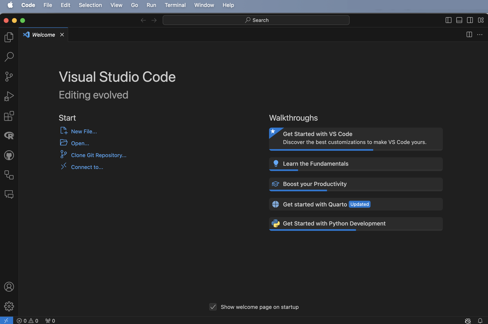
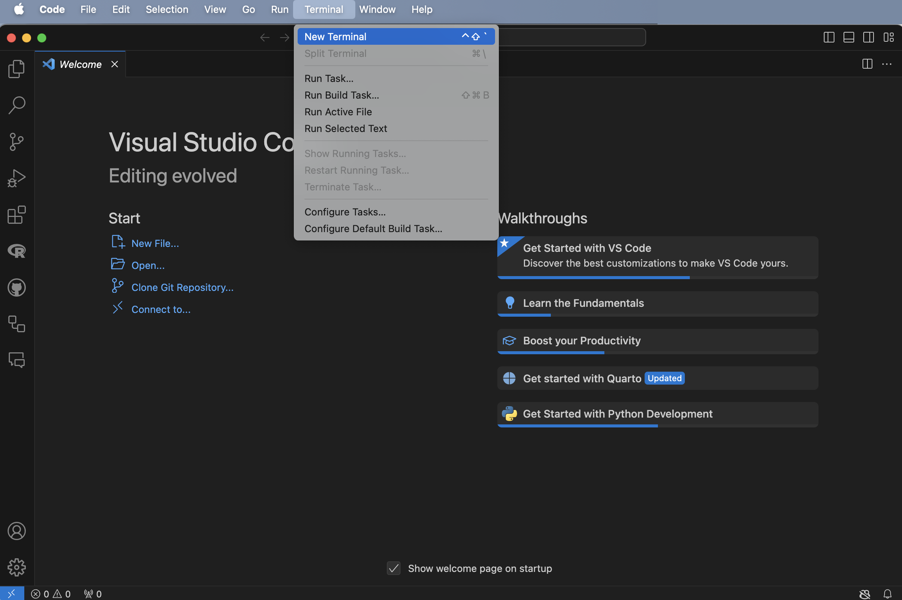
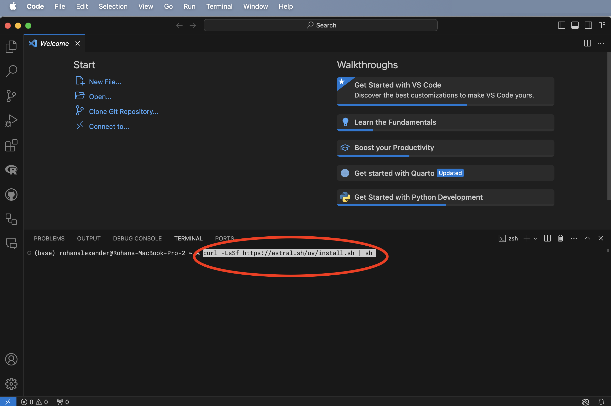
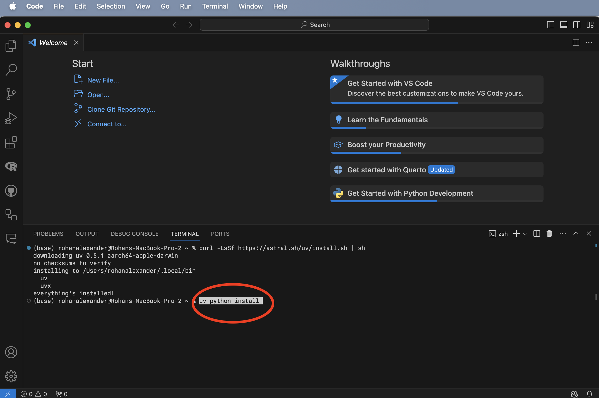
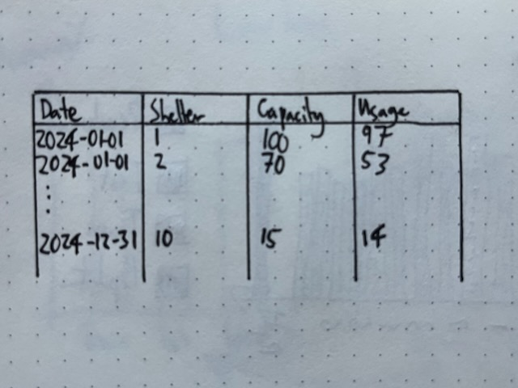
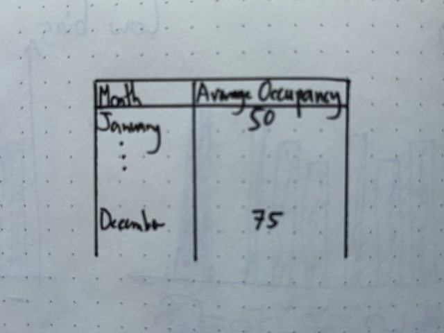

# Python 필수 사항 {#sec-python-essentials}

**선수 지식**

- *데이터 분석을 위한 Python*(원제: *Python for Data Analysis*) [@pythonfordataanalysis] 읽기.
  - 특히 4장 "NumPy 기본"과 5장 "Pandas 시작하기"를 통해 파이썬 데이터 분석의 기초를 다지세요. (이 책에서는 Pandas 대신 성능이 뛰어난 Polars를 주로 다루지만, 기본 개념은 유사합니다.)
- *효율적인 파이썬*(원제: *Fluent Python*) [@ramalho2022fluent] 참고하기.
  - 파이썬다운(Pythonic) 코드 작성을 위한 리스트 컴프리헨션과 제너레이터 개념을 익히는 데 도움이 됩니다.

**핵심 개념 및 기술**

- 파이썬은 데이터 과학 생태계의 핵심 언어로, `uv`와 같은 현대적인 도구를 사용해 프로젝트 환경을 효율적으로 관리할 수 있습니다.
- `Polars`는 Rust 기반의 매우 빠른 데이터프레임 라이브러리로, 대규모 데이터를 처리할 때 Pandas보다 뛰어난 성능을 제공합니다.
- 리스트 컴프리헨션(List Comprehension)과 같은 파이썬 고유의 문법을 익히면 반복적인 데이터 처리 작업을 훨씬 간결하게 수행할 수 있습니다.
- `matplotlib`와 `seaborn`을 활용해 정교한 정적 그래프를 그리며 데이터를 시각적으로 탐색합니다.

**소프트웨어 및 패키지**

- `Python` [@python]
- `datetime>=5.5`
- `uv`
- `polars`

## 서론

`Python`은 귀도 반 로섬(Guido van Rossum)이 개발한 범용 프로그래밍 언어입니다. 1991년 2월에 0.9.0 버전이 처음 출시된 이후 꾸준히 발전해 왔으며, 현재 데이터 과학과 인공지능 분야에서 가장 널리 쓰이는 언어 중 하나입니다. 언어의 이름은 코미디 그룹 '몬티 파이턴(Monty Python)'의 열성적인 팬이었던 제작자가 그들의 프로그램인 *몬티 파이턴의 날아다니는 서커스*에서 따온 것입니다.

파이썬은 기계 학습 분야에서 독보적인 인기를 구가하고 있지만, 본래는 범용 소프트웨어 개발을 위해 설계되었습니다. 따라서 데이터 과학 분야에서 파이썬을 효율적으로 활용하기 위해서는 관련 라이브러리와 패키지에 대한 이해가 필수적입니다. 이 장에서는 파이썬의 방대한 기능 중에서도 데이터 과학 워크플로우를 구축하는 데 핵심적인 요소들을 중심으로 살펴보겠습니다.

만약 이미 `R`을 알고 있다면 데이터 과학용 파이썬을 배우는 과정이 매우 수월할 것입니다. 두 언어가 해결하고자 하는 핵심적인 데이터 문제는 대동소이하며, 대응되는 패키지들이 유사한 논리로 작동하기 때문입니다.

## Python, VS Code, 그리고 uv

`R`과 RStudio의 관계처럼, `Python` 또한 RStudio 내에서 사용할 수 있지만, 파이썬 생태계에서 가장 널리 쓰이는 도구는 단연 VS Code(Visual Studio Code)입니다. [공식 웹사이트](https://code.visualstudio.com)에서 VS Code를 무료로 내려받아 설치할 수 있습니다. 만약 로컬 환경 설정이 어렵게 느껴진다면, Google Colab과 같은 클라우드 환경에서 시작해 보는 것도 좋은 방법입니다.

VS Code를 실행한 뒤(@fig-vscodesetup-a), 상단 메뉴에서 "터미널(Terminal) -> 새 터미널(New Terminal)"을 선택합니다(@fig-vscodesetup-b). 그다음 최근 파이썬 생태계에서 매우 빠르고 효율적인 패키지 및 프로젝트 관리자로 주목받고 있는 `uv`를 설치해 보겠습니다. 터미널 창에 `curl -LsSf https://astral.sh/uv/install.sh | sh`를 입력하고 엔터를 누릅니다(@fig-vscodesetup-c). 설치가 완료되면, 터미널에 `uv python install`을 입력하여 파이썬 인터프리터를 시스템에 설치합니다(@fig-vscodesetup-d).

:::{#fig-vscodesetup layout-ncol="2"}

{#fig-vscodesetup-a width="50%"}

{#fig-vscodesetup-b width="50%"}

{#fig-vscodesetup-c width="50%"}

{#fig-vscodesetup-d width="50%"}

VS Code를 열고 새 터미널을 연 다음 uv와 Python 설치

:::

## 시작하기

### 프로젝트 설정

Open Data Toronto에서 데이터를 다운로드하는 예시로 시작하겠습니다. 시작하려면 모든 코드가 자체 포함될 수 있도록 프로젝트를 만들어야 합니다.

VS Code를 열고 새 터미널을 엽니다: "터미널" -> "새 터미널". 그런 다음 Unix 셸 명령을 사용하여 폴더를 만들고 싶은 곳으로 이동합니다. 예를 들어, `ls`를 사용하여 현재 디렉토리의 모든 폴더를 나열한 다음, `cd`와 폴더 이름을 사용하여 폴더로 이동합니다. 한 단계 위로 이동해야 하는 경우 `..`를 사용합니다.

이 새 폴더를 만들고 싶은 곳이 만족스러우면 터미널에서 `uv init`를 사용하여 이를 수행하고, 엔터를 누릅니다(그 다음 `cd`는 새 폴더 "shelter_usage"로 이동합니다).

```{bash}
#| eval: false
#| echo: true

uv init shelter_usage
cd shelter_usage

```

기본적으로 예시 폴더에 스크립트가 있을 것입니다. `uv run`을 사용하여 해당 스크립트를 실행하여 프로젝트 환경을 만들 것입니다.

```{bash}
#| eval: false
#| echo: true

uv run hello.py

```

프로젝트 환경은 해당 프로젝트에만 해당됩니다. `numpy` 패키지를 사용하여 데이터를 시뮬레이션할 것입니다. 이 패키지를 `uv add`를 사용하여 환경에 추가해야 합니다.

```{bash}
#| eval: false
#| echo: true

uv add numpy

```

그런 다음 `hello.py`를 수정하여 `numpy`를 사용하여 정규 분포에서 시뮬레이션할 수 있습니다.

```{python}
#| eval: false
#| echo: true
#| warning: false
#| message: false

import numpy as np

def main():
    np.random.seed(853)

    mu, sigma = 0, 1
    sample_sizes = [10, 100, 1000, 10000]
    differences = []

    for size in sample_sizes:
        sample = np.random.normal(mu, sigma, size)
        sample_mean = np.mean(sample)
        diff = abs(mu - sample_mean)
        differences.append(diff)
        print(f"표본 크기: {size}")
        print(f"  표본과 모집단 평균 간의 차이: {round(diff, 3)}")

if __name__ == "__main__":
    main()

```

이제 `hello.py` 파일을 저장한 뒤, 터미널에서 `uv run hello.py` 명령어로 실행해 봅니다. VS Code를 종료했다가 다시 시작하더라도, 해당 프로젝트 폴더를 열고 동일한 명령어를 실행하면 언제든 일관된 분석 환경에서 코드를 실행할 수 있습니다. 파이썬에서 프로젝트는 이처럼 독립된 폴더와 그 안의 가상 환경을 통해 관리되는 것이 기본입니다.

### 계획

이 데이터셋을 [@sec-fire-hose]에서 처음 사용했지만, 다시 말하지만, 매일 각 쉼터에 대해 쉼터를 사용한 사람들의 수가 있습니다. 따라서 우리가 시뮬레이션하고 싶은 데이터셋은 [@fig-python_torontohomeless-data]와 같고, [@fig-python_torontohomeless-table]과 같이 매월 평균 일일 점유 침대 수 표를 만들고 싶습니다.

:::{#fig-python_torontohomeless layout-ncol="2"}

{#fig-python_torontohomeless-data width="50%"}

{#fig-python_torontohomeless-table width="50%"}

토론토의 쉼터 사용량과 관련된 데이터셋 및 표의 스케치

:::

### 시뮬레이션

관심 있는 데이터셋을 더 철저히 시뮬레이션하고 싶습니다. 시뮬레이션된 결과를 저장할 데이터프레임을 제공하기 위해 `polars`를 사용할 것이므로, `uv add`를 사용하여 환경에 추가해야 합니다.

```{bash}
#| eval: false
#| echo: true

uv add polars

```

`00-simulate_data.py`라는 새 Python 파일을 만듭니다.

```{python}
#| eval: false
#| echo: true
#| warning: false
#| message: false

#### 서문 ####
# 목적: 일일 쉼터 사용량 데이터셋 시뮬레이션
# 저자: Rohan Alexander
# 날짜: 2024년 11월 12일
# 연락처: rohan.alexander@utoronto.ca
# 라이선스: MIT
# 전제 조건:
# - `polars` 추가: uv add polars
# - `numpy` 추가: uv add numpy
# - `datetime` 추가: uv add datetime

#### 작업 공간 설정 ####
import polars as pl
import numpy as np
from datetime import date

rng = np.random.default_rng(seed=853)

#### 데이터 시뮬레이션 ####
# 쉼터 10개와 설정된 용량 시뮬레이션
shelters_df = pl.DataFrame(
    {
        "Shelters": [f"쉼터 {i}" for i in range(1, 11)],
        "Capacity": rng.integers(low=10, high=100, size=10),
    }
)

# 날짜 데이터프레임 생성
dates = pl.date_range(
    start=date(2024, 1, 1), end=date(2024, 12, 31), interval="1d", eager=True
).alias("날짜")

# 날짜를 데이터프레임으로 변환
dates_df = pl.DataFrame(dates)

# 날짜와 쉼터 결합
data = dates_df.join(shelters_df, how="cross")

# 포아송 추출로 사용량 추가
poisson_draw = rng.poisson(lam=data["Capacity"])
usage = np.minimum(poisson_draw, data["Capacity"])

data = data.with_columns([pl.Series("사용량", usage)])

data.write_parquet("simulated_data.parquet")

```

이 시뮬레이션된 데이터를 기반으로 실제 데이터에 적용할 테스트를 작성하고 싶습니다. 이를 위해 `pydantic`을 사용할 것이므로, `uv add`를 사용하여 환경에 추가해야 합니다.

```{bash}
#| eval: false
#| echo: true

uv add pydantic

```

`00-test_simulated_data.py`라는 새 Python 파일을 만듭니다. 첫 번째 단계는 `pydantic`에서 제공하는 `BaseModel`의 하위 클래스인 `ShelterData`를 정의하는 것입니다.

```{python}
#| eval: false
#| echo: true
#| warning: false
#| message: false

from pydantic import BaseModel, Field, ValidationError, field_validator
from datetime import date

# Pydantic 모델 정의
class ShelterData(BaseModel):
    Dates: date  # 날짜 형식 유효성 검사 (예: 'YYYY-MM-DD')
    Shelters: str  # 문자열이어야 함
    Capacity: int = Field(..., ge=0)  # 음수가 아닌 정수여야 함
    Usage: int = Field(..., ge=0)  # 음수가 아니어야 함

    # 사용량이 용량을 초과하지 않도록 필드 유효성 검사기 추가
    @field_validator("Usage")
    def check_usage_not_exceed_capacity(cls, usage, info):
        capacity = info.data.get("Capacity")
        if capacity is not None and usage > capacity:
            raise ValueError(f"사용량 ({usage})이 용량 ({capacity})을 초과합니다.")
        return usage

```

날짜가 유효한지, 쉼터가 올바른 유형인지, 용량과 사용량이 모두 음수가 아닌 정수인지 테스트하는 데 관심이 있습니다. 추가적인 문제는 사용량이 용량을 초과해서는 안 된다는 것입니다. 이를 위한 테스트를 작성하기 위해 `field_validator`를 사용합니다.

그런 다음 시뮬레이션된 데이터셋을 가져와 테스트할 수 있습니다.

```{python}
#| eval: false
#| echo: true
#| warning: false
#| message: false

import polars as pl

df = pl.read_parquet("simulated_data.parquet")

# Polars DataFrame을 유효성 검사를 위한 딕셔너리 목록으로 변환
data_dicts = df.to_dicts()

# 데이터셋을 일괄적으로 유효성 검사
validated_data = []
errors = []

# 일괄 유효성 검사
for i, row in enumerate(data_dicts):
    try:
        validated_row = ShelterData(**row)  # 각 행 유효성 검사
        validated_data.append(validated_row)
    except ValidationError as e:
        errors.append((i, e))

# 유효성 검사된 데이터를 Polars DataFrame으로 다시 변환
validated_df = pl.DataFrame([row.dict() for row in validated_data])

# 결과 표시
print("유효성 검사된 행:")
print(validated_df)

if errors:
    print("\n오류:")
    for i, error in errors:
        print(f"행 {i}: {error}")

```

오류가 있었다면 어떻게 되었을지 확인하기 위해 두 가지 오류가 포함된 더 작은 데이터셋을 고려할 수 있습니다. 즉, 잘못 형식화된 날짜 하나와 사용량이 용량을 초과하는 상황 하나입니다.

```{python}
#| eval: false
#| echo: true
#| warning: false
#| message: false

import polars as pl
from pydantic import BaseModel, Field, ValidationError, field_validator
from datetime import date

# Pydantic 모델 정의
class ShelterData(BaseModel):
    Dates: date  # 날짜 형식 유효성 검사 (예: 'YYYY-MM-DD')
    Shelters: str  # 문자열이어야 함
    Capacity: int = Field(..., ge=0)  # 음수가 아닌 정수여야 함
    Usage: int = Field(..., ge=0)  # 음수가 아니어야 함

    # 사용량이 용량을 초과하지 않도록 필드 유효성 검사기 추가
    @field_validator("Usage")
    def check_usage_not_exceed_capacity(cls, usage, info):
        capacity = info.data.get("Capacity")
        if capacity is not None and usage > capacity:
            raise ValueError(f"사용량 ({usage})이 용량 ({capacity})을 초과할 수 없습니다.")
        return usage

# 데이터셋 정의
df = [
    {"Dates": "2024-01-01", "Shelters": "쉼터 1", "Capacity": 23, "Usage": 22},
    {"Dates": "로한", "Shelters": "쉼터 2", "Capacity": 62, "Usage": 62},
    {"Dates": "2024-01-01", "Shelters": "쉼터 3", "Capacity": 93, "Usage": 88},
    # 테스트를 위한 잘못된 행 추가
    {"Dates": "2024-01-01", "Shelters": "쉼터 4", "Capacity": 50, "Usage": 55},
]

# 데이터셋을 일괄적으로 유효성 검사
validated_data = []
errors = []

# 일괄 유효성 검사
for i, row in enumerate(df):
    try:
        validated_row = ShelterData(**row)  # 각 행 유효성 검사
        validated_data.append(validated_row)
    except ValidationError as e:
        errors.append((i, e))

# 유효성 검사된 데이터를 Polars DataFrame으로 다시 변환
validated_df = pl.DataFrame([row.dict() for row in validated_data])

# 결과 표시
print("유효성 검사된 행:")
print(validated_df)

if errors:
    print("\n오류:")
    for i, error in errors:
        print(f"행 {i}: {error}")

```

다음 메시지가 나타납니다.

```

오류:
행 1: ShelterData에 대한 1개의 유효성 검사 오류
Dates
  입력은 유효한 날짜 또는 datetime이어야 합니다. 입력이 너무 짧습니다 [type=date_from_datetime_parsing, input_value='로한', input_type=str]
    자세한 내용은 https://errors.pydantic.dev/2.9/v/date_from_datetime_parsing을 참조하십시오.
행 3: ShelterData에 대한 1개의 유효성 검사 오류
Usage
  값 오류, 사용량 (55)이 용량 (50)을 초과할 수 없습니다. [type=value_error, input_value=55, input_type=int]
    자세한 내용은 https://errors.pydantic.dev/2.9/v/value_error을 참조하십시오.

```

### 획득

이전과 동일한 출처 사용: https://ckan0.cf.opendata.inter.prod-toronto.ca/dataset/21c83b32-d5a8-4106-a54f-010dbe49f6f2/resource/ffd20867-6e3c-4074-8427-d63810edf231/download/Daily%20shelter%20overnight%20occupancy.csv

```{python}
#| eval: false
#| echo: true
#| warning: false
#| message: false

import polars as pl

# CSV 파일 URL
url = "https://ckan0.cf.opendata.inter.prod-toronto.ca/dataset/21c83b32-d5a8-4106-a54f-010dbe49f6f2/resource/ffd20867-6e3c-4074-8427-d63810edf231/download/Daily%20shelter%20overnight%20occupancy.csv"

# CSV 파일을 Polars DataFrame으로 읽기
df = pl.read_csv(url)

# 원시 데이터 저장
df.write_parquet("shelter_usage.parquet")

```

몇 개의 열과 데이터가 있는 행에만 관심이 있을 것입니다.

```{python}
#| eval: false
#| echo: true
#| warning: false
#| message: false

import polars as pl

df = pl.read_parquet("shelter_usage.parquet")

# 특정 열 선택
selected_columns = ["OCCUPANCY_DATE", "SHELTER_ID", "OCCUPIED_BEDS", "CAPACITY_ACTUAL_BED"]

selected_df = df.select(selected_columns)

# 데이터가 있는 행만 필터링
filtered_df = selected_df.filter(df["OCCUPIED_BEDS"].is_not_null())

print(filtered_df.head())

renamed_df = filtered_df.rename({"OCCUPANCY_DATE": "date",
                                 "SHELTER_ID": "Shelters",
                                 "CAPACITY_ACTUAL_BED": "Capacity",
                                 "OCCUPIED_BEDS": "Usage"
                                 })

print(renamed_df.head())

renamed_df.write_parquet("cleaned_shelter_usage.parquet")

```

그런 다음 실제 데이터셋에 테스트를 적용하고 싶을 수 있습니다.

```{python}
#| eval: false
#| echo: true
#| warning: false
#| message: false

import polars as pl
from pydantic import BaseModel, Field, ValidationError, field_validator
from datetime import date

# Pydantic 모델 정의
class ShelterData(BaseModel):
    Dates: date  # 날짜 형식 유효성 검사 (예: 'YYYY-MM-DD')
    Shelters: str  # 문자열이어야 함
    Capacity: int = Field(..., ge=0)  # 음수가 아닌 정수여야 함
    Usage: int = Field(..., ge=0)  # 음수가 아니어야 함

    # 사용량이 용량을 초과하지 않도록 필드 유효성 검사기 추가
    @field_validator("Usage")
    def check_usage_not_exceed_capacity(cls, usage, info):
        capacity = info.data.get("Capacity")
        if capacity is not None and usage > capacity:
            raise ValueError(f"사용량 ({usage})이 용량 ({capacity})을 초과할 수 없습니다.")
        return usage

df = pl.read_parquet("cleaned_shelter_usage.parquet")

# Polars DataFrame을 유효성 검사를 위한 딕셔너리 목록으로 변환
data_dicts = df.to_dicts()

# 데이터셋을 일괄적으로 유효성 검사
validated_data = []
errors = []

# 일괄 유효성 검사
for i, row in enumerate(data_dicts):
    try:
        validated_row = ShelterData(**row)  # 각 행 유효성 검사
        validated_data.append(validated_row)
    except ValidationError as e:
        errors.append((i, e))

# 유효성 검사된 데이터를 Polars DataFrame으로 다시 변환
validated_df = pl.DataFrame([row.dict() for row in validated_data])

# 결과 표시
print("유효성 검사된 행:")
print(validated_df)

if errors:
    print("\n오류:")
    for i, error in errors:
        print(f"행 {i}: {error}")

```

### 탐색

데이터 조작

```{python}
#| eval: false
#| echo: true
#| warning: false
#| message: false

import polars as pl

df = pl.read_parquet("cleaned_shelter_usage.parquet")

# 날짜 열을 datetime으로 변환하고 명확성을 위해 이름 변경
df = df.with_columns(pl.col("date").str.strptime(pl.Date, "%Y-%m-%d").alias("date"))

# "Dates"로 그룹화하고 총 "Capacity" 및 "Usage" 계산
aggregated_df = (
    df.group_by("date")
    .agg([
        pl.col("Capacity").sum().alias("총 용량"),
        pl.col("Usage").sum().alias("총 사용량")
    ])
    .sort("date")  # 날짜별로 결과 정렬
)

# 집계된 DataFrame 표시
print(aggregated_df)

```

그래프 만들기

```{python}
#| eval: false
#| echo: true
#| warning: false
#| message: false

import polars as pl
import seaborn as sns
import matplotlib.pyplot as plt
import pandas as pd
import matplotlib.dates as mdates

# Parquet 파일에서 Polars DataFrame 읽기
df = pl.read_parquet("analysis_data.parquet")

# 'date' 열이 Polars에서 datetime 유형인지 확인
df = df.with_columns([
    pl.col('date').cast(pl.Date)
])

# 관련 열을 선택하고 DataFrame 재구성
df_melted = df.select(["date", "총 용량", "총 사용량"]).melt(
    id_vars="date",
    variable_name="측정 항목",
    value_name="값"
)

# Polars DataFrame을 Seaborn을 위한 Pandas DataFrame으로 변환
df_melted_pd = df_melted.to_pandas()

# Pandas에서 'date' 열이 datetime인지 확인
df_melted_pd['date'] = pd.to_datetime(df_melted_pd['date'])

# 플로팅 스타일 설정
sns.set_theme(style="whitegrid")

# 플롯 생성
plt.figure(figsize=(12, 6))
sns.lineplot(
    data=df_melted_pd,
    x="date",
    y="값",
    hue="측정 항목",
    linewidth=2.5
)

# x축 레이블을 보기 좋게 형식 지정
plt.gca().xaxis.set_major_locator(mdates.AutoDateLocator())
plt.gca().xaxis.set_major_formatter(mdates.DateFormatter('%Y-%m-%d'))

# 가독성을 위해 x축 레이블 회전
plt.xticks(rotation=45)

# 레이블 및 제목 추가
plt.xlabel("날짜")
plt.ylabel("값")
plt.title("시간 경과에 따른 총 용량 및 사용량")

# 눈금 레이블 잘림 방지를 위해 레이아웃 조정
plt.tight_layout()

# 플롯 표시
plt.show()

```

### 공유

한 가지 좋은 점은 Quarto 문서에서 Python을 사용할 수 있다는 것입니다. 이를 위해 [여기](https://marketplace.visualstudio.com/items?itemName=quarto.quarto)에서 Quarto 확장을 설치하여 VS Code에 추가해야 합니다. 터미널에서 `quarto preview`를 실행하여 문서를 렌더링할 수 있습니다.

VS Code는 Microsoft에서 만들었으며, Microsoft는 GitHub도 소유하고 있습니다. 따라서 계정으로 이동하여 로그인하여 GitHub 계정을 VS Code에 추가할 수 있습니다.

## Python

파이썬의 문법은 간결하고 읽기 쉬운 것으로 유명합니다. 데이터 과학 작업에서 자주 마주하게 될 두 가지 핵심 제어문과 기법을 살펴보겠습니다.

### For 루프

`for` 루프는 리스트나 튜플 같은 반복 가능한(Iterable) 객체의 요소를 하나씩 꺼내어 동일한 작업을 반복할 때 사용합니다.

```{python}
#| eval: true
#| echo: true

names = ["로한", "모니카", "에드워드"]
for name in names:
    print(f"안녕하세요, {name}님!")
```

### 리스트 컴프리헨션

리스트 컴프리헨션(List Comprehension)은 기존 리스트를 바탕으로 새로운 리스트를 만들 때 사용하는 파이썬 특유의 간결한 문법입니다. `for` 루프보다 가독성이 높고 실행 속도도 빠른 경우가 많아 애용됩니다.

```{python}
#| eval: true
#| echo: true

# 각 숫자의 제곱을 구하는 예시
numbers = [1, 2, 3, 4, 5]
squares = [n**2 for n in numbers]
print(squares)
```

## 그래프 만들기

파이썬 시각화 생태계는 매우 방대합니다. 가장 기초가 되는 `matplotlib`와 이를 바탕으로 통계적 그래픽을 더 쉽게 그리게 해주는 `seaborn`이 핵심입니다.

### matplotlib

`matplotlib`는 파이썬에서 그래프를 그릴 때 가장 기본이 되는 라이브러리입니다. 거의 모든 시각적 요소를 세밀하게 제어할 수 있는 저수준(Low-level) API를 제공합니다.

```{python}
#| eval: false
#| echo: true

import matplotlib.pyplot as plt

plt.plot([1, 2, 3, 4], [1, 4, 9, 16])
plt.ylabel('값')
plt.show()
```

### seaborn

`seaborn`은 `matplotlib`를 기반으로 구축된 고수준(High-level) 인터페이스입니다. 복잡한 통계 그래프를 단 몇 줄의 코드로 아름답게 그릴 수 있으며, Pandas나 Polars 데이터프레임과 매우 잘 통합됩니다.

```{python}
#| eval: false
#| echo: true

import seaborn as sns

# 내장 데이터셋 로드
tips = sns.load_dataset("tips")
sns.scatterplot(data=tips, x="total_bill", y="tip", hue="time")
```

## polars 탐색

`Polars`는 Rust로 작성된 초고속 데이터프레임 라이브러리입니다. 지연 실행(Lazy evaluation)과 멀티스레딩을 지원하여 대규모 데이터 처리에 최적화되어 있습니다.

### 데이터 가져오기

`Polars`는 다양한 형식의 데이터를 빠르게 읽어올 수 있습니다. 특히 `read_csv()`와 `read_parquet()` 함수는 업계 최고 수준의 속도를 자랑합니다.

```{python}
#| eval: false
#| echo: true

import polars as pl

# CSV 읽기
df_csv = pl.read_csv("data.csv")

# Parquet 읽기 (권장)
df_parquet = pl.read_parquet("data.parquet")
```

### 결합 및 피벗을 사용한 데이터셋 조작

여러 데이터프레임을 합치거나 구조를 바꿀 때 `join()`, `pivot()`, `melt()` 등을 사용합니다. `dplyr`의 동사들과 개념적으로 매우 유사합니다.

```{python}
#| eval: false
#| echo: true

# 두 데이터프레임 결합
combined_df = df1.join(df2, on="id", how="left")

# 데이터를 길게 변환 (Unpivot)
long_df = df.melt(id_vars="date", value_vars=["temp", "humidity"])
```

### 문자열 조작

`Polars`는 `str` 네임스페이스를 통해 풍부한 문자열 처리 함수를 제공합니다. 정규표현식을 활용한 정교한 텍스트 정제가 가능합니다.

```{python}
#| eval: false
#| echo: true

# 대문자 변환 및 특정 단어 포함 여부 확인
df = df.with_columns([
    pl.col("name").str.to_uppercase().alias("NAME_UPPER"),
    pl.col("description").str.contains("urgent").alias("is_urgent")
])
```

### 요인 변수

범주형 데이터는 `Categorical` 타입을 사용해 메모리 효율적으로 관리할 수 있습니다. 이는 R의 `factor`와 유사한 역할을 합니다.

```{python}
#| eval: false
#| echo: true

# 특정 열을 범주형으로 변환
df = df.with_columns(
    pl.col("category").cast(pl.Categorical)
)
```

## 연습 문제

### 연습 {.unnumbered}

1. **(환경 설정)** VS Code에서 새로운 프로젝트 폴더를 만들고, `uv`를 사용해 파이썬 환경을 초기화해 보세요. `polars`와 `matplotlib` 패키지를 추가해 보세요.
2. **(문법 실습)** 1부터 20 사이의 숫자 중 3의 배수만을 골라 제곱한 리스트를 '리스트 컴프리헨션'을 사용해 만들어 보세요.
3. **(데이터 처리)** `polars`를 사용해 가상의 학생 성적 데이터셋(이름, 수학 점수, 영어 점수)을 만들고, 두 점수의 평균을 나타내는 새로운 열을 추가해 보세요.

### 퀴즈 {.unnumbered}

1. 파이썬에서 프로젝트 환경과 패키지를 효율적으로 관리하기 위해 이 장에서 추천한 도구는 무엇인가요? (정답: `uv`)
2. `[n * 2 for n in [1, 2, 3]]` 코드의 실행 결과는 무엇입니까? (정답: `[2, 4, 6]`)
3. `Polars`에서 데이터를 '길게' 변환(Unpivot)할 때 사용하는 함수는 무엇인가요? (정답: `melt()`)
4. 통계 시각화에 특화된 파이썬 라이브러리로, `matplotlib`를 기반으로 구축된 것은 무엇인가요? (정답: `seaborn`)

### 과제 {.unnumbered}

무료 Replit "100일 코딩" Python [과정](https://replit.com/learn/100-days-of-python) 중 1일차부터 10일차까지의 내용을 완료하고, 학습한 핵심 개념들을 활용해 짧은 분석 스크립트를 작성하여 GitHub 리포지토리에 제출하세요.
