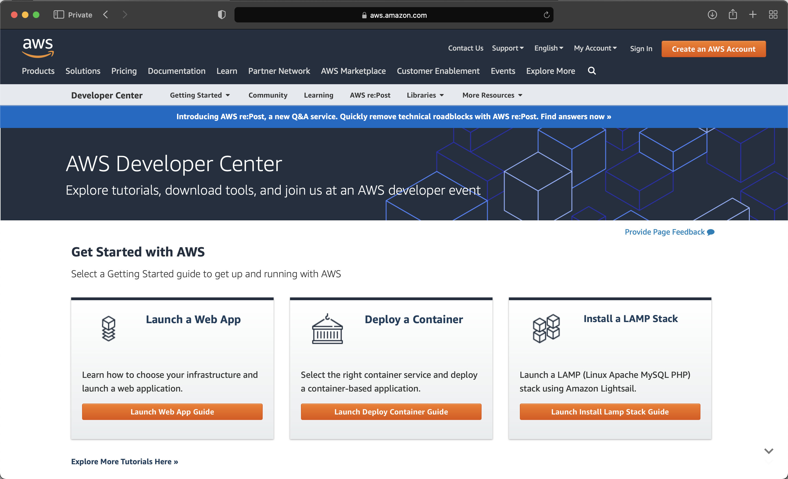
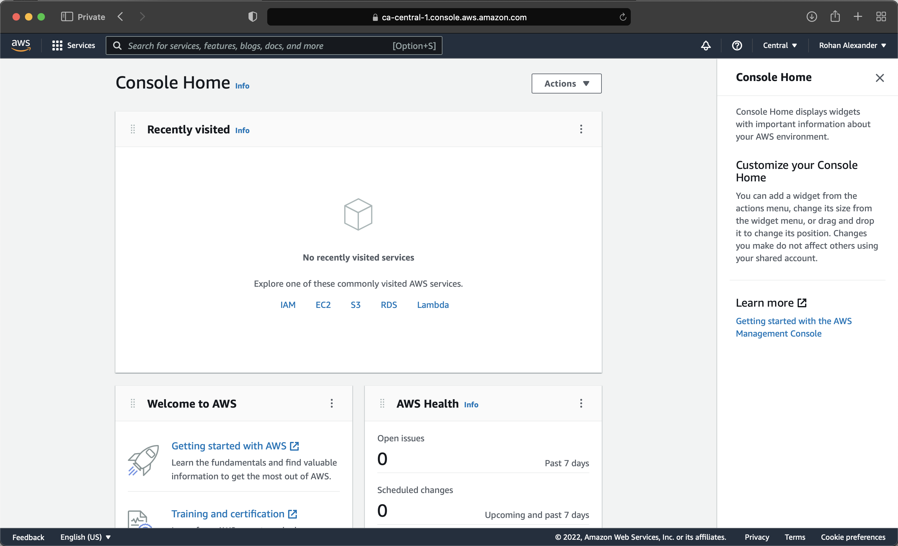
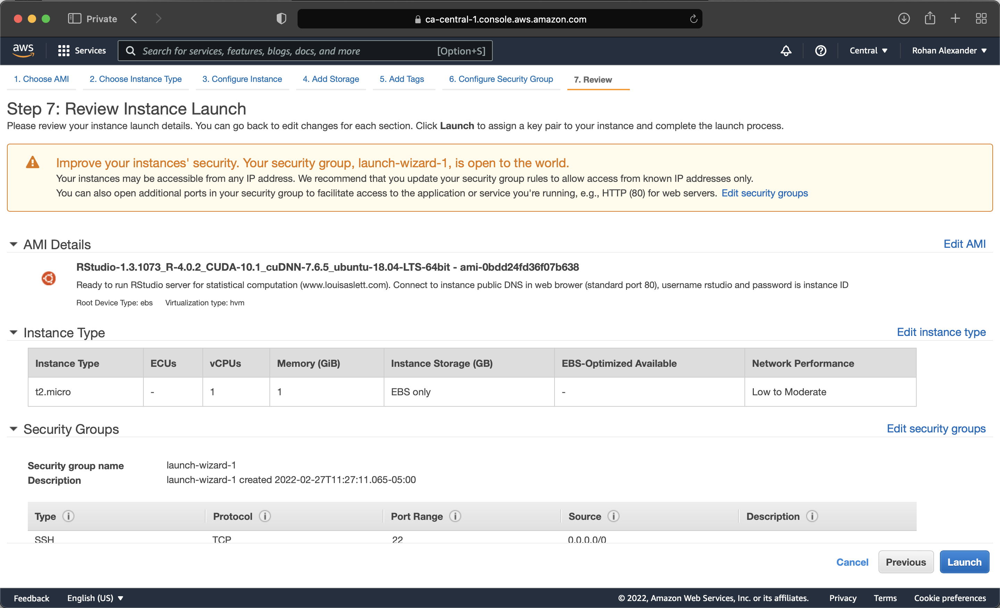
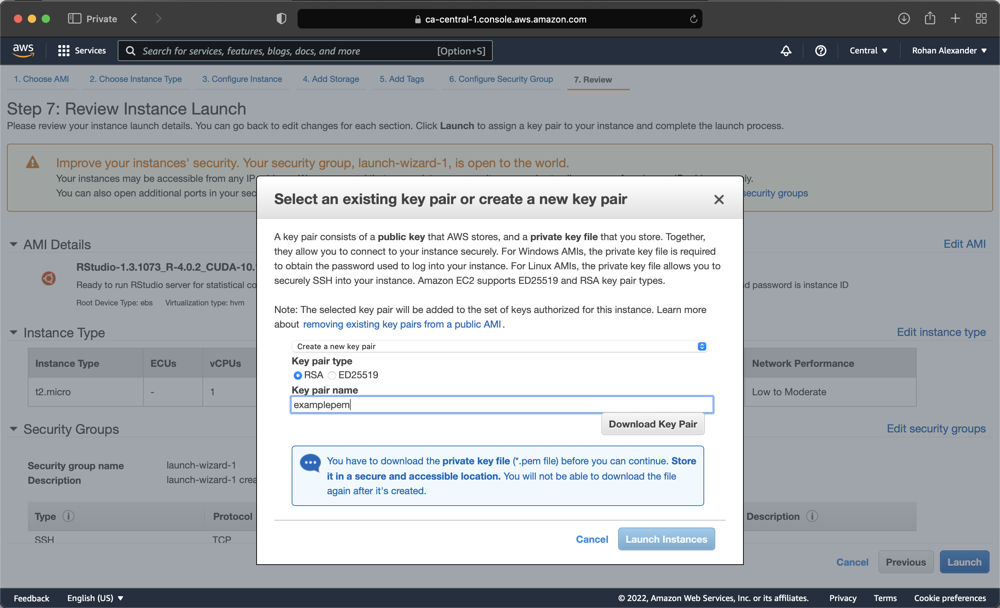

# 프로덕션(Production) 및 배포 {#sec-production}

**선수 지식**

- *과학, 클라우드를 만나다(Science Hits the Cloud)*, [@Gentemann2021] 읽기
  - 클라우드 컴퓨팅이 연구와 분석에 가져온 혁신적인 변화를 설명합니다.
- *실시간 기계 학습(Machine Learning is Going Real-Time)*, [@chiphuyenone] 읽기
  - 실시간 예측 모델의 필요성과 그 구현에 대한 논의를 다룹니다.
- *Plumber API로 R의 활용도 높이기(Democratizing R with Plumber APIs)*, [@democratizingr] 시청하기
  - `plumber` 패키지를 사용해 R 모델을 유연한 API로 변환하는 과정을 소개합니다.
- *기계 학습 운영화(Operationalizing Machine Learning): 인터뷰 연구*, [@mleinterviews] 읽기
  - 기계 학습 엔지니어들과의 생생한 인터뷰를 통해 실무 현장의 목소리를 전달합니다.

**주요 개념 및 기술**

- 모델을 '프로덕션'에 투입한다(Productionizing)는 것은 분석 결과물을 실제 서비스 환경에서 작동하도록 만드는 과정입니다. 이를 위해서는 클라우드 인프라 활용법과 API 설계 능력 등 한 단계 더 높은 기술적 역량이 요구됩니다.

**소프트웨어 및 패키지**

- `analogsea` [@citeanalogsea]
- `plumber` [@plumber]
- `plumberDeploy` [@plumberdeploy]
- `remotes` [@remotes]
- `ssh` [@ssh]
- `tidymodels` [@citeTidymodels]
- `tidyverse` [@tidyverse]

```{r}
#| message: false
#| warning: false

library(analogsea)
library(plumber)
#library(plumberDeploy)
library(remotes)
#library(ssh)
library(tidymodels)
library(tidyverse)

```

## 서론

데이터셋을 성공적으로 개발하고 신뢰할 수 있는 모델을 구축했다면, 이제 이를 자신의 컴퓨터를 넘어 더 많은 사람들이 활용할 수 있도록 공유하고 싶을 것입니다. 모델을 배포하는 주요 방법은 다음과 같습니다:

- 클라우드(Cloud) 플랫폼 활용
- R 패키지 제작
- `shiny` 환경의 대화형 애플리케이션 구축
- `plumber`를 활용한 API(Application Programming Interface) 서버 구축

지금까지 우리가 고수해 온 분석 워크플로는 다른 사람들이 우리의 연구 과정을 투명하게 이해하고 신뢰할 수 있게 만드는 데 초점을 맞추었습니다. 프로덕션 단계는 여기서 한 걸음 더 나아가, 완성된 모델이 실질적인 가치를 창출하도록 만드는 과정입니다. 예를 들어, 웹에서 데이터를 수집하고 정제하여 멋진 차트와 함께 모델을 만들었다고 가정해 봅시다. 학술적인 목적이라면 여기서 멈추어도 충분하겠지만, 비즈니스 환경에서는 이 모델을 이용해 실제 서비스를 제공해야 할 때가 많습니다. 사용자가 웹사이트에 여러 정보를 입력하면, 여러분이 만든 모델이 실시간으로 보험 견적을 산출해 보여주는 서비스가 대표적인 예입니다.

이 장에서는 먼저 로컬 컴퓨터에서 수행하던 작업을 클라우드로 옮기는 방법부터 시작합니다. 이어서 R 패키지와 Shiny를 활용한 모델 공유 방법을 살펴본 뒤, 보다 범용적인 활용을 위해 모델을 API 형태로 제공하는 `plumber` [@plumber] 패키지 사용법을 자세히 다루겠습니다.

## 아마존 웹 서비스

전설에 따르면 클라우드는 다른 사람의 컴퓨터에 대한 또 다른 이름일 뿐입니다. 그리고 그것이 어느 정도 사실이지만, 우리의 목적에는 그것으로 충분합니다. 다른 사람의 컴퓨터를 사용하는 방법을 배우는 것은 여러 가지 이유로 훌륭할 수 있습니다. 다음을 포함합니다.

- 확장성: 새 컴퓨터를 구입하는 것은 상당히 비쌀 수 있습니다. 특히 가끔씩만 실행해야 하는 경우 더욱 그렇습니다. 그러나 클라우드를 사용하면 몇 시간 또는 며칠 동안만 임대할 수 있습니다. 이것은 우리가 이 비용을 상각하고 구매를 결정하기 전에 실제로 필요한 것이 무엇인지 파악할 수 있게 해줍니다. 또한 수요가 갑자기 크게 증가하는 경우 계산 규모를 쉽게 늘리거나 줄일 수 있습니다.
- 이식성: 분석 워크플로를 로컬 컴퓨터에서 클라우드로 옮길 수 있다면, 이는 재현성 및 이식성 측면에서 좋은 일을 하고 있음을 시사합니다. 적어도 코드는 로컬과 클라우드 모두에서 실행될 수 있으며, 이는 재현성 측면에서 큰 진전입니다.
- 설정 및 잊기: 시간이 오래 걸리는 작업을 수행하는 경우, 자신의 컴퓨터가 밤새 실행될 필요가 없다는 점은 훌륭할 수 있습니다. 또한, 많은 클라우드 옵션에서 R 및 파이썬과 같은 오픈 소스 통계 소프트웨어는 이미 사용 가능하거나 비교적 쉽게 설정할 수 있습니다.

그렇긴 하지만, 다음과 같은 단점도 있습니다.

- 비용: 대부분의 클라우드 옵션은 저렴하지만, 무료인 경우는 거의 없습니다. 비용에 대한 아이디어를 제공하자면, 잘 갖춰진 AWS 인스턴스를 며칠 동안 사용하는 데 몇 달러가 들 수 있습니다. 또한, 특히 처음에는 무언가를 실수로 잊어버리고 예상치 못한 큰 청구서가 발생하는 것도 쉽습니다.
- 공개: 실수를 저지르고 실수로 모든 것을 공개하는 것이 쉬울 수 있습니다.
- 시간: 클라우드에서 설정하고 익숙해지는 데 시간이 걸립니다.

클라우드를 사용할 때, 우리는 일반적으로 "가상 머신"(VM)에서 코드를 실행합니다. 이것은 특정 기능을 가진 컴퓨터처럼 작동하도록 설계된 더 큰 컴퓨터 모음의 일부인 할당입니다. 예를 들어, 가상 머신에 8GB RAM, 128GB 저장 공간, 4개의 CPU가 있다고 지정할 수 있습니다. 그러면 VM은 해당 사양을 가진 컴퓨터처럼 작동합니다. 클라우드 옵션 사용 비용은 VM 사양에 따라 증가합니다.

어떤 의미에서, 우리는 [@sec-fire-hose] 에서 Posit Cloud를 사용하도록 처음 권장한 것을 통해 클라우드 옵션으로 시작했으며, [부록 -[@sec-r-essentials]] 에서 로컬 컴퓨터로 이동했습니다. 그 클라우드 옵션은 특히 초보자를 위해 설계되었습니다. 이제 더 일반적인 클라우드 옵션인 아마존 웹 서비스(AWS)를 소개합니다. 종종 특정 비즈니스는 Google, AWS 또는 Azure와 같은 특정 클라우드 옵션을 사용하지만, 하나에 익숙해지면 다른 것을 더 쉽게 사용할 수 있습니다.

아마존 웹 서비스는 아마존의 클라우드 서비스입니다. 시작하려면 [여기](https://aws.amazon.com/developer/)에서 AWS 개발자 계정을 만들어야 합니다(@fig-awsone).

:::{#fig-ipudddddms layout-nrow=2}

{#fig-awsone}

{#fig-awstwo}

{#fig-awsthree}

{#fig-awsfive}

아마존 AWS 설정 개요

:::

계정을 만든 후, 액세스할 컴퓨터가 위치할 지역을 선택해야 합니다. 그 후, EC2로 "가상 머신 시작"을 원합니다(@fig-awstwo).

첫 번째 단계는 Amazon Machine Image(AMI)를 선택하는 것입니다. 이것은 사용할 컴퓨터의 세부 정보를 제공합니다. 예를 들어, 로컬 컴퓨터는 Monterey를 실행하는 MacBook일 수 있습니다. 루이스 애슬렛은 RStudio 및 기타 많은 것이 이미 설정된 AMI를 [여기](http://www.louisaslett.com/RStudio_AMI/)에서 제공합니다. 등록한 지역의 AMI를 검색하거나 애슬렛의 웹사이트에서 관련 링크를 클릭할 수 있습니다. 예를 들어, 캐나다 중앙 지역에 설정된 AMI를 사용하려면 "ami-0bdd24fd36f07b638"을 검색합니다. 이러한 AMI를 사용하는 이점은 RStudio를 위해 특별히 설정되었다는 것이지만, 2020년 8월에 컴파일되었기 때문에 약간 오래되었다는 단점이 있습니다.

다음 단계에서는 컴퓨터의 성능을 선택할 수 있습니다. 무료 티어는 기본 컴퓨터이지만, 필요할 때 더 좋은 것을 선택할 수 있습니다. 이 시점에서 거의 인스턴스를 시작할 수 있습니다(@fig-awsthree). AWS를 더 진지하게 사용하기 시작하면, 특히 계정 보안과 관련하여 다른 옵션을 선택할 수 있습니다. AWS는 키 페어에 의존합니다. 따라서 Privacy Enhanced Mail(PEM)을 만들고 로컬에 저장해야 합니다(@fig-awsfive). 그런 다음 인스턴스를 시작할 수 있습니다.

몇 분 후, 인스턴스가 실행될 것입니다. "공개 DNS"를 브라우저에 붙여넣어 사용할 수 있습니다. 사용자 이름은 "rstudio"이고 비밀번호는 인스턴스 ID입니다.

RStudio가 실행 중이어야 합니다. 이것은 흥미로운 일입니다. 가장 먼저 할 일은 인스턴스의 지침에 따라 기본 비밀번호를 변경하는 것입니다.

예를 들어, `tidyverse`를 설치할 필요가 없습니다. 대신 라이브러리를 호출하고 계속 진행할 수 있습니다. 이것은 이 AMI에 많은 패키지가 이미 설치되어 있기 때문입니다. `installed.packages()`를 사용하여 설치된 패키지 목록을 볼 수 있습니다. 예를 들어, `rstan`은 이미 설치되어 있으며, 필요한 경우 GPU가 있는 인스턴스를 설정할 수 있습니다.

아마도 AWS 인스턴스를 시작할 수 있는 것만큼 중요한 것은 그것을 중지할 수 있다는 것입니다(청구되지 않도록). 무료 티어는 유용하지만, 꺼야 합니다. 인스턴스를 중지하려면 AWS 인스턴스 페이지에서 그것을 선택한 다음 "작업 -> 인스턴스 상태 -> 종료"를 선택하십시오.

## R 패키지

우리는 지금까지 다른 연구자들이 정성껏 만들어 배포한 패키지들을 가져다 쓰는 데 익숙해졌습니다. 하지만 여러분의 분석 워크플로우가 성숙해짐에 따라, 자주 반복되는 함수나 공들여 정제한 데이터셋을 **나만의 R 패키지**로 묶어 관리해야 할 시점이 옵니다. 이는 단순한 정리를 넘어 연구의 **재현성**과 **신뢰성**을 한 단계 높이는 소프트웨어 공학적 접근입니다.

패키지화를 통해 얻는 핵심 이점은 다음과 같습니다:

- **구조화된 코드 관리**: 모든 함수는 `R/` 폴더에, 데이터셋 설명은 `data.R`에 담기는 등 정해진 규칙에 따라 코드를 배치하므로 나중에 다시 봐도 길을 잃지 않습니다.
- **문서화의 강제**: `roxygen2`를 사용하면 함수의 입력값, 출력값, 사용 예시를 코드 바로 옆에 작성할 수 있습니다. 이는 미래의 자신과 동료를 위한 가장 친절한 안내서가 됩니다.
- **의존성 해결**: 여러분의 모델이 특정 버전의 `dplyr`이나 `rstanarm`에 의존한다면, `DESCRIPTION` 파일에 이를 명시하여 다른 환경에서도 똑같이 구동되도록 보장할 수 있습니다.

`usethis::create_package("mypackage")` 명령어로 시작하는 이 여정은, 분석가(Analyst)에서 한 걸음 더 나아가 데이터 제품 제작자(Data Product Creator)로 성장하는 중요한 전환점이 될 것입니다.

## Shiny

정적인 PDF 보고서나 그래프는 훌륭한 전달 수단이지만, 때로 독자는 "만약 이 변수값을 바꾸면 결과가 어떻게 달라질까?"라는 질문을 던집니다. **Shiny**는 바로 이러한 질문에 실시간으로 답할 수 있는 대화형 웹 애플리케이션을 구축하게 해줍니다.

Shiny 앱은 크게 두 부분으로 구성됩니다:
1.  **UI (User Interface)**: 슬라이더, 드롭다운 메뉴, 텍스트 입력창 등 사용자가 조작할 레이아웃을 정의합니다.
2.  **Server**: 사용자의 입력값(Input)을 받아 모델을 돌리거나 그래프를 그려 다시 화면(Output)으로 돌려보내는 논리를 담당합니다.

이 과정의 핵심은 **반응형 프로그래밍(Reactive Programming)**입니다. 데이터 과학자는 Shiny를 통해 복잡한 통계 모델을 '블랙박스'로 남겨두지 않고, 비전문가도 직관적으로 탐색할 수 있는 인터페이스를 제공할 수 있습니다. `rsconnect` 패키지를 사용하면 클릭 한 번으로 수천 명의 사용자가 접속할 수 있는 클라우드 환경(shinyapps.io)에 여러분의 대시보드를 즉시 배포할 수 있습니다.

## Plumber 및 모델 API

`plumber` 패키지 [@plumber]의 기본 아이디어는 모델을 훈련시키고 예측을 원할 때 호출할 수 있는 API를 통해 사용할 수 있도록 하는 것입니다. @sec-gather-data 에서 데이터 수집의 맥락에서 API를 사람이 아닌 다른 컴퓨터가 액세스할 수 있도록 설정된 웹사이트로 비공식적으로 정의했음을 기억하십시오. 여기서 우리는 데이터를 모델을 포함하도록 확장합니다.

작동하는 것을 만들기 위해, 출력에 관계없이 "Hello Toronto"를 반환하는 함수를 만들어 봅시다. 새 R 파일을 열고 다음을 추가한 다음 "plumber.R"로 저장하십시오(아직 `plumber` 패키지를 설치하지 않았다면 설치해야 할 수 있습니다).

```{r}
#| eval: false

#* @get /print_toronto
print_toronto <- function() {
  result <- "Hello Toronto"
  return(result)
}

```

저장한 후, 편집기 오른쪽 상단에 "API 실행" 버튼이 나타나야 합니다. 그것을 클릭하면 API가 로드됩니다. API 주변에 GUI를 제공하는 "Swagger" 응용 프로그램이 될 것입니다. GET 메서드를 확장한 다음 "시도해 보기"를 클릭하고 "실행"을 클릭하십시오. 응답 본문에 "Hello Toronto"가 나타나야 합니다.

이것이 컴퓨터를 위해 설계된 API라는 사실을 더 밀접하게 반영하기 위해, "요청 URL"을 브라우저에 복사/붙여넣기하면 "Hello Toronto"가 반환되어야 합니다.

#### 로컬 모델

이제 API를 업데이트하여 입력이 주어지면 모델 출력을 제공하도록 할 것입니다. 이것은 @buhrplumber 따릅니다.

이 시점에서 새 R 프로젝트를 시작해야 합니다. 시작하려면 일부 데이터를 시뮬레이션한 다음 그것에 대해 모델을 훈련시켜 봅시다. 이 경우, 우리는 아기가 오후 낮잠을 얼마나 잤는지 알 때 밤새 얼마나 오래 잠을 잘 수 있는지 예측하는 데 관심이 있습니다.

```{r}
#| warning: false
#| message: false
#| eval: true

set.seed(853)

number_of_observations <- 1000

baby_sleep <-
  tibble(
    afternoon_nap_length = rnorm(number_of_observations, 120, 5) |> abs(),
    noise = rnorm(number_of_observations, 0, 120),
    night_sleep_length = afternoon_nap_length * 4 + noise,
  )

baby_sleep |>
  ggplot(aes(x = afternoon_nap_length, y = night_sleep_length)) +
  geom_point(alpha = 0.5) +
  labs(
    x = "Baby's afternoon nap length (minutes)",
    y = "Baby's overnight sleep length (minutes)"
  ) +
  theme_classic()

```

이제 `tidymodels`를 사용하여 빠르게 모델을 만들어 봅시다.

```{r}
#| warning: false
#| message: false
#| eval: false

set.seed(853)

baby_sleep_split <- initial_split(baby_sleep, prop = 0.80)
baby_sleep_train <- training(baby_sleep_split)
baby_sleep_test <- testing(baby_sleep_split)

model <-
  linear_reg() |>
  set_engine(engine = "lm") |>
  fit(
    night_sleep_length ~ afternoon_nap_length,
    data = baby_sleep_train
  )

write_rds(x = model, file = "baby_sleep.rds")

```

이 시점에서 모델이 있습니다. 익숙할 수 있는 것과 다른 점은 모델을 ".rds" 파일로 저장했다는 것입니다. 그것을 읽어들일 것입니다.

이제 모델이 있으므로 API를 사용하여 액세스할 파일에 넣고 싶습니다. 이 파일도 "plumber.R"이라고 부릅니다. 그리고 API를 설정하는 파일도 필요하며, "server.R"이라고 부릅니다. "server.R"이라는 R 스크립트를 만들고 다음 내용을 추가하십시오.

```{r}
#| eval: false

library(plumber)

serve_model <- plumb("plumber.R")
serve_model$run(port = 8000)

```

그런 다음 "plumber.R"에 다음 내용을 추가하십시오.

```{r}
#| eval: false

library(plumber)
library(tidyverse)

model <- readRDS("baby_sleep.rds")

version_number <- "0.0.1"

variables <-
  list(
    afternoon_nap_length = "A value in minutes, likely between 0 and 240.",
    night_sleep_length = "A forecast, in minutes, likely between 0 and 1000."
  )

#* @param afternoon_nap_length
#* @get /survival
predict_sleep <- function(afternoon_nap_length = 0) {
  afternoon_nap_length <- as.integer(afternoon_nap_length)

  payload <- data.frame(afternoon_nap_length = afternoon_nap_length)

  prediction <- predict(model, payload)

  result <- list(
    input = list(payload),
    response = list("estimated_night_sleep" = prediction),
    status = 200,
    model_version = version_number
  )

  return(result)
}

```

다시, "plumber.R" 파일을 저장한 후 "API 실행" 옵션이 나타나야 합니다. 그것을 클릭하면 이전과 동일한 방식으로 로컬에서 API를 테스트할 수 있습니다. 이 경우, "시도해 보기"를 클릭한 다음 오후 낮잠 시간을 분 단위로 입력하십시오. 응답 본문에는 우리가 설정한 데이터와 모델을 기반으로 한 예측이 포함될 것입니다.

#### 클라우드 모델

이 시점까지, 우리는 우리 자신의 컴퓨터에서 API를 작동시켰지만, 우리가 정말로 하고 싶은 것은 API가 누구에게나 액세스할 수 있도록 컴퓨터에서 작동시키는 것입니다. 이를 위해 [DigitalOcean](https://www.digitalocean.com)을 사용할 것입니다. 유료 서비스이지만, 계정을 만들면 200달러의 크레딧이 제공되어 시작하기에 충분할 것입니다.

이 설정 과정은 시간이 좀 걸리겠지만, 한 번만 하면 됩니다. 여기에 도움이 될 두 가지 추가 패키지는 `plumberDeploy` [@plumberdeploy]와 `analogsea` [@citeanalogsea]입니다(GitHub에서 설치해야 합니다: `install_github("sckott/analogsea")`).

이제 로컬 컴퓨터를 DigitalOcean 계정과 연결해야 합니다.

```{r}
#| eval: false

account()

```

이제 연결을 인증해야 하며, 이는 SSH 공개 키를 사용하여 수행됩니다.

```{r}
#| eval: false

key_create()

```

컴퓨터에 ".pub" 파일이 있어야 합니다. 그런 다음 해당 파일의 공개 키 부분을 복사하여 계정 보안 설정의 SSH 키 섹션에 추가하십시오. 로컬 컴퓨터에 키가 있으면 `ssh`를 사용하여 확인할 수 있습니다.

```{r}
#| eval: false

ssh_key_info()

```

다시 말하지만, 이 모든 것을 검증하는 데 시간이 좀 걸릴 것입니다. DigitalOcean은 우리가 시작하는 모든 컴퓨터를 "droplet"이라고 부릅니다. 세 대의 컴퓨터를 시작하면 세 개의 droplet을 시작한 것입니다. 실행 중인 droplet을 확인할 수 있습니다.

```{r}
#| eval: false

droplets()

```

모든 것이 제대로 설정되었다면, 계정과 연결된 모든 droplet에 대한 정보가 인쇄될 것입니다(이 시점에서는 아마도 없을 것입니다). 먼저 droplet을 만들어야 합니다.

```{r}
#| eval: false

id <- do_provision(example = FALSE)

```

그런 다음 SSH 암호를 요청받고, 그러면 많은 것들이 설정될 것입니다. 그 후에는 droplet에 많은 것들을 설치해야 할 것입니다.

```{r}
#| eval: false

install_r_package(
  droplet = id,
  c(
    "plumber",
    "remotes",
    "here"
  )
)

debian_apt_get_install(
  id,
  "libssl-dev",
  "libsodium-dev",
  "libcurl4-openssl-dev"
)

debian_apt_get_install(
  id,
  "libxml2-dev"
)

install_r_package(
  id,
  c(
    "config",
    "httr",
    "urltools",
    "plumber"
  )
)

install_r_package(id, c("xml2"))
install_r_package(id, c("tidyverse"))
install_r_package(id, c("tidymodels"))

```

그리고 마침내 설정이 완료되면(약 30분 정도 걸릴 것입니다) API를 배포할 수 있습니다.

```{r}
#| eval: false

do_deploy_api(
  droplet = id,
  path = "example",
  localPath = getwd(),
  port = 8000,
  docs = TRUE,
  overwrite = TRUE
)

```

## 연습 문제

### 배포 워크플로우 연습 {.unnumbered}

1.  **(계획)** 여러분이 개발한 '미국 대선 예측 모델'을 언론사 기자들이 실시간으로 쿼리하여 기사에 활용할 수 있게 하려 합니다. 보안과 접근성을 고려할 때, Shiny 앱과 Plumber API 중 어떤 방식이 더 적합할지 논의해 보세요.
2.  **(시뮬레이션)** `plumber` API 서버에 초당 50건의 동시 접속이 발생한다고 가정해 봅시다. `future` 패키지를 사용하지 않은 단일 프로세스 서버와 병렬 처리 서버 간의 응답 시간 차이를 시뮬레이션으로 비교해 보세요.
3.  **(수집)** AWS, DigitalOcean, Google Cloud의 무료 티어(Free Tier) 범위를 조사하고, 여러분의 모델을 한 달간 무료로 운영할 수 있는 가장 효율적인 가상 머신(VM) 사양 리스트를 작성해 보세요.
4.  **(탐색)** 로컬 환경에서 `plumber.R`을 구동하고, `curl` 명령어 혹은 파이썬의 `requests` 라이브러리를 사용하여 R 외부에서 여러분의 R 모델 예측치를 성공적으로 받아오는지 확인해 보세요.
5.  **(전달)** 비기술직 팀장을 위해 "우리의 모델이 어떻게 클라우드에서 살아 움직이며 가치를 창출하는지"를 설명하는 3분 분량의 발표 자료를 준비해 보세요.

### 질문 {.unnumbered}

1. 데이터 분석에서 '로컬 작업'과 '프로덕션 환경'의 결정적인 차이점은 무엇인가요?
2. API 배포 시 `.Renviron` 파일을 활용해 비밀 키(Key)를 관리해야 하는 보안상의 이유는 무엇입니까?
3. 모델 버전 관리(Model Versioning)가 배포 단계에서 왜 중요한지, 이전 사례 연구와 연결 지어 설명해 보세요.

### 튜토리얼 {.unnumbered}

**[실습: GitHub Actions를 활용한 자동 렌더링]**: 
여러분의 Quarto 프로젝트 저장소에 GitHub Actions를 설정해 보세요. 코드를 푸시할 때마다 클라우드(GitHub 서버)가 자동으로 `quarto render`를 실행하고, 최신 결과물을 GitHub Pages로 배포하는 자동화 파이프라인을 구축해 보세요.

